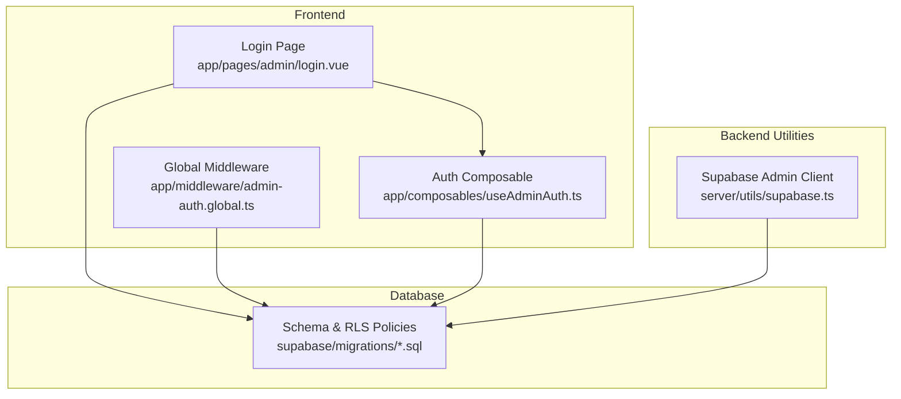
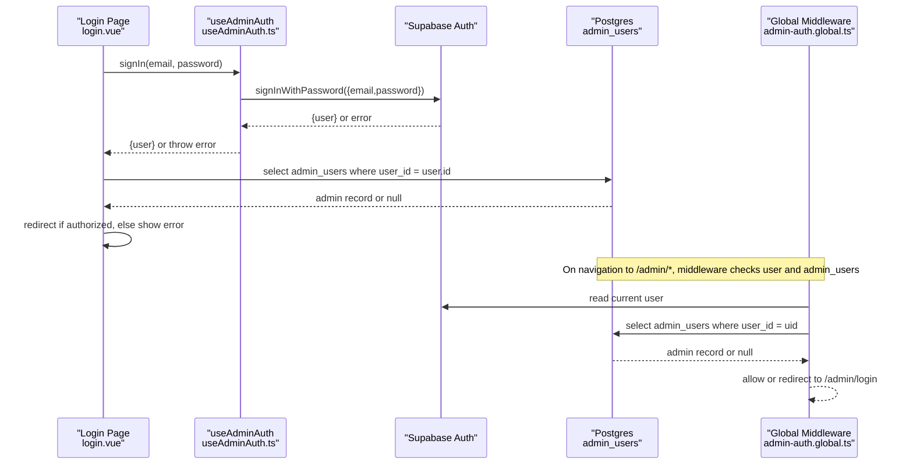
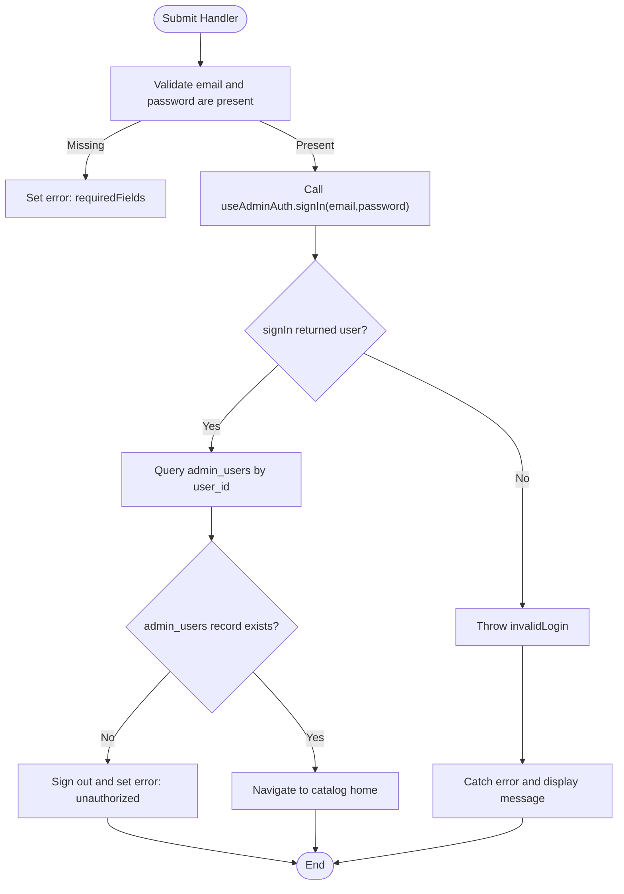
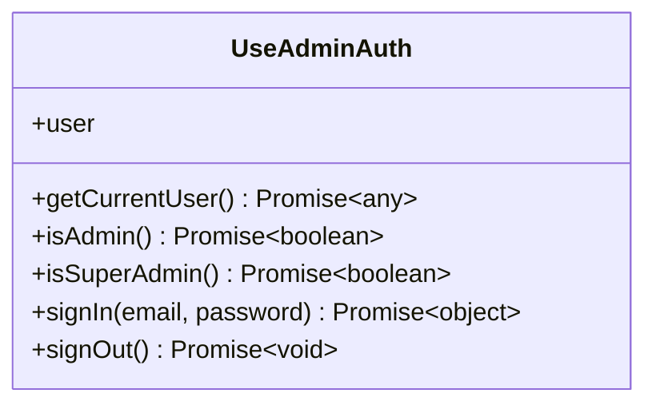
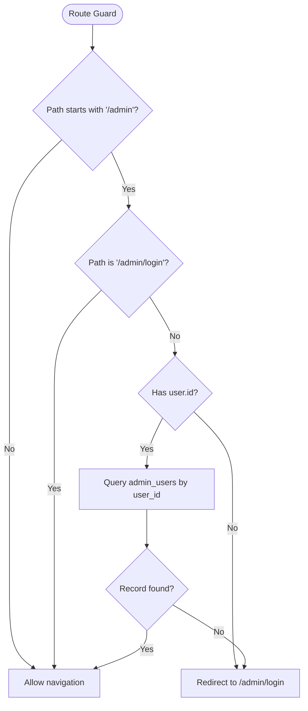
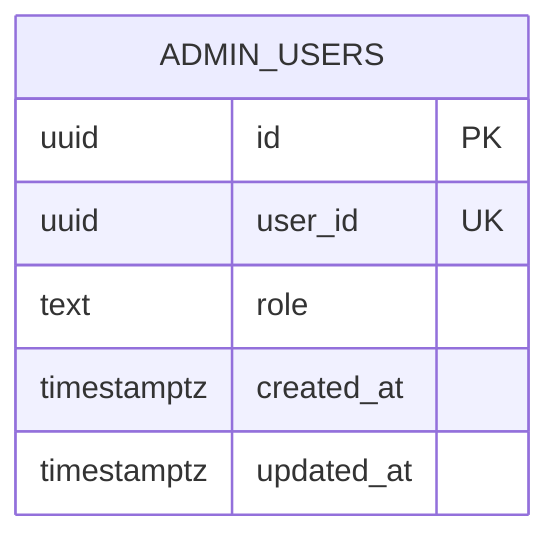
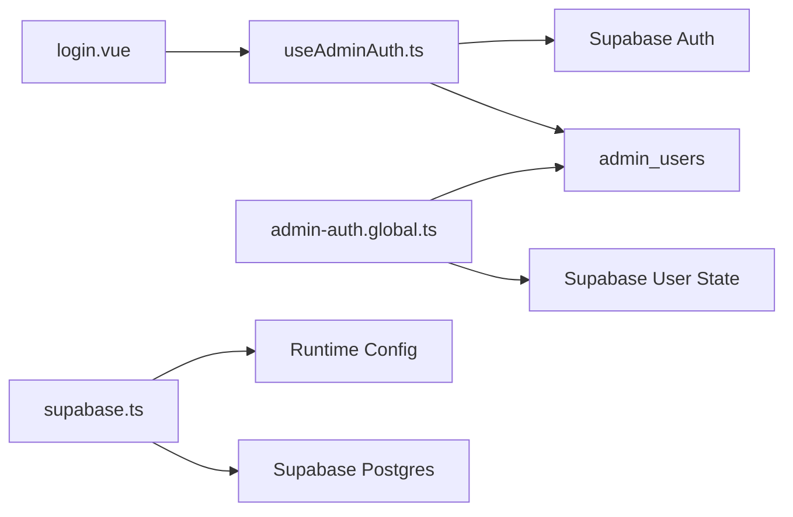

# Admin Authentication

<cite>
**Referenced Files in This Document**   
- [useAdminAuth.ts](file://app/composables/useAdminAuth.ts)
- [admin-auth.global.ts](file://app/middleware/admin-auth.global.ts)
- [login.vue](file://app/pages/admin/login.vue)
- [supabase.ts](file://server/utils/supabase.ts)
- [20260922_000001_create_catalog_schema.sql](file://supabase/migrations/20260922_000001_create_catalog_schema.sql)
- [20260922000002_storage_and_rls.sql](file://supabase/migrations/20260922000002_storage_and_rls.sql)
- [database.types.ts](file://app/types/database.types.ts)
</cite>

## Table of Contents
1. [Introduction](#introduction)
2. [Project Structure](#project-structure)
3. [Core Components](#core-components)
4. [Architecture Overview](#architecture-overview)
5. [Detailed Component Analysis](#detailed-component-analysis)
6. [Dependency Analysis](#dependency-analysis)
7. [Performance Considerations](#performance-considerations)
8. [Security Considerations](#security-considerations)
9. [Troubleshooting Guide](#troubleshooting-guide)
10. [Conclusion](#conclusion)

## Introduction
This document explains the admin authentication system for the application, focusing on user login, session management, and security implementation. It covers the login form component structure, email/password validation, Supabase authentication integration, the useAdminAuth composable’s signIn function, error handling patterns, and user role verification. It also documents the middleware that protects admin routes and enforces authorization checks, along with guidance for custom authentication flows, error handling, session management, and troubleshooting.

## Project Structure
The admin authentication spans a small set of focused files:
- Composable for auth logic and role checks
- Global middleware to protect admin routes
- Login page UI and flow
- Server-side utility for an admin-only Supabase client
- Database schema and Row Level Security policies

**Diagram sources**
- [login.vue:1-121](file://app/pages/admin/login.vue#L1-L121)
- [useAdminAuth.ts:1-79](file://app/composables/useAdminAuth.ts#L1-L79)
- [admin-auth.global.ts:1-28](file://app/middleware/admin-auth.global.ts#L1-L28)
- [supabase.ts:1-20](file://server/utils/supabase.ts#L1-L20)
- [20260922_000001_create_catalog_schema.sql:61-67](file://supabase/migrations/20260922_000001_create_catalog_schema.sql#L61-L67)
- [20260922000002_storage_and_rls.sql:40-160](file://supabase/migrations/20260922000002_storage_and_rls.sql#L40-L160)

**Section sources**
- [login.vue:1-121](file://app/pages/admin/login.vue#L1-L121)
- [useAdminAuth.ts:1-79](file://app/composables/useAdminAuth.ts#L1-L79)
- [admin-auth.global.ts:1-28](file://app/middleware/admin-auth.global.ts#L1-L28)
- [supabase.ts:1-20](file://server/utils/supabase.ts#L1-L20)
- [20260922_000001_create_catalog_schema.sql:61-67](file://supabase/migrations/20260922_000001_create_catalog_schema.sql#L61-L67)
- [20260922000002_storage_and_rls.sql:40-160](file://supabase/migrations/20260922000002_storage_and_rls.sql#L40-L160)

## Core Components
- useAdminAuth composable: Provides getCurrentUser, isAdmin, isSuperAdmin, signIn, signOut, and exposes the reactive user state.
- Admin login page: Renders the login form, validates inputs, calls signIn, verifies admin record, and handles errors.
- Global admin middleware: Guards /admin/* routes, ensures the user exists and has an admin_users record.
- Supabase admin client: Creates a server-side client using service role credentials for privileged operations (no session persistence).

Key responsibilities:
- User authentication via Supabase Auth
- Role-based authorization checks against admin_users
- Route protection for admin areas
- Centralized error handling and user feedback

**Section sources**
- [useAdminAuth.ts:1-79](file://app/composables/useAdminAuth.ts#L1-L79)
- [login.vue:1-121](file://app/pages/admin/login.vue#L1-L121)
- [admin-auth.global.ts:1-28](file://app/middleware/admin-auth.global.ts#L1-L28)
- [supabase.ts:1-20](file://server/utils/supabase.ts#L1-L20)

## Architecture Overview
The authentication architecture integrates frontend UI, composables, global middleware, and database-level policies.

**Diagram sources**
- [login.vue:15-54](file://app/pages/admin/login.vue#L15-L54)
- [useAdminAuth.ts:56-64](file://app/composables/useAdminAuth.ts#L56-L64)
- [admin-auth.global.ts:1-27](file://app/middleware/admin-auth.global.ts#L1-L27)
- [20260922_000001_create_catalog_schema.sql:61-67](file://supabase/migrations/20260922_000001_create_catalog_schema.sql#L61-L67)

## Detailed Component Analysis

### Login Form Component (app/pages/admin/login.vue)
Responsibilities:
- Binds email and password fields
- Validates required fields
- Calls useAdminAuth.signIn
- Verifies admin_users record exists for the authenticated user
- Handles success by navigating away; otherwise shows localized error messages

Validation and flow highlights:
- Required field check prevents empty submissions
- Error message resets before each attempt
- Submitting sets loading state and disables button during request
- After successful sign-in, it queries admin_users to ensure the user is authorized
- If no admin record is found, it signs out and displays an unauthorized message

Error handling:
- Catches thrown errors from signIn and maps them to user-facing messages
- Uses i18n keys for consistent messaging

Navigation:
- Redirects to catalog home after successful admin verification

**Diagram sources**
- [login.vue:15-54](file://app/pages/admin/login.vue#L15-L54)

**Section sources**
- [login.vue:1-121](file://app/pages/admin/login.vue#L1-L121)

### Auth Composable (app/composables/useAdminAuth.ts)
Responsibilities:
- Exposes getCurrentUser, isAdmin, isSuperAdmin, signIn, signOut
- Wraps Supabase Auth calls and admin_users lookups
- Returns reactive user state

Key functions:
- getCurrentUser: Fetches current user from Supabase Auth, falling back to reactive user state
- isAdmin: Checks existence of admin_users row for the current user
- isSuperAdmin: Checks if the current user’s role equals super_admin
- signIn: Delegates to Supabase Auth signInWithPassword and throws on error
- signOut: Delegates to Supabase Auth signOut and throws on error

Role verification:
- Both isAdmin and isSuperAdmin query admin_users by user_id and handle errors gracefully by returning false

**Diagram sources**
- [useAdminAuth.ts:3-77](file://app/composables/useAdminAuth.ts#L3-L77)

**Section sources**
- [useAdminAuth.ts:1-79](file://app/composables/useAdminAuth.ts#L1-L79)

### Global Admin Middleware (app/middleware/admin-auth.global.ts)
Responsibilities:
- Guards all /admin/* routes except /admin/login
- Ensures a logged-in user exists
- Verifies the user has an admin_users record
- Redirects unauthorized users to /admin/login

Behavior:
- Skips guard for non-admin paths and the login route
- Reads current user from Supabase
- Queries admin_users by user_id
- On missing record or error, redirects to /admin/login

**Diagram sources**
- [admin-auth.global.ts:1-27](file://app/middleware/admin-auth.global.ts#L1-L27)

**Section sources**
- [admin-auth.global.ts:1-28](file://app/middleware/admin-auth.global.ts#L1-L28)

### Supabase Admin Client (server/utils/supabase.ts)
Responsibilities:
- Creates a server-side Supabase client using service role credentials
- Disables session persistence and token auto-refresh for server usage

Configuration:
- Requires supabaseUrl and supabaseServiceRoleKey at runtime
- Throws if configuration is missing

Usage context:
- Intended for server-side privileged operations where admin privileges are needed without persisting sessions

**Section sources**
- [supabase.ts:1-20](file://server/utils/supabase.ts#L1-L20)

### Database Schema and Policies
- admin_users table: Stores admin roles per Supabase user
- Row Level Security (RLS): Enforces access control based on auth.uid() and admin role

Highlights:
- admin_users allows users to read their own record
- Admins can manage categories, translations, products, product images
- Only super_admin can manage admin_users
- Storage policies restrict uploads/updates/deletes to admins

**Diagram sources**
- [20260922_000001_create_catalog_schema.sql:61-67](file://supabase/migrations/20260922_000001_create_catalog_schema.sql#L61-L67)

**Section sources**
- [20260922_000001_create_catalog_schema.sql:61-67](file://supabase/migrations/20260922_000001_create_catalog_schema.sql#L61-L67)
- [20260922000002_storage_and_rls.sql:40-160](file://supabase/migrations/20260922000002_storage_and_rls.sql#L40-L160)

## Dependency Analysis
- Frontend components depend on Supabase client via Nuxt Supabase integration
- useAdminAuth depends on Supabase Auth and admin_users table
- Middleware depends on Supabase user state and admin_users table
- Server admin client depends on runtime config for service role key

**Diagram sources**
- [login.vue:1-121](file://app/pages/admin/login.vue#L1-L121)
- [useAdminAuth.ts:1-79](file://app/composables/useAdminAuth.ts#L1-L79)
- [admin-auth.global.ts:1-28](file://app/middleware/admin-auth.global.ts#L1-L28)
- [supabase.ts:1-20](file://server/utils/supabase.ts#L1-L20)
- [20260922_000001_create_catalog_schema.sql:61-67](file://supabase/migrations/20260922_000001_create_catalog_schema.sql#L61-L67)

**Section sources**
- [useAdminAuth.ts:1-79](file://app/composables/useAdminAuth.ts#L1-L79)
- [admin-auth.global.ts:1-28](file://app/middleware/admin-auth.global.ts#L1-L28)
- [login.vue:1-121](file://app/pages/admin/login.vue#L1-L121)
- [supabase.ts:1-20](file://server/utils/supabase.ts#L1-L20)

## Performance Considerations
- Minimize redundant admin_users queries by caching user role in local state when appropriate
- Avoid excessive network calls by batching admin checks where possible
- Prefer maybeSingle queries to reduce payload size
- Ensure indexes exist on frequently queried columns (e.g., admin_users.user_id)

[No sources needed since this section provides general guidance]

## Security Considerations
- Password hashing: Handled by Supabase Auth; do not implement custom hashing in the app
- Session management:
  - Browser sessions managed by Supabase Auth
  - Server-side admin client disables session persistence and token refresh
- Authorization:
  - Middleware enforces admin presence before allowing access to /admin/*
  - RLS policies enforce data access based on user identity and role
- Protection against common vulnerabilities:
  - Input validation on the client side reduces unnecessary requests
  - Server-side RLS prevents privilege escalation even if client logic is bypassed
  - Service role key should be kept secret and used only server-side

**Section sources**
- [admin-auth.global.ts:1-27](file://app/middleware/admin-auth.global.ts#L1-L27)
- [supabase.ts:13-18](file://server/utils/supabase.ts#L13-L18)
- [20260922000002_storage_and_rls.sql:40-160](file://supabase/migrations/20260922000002_storage_and_rls.sql#L40-L160)

## Troubleshooting Guide
Common issues and resolutions:
- Invalid credentials:
  - The login page catches errors from signIn and displays a localized message
  - Verify Supabase Auth configuration and user account status
- Unauthorized access:
  - If admin_users record is missing for the user, the login flow signs out and shows an unauthorized message
  - Ensure the user has an admin_users entry with a valid role
- Middleware redirect loops:
  - Confirm the middleware skips /admin/login and only guards /admin/* paths
  - Check that user.session exists and admin_users lookup succeeds
- Missing environment variables:
  - Server admin client throws if supabaseUrl or supabaseServiceRoleKey are missing
  - Ensure runtime config is correctly set in deployment

Debugging techniques:
- Inspect browser console for errors thrown by signIn and admin checks
- Review server logs for Supabase client initialization errors
- Validate RLS policies and admin_users records in the database
- Temporarily log user.id and admin record presence to verify middleware behavior

**Section sources**
- [login.vue:15-54](file://app/pages/admin/login.vue#L15-L54)
- [useAdminAuth.ts:28-33](file://app/composables/useAdminAuth.ts#L28-L33)
- [useAdminAuth.ts:48-53](file://app/composables/useAdminAuth.ts#L48-L53)
- [admin-auth.global.ts:12-26](file://app/middleware/admin-auth.global.ts#L12-L26)
- [supabase.ts:9-11](file://server/utils/supabase.ts#L9-L11)

## Conclusion
The admin authentication system combines a clear login UI, a robust composable for auth and role checks, global middleware for route protection, and strict database-level policies. This layered approach ensures secure, maintainable admin access while providing clear error handling and user feedback. For extended features, follow the established patterns: validate inputs, centralize auth logic in composables, protect routes with middleware, and enforce permissions with RLS.

[No sources needed since this section summarizes without analyzing specific files]