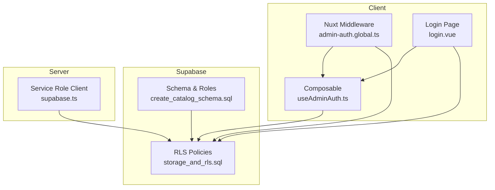
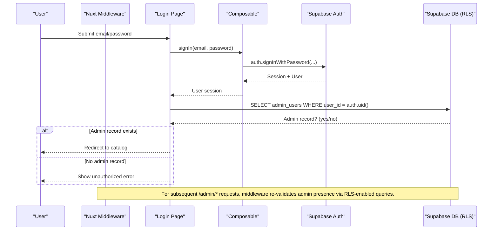
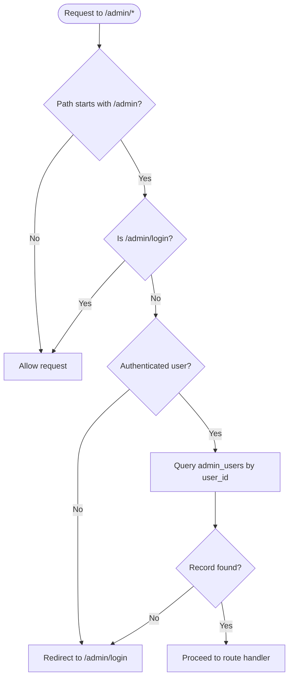
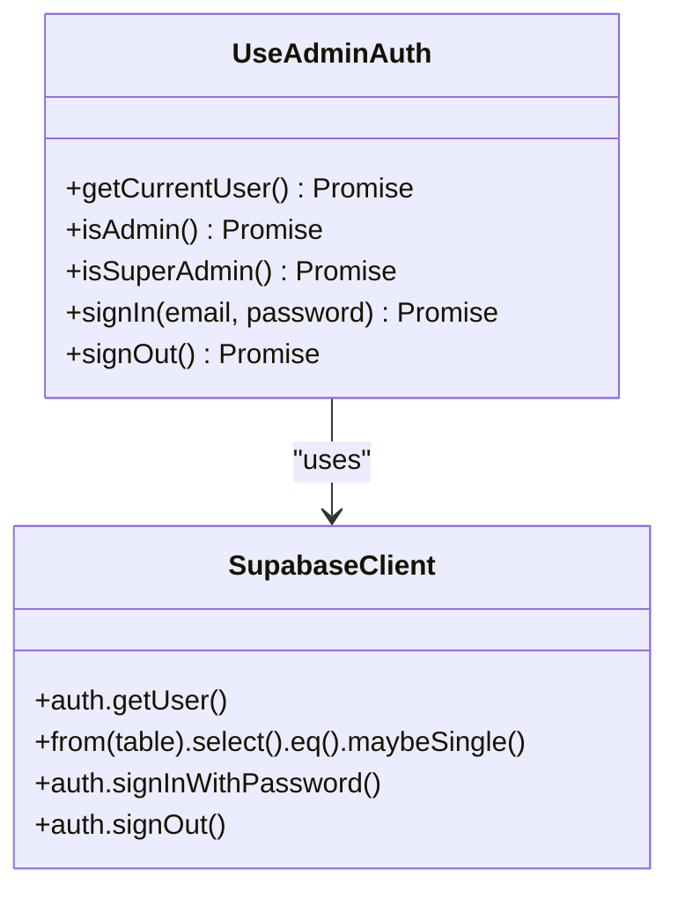
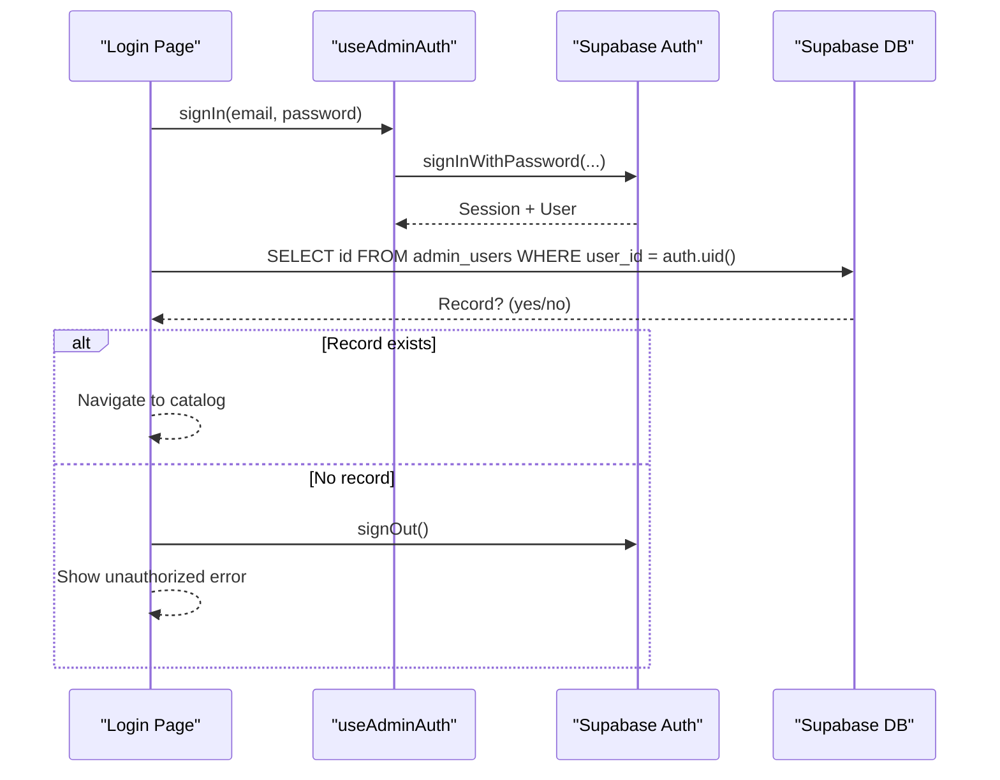
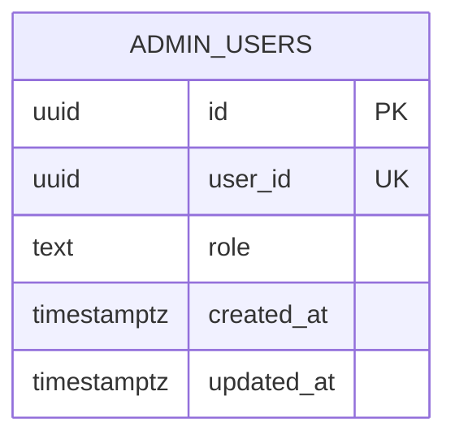
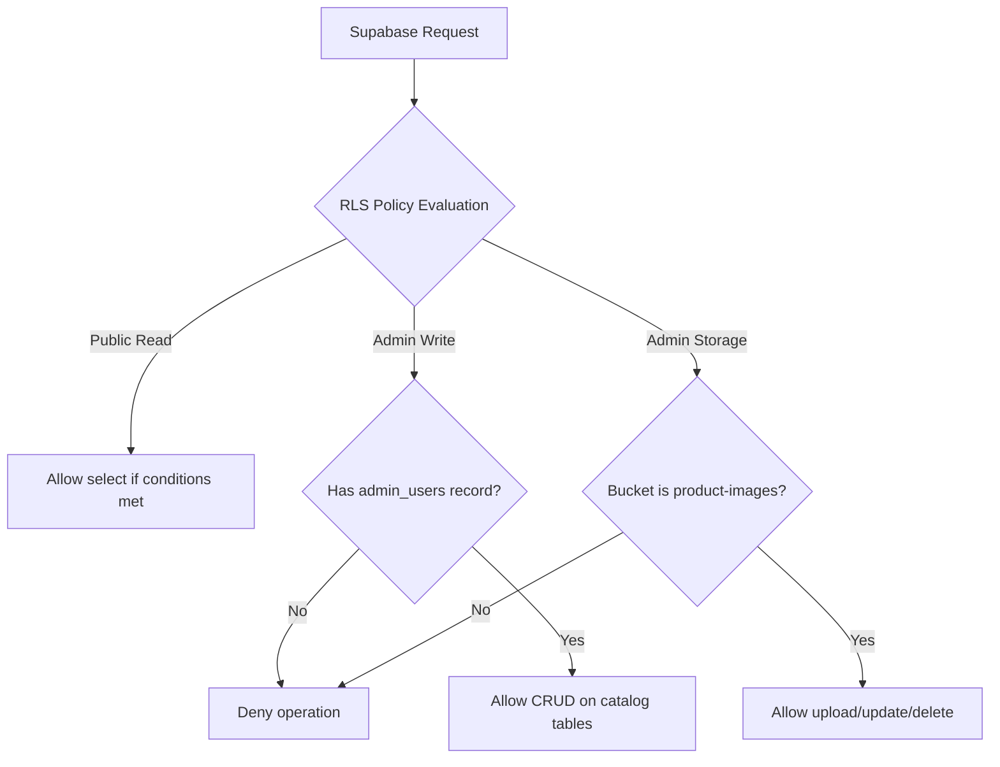
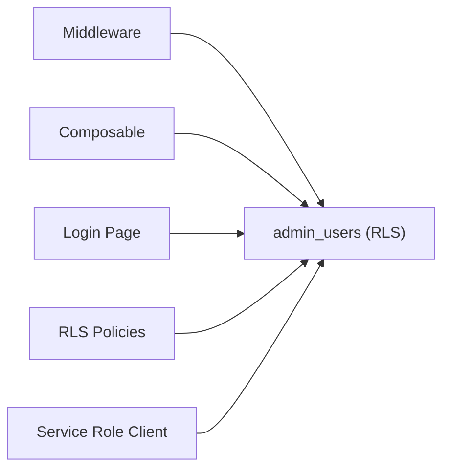

# Admin Authorization

<cite>
**Referenced Files in This Document**
- [useAdminAuth.ts](file://app/composables/useAdminAuth.ts)
- [admin-auth.global.ts](file://app/middleware/admin-auth.global.ts)
- [login.vue](file://app/pages/admin/login.vue)
- [create_catalog_schema.sql](file://supabase/migrations/20260922_000001_create_catalog_schema.sql)
- [storage_and_rls.sql](file://supabase/migrations/20260922000002_storage_and_rls.sql)
- [remove_recursive_admin_users_policy.sql](file://supabase/migrations/20260922073136_remove_recursive_admin_users_policy.sql)
- [database.ts](file://app/types/database.ts)
- [supabase.ts](file://server/utils/supabase.ts)
</cite>

## Table of Contents
1. [Introduction](#introduction)
2. [Project Structure](#project-structure)
3. [Core Components](#core-components)
4. [Architecture Overview](#architecture-overview)
5. [Detailed Component Analysis](#detailed-component-analysis)
6. [Dependency Analysis](#dependency-analysis)
7. [Performance Considerations](#performance-considerations)
8. [Troubleshooting Guide](#troubleshooting-guide)
9. [Conclusion](#conclusion)
10. [Appendices](#appendices)

## Introduction
This document explains the admin authorization system with a focus on role-based access control (RBAC) and permission management. It covers how requests are intercepted by middleware to validate admin privileges, the database schema for admin users and roles, and the end-to-end flow from login through route protection. It also provides guidance for implementing custom authorization rules, adding new admin roles, protecting administrative functions, security best practices, and troubleshooting techniques.

## Project Structure
The admin authorization spans client-side composables, Nuxt middleware, Supabase Row Level Security policies, and server utilities:
- Client-side composable for authentication and role checks
- Global Nuxt middleware guarding /admin routes
- Login page orchestrating sign-in and admin record verification
- Database schema defining admin users and roles
- Row Level Security policies enforcing data-level permissions
- Server utility for privileged service-role operations

**Diagram sources**
- [admin-auth.global.ts:1-28](file://app/middleware/admin-auth.global.ts#L1-L28)
- [useAdminAuth.ts:1-79](file://app/composables/useAdminAuth.ts#L1-L79)
- [login.vue:1-121](file://app/pages/admin/login.vue#L1-L121)
- [storage_and_rls.sql:1-205](file://supabase/migrations/20260922000002_storage_and_rls.sql#L1-L205)
- [create_catalog_schema.sql:61-67](file://supabase/migrations/20260922_000001_create_catalog_schema.sql#L61-L67)
- [supabase.ts:1-20](file://server/utils/supabase.ts#L1-L20)

**Section sources**
- [admin-auth.global.ts:1-28](file://app/middleware/admin-auth.global.ts#L1-L28)
- [useAdminAuth.ts:1-79](file://app/composables/useAdminAuth.ts#L1-L79)
- [login.vue:1-121](file://app/pages/admin/login.vue#L1-L121)
- [create_catalog_schema.sql:61-67](file://supabase/migrations/20260922_000001_create_catalog_schema.sql#L61-L67)
- [storage_and_rls.sql:1-205](file://supabase/migrations/20260922000002_storage_and_rls.sql#L1-L205)
- [supabase.ts:1-20](file://server/utils/supabase.ts#L1-L20)

## Core Components
- Authentication composable: Provides user retrieval, admin checks, and sign-in/sign-out flows.
- Route middleware: Guards /admin routes, enforces authenticated state, and validates admin presence.
- Login page: Handles credentials submission, verifies admin eligibility, and redirects appropriately.
- Database schema: Defines admin_users table with role constraints.
- Row Level Security: Enforces data access based on admin status and role.
- Server utility: Creates a service-role client for privileged backend operations.

**Section sources**
- [useAdminAuth.ts:1-79](file://app/composables/useAdminAuth.ts#L1-L79)
- [admin-auth.global.ts:1-28](file://app/middleware/admin-auth.global.ts#L1-L28)
- [login.vue:1-121](file://app/pages/admin/login.vue#L1-L121)
- [create_catalog_schema.sql:61-67](file://supabase/migrations/20260922_000001_create_catalog_schema.sql#L61-L67)
- [storage_and_rls.sql:40-160](file://supabase/migrations/20260922000002_storage_and_rls.sql#L40-L160)
- [supabase.ts:1-20](file://server/utils/supabase.ts#L1-L20)

## Architecture Overview
The authorization architecture combines client-side guards with server-side enforcement:
- Client-side: Middleware ensures only authenticated admins can access /admin routes. The composable exposes helpers to check admin or super-admin roles.
- Server-side: Supabase RLS policies restrict read/write access to catalog tables and storage objects based on admin membership and role.
- Privileged operations: A server-side service-role client bypasses RLS when necessary for administrative tasks.

**Diagram sources**
- [login.vue:15-54](file://app/pages/admin/login.vue#L15-L54)
- [useAdminAuth.ts:56-64](file://app/composables/useAdminAuth.ts#L56-L64)
- [admin-auth.global.ts:1-28](file://app/middleware/admin-auth.global.ts#L1-L28)
- [storage_and_rls.sql:40-160](file://supabase/migrations/20260922000002_storage_and_rls.sql#L40-L160)

## Detailed Component Analysis

### Middleware: Route Protection for /admin
- Intercepts all requests to paths starting with /admin except /admin/login.
- Checks if the current user is authenticated; if not, redirects to login.
- Queries admin_users to verify the user has an admin record; if missing, redirects to login.
- Errors during lookup are logged and treated as unauthorized.

**Diagram sources**
- [admin-auth.global.ts:1-28](file://app/middleware/admin-auth.global.ts#L1-L28)

**Section sources**
- [admin-auth.global.ts:1-28](file://app/middleware/admin-auth.global.ts#L1-L28)

### Composable: useAdminAuth
- getCurrentUser: Resolves the active user from Supabase Auth or local state.
- isAdmin: Verifies existence of an admin_users record for the current user.
- isSuperAdmin: Confirms the user’s role equals super_admin.
- signIn/signOut: Wraps Supabase Auth methods with error handling.

**Diagram sources**
- [useAdminAuth.ts:1-79](file://app/composables/useAdminAuth.ts#L1-L79)

**Section sources**
- [useAdminAuth.ts:1-79](file://app/composables/useAdminAuth.ts#L1-L79)

### Login Page: Admin Eligibility Verification
- Collects email and password, validates inputs, and calls signIn.
- After successful sign-in, checks for an admin_users record tied to the user.
- If no admin record exists, signs out and shows an unauthorized message.
- On success, navigates away from the login page.

**Diagram sources**
- [login.vue:15-54](file://app/pages/admin/login.vue#L15-L54)
- [useAdminAuth.ts:56-64](file://app/composables/useAdminAuth.ts#L56-L64)

**Section sources**
- [login.vue:1-121](file://app/pages/admin/login.vue#L1-L121)

### Database Schema: Admin Users and Roles
- admin_users table stores the mapping between Supabase Auth user IDs and admin roles.
- Role field is constrained to specific values, ensuring consistent role definitions.
- Updated timestamps are managed by triggers.

**Diagram sources**
- [create_catalog_schema.sql:61-67](file://supabase/migrations/20260922_000001_create_catalog_schema.sql#L61-L67)

**Section sources**
- [create_catalog_schema.sql:61-67](file://supabase/migrations/20260922_000001_create_catalog_schema.sql#L61-L67)
- [database.ts:69-75](file://app/types/database.ts#L69-L75)

### Row Level Security: Data-Level Permissions
- Public read policies allow browsing active categories and published products.
- Admin write policies require an admin_users record for the requesting user.
- Super-admin-only policy restricts managing admin_users to super_admin roles.
- Storage policies limit uploads/updates/deletes of product images to admins.

**Diagram sources**
- [storage_and_rls.sql:1-205](file://supabase/migrations/20260922000002_storage_and_rls.sql#L1-L205)

**Section sources**
- [storage_and_rls.sql:1-205](file://supabase/migrations/20260922000002_storage_and_rls.sql#L1-L205)

### Server Utility: Service Role Client
- Creates a Supabase client using the service role key to bypass RLS for privileged server-side operations.
- Validates configuration and disables session persistence and token refresh for server contexts.

**Section sources**
- [supabase.ts:1-20](file://server/utils/supabase.ts#L1-L20)

## Dependency Analysis
- Middleware depends on Supabase Auth and admin_users table via RLS policies.
- Composable depends on Supabase Auth and admin_users table for role checks.
- Login page depends on both Auth and admin_users table to enforce admin eligibility post-login.
- RLS policies depend on admin_users table to gate access to catalog resources and storage.

**Diagram sources**
- [admin-auth.global.ts:1-28](file://app/middleware/admin-auth.global.ts#L1-L28)
- [useAdminAuth.ts:1-79](file://app/composables/useAdminAuth.ts#L1-L79)
- [login.vue:1-121](file://app/pages/admin/login.vue#L1-L121)
- [storage_and_rls.sql:40-205](file://supabase/migrations/20260922000002_storage_and_rls.sql#L40-L205)
- [supabase.ts:1-20](file://server/utils/supabase.ts#L1-L20)

**Section sources**
- [admin-auth.global.ts:1-28](file://app/middleware/admin-auth.global.ts#L1-L28)
- [useAdminAuth.ts:1-79](file://app/composables/useAdminAuth.ts#L1-L79)
- [login.vue:1-121](file://app/pages/admin/login.vue#L1-L121)
- [storage_and_rls.sql:40-205](file://supabase/migrations/20260922000002_storage_and_rls.sql#L40-L205)
- [supabase.ts:1-20](file://server/utils/supabase.ts#L1-L20)

## Performance Considerations
- Minimize redundant admin checks: Cache user session state where appropriate and avoid repeated queries within the same request lifecycle.
- Prefer selective selects: Only query fields needed for authorization (e.g., id or role) to reduce payload size.
- Leverage indexes: Ensure queries against admin_users by user_id are indexed (already enforced by unique constraint).
- Batch operations: When updating multiple records server-side, use batched writes to reduce round trips.
- Avoid heavy computations in middleware: Keep middleware logic lightweight to prevent latency spikes on every protected route.

[No sources needed since this section provides general guidance]

## Troubleshooting Guide
Common issues and debugging steps:
- Unauthorized redirect on /admin routes:
  - Verify the user is authenticated and that an admin_users record exists for the user_id.
  - Check middleware logs for errors during admin lookup.
- Login succeeds but cannot access admin features:
  - Confirm admin_users entry exists and role is valid.
  - Validate RLS policies allow the requested operations for the user’s role.
- Storage operations fail for admins:
  - Ensure the bucket is product-images and the user has an admin_users record.
  - Review storage policies for insert/update/delete permissions.
- Service-role operations fail:
  - Confirm service role key and URL are configured correctly in runtime config.
  - Validate that the server client is created without session persistence.

Debugging techniques:
- Log authorization decisions at each step (middleware, composable, login flow).
- Inspect Supabase client responses and errors for failed queries or policy denials.
- Use Supabase dashboard to inspect RLS policy evaluations and audit logs if available.

**Section sources**
- [admin-auth.global.ts:12-27](file://app/middleware/admin-auth.global.ts#L12-L27)
- [useAdminAuth.ts:16-54](file://app/composables/useAdminAuth.ts#L16-L54)
- [login.vue:32-54](file://app/pages/admin/login.vue#L32-L54)
- [storage_and_rls.sql:162-205](file://supabase/migrations/20260922000002_storage_and_rls.sql#L162-L205)
- [supabase.ts:3-19](file://server/utils/supabase.ts#L3-L19)

## Conclusion
The admin authorization system combines client-side guards with robust server-side enforcement via Row Level Security. Middleware protects /admin routes, while RLS policies ensure data-level access aligns with admin roles. The schema defines clear role boundaries, and the server utility enables privileged operations when necessary. Following the recommended practices and troubleshooting steps will help maintain secure, performant, and auditable admin functionality.

[No sources needed since this section summarizes without analyzing specific files]

## Appendices

### Implementing Custom Authorization Rules
- Add a new role:
  - Extend the role constraint in the admin_users table migration to include the new role value.
  - Update TypeScript types to reflect the new role.
  - Adjust RLS policies to grant or restrict access based on the new role.
- Protect specific functions:
  - Wrap function calls with role checks using the composable’s isAdmin or isSuperAdmin helpers.
  - For server-side operations, enforce role checks before invoking service-role client methods.

**Section sources**
- [create_catalog_schema.sql:61-67](file://supabase/migrations/20260922_000001_create_catalog_schema.sql#L61-L67)
- [database.ts:12-12](file://app/types/database.ts#L12-L12)
- [storage_and_rls.sql:135-153](file://supabase/migrations/20260922000002_storage_and_rls.sql#L135-L153)
- [useAdminAuth.ts:16-54](file://app/composables/useAdminAuth.ts#L16-L54)

### Security Best Practices
- Enforce least privilege: Grant minimal permissions required per role.
- Prevent privilege escalation: Restrict admin_users management to super_admin via RLS.
- Audit changes: Enable audit logging for critical operations (e.g., role changes) using database triggers or external logging.
- Secure configuration: Store service role keys securely and never expose them to the client.
- Validate inputs: Always validate and sanitize inputs before performing sensitive operations.

**Section sources**
- [storage_and_rls.sql:135-153](file://supabase/migrations/20260922000002_storage_and_rls.sql#L135-L153)
- [supabase.ts:3-19](file://server/utils/supabase.ts#L3-L19)