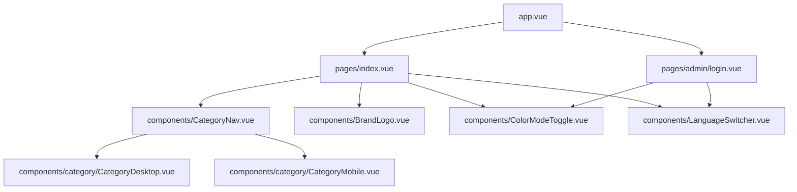
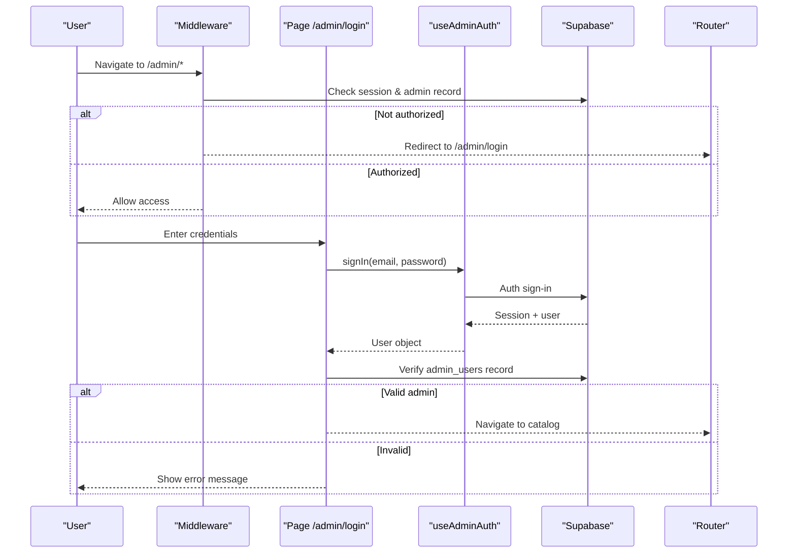
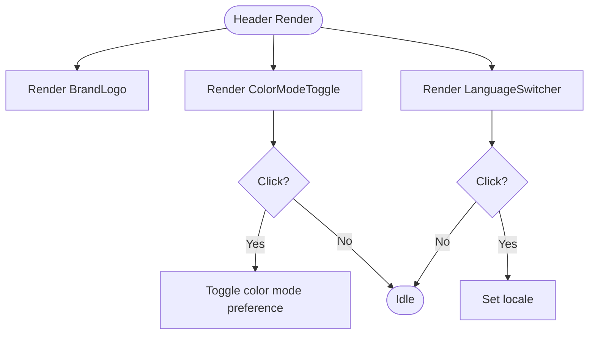
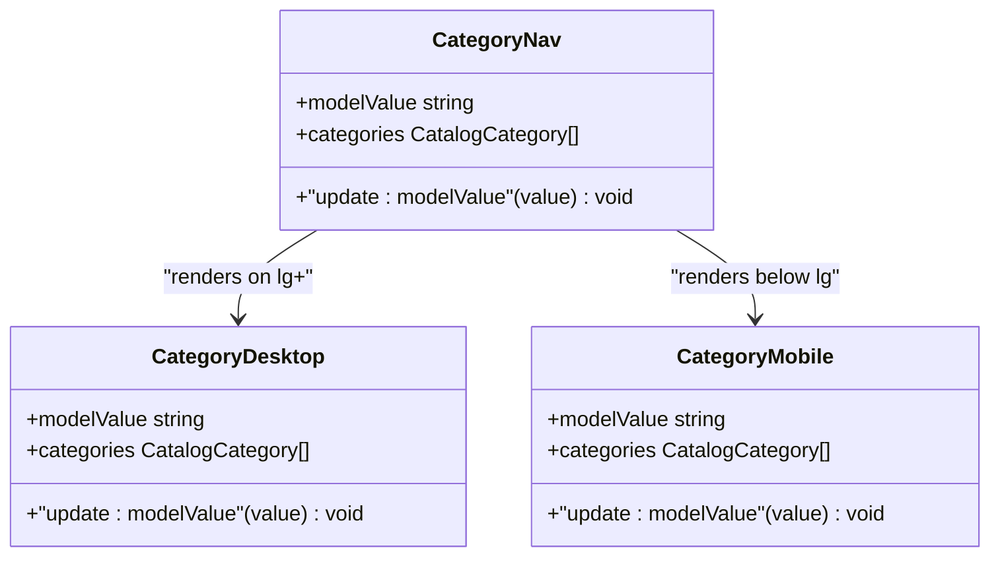
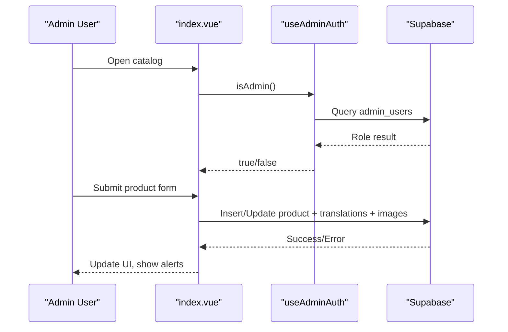
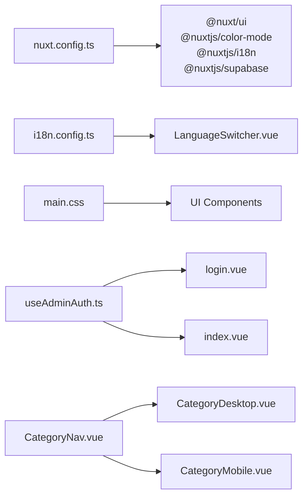

# Admin Dashboard

<cite>
**Referenced Files in This Document**
- [app.vue](file://app/app.vue)
- [index.vue](file://app/pages/index.vue)
- [login.vue](file://app/pages/admin/login.vue)
- [admin-auth.global.ts](file://app/middleware/admin-auth.global.ts)
- [useAdminAuth.ts](file://app/composables/useAdminAuth.ts)
- [CategoryNav.vue](file://app/components/CategoryNav.vue)
- [CategoryDesktop.vue](file://app/components/category/CategoryDesktop.vue)
- [CategoryMobile.vue](file://app/components/category/CategoryMobile.vue)
- [LanguageSwitcher.vue](file://app/components/LanguageSwitcher.vue)
- [ColorModeToggle.vue](file://app/components/ColorModeToggle.vue)
- [BrandLogo.vue](file://app/components/BrandLogo.vue)
- [AppLogo.vue](file://app/components/AppLogo.vue)
- [i18n.config.ts](file://i18n.config.ts)
- [nuxt.config.ts](file://nuxt.config.ts)
- [main.css](file://app/assets/css/main.css)
</cite>

## Table of Contents
1. [Introduction](#introduction)
2. [Project Structure](#project-structure)
3. [Core Components](#core-components)
4. [Architecture Overview](#architecture-overview)
5. [Detailed Component Analysis](#detailed-component-analysis)
6. [Dependency Analysis](#dependency-analysis)
7. [Performance Considerations](#performance-considerations)
8. [Troubleshooting Guide](#troubleshooting-guide)
9. [Conclusion](#conclusion)
10. [Appendices](#appendices)

## Introduction
This document explains the admin dashboard interface with a focus on workspace layout and navigation components. It covers the header (brand logo, language switcher, color mode toggle), responsive patterns (mobile-first), accessibility considerations, and strategies for extending the dashboard with new administrative features. It also outlines UX principles applied to administrative tasks, workflow optimization, and performance considerations for large datasets, along with guidelines for creating new admin pages and integrating them into the existing structure.

## Project Structure
The application is built with Nuxt 3 and uses a page-based routing model:
- Root app shell renders pages via a single root component.
- The main catalog/admin surface lives under pages/index.vue, which includes header controls, category navigation, product listing, and admin editing modals.
- Authentication is enforced globally for /admin routes using middleware, with a dedicated login page.
- Shared UI components include BrandLogo, ColorModeToggle, LanguageSwitcher, and CategoryNav (which delegates to desktop/mobile variants).

**Diagram sources**
- [app.vue:1-4](file://app/app.vue#L1-L4)
- [index.vue:191-221](file://app/pages/index.vue#L191-L221)
- [CategoryNav.vue:19-35](file://app/components/CategoryNav.vue#L19-L35)
- [CategoryDesktop.vue:425-608](file://app/components/category/CategoryDesktop.vue#L425-L608)
- [CategoryMobile.vue:405-575](file://app/components/category/CategoryMobile.vue#L405-L575)
- [BrandLogo.vue:7-31](file://app/components/BrandLogo.vue#L7-L31)
- [ColorModeToggle.vue:11-64](file://app/components/ColorModeToggle.vue#L11-L64)
- [LanguageSwitcher.vue:12-32](file://app/components/LanguageSwitcher.vue#L12-L32)

**Section sources**
- [app.vue:1-4](file://app/app.vue#L1-L4)
- [index.vue:191-221](file://app/pages/index.vue#L191-L221)
- [CategoryNav.vue:19-35](file://app/components/CategoryNav.vue#L19-L35)

## Core Components
- Header area:
  - BrandLogo displays light/dark logos based on theme size variants.
  - ColorModeToggle switches between light and dark modes with accessible labels and icons.
  - LanguageSwitcher toggles locale between English and Khmer with keyboard and screen reader support.
- Navigation:
  - CategoryNav provides a unified interface that renders a vertical dock on desktop and a fixed bottom bar on mobile.
  - Desktop variant supports drag-to-select and magnification effects; mobile variant supports touch drag and auto-scrolling to active item.
- Admin surface:
  - index.vue composes header, category navigation, search/sort, product grid, and admin modals for add/edit/delete.
  - Login page authenticates users and validates admin privileges before redirecting to the catalog.

Key responsibilities:
- Theme and i18n are global concerns handled by modules and composables.
- Category navigation encapsulates cross-device interaction patterns.
- Admin actions are gated by role checks and persisted through Supabase.

**Section sources**
- [BrandLogo.vue:1-33](file://app/components/BrandLogo.vue#L1-L33)
- [ColorModeToggle.vue:1-66](file://app/components/ColorModeToggle.vue#L1-L66)
- [LanguageSwitcher.vue:1-33](file://app/components/LanguageSwitcher.vue#L1-L33)
- [CategoryNav.vue:1-37](file://app/components/CategoryNav.vue#L1-L37)
- [CategoryDesktop.vue:1-611](file://app/components/category/CategoryDesktop.vue#L1-L611)
- [CategoryMobile.vue:1-577](file://app/components/category/CategoryMobile.vue#L1-L577)
- [index.vue:1-403](file://app/pages/index.vue#L1-L403)
- [login.vue:1-121](file://app/pages/admin/login.vue#L1-L121)

## Architecture Overview
The admin dashboard follows a layered architecture:
- Presentation layer: Vue components render UI and handle user interactions.
- Composables: Encapsulate auth state and business logic (e.g., useAdminAuth).
- Middleware: Enforces route-level authorization for /admin paths.
- Data layer: Interacts with Supabase for authentication, catalog data, and storage.

**Diagram sources**
- [admin-auth.global.ts:1-28](file://app/middleware/admin-auth.global.ts#L1-L28)
- [useAdminAuth.ts:1-79](file://app/composables/useAdminAuth.ts#L1-L79)
- [login.vue:15-54](file://app/pages/admin/login.vue#L15-L54)

**Section sources**
- [admin-auth.global.ts:1-28](file://app/middleware/admin-auth.global.ts#L1-L28)
- [useAdminAuth.ts:1-79](file://app/composables/useAdminAuth.ts#L1-L79)
- [login.vue:15-54](file://app/pages/admin/login.vue#L15-L54)

## Detailed Component Analysis

### Header Components
- BrandLogo: Renders light/dark images with size classes and accessible alt text.
- ColorModeToggle: Uses client-only rendering to avoid hydration mismatch; toggles preference and exposes accessible labels.
- LanguageSwitcher: Manages locale via i18n composable; keyboard navigable with visible focus rings.

**Diagram sources**
- [BrandLogo.vue:7-31](file://app/components/BrandLogo.vue#L7-L31)
- [ColorModeToggle.vue:11-64](file://app/components/ColorModeToggle.vue#L11-L64)
- [LanguageSwitcher.vue:12-32](file://app/components/LanguageSwitcher.vue#L12-L32)

**Section sources**
- [BrandLogo.vue:1-33](file://app/components/BrandLogo.vue#L1-L33)
- [ColorModeToggle.vue:1-66](file://app/components/ColorModeToggle.vue#L1-L66)
- [LanguageSwitcher.vue:1-33](file://app/components/LanguageSwitcher.vue#L1-L33)

### Category Navigation
- CategoryNav orchestrates responsive behavior:
  - Desktop: Vertical dock with drag-to-select and magnification.
  - Mobile: Fixed bottom bar with touch drag and auto-scroll to active item.
- Both variants emit selection updates to parent state.

**Diagram sources**
- [CategoryNav.vue:1-37](file://app/components/CategoryNav.vue#L1-L37)
- [CategoryDesktop.vue:425-608](file://app/components/category/CategoryDesktop.vue#L425-L608)
- [CategoryMobile.vue:405-575](file://app/components/category/CategoryMobile.vue#L405-L575)

**Section sources**
- [CategoryNav.vue:1-37](file://app/components/CategoryNav.vue#L1-L37)
- [CategoryDesktop.vue:1-611](file://app/components/category/CategoryDesktop.vue#L1-L611)
- [CategoryMobile.vue:1-577](file://app/components/category/CategoryMobile.vue#L1-L577)

### Admin Surface and Workflow
- index.vue composes:
  - Header with brand logo, theme toggle, language switcher, and admin mode indicator.
  - Category navigation and search/sort controls.
  - Product grid with admin edit modal and delete confirmation.
- Admin actions:
  - Add/Edit product form persists to Supabase tables and storage.
  - Delete flow removes product and associated records.
  - Admin mode toggled by role check; logout clears session.

**Diagram sources**
- [index.vue:134-183](file://app/pages/index.vue#L134-L183)
- [useAdminAuth.ts:16-34](file://app/composables/useAdminAuth.ts#L16-L34)

**Section sources**
- [index.vue:191-465](file://app/pages/index.vue#L191-L465)
- [useAdminAuth.ts:1-79](file://app/composables/useAdminAuth.ts#L1-L79)

### Accessibility Considerations
- Keyboard navigation: All interactive elements expose focus rings and roles (e.g., tabs for categories).
- Screen readers: aria-labels on controls; descriptive alt text on logos; aria-selected states for active items.
- Motion: Animations respect system preferences where applicable; transitions are subtle and purposeful.
- Contrast: Light/dark themes maintain sufficient contrast; focus indicators are visible in both modes.

**Section sources**
- [CategoryDesktop.vue:455-608](file://app/components/category/CategoryDesktop.vue#L455-L608)
- [CategoryMobile.vue:436-571](file://app/components/category/CategoryMobile.vue#L436-L571)
- [ColorModeToggle.vue:11-64](file://app/components/ColorModeToggle.vue#L11-L64)
- [LanguageSwitcher.vue:12-32](file://app/components/LanguageSwitcher.vue#L12-L32)

## Dependency Analysis
- Global configuration:
  - nuxt.config.ts enables modules for UI, color mode, i18n, and Supabase integration.
  - i18n.config.ts defines locales and messages used across components.
  - main.css sets typography, theme variables, and custom animations.
- Runtime dependencies:
  - useAdminAuth depends on Supabase client and user state.
  - Pages depend on composables and shared components.
  - Components rely on Tailwind utility classes and Nuxt UI primitives.

**Diagram sources**
- [nuxt.config.ts:1-52](file://nuxt.config.ts#L1-L52)
- [i18n.config.ts:1-14](file://i18n.config.ts#L1-L14)
- [main.css:1-106](file://app/assets/css/main.css#L1-L106)
- [useAdminAuth.ts:1-79](file://app/composables/useAdminAuth.ts#L1-L79)
- [login.vue:1-121](file://app/pages/admin/login.vue#L1-L121)
- [index.vue:1-403](file://app/pages/index.vue#L1-L403)
- [CategoryNav.vue:1-37](file://app/components/CategoryNav.vue#L1-L37)
- [CategoryDesktop.vue:1-611](file://app/components/category/CategoryDesktop.vue#L1-L611)
- [CategoryMobile.vue:1-577](file://app/components/category/CategoryMobile.vue#L1-L577)

**Section sources**
- [nuxt.config.ts:1-52](file://nuxt.config.ts#L1-L52)
- [i18n.config.ts:1-14](file://i18n.config.ts#L1-L14)
- [main.css:1-106](file://app/assets/css/main.css#L1-L106)

## Performance Considerations
- Client-only rendering for theme toggle avoids hydration mismatches and reduces initial JS overhead.
- Responsive navigation minimizes DOM complexity per breakpoint; only one variant is rendered at a time.
- Drag interactions use requestAnimationFrame and throttling to keep animations smooth.
- Data loading:
  - Parallel queries for categories and products reduce total load time.
  - Local filtering and sorting avoid extra network calls.
- Images:
  - Public URLs computed from storage paths; consider lazy-loading or pagination for large catalogs.
- Recommendations:
  - Implement server-side pagination for large product lists.
  - Debounce search input to limit re-renders.
  - Use virtualization for very long category lists or dense grids.
  - Cache frequently accessed catalog data in memory or browser storage when appropriate.

[No sources needed since this section provides general guidance]

## Troubleshooting Guide
- Authorization issues:
  - If /admin routes redirect unexpectedly, verify middleware checks and admin_users table entries.
  - Ensure Supabase keys and service role key are configured correctly.
- Login failures:
  - Check email/password validation and error messages displayed in the login form.
  - Confirm that admin record exists for the authenticated user.
- Data errors:
  - Inspect alert messages for catalog load or product save/delete errors.
  - Validate required fields in the editor form before submission.
- Theme and language:
  - If theme does not persist, ensure color mode module is enabled and cookie options are set.
  - If language does not switch, confirm i18n module and locale detection settings.

**Section sources**
- [admin-auth.global.ts:1-28](file://app/middleware/admin-auth.global.ts#L1-L28)
- [login.vue:15-54](file://app/pages/admin/login.vue#L15-L54)
- [index.vue:46-56](file://app/pages/index.vue#L46-L56)
- [index.vue:134-183](file://app/pages/index.vue#L134-L183)
- [nuxt.config.ts:16-26](file://nuxt.config.ts#L16-L26)
- [nuxt.config.ts:32-50](file://nuxt.config.ts#L32-L50)

## Conclusion
The admin dashboard combines a clean, accessible header with a responsive category navigation and a robust admin surface for managing products. The architecture leverages Nuxt modules for theme, i18n, and Supabase integration, while middleware ensures secure access to admin routes. Extensibility is straightforward: add new admin pages under /admin, gate them with middleware, and integrate them into the existing header or navigation patterns. For large datasets, adopt pagination, caching, and virtualization to maintain performance.

[No sources needed since this section summarizes without analyzing specific files]

## Appendices

### Guidelines for Creating New Admin Pages
- Place new pages under app/pages/admin/ and ensure they are protected by the global middleware.
- Reuse shared components:
  - BrandLogo for branding consistency.
  - ColorModeToggle and LanguageSwitcher for header controls.
  - CategoryNav if you need category-based workflows.
- Follow established patterns:
  - Use forms with clear labels, validation, and accessible error messages.
  - Provide loading states and success/error feedback.
  - Keep interactions consistent with existing UI (pill-shaped controls, focus rings, transitions).
- Integrate with Supabase:
  - Use typed clients and composables for data operations.
  - Handle errors gracefully and display user-friendly messages.

**Section sources**
- [admin-auth.global.ts:1-28](file://app/middleware/admin-auth.global.ts#L1-L28)
- [index.vue:191-221](file://app/pages/index.vue#L191-L221)
- [login.vue:60-121](file://app/pages/admin/login.vue#L60-L121)

### Extending the Dashboard with Custom Navigation Elements
- To add a new top-level action:
  - Insert a button or link in the header area alongside ColorModeToggle and LanguageSwitcher.
  - Use consistent styling (rounded-full, shadow-xs) and accessible labels.
- To add a sidebar item:
  - Extend CategoryNav’s data model or create a new nav component following the same pattern.
  - Emit selection changes to update application state.

**Section sources**
- [index.vue:191-221](file://app/pages/index.vue#L191-L221)
- [CategoryNav.vue:19-35](file://app/components/CategoryNav.vue#L19-L35)

### UX Principles Applied
- Clarity: Clear headings, concise labels, and contextual hints.
- Consistency: Unified design tokens and interaction patterns across components.
- Efficiency: Quick access to common actions (add product, search, sort).
- Feedback: Immediate visual feedback for actions (loading states, alerts).
- Accessibility: Keyboard navigation, screen reader support, and high-contrast themes.

[No sources needed since this section provides general guidance]