# Admin Interface

<cite>
**Referenced Files in This Document**
- [login.vue](file://app/pages/admin/login.vue)
- [useAdminAuth.ts](file://app/composables/useAdminAuth.ts)
- [admin-auth.global.ts](file://app/middleware/admin-auth.global.ts)
- [supabase.ts](file://server/utils/supabase.ts)
- [20260922_000001_create_catalog_schema.sql](file://supabase/migrations/20260922_000001_create_catalog_schema.sql)
- [20260922000002_storage_and_rls.sql](file://supabase/migrations/20260922000002_storage_and_rls.sql)
- [nuxt.config.ts](file://nuxt.config.ts)
- [useCatalog.ts](file://app/composables/useCatalog.ts)
- [catalog.ts](file://app/types/catalog.ts)
- [i18n.config.ts](file://i18n.config.ts)
</cite>

## Table of Contents
1. [Introduction](#introduction)
2. [Project Structure](#project-structure)
3. [Core Components](#core-components)
4. [Architecture Overview](#architecture-overview)
5. [Detailed Component Analysis](#detailed-component-analysis)
6. [Dependency Analysis](#dependency-analysis)
7. [Performance Considerations](#performance-considerations)
8. [Troubleshooting Guide](#troubleshooting-guide)
9. [Conclusion](#conclusion)
10. [Appendices](#appendices)

## Introduction
This document explains the admin interface for administrative functionality and user management. It covers the admin dashboard structure, authentication flow, role-based access control (RBAC), login system, session management, security measures, product and category administration, inventory control, UX considerations, extensibility guidelines, and troubleshooting techniques. The implementation uses a Nuxt 3 frontend with Supabase for authentication, database, storage, and Row Level Security (RLS).

## Project Structure
The admin interface is implemented as part of a Nuxt application:
- Authentication UI and logic are under app/pages/admin and app/composables.
- Route-level protection is implemented via a global middleware.
- Data models and RLS policies are defined in Supabase migrations.
- Catalog data composable provides read-only public catalog operations; admin write paths rely on RLS and roles.

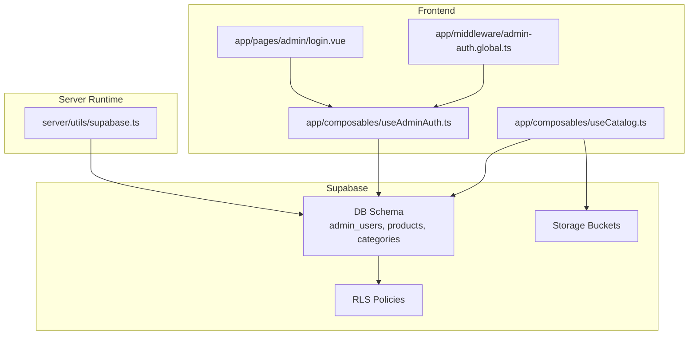

**Diagram sources**
- [login.vue:1-121](file://app/pages/admin/login.vue#L1-L121)
- [useAdminAuth.ts:1-79](file://app/composables/useAdminAuth.ts#L1-L79)
- [admin-auth.global.ts:1-28](file://app/middleware/admin-auth.global.ts#L1-L28)
- [useCatalog.ts:1-61](file://app/composables/useCatalog.ts#L1-L61)
- [supabase.ts:1-20](file://server/utils/supabase.ts#L1-L20)
- [20260922_000001_create_catalog_schema.sql:61-67](file://supabase/migrations/20260922_000001_create_catalog_schema.sql#L61-L67)
- [20260922000002_storage_and_rls.sql:1-205](file://supabase/migrations/20260922000002_storage_and_rls.sql#L1-L205)

**Section sources**
- [login.vue:1-121](file://app/pages/admin/login.vue#L1-L121)
- [useAdminAuth.ts:1-79](file://app/composables/useAdminAuth.ts#L1-L79)
- [admin-auth.global.ts:1-28](file://app/middleware/admin-auth.global.ts#L1-L28)
- [nuxt.config.ts:1-52](file://nuxt.config.ts#L1-L52)

## Core Components
- Admin Login Page: Provides email/password input, calls sign-in, verifies admin role, and redirects to catalog or shows errors.
- Admin Auth Composable: Encapsulates current user retrieval, admin checks, super-admin checks, sign-in, and sign-out.
- Global Admin Middleware: Guards /admin/* routes, enforces authentication and admin presence before rendering.
- Server-side Supabase Admin Client: Creates a service-role client for privileged server operations.
- Database Schema and RLS: Defines admin_users table and policies controlling read/write access based on roles.
- Catalog Composable: Public read operations for products and categories used by the storefront; admin write operations are enforced by RLS.

Key responsibilities:
- Authentication and authorization are centralized in useAdminAuth and the global middleware.
- RBAC is enforced both at the route level and at the database level via RLS.
- Session persistence and cookie settings are configured in Nuxt config.

**Section sources**
- [login.vue:1-121](file://app/pages/admin/login.vue#L1-L121)
- [useAdminAuth.ts:1-79](file://app/composables/useAdminAuth.ts#L1-L79)
- [admin-auth.global.ts:1-28](file://app/middleware/admin-auth.global.ts#L1-L28)
- [supabase.ts:1-20](file://server/utils/supabase.ts#L1-L20)
- [20260922_000001_create_catalog_schema.sql:61-67](file://supabase/migrations/20260922_000001_create_catalog_schema.sql#L61-L67)
- [20260922000002_storage_and_rls.sql:40-160](file://supabase/migrations/20260922000002_storage_and_rls.sql#L40-L160)
- [nuxt.config.ts:16-26](file://nuxt.config.ts#L16-L26)

## Architecture Overview
The admin interface follows a layered architecture:
- Presentation Layer: Vue components for login and future admin pages.
- Application Layer: Composables encapsulate business logic (auth, catalog).
- Infrastructure Layer: Supabase handles auth, DB, storage, and RLS.

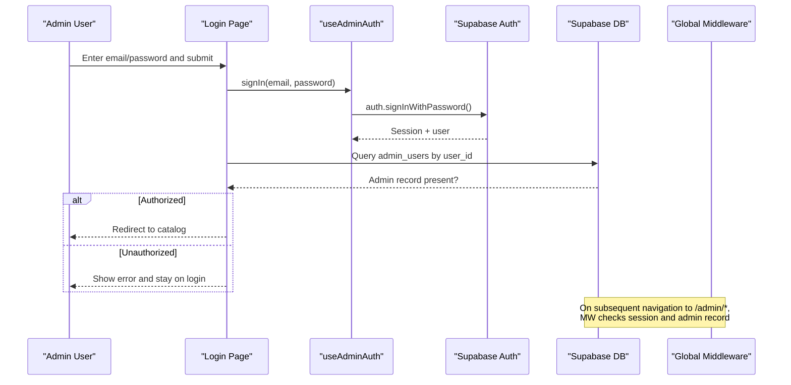

**Diagram sources**
- [login.vue:15-54](file://app/pages/admin/login.vue#L15-L54)
- [useAdminAuth.ts:56-64](file://app/composables/useAdminAuth.ts#L56-L64)
- [admin-auth.global.ts:1-28](file://app/middleware/admin-auth.global.ts#L1-L28)

## Detailed Component Analysis

### Admin Login Flow
The login page validates inputs, invokes sign-in, verifies admin status, and navigates accordingly. Errors are surfaced to the user with localized messages.

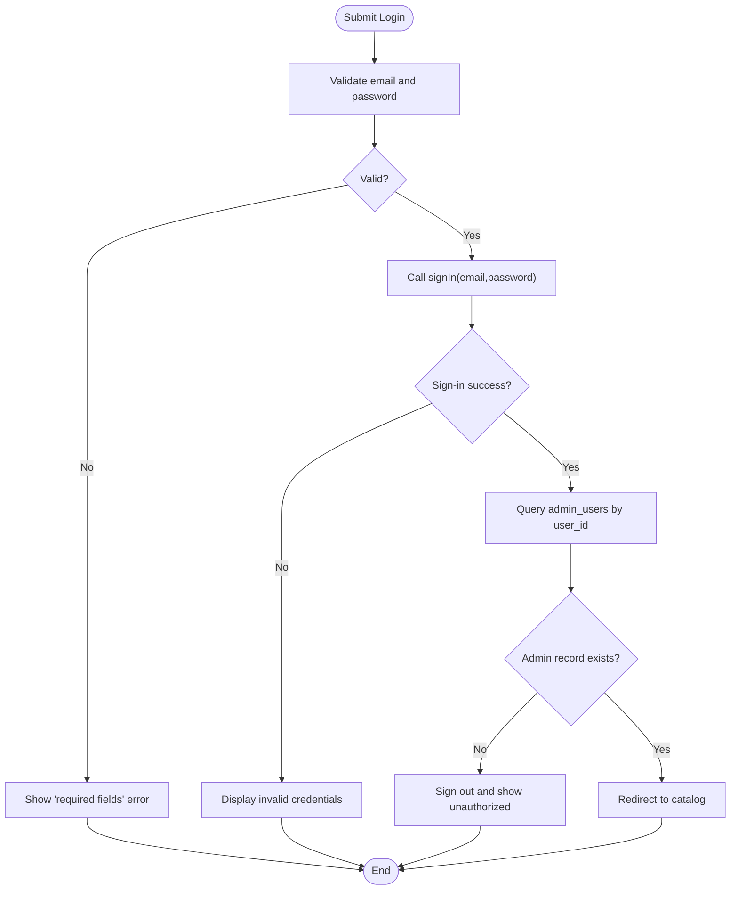

**Diagram sources**
- [login.vue:15-54](file://app/pages/admin/login.vue#L15-L54)

**Section sources**
- [login.vue:1-121](file://app/pages/admin/login.vue#L1-L121)
- [i18n.config.ts:5-11](file://i18n.config.ts#L5-L11)

### Authentication and Role Checks
The admin auth composable centralizes:
- Getting the current user
- Checking if the user is an admin
- Checking if the user is a super_admin
- Signing in and signing out

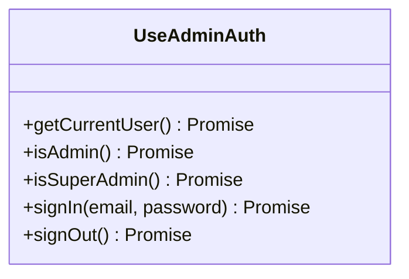

**Diagram sources**
- [useAdminAuth.ts:3-77](file://app/composables/useAdminAuth.ts#L3-L77)

**Section sources**
- [useAdminAuth.ts:1-79](file://app/composables/useAdminAuth.ts#L1-L79)

### Route Protection (Global Middleware)
All routes under /admin are guarded. If the user is not authenticated or lacks an admin record, they are redirected to the login page.

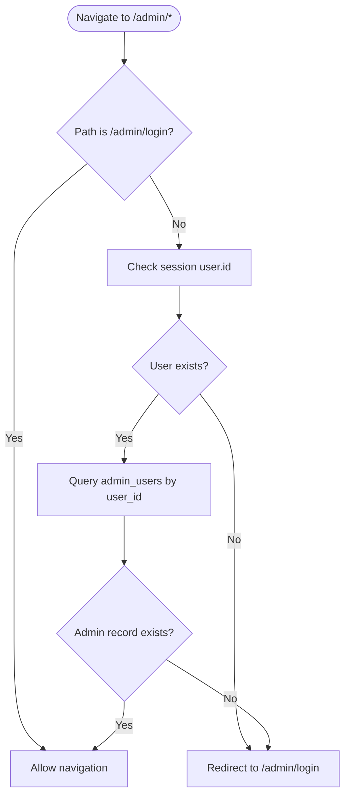

**Diagram sources**
- [admin-auth.global.ts:1-28](file://app/middleware/admin-auth.global.ts#L1-L28)

**Section sources**
- [admin-auth.global.ts:1-28](file://app/middleware/admin-auth.global.ts#L1-L28)

### Data Model and RBAC
- admin_users stores admin identities and roles (admin, super_admin).
- RLS policies restrict CRUD operations based on admin presence and role.
- Super-admins can manage admin users; regular admins can manage catalog content.

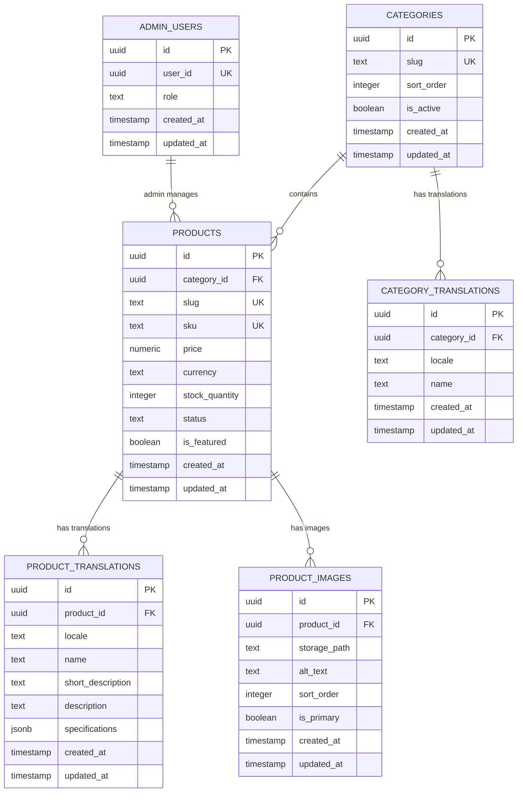

**Diagram sources**
- [20260922_000001_create_catalog_schema.sql:3-67](file://supabase/migrations/20260922_000001_create_catalog_schema.sql#L3-L67)
- [20260922000002_storage_and_rls.sql:40-160](file://supabase/migrations/20260922000002_storage_and_rls.sql#L40-L160)

**Section sources**
- [20260922_000001_create_catalog_schema.sql:61-67](file://supabase/migrations/20260922_000001_create_catalog_schema.sql#L61-L67)
- [20260922000002_storage_and_rls.sql:40-160](file://supabase/migrations/20260922000002_storage_and_rls.sql#L40-L160)

### Product Management Interface
- Read-only catalog operations are provided by useCatalog for the storefront.
- Admin write operations should be implemented using Supabase clients with RLS enforcement.
- Product statuses include draft, published, archived; only published items are visible publicly.

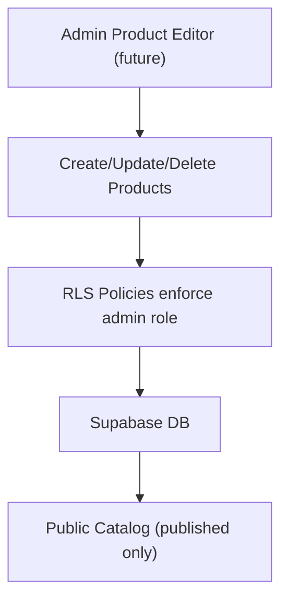

**Diagram sources**
- [useCatalog.ts:37-47](file://app/composables/useCatalog.ts#L37-L47)
- [20260922000002_storage_and_rls.sql:81-115](file://supabase/migrations/20260922000002_storage_and_rls.sql#L81-L115)

**Section sources**
- [useCatalog.ts:1-61](file://app/composables/useCatalog.ts#L1-L61)
- [catalog.ts:1-31](file://app/types/catalog.ts#L1-L31)
- [20260922_000001_create_catalog_schema.sql:22-47](file://supabase/migrations/20260922_000001_create_catalog_schema.sql#L22-L47)

### Category Administration
- Categories are active/inactive and support translations per locale.
- Admins can manage categories and their translations via RLS policies.

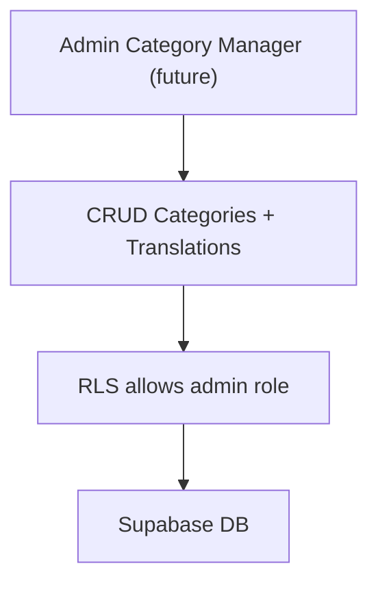

**Diagram sources**
- [20260922000002_storage_and_rls.sql:45-79](file://supabase/migrations/20260922000002_storage_and_rls.sql#L45-L79)
- [20260922_000001_create_catalog_schema.sql:3-20](file://supabase/migrations/20260922_000001_create_catalog_schema.sql#L3-L20)

**Section sources**
- [20260922_000001_create_catalog_schema.sql:3-20](file://supabase/migrations/20260922_000001_create_catalog_schema.sql#L3-L20)
- [20260922000002_storage_and_rls.sql:45-79](file://supabase/migrations/20260922000002_storage_and_rls.sql#L45-L79)

### Inventory Control
- Stock quantity is tracked per product with constraints ensuring non-negative values.
- Status controls visibility; only published products are shown to the public.

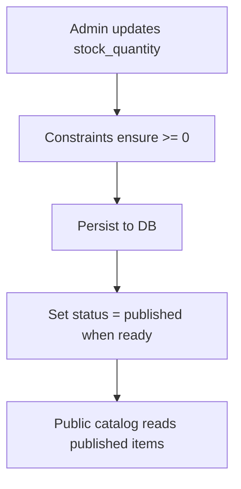

**Diagram sources**
- [20260922_000001_create_catalog_schema.sql:22-34](file://supabase/migrations/20260922_000001_create_catalog_schema.sql#L22-L34)
- [20260922000002_storage_and_rls.sql:11-14](file://supabase/migrations/20260922000002_storage_and_rls.sql#L11-L14)

**Section sources**
- [20260922_000001_create_catalog_schema.sql:22-34](file://supabase/migrations/20260922_000001_create_catalog_schema.sql#L22-L34)
- [20260922000002_storage_and_rls.sql:11-14](file://supabase/migrations/20260922000002_storage_and_rls.sql#L11-L14)

### Session Management and Security
- Sessions are managed by Supabase Auth with cookies configured in Nuxt config.
- Service-role client is available for server-side privileged operations.
- RLS ensures that even if client code attempts unauthorized writes, the database rejects them.

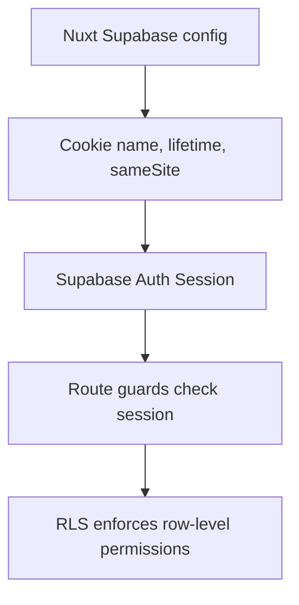

**Diagram sources**
- [nuxt.config.ts:16-26](file://nuxt.config.ts#L16-L26)
- [admin-auth.global.ts:1-28](file://app/middleware/admin-auth.global.ts#L1-L28)
- [20260922000002_storage_and_rls.sql:155-160](file://supabase/migrations/20260922000002_storage_and_rls.sql#L155-L160)

**Section sources**
- [nuxt.config.ts:16-26](file://nuxt.config.ts#L16-L26)
- [supabase.ts:1-20](file://server/utils/supabase.ts#L1-L20)
- [20260922000002_storage_and_rls.sql:155-160](file://supabase/migrations/20260922000002_storage_and_rls.sql#L155-L160)

### Extending Admin Functionality
Guidelines for adding new admin features:
- Add a new route under app/pages/admin and protect it with the existing global middleware.
- Implement feature-specific composables following the pattern in useAdminAuth and useCatalog.
- Define any new tables and relationships in migrations; add corresponding RLS policies.
- Use i18n keys for all user-facing strings.
- For server-side privileged operations, use createSupabaseAdminClient from server/utils/supabase.ts.

Security best practices:
- Always enforce permissions via RLS; never trust client-side checks alone.
- Avoid exposing service-role keys to the browser; keep them server-only.
- Validate and sanitize all inputs before writing to the database.
- Log errors without leaking sensitive details.

**Section sources**
- [useAdminAuth.ts:1-79](file://app/composables/useAdminAuth.ts#L1-L79)
- [useCatalog.ts:1-61](file://app/composables/useCatalog.ts#L1-L61)
- [supabase.ts:1-20](file://server/utils/supabase.ts#L1-L20)
- [i18n.config.ts:5-11](file://i18n.config.ts#L5-L11)

## Dependency Analysis
High-level dependencies among core files:

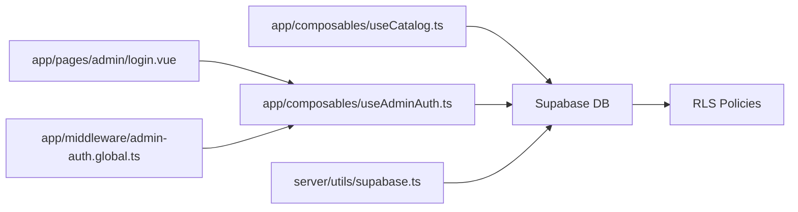

**Diagram sources**
- [login.vue:1-121](file://app/pages/admin/login.vue#L1-L121)
- [useAdminAuth.ts:1-79](file://app/composables/useAdminAuth.ts#L1-L79)
- [admin-auth.global.ts:1-28](file://app/middleware/admin-auth.global.ts#L1-L28)
- [useCatalog.ts:1-61](file://app/composables/useCatalog.ts#L1-L61)
- [supabase.ts:1-20](file://server/utils/supabase.ts#L1-L20)
- [20260922000002_storage_and_rls.sql:1-205](file://supabase/migrations/20260922000002_storage_and_rls.sql#L1-L205)

**Section sources**
- [login.vue:1-121](file://app/pages/admin/login.vue#L1-L121)
- [useAdminAuth.ts:1-79](file://app/composables/useAdminAuth.ts#L1-L79)
- [admin-auth.global.ts:1-28](file://app/middleware/admin-auth.global.ts#L1-L28)
- [useCatalog.ts:1-61](file://app/composables/useCatalog.ts#L1-L61)
- [supabase.ts:1-20](file://server/utils/supabase.ts#L1-L20)

## Performance Considerations
- Prefer minimal queries: select only needed columns and use indexes already defined (e.g., idx_products_status, idx_categories_slug).
- Cache static catalog data where appropriate to reduce repeated network requests.
- Avoid unnecessary re-renders in admin forms by leveraging reactive state efficiently.
- Use pagination for large datasets in admin lists (to be implemented in future admin pages).
- Keep RLS conditions simple and indexed to avoid slow policy evaluations.

[No sources needed since this section provides general guidance]

## Troubleshooting Guide
Common issues and resolutions:
- Invalid login or unauthorized access:
  - Verify credentials and ensure the user has a corresponding admin_users record.
  - Check that the admin_users query returns a record for the authenticated user.
- Route redirection loops:
  - Ensure the global middleware correctly skips /admin/login and redirects unauthenticated users.
- Missing environment configuration:
  - Confirm Supabase URL and keys are set in runtime config and cookie options.
- Storage upload failures:
  - Verify storage policies allow admin uploads to the product-images bucket.
- RLS blocking writes:
  - Confirm the authenticated user has an admin_users entry; super_admin is required for managing admin_users.

Debugging tips:
- Inspect console logs for auth and RLS errors.
- Test queries directly in Supabase SQL editor to validate policies.
- Temporarily log user.id and role during development to verify identity resolution.

**Section sources**
- [login.vue:15-54](file://app/pages/admin/login.vue#L15-L54)
- [admin-auth.global.ts:12-26](file://app/middleware/admin-auth.global.ts#L12-L26)
- [nuxt.config.ts:9-26](file://nuxt.config.ts#L9-L26)
- [20260922000002_storage_and_rls.sql:162-205](file://supabase/migrations/20260922000002_storage_and_rls.sql#L162-L205)
- [20260922000002_storage_and_rls.sql:135-153](file://supabase/migrations/20260922000002_storage_and_rls.sql#L135-L153)

## Conclusion
The admin interface leverages Supabase Auth, RLS, and a Nuxt global middleware to provide secure, role-based administrative capabilities. The login flow validates credentials and admin status, while RLS enforces fine-grained permissions at the database layer. Future admin pages should follow the established patterns for auth, data access, and localization, and should always rely on RLS for security. Proper configuration, clear error handling, and thoughtful UX will streamline administrative workflows and maintain high security standards.

[No sources needed since this section summarizes without analyzing specific files]

## Appendices

### Configuration Reference
- Runtime config exposes Supabase URL and service role key.
- Supabase module config sets redirect behavior, cookie name, lifetime, and sameSite.
- i18n defines English and Khmer locales with admin-related messages.

**Section sources**
- [nuxt.config.ts:9-26](file://nuxt.config.ts#L9-L26)
- [i18n.config.ts:5-11](file://i18n.config.ts#L5-L11)