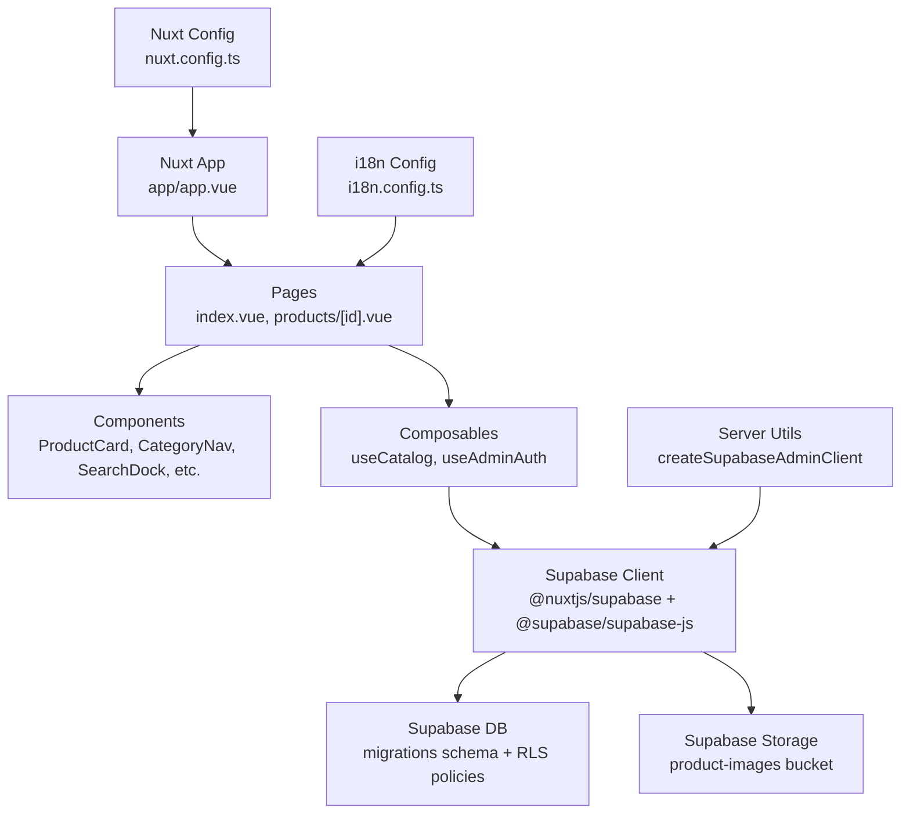
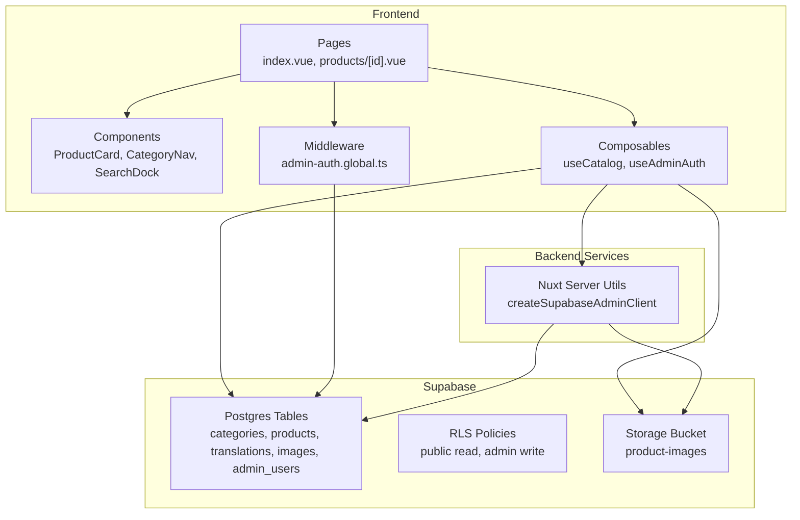
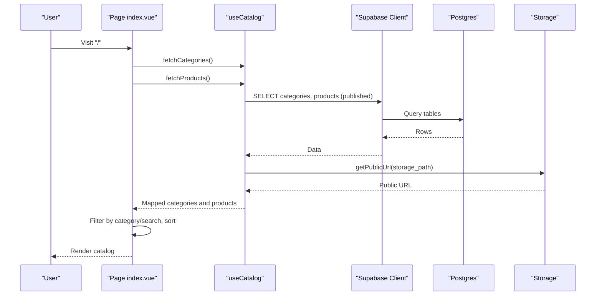
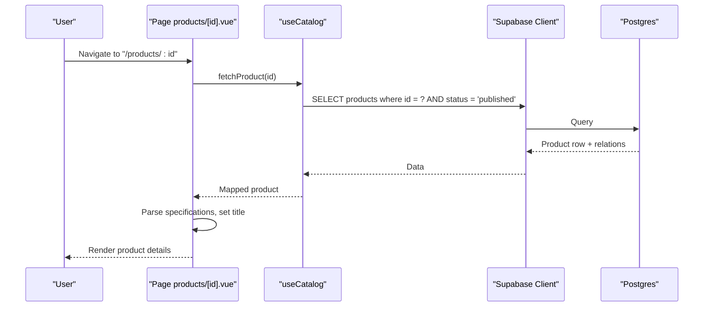
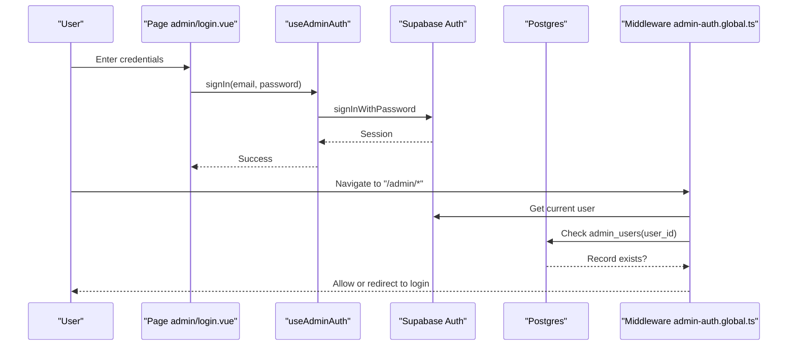
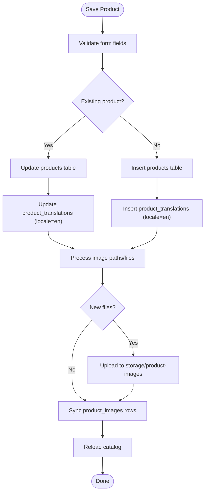
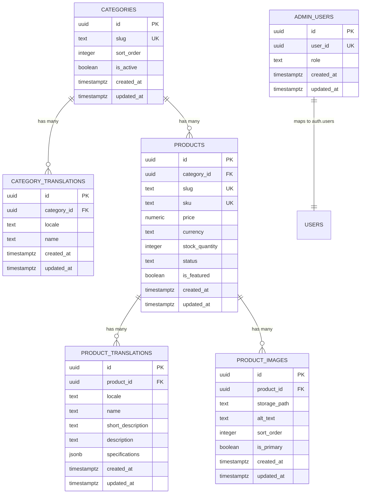
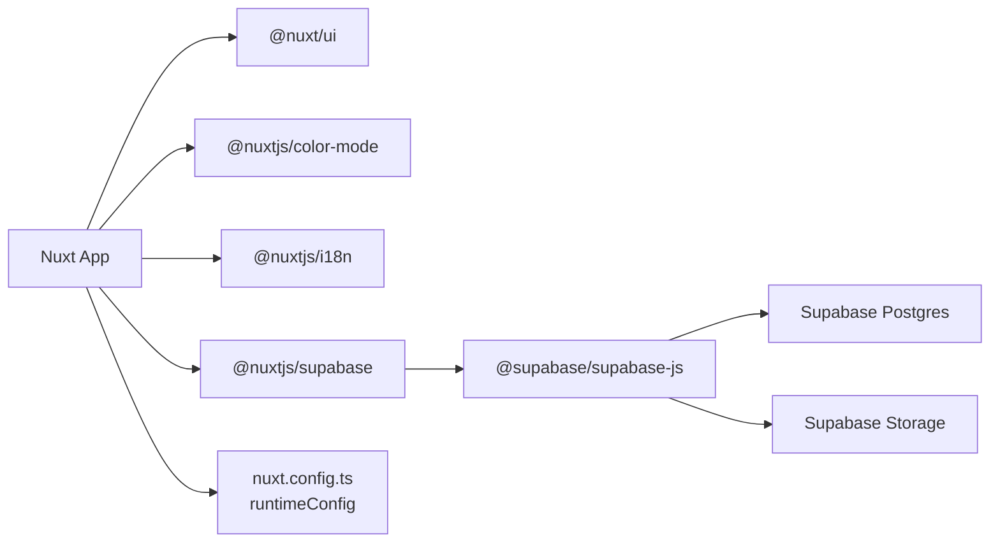

# Architecture & Design

<cite>
**Referenced Files in This Document**
- [README.md](file://README.md)
- [package.json](file://package.json)
- [nuxt.config.ts](file://nuxt.config.ts)
- [i18n.config.ts](file://i18n.config.ts)
- [app.vue](file://app/app.vue)
- [server/utils/supabase.ts](file://server/utils/supabase.ts)
- [app/composables/useCatalog.ts](file://app/composables/useCatalog.ts)
- [app/composables/useAdminAuth.ts](file://app/composables/useAdminAuth.ts)
- [app/middleware/admin-auth.global.ts](file://app/middleware/admin-auth.global.ts)
- [app/pages/index.vue](file://app/pages/index.vue)
- [app/pages/products/[id].vue](file://app/pages/products/[id].vue)
- [app/types/database.ts](file://app/types/database.ts)
- [app/types/catalog.ts](file://app/types/catalog.ts)
- [app/types/product.ts](file://app/types/product.ts)
- [supabase/migrations/20260922_000001_create_catalog_schema.sql](file://supabase/migrations/20260922_000001_create_catalog_schema.sql)
- [supabase/migrations/20260922000002_storage_and_rls.sql](file://supabase/migrations/20260922000002_storage_and_rls.sql)
- [supabase/config.toml](file://supabase/config.toml)
</cite>

## Table of Contents
1. Introduction
2. Project Structure
3. Core Components
4. Architecture Overview
5. Detailed Component Analysis
6. Dependency Analysis
7. Performance Considerations
8. Troubleshooting Guide
9. Conclusion
10. Appendices

## Introduction
Raccoon-Gear-Bin is a Nuxt.js-based product catalog application with admin capabilities, backed by Supabase for data and authentication. It uses Nuxt’s file-based routing, server-side rendering (SSR), and modular components to present a responsive catalog with search, sorting, and category filtering. Admin features include login, role checks, and CRUD operations for products, categories, translations, and images. Internationalization is provided via @nuxtjs/i18n with English and Khmer locales. The system integrates Tailwind CSS and Nuxt UI for styling and reusable UI primitives.

## Project Structure
The project follows Nuxt 3 conventions:
- app/: Vue components, pages, composables, middleware, types, and configuration
- server/utils/: Server utilities (Supabase admin client)
- supabase/: Database migrations and local config
- i18n.config.ts: i18n messages and defaults
- nuxt.config.ts: Modules, runtime config, i18n, color mode, and UI settings
- package.json: Scripts and dependencies

**Diagram sources**
- [app/app.vue:1-4](file://app/app.vue#L1-L4)
- [index.vue:1-403](file://app/pages/index.vue#L1-L403)
- [app/pages/products/[id].vue:1-177](file://app/pages/products/[id].vue#L1-L177)
- [app/composables/useCatalog.ts:1-61](file://app/composables/useCatalog.ts#L1-L61)
- [app/composables/useAdminAuth.ts:1-79](file://app/composables/useAdminAuth.ts#L1-L79)
- [server/utils/supabase.ts:1-20](file://server/utils/supabase.ts#L1-L20)
- [supabase/migrations/20260922_000001_create_catalog_schema.sql:1-113](file://supabase/migrations/20260922_000001_create_catalog_schema.sql#L1-L113)
- [supabase/migrations/20260922000002_storage_and_rls.sql:1-205](file://supabase/migrations/20260922000002_storage_and_rls.sql#L1-L205)
- [i18n.config.ts:1-14](file://i18n.config.ts#L1-L14)
- [nuxt.config.ts:1-52](file://nuxt.config.ts#L1-L52)

**Section sources**
- [README.md:1-36](file://README.md#L1-L36)
- [package.json:1-26](file://package.json#L1-L26)
- [nuxt.config.ts:1-52](file://nuxt.config.ts#L1-L52)

## Core Components
- Pages and Routing: File-based routes under app/pages provide the home catalog page and dynamic product detail page. The root page orchestrates catalog loading, admin mode, editing, and deletion flows. The product detail page fetches a single product and renders details and specs.
- Composables: 
  - useCatalog encapsulates catalog queries, mapping, and image URL resolution.
  - useAdminAuth handles sign-in/out, user retrieval, and admin role checks against the admin_users table.
- Middleware: Global route guard enforces admin access for /admin/* routes, redirecting unauthenticated or unauthorized users.
- Server Utilities: createSupabaseAdminClient builds a service-role client for privileged operations on the server side.
- Types: Strongly typed database schema and domain models ensure type safety across the app.

**Section sources**
- [index.vue:1-403](file://app/pages/index.vue#L1-L403)
- [app/pages/products/[id].vue:1-177](file://app/pages/products/[id].vue#L1-L177)
- [app/composables/useCatalog.ts:1-61](file://app/composables/useCatalog.ts#L1-L61)
- [app/composables/useAdminAuth.ts:1-79](file://app/composables/useAdminAuth.ts#L1-L79)
- [app/middleware/admin-auth.global.ts:1-28](file://app/middleware/admin-auth.global.ts#L1-L28)
- [server/utils/supabase.ts:1-20](file://server/utils/supabase.ts#L1-L20)
- [app/types/database.ts:1-123](file://app/types/database.ts#L1-L123)
- [app/types/catalog.ts:1-31](file://app/types/catalog.ts#L1-L31)
- [app/types/product.ts:1-40](file://app/types/product.ts#L1-L40)

## Architecture Overview
High-level architecture layers:
- Presentation Layer: Nuxt pages and Vue components render UI, handle user interactions, and manage local state.
- Business Logic Layer: Composables implement data fetching, mapping, and business rules; middleware enforces authorization.
- Integration Layer: Supabase client provides authenticated DB and storage access; server utility exposes an admin client for privileged tasks.
- Data Layer: Supabase Postgres schema defines entities and relationships; Row-Level Security (RLS) policies enforce access control; Storage bucket holds product images.

**Diagram sources**
- [index.vue:1-403](file://app/pages/index.vue#L1-L403)
- [app/pages/products/[id].vue:1-177](file://app/pages/products/[id].vue#L1-L177)
- [app/composables/useCatalog.ts:1-61](file://app/composables/useCatalog.ts#L1-L61)
- [app/composables/useAdminAuth.ts:1-79](file://app/composables/useAdminAuth.ts#L1-L79)
- [app/middleware/admin-auth.global.ts:1-28](file://app/middleware/admin-auth.global.ts#L1-L28)
- [server/utils/supabase.ts:1-20](file://server/utils/supabase.ts#L1-L20)
- [supabase/migrations/20260922_000001_create_catalog_schema.sql:1-113](file://supabase/migrations/20260922_000001_create_catalog_schema.sql#L1-L113)
- [supabase/migrations/20260922000002_storage_and_rls.sql:1-205](file://supabase/migrations/20260922000002_storage_and_rls.sql#L1-L205)

## Detailed Component Analysis

### Catalog Data Flow (Home Page)
The home page loads categories and published products concurrently, maps them into domain models, and exposes filtered/sorted views. Image URLs are resolved via Supabase Storage.

**Diagram sources**
- [index.vue:46-56](file://app/pages/index.vue#L46-L56)
- [app/composables/useCatalog.ts:37-57](file://app/composables/useCatalog.ts#L37-L57)
- [app/composables/useCatalog.ts:8-11](file://app/composables/useCatalog.ts#L8-L11)

**Section sources**
- [index.vue:46-56](file://app/pages/index.vue#L46-L56)
- [app/composables/useCatalog.ts:37-57](file://app/composables/useCatalog.ts#L37-L57)

### Product Detail Page
Fetches a single published product by ID, parses specifications, and renders gallery and details.

**Diagram sources**
- [app/pages/products/[id].vue:10-20](file://app/pages/products/[id].vue#L10-L20)
- [app/composables/useCatalog.ts:43-47](file://app/composables/useCatalog.ts#L43-L47)

**Section sources**
- [app/pages/products/[id].vue:10-20](file://app/pages/products/[id].vue#L10-L20)
- [app/composables/useCatalog.ts:43-47](file://app/composables/useCatalog.ts#L43-L47)

### Admin Authentication Flow
Sign-in, role checks, and global route protection for admin areas.

**Diagram sources**
- [app/composables/useAdminAuth.ts:56-69](file://app/composables/useAdminAuth.ts#L56-L69)
- [app/middleware/admin-auth.global.ts:1-28](file://app/middleware/admin-auth.global.ts#L1-L28)

**Section sources**
- [app/composables/useAdminAuth.ts:56-69](file://app/composables/useAdminAuth.ts#L56-L69)
- [app/middleware/admin-auth.global.ts:1-28](file://app/middleware/admin-auth.global.ts#L1-L28)

### Product Save Workflow
Admin flow to create/update products, translations, and images.

**Diagram sources**
- [app/pages/index.vue:134-172](file://app/pages/index.vue#L134-L172)

**Section sources**
- [app/pages/index.vue:134-172](file://app/pages/index.vue#L134-L172)

### Data Models and Relationships
The database schema defines core entities and relationships, including categories, products, translations, images, and admin users.

**Diagram sources**
- [supabase/migrations/20260922_000001_create_catalog_schema.sql:3-67](file://supabase/migrations/20260922_000001_create_catalog_schema.sql#L3-L67)

**Section sources**
- [supabase/migrations/20260922_000001_create_catalog_schema.sql:3-67](file://supabase/migrations/20260922_000001_create_catalog_schema.sql#L3-L67)
- [app/types/database.ts:77-123](file://app/types/database.ts#L77-L123)

## Dependency Analysis
Key dependencies and integrations:
- Nuxt modules: @nuxt/ui, @nuxtjs/color-mode, @nuxtjs/i18n, @nuxtjs/supabase
- Runtime configuration: Supabase URL and keys exposed publicly; service role key reserved for server-side
- Supabase client: Used in composables and middleware for DB and auth; server utility creates an admin client with session persistence disabled
- Storage: Product images stored in Supabase Storage bucket with RLS policies controlling public read and admin write/delete

**Diagram sources**
- [package.json:12-24](file://package.json#L12-L24)
- [nuxt.config.ts:9-26](file://nuxt.config.ts#L9-L26)
- [server/utils/supabase.ts:1-20](file://server/utils/supabase.ts#L1-L20)

**Section sources**
- [package.json:12-24](file://package.json#L12-L24)
- [nuxt.config.ts:9-26](file://nuxt.config.ts#L9-L26)
- [server/utils/supabase.ts:1-20](file://server/utils/supabase.ts#L1-L20)

## Performance Considerations
- Concurrency: Home page loads categories and products in parallel to reduce latency.
- Selective Queries: Composables select only needed columns and filter by status to minimize payload size.
- Image Handling: Public URLs are computed per image; consider caching strategies at CDN level for frequently accessed assets.
- SSR: Nuxt SSR improves initial load performance and SEO; ensure large payloads are minimized.
- Indexes: Schema includes indexes on category_id, status, featured, locale, and product_id to optimize common queries.
- Pagination: Not implemented yet; consider adding pagination for large catalogs to improve responsiveness.
- Caching: Consider client-side caching (e.g., in-memory refs) and edge caching for static assets; evaluate Supabase query caching if applicable.

[No sources needed since this section provides general guidance]

## Troubleshooting Guide
Common issues and diagnostics:
- Missing Supabase Configuration: Server-side admin client throws when URL or service role key is absent. Ensure environment variables are set.
- Admin Authorization Failures: Middleware logs errors and redirects to login if lookup fails or user lacks admin record.
- Product Load Errors: Product detail page surfaces error messages from fetch failures; verify product exists and is published.
- Catalog Load Errors: Home page displays errors from category or product queries; check RLS policies and network connectivity.
- Storage Upload Errors: Saving products may fail during image upload; verify bucket permissions and admin role.

**Section sources**
- [server/utils/supabase.ts:9-11](file://server/utils/supabase.ts#L9-L11)
- [app/middleware/admin-auth.global.ts:19-22](file://app/middleware/admin-auth.global.ts#L19-L22)
- [app/pages/products/[id].vue:15-17](file://app/pages/products/[id].vue#L15-L17)
- [app/pages/index.vue:117-119](file://app/pages/index.vue#L117-L119)
- [app/pages/index.vue:156-167](file://app/pages/index.vue#L156-L167)

## Conclusion
Raccoon-Gear-Bin leverages Nuxt’s modern framework features with Supabase for robust data and authentication. The separation between UI components, business logic in composables, and backend services ensures maintainability and scalability. RLS policies secure data access, while i18n and color mode enhance user experience. Future enhancements should include pagination, robust caching, and expanded admin roles.

[No sources needed since this section summarizes without analyzing specific files]

## Appendices

### Infrastructure Requirements
- Node/Bun runtime compatible with Nuxt 4
- Supabase project with Postgres, Auth, and Storage configured
- Environment variables:
  - NUXT_PUBLIC_SUPABASE_URL
  - NUXT_PUBLIC_SUPABASE_ANON_KEY
  - SUPABASE_SERVICE_ROLE_KEY
- Local development uses Supabase CLI config for ports and auth redirects

**Section sources**
- [nuxt.config.ts:9-26](file://nuxt.config.ts#L9-L26)
- [supabase/config.toml:1-32](file://supabase/config.toml#L1-L32)

### Scalability Considerations
- Add pagination and infinite scrolling for large catalogs
- Implement server-side caching or CDN for images and static assets
- Use Supabase Edge Functions for heavy transformations or background jobs
- Monitor query performance with indexes and explain plans

[No sources needed since this section provides general guidance]

### Deployment Topology
- Frontend: Nuxt app built and served via standard hosting (Vercel, Netlify, Cloudflare Pages, or self-hosted)
- Backend: Supabase managed services (Postgres, Auth, Storage)
- Middleware: Global route guards run on client and can be complemented by server-side checks
- Storage: Public read policy for product-images bucket; admin-only write/delete enforced by RLS

**Section sources**
- [supabase/migrations/20260922000002_storage_and_rls.sql:162-205](file://supabase/migrations/20260922000002_storage_and_rls.sql#L162-L205)

### Technology Stack Decisions
- Nuxt 4 with TypeScript for type-safe SSR and file-based routing
- @nuxtjs/i18n for multi-language support with prefix strategy
- @nuxtjs/supabase for seamless integration with Supabase services
- Tailwind CSS and @nuxt/ui for consistent design system
- Bun lockfile indicates Bun usage; ensure compatibility with chosen runtime

**Section sources**
- [package.json:1-26](file://package.json#L1-L26)
- [nuxt.config.ts:1-52](file://nuxt.config.ts#L1-L52)
- [i18n.config.ts:1-14](file://i18n.config.ts#L1-L14)