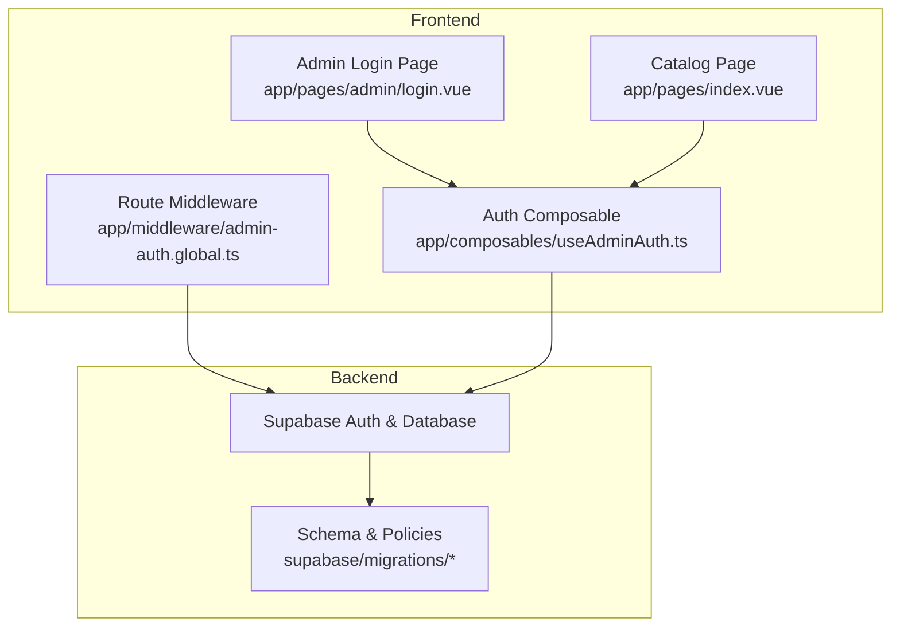
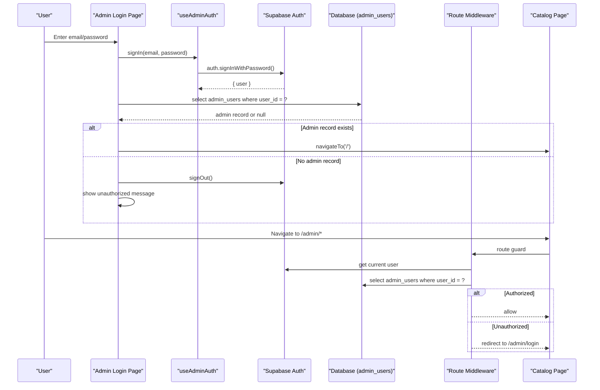
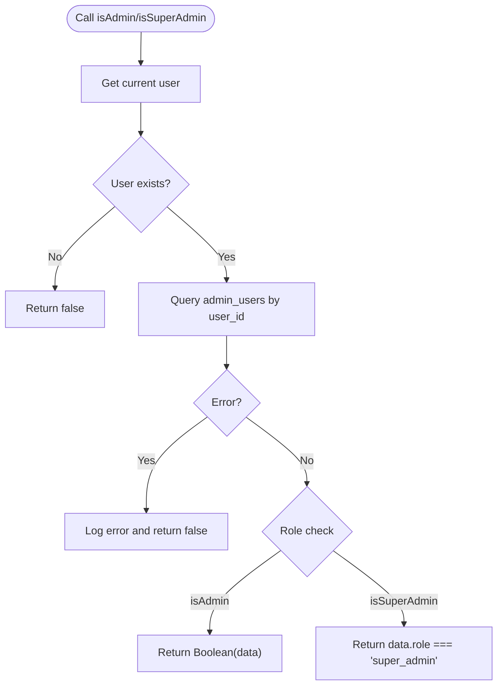
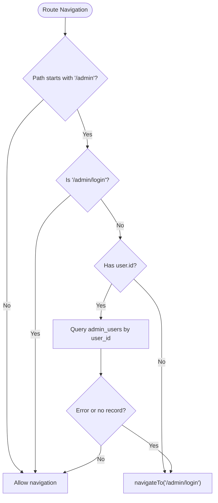
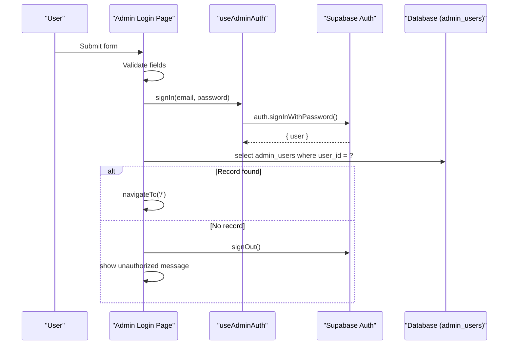
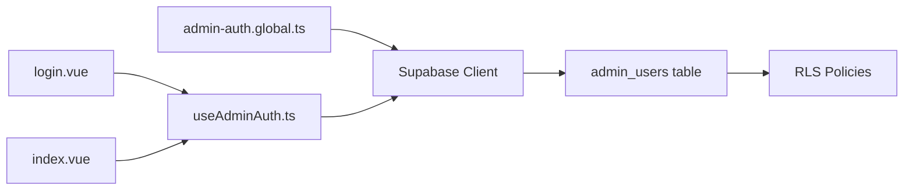
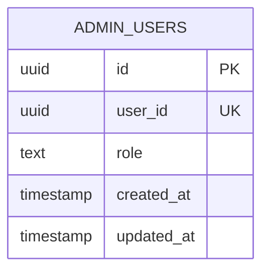

# Authentication & Authorization

<cite>
**Referenced Files in This Document**
- [useAdminAuth.ts](file://app/composables/useAdminAuth.ts)
- [admin-auth.global.ts](file://app/middleware/admin-auth.global.ts)
- [login.vue](file://app/pages/admin/login.vue)
- [index.vue](file://app/pages/index.vue)
- [create_catalog_schema.sql](file://supabase/migrations/20260922_000001_create_catalog_schema.sql)
- [storage_and_rls.sql](file://supabase/migrations/20260922000002_storage_and_rls.sql)
- [remove_recursive_admin_users_policy.sql](file://supabase/migrations/20260922073136_remove_recursive_admin_users_policy.sql)
- [database.ts](file://app/types/database.ts)
</cite>

## Table of Contents
1. [Introduction](#introduction)
2. [Project Structure](#project-structure)
3. [Core Components](#core-components)
4. [Architecture Overview](#architecture-overview)
5. [Detailed Component Analysis](#detailed-component-analysis)
6. [Dependency Analysis](#dependency-analysis)
7. [Performance Considerations](#performance-considerations)
8. [Troubleshooting Guide](#troubleshooting-guide)
9. [Conclusion](#conclusion)
10. [Appendices](#appendices)

## Introduction
This document explains the authentication and authorization system for the Raccoon-Gear-Bin application, focusing on admin access. It covers:
- Admin login flow from credentials to session validation
- Role-based access control for admin and super-admin roles
- Route middleware that protects administrative routes
- Composable functions for authentication state, role checks, and permission handling
- Examples for protected routes, error handling, and extending permissions

The system uses Supabase Auth for sessions and a dedicated `admin_users` table to map authenticated users to application roles.

## Project Structure
Authentication-related code is organized into:
- Composables for reusable auth logic
- Global route middleware for protecting admin routes
- Admin login page for credential submission and initial authorization check
- Main catalog page using admin mode based on user role
- Database schema and policies defining roles and data access

**Diagram sources**
- [login.vue:1-58](file://app/pages/admin/login.vue#L1-L58)
- [index.vue:21-24](file://app/pages/index.vue#L21-L24)
- [useAdminAuth.ts:1-78](file://app/composables/useAdminAuth.ts#L1-L78)
- [admin-auth.global.ts:1-27](file://app/middleware/admin-auth.global.ts#L1-L27)
- [create_catalog_schema.sql:61-67](file://supabase/migrations/20260922_000001_create_catalog_schema.sql#L61-L67)
- [storage_and_rls.sql:135-160](file://supabase/migrations/20260922000002_storage_and_rls.sql#L135-L160)

**Section sources**
- [login.vue:1-58](file://app/pages/admin/login.vue#L1-L58)
- [index.vue:21-24](file://app/pages/index.vue#L21-L24)
- [useAdminAuth.ts:1-78](file://app/composables/useAdminAuth.ts#L1-L78)
- [admin-auth.global.ts:1-27](file://app/middleware/admin-auth.global.ts#L1-L27)
- [create_catalog_schema.sql:61-67](file://supabase/migrations/20260922_000001_create_catalog_schema.sql#L61-L67)
- [storage_and_rls.sql:135-160](file://supabase/migrations/20260922000002_storage_and_rls.sql#L135-L160)

## Core Components
- Admin auth composable provides:
  - Current user retrieval
  - Admin role verification
  - Super-admin role verification
  - Sign-in and sign-out operations
- Global route middleware guards `/admin/*` routes, validates session, and enforces admin presence
- Admin login page handles credentials, calls sign-in, verifies admin record, and redirects
- Catalog page toggles admin UI based on role checks and supports logout

Key responsibilities:
- Session management via Supabase Auth
- Role resolution via `admin_users` table
- Route protection via Nuxt middleware
- UI gating via composables

**Section sources**
- [useAdminAuth.ts:1-78](file://app/composables/useAdminAuth.ts#L1-L78)
- [admin-auth.global.ts:1-27](file://app/middleware/admin-auth.global.ts#L1-L27)
- [login.vue:1-58](file://app/pages/admin/login.vue#L1-L58)
- [index.vue:21-24](file://app/pages/index.vue#L21-L24)

## Architecture Overview
The authentication and authorization architecture combines client-side flows with server-enforced policies:

**Diagram sources**
- [login.vue:15-54](file://app/pages/admin/login.vue#L15-L54)
- [useAdminAuth.ts:56-64](file://app/composables/useAdminAuth.ts#L56-L64)
- [admin-auth.global.ts:1-27](file://app/middleware/admin-auth.global.ts#L1-L27)

## Detailed Component Analysis

### Admin Auth Composable
Responsibilities:
- Retrieve current user from Supabase Auth or reactive user store
- Check if user has an admin record
- Check if user has super-admin role
- Provide sign-in and sign-out methods

Behavior highlights:
- `getCurrentUser` prefers explicit auth user; falls back to reactive user
- `isAdmin` returns true when an admin record exists for the user
- `isSuperAdmin` returns true only when role equals super-admin
- Errors during role checks are logged and treated as false to avoid exposing internals

**Diagram sources**
- [useAdminAuth.ts:7-54](file://app/composables/useAdminAuth.ts#L7-L54)

**Section sources**
- [useAdminAuth.ts:1-78](file://app/composables/useAdminAuth.ts#L1-L78)

### Route Middleware for Admin Protection
Responsibilities:
- Guard all `/admin/*` routes except `/admin/login`
- Validate active session
- Verify admin record existence
- Redirect unauthorized users to `/admin/login`

Flow:
- If path does not start with `/admin` or is `/admin/login`, skip guard
- If no user ID present, redirect to login
- Query `admin_users` for current user
- On error or missing record, redirect to login

**Diagram sources**
- [admin-auth.global.ts:1-27](file://app/middleware/admin-auth.global.ts#L1-L27)

**Section sources**
- [admin-auth.global.ts:1-27](file://app/middleware/admin-auth.global.ts#L1-L27)

### Admin Login Page
Responsibilities:
- Collect email and password
- Call composable sign-in
- Verify admin record exists
- Handle errors and display messages
- Redirect to catalog on success

Flow:
- Validate required fields
- Attempt sign-in
- If no user returned, throw invalid login error
- Query admin_users for user_id
- If admin record missing, sign out and show unauthorized message
- Otherwise, navigate to catalog

**Diagram sources**
- [login.vue:15-54](file://app/pages/admin/login.vue#L15-L54)
- [useAdminAuth.ts:56-64](file://app/composables/useAdminAuth.ts#L56-L64)

**Section sources**
- [login.vue:1-58](file://app/pages/admin/login.vue#L1-L58)

### Catalog Page Admin Mode
Responsibilities:
- Use `isAdmin` to toggle admin UI
- Provide logout functionality
- Refresh admin mode when user changes

Behavior:
- Watch reactive user to refresh admin mode
- Show admin controls when `isAdminMode` is true
- Logout clears session and resets admin mode

**Section sources**
- [index.vue:21-24](file://app/pages/index.vue#L21-L24)
- [index.vue:122-187](file://app/pages/index.vue#L122-L187)

## Dependency Analysis
Component relationships and dependencies:

- The login page depends on the auth composable for sign-in and on the database for admin record verification.
- The catalog page depends on the auth composable for role checks and UI gating.
- The middleware depends on Supabase client to validate session and admin status.
- The database schema defines roles and constraints; RLS policies enforce data access.

**Diagram sources**
- [login.vue:1-58](file://app/pages/admin/login.vue#L1-L58)
- [index.vue:21-24](file://app/pages/index.vue#L21-L24)
- [useAdminAuth.ts:1-78](file://app/composables/useAdminAuth.ts#L1-L78)
- [admin-auth.global.ts:1-27](file://app/middleware/admin-auth.global.ts#L1-L27)
- [create_catalog_schema.sql:61-67](file://supabase/migrations/20260922_000001_create_catalog_schema.sql#L61-L67)
- [storage_and_rls.sql:135-160](file://supabase/migrations/20260922000002_storage_and_rls.sql#L135-L160)

**Section sources**
- [login.vue:1-58](file://app/pages/admin/login.vue#L1-L58)
- [index.vue:21-24](file://app/pages/index.vue#L21-L24)
- [useAdminAuth.ts:1-78](file://app/composables/useAdminAuth.ts#L1-L78)
- [admin-auth.global.ts:1-27](file://app/middleware/admin-auth.global.ts#L1-L27)
- [create_catalog_schema.sql:61-67](file://supabase/migrations/20260922_000001_create_catalog_schema.sql#L61-L67)
- [storage_and_rls.sql:135-160](file://supabase/migrations/20260922000002_storage_and_rls.sql#L135-L160)

## Performance Considerations
- Minimize redundant queries:
  - Cache admin role checks at the component level where appropriate.
  - Avoid repeated role checks inside tight loops; compute once per view.
- Prefer single-field selects:
  - Queries currently select minimal fields (`role`, `id`) which is efficient.
- Network latency:
  - Combine related operations where possible (e.g., after sign-in, perform admin check before navigation).
- Error paths:
  - Fail fast on missing user or admin records to reduce unnecessary processing.

[No sources needed since this section provides general guidance]

## Troubleshooting Guide
Common issues and resolutions:
- Invalid credentials:
  - The login page throws an error when sign-in fails; ensure correct email/password.
- Unauthorized account:
  - If no admin record exists for the user, the login page signs out and shows an unauthorized message.
- Middleware redirect loop:
  - Ensure the user has an admin record; otherwise, they will be redirected to `/admin/login`.
- Role checks returning false:
  - Check for database errors in role checks; errors are logged and treated as false.
- Session not persisted:
  - Verify Supabase client configuration and environment variables for URL and service role key.

Relevant implementation references:
- Login error handling and unauthorized flow
- Middleware redirection on missing user or admin record
- Composable error logging for role checks

**Section sources**
- [login.vue:15-54](file://app/pages/admin/login.vue#L15-L54)
- [admin-auth.global.ts:1-27](file://app/middleware/admin-auth.global.ts#L1-L27)
- [useAdminAuth.ts:28-31](file://app/composables/useAdminAuth.ts#L28-L31)
- [useAdminAuth.ts:48-51](file://app/composables/useAdminAuth.ts#L48-L51)

## Conclusion
Raccoon-Gear-Bin’s authentication and authorization system combines Supabase Auth sessions with a role table to enforce admin and super-admin access. The global middleware ensures only authorized users can access administrative routes, while composables provide reusable role checks and session operations. Extending the system involves adding new roles in the schema and updating the composable and middleware accordingly.

[No sources needed since this section summarizes without analyzing specific files]

## Appendices

### Data Model: Admin Users

**Diagram sources**
- [create_catalog_schema.sql:61-67](file://supabase/migrations/20260922_000001_create_catalog_schema.sql#L61-L67)

**Section sources**
- [create_catalog_schema.sql:61-67](file://supabase/migrations/20260922_000001_create_catalog_schema.sql#L61-L67)
- [database.ts:110-115](file://app/types/database.ts#L110-L115)

### Example: Implementing Protected Routes
- Add a new route under `/admin/...`
- The global middleware will automatically protect it:
  - Validates session
  - Verifies admin record
  - Redirects unauthorized users to `/admin/login`

Reference:
- [admin-auth.global.ts:1-27](file://app/middleware/admin-auth.global.ts#L1-L27)

### Example: Handling Authentication Errors
- In pages using `useAdminAuth`:
  - Catch errors thrown by `signIn`
  - Display user-friendly messages
  - Optionally log errors for debugging

References:
- [login.vue:25-54](file://app/pages/admin/login.vue#L25-L54)
- [useAdminAuth.ts:56-64](file://app/composables/useAdminAuth.ts#L56-L64)

### Example: Extending Authorization for Additional Roles
Steps:
- Update schema:
  - Add new role values to `admin_users.role` constraint
- Update composable:
  - Add new role-check function (e.g., `isEditor`, `isModerator`)
- Update middleware:
  - Extend route guards to require additional roles where necessary
- Update UI:
  - Gate features based on new roles in components

References:
- [create_catalog_schema.sql:61-67](file://supabase/migrations/20260922_000001_create_catalog_schema.sql#L61-L67)
- [useAdminAuth.ts:16-54](file://app/composables/useAdminAuth.ts#L16-L54)
- [admin-auth.global.ts:1-27](file://app/middleware/admin-auth.global.ts#L1-L27)