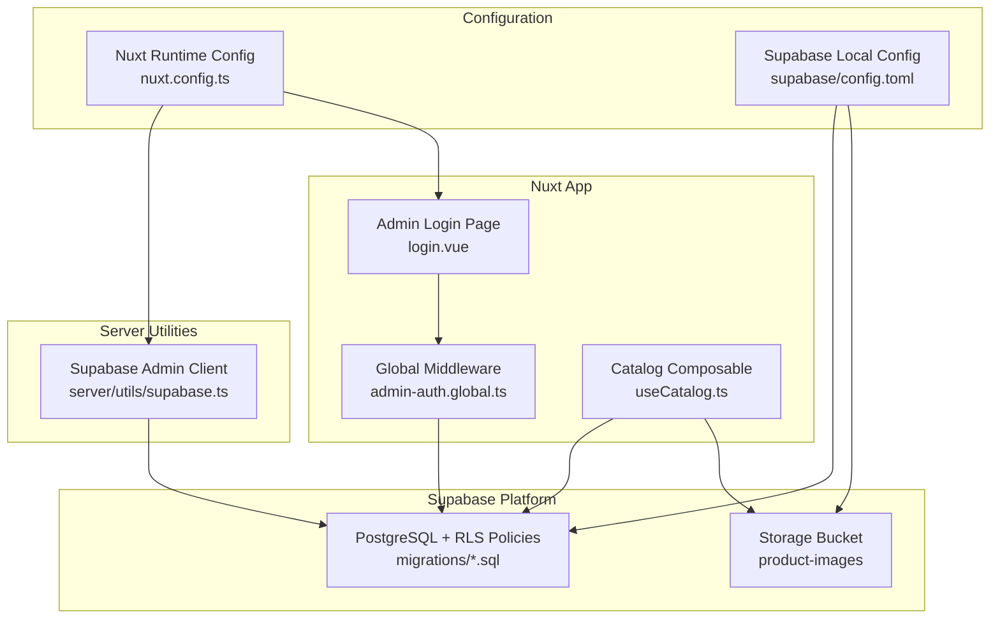
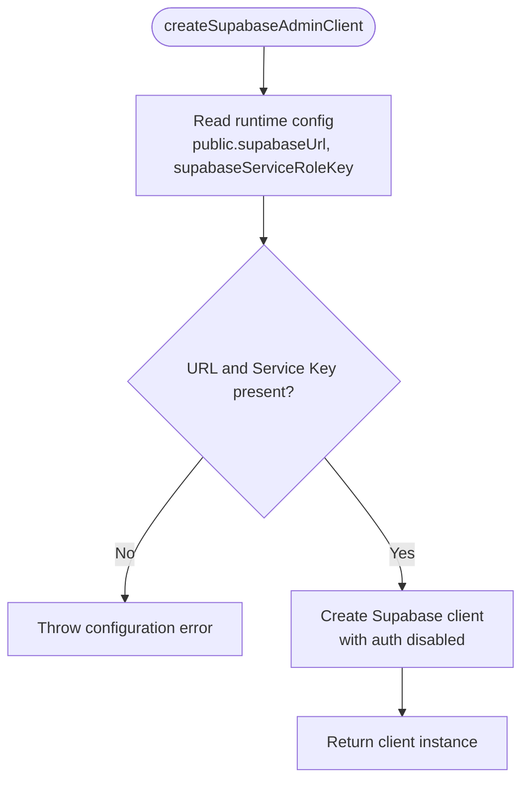
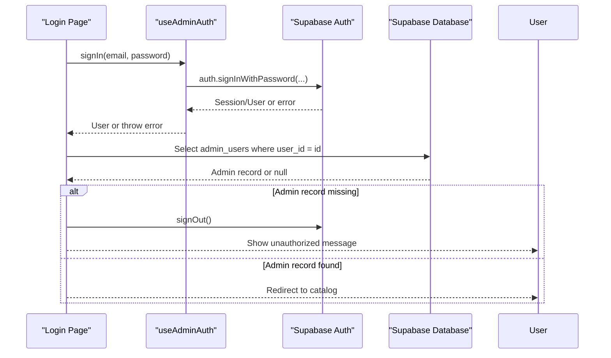
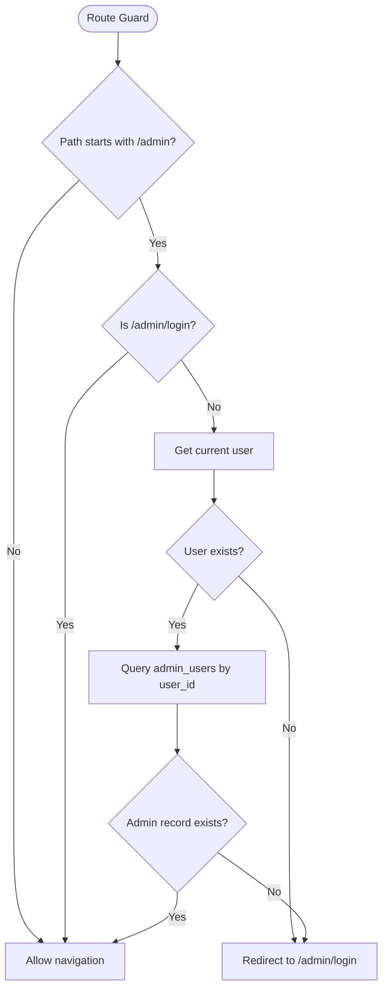
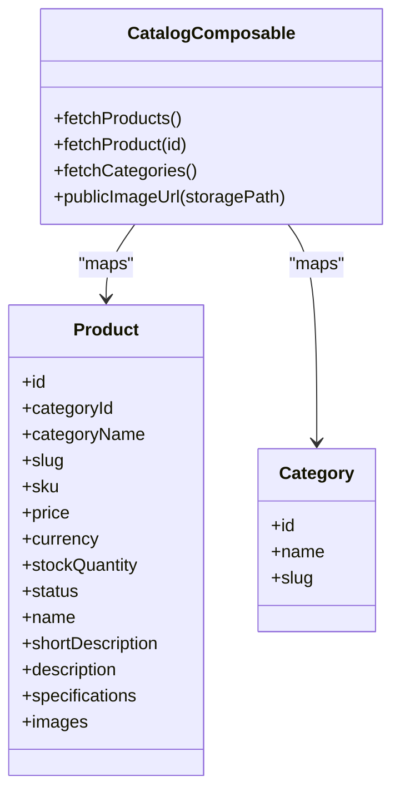
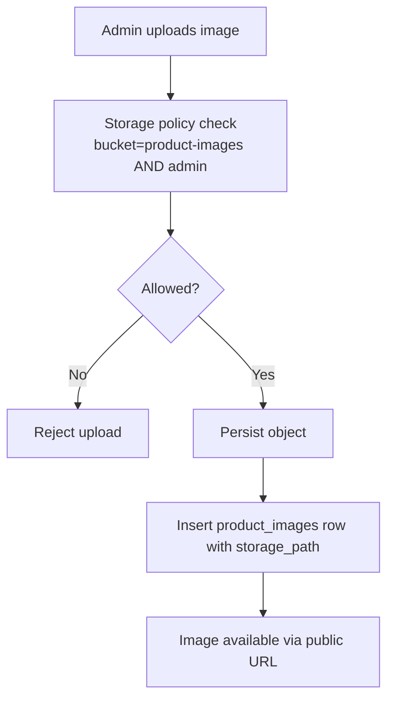
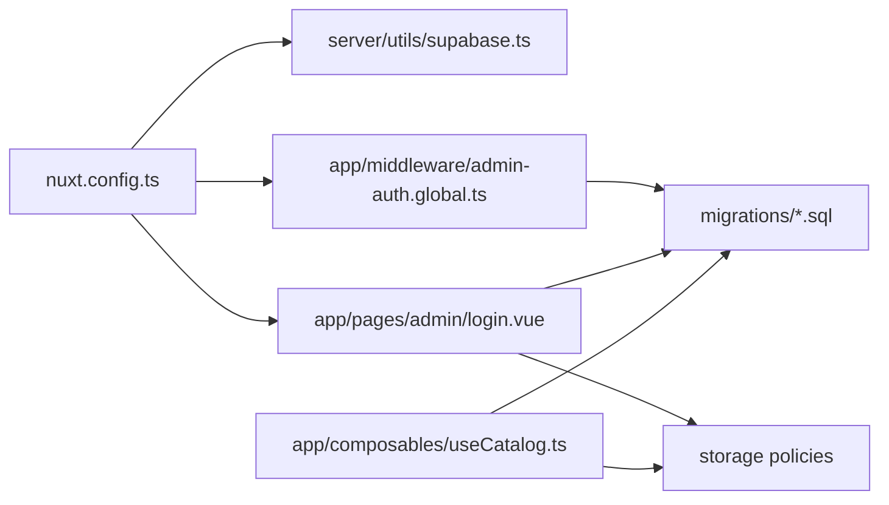

# Backend Integration

<cite>
**Referenced Files in This Document**
- [supabase.ts](file://server/utils/supabase.ts)
- [admin-auth.global.ts](file://app/middleware/admin-auth.global.ts)
- [useAdminAuth.ts](file://app/composables/useAdminAuth.ts)
- [login.vue](file://app/pages/admin/login.vue)
- [nuxt.config.ts](file://nuxt.config.ts)
- [config.toml](file://supabase/config.toml)
- [20260922_000001_create_catalog_schema.sql](file://supabase/migrations/20260922_000001_create_catalog_schema.sql)
- [20260922000002_storage_and_rls.sql](file://supabase/migrations/20260922000002_storage_and_rls.sql)
- [useCatalog.ts](file://app/composables/useCatalog.ts)
</cite>

## Table of Contents
1. [Introduction](#introduction)
2. [Project Structure](#project-structure)
3. [Core Components](#core-components)
4. [Architecture Overview](#architecture-overview)
5. [Detailed Component Analysis](#detailed-component-analysis)
6. [Dependency Analysis](#dependency-analysis)
7. [Performance Considerations](#performance-considerations)
8. [Troubleshooting Guide](#troubleshooting-guide)
9. [Conclusion](#conclusion)

## Introduction
This document explains the backend integration layer for Raccoon-Gear-Bin, focusing on how the application connects to Supabase, manages authentication and authorization, performs database queries, handles errors, and integrates with Supabase Storage for images. It also covers environment configuration, security considerations, and operational guidance for deployment and performance tuning.

## Project Structure
The backend integration spans server utilities, Nuxt runtime configuration, Supabase migrations, and frontend composables that call into Supabase APIs. Key areas:
- Server-side client creation for privileged operations
- Global route middleware for admin access control
- Composables for authentication and catalog data access
- Database schema and Row Level Security policies
- Supabase local configuration and storage settings



**Diagram sources**
- [admin-auth.global.ts:1-28](file://app/middleware/admin-auth.global.ts#L1-L28)
- [login.vue:1-121](file://app/pages/admin/login.vue#L1-L121)
- [useCatalog.ts:1-61](file://app/composables/useCatalog.ts#L1-L61)
- [supabase.ts:1-20](file://server/utils/supabase.ts#L1-L20)
- [nuxt.config.ts:1-52](file://nuxt.config.ts#L1-L52)
- [config.toml:1-32](file://supabase/config.toml#L1-L32)
- [20260922_000001_create_catalog_schema.sql:1-113](file://supabase/migrations/20260922_000001_create_catalog_schema.sql#L1-L113)
- [20260922000002_storage_and_rls.sql:1-205](file://supabase/migrations/20260922000002_storage_and_rls.sql#L1-L205)

**Section sources**
- [nuxt.config.ts:1-52](file://nuxt.config.ts#L1-L52)
- [config.toml:1-32](file://supabase/config.toml#L1-L32)

## Core Components
- Centralized Supabase admin client for server-side privileged operations
- Global middleware protecting admin routes by verifying user identity and admin role
- Authentication composable providing sign-in, sign-out, and role checks
- Catalog composable for reading published products, categories, and image URLs
- Database schema defining entities and indexes
- Row Level Security policies controlling read/write access
- Supabase storage bucket policy for public reads and admin writes

**Section sources**
- [supabase.ts:1-20](file://server/utils/supabase.ts#L1-L20)
- [admin-auth.global.ts:1-28](file://app/middleware/admin-auth.global.ts#L1-L28)
- [useAdminAuth.ts:1-79](file://app/composables/useAdminAuth.ts#L1-L79)
- [useCatalog.ts:1-61](file://app/composables/useCatalog.ts#L1-L61)
- [20260922_000001_create_catalog_schema.sql:1-113](file://supabase/migrations/20260922_000001_create_catalog_schema.sql#L1-L113)
- [20260922000002_storage_and_rls.sql:1-205](file://supabase/migrations/20260922000002_storage_and_rls.sql#L1-L205)

## Architecture Overview
The application uses a layered approach:
- Frontend pages and composables interact with Supabase via the Nuxt Supabase module
- Global middleware enforces admin-only access by checking session state and admin records
- Server utility creates a service-role client for privileged operations when needed
- Database access is governed by Row Level Security policies
- Storage access is controlled by bucket policies aligned with admin roles

```mermaid
sequenceDiagram
participant Browser as "Browser"
participant Nuxt as "Nuxt App"
participant MW as "Global Middleware"
participant Auth as "Supabase Auth"
participant DB as "Supabase Database"
participant Store as "Supabase Storage"
Browser->>Nuxt : Navigate to /admin/*
Nuxt->>MW : Route guard runs
MW->>Auth : Read current session/user
Auth-->>MW : User or null
alt No user
MW-->>Browser : Redirect to /admin/login
else User exists
MW->>DB : Query admin_users by user_id
DB-->>MW : Admin record or null
alt Not admin
MW-->>Browser : Redirect to /admin/login
else Admin
MW-->>Browser : Allow access
end
end
Note over Browser,Store : Public catalog reads use anon key; admin writes require auth and RLS policies
```

**Diagram sources**
- [admin-auth.global.ts:1-28](file://app/middleware/admin-auth.global.ts#L1-L28)
- [useAdminAuth.ts:1-79](file://app/composables/useAdminAuth.ts#L1-L79)
- [20260922000002_storage_and_rls.sql:1-205](file://supabase/migrations/20260922000002_storage_and_rls.sql#L1-L205)

## Detailed Component Analysis

### Supabase Client Configuration and Connection Management
- The server utility creates a Supabase client using the service role key from runtime config.
- Session persistence and token refresh are disabled for server-side usage to avoid unintended browser state.
- Missing configuration throws an error early to fail fast during initialization.



**Diagram sources**
- [supabase.ts:1-20](file://server/utils/supabase.ts#L1-L20)

**Section sources**
- [supabase.ts:1-20](file://server/utils/supabase.ts#L1-L20)
- [nuxt.config.ts:9-20](file://nuxt.config.ts#L9-L20)

### Authentication Flow and Admin Role Verification
- The login page collects credentials, calls the authentication composable, and verifies admin eligibility.
- The global middleware protects all /admin routes except the login page itself.
- Role checks are performed against the admin_users table.



**Diagram sources**
- [login.vue:1-121](file://app/pages/admin/login.vue#L1-L121)
- [useAdminAuth.ts:56-64](file://app/composables/useAdminAuth.ts#L56-L64)

**Section sources**
- [login.vue:1-121](file://app/pages/admin/login.vue#L1-L121)
- [useAdminAuth.ts:1-79](file://app/composables/useAdminAuth.ts#L1-L79)
- [admin-auth.global.ts:1-28](file://app/middleware/admin-auth.global.ts#L1-L28)

### Session Management and Middleware-Based Route Protection
- The global middleware intercepts navigation to /admin paths.
- If no authenticated user is detected, it redirects to the login page.
- It then validates the user’s presence in admin_users before granting access.



**Diagram sources**
- [admin-auth.global.ts:1-28](file://app/middleware/admin-auth.global.ts#L1-L28)

**Section sources**
- [admin-auth.global.ts:1-28](file://app/middleware/admin-auth.global.ts#L1-L28)

### Database Query Patterns
- Catalog queries select only necessary fields and filter by status to expose published content.
- Products and categories are mapped to typed structures, including localized translations and image URLs.
- Image URLs are resolved via Supabase Storage public URL helper.



**Diagram sources**
- [useCatalog.ts:1-61](file://app/composables/useCatalog.ts#L1-L61)

**Section sources**
- [useCatalog.ts:1-61](file://app/composables/useCatalog.ts#L1-L61)
- [20260922_000001_create_catalog_schema.sql:1-113](file://supabase/migrations/20260922_000001_create_catalog_schema.sql#L1-L113)

### Error Handling Strategies
- Server client creation fails fast if required configuration is missing.
- Middleware logs authorization lookup failures and redirects unauthenticated users.
- Login flow surfaces validation and authorization errors to the user.
- Catalog composable propagates database errors to callers.

**Section sources**
- [supabase.ts:9-11](file://server/utils/supabase.ts#L9-L11)
- [admin-auth.global.ts:19-26](file://app/middleware/admin-auth.global.ts#L19-L26)
- [login.vue:49-53](file://app/pages/admin/login.vue#L49-L53)
- [useCatalog.ts:37-57](file://app/composables/useCatalog.ts#L37-L57)

### Connection Pooling and Database Configuration
- The Supabase local configuration defines API and database ports, schemas, and storage limits.
- Application-level connection pooling is managed by Supabase’s hosted infrastructure; the client disables session persistence and auto-refresh for server-side usage.
- For production deployments, rely on Supabase-managed pooling and tune at the platform level rather than within the app.

**Section sources**
- [config.toml:1-32](file://supabase/config.toml#L1-L32)
- [supabase.ts:13-18](file://server/utils/supabase.ts#L13-L18)

### Secure API Calls and Environment Variables
- Sensitive keys (service role key) are loaded from runtime config and never exposed to the client.
- Public endpoints use the anon key configured in the Nuxt Supabase module.
- Cookie options for admin auth are explicitly set in the Nuxt configuration.

**Section sources**
- [nuxt.config.ts:9-25](file://nuxt.config.ts#L9-L25)

### Storage Integration for Images
- Public reads from the product-images bucket are allowed via storage policies.
- Admin users can upload, update, and delete images based on RLS policies tied to admin_users.
- The catalog composable resolves public URLs for stored images.



**Diagram sources**
- [20260922000002_storage_and_rls.sql:162-205](file://supabase/migrations/20260922000002_storage_and_rls.sql#L162-L205)
- [useCatalog.ts:8-11](file://app/composables/useCatalog.ts#L8-L11)

**Section sources**
- [20260922000002_storage_and_rls.sql:162-205](file://supabase/migrations/20260922000002_storage_and_rls.sql#L162-L205)
- [useCatalog.ts:8-11](file://app/composables/useCatalog.ts#L8-L11)

## Dependency Analysis
- Nuxt runtime configuration supplies both public and private Supabase settings.
- The server utility depends on runtime config to create the service-role client.
- Middleware and composables depend on Supabase Auth and Database clients provided by the Nuxt Supabase module.
- Migrations define tables, indexes, triggers, and RLS policies that govern data access.



**Diagram sources**
- [nuxt.config.ts:1-52](file://nuxt.config.ts#L1-L52)
- [supabase.ts:1-20](file://server/utils/supabase.ts#L1-L20)
- [admin-auth.global.ts:1-28](file://app/middleware/admin-auth.global.ts#L1-L28)
- [login.vue:1-121](file://app/pages/admin/login.vue#L1-L121)
- [useCatalog.ts:1-61](file://app/composables/useCatalog.ts#L1-L61)
- [20260922000002_storage_and_rls.sql:1-205](file://supabase/migrations/20260922000002_storage_and_rls.sql#L1-L205)

**Section sources**
- [nuxt.config.ts:1-52](file://nuxt.config.ts#L1-L52)
- [supabase.ts:1-20](file://server/utils/supabase.ts#L1-L20)
- [admin-auth.global.ts:1-28](file://app/middleware/admin-auth.global.ts#L1-L28)
- [login.vue:1-121](file://app/pages/admin/login.vue#L1-L121)
- [useCatalog.ts:1-61](file://app/composables/useCatalog.ts#L1-L61)
- [20260922000002_storage_and_rls.sql:1-205](file://supabase/migrations/20260922000002_storage_and_rls.sql#L1-L205)

## Performance Considerations
- Use selective selects to minimize payload size and leverage existing indexes defined in the schema.
- Filter by status and active flags to reduce unnecessary rows returned.
- Avoid N+1 patterns by fetching related data in single queries where possible.
- Prefer pagination for large result sets in future admin interfaces.
- Keep storage file sizes within configured limits to prevent slow uploads and excessive bandwidth.

[No sources needed since this section provides general guidance]

## Troubleshooting Guide
- Missing Supabase configuration: Ensure SUPABASE_SERVICE_ROLE_KEY and NUXT_PUBLIC_SUPABASE_URL are set in the environment. The server client will throw if these are absent.
- Admin access denied: Verify the user exists in admin_users and has a valid role. Check RLS policies and ensure the correct user_id is used.
- Storage upload failures: Confirm the user is recognized as an admin by RLS policies and that the bucket name matches product-images.
- CORS and redirect issues: Validate site_url and additional_redirect_urls in Supabase configuration match your deployed domain.
- Session not persisting on server: This is expected for the service-role client; do not rely on browser sessions in server code.

**Section sources**
- [supabase.ts:9-11](file://server/utils/supabase.ts#L9-L11)
- [admin-auth.global.ts:19-26](file://app/middleware/admin-auth.global.ts#L19-L26)
- [20260922000002_storage_and_rls.sql:162-205](file://supabase/migrations/20260922000002_storage_and_rls.sql#L162-L205)
- [config.toml:20-25](file://supabase/config.toml#L20-L25)

## Conclusion
Raccoon-Gear-Bin’s backend integration centers on a secure, policy-driven architecture:
- Privileged server operations use a service-role client with explicit configuration checks.
- Admin routes are protected by global middleware backed by database verification.
- Data access is constrained by comprehensive RLS policies across tables and storage.
- Environment variables and cookie settings centralize sensitive configuration.
Following the patterns and guidelines here ensures secure, maintainable, and performant integrations with Supabase.