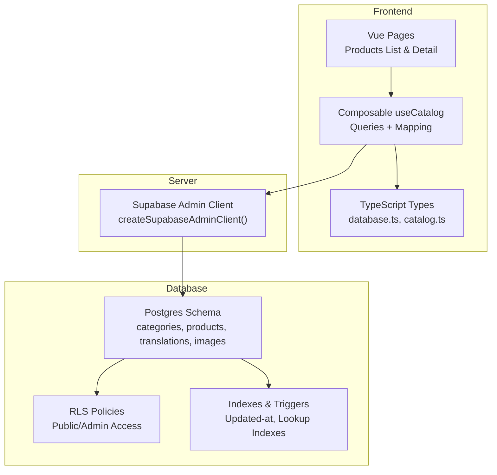
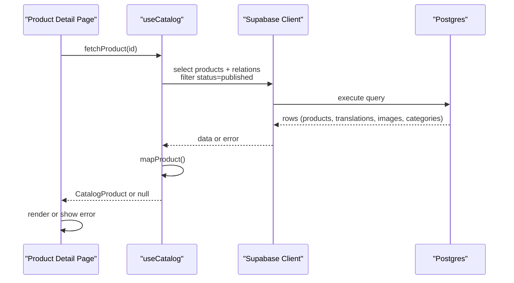
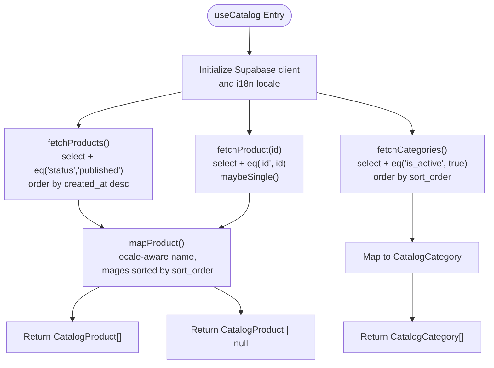
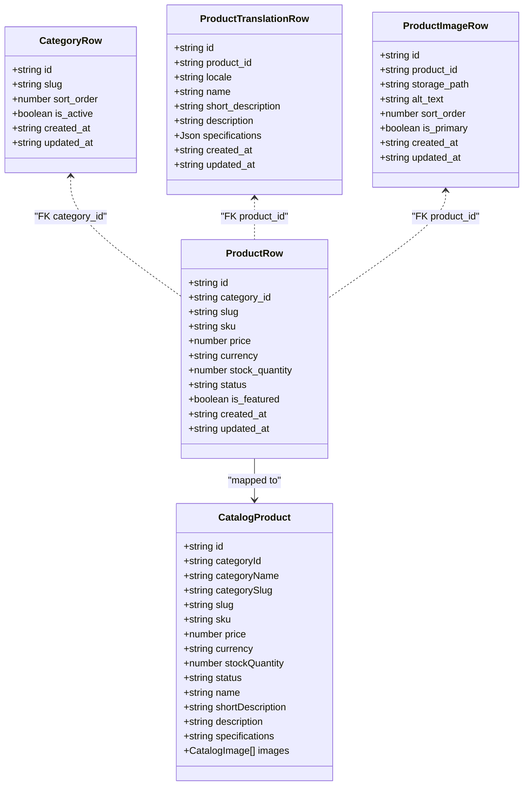
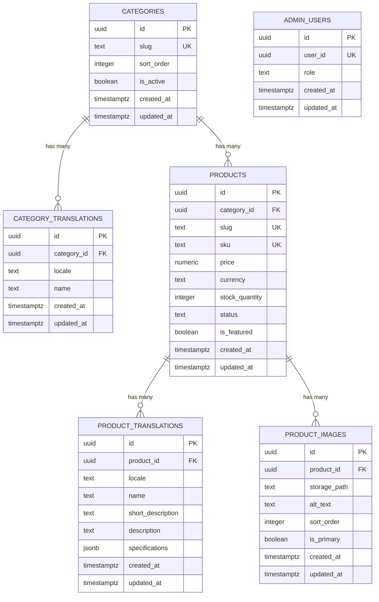
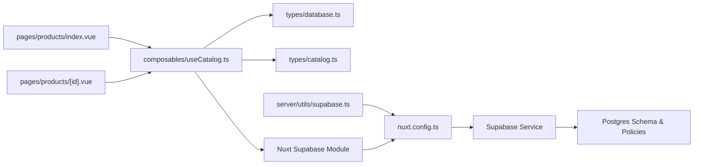

# Database Operations

<cite>
**Referenced Files in This Document**
- [useCatalog.ts](file://app/composables/useCatalog.ts)
- [supabase.ts](file://server/utils/supabase.ts)
- [database.ts](file://app/types/database.ts)
- [database.types.ts](file://app/types/database.types.ts)
- [catalog.ts](file://app/types/catalog.ts)
- [20260922_000001_create_catalog_schema.sql](file://supabase/migrations/20260922_000001_create_catalog_schema.sql)
- [20260922000002_storage_and_rls.sql](file://supabase/migrations/20260922000002_storage_and_rls.sql)
- [nuxt.config.ts](file://nuxt.config.ts)
- [index.vue (products)](file://app/pages/products/index.vue)
- [id.vue (product detail)](file://app/pages/products/[id].vue)
</cite>

## Table of Contents
1. [Introduction](#introduction)
2. [Project Structure](#project-structure)
3. [Core Components](#core-components)
4. [Architecture Overview](#architecture-overview)
5. [Detailed Component Analysis](#detailed-component-analysis)
6. [Dependency Analysis](#dependency-analysis)
7. [Performance Considerations](#performance-considerations)
8. [Troubleshooting Guide](#troubleshooting-guide)
9. [Conclusion](#conclusion)

## Introduction
This document explains how the Raccoon-Gear-Bin application accesses and manipulates data through Supabase Postgres. It focuses on:
- The data access layer abstraction via composables
- Typed database queries using auto-generated TypeScript definitions
- Error handling strategies for database operations
- Common query patterns for product catalog, categories, and inventory tracking
- Efficient querying techniques, connection pooling usage, and performance optimization
- Transaction handling, data validation at the database level, and migration management
- Troubleshooting guidance for connectivity issues and query performance problems

## Project Structure
The database-related code is organized into clear layers:
- Data access abstraction: composables that encapsulate Supabase queries
- Type safety: TypeScript interfaces aligned with the Postgres schema
- Schema and security: migrations defining tables, constraints, indexes, triggers, and Row Level Security policies
- Configuration: Nuxt runtime configuration for Supabase client initialization

**Diagram sources**
- [useCatalog.ts:4-59](file://app/composables/useCatalog.ts#L4-L59)
- [supabase.ts:3-19](file://server/utils/supabase.ts#L3-L19)
- [database.ts:14-122](file://app/types/database.ts#L14-L122)
- [catalog.ts:1-30](file://app/types/catalog.ts#L1-L30)
- [20260922_000001_create_catalog_schema.sql:3-74](file://supabase/migrations/20260922_000001_create_catalog_schema.sql#L3-L74)
- [20260922000002_storage_and_rls.sql:1-160](file://supabase/migrations/20260922000002_storage_and_rls.sql#L1-L160)

**Section sources**
- [useCatalog.ts:1-61](file://app/composables/useCatalog.ts#L1-L61)
- [supabase.ts:1-20](file://server/utils/supabase.ts#L1-L20)
- [database.ts:1-123](file://app/types/database.ts#L1-L123)
- [catalog.ts:1-31](file://app/types/catalog.ts#L1-L31)
- [20260922_000001_create_catalog_schema.sql:1-113](file://supabase/migrations/20260922_000001_create_catalog_schema.sql#L1-L113)
- [20260922000002_storage_and_rls.sql:1-205](file://supabase/migrations/20260922000002_storage_and_rls.sql#L1-L205)
- [nuxt.config.ts:9-25](file://nuxt.config.ts#L9-L25)

## Core Components
- Composable data access: useCatalog provides typed methods to fetch products and categories, map results to domain models, and resolve public image URLs.
- Server-side admin client: createSupabaseAdminClient initializes a service-role Supabase client with runtime configuration.
- Type system: database.ts defines row types and the Database interface used by Supabase clients; catalog.ts defines frontend-facing domain types.
- Schema and security: migrations define tables, constraints, indexes, triggers, and RLS policies governing read/write access.

Key responsibilities:
- Abstraction: hide Supabase client details behind composable functions
- Typing: ensure compile-time safety for queries and responses
- Validation: enforce data integrity via Postgres constraints and triggers
- Security: restrict access via RLS policies

**Section sources**
- [useCatalog.ts:4-59](file://app/composables/useCatalog.ts#L4-L59)
- [supabase.ts:3-19](file://server/utils/supabase.ts#L3-L19)
- [database.ts:14-122](file://app/types/database.ts#L14-L122)
- [catalog.ts:1-30](file://app/types/catalog.ts#L1-L30)
- [20260922_000001_create_catalog_schema.sql:3-74](file://supabase/migrations/20260922_000001_create_catalog_schema.sql#L3-L74)
- [20260922000002_storage_and_rls.sql:1-160](file://supabase/migrations/20260922000002_storage_and_rls.sql#L1-L160)

## Architecture Overview
The application uses a layered approach:
- Frontend pages call composables to perform reads
- Composables use Supabase client to query Postgres
- Database enforces integrity and security via constraints, indexes, triggers, and RLS

**Diagram sources**
- [useCatalog.ts:43-47](file://app/composables/useCatalog.ts#L43-L47)
- [id.vue:10-20](file://app/pages/products/[id].vue#L10-L20)

## Detailed Component Analysis

### Data Access Layer: useCatalog
Responsibilities:
- Initialize Supabase client with typed Database interface
- Provide public image URL resolution
- Map raw database rows to domain models with localization fallbacks
- Expose fetchProducts, fetchProduct, fetchCategories

Query patterns:
- Product listing: filter by published status, order by created_at
- Product detail: single record with related translations, images, and category
- Category listing: active categories ordered by sort_order

Error handling:
- Throws errors from Supabase calls; pages catch and display user-friendly messages

**Diagram sources**
- [useCatalog.ts:4-59](file://app/composables/useCatalog.ts#L4-L59)

**Section sources**
- [useCatalog.ts:4-59](file://app/composables/useCatalog.ts#L4-L59)

### Server-Side Admin Client: createSupabaseAdminClient
Responsibilities:
- Read runtime config values for Supabase URL and service role key
- Validate required configuration
- Create a Supabase client configured without session persistence or token refresh

Usage notes:
- Intended for server-only operations requiring elevated privileges
- Not currently used by the composable; the composable uses the Nuxt-supplied client

**Section sources**
- [supabase.ts:3-19](file://server/utils/supabase.ts#L3-L19)
- [nuxt.config.ts:9-25](file://nuxt.config.ts#L9-L25)

### Type System: database.ts and catalog.ts
- database.ts defines row-level interfaces and the Database type used by Supabase clients for type-safe queries
- catalog.ts defines frontend-facing domain types for products and categories

Relationships:
- Raw rows are mapped to domain models in useCatalog
- Domain models are consumed by Vue components

**Diagram sources**
- [database.ts:14-67](file://app/types/database.ts#L14-L67)
- [catalog.ts:1-30](file://app/types/catalog.ts#L1-L30)

**Section sources**
- [database.ts:1-123](file://app/types/database.ts#L1-L123)
- [catalog.ts:1-31](file://app/types/catalog.ts#L1-L31)

### Schema, Constraints, Indexes, and Triggers
- Tables: categories, category_translations, products, product_translations, product_images, admin_users
- Constraints:
  - Primary keys and unique constraints (e.g., slug, sku, composite unique on translations)
  - Check constraints for non-negative price and stock_quantity, enumerated statuses
- Indexes:
  - Lookups on category_id, status, featured flag, translation locale, product_id, and category slug
- Triggers:
  - Updated-at timestamps automatically set on updates across all tables

Security:
- Row Level Security policies allow public read access for active categories and published products and their related data
- Admin users can manage catalog entities; super admins can manage admin users
- Storage policies allow public read and admin write/update/delete for product images

**Diagram sources**
- [20260922_000001_create_catalog_schema.sql:3-67](file://supabase/migrations/20260922_000001_create_catalog_schema.sql#L3-L67)

**Section sources**
- [20260922_000001_create_catalog_schema.sql:3-113](file://supabase/migrations/20260922_000001_create_catalog_schema.sql#L3-L113)
- [20260922000002_storage_and_rls.sql:1-160](file://supabase/migrations/20260922000002_storage_and_rls.sql#L1-L160)

### Query Patterns and Examples

#### Product Catalog Operations
- Listing products:
  - Select only necessary fields and relations
  - Filter by status = 'published'
  - Order by created_at descending
- Single product:
  - Use maybeSingle to handle absence gracefully
  - Apply same filters and relations as listing

Efficiency tips:
- Explicitly select columns to reduce payload size
- Leverage existing indexes on status and category_id
- Avoid N+1 by fetching related translations and images in one query

**Section sources**
- [useCatalog.ts:35-47](file://app/composables/useCatalog.ts#L35-L47)
- [20260922_000001_create_catalog_schema.sql:69-74](file://supabase/migrations/20260922_000001_create_catalog_schema.sql#L69-L74)

#### Category Management
- Listing categories:
  - Filter by is_active = true
  - Order by sort_order
  - Include localized names via translations

Validation and integrity:
- Unique slug per category
- Composite unique constraint on category_id + locale prevents duplicate translations

**Section sources**
- [useCatalog.ts:49-57](file://app/composables/useCatalog.ts#L49-L57)
- [20260922_000001_create_catalog_schema.sql:3-20](file://supabase/migrations/20260922_000001_create_catalog_schema.sql#L3-L20)

#### Inventory Tracking
- Stock quantity:
  - Enforced non-negative via check constraint
  - Indexed for efficient filtering if needed
- Status enumeration:
  - Constrained to draft/published/archived

Operational considerations:
- When updating stock, prefer atomic increments/decrements within transactions to avoid race conditions
- Use short transactions to minimize lock contention

**Section sources**
- [20260922_000001_create_catalog_schema.sql:22-34](file://supabase/migrations/20260922_000001_create_catalog_schema.sql#L22-L34)

### Error Handling Strategies
- Composables throw errors returned by Supabase; consumers should catch and present user-friendly messages
- Product detail page demonstrates try/catch around fetchProduct and sets a loadError state for UI feedback

Best practices:
- Centralize error mapping in composables when possible
- Distinguish between network errors, authorization failures, and not-found cases
- Log detailed errors server-side while exposing safe messages to users

**Section sources**
- [useCatalog.ts:37-47](file://app/composables/useCatalog.ts#L37-L47)
- [id.vue:10-20](file://app/pages/products/[id].vue#L10-L20)

### Connection Pooling Usage
- Supabase client is initialized via Nuxt module and runtime config
- For high concurrency, rely on Supabase’s managed connection pooler
- Avoid creating multiple clients per request; reuse the provided client instance

Recommendations:
- Keep client instances singleton-scoped
- Disable unnecessary session features in server contexts to reduce overhead

**Section sources**
- [nuxt.config.ts:9-25](file://nuxt.config.ts#L9-L25)
- [supabase.ts:3-19](file://server/utils/supabase.ts#L3-L19)

### Transactions and Data Validation
- Transactions:
  - Use short transaction scopes to reduce lock contention
  - Perform external I/O outside transactions
- Data validation:
  - Enforce constraints at the database level (non-negative price/stock, enumerated status)
  - Use triggers to maintain consistent metadata (updated_at)

Guidelines:
- Prefer upserts where applicable to simplify conflict handling
- Batch writes to reduce round trips

**Section sources**
- [20260922_000001_create_catalog_schema.sql:76-113](file://supabase/migrations/20260922_000001_create_catalog_schema.sql#L76-L113)

### Migration Management Practices
- Migrations define schema evolution and security policies
- Versioned SQL files under supabase/migrations
- Enable RLS and attach policies to control access per role and context

Operational steps:
- Apply migrations in order
- Review policy changes before deployment
- Test RLS behavior with both anonymous and authenticated roles

**Section sources**
- [20260922_000001_create_catalog_schema.sql:1-113](file://supabase/migrations/20260922_000001_create_catalog_schema.sql#L1-L113)
- [20260922000002_storage_and_rls.sql:1-205](file://supabase/migrations/20260922000002_storage_and_rls.sql#L1-L205)

## Dependency Analysis

**Diagram sources**
- [index.vue:1-8](file://app/pages/products/index.vue#L1-L8)
- [id.vue:1-177](file://app/pages/products/[id].vue#L1-L177)
- [useCatalog.ts:1-61](file://app/composables/useCatalog.ts#L1-L61)
- [database.ts:1-123](file://app/types/database.ts#L1-L123)
- [catalog.ts:1-31](file://app/types/catalog.ts#L1-L31)
- [supabase.ts:1-20](file://server/utils/supabase.ts#L1-L20)
- [nuxt.config.ts:9-25](file://nuxt.config.ts#L9-L25)

**Section sources**
- [index.vue:1-8](file://app/pages/products/index.vue#L1-L8)
- [id.vue:1-177](file://app/pages/products/[id].vue#L1-L177)
- [useCatalog.ts:1-61](file://app/composables/useCatalog.ts#L1-L61)
- [database.ts:1-123](file://app/types/database.ts#L1-L123)
- [catalog.ts:1-31](file://app/types/catalog.ts#L1-L31)
- [supabase.ts:1-20](file://server/utils/supabase.ts#L1-L20)
- [nuxt.config.ts:9-25](file://nuxt.config.ts#L9-L25)

## Performance Considerations
- Query efficiency:
  - Select only needed columns and relations
  - Use existing indexes on frequently filtered columns (status, category_id, locale)
- Avoid N+1 queries:
  - Fetch related data in a single query rather than looping
- Connection pooling:
  - Rely on Supabase’s pooler; avoid creating new connections per request
- Prepared statements:
  - Prefer unnamed prepared statements or ensure proper deallocation in pooled environments
- Short transactions:
  - Minimize lock duration and avoid long-running operations inside transactions
- Monitoring:
  - Use EXPLAIN ANALYZE to validate query plans
  - Monitor pg_stat_statements for slow queries

[No sources needed since this section provides general guidance]

## Troubleshooting Guide

Common issues and resolutions:
- Missing environment variables:
  - Ensure SUPABASE_SERVICE_ROLE_KEY and NUXT_PUBLIC_SUPABASE_URL are set
  - Validate runtime config loading in server utilities
- Authorization errors:
  - Verify RLS policies allow intended access for anonymous/admin roles
  - Confirm admin user records exist for authenticated users
- Image URL resolution failures:
  - Ensure storage bucket exists and policies allow public read
  - Validate storage paths stored in product_images
- Slow queries:
  - Add missing indexes for frequent filters/joins
  - Refine SELECT clauses to reduce payload
  - Use pagination for large result sets

Diagnostic steps:
- Inspect Supabase client initialization and runtime config
- Check RLS policies and admin user mappings
- Run EXPLAIN ANALYZE on problematic queries
- Monitor connection counts and pool utilization

**Section sources**
- [supabase.ts:3-19](file://server/utils/supabase.ts#L3-L19)
- [nuxt.config.ts:9-25](file://nuxt.config.ts#L9-L25)
- [20260922000002_storage_and_rls.sql:1-205](file://supabase/migrations/20260922000002_storage_and_rls.sql#L1-L205)

## Conclusion
Raccoon-Gear-Bin implements a clean separation between data access and presentation, leveraging Supabase for type-safe queries and robust Postgres features for integrity and security. By following the outlined patterns—explicit selects, indexed filters, short transactions, and strong RLS policies—the application achieves reliable performance and maintainability. Adhering to the troubleshooting recommendations will help quickly resolve connectivity and performance issues.

[No sources needed since this section summarizes without analyzing specific files]