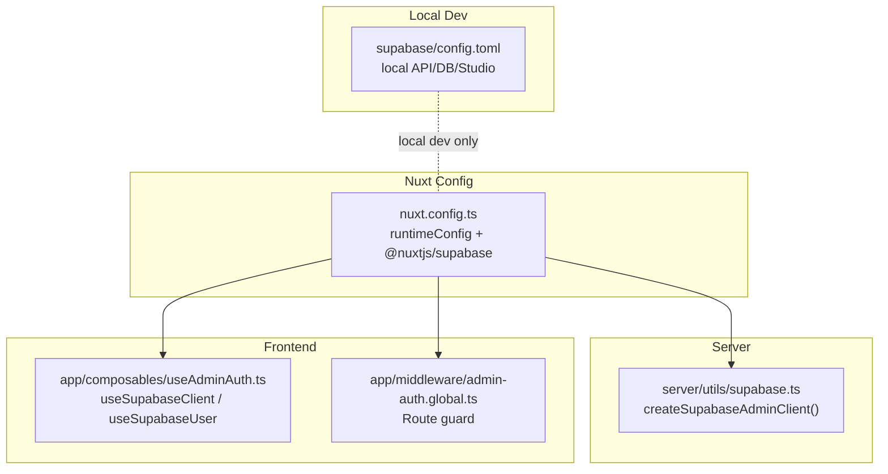
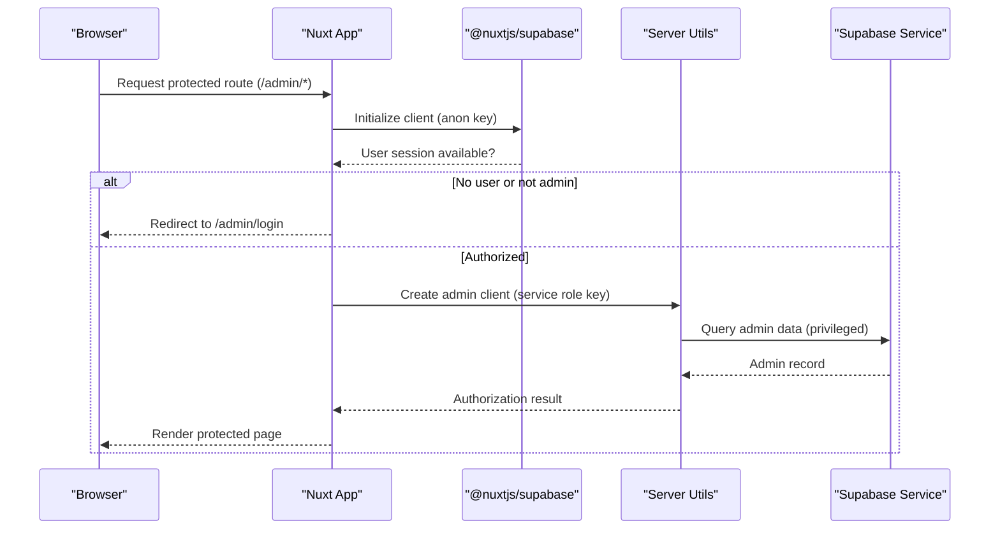
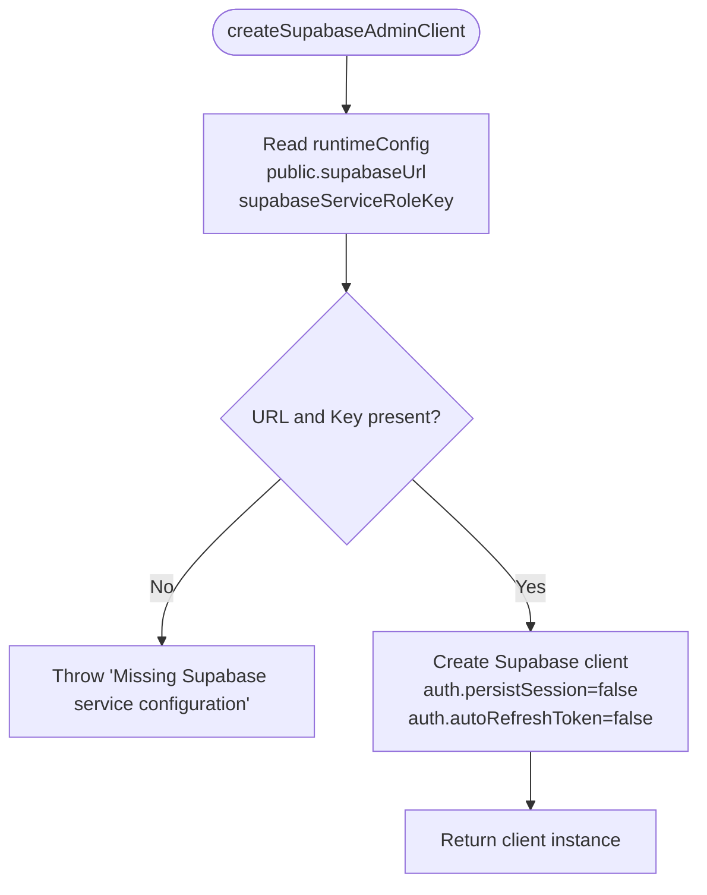
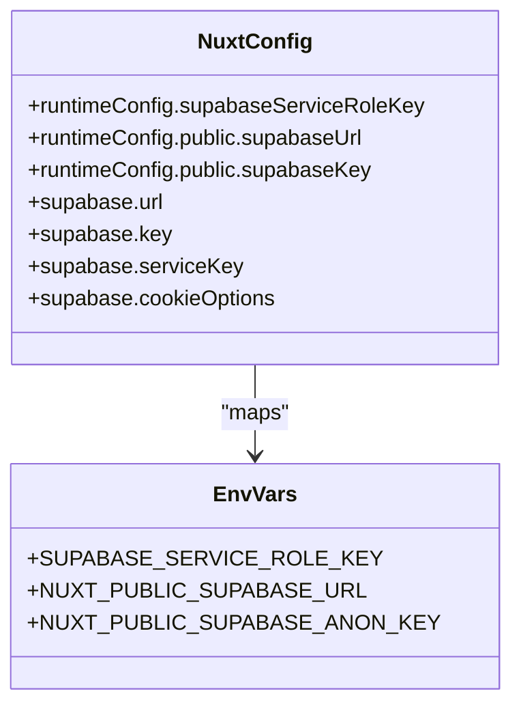
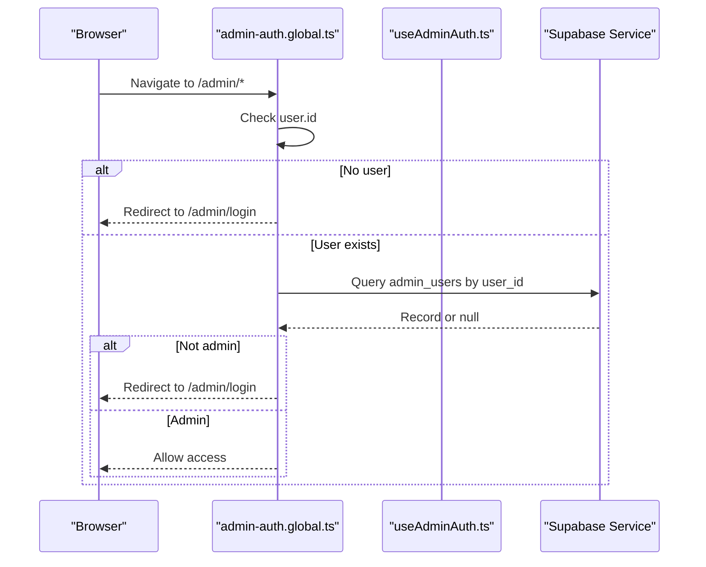
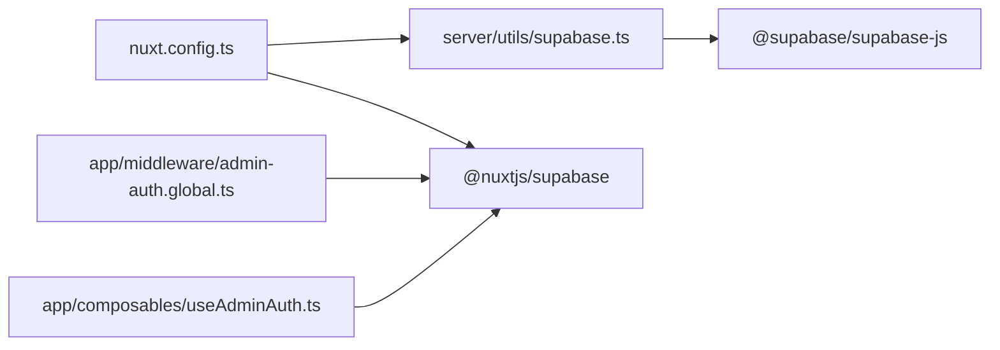

# Supabase Client Configuration

<cite>
**Referenced Files in This Document**
- [server/utils/supabase.ts](file://server/utils/supabase.ts)
- [nuxt.config.ts](file://nuxt.config.ts)
- [app/composables/useAdminAuth.ts](file://app/composables/useAdminAuth.ts)
- [app/middleware/admin-auth.global.ts](file://app/middleware/admin-auth.global.ts)
- [supabase/config.toml](file://supabase/config.toml)
- [package.json](file://package.json)
</cite>

## Table of Contents
1. [Introduction](#introduction)
2. [Project Structure](#project-structure)
3. [Core Components](#core-components)
4. [Architecture Overview](#architecture-overview)
5. [Detailed Component Analysis](#detailed-component-analysis)
6. [Dependency Analysis](#dependency-analysis)
7. [Performance Considerations](#performance-considerations)
8. [Troubleshooting Guide](#troubleshooting-guide)
9. [Conclusion](#conclusion)
10. [Appendices](#appendices)

## Introduction
This document explains how the Raccoon-Gear-Bin application configures and uses Supabase clients, with a focus on:
- Centralized server-side client creation via createSupabaseAdminClient
- Environment variable management for service role keys and URLs
- Runtime configuration setup using Nuxt runtimeConfig
- Security implications of service role keys versus regular user (anon) keys
- Session persistence and token refresh behavior
- Deployment-specific configurations and error handling for missing configuration values
- Best practices for managing environments and securing credentials

## Project Structure
The Supabase-related configuration spans server utilities, Nuxt configuration, and frontend composables/middleware:
- Server-side admin client factory is centralized in server/utils/supabase.ts
- Nuxt runtime configuration and Supabase module settings are defined in nuxt.config.ts
- Frontend authentication flows use @nuxtjs/supabase composables in app/composables/useAdminAuth.ts
- Route-level authorization guard is implemented in app/middleware/admin-auth.global.ts
- Local Supabase development environment is configured in supabase/config.toml
- Dependencies including Supabase SDKs are declared in package.json

**Diagram sources**
- [server/utils/supabase.ts:1-19](file://server/utils/supabase.ts#L1-L19)
- [nuxt.config.ts:1-52](file://nuxt.config.ts#L1-L52)
- [app/composables/useAdminAuth.ts:1-79](file://app/composables/useAdminAuth.ts#L1-L79)
- [app/middleware/admin-auth.global.ts:1-28](file://app/middleware/admin-auth.global.ts#L1-L28)
- [supabase/config.toml:1-32](file://supabase/config.toml#L1-L32)

**Section sources**
- [server/utils/supabase.ts:1-19](file://server/utils/supabase.ts#L1-L19)
- [nuxt.config.ts:1-52](file://nuxt.config.ts#L1-L52)
- [app/composables/useAdminAuth.ts:1-79](file://app/composables/useAdminAuth.ts#L1-L79)
- [app/middleware/admin-auth.global.ts:1-28](file://app/middleware/admin-auth.global.ts#L1-L28)
- [supabase/config.toml:1-32](file://supabase/config.toml#L1-L32)
- [package.json:12-24](file://package.json#L12-L24)

## Core Components
- Centralized Admin Client Factory:
  - Function: createSupabaseAdminClient
  - Purpose: Creates a server-side Supabase client using the service role key and project URL from runtime configuration
  - Behavior: Validates required configuration and returns a client with session persistence disabled and auto-refresh disabled
- Nuxt Runtime Configuration:
  - Exposes public and private runtime variables
  - Maps environment variables to runtimeConfig.public.supabaseUrl and runtimeConfig.supabaseServiceRoleKey
  - Configures @nuxtjs/supabase module with anon/service keys and cookie options
- Frontend Auth Composable:
  - Uses useSupabaseClient and useSupabaseUser to manage authenticated state and perform admin checks
- Route Guard:
  - Protects /admin routes by checking user presence and admin status

**Section sources**
- [server/utils/supabase.ts:1-19](file://server/utils/supabase.ts#L1-L19)
- [nuxt.config.ts:9-26](file://nuxt.config.ts#L9-L26)
- [app/composables/useAdminAuth.ts:1-79](file://app/composables/useAdminAuth.ts#L1-L79)
- [app/middleware/admin-auth.global.ts:1-28](file://app/middleware/admin-auth.global.ts#L1-L28)

## Architecture Overview
The application separates concerns between server-side privileged operations and client-side user sessions:
- Server-side:
  - createSupabaseAdminClient reads runtime configuration and constructs a Supabase client with the service role key
  - The client disables session persistence and token auto-refresh because it operates as a privileged server process without a browser context
- Client-side:
  - @nuxtjs/supabase provides useSupabaseClient and useSupabaseUser for user-facing features
  - The middleware guards admin routes and performs authorization checks against the database

**Diagram sources**
- [app/middleware/admin-auth.global.ts:1-28](file://app/middleware/admin-auth.global.ts#L1-L28)
- [server/utils/supabase.ts:1-19](file://server/utils/supabase.ts#L1-L19)
- [nuxt.config.ts:16-26](file://nuxt.config.ts#L16-L26)

## Detailed Component Analysis

### Centralized Admin Client Factory
- Responsibilities:
  - Read runtime configuration for Supabase URL and service role key
  - Validate that both values are present; throw an error if missing
  - Instantiate a Supabase client with auth.session persistence disabled and token auto-refresh disabled
- Security considerations:
  - Uses the service role key which bypasses Row Level Security (RLS); restrict usage to server-only code paths
  - Disables session persistence and auto-refresh to avoid storing tokens in browser storage or background refresh loops on the server
- Error handling:
  - Throws a clear error when configuration is incomplete, aiding deployment-time validation

**Diagram sources**
- [server/utils/supabase.ts:3-18](file://server/utils/supabase.ts#L3-L18)

**Section sources**
- [server/utils/supabase.ts:1-19](file://server/utils/supabase.ts#L1-L19)

### Nuxt Runtime Configuration and Supabase Module
- Runtime configuration:
  - Private runtimeConfig.supabaseServiceRoleKey maps to SUPABASE_SERVICE_ROLE_KEY
  - Public runtimeConfig.public.supabaseUrl maps to NUXT_PUBLIC_SUPABASE_URL
  - Public runtimeConfig.public.supabaseKey maps to NUXT_PUBLIC_SUPABASE_ANON_KEY
- Supabase module configuration:
  - url and key set to public values for client-side usage
  - serviceKey set to service role key for server-side privileged operations
  - Cookie options define admin auth cookie name, lifetime, and sameSite policy
- Security implications:
  - Public variables are exposed to the browser; never place secrets there
  - Service role key remains server-only via runtimeConfig.supabaseServiceRoleKey

**Diagram sources**
- [nuxt.config.ts:9-26](file://nuxt.config.ts#L9-L26)

**Section sources**
- [nuxt.config.ts:9-26](file://nuxt.config.ts#L9-L26)

### Frontend Authentication Flow
- Composable useAdminAuth:
  - Uses useSupabaseClient and useSupabaseUser to fetch current user and check admin roles
  - Provides signIn and signOut methods
- Middleware admin-auth.global:
  - Guards /admin routes, redirects unauthenticated users to login
  - Performs admin lookup and denies access if not authorized

**Diagram sources**
- [app/middleware/admin-auth.global.ts:1-28](file://app/middleware/admin-auth.global.ts#L1-L28)
- [app/composables/useAdminAuth.ts:1-79](file://app/composables/useAdminAuth.ts#L1-L79)

**Section sources**
- [app/composables/useAdminAuth.ts:1-79](file://app/composables/useAdminAuth.ts#L1-L79)
- [app/middleware/admin-auth.global.ts:1-28](file://app/middleware/admin-auth.global.ts#L1-L28)

### Local Development Supabase Configuration
- Local API, DB, Studio ports and endpoints are defined in supabase/config.toml
- Auth site_url and redirect_urls are configured for local development
- This file is used by the local Supabase CLI and does not affect production runtime configuration

**Section sources**
- [supabase/config.toml:1-32](file://supabase/config.toml#L1-L32)

## Dependency Analysis
- Dependencies:
  - @supabase/supabase-js is used directly in server/utils/supabase.ts to create the admin client
  - @nuxtjs/supabase is used throughout the app for client-side Supabase integration
- Coupling:
  - server/utils/supabase.ts depends on Nuxt’s useRuntimeConfig for configuration
  - Frontend composables depend on @nuxtjs/supabase composables
- External integrations:
  - Supabase service endpoints are determined by runtime configuration

**Diagram sources**
- [server/utils/supabase.ts:1-19](file://server/utils/supabase.ts#L1-L19)
- [app/composables/useAdminAuth.ts:1-79](file://app/composables/useAdminAuth.ts#L1-L79)
- [app/middleware/admin-auth.global.ts:1-28](file://app/middleware/admin-auth.global.ts#L1-L28)
- [nuxt.config.ts:1-52](file://nuxt.config.ts#L1-L52)
- [package.json:12-24](file://package.json#L12-L24)

**Section sources**
- [package.json:12-24](file://package.json#L12-L24)

## Performance Considerations
- Server-side admin client:
  - Disabling persistSession and autoRefreshToken avoids unnecessary overhead on the server since there is no browser context and no need for token refresh cycles
- Client-side auth:
  - Using @nuxtjs/supabase manages session lifecycle efficiently in the browser
- Database queries:
  - Admin checks query admin_users table; ensure appropriate indexes exist on user_id columns for performance

[No sources needed since this section provides general guidance]

## Troubleshooting Guide
Common issues and resolutions:
- Missing Supabase service configuration:
  - Symptom: Error thrown indicating missing Supabase service configuration
  - Cause: Either NUXT_PUBLIC_SUPABASE_URL or SUPABASE_SERVICE_ROLE_KEY is not set at runtime
  - Resolution: Ensure both environment variables are provided during deployment
- Admin routes redirecting unexpectedly:
  - Symptom: Users are redirected to /admin/login even after signing in
  - Causes:
    - No active user session
    - User not present in admin_users table
  - Resolution: Verify user exists and has an entry in admin_users; check middleware logs for errors
- Local development connectivity:
  - Symptom: Cannot connect to local Supabase
  - Cause: Local Supabase services not running or misconfigured
  - Resolution: Confirm local ports and site_url in supabase/config.toml match your local setup

**Section sources**
- [server/utils/supabase.ts:9-11](file://server/utils/supabase.ts#L9-L11)
- [app/middleware/admin-auth.global.ts:19-26](file://app/middleware/admin-auth.global.ts#L19-L26)
- [supabase/config.toml:1-32](file://supabase/config.toml#L1-L32)

## Conclusion
Raccoon-Gear-Bin centralizes Supabase client creation on the server using a dedicated function that enforces secure configuration and disables browser-oriented session behaviors. Nuxt runtime configuration cleanly separates public and private variables, while the Supabase module integrates seamlessly with the frontend. Proper environment variable setup and strict validation prevent runtime failures and reduce security risks associated with service role keys. Following the best practices outlined here will help maintain secure, reliable, and scalable Supabase integration across development, staging, and production environments.

[No sources needed since this section summarizes without analyzing specific files]

## Appendices

### Environment Variables Reference
- Required server-only variables:
  - SUPABASE_SERVICE_ROLE_KEY: Service role key for privileged server operations
- Public variables (exposed to the browser):
  - NUXT_PUBLIC_SUPABASE_URL: Supabase project URL
  - NUXT_PUBLIC_SUPABASE_ANON_KEY: Anon key for client-side operations

Example environment setup patterns:
- Development:
  - Set NUXT_PUBLIC_SUPABASE_URL to local Supabase instance URL
  - Set SUPABASE_SERVICE_ROLE_KEY to local service role key
  - Set NUXT_PUBLIC_SUPABASE_ANON_KEY to local anon key
- Staging/Production:
  - Point NUXT_PUBLIC_SUPABASE_URL to the production Supabase project URL
  - Use production service role key for SUPABASE_SERVICE_ROLE_KEY
  - Use production anon key for NUXT_PUBLIC_SUPABASE_ANON_KEY

Security best practices:
- Never commit secrets to version control
- Use platform secret managers or CI/CD pipelines to inject environment variables
- Restrict service role key usage to server-only code paths
- Prefer least-privilege policies in Supabase RLS and database roles

[No sources needed since this section provides general guidance]