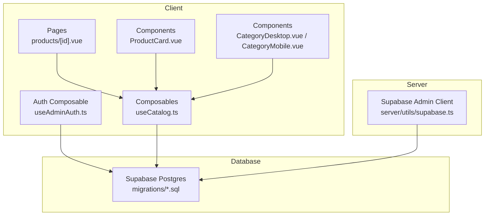
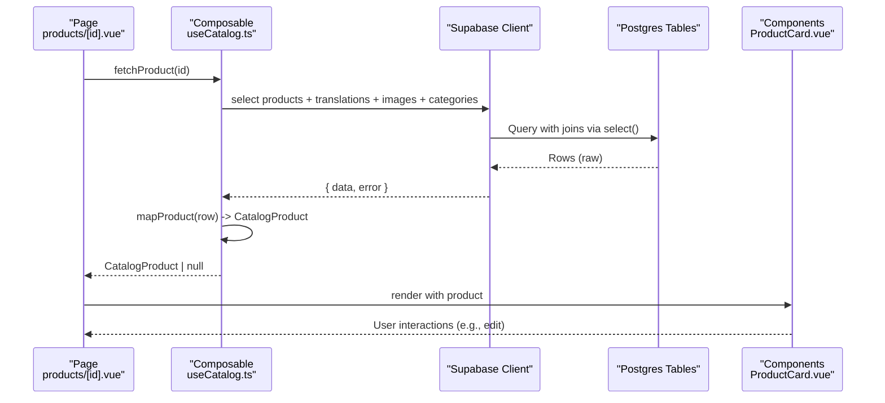
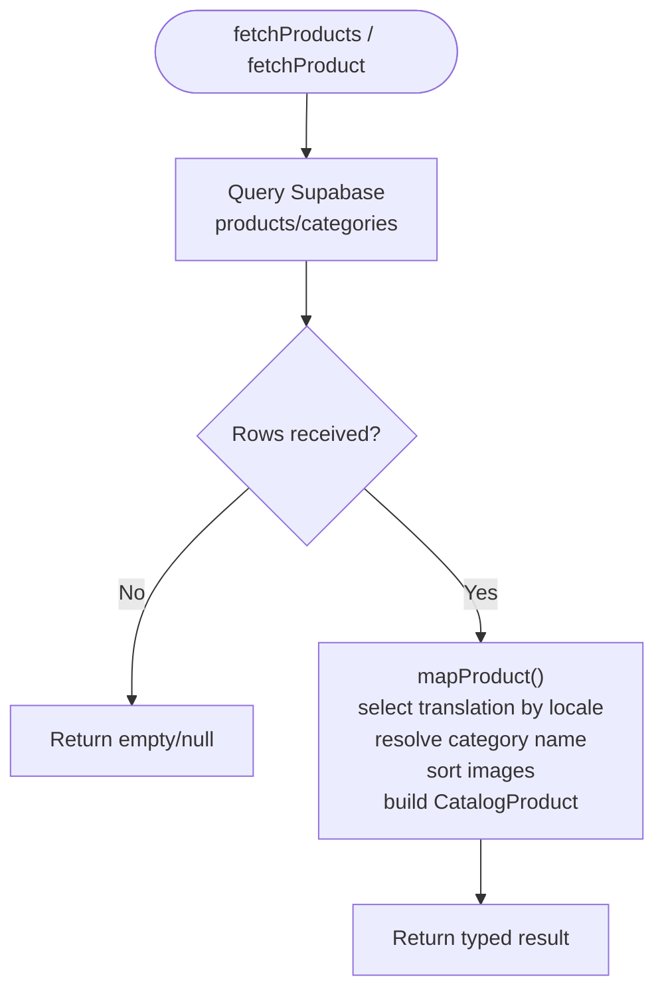
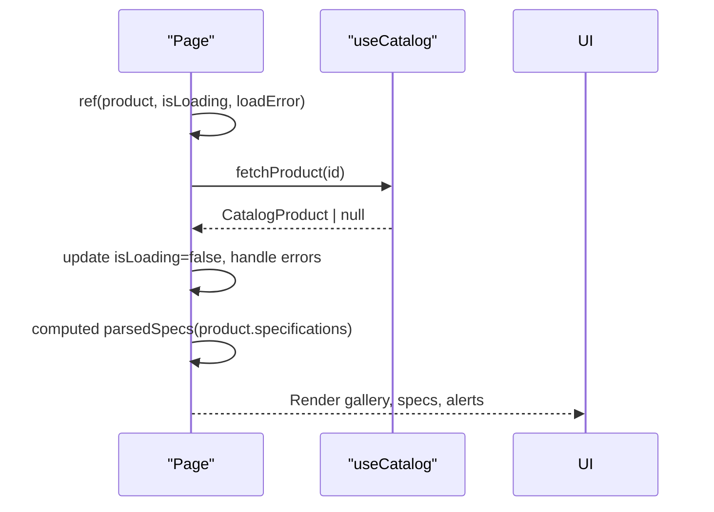
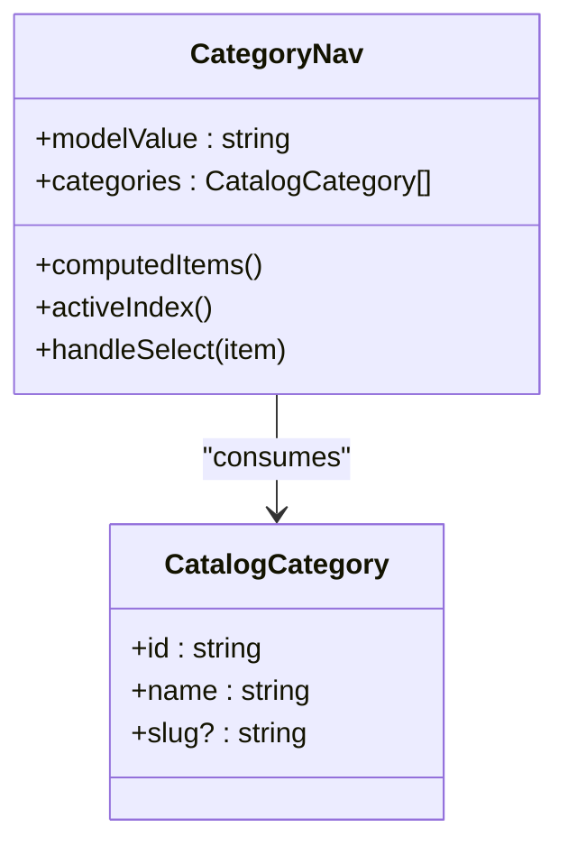
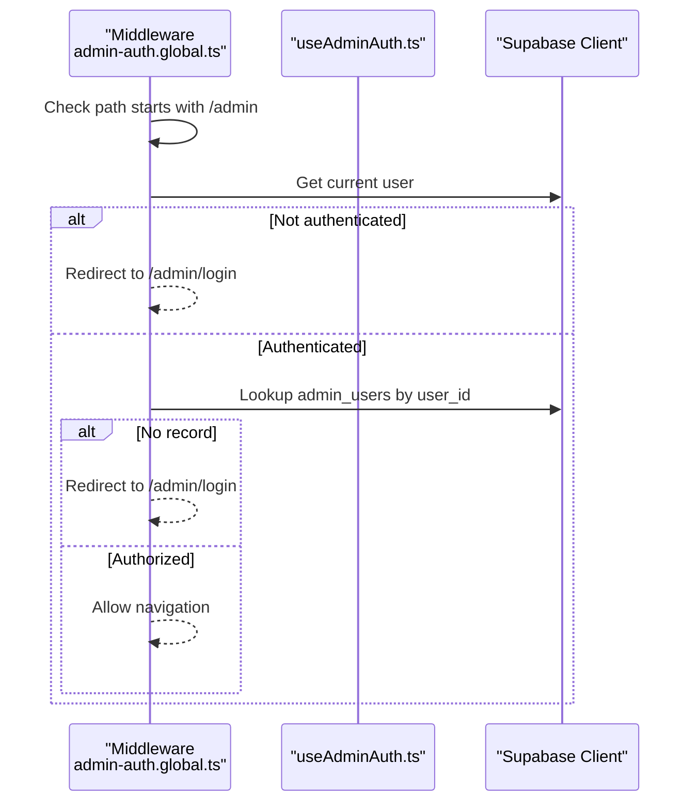
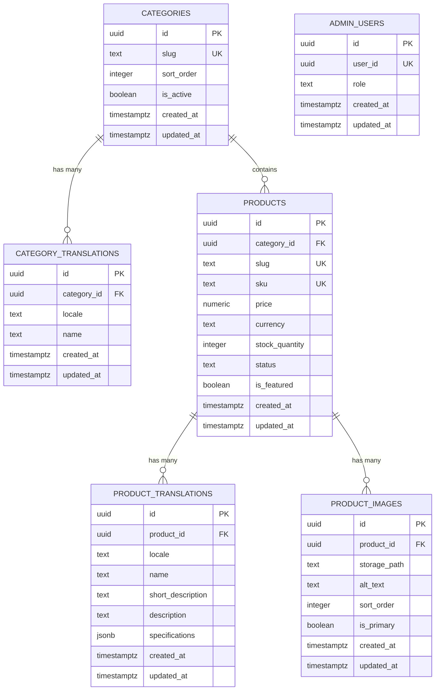
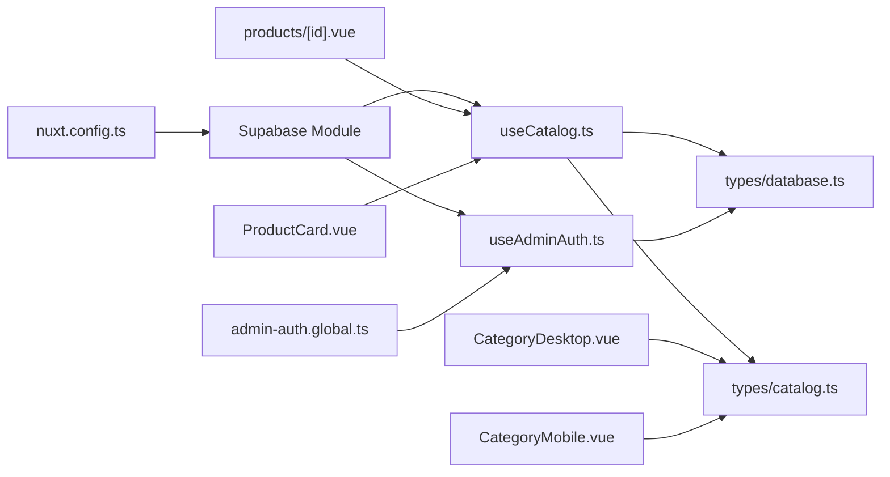

# Data Flow & State Management

<cite>
**Referenced Files in This Document**
- [useCatalog.ts](file://app/composables/useCatalog.ts)
- [useAdminAuth.ts](file://app/composables/useAdminAuth.ts)
- [supabase.ts](file://server/utils/supabase.ts)
- [database.ts](file://app/types/database.ts)
- [catalog.ts](file://app/types/catalog.ts)
- [product.ts](file://app/types/product.ts)
- [products/[id].vue](file://app/pages/products/[id].vue)
- [ProductCard.vue](file://app/components/ProductCard.vue)
- [CategoryDesktop.vue](file://app/components/category/CategoryDesktop.vue)
- [CategoryMobile.vue](file://app/components/category/CategoryMobile.vue)
- [admin-auth.global.ts](file://app/middleware/admin-auth.global.ts)
- [20260922_000001_create_catalog_schema.sql](file://supabase/migrations/20260922_000001_create_catalog_schema.sql)
- [nuxt.config.ts](file://nuxt.config.ts)
</cite>

## Table of Contents
1. Introduction
2. Project Structure
3. Core Components
4. Architecture Overview
5. Detailed Component Analysis
6. Dependency Analysis
7. Performance Considerations
8. Troubleshooting Guide
9. Conclusion

## Introduction
This document explains how data flows from the Supabase database through the client layer to Vue components using composables, and how reactive state is managed with Vue 3’s Composition API. It covers caching strategies for product and category data, type safety across the pipeline, error boundaries, and guidance on testing and debugging. It also clarifies the relationship between database types and application types and provides recommendations for real-time synchronization, optimistic updates, and conflict resolution.

## Project Structure
The application uses a Nuxt 3 project with:
- Composables that encapsulate data fetching and transformation
- Pages and components that consume composable-provided data
- Strongly typed interfaces for both database rows and application models
- Server-side utilities for privileged operations
- Middleware for route-level authorization

**Diagram sources**
- [products/[id].vue:1-47](file://app/pages/products/[id].vue#L1-L47)
- [ProductCard.vue:1-68](file://app/components/ProductCard.vue#L1-L68)
- [CategoryDesktop.vue:1-611](file://app/components/category/CategoryDesktop.vue#L1-L611)
- [CategoryMobile.vue:1-577](file://app/components/category/CategoryMobile.vue#L1-L577)
- [useCatalog.ts:1-61](file://app/composables/useCatalog.ts#L1-L61)
- [useAdminAuth.ts:1-79](file://app/composables/useAdminAuth.ts#L1-L79)
- [supabase.ts:1-20](file://server/utils/supabase.ts#L1-L20)
- [20260922_000001_create_catalog_schema.sql:1-113](file://supabase/migrations/20260922_000001_create_catalog_schema.sql#L1-L113)

**Section sources**
- [nuxt.config.ts:1-52](file://nuxt.config.ts#L1-L52)

## Core Components
- useCatalog: Central composable for catalog data access. It queries products and categories, maps raw rows into application types, resolves image URLs, and selects localized content based on the current i18n locale.
- useAdminAuth: Handles admin authentication checks, role verification, sign-in/sign-out, and exposes the current user session via Supabase’s composables.
- Products page: Loads a single product by id, manages loading/error states, and renders structured specifications parsed from JSON or text.
- ProductCard: Displays a product summary with image, price, stock status, and navigation to detail view.
- Category navigation (desktop/mobile): Provides interactive category selection with computed items derived from both static definitions and fetched categories.

Key responsibilities:
- Data fetching and mapping in composables
- Reactive UI state in pages/components
- Type-safe contracts between database and application layers

**Section sources**
- [useCatalog.ts:1-61](file://app/composables/useCatalog.ts#L1-L61)
- [useAdminAuth.ts:1-79](file://app/composables/useAdminAuth.ts#L1-L79)
- [products/[id].vue:1-47](file://app/pages/products/[id].vue#L1-L47)
- [ProductCard.vue:1-68](file://app/components/ProductCard.vue#L1-L68)
- [CategoryDesktop.vue:1-611](file://app/components/category/CategoryDesktop.vue#L1-L611)
- [CategoryMobile.vue:1-577](file://app/components/category/CategoryMobile.vue#L1-L577)

## Architecture Overview
End-to-end flow from database to UI:

**Diagram sources**
- [useCatalog.ts:13-47](file://app/composables/useCatalog.ts#L13-L47)
- [products/[id].vue:10-46](file://app/pages/products/[id].vue#L10-L46)
- [ProductCard.vue:1-68](file://app/components/ProductCard.vue#L1-L68)

## Detailed Component Analysis

### Data Fetching and Mapping Pipeline (useCatalog)
- Queries published products and categories with explicit select projections to minimize payload size.
- Maps raw rows into strongly-typed application models:
  - Product translation selection prefers current locale, falls back to English, then first available.
  - Category name resolution similar fallback strategy.
  - Image list sorted by sort_order; public URLs resolved via storage helper.
- Returns typed arrays of CatalogProduct and CatalogCategory.

**Diagram sources**
- [useCatalog.ts:13-57](file://app/composables/useCatalog.ts#L13-L57)

**Section sources**
- [useCatalog.ts:1-61](file://app/composables/useCatalog.ts#L1-L61)

### Reactive State in Detail Page (products/[id].vue)
- Uses ref for product, selectedImageIndex, isLoading, loadError.
- Async loadProduct sets loading flags, catches errors, and populates product.
- Computed parsedSpecs transforms stored specifications into a structured array for rendering, handling JSON arrays, objects, and plain text formats.
- Error boundary pattern: shows alert when loadError is set; otherwise displays not-found or product details.

**Diagram sources**
- [products/[id].vue:1-47](file://app/pages/products/[id].vue#L1-L47)

**Section sources**
- [products/[id].vue:1-177](file://app/pages/products/[id].vue#L1-L177)

### Category Navigation (Desktop/Mobile)
- Computes menu items from a static definition and merges with fetched categories to resolve names and values.
- Tracks active item index and emits selection changes via v-model.
- Implements drag-to-select with visual indicators and smooth transitions.
- Watches activeIndex and computedItems to keep indicator positioning accurate after layout changes.

**Diagram sources**
- [CategoryDesktop.vue:1-611](file://app/components/category/CategoryDesktop.vue#L1-L611)
- [CategoryMobile.vue:1-577](file://app/components/category/CategoryMobile.vue#L1-L577)
- [catalog.ts:26-31](file://app/types/catalog.ts#L26-L31)

**Section sources**
- [CategoryDesktop.vue:1-611](file://app/components/category/CategoryDesktop.vue#L1-L611)
- [CategoryMobile.vue:1-577](file://app/components/category/CategoryMobile.vue#L1-L577)

### Authentication and Authorization Flow
- useAdminAuth wraps Supabase auth to check roles and perform sign-in/sign-out.
- Global middleware guards /admin routes, redirecting unauthenticated or unauthorized users to login.

**Diagram sources**
- [admin-auth.global.ts:1-28](file://app/middleware/admin-auth.global.ts#L1-L28)
- [useAdminAuth.ts:1-79](file://app/composables/useAdminAuth.ts#L1-L79)

**Section sources**
- [useAdminAuth.ts:1-79](file://app/composables/useAdminAuth.ts#L1-L79)
- [admin-auth.global.ts:1-28](file://app/middleware/admin-auth.global.ts#L1-L28)

### Type Safety Across the Pipeline
- Database schema defines tables and constraints for categories, products, translations, images, and admin users.
- TypeScript types mirror database structures:
  - app/types/database.ts: Row types, enums, and full Database interface used by Supabase client.
  - app/types/catalog.ts: Application-facing models for UI consumption.
  - app/types/product.ts: Additional domain-specific records for product-related logic.
- Mapping functions ensure runtime conversion from DB rows to application models while preserving type safety at compile time.

**Diagram sources**
- [20260922_000001_create_catalog_schema.sql:3-67](file://supabase/migrations/20260922_000001_create_catalog_schema.sql#L3-L67)

**Section sources**
- [database.ts:1-123](file://app/types/database.ts#L1-L123)
- [catalog.ts:1-31](file://app/types/catalog.ts#L1-L31)
- [product.ts:1-40](file://app/types/product.ts#L1-L40)

## Dependency Analysis
- Composables depend on Supabase client configured via Nuxt modules and runtime config.
- Pages and components depend on composables for data and on i18n for localization.
- Middleware depends on Supabase client to enforce admin-only routes.
- Types are shared across layers to ensure consistency.

**Diagram sources**
- [nuxt.config.ts:1-52](file://nuxt.config.ts#L1-L52)
- [useCatalog.ts:1-61](file://app/composables/useCatalog.ts#L1-L61)
- [useAdminAuth.ts:1-79](file://app/composables/useAdminAuth.ts#L1-L79)
- [database.ts:1-123](file://app/types/database.ts#L1-L123)
- [catalog.ts:1-31](file://app/types/catalog.ts#L1-L31)
- [products/[id].vue:1-47](file://app/pages/products/[id].vue#L1-L47)
- [ProductCard.vue:1-68](file://app/components/ProductCard.vue#L1-L68)
- [CategoryDesktop.vue:1-611](file://app/components/category/CategoryDesktop.vue#L1-L611)
- [CategoryMobile.vue:1-577](file://app/components/category/CategoryMobile.vue#L1-L577)
- [admin-auth.global.ts:1-28](file://app/middleware/admin-auth.global.ts#L1-L28)

**Section sources**
- [nuxt.config.ts:1-52](file://nuxt.config.ts#L1-L52)

## Performance Considerations
- Use explicit select projections to reduce payload size and avoid over-fetching.
- Sort images server-side where possible; here sorting occurs client-side after retrieval.
- Avoid unnecessary re-renders by keeping state minimal and leveraging computed properties for derived data.
- Defer heavy computations to computed or watchers triggered only when dependencies change.
- For large catalogs, consider pagination or infinite scroll patterns in future iterations.

[No sources needed since this section provides general guidance]

## Troubleshooting Guide
Common issues and remedies:
- Missing environment configuration: Ensure Supabase URL and keys are set in runtime config; missing service role key will throw during server-side client creation.
- Admin authorization failures: Middleware logs errors and redirects to login if admin lookup fails or no record exists.
- Product load errors: The detail page captures errors and displays an alert; verify network requests and Supabase policies.
- Specification parsing: If specifications are malformed, the parser falls back to raw text; validate input format in the database.

Debugging tips:
- Inspect network tab for Supabase requests and responses.
- Add logging around mapping functions to verify locale selection and category name resolution.
- Use browser devtools to inspect reactive refs and computed values in pages and components.

**Section sources**
- [supabase.ts:1-20](file://server/utils/supabase.ts#L1-L20)
- [admin-auth.global.ts:1-28](file://app/middleware/admin-auth.global.ts#L1-L28)
- [products/[id].vue:10-46](file://app/pages/products/[id].vue#L10-L46)

## Real-Time Sync, Optimistic Updates, and Conflict Resolution
Current implementation:
- Data is fetched on demand via composables; there is no real-time subscription implemented yet.
- No optimistic updates are present; writes are not exposed in the current codebase.

Recommendations:
- Real-time synchronization:
  - Subscribe to changes on relevant tables (products, categories, product_translations) using Supabase channels.
  - Update local state reactively upon receiving events; invalidate caches when necessary.
- Optimistic updates:
  - On write actions, immediately update local state to reflect expected changes.
  - Roll back on failure; show user feedback for transient errors.
- Conflict resolution:
  - Implement server-side versioning or timestamps to detect conflicts.
  - Merge strategies: last-write-wins for simple fields; structured merge for JSONB specifications.
  - Provide user prompts for manual resolution when conflicts cannot be auto-resolved.

[No sources needed since this section provides general guidance]

## Testing Data Flows and Debugging State
- Unit tests for composables:
  - Mock Supabase client methods to test fetchProducts, fetchProduct, fetchCategories.
  - Validate mapping logic for locale fallbacks, category name resolution, and image URL generation.
- Component tests:
  - Render ProductCard with sample CatalogProduct and assert displayed fields.
  - Verify Category navigation emits correct modelValue updates on selection.
- Integration tests:
  - Use test fixtures to simulate Supabase responses and assert page behavior under success and error paths.
- Debugging state:
  - Log reactive state transitions in pages and components.
  - Use Vue DevTools to inspect refs, computed values, and watcher triggers.

[No sources needed since this section provides general guidance]

## Conclusion
The application follows a clear separation of concerns: composables encapsulate data access and transformation, pages manage reactive UI state, and components focus on presentation. Strong typing ensures consistency from the database schema to the UI models. While real-time sync and optimistic updates are not currently implemented, the architecture supports straightforward extension. Careful attention to error handling, performance, and testing will further improve reliability and maintainability.