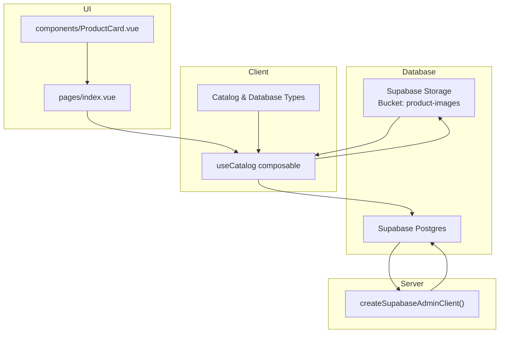
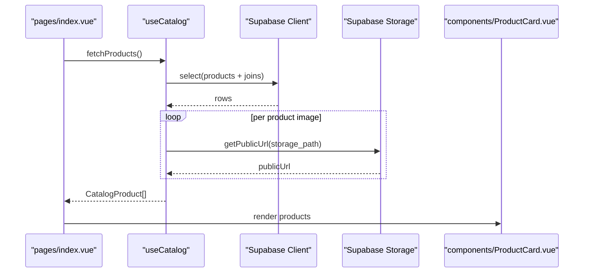
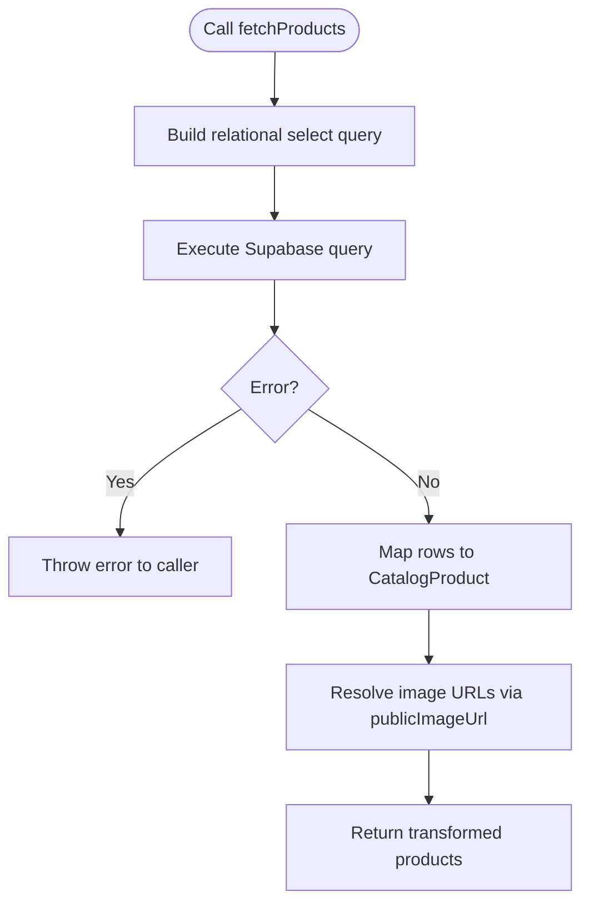
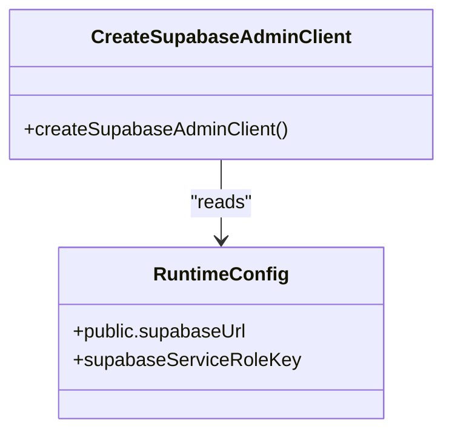
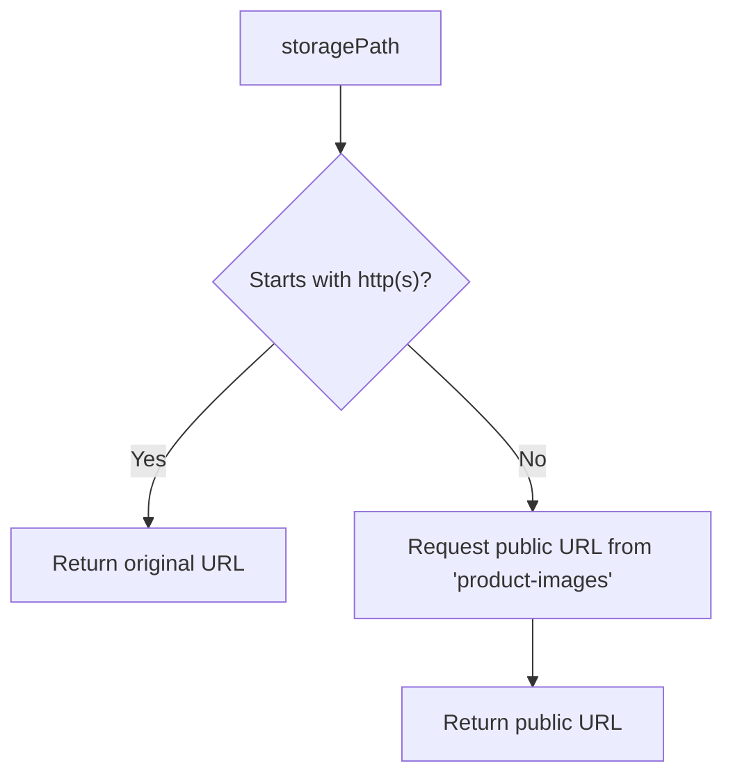
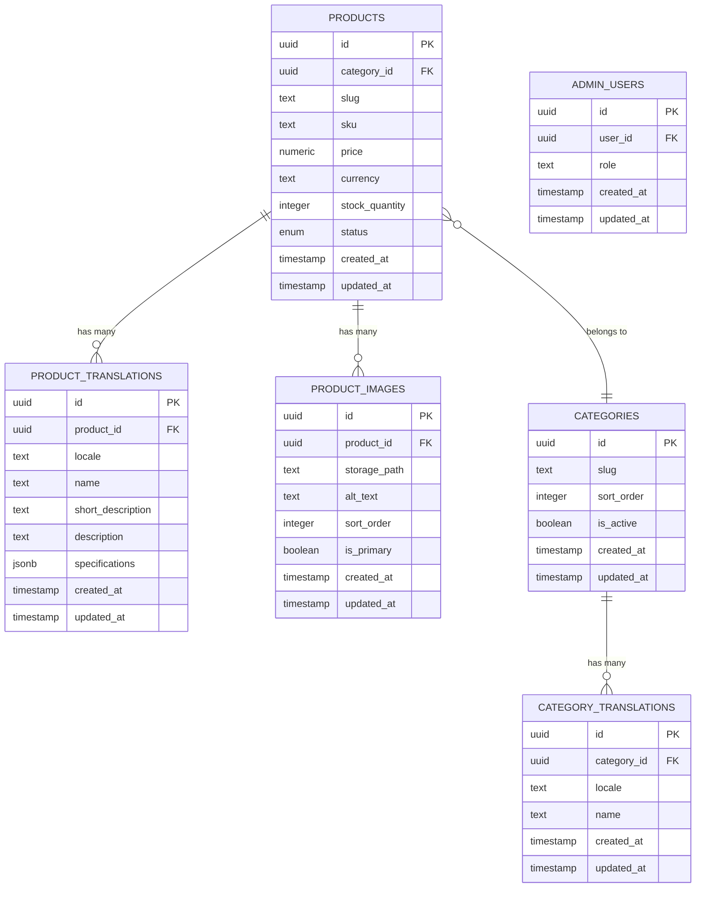
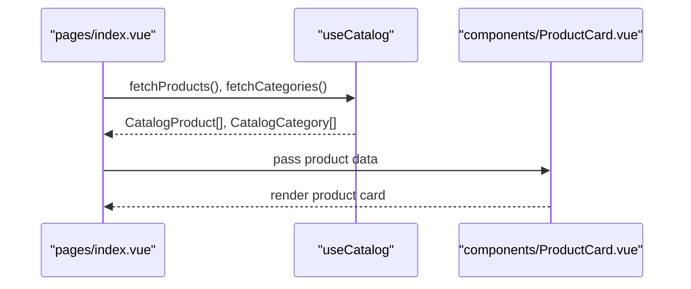
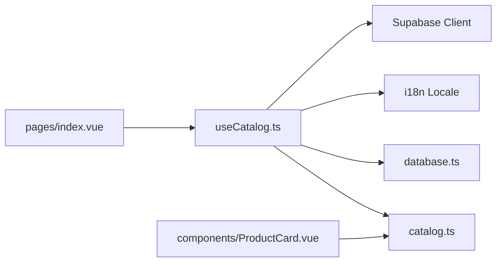

# Data Pipeline Architecture

<cite>
**Referenced Files in This Document**
- [useCatalog.ts](file://app/composables/useCatalog.ts)
- [supabase.ts](file://server/utils/supabase.ts)
- [database.ts](file://app/types/database.ts)
- [catalog.ts](file://app/types/catalog.ts)
- [index.vue](file://app/pages/index.vue)
- [ProductCard.vue](file://app/components/ProductCard.vue)
- [20260922_000001_create_catalog_schema.sql](file://supabase/migrations/20260922_000001_create_catalog_schema.sql)
- [20260922000002_storage_and_rls.sql](file://supabase/migrations/20260922000002_storage_and_rls.sql)
</cite>

## Table of Contents
1. [Introduction](#introduction)
2. [Project Structure](#project-structure)
3. [Core Components](#core-components)
4. [Architecture Overview](#architecture-overview)
5. [Detailed Component Analysis](#detailed-component-analysis)
6. [Dependency Analysis](#dependency-analysis)
7. [Performance Considerations](#performance-considerations)
8. [Troubleshooting Guide](#troubleshooting-guide)
9. [Conclusion](#conclusion)
10. [Appendices](#appendices)

## Introduction
This document explains the data pipeline architecture in Raccoon-Gear-Bin, focusing on how data flows from Supabase through the client layer to Vue components. It documents the central `useCatalog` composable as the primary data access layer, including query construction, data transformation, and error handling patterns. It also covers Supabase client configuration, image storage path resolution via `publicImageUrl`, caching strategies, performance optimizations, retry mechanisms, and guidance for extending the pipeline with new entities and custom transformations.

## Project Structure
The data pipeline spans several layers:
- Database schema and policies define tables, relationships, and security rules.
- Server-side utilities configure a Supabase admin client for privileged operations.
- Client composables encapsulate queries, transformations, and UI-facing types.
- Pages and components consume composables and render catalog data.

**Diagram sources**
- [supabase.ts:3-19](file://server/utils/supabase.ts#L3-L19)
- [useCatalog.ts:4-59](file://app/composables/useCatalog.ts#L4-L59)
- [20260922000002_storage_and_rls.sql:162-205](file://supabase/migrations/20260922000002_storage_and_rls.sql#L162-L205)

**Section sources**
- [database.ts:77-122](file://app/types/database.ts#L77-L122)
- [supabase.ts:3-19](file://server/utils/supabase.ts#L3-L19)
- [useCatalog.ts:4-59](file://app/composables/useCatalog.ts#L4-L59)

## Core Components
- `useCatalog`: Central composable that constructs queries, maps database rows to UI-friendly models, resolves image URLs, and exposes fetch functions for products and categories.
- `createSupabaseAdminClient`: Server utility that creates a Supabase client using service role credentials for privileged server-side operations.
- Type definitions:
  - `Database` interface describes the Supabase schema for type-safe queries.
  - `CatalogProduct` and `CatalogCategory` describe UI-facing models used by components.

Key responsibilities:
- Query construction with joins via Supabase relational selects.
- Data transformation into typed domain models.
- Image URL resolution using Supabase Storage public URLs.
- Error propagation to callers for consistent handling.

**Section sources**
- [useCatalog.ts:4-59](file://app/composables/useCatalog.ts#L4-L59)
- [supabase.ts:3-19](file://server/utils/supabase.ts#L3-L19)
- [catalog.ts:1-31](file://app/types/catalog.ts#L1-L31)
- [database.ts:77-122](file://app/types/database.ts#L77-L122)

## Architecture Overview
The data flow follows these steps:
1. A page or component calls `useCatalog` methods (e.g., `fetchProducts`, `fetchCategories`).
2. The composable builds a Supabase query with relational selects to join related tables (products, translations, images, categories).
3. Supabase returns normalized rows; the composable transforms them into `CatalogProduct` and `CatalogCategory`.
4. For each product image, `publicImageUrl` resolves a public URL from the `product-images` storage bucket.
5. The transformed data is returned to the caller, which updates reactive state and renders UI components like `ProductCard`.

**Diagram sources**
- [useCatalog.ts:37-47](file://app/composables/useCatalog.ts#L37-L47)
- [useCatalog.ts:8-11](file://app/composables/useCatalog.ts#L8-L11)
- [index.vue:46-56](file://app/pages/index.vue#L46-L56)
- [ProductCard.vue:14-23](file://app/components/ProductCard.vue#L14-L23)

## Detailed Component Analysis

### useCatalog Composable
Responsibilities:
- Access Supabase client and i18n locale context.
- Resolve public image URLs via `publicImageUrl`.
- Map raw database rows to `CatalogProduct` and `CatalogCategory`.
- Provide `fetchProducts`, `fetchProduct`, and `fetchCategories`.

Query construction:
- Uses relational selects to include translations, images, and category details.
- Filters published products and orders by creation time.
- Fetches active categories ordered by sort order.

Data transformation:
- Selects localized translation based on current locale, falling back to English or first available.
- Normalizes price to number, formats specifications as string, sorts images by `sort_order`, and attaches resolved URLs.

Error handling:
- Throws errors from Supabase responses so callers can catch and display user-friendly messages.

**Diagram sources**
- [useCatalog.ts:37-47](file://app/composables/useCatalog.ts#L37-L47)
- [useCatalog.ts:13-33](file://app/composables/useCatalog.ts#L13-L33)
- [useCatalog.ts:8-11](file://app/composables/useCatalog.ts#L8-L11)

**Section sources**
- [useCatalog.ts:4-59](file://app/composables/useCatalog.ts#L4-L59)

### Supabase Client Configuration
Server-side admin client:
- Reads runtime config for Supabase URL and service role key.
- Validates required configuration and throws if missing.
- Creates a client with session persistence disabled for server-side usage.

Note: The client layer uses Nuxt’s `useSupabaseClient` within composables; the server utility provides an admin client for privileged operations.

**Diagram sources**
- [supabase.ts:3-19](file://server/utils/supabase.ts#L3-L19)

**Section sources**
- [supabase.ts:3-19](file://server/utils/supabase.ts#L3-L19)

### Image Storage Path Resolution
`publicImageUrl`:
- Accepts a storage path.
- If already an absolute HTTP(S) URL, returns it unchanged.
- Otherwise, requests a public URL from the `product-images` storage bucket and returns it.

Security policy:
- Public read access is allowed for the `product-images` bucket.
- Admin-only write/update/delete policies protect uploads and modifications.

**Diagram sources**
- [useCatalog.ts:8-11](file://app/composables/useCatalog.ts#L8-L11)
- [20260922000002_storage_and_rls.sql:162-205](file://supabase/migrations/20260922000002_storage_and_rls.sql#L162-L205)

**Section sources**
- [useCatalog.ts:8-11](file://app/composables/useCatalog.ts#L8-L11)
- [20260922000002_storage_and_rls.sql:162-205](file://supabase/migrations/20260922000002_storage_and_rls.sql#L162-L205)

### Data Models and Relationships
Database schema:
- Products, product_translations, product_images, categories, category_translations, admin_users.
- Foreign keys link images and translations to products; categories are linked via `category_id`.

UI models:
- `CatalogProduct` includes localized name/description/specifications, sorted images with public URLs, and category metadata.
- `CatalogCategory` includes localized name and slug.

**Diagram sources**
- [database.ts:14-75](file://app/types/database.ts#L14-L75)
- [20260922_000001_create_catalog_schema.sql:36-67](file://supabase/migrations/20260922_000001_create_catalog_schema.sql#L36-L67)

**Section sources**
- [database.ts:14-75](file://app/types/database.ts#L14-L75)
- [catalog.ts:1-31](file://app/types/catalog.ts#L1-L31)
- [20260922_000001_create_catalog_schema.sql:36-67](file://supabase/migrations/20260922_000001_create_catalog_schema.sql#L36-L67)

### Complex Queries: Joins, Filtering, Sorting
- Relational select joins products with translations, images, and categories.
- Filters applied:
  - Published products only (`status = 'published'`).
  - Active categories only (`is_active = true`).
- Sorting:
  - Products ordered by `created_at` descending.
  - Categories ordered by `sort_order`.
  - Images sorted by `sort_order` during transformation.

These patterns ensure efficient data retrieval and consistent ordering across the UI.

**Section sources**
- [useCatalog.ts:35-57](file://app/composables/useCatalog.ts#L35-L57)
- [index.vue:46-56](file://app/pages/index.vue#L46-L56)

### UI Consumption and Rendering
- `pages/index.vue` loads categories and products concurrently using parallel promises, maps rows to UI models, and handles loading/error states.
- `components/ProductCard.vue` consumes `CatalogProduct` to render product cards, including images and pricing.

**Diagram sources**
- [index.vue:46-56](file://app/pages/index.vue#L46-L56)
- [ProductCard.vue:14-23](file://app/components/ProductCard.vue#L14-L23)

**Section sources**
- [index.vue:46-56](file://app/pages/index.vue#L46-L56)
- [ProductCard.vue:1-68](file://app/components/ProductCard.vue#L1-L68)

## Dependency Analysis
- `useCatalog` depends on:
  - Supabase client for querying and storage.
  - i18n locale for localized content selection.
  - Database types for type safety.
  - Catalog types for UI models.
- `pages/index.vue` depends on `useCatalog` for data fetching and mapping.
- `components/ProductCard.vue` depends on `CatalogProduct` model.

**Diagram sources**
- [useCatalog.ts:1-59](file://app/composables/useCatalog.ts#L1-L59)
- [index.vue:46-56](file://app/pages/index.vue#L46-L56)
- [ProductCard.vue:1-68](file://app/components/ProductCard.vue#L1-L68)

**Section sources**
- [useCatalog.ts:1-59](file://app/composables/useCatalog.ts#L1-L59)
- [index.vue:46-56](file://app/pages/index.vue#L46-L56)
- [ProductCard.vue:1-68](file://app/components/ProductCard.vue#L1-L68)

## Performance Considerations
- Use relational selects to minimize round trips and reduce N+1 queries.
- Sort images server-side where possible; currently sorted client-side after retrieval.
- Avoid selecting unnecessary fields; keep select strings minimal.
- Leverage parallel fetching for independent datasets (categories and products).
- Consider pagination for large catalogs to limit payload size.
- Cache results at the composable level or use Nuxt’s data fetching features to avoid redundant network calls.
- For retries, wrap async calls with exponential backoff and circuit breaker patterns to handle transient failures gracefully.

[No sources needed since this section provides general guidance]

## Troubleshooting Guide
Common issues and resolutions:
- Missing Supabase configuration:
  - Ensure `supabaseUrl` and `supabaseServiceRoleKey` are set in runtime config.
  - The admin client throws an error if either is missing.
- Storage access errors:
  - Verify the `product-images` bucket exists and policies allow public reads.
  - Confirm storage paths are correct and accessible.
- Query errors:
  - Check filters and joins match the schema.
  - Validate that statuses and flags align with stored values.
- Localization fallbacks:
  - Ensure translations exist for the target locale; fallback to English or first available.

Actionable checks:
- Validate environment variables and runtime config.
- Inspect Supabase policies for storage and RLS for tables.
- Log and surface errors from Supabase responses to users.

**Section sources**
- [supabase.ts:9-11](file://server/utils/supabase.ts#L9-L11)
- [20260922000002_storage_and_rls.sql:162-205](file://supabase/migrations/20260922000002_storage_and_rls.sql#L162-L205)

## Conclusion
Raccoon-Gear-Bin’s data pipeline centers around the `useCatalog` composable, which orchestrates Supabase queries, transforms data into UI-friendly models, and resolves image URLs from storage. The server-side admin client provides privileged access when needed. By following the documented patterns—relational selects, localized transformations, robust error handling, and secure storage policies—the application achieves a clean, maintainable, and performant data flow from database to Vue components. Extending the pipeline involves adding new entities to the schema, updating type definitions, and implementing corresponding composable methods with consistent query and transformation logic.

[No sources needed since this section summarizes without analyzing specific files]

## Appendices

### Extending the Data Pipeline
Steps to add a new entity:
1. Define database schema and migrations for the new table(s).
2. Update `Database` types to reflect the new schema.
3. Add UI-facing types under `catalog.ts` if needed.
4. Extend `useCatalog` with new fetch methods:
   - Construct relational selects.
   - Apply filters and sorting.
   - Map rows to UI models.
   - Handle errors consistently.
5. Integrate new endpoints in pages/components.

Guidelines:
- Keep select strings minimal and explicit.
- Prefer server-side filtering and sorting where feasible.
- Implement localization fallbacks consistently.
- Use consistent error propagation and user messaging.

[No sources needed since this section provides general guidance]