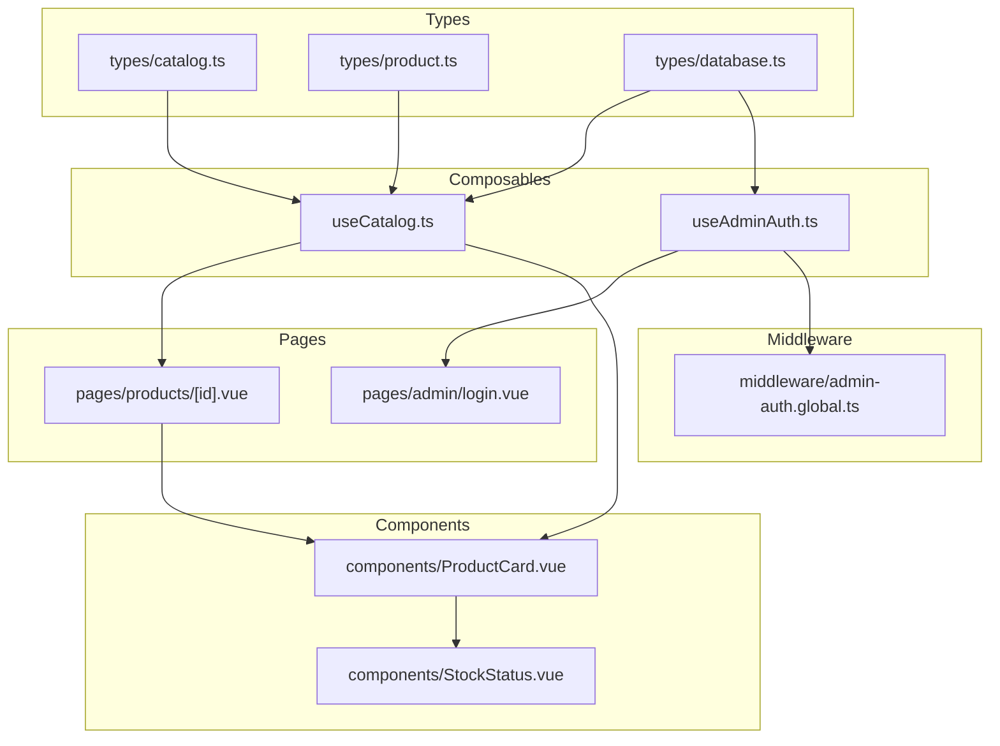
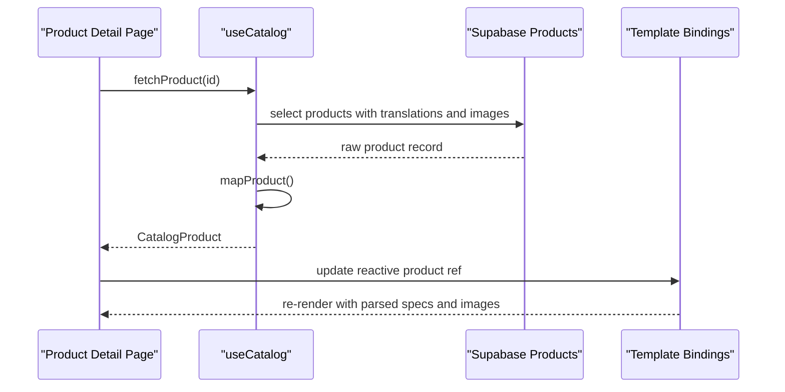
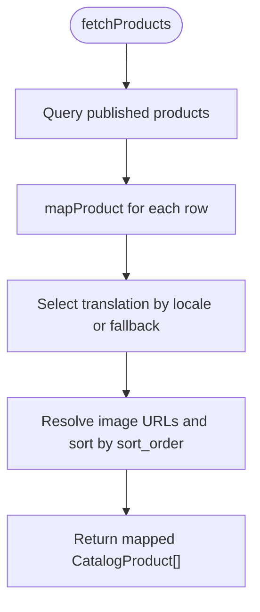
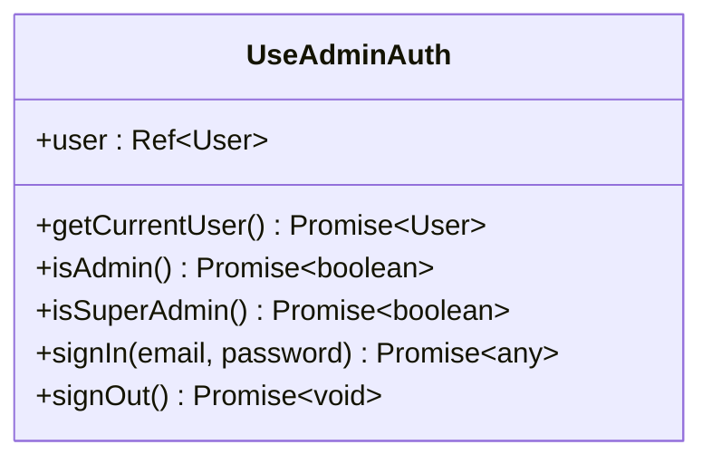
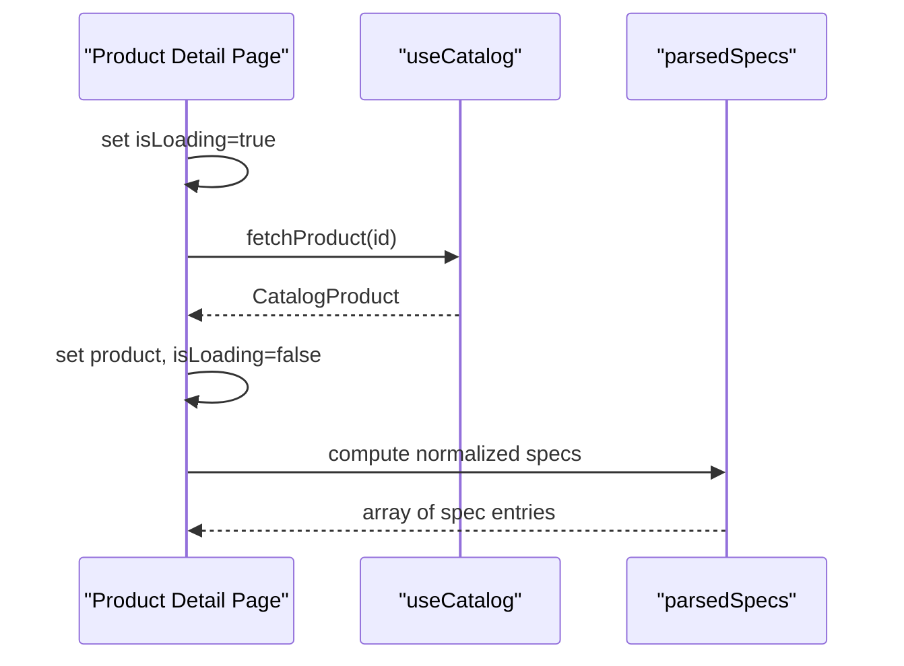
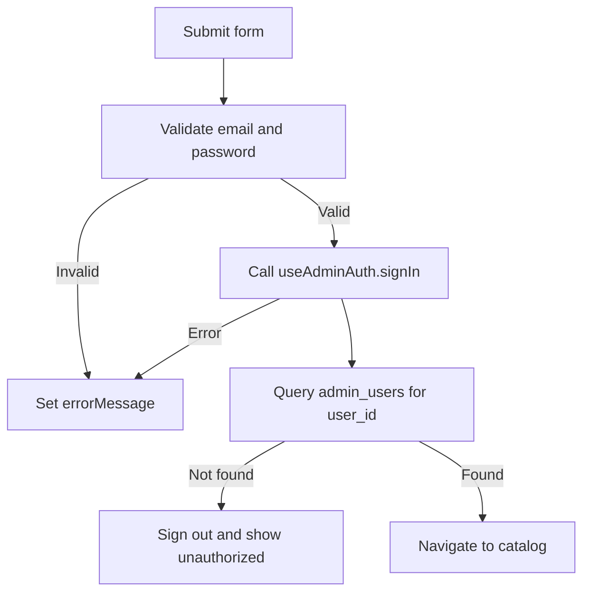
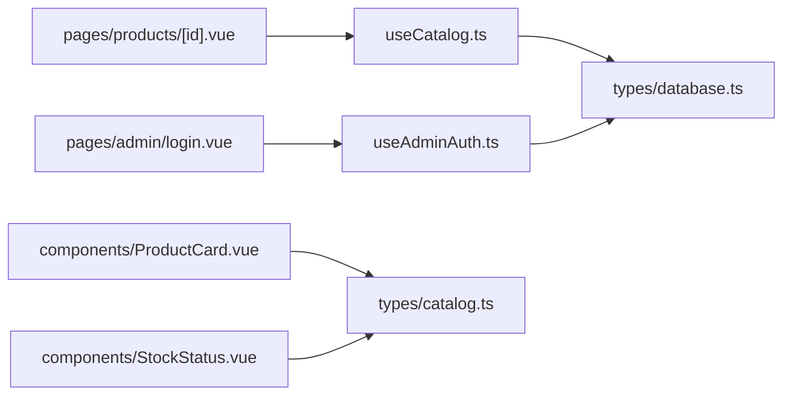

# Reactive State Patterns

<cite>
**Referenced Files in This Document**
- [useCatalog.ts](file://app/composables/useCatalog.ts)
- [useAdminAuth.ts](file://app/composables/useAdminAuth.ts)
- [catalog.ts](file://app/types/catalog.ts)
- [product.ts](file://app/types/product.ts)
- [database.ts](file://app/types/database.ts)
- [products/[id].vue](file://app/pages/products/[id].vue)
- [ProductCard.vue](file://app/components/ProductCard.vue)
- [StockStatus.vue](file://app/components/StockStatus.vue)
- [admin-auth.global.ts](file://app/middleware/admin-auth.global.ts)
- [admin/login.vue](file://app/pages/admin/login.vue)
</cite>

## Table of Contents
1. [Introduction](#introduction)
2. [Project Structure](#project-structure)
3. [Core Components](#core-components)
4. [Architecture Overview](#architecture-overview)
5. [Detailed Component Analysis](#detailed-component-analysis)
6. [Dependency Analysis](#dependency-analysis)
7. [Performance Considerations](#performance-considerations)
8. [Troubleshooting Guide](#troubleshooting-guide)
9. [Conclusion](#conclusion)

## Introduction
This document explains reactive state management patterns using the Vue 3 Composition API in this project. It focuses on how composables manage application state, how components bind to reactive data, and how to reason about state lifecycles, cleanup, memory usage, real-time updates, optimistic UI, conflict resolution, testing, and debugging. The goal is to make these patterns understandable for both new and experienced developers.

## Project Structure
The reactive state in this codebase is primarily organized around:
- Composables that encapsulate business logic and data fetching
- Pages that own component-level reactive state and orchestrate composable calls
- Presentational components that consume props and computed values
- Middleware that guards routes based on authentication state
- Type definitions that describe database rows and domain models

**Diagram sources**
- [useCatalog.ts:1-61](file://app/composables/useCatalog.ts#L1-L61)
- [useAdminAuth.ts:1-79](file://app/composables/useAdminAuth.ts#L1-L79)
- [products/[id].vue:1-177](file://app/pages/products/[id].vue#L1-L177)
- [ProductCard.vue:1-68](file://app/components/ProductCard.vue#L1-L68)
- [StockStatus.vue:1-20](file://app/components/StockStatus.vue#L1-L20)
- [admin-auth.global.ts:1-28](file://app/middleware/admin-auth.global.ts#L1-L28)
- [catalog.ts:1-31](file://app/types/catalog.ts#L1-L31)
- [product.ts:1-40](file://app/types/product.ts#L1-L40)
- [database.ts:1-123](file://app/types/database.ts#L1-L123)

**Section sources**
- [useCatalog.ts:1-61](file://app/composables/useCatalog.ts#L1-L61)
- [useAdminAuth.ts:1-79](file://app/composables/useAdminAuth.ts#L1-L79)
- [products/[id].vue:1-177](file://app/pages/products/[id].vue#L1-L177)
- [ProductCard.vue:1-68](file://app/components/ProductCard.vue#L1-L68)
- [StockStatus.vue:1-20](file://app/components/StockStatus.vue#L1-L20)
- [admin-auth.global.ts:1-28](file://app/middleware/admin-auth.global.ts#L1-L28)
- [catalog.ts:1-31](file://app/types/catalog.ts#L1-L31)
- [product.ts:1-40](file://app/types/product.ts#L1-L40)
- [database.ts:1-123](file://app/types/database.ts#L1-L123)

## Core Components
This section summarizes the key reactive building blocks.

- useCatalog
  - Encapsulates product and category fetching from Supabase
  - Maps raw database records into typed catalog models
  - Provides localized image URLs and sorted images
  - Returns pure async functions; no local reactive state inside the composable

- useAdminAuth
  - Wraps Supabase auth client and user state
  - Exposes admin role checks and sign-in/sign-out flows
  - Returns a reactive user object alongside async authorization helpers

- Product detail page
  - Owns component-level reactive state: product, loading, error, selected image index
  - Uses computed properties to parse and normalize specifications
  - Binds UI to reactive state and triggers data loading on mount

- Product card and stock status
  - Presentational components consuming typed props
  - Compute derived display values (e.g., stock status label and styles)

**Section sources**
- [useCatalog.ts:1-61](file://app/composables/useCatalog.ts#L1-L61)
- [useAdminAuth.ts:1-79](file://app/composables/useAdminAuth.ts#L1-L79)
- [products/[id].vue:1-177](file://app/pages/products/[id].vue#L1-L177)
- [ProductCard.vue:1-68](file://app/components/ProductCard.vue#L1-L68)
- [StockStatus.vue:1-20](file://app/components/StockStatus.vue#L1-L20)

## Architecture Overview
The architecture separates concerns between data access (composables), presentation (components), and route protection (middleware).

**Diagram sources**
- [products/[id].vue:1-47](file://app/pages/products/[id].vue#L1-L47)
- [useCatalog.ts:13-47](file://app/composables/useCatalog.ts#L13-L47)

## Detailed Component Analysis

### useCatalog: Data Access and Mapping
Responsibilities:
- Fetch published products and categories
- Map database rows to typed catalog models
- Resolve public image URLs and sort images by order
- Provide localized names and descriptions

Reactive aspects:
- No internal reactive state; returns pure async functions
- Relies on i18n locale to choose localized content
- Image URL resolution uses Supabase storage client

Complexity notes:
- Mapping iterates over nested arrays (translations, images, categories)
- Sorting images by sort_order is O(n log n) per product

Error handling:
- Throws errors from Supabase queries to callers
- Gracefully falls back to default locale or slug when translations are missing

Optimization opportunities:
- Cache fetched products/categories at app level if reused across pages
- Memoize mapping results keyed by product id and locale
- Avoid repeated getPublicUrl calls by caching URL mappings

**Diagram sources**
- [useCatalog.ts:37-41](file://app/composables/useCatalog.ts#L37-L41)
- [useCatalog.ts:13-33](file://app/composables/useCatalog.ts#L13-L33)

**Section sources**
- [useCatalog.ts:1-61](file://app/composables/useCatalog.ts#L1-L61)
- [catalog.ts:1-31](file://app/types/catalog.ts#L1-L31)

### useAdminAuth: Authentication and Authorization
Responsibilities:
- Get current user from Supabase auth
- Check admin and super-admin roles via admin_users table
- Provide signIn and signOut flows

Reactive aspects:
- Exposes a reactive user object from the framework’s auth integration
- Role checks are async functions that query the database

Error handling:
- Logs and returns false on failed role checks
- Propagates auth errors from signIn and signOut

Security considerations:
- Always verify server-side policies; client checks are for UX only
- Avoid storing sensitive tokens in local state beyond what the SDK manages

**Diagram sources**
- [useAdminAuth.ts:3-79](file://app/composables/useAdminAuth.ts#L3-L79)

**Section sources**
- [useAdminAuth.ts:1-79](file://app/composables/useAdminAuth.ts#L1-L79)
- [database.ts:69-75](file://app/types/database.ts#L69-L75)

### Product Detail Page: Reactive State Lifecycle
State model:
- product: reactive reference to the loaded CatalogProduct
- isLoading: boolean flag for loading state
- loadError: string message for errors
- selectedImageIndex: number for gallery selection
- parsedSpecs: computed property that normalizes specifications

Lifecycle:
- On setup, call loadProduct to fetch data
- Update isLoading before request and clear it in finally
- Set loadError on failure and product on success
- UseHead sets dynamic title based on product name

Computed pattern:
- parsedSpecs parses JSON or structured text into an array of spec entries
- Falls back gracefully when input is malformed

**Diagram sources**
- [products/[id].vue:10-46](file://app/pages/products/[id].vue#L10-L46)

**Section sources**
- [products/[id].vue:1-177](file://app/pages/products/[id].vue#L1-L177)

### Product Card and Stock Status: Reactive Props and Computed Display
- ProductCard receives a typed CatalogProduct prop and emits edit events
- StockStatus computes a status object based on quantity thresholds
- Both components are presentational and do not mutate parent state directly

Best practices demonstrated:
- Strong typing via props and emits
- Derived display values through computed properties
- Clear separation of concerns between data and presentation

**Section sources**
- [ProductCard.vue:1-68](file://app/components/ProductCard.vue#L1-L68)
- [StockStatus.vue:1-20](file://app/components/StockStatus.vue#L1-L20)
- [catalog.ts:1-31](file://app/types/catalog.ts#L1-L31)

### Admin Login: Form State and Auth Flow
Form state:
- email, password, isSubmitting, errorMessage are refs
- handleSubmit validates inputs, calls signIn, verifies admin role, and navigates

Integration points:
- Uses useAdminAuth.signIn
- Directly queries admin_users to confirm admin privileges after login
- Displays errors and disables submit while submitting

**Diagram sources**
- [admin/login.vue:15-54](file://app/pages/admin/login.vue#L15-L54)

**Section sources**
- [admin/login.vue:1-121](file://app/pages/admin/login.vue#L1-L121)
- [useAdminAuth.ts:56-69](file://app/composables/useAdminAuth.ts#L56-L69)

### Route Guard: Middleware-Based Authorization
Behavior:
- Guards /admin/* routes except /admin/login
- Checks for authenticated user
- Queries admin_users to ensure user has admin privileges
- Redirects to login on failure

Notes:
- Performs its own direct Supabase check rather than using useAdminAuth
- Should be aligned with composable-based checks for consistency

**Section sources**
- [admin-auth.global.ts:1-28](file://app/middleware/admin-auth.global.ts#L1-L28)

## Dependency Analysis
Key relationships:
- Pages depend on composables for data and auth
- Components depend on typed props and computed values
- Types define contracts between layers

**Diagram sources**
- [products/[id].vue:1-177](file://app/pages/products/[id].vue#L1-L177)
- [admin/login.vue:1-121](file://app/pages/admin/login.vue#L1-L121)
- [ProductCard.vue:1-68](file://app/components/ProductCard.vue#L1-L68)
- [StockStatus.vue:1-20](file://app/components/StockStatus.vue#L1-L20)
- [useCatalog.ts:1-61](file://app/composables/useCatalog.ts#L1-L61)
- [useAdminAuth.ts:1-79](file://app/composables/useAdminAuth.ts#L1-L79)
- [catalog.ts:1-31](file://app/types/catalog.ts#L1-L31)
- [database.ts:1-123](file://app/types/database.ts#L1-L123)

**Section sources**
- [products/[id].vue:1-177](file://app/pages/products/[id].vue#L1-L177)
- [admin/login.vue:1-121](file://app/pages/admin/login.vue#L1-L121)
- [ProductCard.vue:1-68](file://app/components/ProductCard.vue#L1-L68)
- [StockStatus.vue:1-20](file://app/components/StockStatus.vue#L1-L20)
- [useCatalog.ts:1-61](file://app/composables/useCatalog.ts#L1-L61)
- [useAdminAuth.ts:1-79](file://app/composables/useAdminAuth.ts#L1-L79)
- [catalog.ts:1-31](file://app/types/catalog.ts#L1-L31)
- [database.ts:1-123](file://app/types/database.ts#L1-L123)

## Performance Considerations
- Prefer computed properties for derived data to avoid unnecessary recalculations
- Debounce or throttle expensive computations triggered frequently (e.g., mouse movement)
- Cache network responses where appropriate to reduce redundant requests
- Avoid deep watchers; prefer fine-grained watchers or computed properties
- Keep large objects shallow when possible to minimize reactivity overhead
- Use lazy loading for images and heavy components

[No sources needed since this section provides general guidance]

## Troubleshooting Guide
Common issues and remedies:
- Null or undefined product data
  - Ensure fetchProduct resolves successfully and product ref is updated
  - Inspect loadError and isLoading states
- Parsing failures in specifications
  - Verify parsedSpecs handles malformed JSON and plain text
  - Add logging around parsing to identify bad payloads
- Auth redirects looping
  - Confirm middleware checks align with useAdminAuth behavior
  - Validate admin_users records exist for test users
- Image URLs not resolving
  - Check storage path format and public URL generation
  - Ensure storage bucket permissions allow public reads

Debugging techniques:
- Log reactive state changes during development
- Use browser devtools to inspect refs and computed values
- Add boundary alerts for error states and unexpected nulls

**Section sources**
- [products/[id].vue:10-46](file://app/pages/products/[id].vue#L10-L46)
- [admin-auth.global.ts:1-28](file://app/middleware/admin-auth.global.ts#L1-L28)
- [useAdminAuth.ts:16-54](file://app/composables/useAdminAuth.ts#L16-L54)

## Conclusion
This codebase demonstrates clean reactive patterns:
- Composables encapsulate data access and return pure functions
- Pages manage component-level reactive state and orchestrate composable calls
- Components remain presentational, relying on props and computed values
- Middleware enforces route-level authorization

To extend these patterns:
- Introduce shared reactive stores for cross-page state
- Implement optimistic UI updates with rollback strategies
- Add real-time subscriptions for live inventory and notifications
- Standardize error handling and retry logic across composables

[No sources needed since this section summarizes without analyzing specific files]