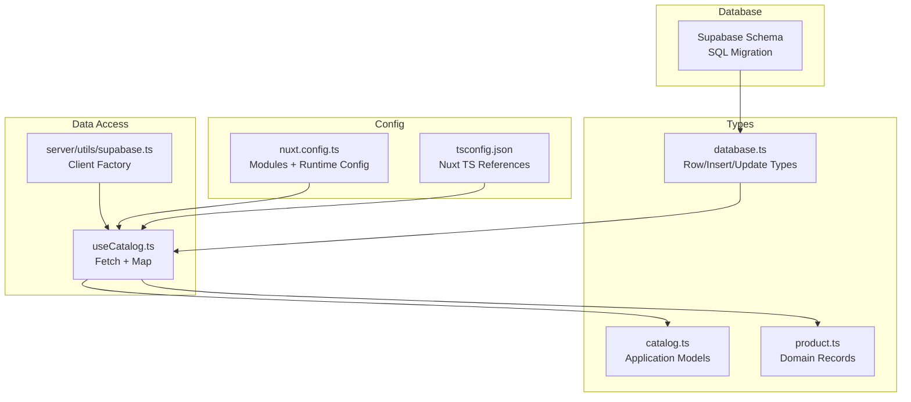
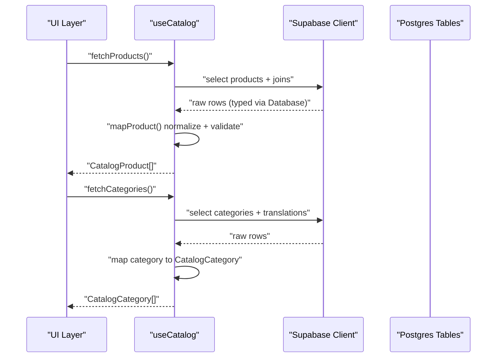
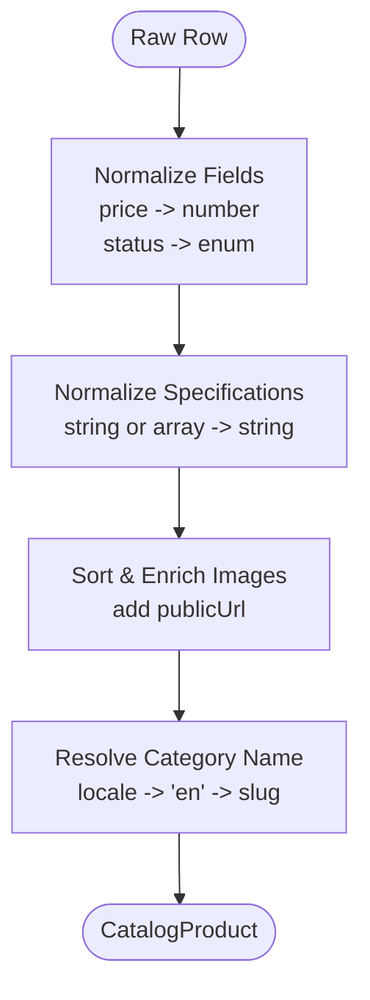
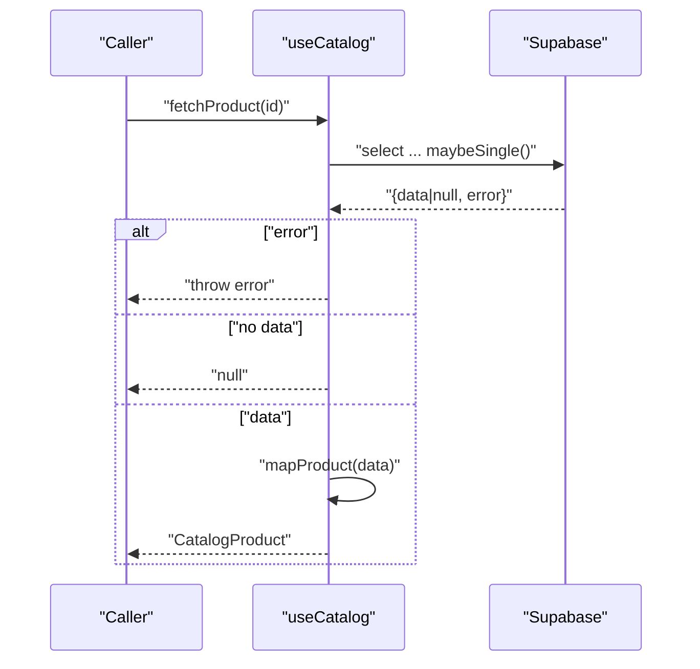
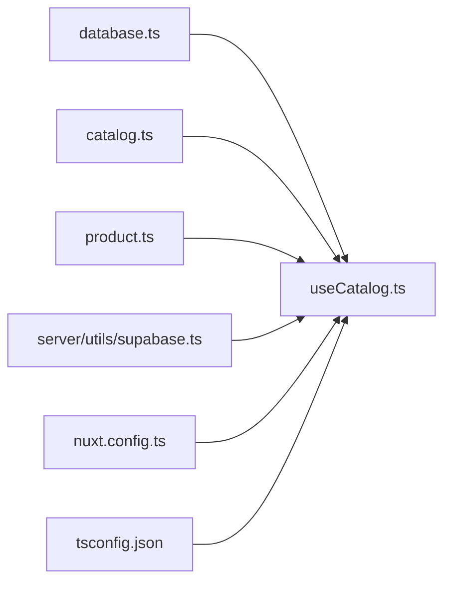
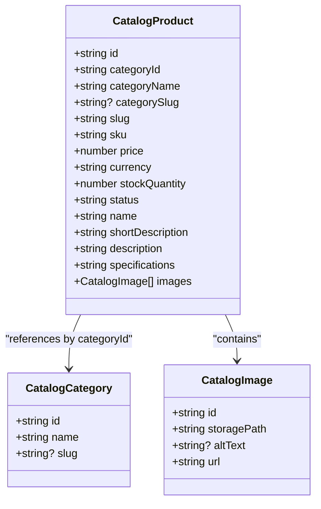

# Type Safety Strategy

<cite>
**Referenced Files in This Document**
- [app/types/database.ts](file://app/types/database.ts)
- [app/types/database.types.ts](file://app/types/database.types.ts)
- [app/types/catalog.ts](file://app/types/catalog.ts)
- [app/types/product.ts](file://app/types/product.ts)
- [app/composables/useCatalog.ts](file://app/composables/useCatalog.ts)
- [server/utils/supabase.ts](file://server/utils/supabase.ts)
- [nuxt.config.ts](file://nuxt.config.ts)
- [tsconfig.json](file://tsconfig.json)
- [supabase/migrations/20260922_000001_create_catalog_schema.sql](file://supabase/migrations/20260922_000001_create_catalog_schema.sql)
</cite>

## Table of Contents
1. Introduction
2. Project Structure
3. Core Components
4. Architecture Overview
5. Detailed Component Analysis
6. Dependency Analysis
7. Performance Considerations
8. Troubleshooting Guide
9. Conclusion
10. Appendices

## Introduction
This document explains the type safety strategy used in Raccoon-Gear-Bin to bridge database types (auto-generated from the Supabase schema) and application types (manually defined). It details how raw database responses are mapped into typed application objects, focusing on CatalogProduct and CatalogCategory interfaces, validation patterns, runtime checks, TypeScript configuration, and best practices for maintaining type consistency across the data pipeline during migrations and async operations.

## Project Structure
The project separates concerns between:
- Database schema definitions and generated types
- Application-level domain models
- Composables that fetch and transform data
- Server utilities for client initialization
- Nuxt configuration for modules and runtime config

**Diagram sources**
- [supabase/migrations/20260922_000001_create_catalog_schema.sql:1-113](file://supabase/migrations/20260922_000001_create_catalog_schema.sql#L1-L113)
- [app/types/database.ts:1-123](file://app/types/database.ts#L1-L123)
- [app/types/catalog.ts:1-31](file://app/types/catalog.ts#L1-L31)
- [app/types/product.ts:1-40](file://app/types/product.ts#L1-L40)
- [app/composables/useCatalog.ts:1-61](file://app/composables/useCatalog.ts#L1-L61)
- [server/utils/supabase.ts:1-20](file://server/utils/supabase.ts#L1-L20)
- [nuxt.config.ts:1-52](file://nuxt.config.ts#L1-L52)
- [tsconfig.json:1-19](file://tsconfig.json#L1-L19)

**Section sources**
- [supabase/migrations/20260922_000001_create_catalog_schema.sql:1-113](file://supabase/migrations/20260922_000001_create_catalog_schema.sql#L1-L113)
- [app/types/database.ts:1-123](file://app/types/database.ts#L1-L123)
- [app/types/catalog.ts:1-31](file://app/types/catalog.ts#L1-L31)
- [app/types/product.ts:1-40](file://app/types/product.ts#L1-L40)
- [app/composables/useCatalog.ts:1-61](file://app/composables/useCatalog.ts#L1-L61)
- [server/utils/supabase.ts:1-20](file://server/utils/supabase.ts#L1-L20)
- [nuxt.config.ts:1-52](file://nuxt.config.ts#L1-L52)
- [tsconfig.json:1-19](file://tsconfig.json#L1-L19)

## Core Components
- Database types: Centralized row/insert/update shapes and enums derived from the Supabase schema.
- Application models: Domain-focused interfaces like CatalogProduct and CatalogCategory used by UI and business logic.
- Data mapping: A composable that fetches raw rows and maps them into application models with normalization and enrichment.
- Client setup: Server utility to create a typed Supabase client using runtime configuration.

Key responsibilities:
- Keep database types close to the schema so they evolve with migrations.
- Keep application types stable and expressive for UI and business use.
- Perform all transformations in a single place to ensure consistent typing and validation.

**Section sources**
- [app/types/database.ts:1-123](file://app/types/database.ts#L1-L123)
- [app/types/catalog.ts:1-31](file://app/types/catalog.ts#L1-L31)
- [app/composables/useCatalog.ts:1-61](file://app/composables/useCatalog.ts#L1-L61)
- [server/utils/supabase.ts:1-20](file://server/utils/supabase.ts#L1-L20)

## Architecture Overview
The data flow enforces type safety at each stage:
- Raw rows come from Supabase queries typed against the Database interface.
- Rows are normalized and transformed into CatalogProduct/CatalogCategory.
- Enriched fields (like image URLs) are computed safely.
- Errors from network or query execution are surfaced early.

**Diagram sources**
- [app/composables/useCatalog.ts:37-57](file://app/composables/useCatalog.ts#L37-L57)
- [app/types/database.ts:77-123](file://app/types/database.ts#L77-L123)

## Detailed Component Analysis

### Database Types (Auto-Generated from Schema)
- Enumerations: ProductStatus and ProductCategory reflect allowed values enforced by constraints.
- Row types: CategoryRow, ProductRow, ProductTranslationRow, ProductImageRow, AdminUserRow mirror table columns.
- Insert/Update types: Constrain writes to required fields while excluding auto-managed fields.
- Database interface: Groups tables with Row/Insert/Update and relationships for strongly-typed queries.

These types provide compile-time guarantees for queries and mutations, reducing runtime surprises.

**Section sources**
- [app/types/database.ts:1-123](file://app/types/database.ts#L1-L123)
- [supabase/migrations/20260922_000001_create_catalog_schema.sql:1-113](file://supabase/migrations/20260922_000001_create_catalog_schema.sql#L1-L113)

### Application Types (Manually Defined)
- CatalogImage: Represents an image with id, storage path, optional alt text, and resolved URL.
- CatalogProduct: High-level product model including identifiers, pricing, stock, status, localized name/description/specifications, and images.
- CatalogCategory: Simplified category with id, name, and optional slug.

These interfaces abstract away database specifics and present a stable contract for components and services.

**Section sources**
- [app/types/catalog.ts:1-31](file://app/types/catalog.ts#L1-L31)

### Mapping and Validation Pipeline
- Raw rows are fetched using Supabase with a select string that includes related translations and images.
- mapProduct normalizes:
  - Numeric fields (e.g., price) to numbers.
  - Status values to known union types.
  - Specifications strings or JSON arrays into a consistent string representation.
  - Image lists sorted by sort order and enriched with public URLs.
  - Category names resolved by locale fallback.
- Categories are similarly mapped to CatalogCategory with locale-aware names.

**Diagram sources**
- [app/composables/useCatalog.ts:13-33](file://app/composables/useCatalog.ts#L13-L33)

**Section sources**
- [app/composables/useCatalog.ts:13-33](file://app/composables/useCatalog.ts#L13-L33)
- [app/composables/useCatalog.ts:49-57](file://app/composables/useCatalog.ts#L49-L57)

### Async Operations and Error Handling
- fetchProducts and fetchProduct perform Supabase queries and throw errors when present, ensuring failures propagate to callers.
- maybeSingle is used for single-row retrieval; null is handled gracefully by returning null when no data exists.
- All mapped outputs are typed, preventing downstream type drift.

**Diagram sources**
- [app/composables/useCatalog.ts:43-47](file://app/composables/useCatalog.ts#L43-L47)

**Section sources**
- [app/composables/useCatalog.ts:37-47](file://app/composables/useCatalog.ts#L37-L47)

### TypeScript Configuration and Module Resolution
- tsconfig.json delegates to Nuxt’s generated TS configs for app/server/shared/node contexts.
- nuxt.config.ts enables the Supabase module and defines runtime configuration for service keys and public endpoints.
- Path aliases (e.g., ~/types) allow clean imports across composables and pages.

Best practices:
- Keep runtime config out of source control; rely on environment variables.
- Use typed clients via useSupabaseClient<Database>() to enforce query shape.

**Section sources**
- [tsconfig.json:1-19](file://tsconfig.json#L1-L19)
- [nuxt.config.ts:1-52](file://nuxt.config.ts#L1-L52)

### Best Practices for Type Consistency Across the Pipeline
- Single source of truth for database types: keep database.ts aligned with migrations.
- Stable application models: prefer catalog.ts over exposing raw rows in UI.
- Centralized mapping: perform all transformations in composables to avoid duplication and inconsistency.
- Explicit normalization: convert numeric strings to numbers, handle nulls/undefined, and enforce enums.
- Locale-aware resolution: implement fallbacks consistently for translated fields.

**Section sources**
- [app/types/database.ts:1-123](file://app/types/database.ts#L1-L123)
- [app/types/catalog.ts:1-31](file://app/types/catalog.ts#L1-L31)
- [app/composables/useCatalog.ts:13-33](file://app/composables/useCatalog.ts#L13-L33)

### Handling Type Evolution During Migrations
When schema changes occur:
- Update SQL migration first to define new constraints or columns.
- Regenerate or update database.ts to reflect new Row/Insert/Update types.
- Adjust mapping functions to handle new fields or changed types.
- Add or refine validation in mapping to ensure runtime correctness.
- Run tests and linting to catch mismatches early.

**Section sources**
- [supabase/migrations/20260922_000001_create_catalog_schema.sql:1-113](file://supabase/migrations/20260922_000001_create_catalog_schema.sql#L1-L113)
- [app/types/database.ts:1-123](file://app/types/database.ts#L1-L123)
- [app/composables/useCatalog.ts:13-33](file://app/composables/useCatalog.ts#L13-L33)

### Debugging Type Errors and Ensuring Safety in Async Operations
Common issues and resolutions:
- Any casts: Avoid broad any casts; instead, narrow types explicitly in mapping functions.
- Nullability: Ensure optional fields are handled before access; use safe navigation and defaults.
- Enum mismatches: Validate status and role values against known unions; add guards if necessary.
- Network errors: Always check error flags from Supabase responses and throw or handle appropriately.
- Logging: Log structured context around failed mappings or queries to aid debugging.

Practical tips:
- Use explicit return types on mapping functions to catch mismatches at compile time.
- Wrap async calls in try/catch where needed to centralize error handling.
- Prefer maybeSingle for single-row reads and handle null results explicitly.

**Section sources**
- [app/composables/useCatalog.ts:37-47](file://app/composables/useCatalog.ts#L37-L47)
- [app/composables/useCatalog.ts:13-33](file://app/composables/useCatalog.ts#L13-L33)

## Dependency Analysis
The following diagram shows key dependencies among types, composables, and configuration.

**Diagram sources**
- [app/types/database.ts:1-123](file://app/types/database.ts#L1-L123)
- [app/types/catalog.ts:1-31](file://app/types/catalog.ts#L1-L31)
- [app/types/product.ts:1-40](file://app/types/product.ts#L1-L40)
- [app/composables/useCatalog.ts:1-61](file://app/composables/useCatalog.ts#L1-L61)
- [server/utils/supabase.ts:1-20](file://server/utils/supabase.ts#L1-L20)
- [nuxt.config.ts:1-52](file://nuxt.config.ts#L1-L52)
- [tsconfig.json:1-19](file://tsconfig.json#L1-L19)

**Section sources**
- [app/types/database.ts:1-123](file://app/types/database.ts#L1-L123)
- [app/types/catalog.ts:1-31](file://app/types/catalog.ts#L1-L31)
- [app/types/product.ts:1-40](file://app/types/product.ts#L1-L40)
- [app/composables/useCatalog.ts:1-61](file://app/composables/useCatalog.ts#L1-L61)
- [server/utils/supabase.ts:1-20](file://server/utils/supabase.ts#L1-L20)
- [nuxt.config.ts:1-52](file://nuxt.config.ts#L1-L52)
- [tsconfig.json:1-19](file://tsconfig.json#L1-L19)

## Performance Considerations
- Select only needed columns to reduce payload size and improve mapping performance.
- Sort images server-side or minimize client-side sorting by leveraging existing indexes.
- Cache frequently accessed categories to avoid repeated queries.
- Use indexes on filtered/joined columns (e.g., status, category_id, locale) as defined in migrations.

[No sources needed since this section provides general guidance]

## Troubleshooting Guide
- Missing environment variables: The server client factory validates required config and throws if missing; ensure SUPABASE_SERVICE_ROLE_KEY and NUXT_PUBLIC_SUPABASE_URL are set.
- Query errors: Check error objects returned by Supabase; log and surface meaningful messages.
- Type mismatches: If mapping fails, inspect raw row shapes and adjust normalization logic accordingly.
- Locale fallback issues: Verify translation records exist for the current locale and fallback to English or slug.

**Section sources**
- [server/utils/supabase.ts:3-11](file://server/utils/supabase.ts#L3-L11)
- [app/composables/useCatalog.ts:37-47](file://app/composables/useCatalog.ts#L37-L47)

## Conclusion
Raccoon-Gear-Bin enforces type safety by separating database-derived types from application models and centralizing transformation logic. This approach ensures robustness across async operations, simplifies maintenance during schema evolution, and provides clear contracts for UI components. Following the outlined best practices will help maintain consistency and reliability as the system grows.

[No sources needed since this section summarizes without analyzing specific files]

## Appendices

### CatalogProduct and CatalogCategory Relationships
- CatalogProduct references a category via categoryId and exposes a human-readable categoryName and optional categorySlug.
- CatalogCategory provides minimal identity and display fields for navigation and filtering.

**Diagram sources**
- [app/types/catalog.ts:1-31](file://app/types/catalog.ts#L1-L31)

**Section sources**
- [app/types/catalog.ts:1-31](file://app/types/catalog.ts#L1-L31)