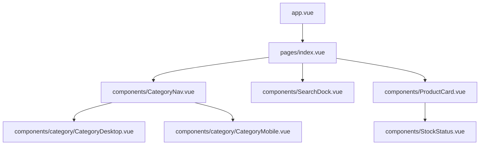
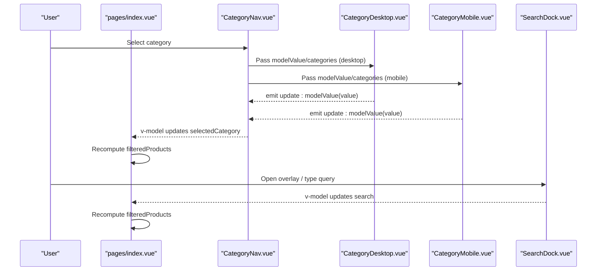
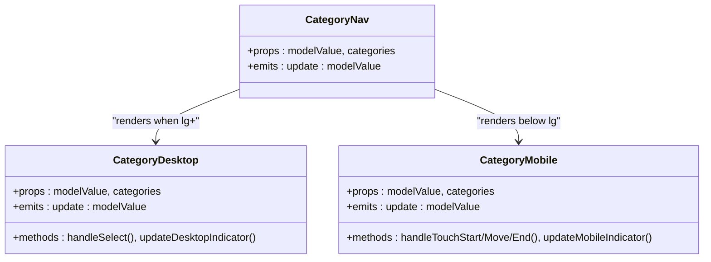
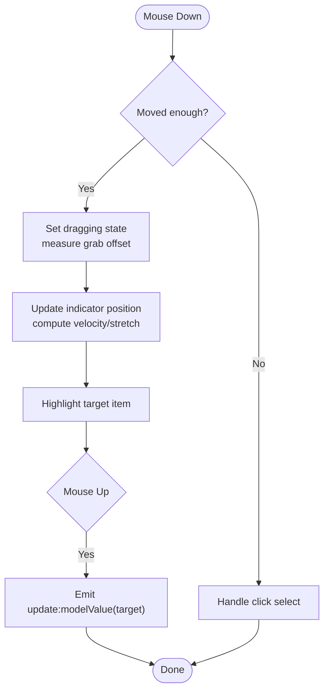
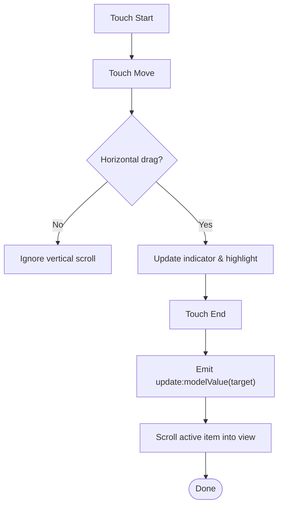
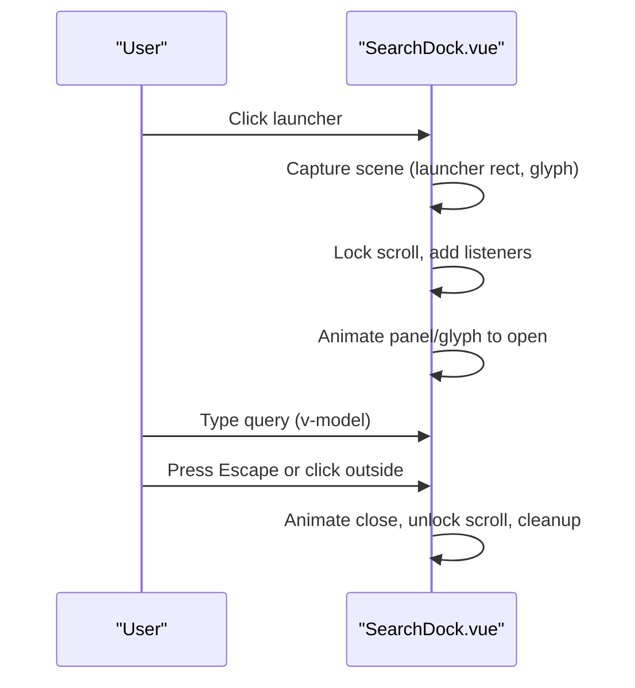
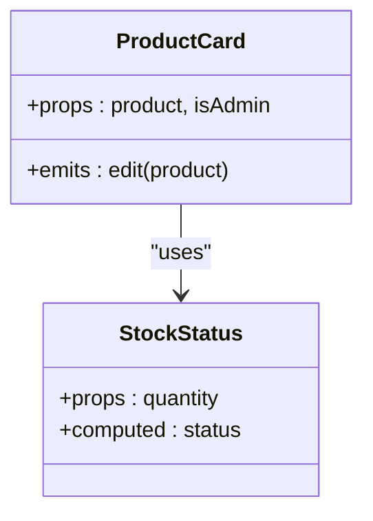
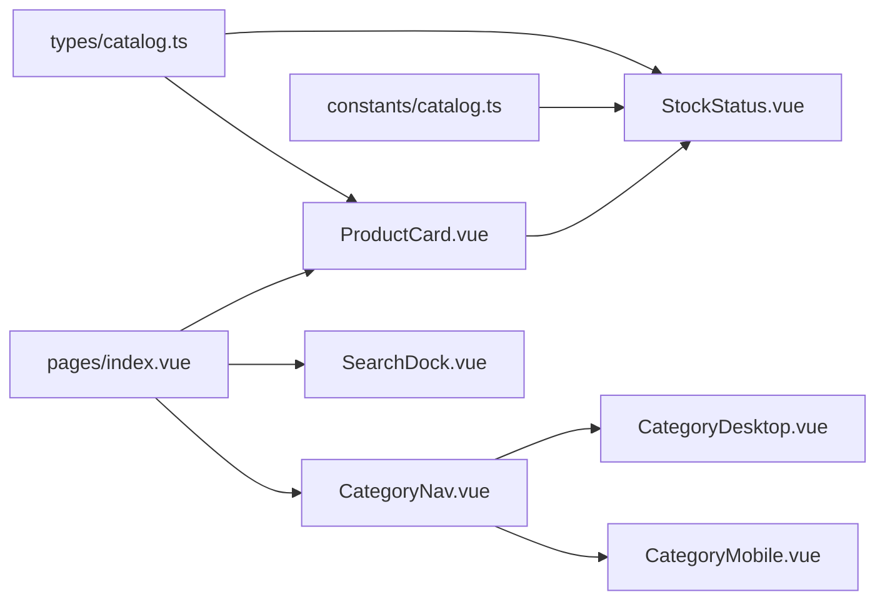

# Component Architecture

<cite>
**Referenced Files in This Document**
- [app.vue](file://app/app.vue)
- [index.vue](file://app/pages/index.vue)
- [CategoryNav.vue](file://app/components/CategoryNav.vue)
- [CategoryDesktop.vue](file://app/components/category/CategoryDesktop.vue)
- [CategoryMobile.vue](file://app/components/category/CategoryMobile.vue)
- [SearchDock.vue](file://app/components/SearchDock.vue)
- [ProductCard.vue](file://app/components/ProductCard.vue)
- [StockStatus.vue](file://app/components/StockStatus.vue)
- [catalog.ts](file://app/types/catalog.ts)
- [catalog.ts (constants)](file://app/constants/catalog.ts)
</cite>

## Table of Contents
1. [Introduction](#introduction)
2. [Project Structure](#project-structure)
3. [Core Components](#core-components)
4. [Architecture Overview](#architecture-overview)
5. [Detailed Component Analysis](#detailed-component-analysis)
6. [Dependency Analysis](#dependency-analysis)
7. [Performance Considerations](#performance-considerations)
8. [Troubleshooting Guide](#troubleshooting-guide)
9. [Conclusion](#conclusion)

## Introduction
This document explains the Vue.js component architecture of Raccoon-Gear-Bin with a focus on how the root application composes category navigation, search, and product presentation components. It details the separation between layout and presentation concerns, the responsive strategy using Tailwind CSS, and the patterns for props, events, slots, lifecycle management, reactive data binding, and accessibility.

## Project Structure
At runtime, Nuxt renders app.vue as the root shell that mounts page content via NuxtPage. The main catalog page orchestrates state and composes:
- CategoryNav to render either CategoryDesktop or CategoryMobile based on breakpoints
- SearchDock for an overlay search experience
- ProductCard for each product tile
- StockStatus for stock indicators

**Diagram sources**
- [app.vue:1-4](file://app/app.vue#L1-L4)
- [index.vue:243-258](file://app/pages/index.vue#L243-L258)
- [CategoryNav.vue:19-35](file://app/components/CategoryNav.vue#L19-L35)
- [ProductCard.vue:10-67](file://app/components/ProductCard.vue#L10-L67)
- [StockStatus.vue:14-19](file://app/components/StockStatus.vue#L14-L19)

**Section sources**
- [app.vue:1-4](file://app/app.vue#L1-L4)
- [index.vue:191-329](file://app/pages/index.vue#L191-L329)

## Core Components
- Root shell: app.vue mounts NuxtPage to render pages.
- Page controller: index.vue holds global state (products, categories, search, selected category), loads data, filters/sorts, and wires UI components.
- Category navigation: CategoryNav delegates to desktop/mobile variants; both emit selection updates via v-model.
- Search: SearchDock provides a morphing overlay with keyboard and scroll-aware behavior, bound to the page’s search state.
- Presentation: ProductCard displays product info and delegates stock status to StockStatus.

Key composition patterns:
- Props: CatalogProduct and CatalogCategory types define contracts used across components.
- Events: update:modelValue is used for two-way binding of selected category and search query.
- Slots: Not used in these components; composition is achieved through props/events and parent orchestration.
- Lifecycle: Components use onMounted/onUnmounted and watchers to manage DOM measurements, observers, and event listeners.

**Section sources**
- [index.vue:26-63](file://app/pages/index.vue#L26-L63)
- [catalog.ts:8-30](file://app/types/catalog.ts#L8-L30)
- [CategoryNav.vue:4-16](file://app/components/CategoryNav.vue#L4-L16)
- [SearchDock.vue:1-6](file://app/components/SearchDock.vue#L1-L6)
- [ProductCard.vue:1-7](file://app/components/ProductCard.vue#L1-L7)
- [StockStatus.vue:1-11](file://app/components/StockStatus.vue#L1-L11)

## Architecture Overview
The page acts as the single source of truth for filtering and sorting. CategoryNav and SearchDock are presentational controllers that communicate back to the page via v-model. ProductCard and StockStatus are pure presentation components driven by props.

**Diagram sources**
- [CategoryNav.vue:19-35](file://app/components/CategoryNav.vue#L19-L35)
- [CategoryDesktop.vue:20-32](file://app/components/category/CategoryDesktop.vue#L20-L32)
- [CategoryMobile.vue:20-32](file://app/components/category/CategoryMobile.vue#L20-L32)
- [SearchDock.vue:1-6](file://app/components/SearchDock.vue#L1-L6)
- [index.vue:46-63](file://app/pages/index.vue#L46-L63)

## Detailed Component Analysis

### Category Navigation Composition
CategoryNav renders either CategoryDesktop or CategoryMobile based on screen size and forwards v-model bindings and category lists. Both child components compute active items from categories and emit selection changes.

**Diagram sources**
- [CategoryNav.vue:1-35](file://app/components/CategoryNav.vue#L1-L35)
- [CategoryDesktop.vue:20-91](file://app/components/category/CategoryDesktop.vue#L20-L91)
- [CategoryMobile.vue:20-91](file://app/components/category/CategoryMobile.vue#L20-L91)

**Section sources**
- [CategoryNav.vue:1-35](file://app/components/CategoryNav.vue#L1-L35)
- [CategoryDesktop.vue:20-91](file://app/components/category/CategoryDesktop.vue#L20-L91)
- [CategoryMobile.vue:20-91](file://app/components/category/CategoryMobile.vue#L20-L91)

### Category Desktop: Drag-to-Select and Indicator
CategoryDesktop implements drag-to-select with mouse events, a sliding indicator, magnification near cursor, and z-index layering. It uses refs to measure item positions and ResizeObserver to keep the indicator aligned after layout changes.

**Diagram sources**
- [CategoryDesktop.vue:178-266](file://app/components/category/CategoryDesktop.vue#L178-L266)
- [CategoryDesktop.vue:340-422](file://app/components/category/CategoryDesktop.vue#L340-L422)

**Section sources**
- [CategoryDesktop.vue:96-422](file://app/components/category/CategoryDesktop.vue#L96-L422)

### Category Mobile: Touch Drag and Auto-Scroll
CategoryMobile mirrors the desktop logic for touch input, computes a horizontal sliding indicator, and auto-scrolls the active item into view after selection. It also hides/shows the bottom bar based on scroll direction.

**Diagram sources**
- [CategoryMobile.vue:175-248](file://app/components/category/CategoryMobile.vue#L175-L248)
- [CategoryMobile.vue:300-307](file://app/components/category/CategoryMobile.vue#L300-L307)

**Section sources**
- [CategoryMobile.vue:96-402](file://app/components/category/CategoryMobile.vue#L96-L402)

### Search Dock: Morphing Overlay
SearchDock provides a dialog-like overlay that morphs from the launcher icon to a full-width search field. It manages focus trapping, keyboard handling, backdrop interactions, and scroll locking during open state.

**Diagram sources**
- [SearchDock.vue:288-351](file://app/components/SearchDock.vue#L288-L351)
- [SearchDock.vue:371-420](file://app/components/SearchDock.vue#L371-L420)
- [SearchDock.vue:429-445](file://app/components/SearchDock.vue#L429-L445)

**Section sources**
- [SearchDock.vue:1-628](file://app/components/SearchDock.vue#L1-L628)

### Product Card and Stock Status
ProductCard is a presentation component that renders product image, title, price, and delegates stock status to StockStatus. Images are lazy-loaded via loading="lazy". StockStatus computes a label and color classes based on quantity thresholds.

**Diagram sources**
- [ProductCard.vue:1-67](file://app/components/ProductCard.vue#L1-L67)
- [StockStatus.vue:1-19](file://app/components/StockStatus.vue#L1-L19)

**Section sources**
- [ProductCard.vue:1-67](file://app/components/ProductCard.vue#L1-L67)
- [StockStatus.vue:1-19](file://app/components/StockStatus.vue#L1-L19)
- [catalog.ts (constants):1-2](file://app/constants/catalog.ts#L1-L2)

### Responsive Design Strategy
- Breakpoint-based rendering: CategoryNav shows CategoryDesktop at lg+ and CategoryMobile below lg.
- Mobile-first utilities: Tailwind classes control spacing, typography, and visibility across breakpoints.
- Fixed bottom bar on mobile: CategoryMobile teleports its nav to the bottom of the viewport and scrolls horizontally.
- Collapsible search: SearchDock collapses to a floating icon on scroll and expands into a modal overlay.

**Section sources**
- [CategoryNav.vue:19-35](file://app/components/CategoryNav.vue#L19-L35)
- [CategoryMobile.vue:405-417](file://app/components/category/CategoryMobile.vue#L405-L417)
- [SearchDock.vue:448-505](file://app/components/SearchDock.vue#L448-L505)

### Accessibility Highlights
- Semantic roles and attributes: role="tab", aria-selected on category buttons; role="dialog", aria-modal on search overlay; aria-label and aria-hidden on icons.
- Keyboard support: Escape closes search overlay; Tab focus cycling within the overlay; passive scroll listeners where appropriate.
- Focus management: Overlay focuses input on open; focus trap toggles between input and close button.
- Color contrast and dark mode: Consistent text colors and focus rings across light/dark themes.

**Section sources**
- [CategoryDesktop.vue:425-470](file://app/components/category/CategoryDesktop.vue#L425-L470)
- [CategoryMobile.vue:412-450](file://app/components/category/CategoryMobile.vue#L412-L450)
- [SearchDock.vue:450-505](file://app/components/SearchDock.vue#L450-L505)
- [SearchDock.vue:258-286](file://app/components/SearchDock.vue#L258-L286)

### Reactive Data Binding and Communication
- Two-way binding via v-model:
  - Category selection: CategoryNav <-> CategoryDesktop/Mobile via update:modelValue.
  - Search query: SearchDock <-> page via v-model on search string.
- Computed filtering: index.vue recomputes filtered products whenever search or selectedCategory changes.
- Props-driven rendering: ProductCard and StockStatus receive data via strongly-typed props.

**Section sources**
- [CategoryNav.vue:4-16](file://app/components/CategoryNav.vue#L4-L16)
- [CategoryDesktop.vue:20-32](file://app/components/category/CategoryDesktop.vue#L20-L32)
- [CategoryMobile.vue:20-32](file://app/components/category/CategoryMobile.vue#L20-L32)
- [SearchDock.vue:1-6](file://app/components/SearchDock.vue#L1-L6)
- [index.vue:46-63](file://app/pages/index.vue#L46-L63)

### Lifecycle Management Examples
- Measurement and observers:
  - CategoryDesktop: onMounted sets up window resize listener, ResizeObserver for nav/items, and font readiness callback; onUnmounted removes listeners and disconnects observer.
  - CategoryMobile: similar setup plus touch event listeners and scroll direction detection.
- Overlay lifecycle:
  - SearchDock: onMounted attaches scroll/resize listeners; onUnmounted detaches them and unlocks scroll.

**Section sources**
- [CategoryDesktop.vue:379-422](file://app/components/category/CategoryDesktop.vue#L379-L422)
- [CategoryMobile.vue:343-402](file://app/components/category/CategoryMobile.vue#L343-L402)
- [SearchDock.vue:429-445](file://app/components/SearchDock.vue#L429-L445)

## Dependency Analysis
Components depend on shared types and constants to ensure consistent contracts and behavior.

**Diagram sources**
- [catalog.ts:8-30](file://app/types/catalog.ts#L8-L30)
- [catalog.ts (constants):1-2](file://app/constants/catalog.ts#L1-L2)
- [index.vue:243-329](file://app/pages/index.vue#L243-L329)
- [CategoryNav.vue:1-35](file://app/components/CategoryNav.vue#L1-L35)
- [ProductCard.vue:1-67](file://app/components/ProductCard.vue#L1-L67)
- [StockStatus.vue:1-19](file://app/components/StockStatus.vue#L1-L19)

**Section sources**
- [catalog.ts:8-30](file://app/types/catalog.ts#L8-L30)
- [catalog.ts (constants):1-2](file://app/constants/catalog.ts#L1-L2)
- [index.vue:243-329](file://app/pages/index.vue#L243-L329)

## Performance Considerations
- Lazy images: ProductCard uses loading="lazy" to defer offscreen images.
- Efficient reflows: CategoryDesktop/Mobile use requestAnimationFrame and ResizeObserver to minimize layout thrashing while updating indicators.
- Passive listeners: Scroll and touch handlers use passive options where possible to improve scrolling performance.
- Conditional rendering: CategoryNav only mounts one variant at a time based on breakpoint, reducing DOM overhead.
- Memoization: Computed properties derive derived lists (e.g., computedItems) to avoid redundant work on prop changes.

[No sources needed since this section provides general guidance]

## Troubleshooting Guide
- Category indicator misalignment:
  - Ensure refs are set before measuring; watch activeIndex and computedItems to re-measure after updates.
  - Verify ResizeObserver is attached to nav and items; check font load completion callbacks.
- Mobile nav not visible:
  - Confirm Teleport targets body and safe-area padding is applied; verify scroll direction detection thresholds.
- Search overlay not closing:
  - Check keydown handler for Escape and document click listener; ensure focus trap includes input and close button.
- Event listener leaks:
  - Confirm onUnmounted removes all window/document listeners and disconnects observers.

**Section sources**
- [CategoryDesktop.vue:379-422](file://app/components/category/CategoryDesktop.vue#L379-L422)
- [CategoryMobile.vue:343-402](file://app/components/category/CategoryMobile.vue#L343-L402)
- [SearchDock.vue:258-286](file://app/components/SearchDock.vue#L258-L286)
- [SearchDock.vue:429-445](file://app/components/SearchDock.vue#L429-L445)

## Conclusion
Raccoon-Gear-Bin’s component architecture cleanly separates concerns: the page coordinates state and data, CategoryNav composes platform-specific navigation, SearchDock encapsulates complex overlay behavior, and ProductCard/StockStatus remain focused on presentation. The design leverages v-model for communication, robust lifecycle hooks for measurement and cleanup, and Tailwind CSS for a responsive, accessible user experience. These patterns promote reusability, maintainability, and performance across devices.