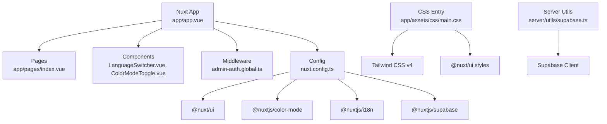
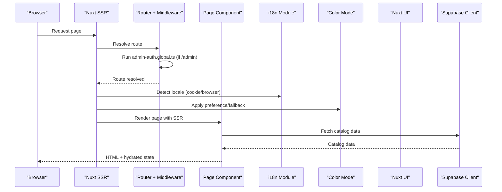
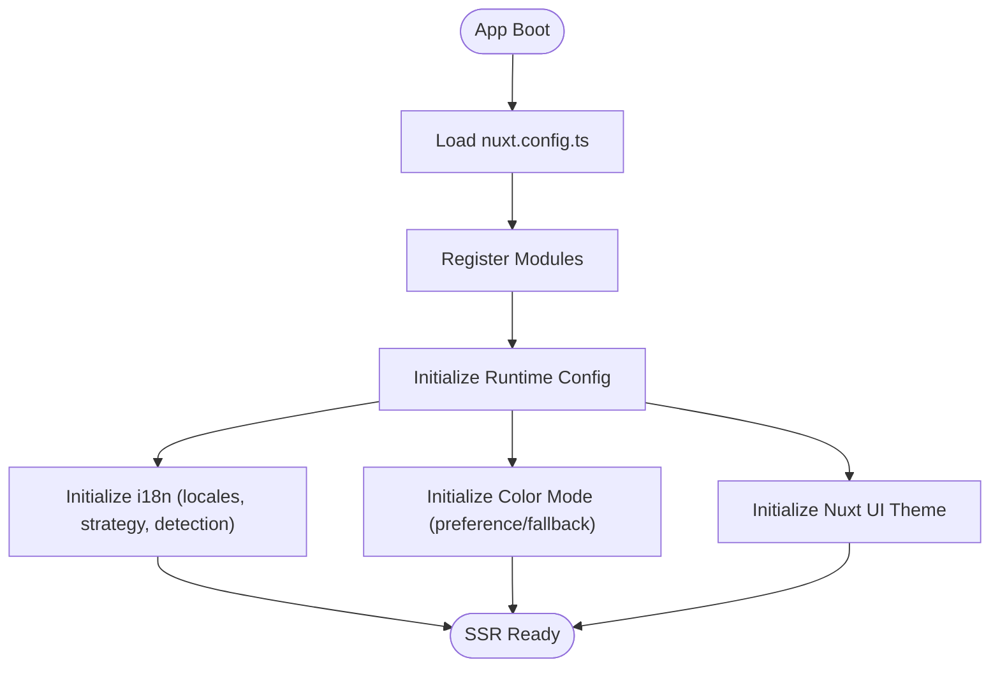
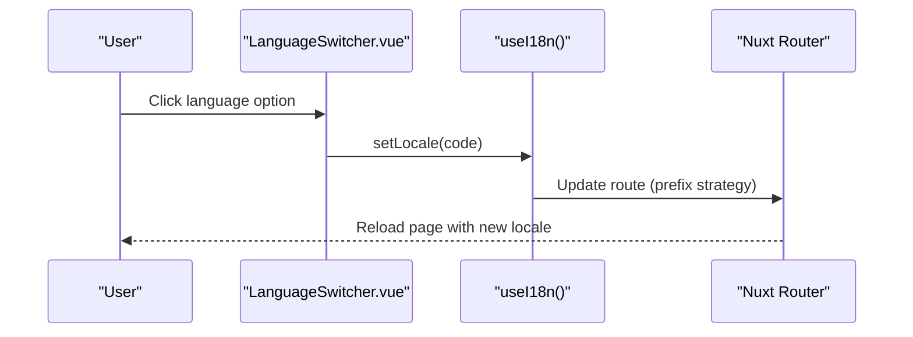
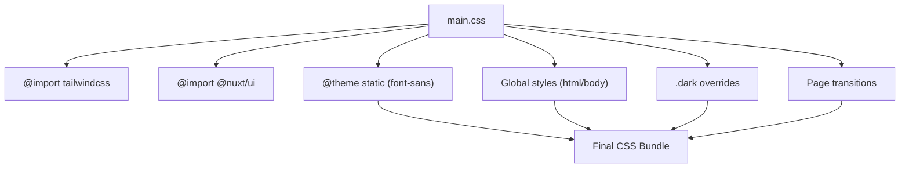
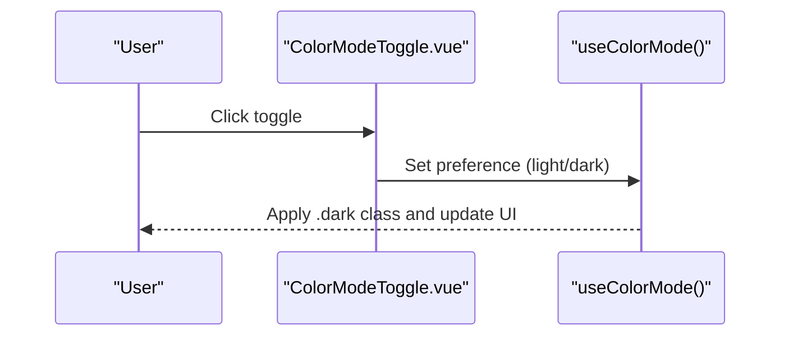
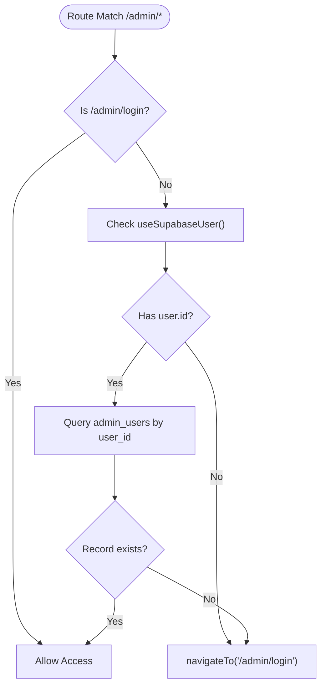
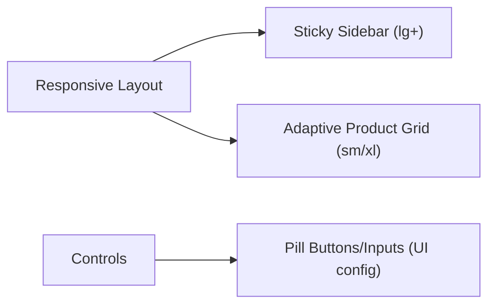
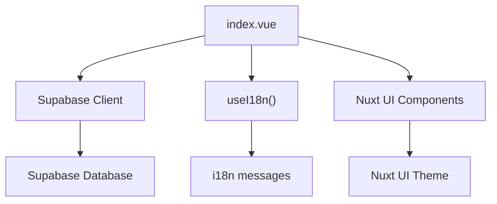
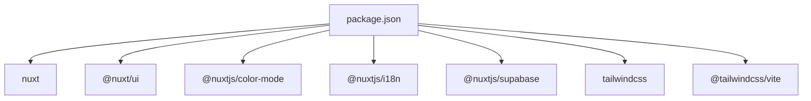

# Framework Integration

<cite>
**Referenced Files in This Document**
- [nuxt.config.ts](file://nuxt.config.ts)
- [i18n.config.ts](file://i18n.config.ts)
- [main.css](file://app/assets/css/main.css)
- [package.json](file://package.json)
- [app.vue](file://app/app.vue)
- [app.config.ts](file://app/app.config.ts)
- [LanguageSwitcher.vue](file://app/components/LanguageSwitcher.vue)
- [ColorModeToggle.vue](file://app/components/ColorModeToggle.vue)
- [admin-auth.global.ts](file://app/middleware/admin-auth.global.ts)
- [supabase.ts](file://server/utils/supabase.ts)
- [index.vue](file://app/pages/index.vue)
</cite>

## Table of Contents
1. Introduction
2. Project Structure
3. Core Components
4. Architecture Overview
5. Detailed Component Analysis
6. Dependency Analysis
7. Performance Considerations
8. Troubleshooting Guide
9. Conclusion

## Introduction
This document explains how Raccoon-Gear-Bin integrates key frameworks and libraries within a Nuxt.js application. It covers server-side rendering setup, module imports, build configuration, internationalization with i18n, Tailwind CSS integration with custom theming and dark mode, middleware usage, plugin registration, asset management, responsive design patterns, CSS architecture, styling best practices, and performance considerations for bundle optimization.

## Project Structure
The project is a Nuxt 4 application that composes several modules:
- Nuxt core with SSR enabled by default
- UI framework via @nuxt/ui
- Color mode via @nuxtjs/color-mode
- Internationalization via @nuxtjs/i18n
- Supabase client via @nuxtjs/supabase
- Tailwind CSS v4 integrated through the Vite plugin and imported at the root CSS entry

**Diagram sources**
- [app.vue:1-4](file://app/app.vue#L1-L4)
- [nuxt.config.ts:1-52](file://nuxt.config.ts#L1-L52)
- [main.css:1-106](file://app/assets/css/main.css#L1-L106)
- [supabase.ts:1-20](file://server/utils/supabase.ts#L1-L20)

**Section sources**
- [nuxt.config.ts:1-52](file://nuxt.config.ts#L1-L52)
- [package.json:1-26](file://package.json#L1-L26)

## Core Components
- Nuxt configuration centralizes modules, runtime config, UI theme tokens, color mode preferences, and i18n settings.
- The root CSS file imports Tailwind CSS and Nuxt UI, defines static theme tokens (e.g., font families), and sets global styles including dark mode backgrounds and selection colors.
- i18n configuration declares supported locales, default locale, fallback behavior, and browser language detection strategy.
- Language switching is implemented as a reusable component using the i18n composable to read and set the current locale.
- Dark mode toggle uses the color-mode module to persist user preference and render appropriate icons.
- Admin authorization middleware guards routes under /admin and verifies admin privileges against the database.
- Server-side Supabase client utility creates an admin client using runtime configuration.

**Section sources**
- [nuxt.config.ts:1-52](file://nuxt.config.ts#L1-L52)
- [main.css:1-106](file://app/assets/css/main.css#L1-L106)
- [i18n.config.ts:1-14](file://i18n.config.ts#L1-L14)
- [LanguageSwitcher.vue:1-33](file://app/components/LanguageSwitcher.vue#L1-L33)
- [ColorModeToggle.vue:1-66](file://app/components/ColorModeToggle.vue#L1-L66)
- [admin-auth.global.ts:1-28](file://app/middleware/admin-auth.global.ts#L1-L28)
- [supabase.ts:1-20](file://server/utils/supabase.ts#L1-L20)

## Architecture Overview
The application follows a layered approach:
- Presentation layer: Vue components and pages styled with Tailwind and Nuxt UI.
- Application layer: Nuxt modules provide SSR, routing, i18n, color mode, and Supabase integration.
- Data layer: Supabase client used on both client and server sides; server-side admin client uses service role key.

**Diagram sources**
- [nuxt.config.ts:1-52](file://nuxt.config.ts#L1-L52)
- [admin-auth.global.ts:1-28](file://app/middleware/admin-auth.global.ts#L1-L28)
- [index.vue:1-465](file://app/pages/index.vue#L1-L465)

## Detailed Component Analysis

### Nuxt Configuration and SSR Setup
- Modules registered: @nuxt/ui, @nuxtjs/color-mode, @nuxtjs/i18n, @nuxtjs/supabase.
- Runtime configuration exposes public Supabase URL and key, plus a server-only service role key.
- UI theme colors are configured to map primary and neutral palettes.
- Color mode preference defaults to system with a dark fallback.
- i18n strategy uses prefix_except_default with browser language detection stored in a cookie.

**Diagram sources**
- [nuxt.config.ts:1-52](file://nuxt.config.ts#L1-L52)

**Section sources**
- [nuxt.config.ts:1-52](file://nuxt.config.ts#L1-L52)

### Internationalization (i18n)
- Locales: English and Khmer defined with display names.
- Default and fallback locales set to English.
- Strategy: prefix_except_default ensures localized URLs while keeping the default locale unprefixed.
- Browser language detection: enabled with a dedicated cookie key and redirect behavior on root navigation.
- Messages: centralized in i18n.config.ts with keys for UI strings across both languages.
- Dynamic switching: LanguageSwitcher component reads current locale and updates it via the i18n composable.

**Diagram sources**
- [i18n.config.ts:1-14](file://i18n.config.ts#L1-L14)
- [LanguageSwitcher.vue:1-33](file://app/components/LanguageSwitcher.vue#L1-L33)
- [nuxt.config.ts:37-50](file://nuxt.config.ts#L37-L50)

**Section sources**
- [i18n.config.ts:1-14](file://i18n.config.ts#L1-L14)
- [nuxt.config.ts:37-50](file://nuxt.config.ts#L37-L50)
- [LanguageSwitcher.vue:1-33](file://app/components/LanguageSwitcher.vue#L1-L33)

### Tailwind CSS Integration and Custom Theme
- Tailwind CSS v4 is imported from the root CSS entry and combined with Nuxt UI styles.
- Static theme token for sans-serif font stack includes support for Khmer fonts.
- Global body styles define base background color and text rendering optimizations.
- Dark mode styles override background and selection colors when the .dark class is present.
- Scrollbar suppression utilities provided for horizontal or touch scrollers.
- Page transition classes align with Nuxt’s pageTransition configuration.

**Diagram sources**
- [main.css:1-106](file://app/assets/css/main.css#L1-L106)
- [nuxt.config.ts:4-7](file://nuxt.config.ts#L4-L7)

**Section sources**
- [main.css:1-106](file://app/assets/css/main.css#L1-L106)
- [nuxt.config.ts:4-7](file://nuxt.config.ts#L4-L7)

### Dark Mode Implementation
- Color mode module configured with no suffix, system preference, and dark fallback.
- ColorModeToggle component toggles preference and renders sun/moon icons accordingly.
- CSS provides .dark variants for background and selection colors.

**Diagram sources**
- [nuxt.config.ts:32-36](file://nuxt.config.ts#L32-L36)
- [ColorModeToggle.vue:1-66](file://app/components/ColorModeToggle.vue#L1-L66)
- [main.css:30-37](file://app/assets/css/main.css#L30-L37)

**Section sources**
- [nuxt.config.ts:32-36](file://nuxt.config.ts#L32-L36)
- [ColorModeToggle.vue:1-66](file://app/components/ColorModeToggle.vue#L1-L66)
- [main.css:30-37](file://app/assets/css/main.css#L30-L37)

### Middleware Usage (Admin Authorization)
- Global middleware guards /admin routes except the login page.
- Checks authenticated user and validates admin status by querying admin_users table.
- Redirects unauthorized users back to login.

**Diagram sources**
- [admin-auth.global.ts:1-28](file://app/middleware/admin-auth.global.ts#L1-L28)

**Section sources**
- [admin-auth.global.ts:1-28](file://app/middleware/admin-auth.global.ts#L1-L28)

### Plugin Registration and Asset Management
- Plugins directory exists but no plugins are currently registered in the visible configuration.
- Assets are managed via the root CSS entry which imports Tailwind and Nuxt UI styles.
- Fonts are declared in the static theme token to ensure consistent typography across light and dark modes.

**Section sources**
- [nuxt.config.ts:4-6](file://nuxt.config.ts#L4-L6)
- [main.css:4-6](file://app/assets/css/main.css#L4-L6)

### Responsive Design Patterns and CSS Architecture
- Pages use responsive utility classes to adapt layouts across breakpoints (e.g., sm:, lg:, xl:).
- Category navigation becomes sticky on larger screens; product grid adapts columns based on viewport width.
- Search input and controls scale gracefully with spacing and sizing utilities.
- Consistent pill-shaped controls and elevation are enforced via Nuxt UI app config.

**Diagram sources**
- [index.vue:191-329](file://app/pages/index.vue#L191-L329)
- [app.config.ts:1-20](file://app/app.config.ts#L1-L20)

**Section sources**
- [index.vue:191-329](file://app/pages/index.vue#L191-L329)
- [app.config.ts:1-20](file://app/app.config.ts#L1-L20)

### Integration Points Between Frameworks and Libraries
- Nuxt orchestrates modules for UI, i18n, color mode, and Supabase.
- Pages consume Supabase client to fetch categories and products, mapping translations based on current locale.
- Components integrate with i18n for dynamic labels and with color mode for theme-aware visuals.
- Server-side admin client uses runtime config to create a privileged Supabase client.

**Diagram sources**
- [index.vue:1-188](file://app/pages/index.vue#L1-L188)
- [supabase.ts:1-20](file://server/utils/supabase.ts#L1-L20)
- [i18n.config.ts:1-14](file://i18n.config.ts#L1-L14)

**Section sources**
- [index.vue:1-188](file://app/pages/index.vue#L1-L188)
- [supabase.ts:1-20](file://server/utils/supabase.ts#L1-L20)
- [i18n.config.ts:1-14](file://i18n.config.ts#L1-L14)

## Dependency Analysis
Key dependencies and their roles:
- Nuxt: Framework providing SSR, routing, and module ecosystem.
- @nuxt/ui: UI component library with theme customization.
- @nuxtjs/color-mode: Theme switching with persistence and system preference.
- @nuxtjs/i18n: Internationalization with locale detection and routing strategies.
- @nuxtjs/supabase: Supabase integration for client and server contexts.
- Tailwind CSS v4: Utility-first styling with static theme tokens.

**Diagram sources**
- [package.json:12-22](file://package.json#L12-L22)

**Section sources**
- [package.json:12-22](file://package.json#L12-L22)

## Performance Considerations
- SSR benefits: Faster initial load and SEO-friendly content via Nuxt’s default SSR.
- Module bundling: Tailwind CSS v4 tree-shakes unused utilities; importing only necessary styles reduces bundle size.
- Locale handling: Using prefix_except_default avoids unnecessary redirects for default locale and leverages cookies for detection.
- Data fetching: Parallel queries for categories and products reduce round-trips and improve perceived performance.
- UI animations: Lightweight CSS transitions and keyframes avoid heavy JS overhead.
- Runtime config: Sensitive keys kept server-only; public keys exposed safely for client usage.

[No sources needed since this section provides general guidance]

## Troubleshooting Guide
- Missing Supabase configuration: If server-side admin client lacks required environment variables, initialization will throw an error indicating missing configuration.
- Unauthorized access: Admin middleware redirects to login if user is not authenticated or not found in admin_users.
- i18n issues: Ensure locale cookie key matches configuration and that routes follow the expected prefix strategy.
- Styling conflicts: Verify that main.css is the single entry point for Tailwind and Nuxt UI to avoid duplicate style definitions.

**Section sources**
- [supabase.ts:3-19](file://server/utils/supabase.ts#L3-L19)
- [admin-auth.global.ts:1-28](file://app/middleware/admin-auth.global.ts#L1-L28)
- [nuxt.config.ts:37-50](file://nuxt.config.ts#L37-L50)
- [main.css:1-3](file://app/assets/css/main.css#L1-L3)

## Conclusion
Raccoon-Gear-Bin integrates Nuxt, Tailwind CSS, Nuxt UI, i18n, color mode, and Supabase into a cohesive SSR application. The configuration emphasizes clean separation of concerns, robust internationalization, accessible dark mode, and efficient data fetching. Following the documented patterns ensures maintainable code, predictable behavior, and optimized performance across devices and locales.