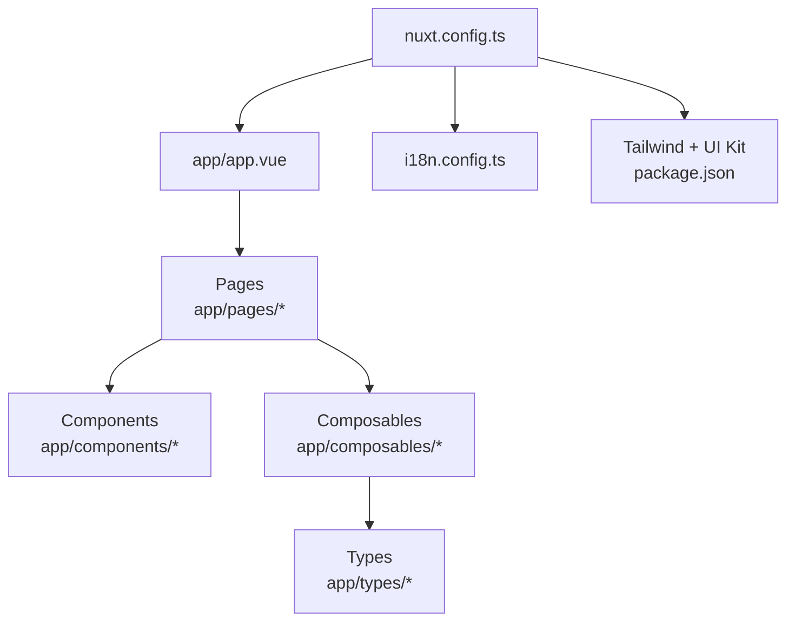
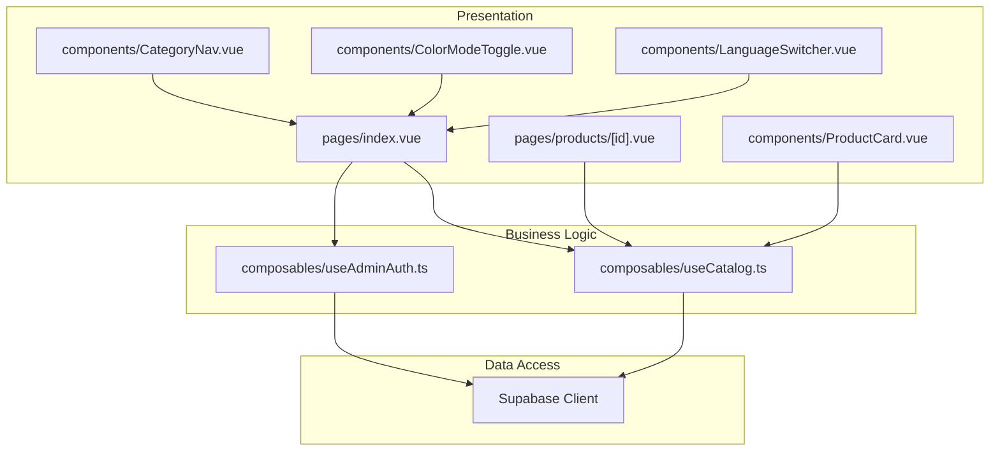
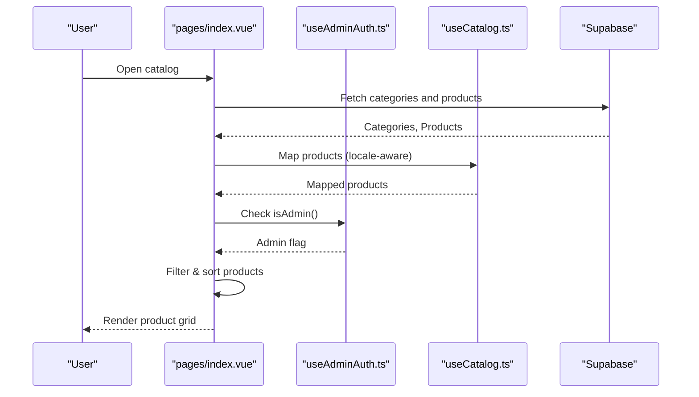
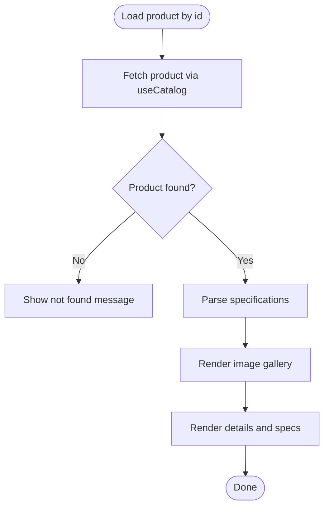
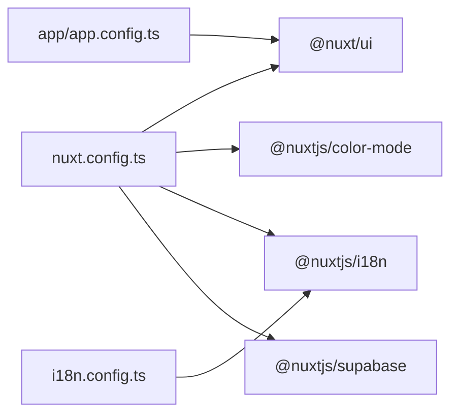

# Frontend Architecture

<cite>
**Referenced Files in This Document**
- [nuxt.config.ts](file://nuxt.config.ts)
- [package.json](file://package.json)
- [i18n.config.ts](file://i18n.config.ts)
- [app/app.vue](file://app/app.vue)
- [app/app.config.ts](file://app/app.config.ts)
- [app/pages/index.vue](file://app/pages/index.vue)
- [app/pages/products/[id].vue](file://app/pages/products/[id].vue)
- [app/pages/products/index.vue](file://app/pages/products/index.vue)
- [app/composables/useCatalog.ts](file://app/composables/useCatalog.ts)
- [app/composables/useAdminAuth.ts](file://app/composables/useAdminAuth.ts)
- [app/components/ProductCard.vue](file://app/components/ProductCard.vue)
- [app/components/CategoryNav.vue](file://app/components/CategoryNav.vue)
- [app/components/ColorModeToggle.vue](file://app/components/ColorModeToggle.vue)
- [app/components/LanguageSwitcher.vue](file://app/components/LanguageSwitcher.vue)
- [app/types/catalog.ts](file://app/types/catalog.ts)
</cite>

## Table of Contents
1. Introduction
2. Project Structure
3. Core Components
4. Architecture Overview
5. Detailed Component Analysis
6. Dependency Analysis
7. Performance Considerations
8. Troubleshooting Guide
9. Conclusion

## Introduction
This document explains the frontend architecture of the Raccoon-Gear-Bin application built with Nuxt.js and Vue 3. It covers file-based routing, server-side rendering configuration, modular component structure, Composition API patterns, state management strategies, internationalization with i18n, responsive design using Tailwind CSS, accessibility considerations, and performance optimization techniques such as lazy loading, code splitting, and bundle optimization.

## Project Structure
The project follows Nuxt’s convention-based layout:
- Root configuration in nuxt.config.ts sets up modules (UI kit, color mode, i18n, Supabase), runtime config for environment variables, page transitions, and global CSS.
- The app root renders pages via NuxtPage.
- Pages implement file-based routing under app/pages.
- Shared UI components live under app/components.
- Business logic is encapsulated in composables under app/composables.
- Types are centralized under app/types.
- Internationalization messages are defined in i18n.config.ts.

**Diagram sources**
- [nuxt.config.ts:1-52](file://nuxt.config.ts#L1-L52)
- [app/app.vue:1-4](file://app/app.vue#L1-L4)
- [package.json:12-24](file://package.json#L12-L24)
- [i18n.config.ts:1-14](file://i18n.config.ts#L1-L14)

**Section sources**
- [nuxt.config.ts:1-52](file://nuxt.config.ts#L1-L52)
- [package.json:1-26](file://package.json#L1-L26)
- [app/app.vue:1-4](file://app/app.vue#L1-L4)
- [i18n.config.ts:1-14](file://i18n.config.ts#L1-L14)

## Core Components
- Root shell: app/app.vue renders NuxtPage to mount pages.
- Pages:
  - app/pages/index.vue implements the catalog listing, search, sorting, admin editing, and product CRUD flows.
  - app/pages/products/[id].vue implements a dynamic product detail page with image gallery and specs parsing.
  - app/pages/products/index.vue redirects to home.
- Shared components:
  - ProductCard.vue displays product cards with images, price, stock status, and edit actions for admins.
  - CategoryNav.vue composes desktop and mobile category navigation variants.
  - ColorModeToggle.vue toggles light/dark mode using the color-mode module.
  - LanguageSwitcher.vue switches locale using i18n.
- Composables:
  - useCatalog.ts provides data fetching and mapping for products and categories.
  - useAdminAuth.ts handles authentication checks and sign-in/sign-out.

**Section sources**
- [app/app.vue:1-4](file://app/app.vue#L1-L4)
- [app/pages/index.vue:1-465](file://app/pages/index.vue#L1-L465)
- [app/pages/products/[id].vue:1-177](file://app/pages/products/[id].vue#L1-L177)
- [app/pages/products/index.vue:1-8](file://app/pages/products/index.vue#L1-L8)
- [app/components/ProductCard.vue:1-68](file://app/components/ProductCard.vue#L1-L68)
- [app/components/CategoryNav.vue:1-37](file://app/components/CategoryNav.vue#L1-L37)
- [app/components/ColorModeToggle.vue:1-66](file://app/components/ColorModeToggle.vue#L1-L66)
- [app/components/LanguageSwitcher.vue:1-33](file://app/components/LanguageSwitcher.vue#L1-L33)
- [app/composables/useCatalog.ts:1-61](file://app/composables/useCatalog.ts#L1-L61)
- [app/composables/useAdminAuth.ts:1-79](file://app/composables/useAdminAuth.ts#L1-L79)

## Architecture Overview
The frontend separates concerns across layers:
- Presentation layer: Pages and components render UI and handle user interactions.
- Business logic layer: Composables encapsulate domain logic like catalog operations and admin auth.
- Data access layer: Supabase client is used within composables and pages to fetch and mutate data.

**Diagram sources**
- [app/pages/index.vue:1-465](file://app/pages/index.vue#L1-L465)
- [app/pages/products/[id].vue:1-177](file://app/pages/products/[id].vue#L1-L177)
- [app/components/ProductCard.vue:1-68](file://app/components/ProductCard.vue#L1-L68)
- [app/components/CategoryNav.vue:1-37](file://app/components/CategoryNav.vue#L1-L37)
- [app/components/ColorModeToggle.vue:1-66](file://app/components/ColorModeToggle.vue#L1-L66)
- [app/components/LanguageSwitcher.vue:1-33](file://app/components/LanguageSwitcher.vue#L1-L33)
- [app/composables/useCatalog.ts:1-61](file://app/composables/useCatalog.ts#L1-L61)
- [app/composables/useAdminAuth.ts:1-79](file://app/composables/useAdminAuth.ts#L1-L79)

## Detailed Component Analysis

### Catalog Page (app/pages/index.vue)
Responsibilities:
- Loads categories and published products concurrently.
- Filters by category and text search; sorts by newest, price, or name.
- Renders product grid with ProductCard components.
- Provides admin mode to add/edit/delete products and manage images.
- Integrates i18n for labels and error messages.
- Uses Supabase storage to resolve public URLs for images.

Key implementation highlights:
- Concurrent data fetching with Promise.all for categories and products.
- Localized translation selection based on current locale with fallback to English.
- Admin-only flows guarded by isAdmin check from useAdminAuth.
- Error states surfaced via alerts; loading skeletons during async operations.

**Diagram sources**
- [app/pages/index.vue:101-120](file://app/pages/index.vue#L101-L120)
- [app/pages/index.vue:46-63](file://app/pages/index.vue#L46-L63)
- [app/composables/useCatalog.ts:13-33](file://app/composables/useCatalog.ts#L13-L33)
- [app/composables/useAdminAuth.ts:16-34](file://app/composables/useAdminAuth.ts#L16-L34)

**Section sources**
- [app/pages/index.vue:1-465](file://app/pages/index.vue#L1-L465)
- [app/composables/useCatalog.ts:1-61](file://app/composables/useCatalog.ts#L1-L61)
- [app/composables/useAdminAuth.ts:1-79](file://app/composables/useAdminAuth.ts#L1-L79)

### Product Detail Page (app/pages/products/[id].vue)
Responsibilities:
- Loads a single published product by id.
- Displays an image gallery with thumbnails.
- Parses specifications into structured label-value pairs or falls back to raw text.
- Sets dynamic page title using i18n.

Key implementation highlights:
- Uses useCatalog.fetchProduct for data retrieval.
- Handles not-found scenarios gracefully.
- Computes parsedSpecs with robust JSON and key-value parsing.

**Diagram sources**
- [app/pages/products/[id].vue:10-20](file://app/pages/products/[id].vue#L10-L20)
- [app/pages/products/[id].vue:22-43](file://app/pages/products/[id].vue#L22-L43)
- [app/composables/useCatalog.ts:43-47](file://app/composables/useCatalog.ts#L43-L47)

**Section sources**
- [app/pages/products/[id].vue:1-177](file://app/pages/products/[id].vue#L1-L177)
- [app/composables/useCatalog.ts:43-47](file://app/composables/useCatalog.ts#L43-L47)

### Product Card Component (app/components/ProductCard.vue)
Responsibilities:
- Presents product image, name, short description, price, and stock status.
- Links to product detail page.
- Emits edit event when admin mode is enabled.

Prop interface:
- product: CatalogProduct
- isAdmin?: boolean

Event handling:
- Emits edit with the product payload for parent to open editor.

Accessibility:
- Uses aria-label for edit button and alt text for images.

**Section sources**
- [app/components/ProductCard.vue:1-68](file://app/components/ProductCard.vue#L1-L68)
- [app/types/catalog.ts:8-24](file://app/types/catalog.ts#L8-L24)

### Category Navigation (app/components/CategoryNav.vue)
Responsibilities:
- Delegates rendering to desktop and mobile variants based on breakpoints.
- Maintains two-way binding with selected category via v-model pattern.

Composition pattern:
- Wraps CategoryDesktop and CategoryMobile, forwarding modelValue and update:modelValue events.

**Section sources**
- [app/components/CategoryNav.vue:1-37](file://app/components/CategoryNav.vue#L1-L37)

### Theme and Locale Controls
- ColorModeToggle.vue: Toggles system preference between light and dark modes using the color-mode module. Wrapped in ClientOnly to avoid hydration mismatch.
- LanguageSwitcher.vue: Switches locale using i18n composable and updates URL strategy configured in nuxt.config.ts.

**Section sources**
- [app/components/ColorModeToggle.vue:1-66](file://app/components/ColorModeToggle.vue#L1-L66)
- [app/components/LanguageSwitcher.vue:1-33](file://app/components/LanguageSwitcher.vue#L1-L33)
- [nuxt.config.ts:32-50](file://nuxt.config.ts#L32-L50)

## Dependency Analysis
Nuxt configuration wires together core modules and features:
- Modules: @nuxt/ui, @nuxtjs/color-mode, @nuxtjs/i18n, @nuxtjs/supabase.
- Runtime config exposes Supabase credentials and service role key.
- i18n configured with locales en/km, default locale en, prefix_except_default strategy, and browser language detection with cookie persistence.
- UI theme colors and component styles customized via app.config.ts.

**Diagram sources**
- [nuxt.config.ts:1-52](file://nuxt.config.ts#L1-L52)
- [app/app.config.ts:1-20](file://app/app.config.ts#L1-L20)
- [i18n.config.ts:1-14](file://i18n.config.ts#L1-L14)

**Section sources**
- [nuxt.config.ts:1-52](file://nuxt.config.ts#L1-L52)
- [app/app.config.ts:1-20](file://app/app.config.ts#L1-L20)
- [i18n.config.ts:1-14](file://i18n.config.ts#L1-L14)
- [package.json:12-24](file://package.json#L12-L24)

## Performance Considerations
- Lazy loading images: ProductCard uses loading="lazy" for images to defer offscreen image loads.
- Code splitting: Nuxt automatically splits routes; each page is loaded on demand.
- Bundle optimization:
  - Use only required modules and dependencies listed in package.json.
  - Avoid heavy third-party libraries beyond necessary ones.
  - Keep assets minimal and leverage CDN or optimized storage paths.
- SSR and hydration:
  - ClientOnly usage in ColorModeToggle prevents hydration mismatches and reduces initial JS overhead.
- Efficient data fetching:
  - Concurrent queries for categories and products reduce round-trips.
  - Reusable mapping functions in composables minimize duplication and improve maintainability.

[No sources needed since this section provides general guidance]

## Troubleshooting Guide
Common issues and resolutions:
- Catalog load errors: Displayed via alert; ensure Supabase keys and permissions are correct.
- Product save/delete errors: Handled with user-friendly messages; verify admin privileges and network connectivity.
- Not found product: Shows dedicated message with link to browse products.
- Admin mode not activating: Ensure user is signed in and has admin role; check useAdminAuth logic.

Operational tips:
- Validate environment variables for Supabase URL and keys.
- Confirm storage bucket permissions for product images.
- Inspect console logs for auth and database errors.

**Section sources**
- [app/pages/index.vue:117-120](file://app/pages/index.vue#L117-L120)
- [app/pages/index.vue:134-183](file://app/pages/index.vue#L134-L183)
- [app/pages/products/[id].vue:10-20](file://app/pages/products/[id].vue#L10-L20)
- [app/composables/useAdminAuth.ts:16-34](file://app/composables/useAdminAuth.ts#L16-L34)

## Conclusion
The Raccoon-Gear-Bin frontend leverages Nuxt’s conventions to deliver a clean, modular architecture. Pages focus on presentation and orchestration, while composables encapsulate business logic and data access. Internationalization, responsive design, and accessibility are integrated throughout. Performance is optimized through lazy loading, route-level code splitting, and efficient data fetching patterns. This separation of concerns ensures scalability and maintainability as the application grows.