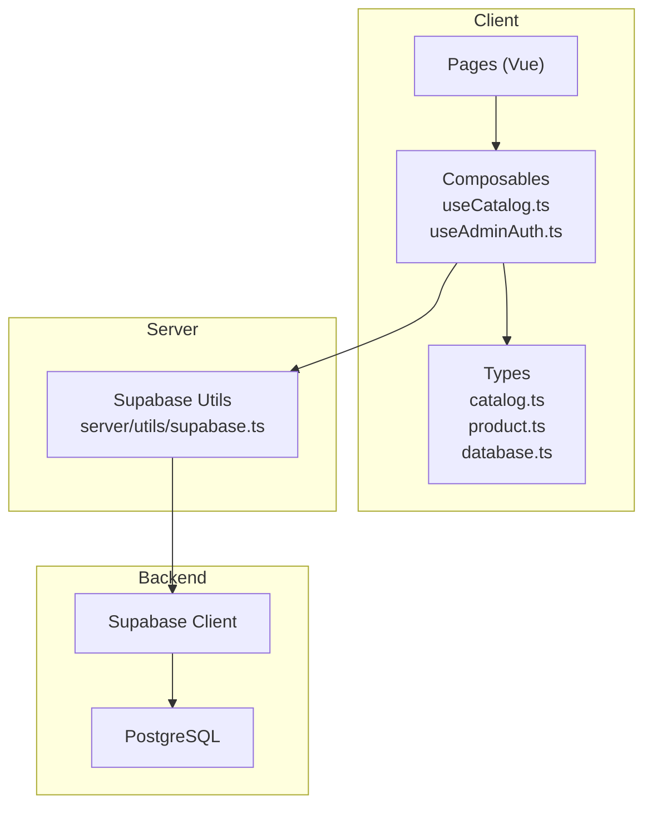
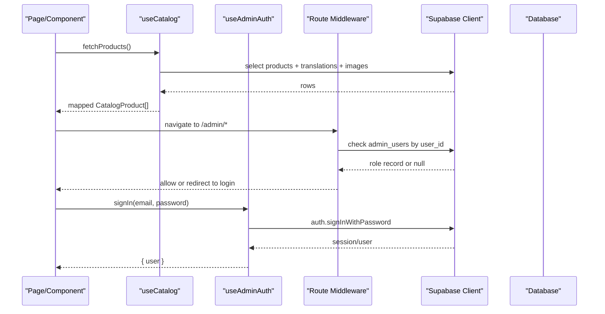
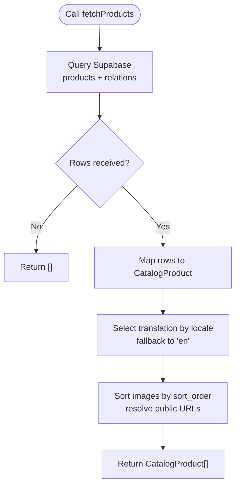
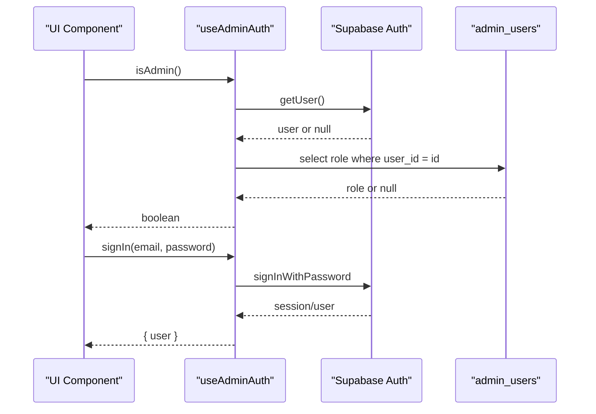
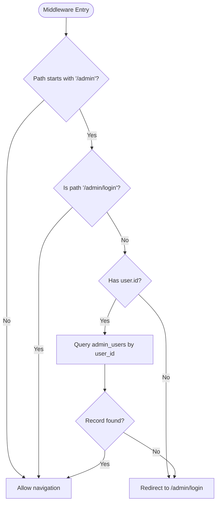
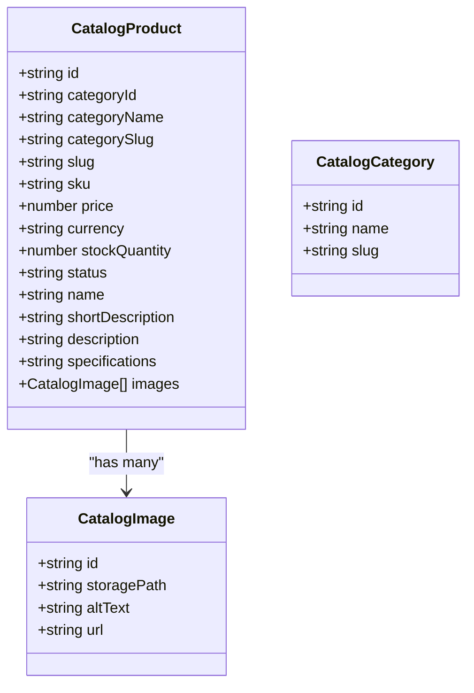
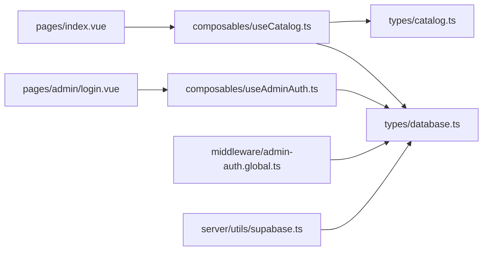

# State Management & Composables

<cite>
**Referenced Files in This Document**
- [useCatalog.ts](file://app/composables/useCatalog.ts)
- [useAdminAuth.ts](file://app/composables/useAdminAuth.ts)
- [catalog.ts](file://app/types/catalog.ts)
- [product.ts](file://app/types/product.ts)
- [database.ts](file://app/types/database.ts)
- [admin-auth.global.ts](file://app/middleware/admin-auth.global.ts)
- [supabase.ts](file://server/utils/supabase.ts)
- [index.vue](file://app/pages/index.vue)
- [login.vue](file://app/pages/admin/login.vue)
</cite>

## Table of Contents
1. [Introduction](#introduction)
2. [Project Structure](#project-structure)
3. [Core Components](#core-components)
4. [Architecture Overview](#architecture-overview)
5. [Detailed Component Analysis](#detailed-component-analysis)
6. [Dependency Analysis](#dependency-analysis)
7. [Performance Considerations](#performance-considerations)
8. [Troubleshooting Guide](#troubleshooting-guide)
9. [Conclusion](#conclusion)

## Introduction
This document explains the state management and composable architecture in Raccoon-Gear-Bin, focusing on Vue 3 Composition API patterns used to manage product catalog data and admin authentication state. It details how reactive data flows from Supabase through typed composables into UI components, how TypeScript interfaces ensure type safety across the stack, and how business logic is separated from presentation layers. It also covers error handling patterns, caching strategies, and best practices for integrating with Nuxt’s composable system.

## Project Structure
The project organizes reusable business logic under app/composables, strongly types data models under app/types, and uses Nuxt middleware for route-level authorization. The server-side utility provides a service-role client for privileged operations.

**Diagram sources**
- [useCatalog.ts:1-61](file://app/composables/useCatalog.ts#L1-L61)
- [useAdminAuth.ts:1-79](file://app/composables/useAdminAuth.ts#L1-L79)
- [catalog.ts:1-31](file://app/types/catalog.ts#L1-L31)
- [product.ts:1-40](file://app/types/product.ts#L1-L40)
- [database.ts:1-123](file://app/types/database.ts#L1-L123)
- [supabase.ts:1-20](file://server/utils/supabase.ts#L1-L20)

**Section sources**
- [useCatalog.ts:1-61](file://app/composables/useCatalog.ts#L1-L61)
- [useAdminAuth.ts:1-79](file://app/composables/useAdminAuth.ts#L1-L79)
- [catalog.ts:1-31](file://app/types/catalog.ts#L1-L31)
- [product.ts:1-40](file://app/types/product.ts#L1-L40)
- [database.ts:1-123](file://app/types/database.ts#L1-L123)
- [supabase.ts:1-20](file://server/utils/supabase.ts#L1-L20)

## Core Components
- useCatalog: Encapsulates product and category fetching, translation-aware mapping, and image URL resolution. Returns pure functions that components can call to fetch and transform data.
- useAdminAuth: Encapsulates authentication state and role checks, exposing user accessors, sign-in/sign-out, and admin role checks.
- Types: Strongly typed interfaces for catalog entities and database rows, ensuring compile-time safety across composables and components.

Key responsibilities:
- Data fetching and transformation are isolated in composables.
- UI components consume only high-level APIs and reactive state.
- Type contracts are defined once and reused across the app.

**Section sources**
- [useCatalog.ts:1-61](file://app/composables/useCatalog.ts#L1-L61)
- [useAdminAuth.ts:1-79](file://app/composables/useAdminAuth.ts#L1-L79)
- [catalog.ts:1-31](file://app/types/catalog.ts#L1-L31)
- [product.ts:1-40](file://app/types/product.ts#L1-L40)

## Architecture Overview
The application follows a clear separation between UI and business logic:
- Pages/components call composables to perform actions and read state.
- Composables interact with Supabase via typed clients and map raw rows to domain models.
- Middleware enforces route-level authorization using Supabase auth and admin roles.
- Server utilities provide a service-role client for privileged operations when needed.

**Diagram sources**
- [useCatalog.ts:37-57](file://app/composables/useCatalog.ts#L37-L57)
- [useAdminAuth.ts:56-69](file://app/composables/useAdminAuth.ts#L56-L69)
- [admin-auth.global.ts:1-27](file://app/middleware/admin-auth.global.ts#L1-L27)

## Detailed Component Analysis

### Composable: useCatalog
Responsibilities:
- Fetch published products and categories from Supabase.
- Map database rows to typed domain models (CatalogProduct, CatalogCategory).
- Resolve public image URLs from storage paths.
- Provide locale-aware content selection for translations.

Data flow:
- Database rows include related translations and images.
- Mapping selects the current locale first, then falls back to English, then to the first available translation.
- Images are sorted by sort_order and transformed to include public URLs.

Error handling:
- Errors from Supabase queries are thrown to callers, enabling UI to catch and display errors.

Caching strategy:
- No in-memory cache is implemented; each call performs a fresh query.
- For performance, consider adding a lightweight cache layer keyed by locale and filters.

Type safety:
- Uses Database type for typed queries.
- Returns CatalogProduct and CatalogCategory interfaces.

**Diagram sources**
- [useCatalog.ts:13-33](file://app/composables/useCatalog.ts#L13-L33)
- [useCatalog.ts:37-47](file://app/composables/useCatalog.ts#L37-L47)

**Section sources**
- [useCatalog.ts:1-61](file://app/composables/useCatalog.ts#L1-L61)

### Composable: useAdminAuth
Responsibilities:
- Expose reactive user state via Supabase.
- Provide role checks (isAdmin, isSuperAdmin) by querying admin_users.
- Handle sign-in and sign-out flows.

Reactive state:
- user is a reactive ref provided by Supabase integration.
- Role checks are async functions that return booleans based on database records.

Error handling:
- Authentication errors are thrown to callers.
- Role lookup errors are logged and treated as unauthorized.

Integration points:
- Used by pages for sign-in flows and by the global middleware for route protection.

**Diagram sources**
- [useAdminAuth.ts:7-14](file://app/composables/useAdminAuth.ts#L7-L14)
- [useAdminAuth.ts:16-34](file://app/composables/useAdminAuth.ts#L16-L34)
- [useAdminAuth.ts:56-69](file://app/composables/useAdminAuth.ts#L56-L69)

**Section sources**
- [useAdminAuth.ts:1-79](file://app/composables/useAdminAuth.ts#L1-L79)

### Route Middleware: admin-auth.global
Purpose:
- Protects /admin routes by checking if the current user exists and has an admin record.
- Redirects unauthorized users to /admin/login.

Flow:
- Skips guard for non-admin routes and the login page itself.
- Reads the current user from Supabase.
- Queries admin_users to verify authorization.
- Redirects if missing or on error.

**Diagram sources**
- [admin-auth.global.ts:1-27](file://app/middleware/admin-auth.global.ts#L1-L27)

**Section sources**
- [admin-auth.global.ts:1-27](file://app/middleware/admin-auth.global.ts#L1-L27)

### Server Utility: createSupabaseAdminClient
Purpose:
- Creates a Supabase client with service-role privileges for server-side operations.
- Validates runtime configuration and disables session persistence and token refresh.

Usage:
- Intended for server-only code paths requiring elevated permissions.

**Section sources**
- [supabase.ts:1-20](file://server/utils/supabase.ts#L1-L20)

### Type System
- catalog.ts defines domain-facing types: CatalogImage, CatalogProduct, CatalogCategory.
- product.ts defines internal record shapes for product-related tables and translations.
- database.ts defines row types and the full Database schema for typed Supabase queries.

Benefits:
- Compile-time validation of queries and responses.
- Clear contracts between composables and UI components.
- Consistent naming and structure across the app.

**Diagram sources**
- [catalog.ts:1-31](file://app/types/catalog.ts#L1-L31)

**Section sources**
- [catalog.ts:1-31](file://app/types/catalog.ts#L1-L31)
- [product.ts:1-40](file://app/types/product.ts#L1-L40)
- [database.ts:1-123](file://app/types/database.ts#L1-L123)

### Usage in Pages and Components
- The main index page demonstrates direct Supabase usage and local state management for the catalog view. It shows how to load categories and products, map them, and handle loading/error states.
- The admin login page uses useAdminAuth for sign-in and validates admin rights before navigation.

Best practices demonstrated:
- Separate loading, error, and success states.
- Use try/catch around async operations.
- Keep UI concerns separate from data fetching logic by calling composables.

**Section sources**
- [index.vue:1-120](file://app/pages/index.vue#L1-L120)
- [login.vue:1-121](file://app/pages/admin/login.vue#L1-L121)

## Dependency Analysis
Composables depend on:
- Supabase client for data and auth.
- i18n for locale-aware content selection.
- Typed database schemas for safe queries.

Components depend on:
- Composables for business logic.
- Types for prop and state typing.

**Diagram sources**
- [index.vue:1-120](file://app/pages/index.vue#L1-L120)
- [login.vue:1-121](file://app/pages/admin/login.vue#L1-L121)
- [useCatalog.ts:1-61](file://app/composables/useCatalog.ts#L1-L61)
- [useAdminAuth.ts:1-79](file://app/composables/useAdminAuth.ts#L1-L79)
- [admin-auth.global.ts:1-27](file://app/middleware/admin-auth.global.ts#L1-L27)
- [supabase.ts:1-20](file://server/utils/supabase.ts#L1-L20)
- [catalog.ts:1-31](file://app/types/catalog.ts#L1-L31)
- [database.ts:1-123](file://app/types/database.ts#L1-L123)

**Section sources**
- [useCatalog.ts:1-61](file://app/composables/useCatalog.ts#L1-L61)
- [useAdminAuth.ts:1-79](file://app/composables/useAdminAuth.ts#L1-L79)
- [admin-auth.global.ts:1-27](file://app/middleware/admin-auth.global.ts#L1-L27)
- [supabase.ts:1-20](file://server/utils/supabase.ts#L1-L20)
- [catalog.ts:1-31](file://app/types/catalog.ts#L1-L31)
- [database.ts:1-123](file://app/types/database.ts#L1-L123)

## Performance Considerations
- Avoid redundant queries by caching results at the composable level when appropriate.
- Prefer selective field projection in Supabase queries to reduce payload size.
- Defer heavy transformations until necessary; keep mapping functions simple.
- Consider pagination for large catalogs to improve initial load times.
- Use computed properties in components to derive filtered/sorted lists without re-fetching.

[No sources needed since this section provides general guidance]

## Troubleshooting Guide
Common issues and resolutions:
- Missing environment variables for Supabase: Ensure runtime config includes supabaseUrl and serviceRoleKey; the server utility throws when missing.
- Unauthorized access to admin routes: Verify user session and admin_users record; middleware redirects to login if not authorized.
- Image URLs not resolving: Confirm storage bucket configuration and that storage_path values are valid; the composable resolves public URLs.
- Translation fallback behavior: If locale-specific translations are missing, the composable falls back to English or the first available translation.

Operational tips:
- Wrap composable calls in try/catch to surface errors to the UI.
- Log Supabase errors during development to diagnose query issues.
- Validate admin role checks both on the client and server side for security.

**Section sources**
- [supabase.ts:1-20](file://server/utils/supabase.ts#L1-L20)
- [admin-auth.global.ts:1-27](file://app/middleware/admin-auth.global.ts#L1-L27)
- [useCatalog.ts:8-11](file://app/composables/useCatalog.ts#L8-L11)
- [useCatalog.ts:13-33](file://app/composables/useCatalog.ts#L13-L33)

## Conclusion
Raccoon-Gear-Bin implements a clean, type-safe composable architecture that separates business logic from UI. useCatalog encapsulates catalog data fetching and mapping, while useAdminAuth centralizes authentication and authorization. The middleware ensures secure access to admin routes. Strong TypeScript definitions across catalog, product, and database schemas enforce correctness throughout the pipeline. To further improve scalability, consider introducing caching, pagination, and centralized error handling within composables.

[No sources needed since this section summarizes without analyzing specific files]