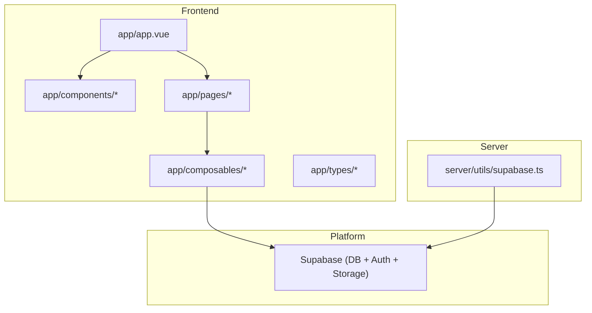
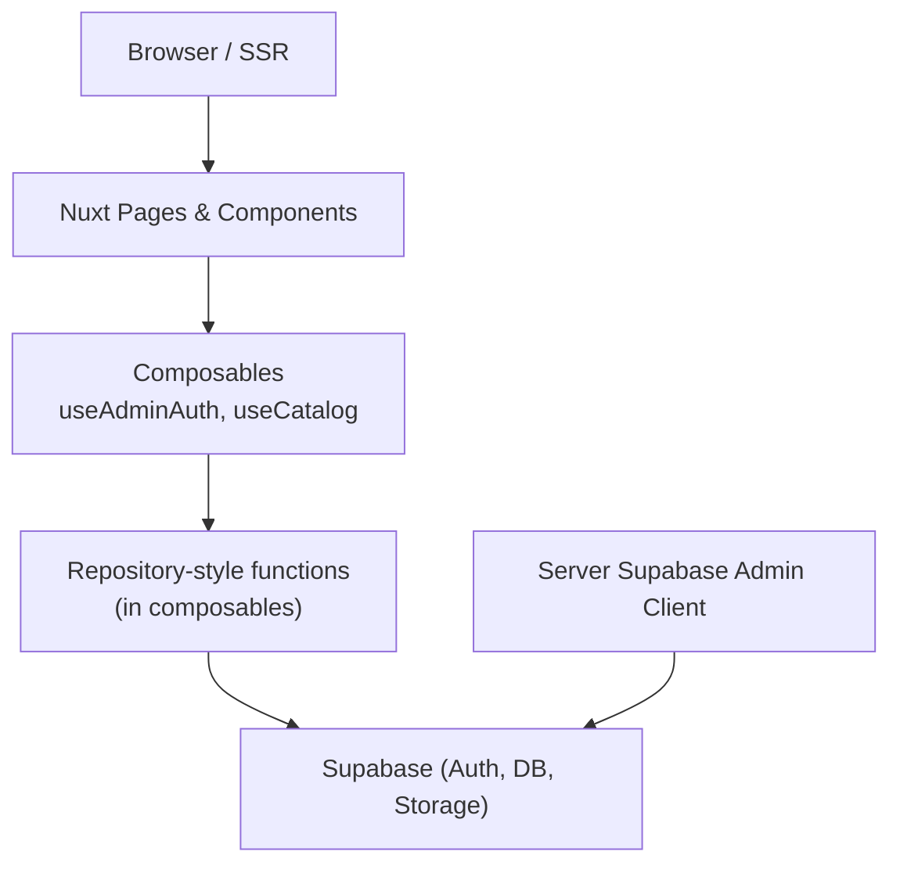
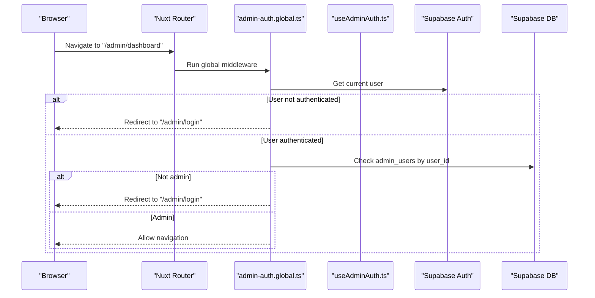
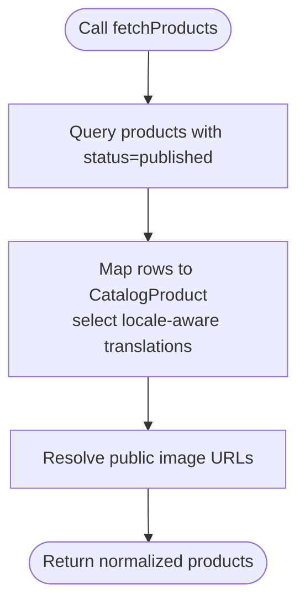
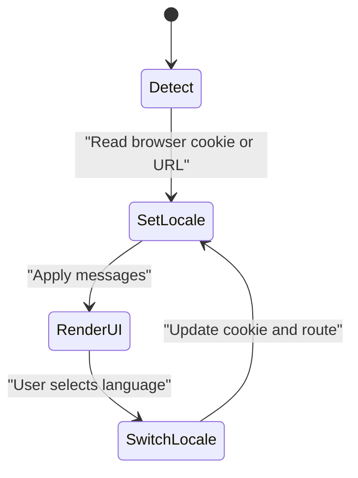
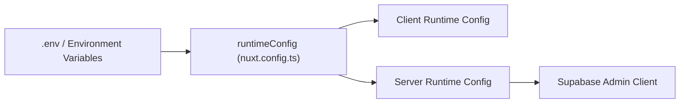
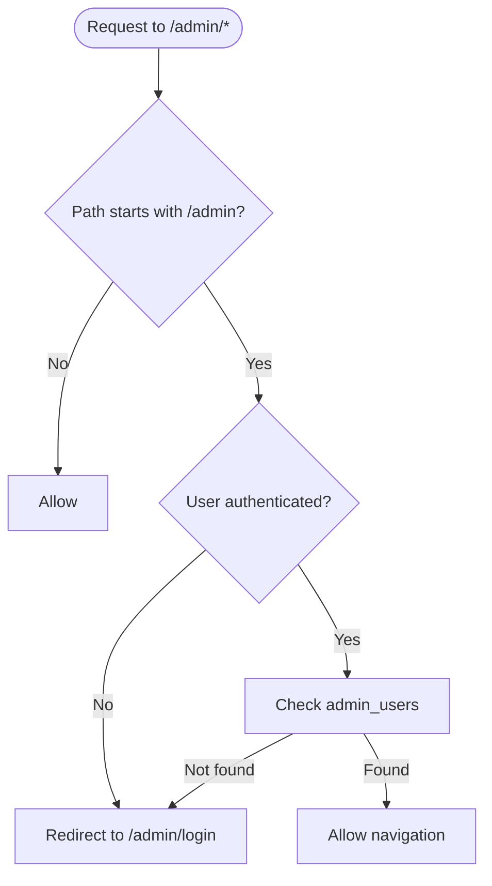
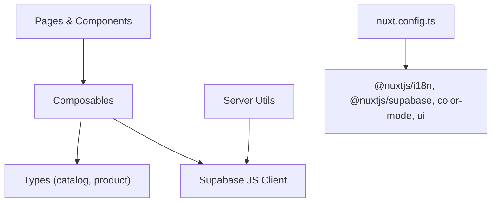
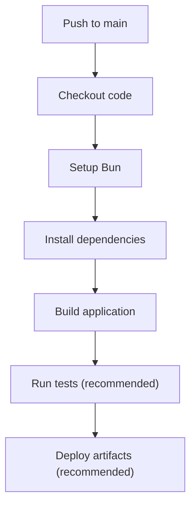

# System Design Patterns

<cite>
**Referenced Files in This Document**
- [README.md](file://README.md)
- [package.json](file://package.json)
- [nuxt.config.ts](file://nuxt.config.ts)
- [i18n.config.ts](file://i18n.config.ts)
- [app/app.vue](file://app/app.vue)
- [app/app.config.ts](file://app/app.config.ts)
- [eslint.config.mjs](file://eslint.config.mjs)
- [.github/workflows/ci.yml](file://.github/workflows/ci.yml)
- [app/composables/useAdminAuth.ts](file://app/composables/useAdminAuth.ts)
- [app/composables/useCatalog.ts](file://app/composables/useCatalog.ts)
- [app/middleware/admin-auth.global.ts](file://app/middleware/admin-auth.global.ts)
- [server/utils/supabase.ts](file://server/utils/supabase.ts)
- [app/types/catalog.ts](file://app/types/catalog.ts)
- [app/types/product.ts](file://app/types/product.ts)
- [supabase/config.toml](file://supabase/config.toml)
</cite>

## Table of Contents
1. Introduction
2. Project Structure
3. Core Components
4. Architecture Overview
5. Detailed Component Analysis
6. Dependency Analysis
7. Performance Considerations
8. Troubleshooting Guide
9. Conclusion

## Introduction
This document explains the system design patterns used in Raccoon-Gear-Bin, a Nuxt-based storefront and admin application. It covers modular component structure, service-oriented business logic via composables, repository-style data access through Supabase, configuration management with Nuxt config files and environment variables, internationalization for English and Khmer, middleware patterns for authentication and request interception, CI/CD pipeline, code quality enforcement with ESLint, automated testing strategy guidance, deployment topology, scalability considerations, monitoring approaches, and guidelines for extending the architecture consistently and performantly.

## Project Structure
The project follows a Nuxt 3 feature-oriented layout:
- app/: UI components, pages, composables (business logic), types, and app-level configuration
- server/utils/: Server-side utilities (e.g., Supabase admin client)
- supabase/: Database migrations and local Supabase configuration
- .github/workflows/: CI pipeline
- Root config files: nuxt.config.ts, i18n.config.ts, eslint.config.mjs, package.json

**Diagram sources**
- [app/app.vue:1-4](file://app/app.vue#L1-L4)
- [server/utils/supabase.ts:1-20](file://server/utils/supabase.ts#L1-L20)

**Section sources**
- [README.md:1-36](file://README.md#L1-L36)
- [package.json:1-26](file://package.json#L1-L26)

## Core Components
- Modular UI components under app/components handle presentation and small interactions.
- Business logic is encapsulated in composables (service layer):
  - useAdminAuth: authentication and authorization helpers
  - useCatalog: catalog data fetching and mapping (repository-like pattern)
- Middleware enforces route-level authorization for admin routes.
- Server utility provides a secure Supabase admin client for privileged operations.

Key responsibilities:
- Composables isolate stateful logic and side effects from views.
- Types define contracts between layers (catalog, product, database).
- Configuration centralizes runtime settings, modules, and i18n behavior.

**Section sources**
- [app/composables/useAdminAuth.ts:1-79](file://app/composables/useAdminAuth.ts#L1-L79)
- [app/composables/useCatalog.ts:1-61](file://app/composables/useCatalog.ts#L1-L61)
- [app/middleware/admin-auth.global.ts:1-28](file://app/middleware/admin-auth.global.ts#L1-L28)
- [server/utils/supabase.ts:1-20](file://server/utils/supabase.ts#L1-L20)
- [app/types/catalog.ts:1-31](file://app/types/catalog.ts#L1-L31)
- [app/types/product.ts:1-40](file://app/types/product.ts#L1-L40)

## Architecture Overview
Raccoon-Gear-Bin uses a layered architecture:
- Presentation Layer: Nuxt pages and Vue components render UI.
- Service Layer: Composables implement business logic and orchestrate data access.
- Data Access Layer: Repository-style functions in composables call Supabase; server utilities provide an admin client for privileged operations.
- Platform Layer: Supabase provides Postgres, Auth, and Storage.

**Diagram sources**
- [app/composables/useAdminAuth.ts:1-79](file://app/composables/useAdminAuth.ts#L1-L79)
- [app/composables/useCatalog.ts:1-61](file://app/composables/useCatalog.ts#L1-L61)
- [server/utils/supabase.ts:1-20](file://server/utils/supabase.ts#L1-L20)

## Detailed Component Analysis

### Authentication and Authorization Pattern
- Route middleware guards /admin/* routes, redirects unauthenticated users to login, and verifies admin presence in the database.
- useAdminAuth composable exposes user state, role checks (isAdmin, isSuperAdmin), sign-in, and sign-out flows.
- The admin client on the server uses a service role key for privileged operations.

**Diagram sources**
- [app/middleware/admin-auth.global.ts:1-28](file://app/middleware/admin-auth.global.ts#L1-L28)
- [app/composables/useAdminAuth.ts:1-79](file://app/composables/useAdminAuth.ts#L1-L79)

**Section sources**
- [app/middleware/admin-auth.global.ts:1-28](file://app/middleware/admin-auth.global.ts#L1-L28)
- [app/composables/useAdminAuth.ts:1-79](file://app/composables/useAdminAuth.ts#L1-L79)
- [server/utils/supabase.ts:1-20](file://server/utils/supabase.ts#L1-L20)

### Catalog Data Access (Repository Pattern)
- useCatalog composable implements repository-style methods: fetchProducts, fetchProduct, fetchCategories.
- Data mapping normalizes raw Supabase results into typed domain models (CatalogProduct, CatalogCategory).
- Locale-aware translation selection ensures correct language display.

**Diagram sources**
- [app/composables/useCatalog.ts:1-61](file://app/composables/useCatalog.ts#L1-L61)
- [app/types/catalog.ts:1-31](file://app/types/catalog.ts#L1-L31)

**Section sources**
- [app/composables/useCatalog.ts:1-61](file://app/composables/useCatalog.ts#L1-L61)
- [app/types/catalog.ts:1-31](file://app/types/catalog.ts#L1-L31)

### Internationalization Architecture
- Nuxt i18n module configured with locales 'en' and 'km', default 'en', prefix_except_default routing strategy, and cookie-based detection.
- Messages defined centrally in i18n.config.ts for both languages.
- Language switching is supported via a dedicated component that toggles locale and persists preference.

**Diagram sources**
- [nuxt.config.ts:37-50](file://nuxt.config.ts#L37-L50)
- [i18n.config.ts:1-14](file://i18n.config.ts#L1-L14)

**Section sources**
- [nuxt.config.ts:37-50](file://nuxt.config.ts#L37-L50)
- [i18n.config.ts:1-14](file://i18n.config.ts#L1-L14)

### Configuration Management Strategy
- Runtime configuration:
  - Public keys and URLs exposed to the client via runtimeConfig.public.
  - Service role key kept server-only for privileged operations.
- Module configuration:
  - Supabase module options include redirect behavior, cookies, and keys.
  - Color mode and UI theme defaults are set at build time.
- App-level configuration:
  - Global UI tokens and base styles centralized in app.config.ts.

**Diagram sources**
- [nuxt.config.ts:9-26](file://nuxt.config.ts#L9-L26)
- [server/utils/supabase.ts:1-20](file://server/utils/supabase.ts#L1-L20)
- [app/app.config.ts:1-20](file://app/app.config.ts#L1-L20)

**Section sources**
- [nuxt.config.ts:1-52](file://nuxt.config.ts#L1-L52)
- [app/app.config.ts:1-20](file://app/app.config.ts#L1-L20)
- [server/utils/supabase.ts:1-20](file://server/utils/supabase.ts#L1-L20)

### Middleware Patterns
- Authentication middleware:
  - Guards admin routes, enforces session existence, and validates admin role.
- Logging and request interception:
  - Centralized error logging is present in composables and middleware; additional structured logging can be added via Nuxt plugins or server hooks.

**Diagram sources**
- [app/middleware/admin-auth.global.ts:1-28](file://app/middleware/admin-auth.global.ts#L1-L28)

**Section sources**
- [app/middleware/admin-auth.global.ts:1-28](file://app/middleware/admin-auth.global.ts#L1-L28)

## Dependency Analysis
High-level dependencies among core modules:

**Diagram sources**
- [app/composables/useCatalog.ts:1-61](file://app/composables/useCatalog.ts#L1-L61)
- [app/composables/useAdminAuth.ts:1-79](file://app/composables/useAdminAuth.ts#L1-L79)
- [app/types/catalog.ts:1-31](file://app/types/catalog.ts#L1-L31)
- [app/types/product.ts:1-40](file://app/types/product.ts#L1-L40)
- [nuxt.config.ts:1-52](file://nuxt.config.ts#L1-L52)

**Section sources**
- [app/composables/useCatalog.ts:1-61](file://app/composables/useCatalog.ts#L1-L61)
- [app/composables/useAdminAuth.ts:1-79](file://app/composables/useAdminAuth.ts#L1-L79)
- [app/types/catalog.ts:1-31](file://app/types/catalog.ts#L1-L31)
- [app/types/product.ts:1-40](file://app/types/product.ts#L1-L40)
- [nuxt.config.ts:1-52](file://nuxt.config.ts#L1-L52)

## Performance Considerations
- Data fetching:
  - Use selective column projection in Supabase queries to minimize payload size.
  - Cache frequently accessed catalog data at the edge or via CDN where possible.
- Image handling:
  - Prefer optimized images and lazy loading; ensure public URLs are resolved efficiently.
- SSR/SSG:
  - Leverage Nuxt’s prerendering for static catalog pages to reduce server load.
- Localization:
  - Load only necessary locale bundles; avoid shipping unused translations.
- Admin operations:
  - Use server-side admin client to enforce RLS and reduce client-side overhead.

[No sources needed since this section provides general guidance]

## Troubleshooting Guide
- Missing Supabase configuration:
  - Ensure NUXT_PUBLIC_SUPABASE_URL and NUXT_PUBLIC_SUPABASE_ANON_KEY are set; service role key must be available server-side.
- Admin access denied:
  - Verify admin_users table contains a record for the authenticated user.
- i18n issues:
  - Confirm locale cookie and route prefixes match configuration.
- Build failures:
  - Validate ESLint rules and Tailwind integration; run lint locally before pushing.

**Section sources**
- [nuxt.config.ts:9-26](file://nuxt.config.ts#L9-L26)
- [app/middleware/admin-auth.global.ts:1-28](file://app/middleware/admin-auth.global.ts#L1-L28)
- [eslint.config.mjs:1-20](file://eslint.config.mjs#L1-L20)

## Conclusion
Raccoon-Gear-Bin applies clear architectural patterns: modular components, service-oriented composables, repository-style data access, and robust configuration management. Internationalization is built-in with dynamic locale switching, and middleware secures admin routes. The CI pipeline enforces builds, while ESLint maintains code quality. For production, deploy behind a reverse proxy or platform with TLS, scale horizontally using stateless instances, and monitor Supabase metrics and application logs. Extend the system by adding new composables and pages following existing patterns, keeping types and configurations consistent.

[No sources needed since this section summarizes without analyzing specific files]

## Appendices

### CI/CD Pipeline Design
- GitHub Actions triggers on push, installs dependencies with Bun, and runs the build step.
- Recommended additions:
  - Lint and type-check steps
  - Unit and integration tests
  - Artifact upload for preview deployments

**Diagram sources**
- [.github/workflows/ci.yml:1-26](file://.github/workflows/ci.yml#L1-L26)

**Section sources**
- [.github/workflows/ci.yml:1-26](file://.github/workflows/ci.yml#L1-L26)

### Code Quality Enforcement with ESLint
- ESLint integrates with Nuxt and Tailwind CSS plugin for correctness and style validation.
- Entry point for Tailwind attributes is configured to validate component bindings.

**Section sources**
- [eslint.config.mjs:1-20](file://eslint.config.mjs#L1-L20)

### Automated Testing Strategies
- Recommended approach:
  - Unit tests for composables (e.g., useCatalog mapping logic)
  - Integration tests for Supabase queries against a test schema
  - End-to-end tests for critical user flows (login, catalog browsing)
- Tools:
  - Vitest for unit/integration
  - Playwright for E2E
- Execution:
  - Add test scripts to package.json and integrate into CI workflow.

**Section sources**
- [package.json:1-26](file://package.json#L1-L26)

### Deployment Topology and Scalability
- Deployment targets:
  - Vercel, Netlify, Cloudflare Pages, or self-hosted Node server with Nuxt.
- Scalability:
  - Stateless app instances behind a load balancer
  - Edge caching for static assets and pre-rendered pages
  - Supabase scaling for DB and storage
- Monitoring:
  - Application logs and error tracking
  - Supabase dashboard for DB and Auth metrics
  - Uptime and performance monitoring

**Section sources**
- [supabase/config.toml:1-32](file://supabase/config.toml#L1-L32)

### Guidelines for Extending the Architecture
- New features:
  - Create composables for business logic; keep them pure and testable.
  - Define TypeScript interfaces for new entities and map Supabase rows to domain models.
  - Add pages and components under app/pages and app/components.
- Configuration:
  - Add new runtime config entries in nuxt.config.ts and consume via useRuntimeConfig.
- Security:
  - Enforce RLS policies in Supabase; use server-side admin client for privileged operations.
- Performance:
  - Optimize queries, paginate large datasets, and cache where appropriate.
- Internationalization:
  - Add new keys to i18n.config.ts for all supported locales.

**Section sources**
- [nuxt.config.ts:1-52](file://nuxt.config.ts#L1-L52)
- [i18n.config.ts:1-14](file://i18n.config.ts#L1-L14)
- [app/types/catalog.ts:1-31](file://app/types/catalog.ts#L1-L31)
- [app/types/product.ts:1-40](file://app/types/product.ts#L1-L40)