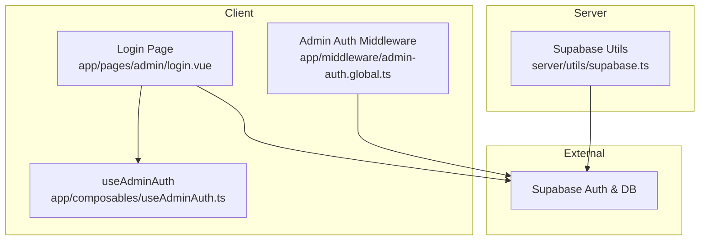
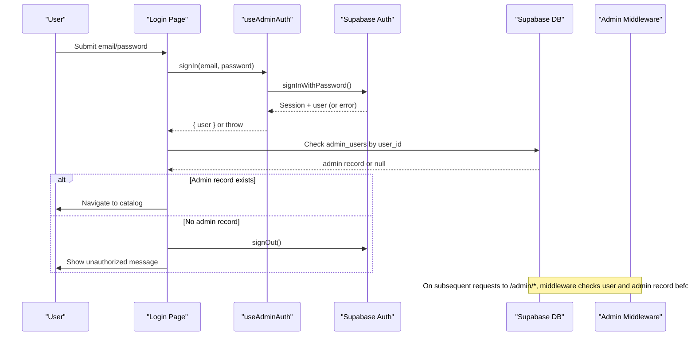
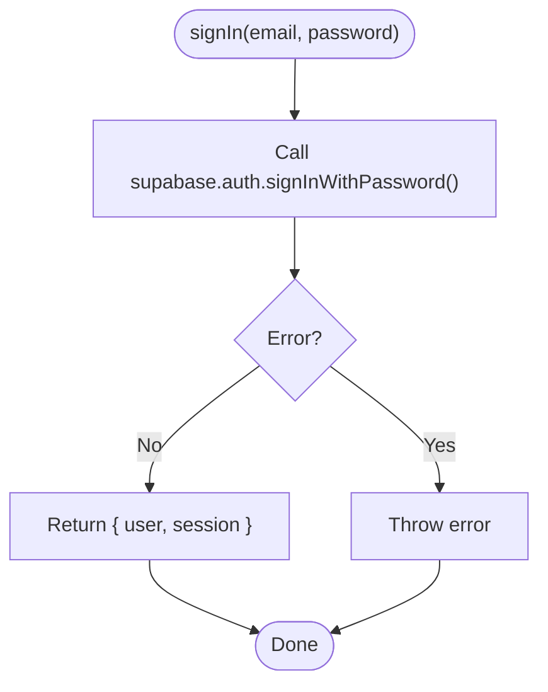
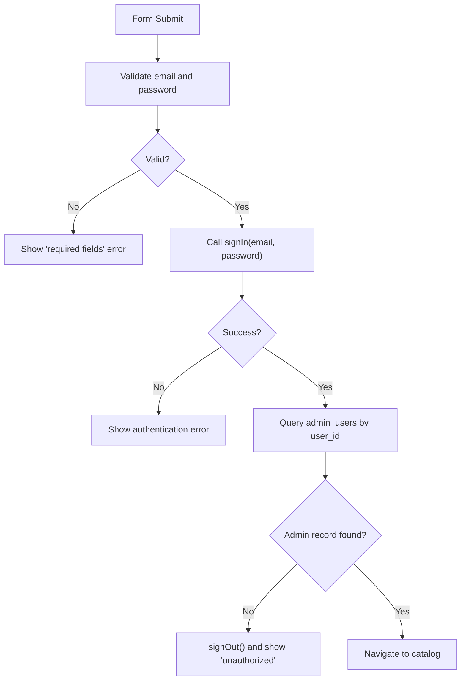
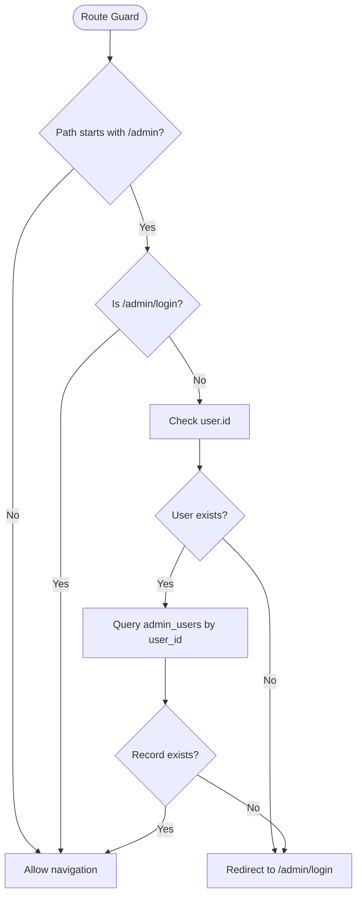
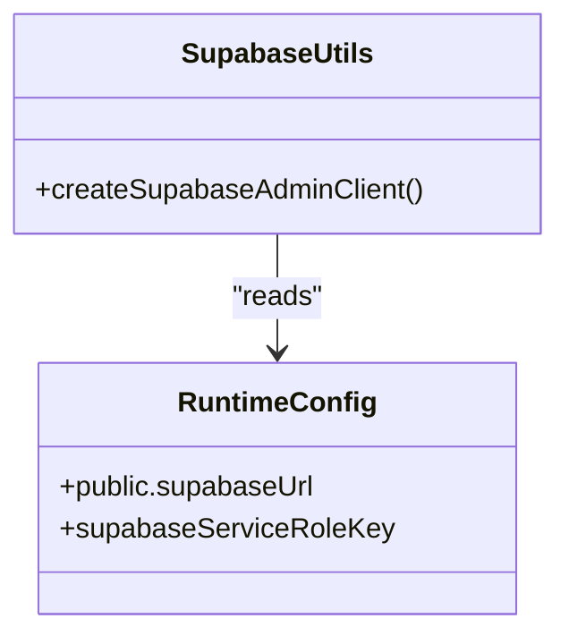
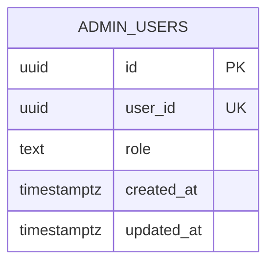
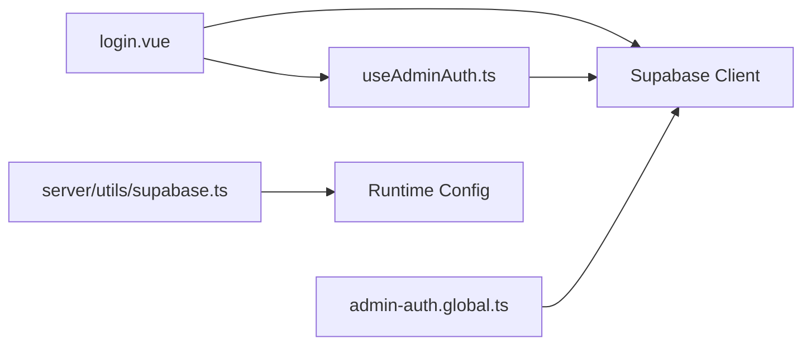

# Admin Authentication Flow

<cite>
**Referenced Files in This Document**
- [useAdminAuth.ts](file://app/composables/useAdminAuth.ts)
- [login.vue](file://app/pages/admin/login.vue)
- [admin-auth.global.ts](file://app/middleware/admin-auth.global.ts)
- [supabase.ts](file://server/utils/supabase.ts)
- [database.ts](file://app/types/database.ts)
- [create_catalog_schema.sql](file://supabase/migrations/20260922_000001_create_catalog_schema.sql)
- [config.toml](file://supabase/config.toml)
- [nuxt.config.ts](file://nuxt.config.ts)
</cite>

## Table of Contents
1. [Introduction](#introduction)
2. [Project Structure](#project-structure)
3. [Core Components](#core-components)
4. [Architecture Overview](#architecture-overview)
5. [Detailed Component Analysis](#detailed-component-analysis)
6. [Dependency Analysis](#dependency-analysis)
7. [Performance Considerations](#performance-considerations)
8. [Troubleshooting Guide](#troubleshooting-guide)
9. [Conclusion](#conclusion)

## Introduction
This document explains the admin authentication flow that handles user login, session management, and credential validation. It covers the complete lifecycle from the login form submission to Supabase authentication and session persistence, including the useAdminAuth composable, the login page component, route middleware for authorization, and server-side client configuration. It also provides guidance on extending authentication, handling errors, and security considerations.

## Project Structure
The admin authentication spans several layers:
- Client composables encapsulate auth logic and role checks
- A dedicated login page manages user input, validation, and feedback
- Global middleware protects admin routes and enforces authorization
- Server utilities provide a service-role Supabase client for privileged operations
- Database schema defines admin roles and relationships
- Supabase runtime config enables email-based authentication
- Nuxt configuration wires Supabase module, cookies, and runtime keys

**Diagram sources**
- [login.vue:1-121](file://app/pages/admin/login.vue#L1-L121)
- [useAdminAuth.ts:1-79](file://app/composables/useAdminAuth.ts#L1-L79)
- [admin-auth.global.ts:1-28](file://app/middleware/admin-auth.global.ts#L1-L28)
- [supabase.ts:1-20](file://server/utils/supabase.ts#L1-L20)

**Section sources**
- [login.vue:1-121](file://app/pages/admin/login.vue#L1-L121)
- [useAdminAuth.ts:1-79](file://app/composables/useAdminAuth.ts#L1-L79)
- [admin-auth.global.ts:1-28](file://app/middleware/admin-auth.global.ts#L1-L28)
- [supabase.ts:1-20](file://server/utils/supabase.ts#L1-L20)

## Core Components
- useAdminAuth composable: Provides signIn(), signOut(), isAdmin(), isSuperAdmin(), getCurrentUser(), and exposes the reactive user object.
- Login page: Collects email/password, validates inputs, calls signIn(), verifies admin record exists, and navigates on success or shows errors.
- Admin auth middleware: Guards /admin/* routes, ensures a logged-in user with an admin_users record exists; otherwise redirects to /admin/login.
- Server Supabase utils: Creates a service-role client with disabled session persistence and token auto-refresh for server-only operations.
- Database types and schema: Define admin_users table structure and AdminRole enum used across the app.
- Supabase runtime config: Enables email provider and sets site URLs for local development.
- Nuxt config: Initializes Supabase module, cookie options, and runtime configuration for public and service keys.

**Section sources**
- [useAdminAuth.ts:1-79](file://app/composables/useAdminAuth.ts#L1-L79)
- [login.vue:1-121](file://app/pages/admin/login.vue#L1-L121)
- [admin-auth.global.ts:1-28](file://app/middleware/admin-auth.global.ts#L1-L28)
- [supabase.ts:1-20](file://server/utils/supabase.ts#L1-L20)
- [database.ts:12-12](file://app/types/database.ts#L12-L12)
- [database.ts:69-75](file://app/types/database.ts#L69-L75)
- [create_catalog_schema.sql:61-67](file://supabase/migrations/20260922_000001_create_catalog_schema.sql#L61-L67)
- [config.toml:23-28](file://supabase/config.toml#L23-L28)
- [nuxt.config.ts:16-26](file://nuxt.config.ts#L16-L26)

## Architecture Overview
The authentication architecture integrates client-side UI, composables, global middleware, and Supabase services.

**Diagram sources**
- [login.vue:15-54](file://app/pages/admin/login.vue#L15-L54)
- [useAdminAuth.ts:56-69](file://app/composables/useAdminAuth.ts#L56-L69)
- [admin-auth.global.ts:1-28](file://app/middleware/admin-auth.global.ts#L1-L28)

## Detailed Component Analysis

### useAdminAuth Composable
Responsibilities:
- Authenticate users via Supabase email/password
- Sign out users
- Determine if the current user is an admin or super admin by querying admin_users
- Provide a reactive user reference and a helper to fetch the latest user info

Key behaviors:
- getCurrentUser(): Tries Supabase auth.getUser(); falls back to the reactive user ref if present.
- isAdmin(): Queries admin_users for the current user; returns true if a row exists.
- isSuperAdmin(): Queries admin_users and checks role equals 'super_admin'.
- signIn(): Wraps supabase.auth.signInWithPassword and throws on error.
- signOut(): Wraps supabase.auth.signOut and throws on error.

**Diagram sources**
- [useAdminAuth.ts:56-64](file://app/composables/useAdminAuth.ts#L56-L64)

Security notes:
- Password hashing is handled by Supabase; the client never stores or hashes passwords.
- Session tokens are managed by Supabase JS SDK and persisted according to Nuxt Supabase module settings.

**Section sources**
- [useAdminAuth.ts:7-14](file://app/composables/useAdminAuth.ts#L7-L14)
- [useAdminAuth.ts:16-34](file://app/composables/useAdminAuth.ts#L16-L34)
- [useAdminAuth.ts:36-54](file://app/composables/useAdminAuth.ts#L36-L54)
- [useAdminAuth.ts:56-69](file://app/composables/useAdminAuth.ts#L56-L69)

### Login Form Component
Responsibilities:
- Render email and password fields
- Validate required fields
- Call useAdminAuth.signIn()
- Verify admin_users record exists for the authenticated user
- Handle errors and display user feedback
- Redirect to catalog on success

Validation and UX:
- Required field check prevents empty submissions and displays a localized message.
- Loading state disables the submit button during submission.
- Error messages are shown via an alert component when authentication fails or the user lacks admin privileges.

Flow:
- On submit, clear previous errors, validate inputs, call signIn, then query admin_users.
- If no admin record, sign out and show unauthorized message.
- Otherwise navigate to the catalog.

**Diagram sources**
- [login.vue:15-54](file://app/pages/admin/login.vue#L15-L54)

**Section sources**
- [login.vue:1-58](file://app/pages/admin/login.vue#L1-L58)
- [login.vue:60-121](file://app/pages/admin/login.vue#L60-L121)

### Admin Route Middleware
Responsibilities:
- Protect all /admin/* routes except /admin/login
- Ensure a user is logged in
- Ensure the user has an admin_users record
- Redirect unauthorized attempts to /admin/login

Behavior:
- Skips guard for non-admin paths and the login path itself.
- Reads the current user from Supabase; if missing, redirects to login.
- Queries admin_users for the user; if missing or error occurs, redirects to login.

**Diagram sources**
- [admin-auth.global.ts:1-28](file://app/middleware/admin-auth.global.ts#L1-L28)

**Section sources**
- [admin-auth.global.ts:1-28](file://app/middleware/admin-auth.global.ts#L1-L28)

### Server-Side Supabase Client
Purpose:
- Create a service-role Supabase client for server-only operations where elevated privileges are needed.
- Disables session persistence and token auto-refresh to avoid client-like behavior on the server.

Configuration:
- Reads URL and service role key from runtime config.
- Throws if configuration is missing.

**Diagram sources**
- [supabase.ts:1-20](file://server/utils/supabase.ts#L1-L20)

**Section sources**
- [supabase.ts:1-20](file://server/utils/supabase.ts#L1-L20)

### Data Model and Schema
- AdminRole enum: 'admin' | 'super_admin'
- admin_users table: id, user_id (unique), role, timestamps
- The database migration defines constraints and indexes relevant to the catalog and admin tables.

**Diagram sources**
- [create_catalog_schema.sql:61-67](file://supabase/migrations/20260922_000001_create_catalog_schema.sql#L61-L67)
- [database.ts:12-12](file://app/types/database.ts#L12-L12)
- [database.ts:69-75](file://app/types/database.ts#L69-L75)

**Section sources**
- [create_catalog_schema.sql:61-67](file://supabase/migrations/20260922_000001_create_catalog_schema.sql#L61-L67)
- [database.ts:12-12](file://app/types/database.ts#L12-L12)
- [database.ts:69-75](file://app/types/database.ts#L69-L75)

### Supabase Runtime Configuration
- Email provider enabled for authentication.
- Site URL and additional redirect URLs configured for local development.

**Section sources**
- [config.toml:23-28](file://supabase/config.toml#L23-L28)

### Nuxt Configuration
- Initializes @nuxtjs/supabase module with redirect disabled.
- Sets cookie name, lifetime, and SameSite policy for session persistence.
- Exposes public Supabase URL and anon key, plus service role key for server usage.

**Section sources**
- [nuxt.config.ts:8-8](file://nuxt.config.ts#L8-L8)
- [nuxt.config.ts:9-15](file://nuxt.config.ts#L9-L15)
- [nuxt.config.ts:16-26](file://nuxt.config.ts#L16-L26)

## Dependency Analysis
High-level dependencies:
- Login page depends on useAdminAuth and Supabase client for admin record verification.
- useAdminAuth depends on Supabase auth and database clients.
- Middleware depends on Supabase user state and database client.
- Server utils depend on runtime configuration.

**Diagram sources**
- [login.vue:1-121](file://app/pages/admin/login.vue#L1-L121)
- [useAdminAuth.ts:1-79](file://app/composables/useAdminAuth.ts#L1-L79)
- [admin-auth.global.ts:1-28](file://app/middleware/admin-auth.global.ts#L1-L28)
- [supabase.ts:1-20](file://server/utils/supabase.ts#L1-L20)

**Section sources**
- [login.vue:1-121](file://app/pages/admin/login.vue#L1-L121)
- [useAdminAuth.ts:1-79](file://app/composables/useAdminAuth.ts#L1-L79)
- [admin-auth.global.ts:1-28](file://app/middleware/admin-auth.global.ts#L1-L28)
- [supabase.ts:1-20](file://server/utils/supabase.ts#L1-L20)

## Performance Considerations
- Minimize redundant queries: The login page performs an extra admin_users lookup after successful authentication; consider caching admin status in the composable if frequently accessed.
- Avoid unnecessary network calls: getCurrentUser() can be optimized by leveraging the reactive user ref more aggressively to reduce auth.getUser() calls.
- Middleware efficiency: The middleware queries admin_users on every protected route; consider caching admin status per session to reduce repeated lookups.
- Cookie lifetime: Adjust cookie lifetime based on expected session duration and security posture.

[No sources needed since this section provides general guidance]

## Troubleshooting Guide
Common issues and resolutions:
- Invalid credentials:
  - Symptom: Error displayed after login attempt.
  - Cause: Supabase auth.signInWithPassword rejects invalid email/password.
  - Resolution: Verify credentials and ensure email provider is enabled in Supabase config.
  - Section sources
    - [login.vue:49-51](file://app/pages/admin/login.vue#L49-L51)
    - [useAdminAuth.ts:56-64](file://app/composables/useAdminAuth.ts#L56-L64)
    - [config.toml:27-28](file://supabase/config.toml#L27-L28)

- Unauthorized admin access:
  - Symptom: After successful login, user is redirected back to login with an unauthorized message.
  - Cause: No admin_users record for the authenticated user.
  - Resolution: Insert an admin_users row mapping the user_id to a valid role.
  - Section sources
    - [login.vue:32-46](file://app/pages/admin/login.vue#L32-L46)
    - [create_catalog_schema.sql:61-67](file://supabase/migrations/20260922_000001_create_catalog_schema.sql#L61-L67)

- Network errors:
  - Symptom: Errors thrown during signIn or admin record checks.
  - Cause: Connectivity issues or misconfigured Supabase URL/key.
  - Resolution: Verify environment variables and runtime config; ensure Supabase instance is reachable.
  - Section sources
    - [useAdminAuth.ts:56-69](file://app/composables/useAdminAuth.ts#L56-L69)
    - [nuxt.config.ts:9-15](file://nuxt.config.ts#L9-L15)

- Session expiration:
  - Symptom: Users are redirected to login unexpectedly.
  - Cause: Session cookie expired or not persisted correctly.
  - Resolution: Review cookie lifetime and SameSite settings; ensure correct site_url and redirect_urls in Supabase config.
  - Section sources
    - [nuxt.config.ts:21-25](file://nuxt.config.ts#L21-L25)
    - [config.toml:23-25](file://supabase/config.toml#L23-L25)

- Missing server configuration:
  - Symptom: Server-side Supabase client initialization fails.
  - Cause: Missing SUPABASE_SERVICE_ROLE_KEY or NUXT_PUBLIC_SUPABASE_URL.
  - Resolution: Set required environment variables.
  - Section sources
    - [supabase.ts:9-11](file://server/utils/supabase.ts#L9-L11)
    - [nuxt.config.ts:9-15](file://nuxt.config.ts#L9-L15)

## Conclusion
The admin authentication flow combines a straightforward login form, a composable that encapsulates Supabase auth and role checks, and a global middleware that enforces admin access. Supabase handles password hashing and session management, while the application verifies admin privileges through the admin_users table. Proper configuration of Supabase runtime settings and Nuxt’s Supabase module ensures secure and reliable sessions. For robustness, consider caching admin status, improving error messaging, and tightening cookie policies based on your security requirements.