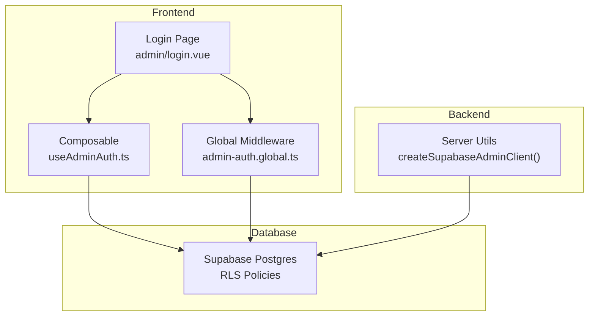
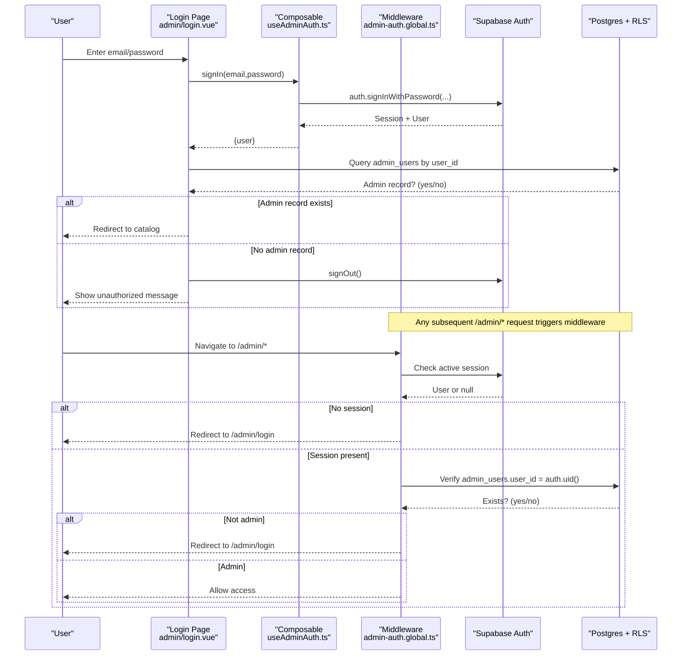
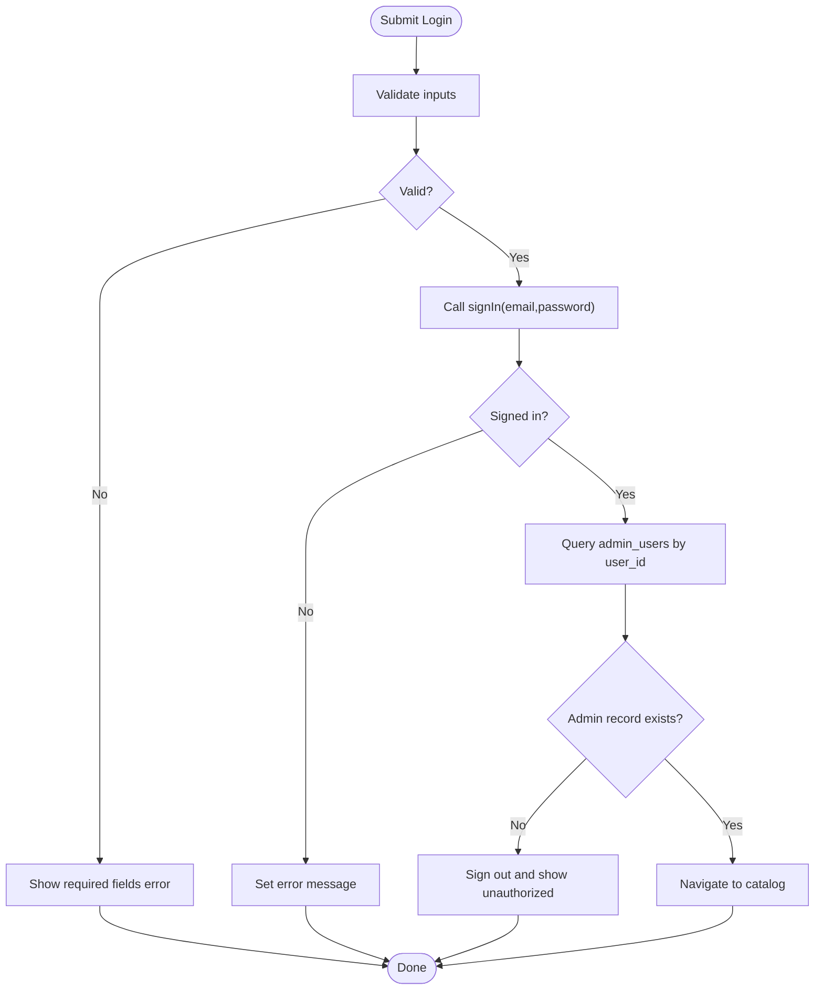
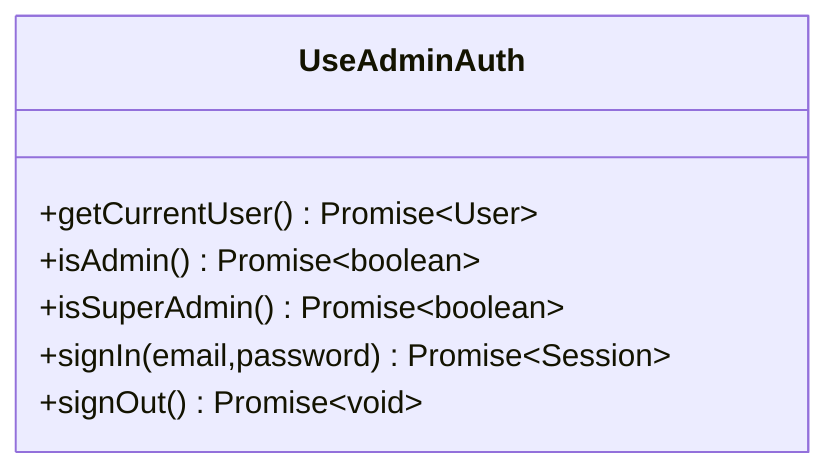
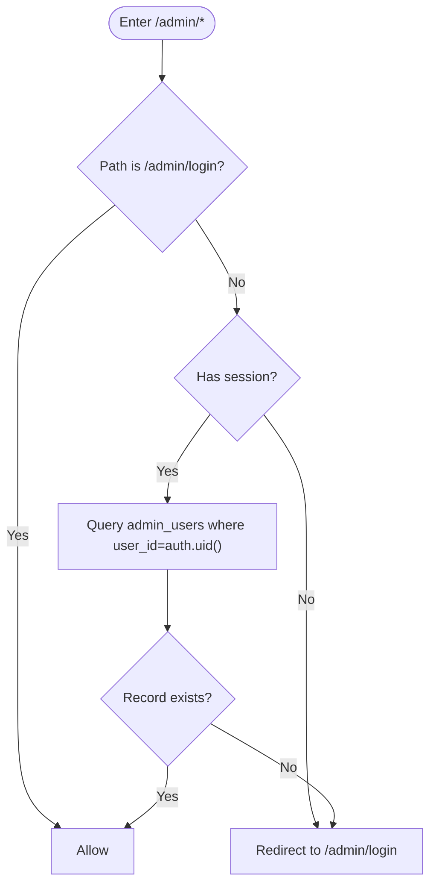
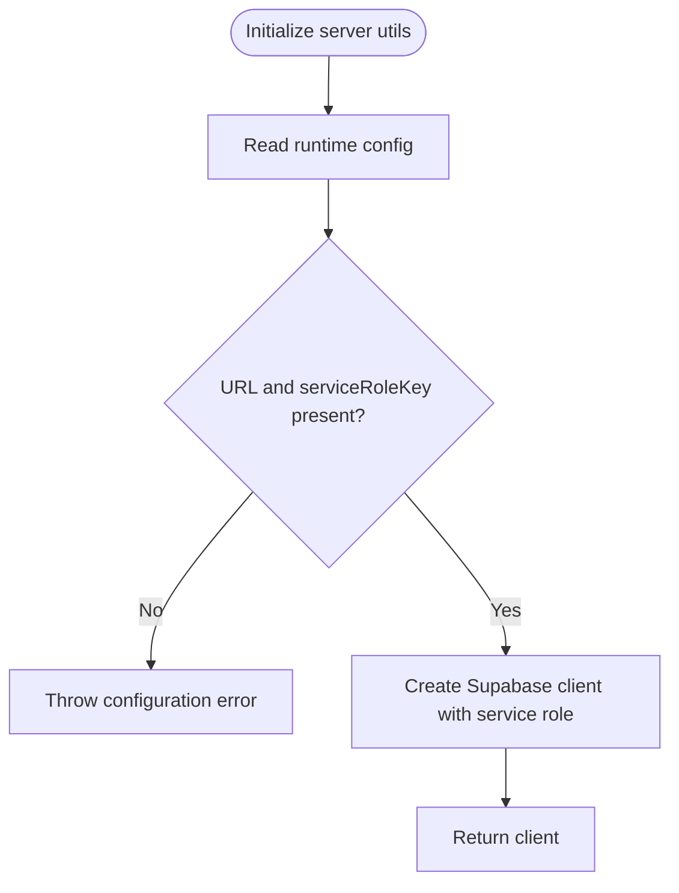
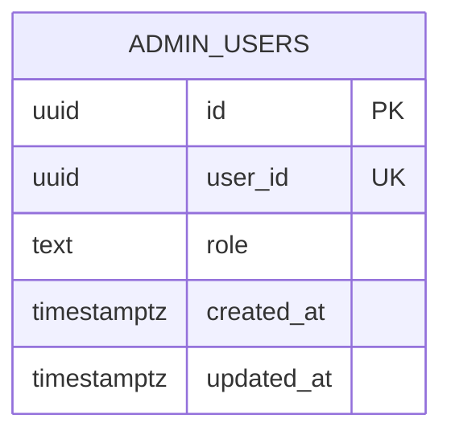
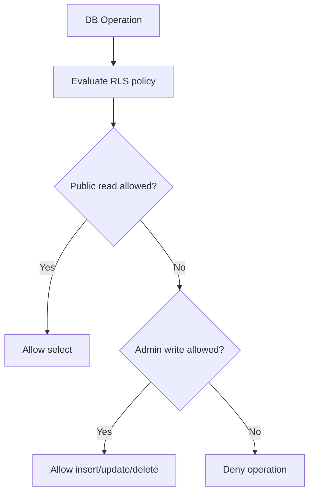
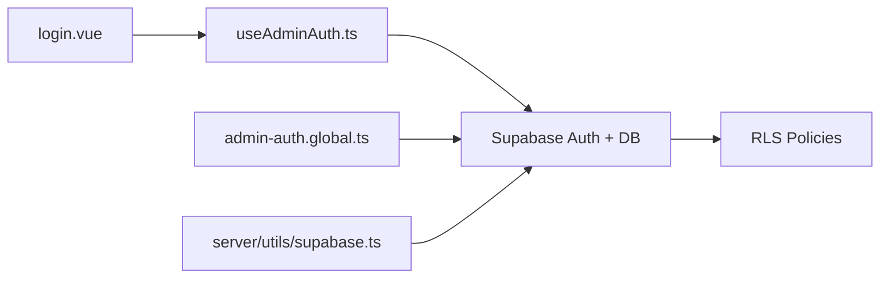

# Authentication & Security

<cite>
**Referenced Files in This Document**
- [useAdminAuth.ts](file://app/composables/useAdminAuth.ts)
- [admin-auth.global.ts](file://app/middleware/admin-auth.global.ts)
- [login.vue](file://app/pages/admin/login.vue)
- [supabase.ts](file://server/utils/supabase.ts)
- [20260922_000001_create_catalog_schema.sql](file://supabase/migrations/20260922_000001_create_catalog_schema.sql)
- [20260922000002_storage_and_rls.sql](file://supabase/migrations/20260922000002_storage_and_rls.sql)
- [20260922073136_remove_recursive_admin_users_policy.sql](file://supabase/migrations/20260922073136_remove_recursive_admin_users_policy.sql)
</cite>

## Table of Contents
1. [Introduction](#introduction)
2. [Project Structure](#project-structure)
3. [Core Components](#core-components)
4. [Architecture Overview](#architecture-overview)
5. [Detailed Component Analysis](#detailed-component-analysis)
6. [Dependency Analysis](#dependency-analysis)
7. [Performance Considerations](#performance-considerations)
8. [Troubleshooting Guide](#troubleshooting-guide)
9. [Conclusion](#conclusion)
10. [Appendices](#appendices)

## Introduction
This document explains the authentication and security system with a focus on role-based access control (RBAC) and secure admin functionality. It covers the end-to-end admin login flow, session management via Supabase Auth, route-level middleware that guards admin pages, and Row Level Security (RLS) policies that enforce data access at the database level. It also provides guidance for extending roles, implementing permission checks, securing API endpoints, and operational practices such as monitoring, logging, and audit trails.

## Project Structure
The authentication and authorization logic spans client-side composables, Nuxt middleware, server utilities, and Supabase RLS policies:
- Client-side composable encapsulates auth operations and role checks.
- Global middleware protects /admin routes.
- Admin login page orchestrates sign-in and admin verification.
- Server utility creates a service-role client for privileged backend operations.
- Supabase migrations define schema, indexes, and RLS policies.

**Diagram sources**
- [login.vue:1-121](file://app/pages/admin/login.vue#L1-L121)
- [useAdminAuth.ts:1-79](file://app/composables/useAdminAuth.ts#L1-L79)
- [admin-auth.global.ts:1-28](file://app/middleware/admin-auth.global.ts#L1-L28)
- [supabase.ts:1-20](file://server/utils/supabase.ts#L1-L20)
- [20260922000002_storage_and_rls.sql:1-205](file://supabase/migrations/20260922000002_storage_and_rls.sql#L1-L205)

**Section sources**
- [login.vue:1-121](file://app/pages/admin/login.vue#L1-L121)
- [useAdminAuth.ts:1-79](file://app/composables/useAdminAuth.ts#L1-L79)
- [admin-auth.global.ts:1-28](file://app/middleware/admin-auth.global.ts#L1-L28)
- [supabase.ts:1-20](file://server/utils/supabase.ts#L1-L20)
- [20260922_000001_create_catalog_schema.sql:61-67](file://supabase/migrations/20260922_000001_create_catalog_schema.sql#L61-L67)
- [20260922000002_storage_and_rls.sql:1-205](file://supabase/migrations/20260922000002_storage_and_rls.sql#L1-L205)

## Core Components
- Admin login page: Collects credentials, validates input, signs in via Supabase Auth, verifies admin membership, and redirects upon success or shows errors.
- Composable: Provides reusable functions to get current user, check admin/super-admin roles, sign in, and sign out.
- Global middleware: Guards /admin routes, enforces authenticated state, and validates admin membership before allowing navigation.
- Server utility: Creates a Supabase client with service role for privileged server-side operations without persisting sessions.
- Database schema and RLS: Defines admin_users table with roles and RLS policies that restrict read/write access based on authentication and role.

**Section sources**
- [login.vue:15-54](file://app/pages/admin/login.vue#L15-L54)
- [useAdminAuth.ts:7-79](file://app/composables/useAdminAuth.ts#L7-L79)
- [admin-auth.global.ts:1-28](file://app/middleware/admin-auth.global.ts#L1-L28)
- [supabase.ts:3-19](file://server/utils/supabase.ts#L3-L19)
- [20260922_000001_create_catalog_schema.sql:61-67](file://supabase/migrations/20260922_000001_create_catalog_schema.sql#L61-L67)
- [20260922000002_storage_and_rls.sql:40-160](file://supabase/migrations/20260922000002_storage_and_rls.sql#L40-L160)

## Architecture Overview
The admin authentication flow integrates frontend UI, Supabase Auth, and database-level policies:

**Diagram sources**
- [login.vue:15-54](file://app/pages/admin/login.vue#L15-L54)
- [useAdminAuth.ts:56-69](file://app/composables/useAdminAuth.ts#L56-L69)
- [admin-auth.global.ts:1-28](file://app/middleware/admin-auth.global.ts#L1-L28)
- [20260922000002_storage_and_rls.sql:40-61](file://supabase/migrations/20260922000002_storage_and_rls.sql#L40-L61)

## Detailed Component Analysis

### Admin Login Flow
- Input validation: Ensures both email and password are provided before submission.
- Sign-in: Uses Supabase Auth to establish a session.
- Admin verification: Queries admin_users to confirm the signed-in user has an admin record; if not, signs out and displays an error.
- Redirect: On success, navigates away from the login page.

**Diagram sources**
- [login.vue:15-54](file://app/pages/admin/login.vue#L15-L54)

**Section sources**
- [login.vue:15-54](file://app/pages/admin/login.vue#L15-L54)

### Role Checks and Session Management
- Current user retrieval: Attempts to fetch the latest user from Supabase Auth, falling back to the reactive user store.
- Admin check: Queries admin_users for the current user’s existence.
- Super-admin check: Reads the role field and compares to super_admin.
- Sign-in/sign-out: Wraps Supabase Auth calls and propagates errors.

**Diagram sources**
- [useAdminAuth.ts:7-79](file://app/composables/useAdminAuth.ts#L7-L79)

**Section sources**
- [useAdminAuth.ts:7-79](file://app/composables/useAdminAuth.ts#L7-L79)

### Route Guard Middleware
- Scope: Protects all /admin/* routes except /admin/login.
- Auth check: If no active session, redirects to /admin/login.
- Admin check: Verifies admin_users entry for the current user; denies access otherwise.

**Diagram sources**
- [admin-auth.global.ts:1-28](file://app/middleware/admin-auth.global.ts#L1-L28)

**Section sources**
- [admin-auth.global.ts:1-28](file://app/middleware/admin-auth.global.ts#L1-L28)

### Server-Side Privileged Operations
- Service-role client: Creates a Supabase client using the service role key, disabling session persistence and token refresh to avoid leaking privileges to the browser.
- Configuration: Requires environment variables for URL and service role key; throws if missing.

**Diagram sources**
- [supabase.ts:3-19](file://server/utils/supabase.ts#L3-L19)

**Section sources**
- [supabase.ts:3-19](file://server/utils/supabase.ts#L3-L19)

### Database Schema and Roles
- admin_users table: Stores the mapping between Supabase user IDs and roles, with constraints limiting roles to admin and super_admin.
- Indexes and triggers: Support performance and updated_at maintenance.

**Diagram sources**
- [20260922_000001_create_catalog_schema.sql:61-67](file://supabase/migrations/20260922_000001_create_catalog_schema.sql#L61-L67)

**Section sources**
- [20260922_000001_create_catalog_schema.sql:61-67](file://supabase/migrations/20260922_000001_create_catalog_schema.sql#L61-L67)

### Row Level Security (RLS) Policies
- Public read access: Categories, products, translations, and images are readable when active/published.
- Admin write access: Admin users can manage categories, translations, products, and images.
- Super-admin only: Managing admin_users is restricted to super_admin.
- Storage: Product images bucket allows public reads and admin writes/deletes.

**Diagram sources**
- [20260922000002_storage_and_rls.sql:1-205](file://supabase/migrations/20260922000002_storage_and_rls.sql#L1-L205)

**Section sources**
- [20260922000002_storage_and_rls.sql:1-205](file://supabase/migrations/20260922000002_storage_and_rls.sql#L1-L205)

## Dependency Analysis
- Frontend components depend on Supabase Auth and RLS-enforced tables.
- Middleware depends on Supabase client and admin_users table to validate permissions.
- Server utilities depend on environment configuration for secure service-role access.
- RLS policies enforce consistent security regardless of client code changes.

**Diagram sources**
- [login.vue:1-121](file://app/pages/admin/login.vue#L1-L121)
- [useAdminAuth.ts:1-79](file://app/composables/useAdminAuth.ts#L1-L79)
- [admin-auth.global.ts:1-28](file://app/middleware/admin-auth.global.ts#L1-L28)
- [supabase.ts:1-20](file://server/utils/supabase.ts#L1-L20)
- [20260922000002_storage_and_rls.sql:1-205](file://supabase/migrations/20260922000002_storage_and_rls.sql#L1-L205)

**Section sources**
- [login.vue:1-121](file://app/pages/admin/login.vue#L1-L121)
- [useAdminAuth.ts:1-79](file://app/composables/useAdminAuth.ts#L1-L79)
- [admin-auth.global.ts:1-28](file://app/middleware/admin-auth.global.ts#L1-L28)
- [supabase.ts:1-20](file://server/utils/supabase.ts#L1-L20)
- [20260922000002_storage_and_rls.sql:1-205](file://supabase/migrations/20260922000002_storage_and_rls.sql#L1-L205)

## Performance Considerations
- Minimize redundant queries: Cache user and role checks where appropriate to reduce repeated admin_users lookups.
- Leverage indexes: The schema includes useful indexes on frequently filtered columns (e.g., status, category_id).
- Prefer RLS over application-level filtering: Let the database enforce row visibility to avoid unnecessary data transfer.
- Avoid heavy work in middleware: Keep middleware checks lightweight to prevent navigation delays.

[No sources needed since this section provides general guidance]

## Troubleshooting Guide
Common issues and debugging steps:
- Cannot access /admin routes:
  - Ensure you are signed in and have an admin_users record for your user_id.
  - Check middleware logs for authorization lookup failures.
- Login succeeds but redirect fails:
  - Verify admin_users query returns a record after sign-in.
  - Confirm there are no RLS blocks preventing the query.
- Errors during sign-in:
  - Inspect error messages returned by Supabase Auth.
  - Validate email/password format and account status.
- Service-role client errors:
  - Ensure environment variables for Supabase URL and service role key are set.
  - Confirm the server-side client is used only in server contexts.

**Section sources**
- [admin-auth.global.ts:12-27](file://app/middleware/admin-auth.global.ts#L12-L27)
- [login.vue:32-54](file://app/pages/admin/login.vue#L32-L54)
- [supabase.ts:3-19](file://server/utils/supabase.ts#L3-L19)

## Conclusion
This system combines Supabase Auth, Nuxt middleware, and robust RLS policies to provide secure, role-based access to admin functionality. The login flow validates credentials and admin membership, while middleware ensures ongoing protection of admin routes. RLS policies enforce fine-grained data access at the database level, including storage restrictions for product images. Extending roles and permissions should be done by updating the admin_users table and corresponding RLS policies, with careful attention to least privilege and thorough testing.

[No sources needed since this section summarizes without analyzing specific files]

## Appendices

### Adding New User Roles
- Extend the role constraint in the admin_users table to include new roles.
- Update RLS policies to grant or restrict operations based on the new role.
- Add role checks in the composable and middleware as needed.

**Section sources**
- [20260922_000001_create_catalog_schema.sql:61-67](file://supabase/migrations/20260922_000001_create_catalog_schema.sql#L61-L67)
- [20260922000002_storage_and_rls.sql:135-153](file://supabase/migrations/20260922000002_storage_and_rls.sql#L135-L153)

### Implementing Permission Checks
- Use the composable’s role-check functions to gate UI actions.
- In middleware, extend path guards to enforce additional role requirements.
- For API endpoints, validate roles server-side and rely on RLS for data enforcement.

**Section sources**
- [useAdminAuth.ts:16-54](file://app/composables/useAdminAuth.ts#L16-L54)
- [admin-auth.global.ts:1-28](file://app/middleware/admin-auth.global.ts#L1-L28)

### Securing API Endpoints
- Use the server-side service-role client only for privileged operations; never expose it to the browser.
- Enforce authentication and authorization checks before processing requests.
- Apply RLS policies to ensure data access remains secure even if client code is bypassed.

**Section sources**
- [supabase.ts:3-19](file://server/utils/supabase.ts#L3-L19)
- [20260922000002_storage_and_rls.sql:1-205](file://supabase/migrations/20260922000002_storage_and_rls.sql#L1-L205)

### Security Best Practices
- Input validation: Validate all user inputs on the client and server; reject malformed or unexpected values.
- XSS prevention: Render user-generated content safely; avoid injecting raw HTML into templates.
- CSRF protection: Use Supabase Auth-managed sessions and avoid custom CSRF tokens unless necessary.
- Secure session handling: Rely on Supabase Auth for session lifecycle; do not store sensitive tokens in localStorage.

[No sources needed since this section provides general guidance]

### Security Monitoring, Logging, and Audit Trails
- Log authentication events (sign-in attempts, failures, and successful admin accesses) with minimal PII.
- Monitor failed login attempts and unusual access patterns.
- Maintain audit trails for administrative actions that modify critical data.

[No sources needed since this section provides general guidance]