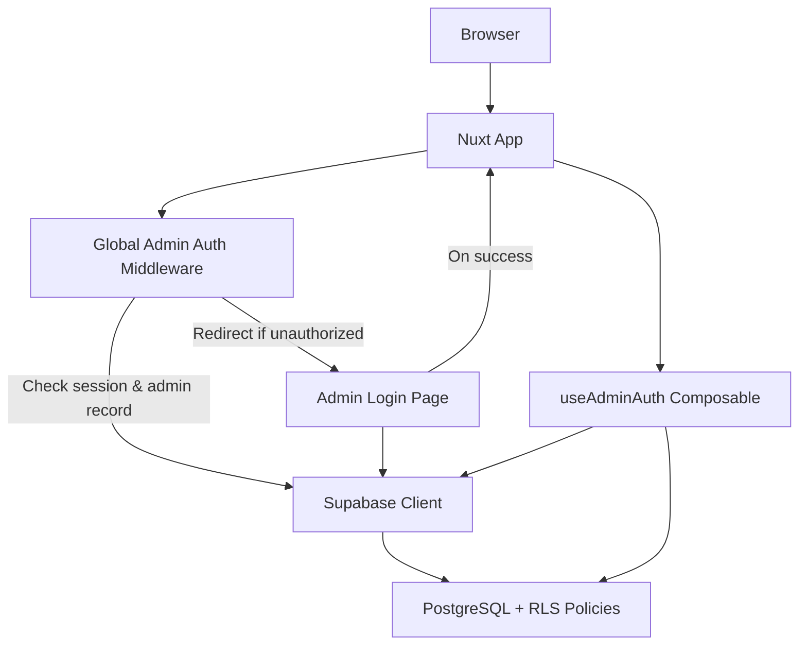
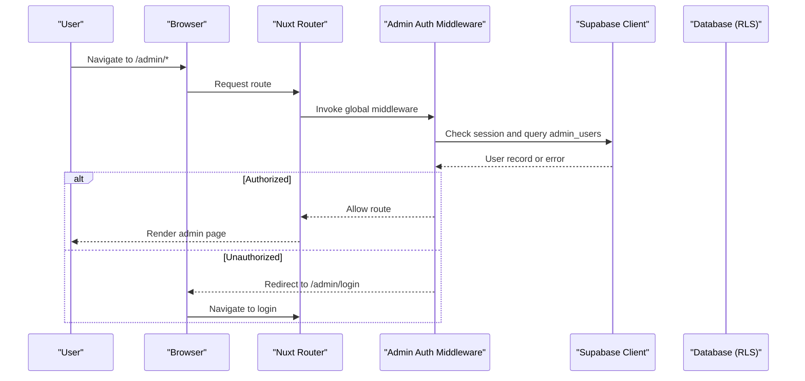
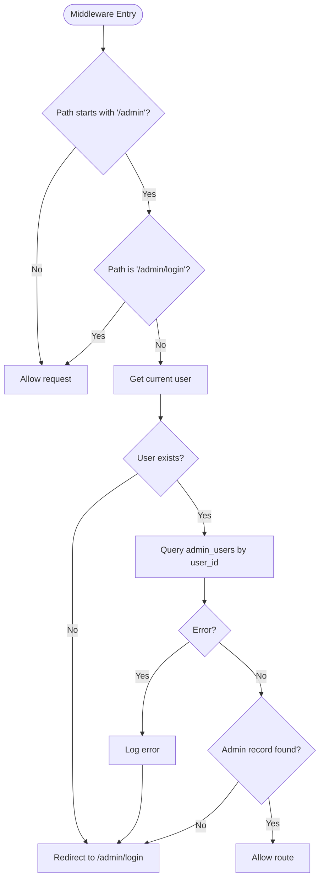
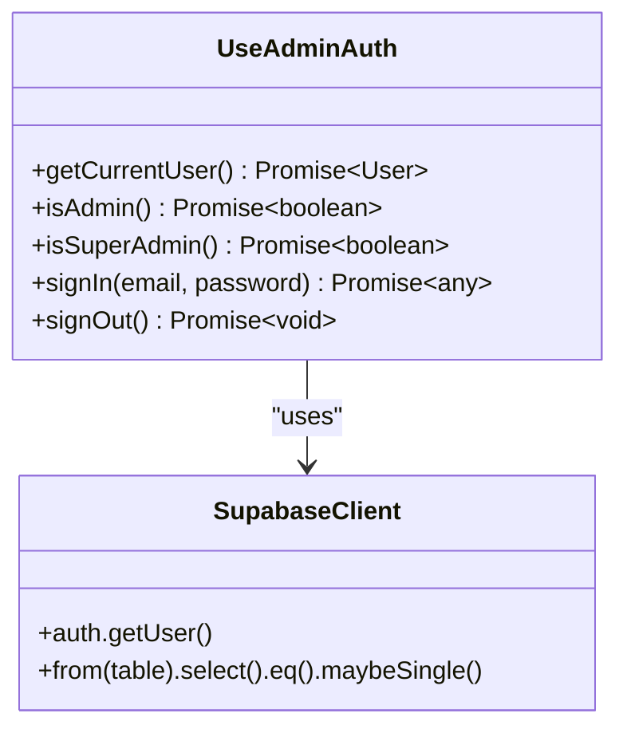
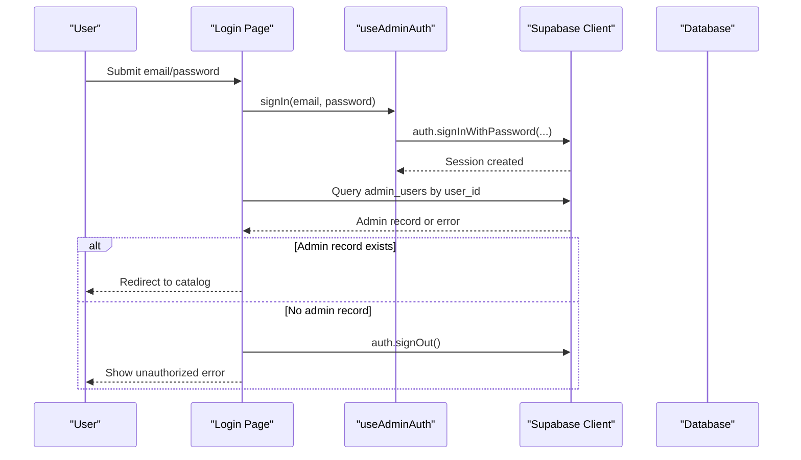
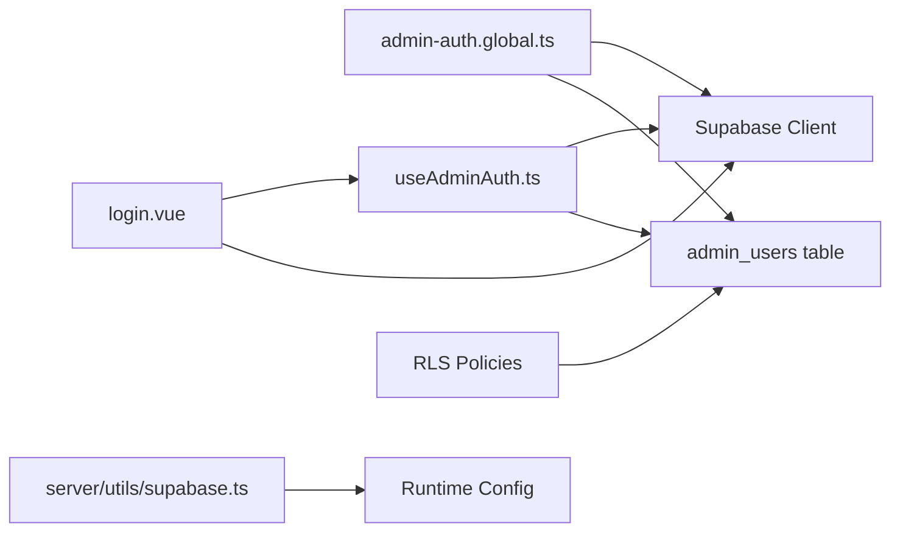

# Middleware Protection

<cite>
**Referenced Files in This Document**
- [admin-auth.global.ts](file://app/middleware/admin-auth.global.ts)
- [useAdminAuth.ts](file://app/composables/useAdminAuth.ts)
- [login.vue](file://app/pages/admin/login.vue)
- [supabase.ts](file://server/utils/supabase.ts)
- [nuxt.config.ts](file://nuxt.config.ts)
- [20260922_000001_create_catalog_schema.sql](file://supabase/migrations/20260922_000001_create_catalog_schema.sql)
- [20260922000002_storage_and_rls.sql](file://supabase/migrations/20260922000002_storage_and_rls.sql)
</cite>

## Table of Contents
1. [Introduction](#introduction)
2. [Project Structure](#project-structure)
3. [Core Components](#core-components)
4. [Architecture Overview](#architecture-overview)
5. [Detailed Component Analysis](#detailed-component-analysis)
6. [Dependency Analysis](#dependency-analysis)
7. [Performance Considerations](#performance-considerations)
8. [Troubleshooting Guide](#troubleshooting-guide)
9. [Conclusion](#conclusion)
10. [Appendices](#appendices)

## Introduction
This document explains the middleware protection system that guards admin routes and enforces authorization checks. It covers how the global admin-auth middleware intercepts requests to protected routes, validates user identity and permissions, and redirects unauthorized users. It also provides guidance for creating custom middleware, implementing role-based access control, adding audit logging, understanding execution order, optimizing performance, debugging issues, and extending the system for new authorization patterns or external authentication services.

## Project Structure
The middleware protection spans client-side routing, composables for auth logic, a login page, server utilities for privileged operations, configuration, and database policies:

- Global route middleware guards /admin/* routes and verifies admin status.
- A composable centralizes admin checks (admin vs super admin), sign-in/sign-out, and current user retrieval.
- The admin login page authenticates users and ensures they have an admin record before redirecting.
- Server utility creates a service-role Supabase client for privileged backend operations.
- Nuxt configuration sets up Supabase integration and runtime config values.
- Database migrations define the admin_users table and Row-Level Security policies that enforce data-level authorization.

**Diagram sources**
- [admin-auth.global.ts:1-28](file://app/middleware/admin-auth.global.ts#L1-L28)
- [useAdminAuth.ts:1-79](file://app/composables/useAdminAuth.ts#L1-L79)
- [login.vue:1-121](file://app/pages/admin/login.vue#L1-L121)
- [supabase.ts:1-20](file://server/utils/supabase.ts#L1-L20)
- [20260922000002_storage_and_rls.sql:40-160](file://supabase/migrations/20260922000002_storage_and_rls.sql#L40-L160)

**Section sources**
- [admin-auth.global.ts:1-28](file://app/middleware/admin-auth.global.ts#L1-L28)
- [useAdminAuth.ts:1-79](file://app/composables/useAdminAuth.ts#L1-L79)
- [login.vue:1-121](file://app/pages/admin/login.vue#L1-L121)
- [supabase.ts:1-20](file://server/utils/supabase.ts#L1-L20)
- [nuxt.config.ts:1-52](file://nuxt.config.ts#L1-L52)
- [20260922_000001_create_catalog_schema.sql:61-67](file://supabase/migrations/20260922_000001_create_catalog_schema.sql#L61-L67)
- [20260922000002_storage_and_rls.sql:40-160](file://supabase/migrations/20260922000002_storage_and_rls.sql#L40-L160)

## Core Components
- Global admin-auth middleware: Intercepts navigation to /admin/*, skips /admin/login, checks for a logged-in user, verifies admin presence in the database, and redirects unauthorized users back to login.
- useAdminAuth composable: Provides getCurrentUser, isAdmin, isSuperAdmin, signIn, and signOut helpers used by pages and other composables.
- Admin login page: Handles email/password sign-in, validates admin record existence, and redirects on success or shows errors.
- Server-side Supabase client: Creates a service-role client for privileged operations when needed.
- Configuration: Nuxt config wires Supabase module, runtime config, and cookie options.
- Database schema and policies: Defines admin_users table and RLS policies that restrict data access based on roles.

**Section sources**
- [admin-auth.global.ts:1-28](file://app/middleware/admin-auth.global.ts#L1-L28)
- [useAdminAuth.ts:1-79](file://app/composables/useAdminAuth.ts#L1-L79)
- [login.vue:1-121](file://app/pages/admin/login.vue#L1-L121)
- [supabase.ts:1-20](file://server/utils/supabase.ts#L1-L20)
- [nuxt.config.ts:1-52](file://nuxt.config.ts#L1-L52)
- [20260922_000001_create_catalog_schema.sql:61-67](file://supabase/migrations/20260922_000001_create_catalog_schema.sql#L61-L67)
- [20260922000002_storage_and_rls.sql:40-160](file://supabase/migrations/20260922000002_storage_and_rls.sql#L40-L160)

## Architecture Overview
The protection flow combines client-side middleware with server-side Row-Level Security:

- Route entry triggers the global middleware for /admin/* paths.
- Middleware checks the current session and queries admin_users to confirm admin status.
- If not authorized, the user is redirected to /admin/login.
- On successful login, the login page verifies admin record and navigates away.
- Data access is further enforced by RLS policies that require admin_users membership for write operations and restrict reads accordingly.

**Diagram sources**
- [admin-auth.global.ts:1-28](file://app/middleware/admin-auth.global.ts#L1-L28)
- [20260922000002_storage_and_rls.sql:40-160](file://supabase/migrations/20260922000002_storage_and_rls.sql#L40-L160)

## Detailed Component Analysis

### Global Admin-Auth Middleware
Responsibilities:
- Route matching: Guards /admin/* except /admin/login.
- Session validation: Ensures a user session exists.
- Permission verification: Queries admin_users to verify the user has an admin record.
- Redirect handling: Redirects unauthorized users to /admin/login.

Key behaviors:
- Skips non-admin routes and the login page.
- Uses the Supabase client to check admin presence.
- Logs authorization lookup failures and redirects on error or missing admin record.

**Diagram sources**
- [admin-auth.global.ts:1-28](file://app/middleware/admin-auth.global.ts#L1-L28)

**Section sources**
- [admin-auth.global.ts:1-28](file://app/middleware/admin-auth.global.ts#L1-L28)

### useAdminAuth Composable
Responsibilities:
- getCurrentUser: Retrieves the authenticated user from Supabase or local state.
- isAdmin: Checks if the current user has an admin record.
- isSuperAdmin: Checks if the current user’s role is super_admin.
- signIn/signOut: Wraps Supabase auth methods.

Usage:
- Pages and components can call isAdmin/isSuperAdmin to gate UI features or actions.
- Login page uses signIn and then verifies admin record before redirecting.

**Diagram sources**
- [useAdminAuth.ts:1-79](file://app/composables/useAdminAuth.ts#L1-L79)

**Section sources**
- [useAdminAuth.ts:1-79](file://app/composables/useAdminAuth.ts#L1-L79)

### Admin Login Page
Responsibilities:
- Collects email and password.
- Calls signIn via useAdminAuth.
- Verifies admin record exists; signs out and shows error if not.
- Redirects to catalog home on success.

Flow:
- Validates inputs.
- Attempts sign-in.
- Checks admin record.
- Handles errors and redirects.

**Diagram sources**
- [login.vue:1-121](file://app/pages/admin/login.vue#L1-L121)
- [useAdminAuth.ts:56-64](file://app/composables/useAdminAuth.ts#L56-L64)

**Section sources**
- [login.vue:1-121](file://app/pages/admin/login.vue#L1-L121)
- [useAdminAuth.ts:56-64](file://app/composables/useAdminAuth.ts#L56-L64)

### Server-Side Supabase Client
Purpose:
- Creates a service-role client for privileged operations where necessary.
- Requires both public URL and service role key; throws if missing.

Use cases:
- Backend tasks or server endpoints that need to bypass RLS or perform administrative operations.

**Section sources**
- [supabase.ts:1-20](file://server/utils/supabase.ts#L1-L20)

### Configuration and Environment
- Nuxt config enables Supabase module and sets runtime config for public and secret keys.
- Cookie options are configured for admin auth persistence.
- i18n and UI modules are enabled.

**Section sources**
- [nuxt.config.ts:1-52](file://nuxt.config.ts#L1-L52)

### Database Schema and Policies
- admin_users table stores user_id and role (admin or super_admin).
- RLS policies:
  - Users can read their own admin record.
  - Admins can manage categories, translations, products, images.
  - Only super_admins can manage admin_users.
  - Storage policies allow public read of product images and admin-only upload/update/delete.

These policies provide a second layer of authorization enforcement at the data level.

**Section sources**
- [20260922_000001_create_catalog_schema.sql:61-67](file://supabase/migrations/20260922_000001_create_catalog_schema.sql#L61-L67)
- [20260922000002_storage_and_rls.sql:40-160](file://supabase/migrations/20260922000002_storage_and_rls.sql#L40-L160)
- [20260922000002_storage_and_rls.sql:162-205](file://supabase/migrations/20260922000002_storage_and_rls.sql#L162-L205)

## Dependency Analysis
- Middleware depends on Supabase client and admin_users table.
- Composable depends on Supabase auth and admin_users table.
- Login page depends on composable and Supabase client.
- Server utility depends on runtime config for service role key and URL.
- Policies depend on admin_users table and auth context.

**Diagram sources**
- [admin-auth.global.ts:1-28](file://app/middleware/admin-auth.global.ts#L1-L28)
- [useAdminAuth.ts:1-79](file://app/composables/useAdminAuth.ts#L1-L79)
- [login.vue:1-121](file://app/pages/admin/login.vue#L1-L121)
- [supabase.ts:1-20](file://server/utils/supabase.ts#L1-L20)
- [20260922000002_storage_and_rls.sql:40-160](file://supabase/migrations/20260922000002_storage_and_rls.sql#L40-L160)

**Section sources**
- [admin-auth.global.ts:1-28](file://app/middleware/admin-auth.global.ts#L1-L28)
- [useAdminAuth.ts:1-79](file://app/composables/useAdminAuth.ts#L1-L79)
- [login.vue:1-121](file://app/pages/admin/login.vue#L1-L121)
- [supabase.ts:1-20](file://server/utils/supabase.ts#L1-L20)
- [20260922000002_storage_and_rls.sql:40-160](file://supabase/migrations/20260922000002_storage_and_rls.sql#L40-L160)

## Performance Considerations
- Minimize redundant queries: Cache user and admin status in component state or a lightweight store to avoid repeated lookups during rapid navigation.
- Prefer selective selects: Only fetch required fields (e.g., id or role) to reduce payload size.
- Defer heavy checks: Perform expensive permission checks after initial render if possible, using lazy loading.
- Avoid blocking redirects: Ensure redirects are fast and only occur when necessary.
- Leverage RLS: Let database policies handle fine-grained access control to reduce application-layer checks.

[No sources needed since this section provides general guidance]

## Troubleshooting Guide
Common issues and resolutions:
- Missing session: Ensure Supabase module is configured and cookies are enabled; verify runtime config values are set.
- Admin record not found: Confirm the user has an entry in admin_users; check RLS policies for read access.
- Authorization lookup errors: Review console logs for Supabase errors; validate network connectivity and API keys.
- Redirect loops: Verify middleware path conditions and ensure login page is excluded from guard.
- Service role key missing: Ensure SUPABASE_SERVICE_ROLE_KEY is set for server utilities.

Debugging techniques:
- Add temporary logs around middleware decisions and Supabase calls.
- Inspect browser cookies for the configured auth cookie name.
- Validate environment variables in runtime config.
- Test RLS policies directly in Supabase Studio or via SQL.

**Section sources**
- [admin-auth.global.ts:12-26](file://app/middleware/admin-auth.global.ts#L12-L26)
- [useAdminAuth.ts:16-54](file://app/composables/useAdminAuth.ts#L16-L54)
- [login.vue:32-46](file://app/pages/admin/login.vue#L32-L46)
- [supabase.ts:3-11](file://server/utils/supabase.ts#L3-L11)
- [nuxt.config.ts:9-25](file://nuxt.config.ts#L9-L25)

## Conclusion
The middleware protection system combines client-side route guards with server-side Row-Level Security to enforce robust authorization for admin routes. The global middleware ensures only authenticated admins can access protected areas, while RLS policies secure data at the database level. By following the guidelines for customization, performance, and debugging, you can extend the system to support additional roles, audit logging, and external authentication providers.

[No sources needed since this section summarizes without analyzing specific files]

## Appendices

### Creating Custom Middleware for Route Protection
Steps:
- Create a new middleware file under app/middleware.
- Implement route matching logic to target specific paths or patterns.
- Insert permission checks using useAdminAuth or direct Supabase calls.
- Redirect unauthorized users to appropriate pages.
- Register or rely on Nuxt’s automatic discovery for global or named middleware.

Best practices:
- Keep middleware focused and fast.
- Avoid heavy computations inside middleware.
- Centralize common checks in composables.

[No sources needed since this section provides general guidance]

### Implementing Role-Based Access Control (RBAC)
Approach:
- Use isSuperAdmin for sensitive actions requiring elevated privileges.
- Extend admin_users with additional roles if needed and update policies accordingly.
- Gate UI elements and actions based on role checks in components.

Data-level enforcement:
- Update RLS policies to reflect new roles and constraints.

[No sources needed since this section provides general guidance]

### Adding Audit Logging
Recommendations:
- Log critical events such as login attempts, admin actions, and policy violations.
- Store logs in a dedicated table or external logging service.
- Include contextual information like user ID, timestamp, action, and outcome.
- Ensure logs do not expose sensitive data.

[No sources needed since this section provides general guidance]

### Middleware Execution Order
Guidelines:
- Global middleware runs before route-specific middleware.
- Place broad guards early to minimize unnecessary processing.
- Use named middleware selectively for fine-grained control.
- Be mindful of async operations; ensure proper await handling to prevent race conditions.

[No sources needed since this section provides general guidance]

### Integrating with External Authentication Services
Options:
- Replace Supabase auth with an external provider via Nuxt modules or custom plugins.
- Map external identities to local admin_users records.
- Update middleware and composables to use the new auth context.
- Adjust RLS policies to reference the new user identifier if necessary.

[No sources needed since this section provides general guidance]