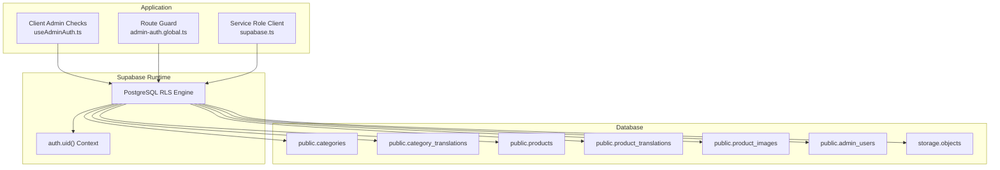
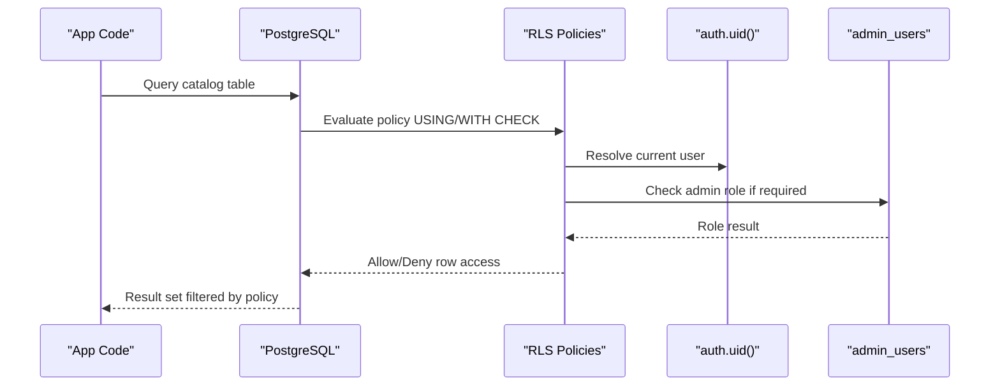
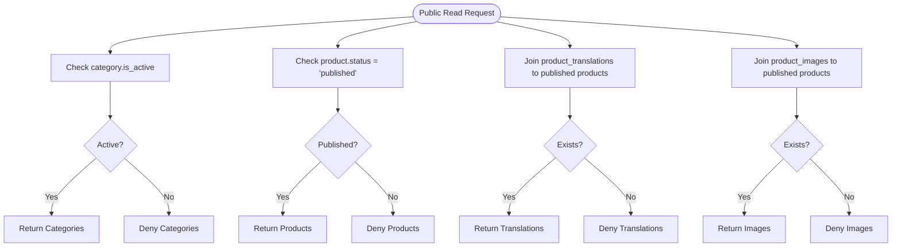
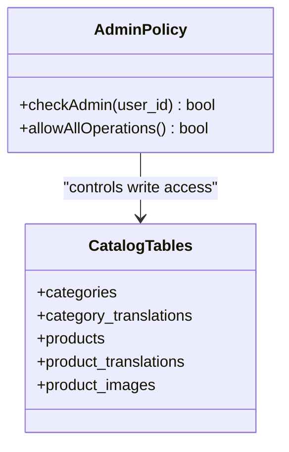
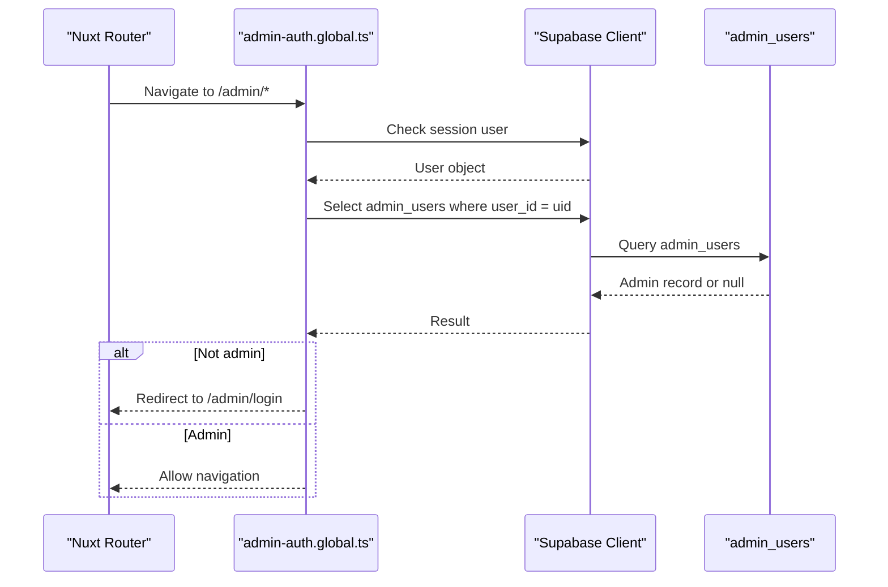
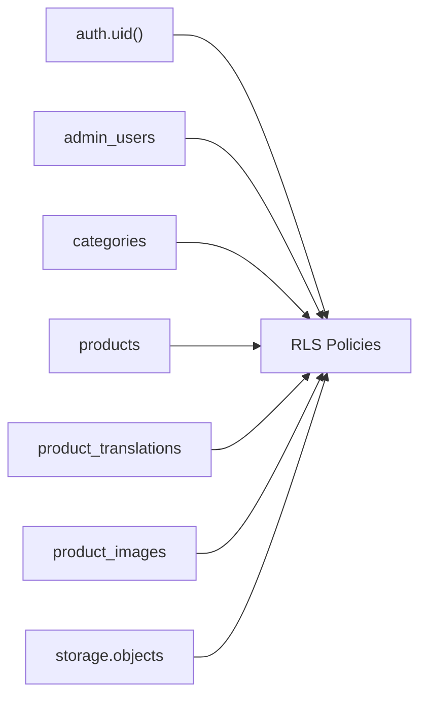

# Row Level Security Policies

<cite>
**Referenced Files in This Document**
- [20260922_000001_create_catalog_schema.sql](file://supabase/migrations/20260922_000001_create_catalog_schema.sql)
- [20260922000002_storage_and_rls.sql](file://supabase/migrations/20260922000002_storage_and_rls.sql)
- [20260922073136_remove_recursive_admin_users_policy.sql](file://supabase/migrations/20260922073136_remove_recursive_admin_users_policy.sql)
- [security-rls-basics.md](file://.agents/skills/supabase-postgres-best-practices/references/security-rls-basics.md)
- [security-rls-performance.md](file://.agents/skills/supabase-postgres-best-practices/references/security-rls-performance.md)
- [useAdminAuth.ts](file://app/composables/useAdminAuth.ts)
- [admin-auth.global.ts](file://app/middleware/admin-auth.global.ts)
- [supabase.ts](file://server/utils/supabase.ts)
</cite>

## Table of Contents
1. [Introduction](#introduction)
2. [Project Structure](#project-structure)
3. [Core Components](#core-components)
4. [Architecture Overview](#architecture-overview)
5. [Detailed Component Analysis](#detailed-component-analysis)
6. [Dependency Analysis](#dependency-analysis)
7. [Performance Considerations](#performance-considerations)
8. [Troubleshooting Guide](#troubleshooting-guide)
9. [Conclusion](#conclusion)
10. [Appendices](#appendices)

## Introduction
This document explains how Row Level Security (RLS) policies enforce data access restrictions at the database level for the catalog schema. It covers how PostgreSQL and Supabase use RLS to control which rows users can read, insert, update, or delete based on roles and permissions. It documents the specific policies implemented for public read access, admin-only operations, user isolation, and storage bucket access. It also provides guidance for writing custom policies, testing policy effectiveness, debugging access issues, optimizing performance, designing secure policies, migrating security rules, and troubleshooting common problems such as policy conflicts, performance bottlenecks, and access denial.

## Project Structure
The RLS implementation is primarily defined in database migrations under `supabase/migrations`. The application layer includes client-side admin checks and a server-side service role client used by backend code.

**Diagram sources**
- [20260922000002_storage_and_rls.sql:1-205](file://supabase/migrations/20260922000002_storage_and_rls.sql#L1-L205)
- [useAdminAuth.ts:1-79](file://app/composables/useAdminAuth.ts#L1-L79)
- [admin-auth.global.ts:1-28](file://app/middleware/admin-auth.global.ts#L1-L28)
- [supabase.ts:1-20](file://server/utils/supabase.ts#L1-L20)

**Section sources**
- [20260922_000001_create_catalog_schema.sql:1-113](file://supabase/migrations/20260922_000001_create_catalog_schema.sql#L1-L113)
- [20260922000002_storage_and_rls.sql:1-205](file://supabase/migrations/20260922000002_storage_and_rls.sql#L1-L205)
- [useAdminAuth.ts:1-79](file://app/composables/useAdminAuth.ts#L1-L79)
- [admin-auth.global.ts:1-28](file://app/middleware/admin-auth.global.ts#L1-L28)
- [supabase.ts:1-20](file://server/utils/supabase.ts#L1-L20)

## Core Components
- Catalog tables: categories, category_translations, products, product_translations, product_images, admin_users.
- RLS policies:
  - Public read access for active categories, published products, and their related translations/images.
  - Admin-only write access across catalog tables.
  - User isolation for reading own admin record.
  - Super-admin-only management of admin_users.
  - Storage bucket policies for product images.
- Application helpers:
  - Client-side admin checks via Supabase client.
  - Route guard enforcing admin access for `/admin/*` routes.
  - Service role client for privileged server-side operations.

**Section sources**
- [20260922_000001_create_catalog_schema.sql:3-67](file://supabase/migrations/20260922_000001_create_catalog_schema.sql#L3-L67)
- [20260922000002_storage_and_rls.sql:1-205](file://supabase/migrations/20260922000002_storage_and_rls.sql#L1-L205)
- [useAdminAuth.ts:16-54](file://app/composables/useAdminAuth.ts#L16-L54)
- [admin-auth.global.ts:1-28](file://app/middleware/admin-auth.global.ts#L1-L28)
- [supabase.ts:3-19](file://server/utils/supabase.ts#L3-L19)

## Architecture Overview
RLS policies are evaluated by PostgreSQL when queries touch protected tables. In Supabase, `auth.uid()` provides the current authenticated user ID. Policies combine simple predicates with existence checks against `admin_users` to determine whether a request is allowed.

**Diagram sources**
- [20260922000002_storage_and_rls.sql:1-160](file://supabase/migrations/20260922000002_storage_and_rls.sql#L1-L160)
- [20260922_000001_create_catalog_schema.sql:61-67](file://supabase/migrations/20260922_000001_create_catalog_schema.sql#L61-L67)

## Detailed Component Analysis

### Catalog Schema Tables
The catalog schema defines core entities and supporting indexes. These tables are protected by RLS policies that govern visibility and mutability.

Key tables:
- `categories`: Product categories with slug, sort order, and activation flag.
- `category_translations`: Localized names per category.
- `products`: Product records with SKU, price, stock, status, and feature flags.
- `product_translations`: Localized product metadata and specifications.
- `product_images`: Image references tied to products.
- `admin_users`: Maps Supabase auth users to admin roles.

Indexes support efficient filtering by category, status, locale, and image associations.

**Section sources**
- [20260922_000001_create_catalog_schema.sql:3-74](file://supabase/migrations/20260922_000001_create_catalog_schema.sql#L3-L74)

### Public Read Access Policies
Public clients can read:
- Active categories.
- Published products.
- Translations and images associated with published products.

These policies ensure unauthenticated or anonymous users only see safe, public content.

**Diagram sources**
- [20260922000002_storage_and_rls.sql:1-38](file://supabase/migrations/20260922000002_storage_and_rls.sql#L1-L38)

**Section sources**
- [20260922000002_storage_and_rls.sql:1-38](file://supabase/migrations/20260922000002_storage_and_rls.sql#L1-L38)

### Admin-Only Operations
Authenticated admins can manage:
- Categories and category translations.
- Products, product translations, and product images.

Admin identity is determined by checking `admin_users.user_id = auth.uid()`.

**Diagram sources**
- [20260922000002_storage_and_rls.sql:45-133](file://supabase/migrations/20260922000002_storage_and_rls.sql#L45-L133)
- [20260922_000001_create_catalog_schema.sql:61-67](file://supabase/migrations/20260922_000001_create_catalog_schema.sql#L61-L67)

**Section sources**
- [20260922000002_storage_and_rls.sql:45-133](file://supabase/migrations/20260922000002_storage_and_rls.sql#L45-L133)

### User Isolation for Admin Records
Users can read only their own admin record using `user_id = auth.uid()`. This prevents other users from viewing admin metadata.

**Section sources**
- [20260922000002_storage_and_rls.sql:40-43](file://supabase/migrations/20260922000002_storage_and_rls.sql#L40-L43)

### Super-Admin Management of Admin Users
Super admins can manage entries in `admin_users`. The policy requires `role = 'super_admin'`.

Note: There is a migration that drops the “Admins can manage admin users” policy. Ensure your environment reflects the intended state after applying migrations.

**Section sources**
- [20260922000002_storage_and_rls.sql:135-153](file://supabase/migrations/20260922000002_storage_and_rls.sql#L135-L153)
- [20260922073136_remove_recursive_admin_users_policy.sql:1-2](file://supabase/migrations/20260922073136_remove_recursive_admin_users_policy.sql#L1-L2)

### Storage Bucket Policies for Product Images
RLS policies on `storage.objects` allow:
- Public SELECT for the `product-images` bucket.
- Admin INSERT, UPDATE, DELETE for the same bucket.

This ensures only authorized users can upload or modify product images while allowing public reads.

**Section sources**
- [20260922000002_storage_and_rls.sql:162-205](file://supabase/migrations/20260922000002_storage_and_rls.sql#L162-L205)

### Application-Level Admin Guards
The frontend uses Supabase client calls to check admin status and route guards to protect admin pages. While these improve UX, they do not replace database-level RLS.

- `useAdminAuth.ts`: Provides helper functions to check admin and super-admin roles via `admin_users`.
- `admin-auth.global.ts`: Redirects non-admin users away from `/admin/*` routes.
- `supabase.ts`: Creates a service role client for privileged server operations.

**Diagram sources**
- [admin-auth.global.ts:1-28](file://app/middleware/admin-auth.global.ts#L1-L28)
- [useAdminAuth.ts:16-54](file://app/composables/useAdminAuth.ts#L16-L54)

**Section sources**
- [useAdminAuth.ts:1-79](file://app/composables/useAdminAuth.ts#L1-L79)
- [admin-auth.global.ts:1-28](file://app/middleware/admin-auth.global.ts#L1-L28)
- [supabase.ts:1-20](file://server/utils/supabase.ts#L1-L20)

## Dependency Analysis
RLS policies depend on:
- `auth.uid()` for current user context.
- `admin_users` table for role checks.
- Catalog tables for data scoping.
- Storage bucket configuration for media access.

**Diagram sources**
- [20260922000002_storage_and_rls.sql:1-205](file://supabase/migrations/20260922000002_storage_and_rls.sql#L1-L205)
- [20260922_000001_create_catalog_schema.sql:3-67](file://supabase/migrations/20260922_000001_create_catalog_schema.sql#L3-L67)

**Section sources**
- [20260922000002_storage_and_rls.sql:1-205](file://supabase/migrations/20260922000002_storage_and_rls.sql#L1-L205)
- [20260922_000001_create_catalog_schema.sql:3-67](file://supabase/migrations/20260922_000001_create_catalog_schema.sql#L3-L67)

## Performance Considerations
- Avoid calling functions like `auth.uid()` directly in per-row conditions without wrapping them in a subquery; this can cause repeated function invocations.
- Prefer indexed columns in policy predicates to enable efficient filtering.
- Use `SECURITY DEFINER` functions cautiously; they bypass RLS and should include explicit `auth.uid()` checks and be restricted to internal schemas.
- Add indexes on columns frequently used in RLS predicates (e.g., `user_id`, `status`, `locale`).

Best practices reference:
- Enable RLS and force it even for table owners when appropriate.
- Wrap identity functions in subqueries to reduce overhead.
- Keep helper functions secure and revoke unnecessary execution privileges.

**Section sources**
- [security-rls-basics.md:8-50](file://.agents/skills/supabase-postgres-best-practices/references/security-rls-basics.md#L8-L50)
- [security-rls-performance.md:8-63](file://.agents/skills/supabase-postgres-best-practices/references/security-rls-performance.md#L8-L63)

## Troubleshooting Guide

Common RLS issues and resolutions:

- Policy conflicts:
  - Multiple policies may apply; ensure they are mutually exclusive or ordered intentionally.
  - Remove or adjust conflicting policies during migrations.

- Performance bottlenecks:
  - Replace per-row function calls with cached subqueries.
  - Add indexes on predicate columns.
  - Profile queries with explain plans to identify slow policy evaluations.

- Access denial problems:
  - Verify `auth.uid()` resolves correctly for the session.
  - Confirm the user exists in `admin_users` when admin access is required.
  - Check storage bucket policies if uploads or deletions fail.

- Migration pitfalls:
  - Dropping policies can remove previously granted access; validate after applying migrations.
  - Ensure RLS is enabled on all relevant tables.

Operational tips:
- Test policies using both authenticated and anonymous sessions.
- Validate admin flows through both UI guards and direct database queries.
- Use the service role client only for trusted server-side tasks.

**Section sources**
- [20260922073136_remove_recursive_admin_users_policy.sql:1-2](file://supabase/migrations/20260922073136_remove_recursive_admin_users_policy.sql#L1-L2)
- [20260922000002_storage_and_rls.sql:155-160](file://supabase/migrations/20260922000002_storage_and_rls.sql#L155-L160)
- [security-rls-performance.md:10-63](file://.agents/skills/supabase-postgres-best-practices/references/security-rls-performance.md#L10-L63)

## Conclusion
The catalog schema enforces robust access control through RLS policies that provide public read access, admin-only write access, user isolation, and storage bucket controls. Combined with application-level guards and a service role client, this design balances usability and security. Following best practices for policy design, indexing, and migration management will help maintain performance and reliability while preventing data leaks.

## Appendices

### Writing Custom RLS Policies
- Define clear intent: public read vs. admin write vs. user isolation.
- Use `USING` for read filters and `WITH CHECK` for write validations.
- Reference `auth.uid()` and role tables to determine access.
- Keep policies simple and index-friendly.

Example patterns:
- Public read: filter by status or activation flags.
- Admin write: require existence in `admin_users`.
- User isolation: match `user_id` to `auth.uid()`.

**Section sources**
- [20260922000002_storage_and_rls.sql:1-160](file://supabase/migrations/20260922000002_storage_and_rls.sql#L1-L160)
- [security-rls-basics.md:22-48](file://.agents/skills/supabase-postgres-best-practices/references/security-rls-basics.md#L22-L48)

### Testing Policy Effectiveness
- Test with anonymous sessions to confirm public read constraints.
- Test with authenticated non-admin users to verify isolation.
- Test with admin users to validate write capabilities.
- Validate storage bucket policies for uploads and deletions.

**Section sources**
- [20260922000002_storage_and_rls.sql:1-205](file://supabase/migrations/20260922000002_storage_and_rls.sql#L1-L205)

### Debugging Access Control Issues
- Inspect `auth.uid()` resolution in the current session.
- Check `admin_users` membership for admin-required operations.
- Review policy definitions for unintended overlaps.
- Use explain plans to detect inefficient policy predicates.

**Section sources**
- [security-rls-performance.md:10-63](file://.agents/skills/supabase-postgres-best-practices/references/security-rls-performance.md#L10-L63)

### Migration Strategies for Updating Security Rules
- Drop or alter conflicting policies explicitly.
- Enable RLS on new tables before creating policies.
- Validate changes in staging environments.
- Document policy intent and dependencies.

**Section sources**
- [20260922073136_remove_recursive_admin_users_policy.sql:1-2](file://supabase/migrations/20260922073136_remove_recursive_admin_users_policy.sql#L1-L2)
- [20260922000002_storage_and_rls.sql:155-160](file://supabase/migrations/20260922000002_storage_and_rls.sql#L155-L160)