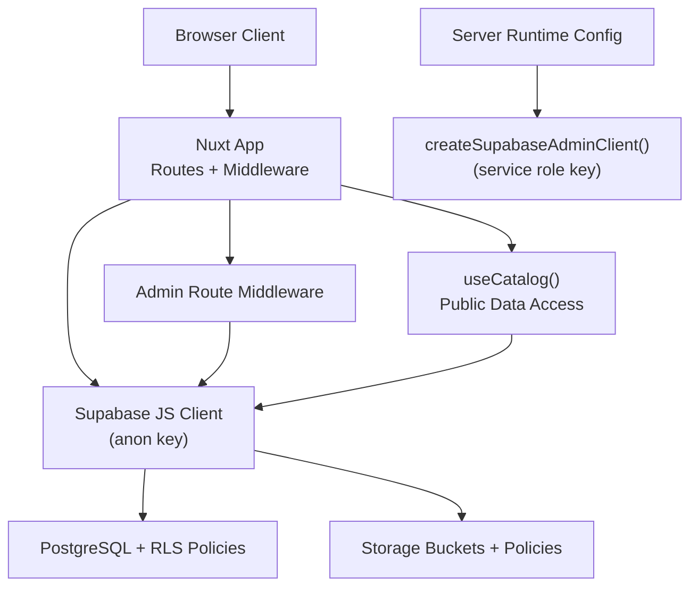
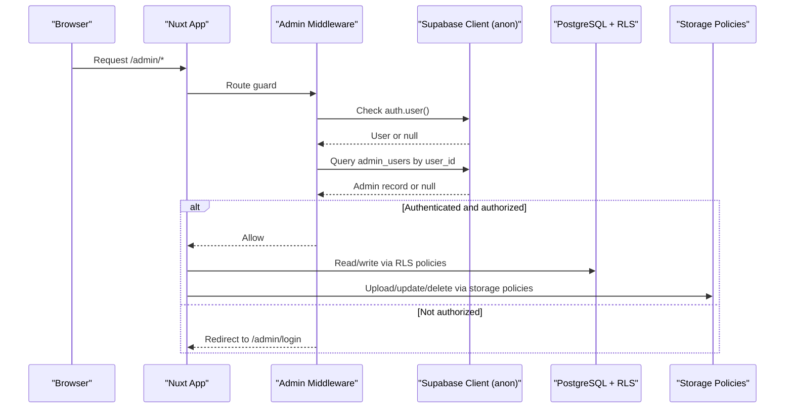
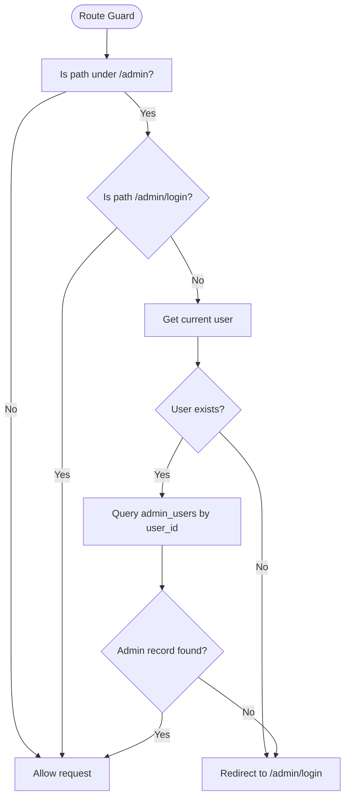
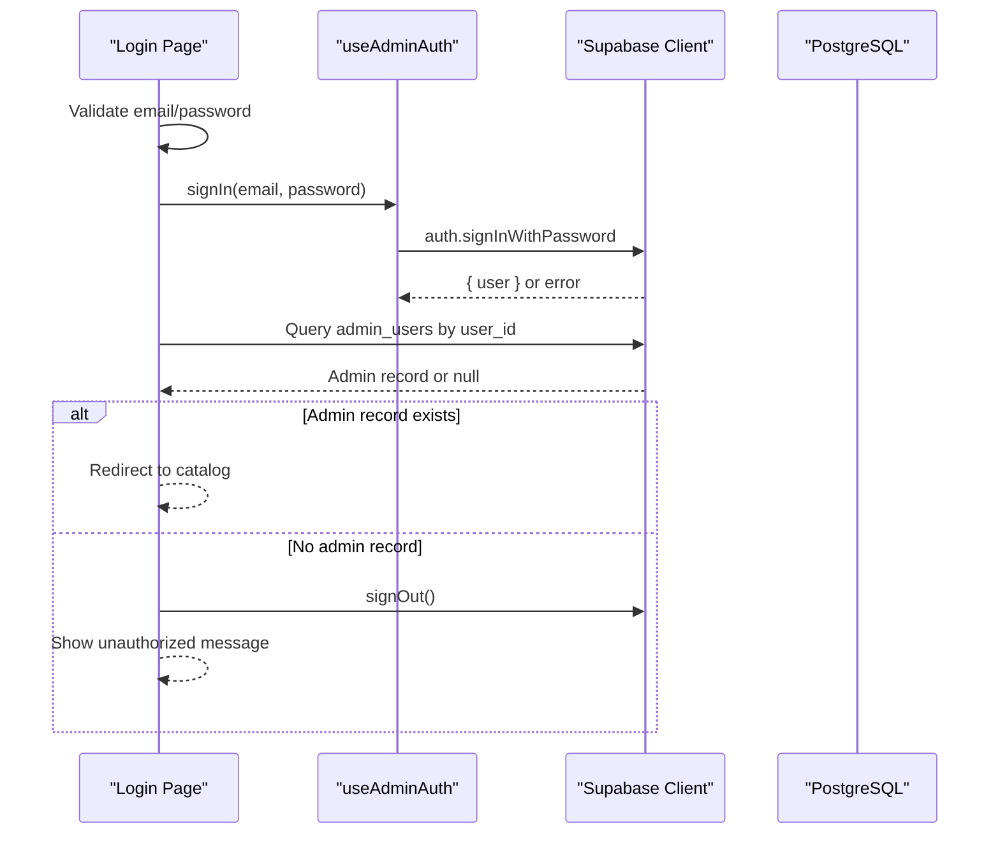
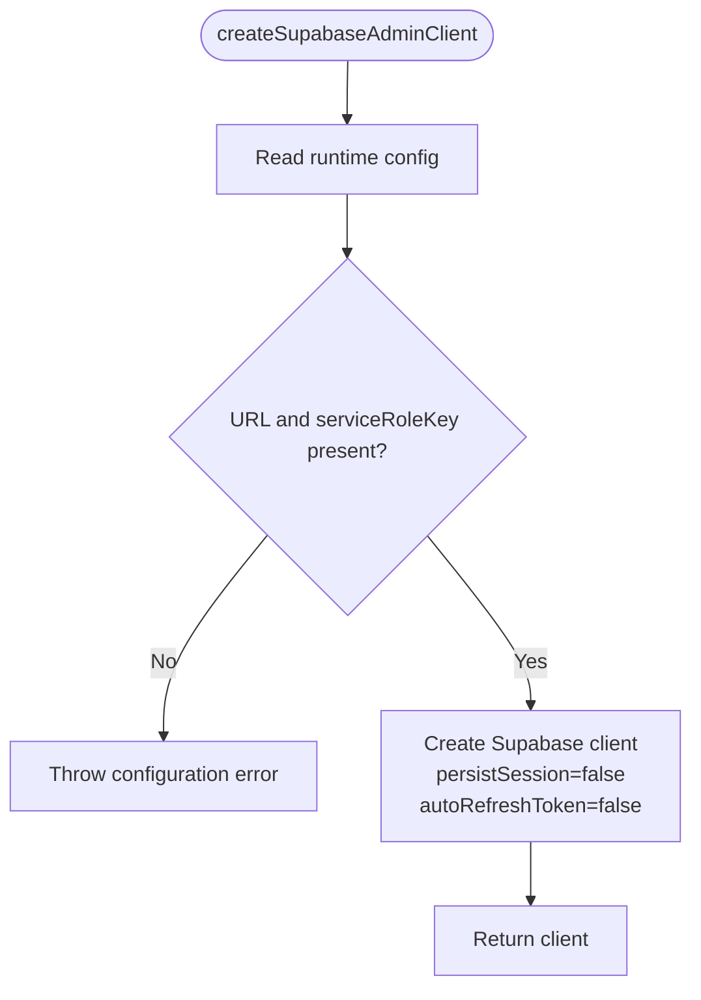
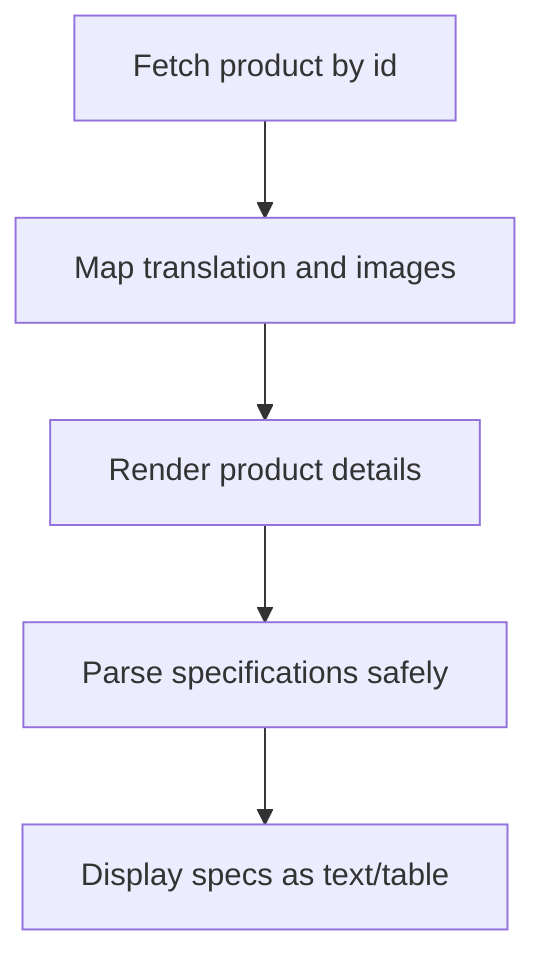
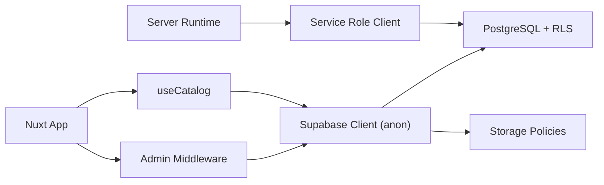

# Security Best Practices

<cite>
**Referenced Files in This Document**
- [README.md](file://README.md)
- [nuxt.config.ts](file://nuxt.config.ts)
- [app/middleware/admin-auth.global.ts](file://app/middleware/admin-auth.global.ts)
- [server/utils/supabase.ts](file://server/utils/supabase.ts)
- [supabase/migrations/20260922_000001_create_catalog_schema.sql](file://supabase/migrations/20260922_000001_create_catalog_schema.sql)
- [supabase/migrations/20260922000002_storage_and_rls.sql](file://supabase/migrations/20260922000002_storage_and_rls.sql)
- [supabase/migrations/20260922073136_remove_recursive_admin_users_policy.sql](file://supabase/migrations/20260922073136_remove_recursive_admin_users_policy.sql)
- [app/pages/admin/login.vue](file://app/pages/admin/login.vue)
- [app/composables/useAdminAuth.ts](file://app/composables/useAdminAuth.ts)
- [app/composables/useCatalog.ts](file://app/composables/useCatalog.ts)
- [app/pages/products/[id].vue](file://app/pages/products/[id].vue)
</cite>

## Table of Contents
1. [Introduction](#introduction)
2. [Project Structure](#project-structure)
3. [Core Components](#core-components)
4. [Architecture Overview](#architecture-overview)
5. [Detailed Component Analysis](#detailed-component-analysis)
6. [Dependency Analysis](#dependency-analysis)
7. [Performance Considerations](#performance-considerations)
8. [Troubleshooting Guide](#troubleshooting-guide)
9. [Conclusion](#conclusion)
10. [Appendices](#appendices)

## Introduction
This document provides comprehensive security best practices for the application, focusing on input validation, XSS prevention, CSRF protection, secure session handling, and secure communication patterns. It explains how security principles are applied across authentication flows, API endpoints, and database interactions, and it includes guidelines for secure coding, audits, monitoring, configuration, deployment, incident response, and testing strategies.

## Project Structure
The project is a Nuxt-based catalog application with Supabase as the backend. Security-relevant areas include:
- Application configuration and runtime secrets
- Admin route middleware for authorization
- Authentication composables and login page
- Server-side admin client using service role key
- Database schema, Row Level Security (RLS), and storage policies
- Catalog data access and rendering logic



**Diagram sources**
- [nuxt.config.ts:9-25](file://nuxt.config.ts#L9-L25)
- [app/middleware/admin-auth.global.ts:1-27](file://app/middleware/admin-auth.global.ts#L1-L27)
- [server/utils/supabase.ts:1-19](file://server/utils/supabase.ts#L1-L19)
- [app/composables/useCatalog.ts:4-59](file://app/composables/useCatalog.ts#L4-L59)
- [supabase/migrations/20260922000002_storage_and_rls.sql:1-205](file://supabase/migrations/20260922000002_storage_and_rls.sql#L1-L205)

**Section sources**
- [README.md:1-36](file://README.md#L1-L36)
- [nuxt.config.ts:1-52](file://nuxt.config.ts#L1-L52)

## Core Components
- Admin route middleware enforces authentication and authorization for /admin routes by checking user identity and admin record existence.
- Authentication composable centralizes sign-in, sign-out, and admin checks.
- Login page validates inputs, calls sign-in, verifies admin status, and handles errors safely.
- Server-side admin client uses a service role key to perform privileged operations securely on the server.
- Database schema defines tables, constraints, and triggers; RLS policies enforce row-level access control for both data and storage.
- Catalog composable reads public product data via Supabase, maps translations, and generates safe image URLs.

Key security responsibilities:
- Input validation at UI boundaries
- Authorization checks at route and database layers
- Secure secret management for service role key
- Safe rendering of user-controlled content
- Least privilege for clients and storage access

**Section sources**
- [app/middleware/admin-auth.global.ts:1-27](file://app/middleware/admin-auth.global.ts#L1-L27)
- [app/composables/useAdminAuth.ts:1-79](file://app/composables/useAdminAuth.ts#L1-L79)
- [app/pages/admin/login.vue:1-121](file://app/pages/admin/login.vue#L1-L121)
- [server/utils/supabase.ts:1-19](file://server/utils/supabase.ts#L1-L19)
- [supabase/migrations/20260922_000001_create_catalog_schema.sql:1-113](file://supabase/migrations/20260922_000001_create_catalog_schema.sql#L1-L113)
- [supabase/migrations/20260922000002_storage_and_rls.sql:1-205](file://supabase/migrations/20260922000002_storage_and_rls.sql#L1-L205)
- [app/composables/useCatalog.ts:1-61](file://app/composables/useCatalog.ts#L1-L61)

## Architecture Overview
Security architecture emphasizes defense in depth:
- Frontend uses anon key for public read access and authenticated operations.
- Admin-only routes are protected by middleware that validates user identity and admin membership.
- Database-level RLS policies restrict data access based on roles and ownership.
- Storage policies limit uploads/updates/deletes to authenticated admins and allow public reads for product images.
- Service role key is used only in server-side code for privileged operations.



**Diagram sources**
- [app/middleware/admin-auth.global.ts:1-27](file://app/middleware/admin-auth.global.ts#L1-L27)
- [supabase/migrations/20260922000002_storage_and_rls.sql:1-205](file://supabase/migrations/20260922000002_storage_and_rls.sql#L1-L205)

## Detailed Component Analysis

### Admin Route Middleware
- Guards all /admin routes except the login page.
- Checks if a user exists; if not, redirects to login.
- Verifies admin membership by querying admin_users table.
- On error or missing admin record, redirects to login.



**Diagram sources**
- [app/middleware/admin-auth.global.ts:1-27](file://app/middleware/admin-auth.global.ts#L1-L27)

**Section sources**
- [app/middleware/admin-auth.global.ts:1-27](file://app/middleware/admin-auth.global.ts#L1-L27)

### Authentication Composable and Login Page
- Composable encapsulates sign-in, sign-out, and admin checks.
- Login page validates required fields, calls sign-in, verifies admin record, and handles errors without leaking sensitive details.
- Uses Supabase auth client for credential flow.



**Diagram sources**
- [app/pages/admin/login.vue:15-54](file://app/pages/admin/login.vue#L15-L54)
- [app/composables/useAdminAuth.ts:56-64](file://app/composables/useAdminAuth.ts#L56-L64)

**Section sources**
- [app/composables/useAdminAuth.ts:1-79](file://app/composables/useAdminAuth.ts#L1-L79)
- [app/pages/admin/login.vue:1-121](file://app/pages/admin/login.vue#L1-L121)

### Server-Side Admin Client
- Creates a Supabase client using the service role key from runtime config.
- Disables session persistence and token refresh for server-side usage.
- Throws an error if required configuration is missing.



**Diagram sources**
- [server/utils/supabase.ts:1-19](file://server/utils/supabase.ts#L1-L19)

**Section sources**
- [server/utils/supabase.ts:1-19](file://server/utils/supabase.ts#L1-L19)

### Database Schema and Row Level Security
- Schema defines categories, products, translations, images, and admin users with constraints and indexes.
- Triggers update timestamps automatically.
- RLS policies:
  - Public read access for active categories and published products/translations/images.
  - Admin write access verified through admin_users table.
  - Super-admin policy removed in a later migration to reduce recursion risk.
- Storage policies:
  - Public read access for product-images bucket.
  - Admin-only upload/update/delete for product-images bucket.

```mermaid
classDiagram
class Categories {
+uuid id
+text slug
+integer sort_order
+boolean is_active
+timestamptz created_at
+timestamptz updated_at
}
class Products {
+uuid id
+uuid category_id
+text slug
+text sku
+numeric price
+text currency
+integer stock_quantity
+text status
+boolean is_featured
+timestamptz created_at
+timestamptz updated_at
}
class ProductTranslations {
+uuid id
+uuid product_id
+text locale
+text name
+text short_description
+text description
+jsonb specifications
+timestamptz created_at
+timestamptz updated_at
}
class ProductImages {
+uuid id
+uuid product_id
+text storage_path
+text alt_text
+integer sort_order
+boolean is_primary
+timestamptz created_at
+timestamptz updated_at
}
class AdminUsers {
+uuid id
+uuid user_id
+text role
+timestamptz created_at
+timestamptz updated_at
}
Categories ||--o{ Products : "category_id"
Products ||--o{ ProductTranslations : "product_id"
Products ||--o{ ProductImages : "product_id"
```

**Diagram sources**
- [supabase/migrations/20260922_000001_create_catalog_schema.sql:3-67](file://supabase/migrations/20260922_000001_create_catalog_schema.sql#L3-L67)

**Section sources**
- [supabase/migrations/20260922_000001_create_catalog_schema.sql:1-113](file://supabase/migrations/20260922_000001_create_catalog_schema.sql#L1-L113)
- [supabase/migrations/20260922000002_storage_and_rls.sql:1-205](file://supabase/migrations/20260922000002_storage_and_rls.sql#L1-L205)
- [supabase/migrations/20260922073136_remove_recursive_admin_users_policy.sql:1-2](file://supabase/migrations/20260922073136_remove_recursive_admin_users_policy.sql#L1-L2)

### Catalog Data Access and Rendering
- useCatalog composable fetches public products and categories via Supabase.
- Maps translations based on locale fallbacks and constructs safe image URLs.
- Product detail page parses specifications safely and renders them without executing scripts.



**Diagram sources**
- [app/composables/useCatalog.ts:13-47](file://app/composables/useCatalog.ts#L13-L47)
- [app/pages/products/[id].vue:22-43](file://app/pages/products/[id].vue#L22-L43)

**Section sources**
- [app/composables/useCatalog.ts:1-61](file://app/composables/useCatalog.ts#L1-L61)
- [app/pages/products/[id].vue:1-177](file://app/pages/products/[id].vue#L1-L177)

## Dependency Analysis
- The frontend relies on Supabase anon key for public reads and authenticated operations.
- Admin middleware depends on Supabase client to verify admin membership.
- Server-side admin client depends on runtime config for service role key.
- Database and storage policies depend on auth context to enforce access control.



**Diagram sources**
- [nuxt.config.ts:9-25](file://nuxt.config.ts#L9-L25)
- [app/middleware/admin-auth.global.ts:1-27](file://app/middleware/admin-auth.global.ts#L1-L27)
- [server/utils/supabase.ts:1-19](file://server/utils/supabase.ts#L1-L19)
- [app/composables/useCatalog.ts:1-61](file://app/composables/useCatalog.ts#L1-L61)
- [supabase/migrations/20260922000002_storage_and_rls.sql:1-205](file://supabase/migrations/20260922000002_storage_and_rls.sql#L1-L205)

**Section sources**
- [nuxt.config.ts:1-52](file://nuxt.config.ts#L1-L52)
- [app/middleware/admin-auth.global.ts:1-27](file://app/middleware/admin-auth.global.ts#L1-L27)
- [server/utils/supabase.ts:1-19](file://server/utils/supabase.ts#L1-L19)
- [app/composables/useCatalog.ts:1-61](file://app/composables/useCatalog.ts#L1-L61)
- [supabase/migrations/20260922000002_storage_and_rls.sql:1-205](file://supabase/migrations/20260922000002_storage_and_rls.sql#L1-L205)

## Performance Considerations
- Prefer minimal queries and selective column projection to reduce payload size.
- Use indexes defined in schema for frequent filters (e.g., category_id, status).
- Avoid unnecessary re-fetching by caching results where appropriate.
- Keep RLS policies efficient; avoid overly complex subqueries when possible.
- Limit storage operations to necessary buckets and paths.

[No sources needed since this section provides general guidance]

## Troubleshooting Guide
Common issues and resolutions:
- Missing environment variables for Supabase URL or service role key cause server-side client initialization failures. Ensure runtime config is set correctly.
- Admin authorization lookup errors result in redirect to login; check network requests and RLS policies for admin_users.
- Unauthorized access after sign-in indicates missing admin record; verify admin_users entry and RLS policies.
- Storage upload failures for product images indicate insufficient permissions; confirm admin role and storage policies.

**Section sources**
- [server/utils/supabase.ts:9-11](file://server/utils/supabase.ts#L9-L11)
- [app/middleware/admin-auth.global.ts:19-26](file://app/middleware/admin-auth.global.ts#L19-L26)
- [app/pages/admin/login.vue:38-46](file://app/pages/admin/login.vue#L38-L46)
- [supabase/migrations/20260922000002_storage_and_rls.sql:162-205](file://supabase/migrations/20260922000002_storage_and_rls.sql#L162-L205)

## Conclusion
The application implements layered security controls:
- Input validation at UI boundaries
- Route-level authorization via middleware
- Database-enforced access control through RLS
- Storage policies restricting file operations
- Secure secret management for service role key
To maintain strong security posture, continue enforcing least privilege, validating inputs, sanitizing outputs, auditing dependencies, and regularly testing for vulnerabilities.

[No sources needed since this section summarizes without analyzing specific files]

## Appendices

### Security Configuration Guidelines
- Environment variables:
  - SUPABASE_SERVICE_ROLE_KEY: Server-only secret for privileged operations.
  - NUXT_PUBLIC_SUPABASE_URL: Public Supabase endpoint.
  - NUXT_PUBLIC_SUPABASE_ANON_KEY: Public key for client-side access.
- Cookie settings:
  - Admin auth cookie name and lifetime configured in runtime config.
  - SameSite policy set to lax for cross-site navigation safety.

**Section sources**
- [nuxt.config.ts:9-25](file://nuxt.config.ts#L9-L25)

### Secure Coding Practices
- Validate all user inputs before processing.
- Sanitize outputs to prevent XSS; render user-provided content safely.
- Use parameterized queries and rely on RLS for authorization.
- Avoid exposing service role keys in client bundles.
- Implement CSRF protections for state-changing endpoints.
- Enforce secure headers and HTTPS in production.

[No sources needed since this section provides general guidance]

### Security Audits and Monitoring
- Conduct regular dependency audits and vulnerability scans.
- Review RLS policies and storage policies for correctness.
- Monitor authentication logs and error rates.
- Set up alerts for unusual access patterns.

[No sources needed since this section provides general guidance]

### Secure Deployment Practices
- Build and preview production builds locally before deployment.
- Ensure environment variables are injected securely at deploy time.
- Restrict access to admin routes and APIs.
- Enable HTTPS and secure cookies in production.

**Section sources**
- [README.md:21-35](file://README.md#L21-L35)

### Incident Response Procedures
- Detect anomalies via logs and monitoring.
- Isolate affected components and revoke compromised sessions.
- Rotate secrets and keys if exposure is suspected.
- Investigate root cause and apply mitigations.
- Communicate impact and remediation steps.

[No sources needed since this section provides general guidance]

### Security Testing Approaches
- Unit tests for input validation and output sanitization.
- Integration tests for authentication and authorization flows.
- Vulnerability scanning for dependencies and container images.
- Penetration testing focused on admin routes, storage uploads, and data access.

[No sources needed since this section provides general guidance]