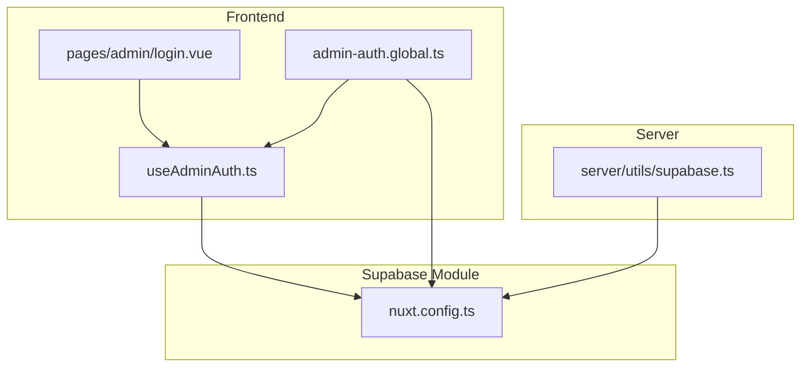
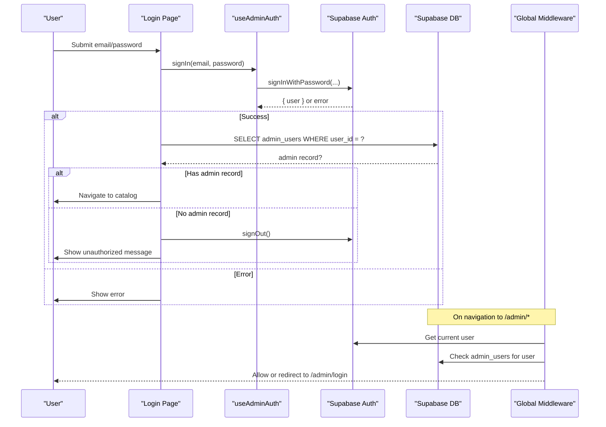
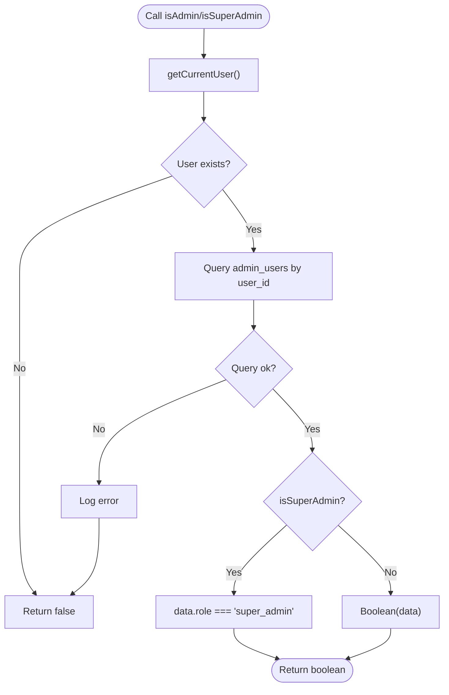
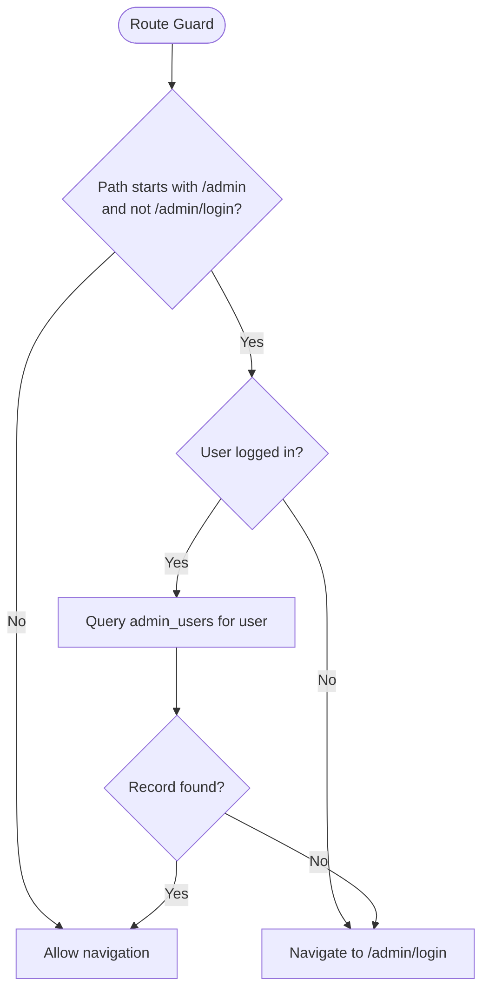
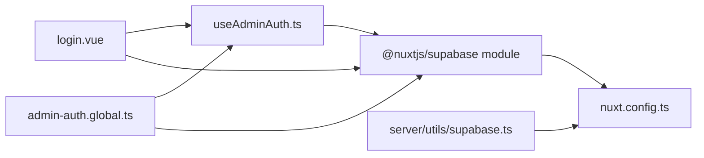

# Admin Authentication Composable

<cite>
**Referenced Files in This Document**
- [useAdminAuth.ts](file://app/composables/useAdminAuth.ts)
- [admin-auth.global.ts](file://app/middleware/admin-auth.global.ts)
- [login.vue](file://app/pages/admin/login.vue)
- [supabase.ts](file://server/utils/supabase.ts)
- [nuxt.config.ts](file://nuxt.config.ts)
</cite>

## Table of Contents
1. [Introduction](#introduction)
2. [Project Structure](#project-structure)
3. [Core Components](#core-components)
4. [Architecture Overview](#architecture-overview)
5. [Detailed Component Analysis](#detailed-component-analysis)
6. [Dependency Analysis](#dependency-analysis)
7. [Performance Considerations](#performance-considerations)
8. [Troubleshooting Guide](#troubleshooting-guide)
9. [Conclusion](#conclusion)
10. [Appendices](#appendices)

## Introduction
This document explains the admin authentication system built around the useAdminAuth composable, the global route middleware, and the Supabase integration. It covers login/logout flows, session management, role-based access control (RBAC), protected routes, error handling, token persistence, and guidelines for extending authorization rules.

## Project Structure
The admin authentication spans several layers:
- Frontend composables expose auth methods and user state.
- A global Nuxt middleware guards admin routes.
- The login page orchestrates sign-in and post-login checks.
- Server-side utilities provide a service-role client for privileged operations.
- Nuxt configuration wires up Supabase module options including cookie-based session persistence.

**Diagram sources**
- [useAdminAuth.ts:1-79](file://app/composables/useAdminAuth.ts#L1-L79)
- [admin-auth.global.ts:1-28](file://app/middleware/admin-auth.global.ts#L1-L28)
- [login.vue:1-121](file://app/pages/admin/login.vue#L1-L121)
- [supabase.ts:1-20](file://server/utils/supabase.ts#L1-L20)
- [nuxt.config.ts:1-52](file://nuxt.config.ts#L1-L52)

**Section sources**
- [useAdminAuth.ts:1-79](file://app/composables/useAdminAuth.ts#L1-L79)
- [admin-auth.global.ts:1-28](file://app/middleware/admin-auth.global.ts#L1-L28)
- [login.vue:1-121](file://app/pages/admin/login.vue#L1-L121)
- [supabase.ts:1-20](file://server/utils/supabase.ts#L1-L20)
- [nuxt.config.ts:1-52](file://nuxt.config.ts#L1-L52)

## Core Components
- useAdminAuth composable: Provides user state, admin privilege checks, and sign-in/sign-out actions.
- Global middleware: Guards /admin/* routes by verifying authenticated users and admin records.
- Login page: Handles credentials submission, calls the composable, validates admin status, and navigates on success.
- Server utility: Creates a service-role Supabase client with session persistence disabled for server-side operations.
- Nuxt config: Configures the Supabase module, including cookie name, lifetime, and redirect behavior.

Key responsibilities:
- Session management via Supabase module cookies.
- Role checks against an admin_users table.
- Centralized error propagation from Supabase to UI.

**Section sources**
- [useAdminAuth.ts:1-79](file://app/composables/useAdminAuth.ts#L1-L79)
- [admin-auth.global.ts:1-28](file://app/middleware/admin-auth.global.ts#L1-L28)
- [login.vue:1-121](file://app/pages/admin/login.vue#L1-L121)
- [supabase.ts:1-20](file://server/utils/supabase.ts#L1-L20)
- [nuxt.config.ts:1-52](file://nuxt.config.ts#L1-L52)

## Architecture Overview
The authentication flow integrates frontend state, Supabase Auth, and RBAC checks:

**Diagram sources**
- [login.vue:15-54](file://app/pages/admin/login.vue#L15-L54)
- [useAdminAuth.ts:56-69](file://app/composables/useAdminAuth.ts#L56-L69)
- [admin-auth.global.ts:1-28](file://app/middleware/admin-auth.global.ts#L1-L28)

## Detailed Component Analysis

### useAdminAuth composable
Responsibilities:
- Expose reactive user state via Supabase module.
- Provide getCurrentUser that prefers fresh auth state, falling back to cached user.
- Implement isAdmin and isSuperAdmin by querying admin_users for the current user’s role.
- Wrap signIn and signOut to propagate errors consistently.

Behavior highlights:
- getCurrentUser attempts to fetch the latest user from Supabase; if unavailable, it returns the reactive user reference when present.
- isAdmin returns true only when a matching admin_users row exists for the current user.
- isSuperAdmin requires the role field to equal super_admin.
- signIn throws on errors so callers can handle them uniformly.
- signOut throws on errors to allow caller-level handling.

**Diagram sources**
- [useAdminAuth.ts:7-54](file://app/composables/useAdminAuth.ts#L7-L54)

**Section sources**
- [useAdminAuth.ts:1-79](file://app/composables/useAdminAuth.ts#L1-L79)

### Global middleware (admin-auth.global.ts)
Purpose:
- Protect all /admin/* routes except the login page.
- Redirect unauthenticated users to /admin/login.
- Verify admin privileges by checking admin_users for the current user.

Flow:
- If path does not start with /admin or is /admin/login, allow.
- Otherwise, check if a user is logged in; if not, redirect to login.
- Query admin_users for the user; if missing or error occurs, redirect to login.

**Diagram sources**
- [admin-auth.global.ts:1-28](file://app/middleware/admin-auth.global.ts#L1-L28)

**Section sources**
- [admin-auth.global.ts:1-28](file://app/middleware/admin-auth.global.ts#L1-L28)

### Login page (pages/admin/login.vue)
Responsibilities:
- Collect email and password.
- Call useAdminAuth.signIn to authenticate.
- Validate admin eligibility by querying admin_users.
- Handle errors and show messages.
- Redirect to catalog on success.

Error handling:
- Displays validation errors for empty fields.
- Catches and shows Supabase or custom errors.
- Signs out and shows unauthorized if user lacks admin record.

Navigation:
- On successful login and admin verification, navigates to the catalog root.

**Section sources**
- [login.vue:1-121](file://app/pages/admin/login.vue#L1-L121)

### Server-side Supabase client (server/utils/supabase.ts)
Purpose:
- Create a service-role client for server-side operations.
- Disables session persistence and auto-refresh to avoid leaking tokens in server contexts.

Security note:
- Requires both public URL and service role key; throws if missing.

**Section sources**
- [supabase.ts:1-20](file://server/utils/supabase.ts#L1-L20)

### Nuxt configuration (nuxt.config.ts)
Supabase module settings:
- Disables automatic redirects to simplify custom flows.
- Sets cookie name and lifetime for session persistence.
- Provides public and service keys via runtime config.

Session persistence:
- Cookie-based sessions are enabled with a defined lifetime and SameSite policy.
- Tokens are stored in cookies per module configuration.

**Section sources**
- [nuxt.config.ts:1-52](file://nuxt.config.ts#L1-L52)

## Dependency Analysis
- useAdminAuth depends on:
  - Supabase client and user state provided by the @nuxtjs/supabase module.
  - Database schema containing admin_users with at least user_id and role columns.
- Global middleware depends on:
  - Supabase client and user state to enforce route protection.
- Login page depends on:
  - useAdminAuth for authentication.
  - Supabase client to verify admin eligibility post-login.
- Server utility depends on:
  - Runtime config values for URL and service role key.

**Diagram sources**
- [useAdminAuth.ts:1-79](file://app/composables/useAdminAuth.ts#L1-L79)
- [admin-auth.global.ts:1-28](file://app/middleware/admin-auth.global.ts#L1-L28)
- [login.vue:1-121](file://app/pages/admin/login.vue#L1-L121)
- [supabase.ts:1-20](file://server/utils/supabase.ts#L1-L20)
- [nuxt.config.ts:1-52](file://nuxt.config.ts#L1-L52)

**Section sources**
- [useAdminAuth.ts:1-79](file://app/composables/useAdminAuth.ts#L1-L79)
- [admin-auth.global.ts:1-28](file://app/middleware/admin-auth.global.ts#L1-L28)
- [login.vue:1-121](file://app/pages/admin/login.vue#L1-L121)
- [supabase.ts:1-20](file://server/utils/supabase.ts#L1-L20)
- [nuxt.config.ts:1-52](file://nuxt.config.ts#L1-L52)

## Performance Considerations
- Minimize redundant queries:
  - Cache admin role checks where appropriate to avoid repeated database calls during short-lived interactions.
- Prefer maybeSingle for single-row lookups to reduce payload size.
- Avoid heavy work in middleware; keep checks lightweight and fast.
- Use Supabase module’s built-in session refresh to reduce manual token handling.

[No sources needed since this section provides general guidance]

## Troubleshooting Guide
Common issues and resolutions:
- Missing environment variables:
  - Ensure SUPABASE_SERVICE_ROLE_KEY and NUXT_PUBLIC_SUPABASE_URL are set; otherwise, server client creation will throw.
- Unauthorized after login:
  - Verify that admin_users contains a record for the authenticated user’s id.
- Session not persisting:
  - Confirm cookie name and lifetime in Supabase module configuration and that cookies are allowed in your environment.
- Errors during admin checks:
  - Review console logs for “Admin auth check failed” or “Super admin check failed”; validate RLS policies and network connectivity.
- Redirect loops:
  - Ensure middleware excludes /admin/login and that login flow completes before navigating away.

**Section sources**
- [supabase.ts:1-20](file://server/utils/supabase.ts#L1-L20)
- [useAdminAuth.ts:22-54](file://app/composables/useAdminAuth.ts#L22-L54)
- [admin-auth.global.ts:1-28](file://app/middleware/admin-auth.global.ts#L1-L28)
- [nuxt.config.ts:16-26](file://nuxt.config.ts#L16-L26)

## Conclusion
The admin authentication system centers on a concise composable that encapsulates user state and role checks, a robust global middleware that protects admin routes, and a clear login flow that verifies admin eligibility. Supabase’s module handles session persistence via cookies, while server-side operations use a secure service-role client. By following the outlined patterns and security practices, you can extend roles, add new authorization rules, and maintain a consistent, secure admin experience.

[No sources needed since this section summarizes without analyzing specific files]

## Appendices

### Protected Route Usage Example
- Place any admin-only pages under /admin/.
- The global middleware will automatically guard these routes.
- To render admin-only UI elements conditionally, call isAdmin or isSuperAdmin from useAdminAuth within components or pages.

**Section sources**
- [admin-auth.global.ts:1-28](file://app/middleware/admin-auth.global.ts#L1-L28)
- [useAdminAuth.ts:16-54](file://app/composables/useAdminAuth.ts#L16-L54)

### Error Handling Patterns
- Catch errors thrown by signIn and display user-friendly messages.
- For admin eligibility failures, sign out and inform the user they lack permissions.
- In middleware, log errors and redirect to login to prevent exposure of internal states.

**Section sources**
- [login.vue:15-54](file://app/pages/admin/login.vue#L15-L54)
- [useAdminAuth.ts:56-69](file://app/composables/useAdminAuth.ts#L56-L69)
- [admin-auth.global.ts:12-28](file://app/middleware/admin-auth.global.ts#L12-L28)

### Security Best Practices
- Keep service role keys server-only; never expose them to the browser.
- Enforce RBAC both client-side (for UX) and server-side (via RLS policies).
- Use minimal data selection (e.g., select only required fields).
- Set appropriate cookie attributes (SameSite, lifetime) to balance security and usability.

**Section sources**
- [supabase.ts:1-20](file://server/utils/supabase.ts#L1-L20)
- [nuxt.config.ts:16-26](file://nuxt.config.ts#L16-L26)

### Extending Authorization Rules
- Add new roles to admin_users and update isSuperAdmin or introduce new checks like isEditor.
- Extend middleware to enforce additional conditions if necessary.
- Update login flow to validate new roles before granting access.

**Section sources**
- [useAdminAuth.ts:36-54](file://app/composables/useAdminAuth.ts#L36-L54)
- [admin-auth.global.ts:12-28](file://app/middleware/admin-auth.global.ts#L12-L28)
- [login.vue:32-48](file://app/pages/admin/login.vue#L32-L48)