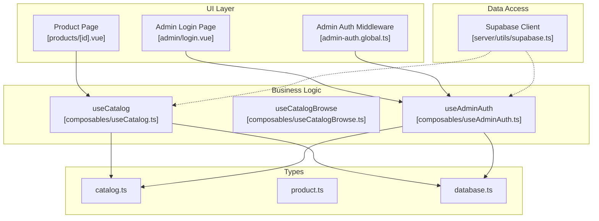
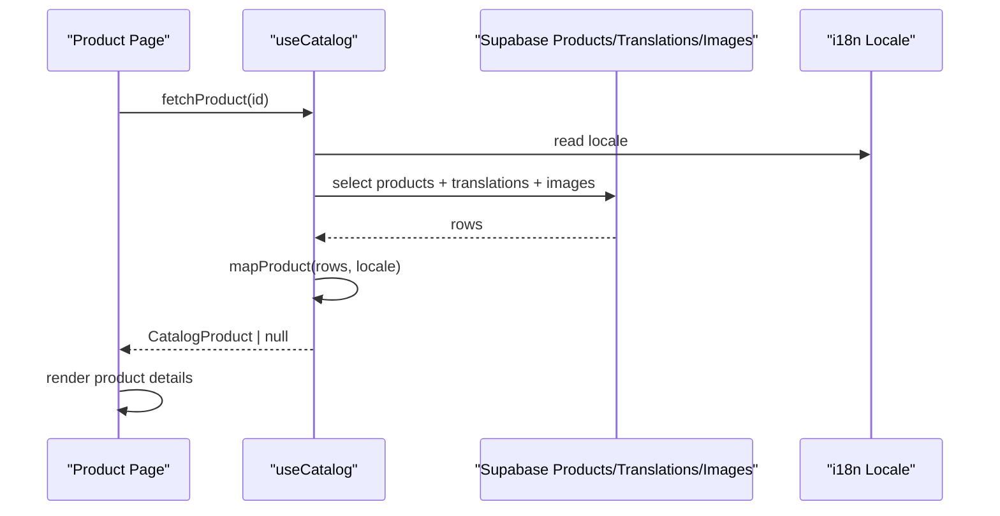
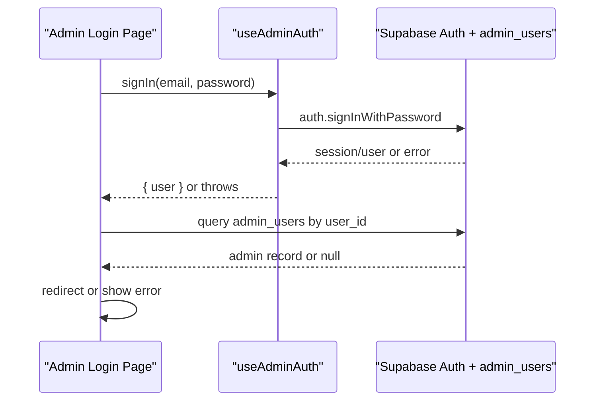
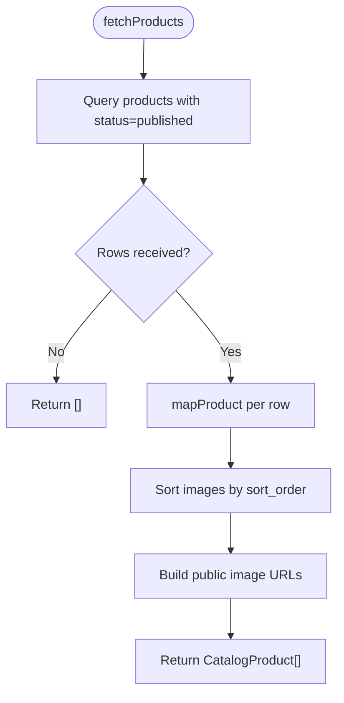
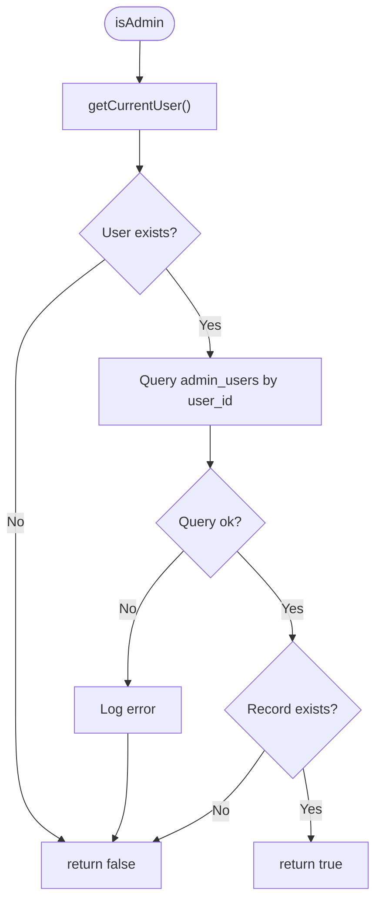
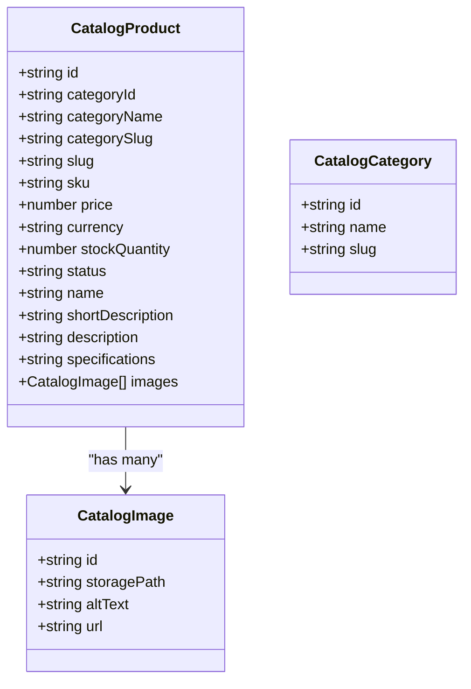
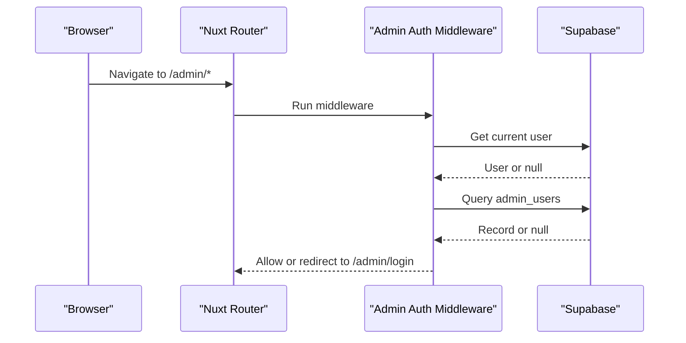
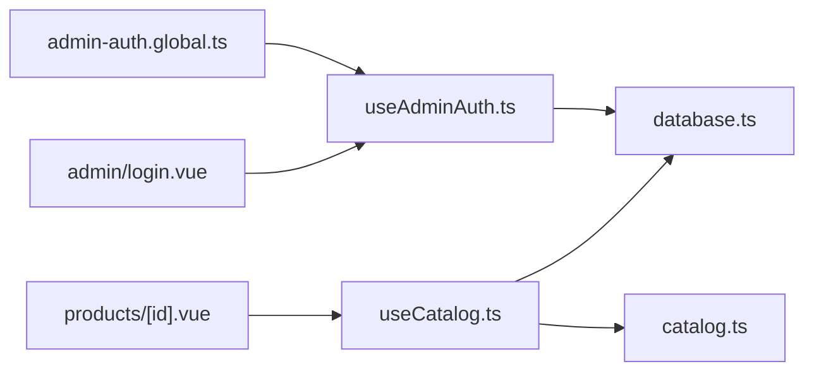

# Business Logic & Composables

<cite>
**Referenced Files in This Document**
- [useCatalog.ts](file://app/composables/useCatalog.ts)
- [useCatalogBrowse.ts](file://app/composables/useCatalogBrowse.ts)
- [useAdminAuth.ts](file://app/composables/useAdminAuth.ts)
- [catalog.ts](file://app/types/catalog.ts)
- [product.ts](file://app/types/product.ts)
- [database.ts](file://app/types/database.ts)
- [catalog.ts](file://app/constants/catalog.ts)
- [products/[id].vue](file://app/pages/products/[id].vue)
- [admin/login.vue](file://app/pages/admin/login.vue)
- [admin-auth.global.ts](file://app/middleware/admin-auth.global.ts)
- [supabase.ts](file://server/utils/supabase.ts)
</cite>

## Table of Contents
1. [Introduction](#introduction)
2. [Project Structure](#project-structure)
3. [Core Components](#core-components)
4. [Architecture Overview](#architecture-overview)
5. [Detailed Component Analysis](#detailed-component-analysis)
6. [Dependency Analysis](#dependency-analysis)
7. [Performance Considerations](#performance-considerations)
8. [Testing Strategies](#testing-strategies)
9. [Guidelines for New Composables](#guidelines-for-new-composables)
10. [Conclusion](#conclusion)

## Introduction
This document explains the business logic layer centered on Vue 3 composables and type-safe data management. It focuses on:
- The composable architecture pattern used across the application
- useCatalog for product and category data operations
- useAdminAuth for authentication workflows
- TypeScript interfaces and types that ensure end-to-end type safety
- Data fetching, caching strategies, error handling, and state management patterns
- Relationships between composables and components, data flow, and reusability
- Performance considerations such as lazy loading, pagination, and efficient updates
- Testing strategies for business logic and mocking external dependencies

## Project Structure
The business logic is organized around:
- Composables in app/composables for reusable domain logic — `useCatalog` for catalog data access, `useCatalogBrowse` for browsing state (search, sort, category selection, filtered results), `useAdminAuth` for admin identity
- Types in app/types for shared contracts
- Pages and middleware for UI orchestration and route-level guards
- Server utilities for privileged Supabase access

**Diagram sources**
- [products/[id].vue:1-47](file://app/pages/products/[id].vue#L1-L47)
- [admin/login.vue:1-58](file://app/pages/admin/login.vue#L1-L58)
- [admin-auth.global.ts:1-28](file://app/middleware/admin-auth.global.ts#L1-L28)
- [useCatalog.ts:1-61](file://app/composables/useCatalog.ts#L1-L61)
- [useAdminAuth.ts:1-79](file://app/composables/useAdminAuth.ts#L1-L79)
- [catalog.ts:1-31](file://app/types/catalog.ts#L1-L31)
- [product.ts:1-40](file://app/types/product.ts#L1-L40)
- [database.ts:1-123](file://app/types/database.ts#L1-L123)
- [supabase.ts:1-20](file://server/utils/supabase.ts#L1-L20)

**Section sources**
- [useCatalog.ts:1-61](file://app/composables/useCatalog.ts#L1-L61)
- [useAdminAuth.ts:1-79](file://app/composables/useAdminAuth.ts#L1-L79)
- [catalog.ts:1-31](file://app/types/catalog.ts#L1-L31)
- [product.ts:1-40](file://app/types/product.ts#L1-L40)
- [database.ts:1-123](file://app/types/database.ts#L1-L123)
- [products/[id].vue:1-47](file://app/pages/products/[id].vue#L1-L47)
- [admin/login.vue:1-58](file://app/pages/admin/login.vue#L1-L58)
- [admin-auth.global.ts:1-28](file://app/middleware/admin-auth.global.ts#L1-L28)
- [supabase.ts:1-20](file://server/utils/supabase.ts#L1-L20)

## Core Components
- useCatalog: Encapsulates catalog data operations (products, categories), image URL resolution, and translation-aware mapping to typed domain models.
- useAdminAuth: Encapsulates admin authentication flows, including sign-in, sign-out, and role checks against a database table.

Key responsibilities:
- Data fetching with Supabase client
- Mapping raw rows to typed domain models
- Error propagation to callers
- Exposing reactive user state via composables

**Section sources**
- [useCatalog.ts:1-61](file://app/composables/useCatalog.ts#L1-L61)
- [useAdminAuth.ts:1-79](file://app/composables/useAdminAuth.ts#L1-L79)

## Architecture Overview
The application follows a clear separation of concerns:
- UI pages call composables to fetch or mutate data
- Composables encapsulate business rules, data transformation, and error handling
- Types define strict contracts between layers
- Middleware enforces route-level authorization

**Diagram sources**
- [products/[id].vue:1-47](file://app/pages/products/[id].vue#L1-L47)
- [useCatalog.ts:13-47](file://app/composables/useCatalog.ts#L13-L47)

**Diagram sources**
- [admin/login.vue:15-54](file://app/pages/admin/login.vue#L15-L54)
- [useAdminAuth.ts:56-64](file://app/composables/useAdminAuth.ts#L56-L64)

## Detailed Component Analysis

### useCatalog
Responsibilities:
- Resolve public image URLs from storage paths
- Map raw Supabase rows into typed CatalogProduct and CatalogCategory
- Fetch published products and categories with appropriate filters and ordering

Type safety:
- Uses Database type for strongly-typed queries
- Returns CatalogProduct and CatalogCategory interfaces defined in app/types/catalog.ts

Error handling:
- Throws errors returned from Supabase queries to let callers handle them

State and i18n:
- Reads current locale to resolve localized names and descriptions

**Diagram sources**
- [useCatalog.ts:37-41](file://app/composables/useCatalog.ts#L37-L41)
- [useCatalog.ts:13-33](file://app/composables/useCatalog.ts#L13-L33)

Key implementation notes:
- Image URL helper handles both absolute URLs and storage paths
- Translation selection prefers current locale, falls back to English, then first available
- Category name resolution mirrors translation fallback strategy
- Select strings are explicit to minimize payload size

**Section sources**
- [useCatalog.ts:1-61](file://app/composables/useCatalog.ts#L1-L61)
- [catalog.ts:1-31](file://app/types/catalog.ts#L1-L31)
- [database.ts:77-123](file://app/types/database.ts#L77-L123)

### useAdminAuth
Responsibilities:
- Provide getCurrentUser, isAdmin, isSuperAdmin helpers
- Wrap sign-in and sign-out flows
- Expose reactive user state

Authorization model:
- A user must exist in admin_users table to be considered an admin
- Role field distinguishes super_admin from other roles

Error handling:
- Logs errors during role checks and returns false to fail closed
- Propagates auth errors from sign-in/sign-out

**Diagram sources**
- [useAdminAuth.ts:16-34](file://app/composables/useAdminAuth.ts#L16-L34)

**Section sources**
- [useAdminAuth.ts:1-79](file://app/composables/useAdminAuth.ts#L1-L79)
- [database.ts:69-75](file://app/types/database.ts#L69-L75)

### Type System and Contracts
- Database types define Row, Insert, Update shapes for all tables, ensuring type-safe queries.
- Catalog types define presentation-oriented models for UI consumption.
- Product types define normalized records for internal domain modeling.

Relationships:
- useCatalog maps Database rows to Catalog types
- Pages consume Catalog types for rendering
- Admin flows rely on Database types for admin_users

**Diagram sources**
- [catalog.ts:1-31](file://app/types/catalog.ts#L1-L31)

**Section sources**
- [catalog.ts:1-31](file://app/types/catalog.ts#L1-L31)
- [product.ts:1-40](file://app/types/product.ts#L1-L40)
- [database.ts:1-123](file://app/types/database.ts#L1-L123)

### Integration with Pages and Middleware
- Product page uses useCatalog to fetch a single product, manages loading/error states, and renders details.
- Admin login page uses useAdminAuth to authenticate and validates admin presence before navigation.
- Global middleware protects /admin routes by checking user existence and admin record.

**Diagram sources**
- [admin-auth.global.ts:1-28](file://app/middleware/admin-auth.global.ts#L1-L28)

**Section sources**
- [products/[id].vue:1-47](file://app/pages/products/[id].vue#L1-L47)
- [admin/login.vue:1-58](file://app/pages/admin/login.vue#L1-L58)
- [admin-auth.global.ts:1-28](file://app/middleware/admin-auth.global.ts#L1-L28)

## Dependency Analysis
Composables depend on:
- Supabase client for data access
- i18n for locale-aware content
- Shared types for contract enforcement

Pages depend on:
- Composables for data and auth
- UI primitives for rendering

**Diagram sources**
- [products/[id].vue:1-47](file://app/pages/products/[id].vue#L1-L47)
- [admin/login.vue:1-58](file://app/pages/admin/login.vue#L1-L58)
- [admin-auth.global.ts:1-28](file://app/middleware/admin-auth.global.ts#L1-L28)
- [useCatalog.ts:1-61](file://app/composables/useCatalog.ts#L1-L61)
- [useAdminAuth.ts:1-79](file://app/composables/useAdminAuth.ts#L1-L79)
- [catalog.ts:1-31](file://app/types/catalog.ts#L1-L31)
- [database.ts:1-123](file://app/types/database.ts#L1-L123)

**Section sources**
- [useCatalog.ts:1-61](file://app/composables/useCatalog.ts#L1-L61)
- [useAdminAuth.ts:1-79](file://app/composables/useAdminAuth.ts#L1-L79)
- [catalog.ts:1-31](file://app/types/catalog.ts#L1-L31)
- [database.ts:1-123](file://app/types/database.ts#L1-L123)

## Performance Considerations
- Lazy loading:
  - Product detail page fetches a single product on demand using fetchProduct(id).
  - Categories are fetched separately when needed.
- Pagination:
  - Not implemented yet; consider adding offset/limit parameters to fetchProducts and exposing pagination metadata.
- Efficient data updates:
  - Prefer targeted updates to specific fields rather than full object replacements.
  - Cache results at the composable level if multiple consumers need the same dataset.
- Image optimization:
  - Ensure CDN-friendly URLs and consider responsive image variants.
- Caching:
  - Introduce a simple cache within composables keyed by identifiers to avoid redundant network calls.
- Spec parsing:
  - Product page parses specifications locally; keep this lightweight and memoized where possible.

[No sources needed since this section provides general guidance]

## Testing Strategies
Unit testing composables:
- Mock Supabase client methods for queries and auth
- Mock i18n locale getter
- Assert mapped outputs match expected CatalogProduct/CatalogCategory structures
- Validate error propagation behavior

Example test scenarios:
- useCatalog.fetchProducts returns mapped array and throws on network error
- useCatalog.fetchProduct returns null when not found
- useAdminAuth.isAdmin returns false when no user or missing admin record
- useAdminAuth.signIn throws on invalid credentials

Mocking external dependencies:
- Replace useSupabaseClient with a mock that resolves predefined responses
- Replace useSupabaseUser with a ref-based mock user
- Replace useI18n with a mock returning controlled locale values

Component integration tests:
- Render product page with mocked useCatalog and assert loading/error states
- Render admin login with mocked useAdminAuth and assert redirects and error messages

[No sources needed since this section provides general guidance]

## Guidelines for New Composables
- Define clear input/output contracts using TypeScript interfaces
- Keep side effects (network requests, mutations) inside the composable
- Centralize error handling and propagate meaningful errors
- Expose only necessary functions and reactive state
- Use constants for thresholds and configuration (e.g., LOW_STOCK_THRESHOLD)
- Follow naming conventions: useXxx for composables, PascalCase for types
- Add comments explaining complex mappings and fallbacks

Extending existing functionality:
- For catalog features, extend useCatalog with new fetchers and mappers
- For auth features, extend useAdminAuth with additional role checks or session management
- Introduce new types in app/types and reference them in composables and pages

**Section sources**
- [catalog.ts:1-2](file://app/constants/catalog.ts#L1-L2)
- [useCatalog.ts:1-61](file://app/composables/useCatalog.ts#L1-L61)
- [useAdminAuth.ts:1-79](file://app/composables/useAdminAuth.ts#L1-L79)

## Conclusion
The business logic layer leverages Vue 3 composables to encapsulate domain operations with strong typing and clear separation from UI concerns. useCatalog standardizes product and category data access with translation-aware mapping, while useAdminAuth centralizes authentication and authorization workflows. Pages integrate these composables to manage state, errors, and user interactions. By following the outlined guidelines and patterns, teams can extend functionality safely, maintain performance, and improve testability.

[No sources needed since this section summarizes without analyzing specific files]