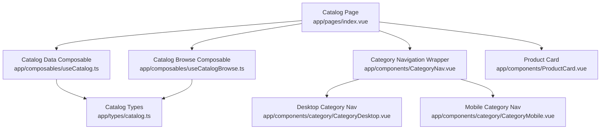
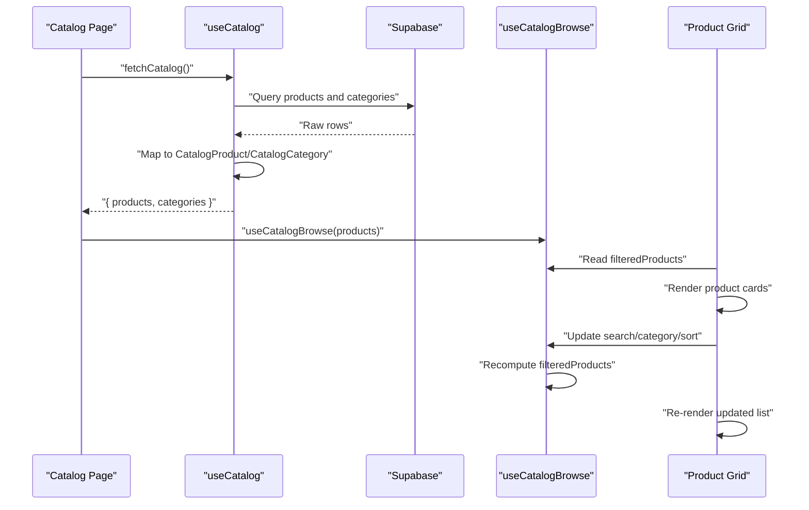
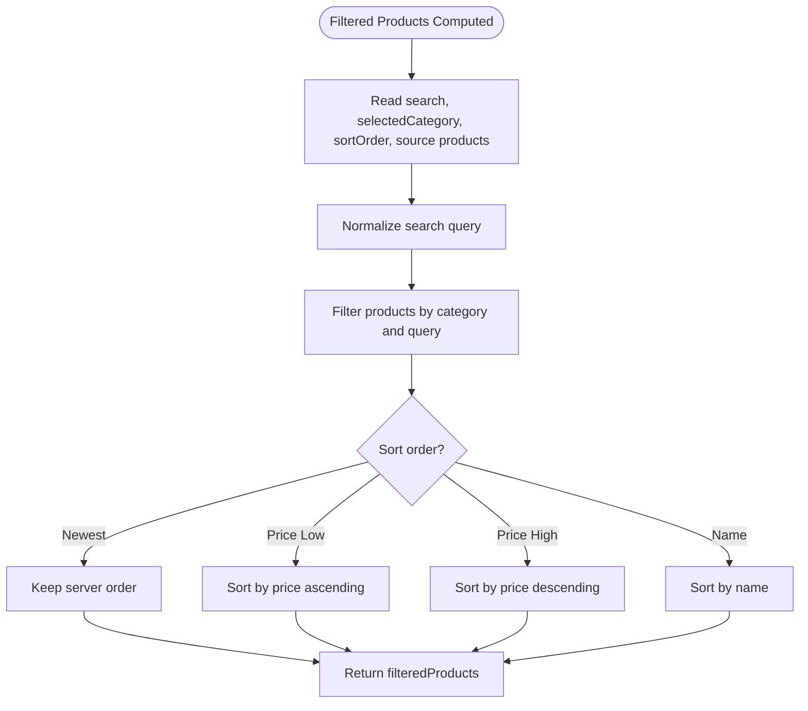
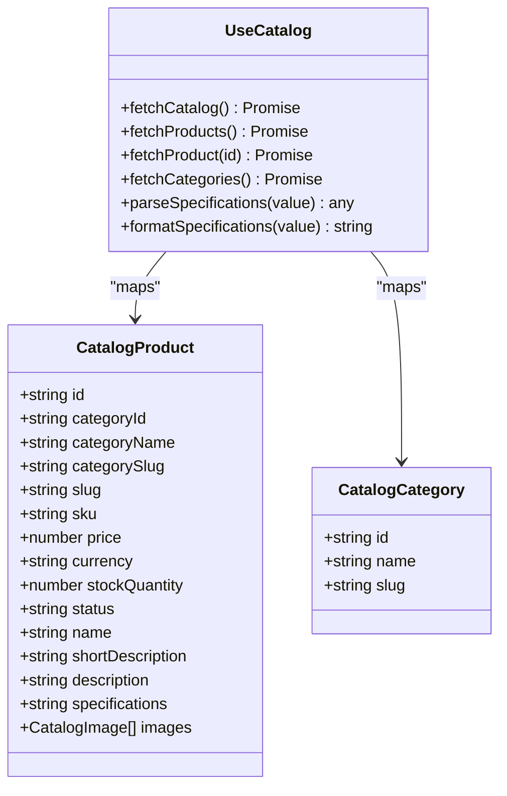
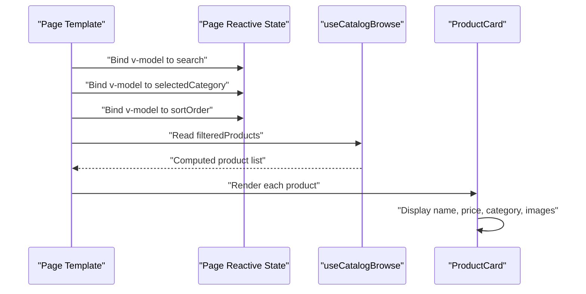
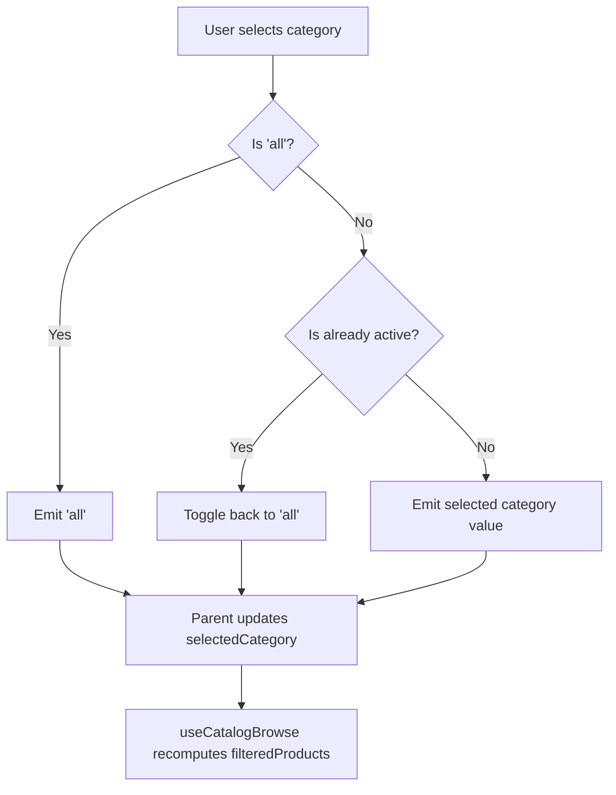
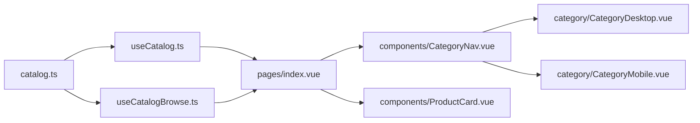

# Catalog Browse Composable

<cite>
**Referenced Files in This Document**
- [useCatalogBrowse.ts](file://app/composables/useCatalogBrowse.ts)
- [useCatalog.ts](file://app/composables/useCatalog.ts)
- [catalog.ts](file://app/types/catalog.ts)
- [index.vue](file://app/pages/index.vue)
- [CategoryNav.vue](file://app/components/CategoryNav.vue)
- [CategoryDesktop.vue](file://app/components/category/CategoryDesktop.vue)
- [CategoryMobile.vue](file://app/components/category/CategoryMobile.vue)
- [ProductCard.vue](file://app/components/ProductCard.vue)
- [nuxt.config.ts](file://nuxt.config.ts)
</cite>

## Table of Contents
1. [Introduction](#introduction)
2. [Project Structure](#project-structure)
3. [Core Components](#core-components)
4. [Architecture Overview](#architecture-overview)
5. [Detailed Component Analysis](#detailed-component-analysis)
6. [Dependency Analysis](#dependency-analysis)
7. [Performance Considerations](#performance-considerations)
8. [Troubleshooting Guide](#troubleshooting-guide)
9. [Conclusion](#conclusion)

## Introduction
This document explains the **Catalog Browse Composable**, which is responsible for turning a loaded product list into the filtered and sorted subset that the catalog page should render. It intentionally owns no data fetching or DOM logic: it receives an existing array of products, tracks user browsing state such as search text, selected category, and sort order, and exposes a reactive computed result.

The composable is used by the main catalog page alongside a data-loading composable that fetches products and categories from Supabase. The UI components then bind to the browse composable’s state and derived results.

## Project Structure
The catalog feature spans several layers:

- **Composables**: `useCatalog` handles data loading and mapping; `useCatalogBrowse` handles client-side filtering and sorting.
- **Types**: Shared TypeScript interfaces describe catalog products, images, and categories.
- **Pages**: The root catalog page orchestrates loading, admin editing, and rendering.
- **Components**: Category navigation, product cards, and related UI pieces consume the composable outputs.
- **Configuration**: Nuxt configuration wires up i18n, Supabase, color mode, and runtime environment variables.

**Diagram sources**
- [index.vue:20-40](file://app/pages/index.vue#L20-L40)
- [useCatalogBrowse.ts:1-39](file://app/composables/useCatalogBrowse.ts#L1-L39)
- [useCatalog.ts:12-114](file://app/composables/useCatalog.ts#L12-L114)
- [CategoryNav.vue:1-37](file://app/components/CategoryNav.vue#L1-L37)
- [CategoryDesktop.vue:1-611](file://app/components/category/CategoryDesktop.vue#L1-L611)
- [CategoryMobile.vue:1-577](file://app/components/category/CategoryMobile.vue#L1-L577)
- [ProductCard.vue:1-68](file://app/components/ProductCard.vue#L1-L68)
- [catalog.ts:1-31](file://app/types/catalog.ts#L1-L31)

**Section sources**
- [index.vue:1-404](file://app/pages/index.vue#L1-L404)
- [useCatalogBrowse.ts:1-40](file://app/composables/useCatalogBrowse.ts#L1-L40)
- [useCatalog.ts:1-116](file://app/composables/useCatalog.ts#L1-L116)
- [catalog.ts:1-31](file://app/types/catalog.ts#L1-L31)

## Core Components
The catalog browsing experience is built around two composables and shared types:

| Layer | Responsibility | Key Outputs / Behavior |
|---|---|---|
| `useCatalog` | Fetches published products and active categories, maps database rows to domain objects, resolves translations, and formats specifications and image URLs. | `fetchCatalog`, `fetchProducts`, `fetchProduct`, `fetchCategories`, `parseSpecifications`, `formatSpecifications` |
| `useCatalogBrowse` | Owns browsing state and derives the filtered, sorted product list without touching the network or DOM. | `search`, `selectedCategory`, `sortOrder`, `filteredProducts` |
| Catalog types | Define the shape of mapped products, images, and categories. | `CatalogProduct`, `CatalogImage`, `CatalogCategory` |

The catalog page uses both: it loads data through `useCatalog`, stores the resulting product array, and passes that array into `useCatalogBrowse`. The browse composable then computes the final list rendered by the product grid.

**Section sources**
- [useCatalog.ts:12-114](file://app/composables/useCatalog.ts#L12-L114)
- [useCatalogBrowse.ts:8-39](file://app/composables/useCatalogBrowse.ts#L8-L39)
- [catalog.ts:1-31](file://app/types/catalog.ts#L1-L31)
- [index.vue:23-40](file://app/pages/index.vue#L23-L40)

## Architecture Overview
At runtime, the catalog page follows this flow:

1. The page calls `fetchCatalog` from `useCatalog`.
2. `useCatalog` queries Supabase for products and categories, maps them to typed catalog objects, and returns them.
3. The page stores the product array in local reactive state.
4. The page creates the browse composable with that product array.
5. User interactions update `search`, `selectedCategory`, or `sortOrder`.
6. `filteredProducts` recomputes based on those inputs.
7. The template renders `filteredProducts` through `ProductCard`.

**Diagram sources**
- [index.vue:46-56](file://app/pages/index.vue#L46-L56)
- [index.vue:39-40](file://app/pages/index.vue#L39-L40)
- [index.vue:258-266](file://app/pages/index.vue#L258-L266)
- [useCatalog.ts:90-112](file://app/composables/useCatalog.ts#L90-L112)
- [useCatalogBrowse.ts:13-38](file://app/composables/useCatalogBrowse.ts#L13-L38)

## Detailed Component Analysis

### Catalog Browse Composable
`useCatalogBrowse` is a stateless filter-and-sort layer over an existing product array. It does not fetch data, manage authentication, or manipulate the DOM. Its contract is simple:

- Accept a source product array via `MaybeRefOrGetter<CatalogProduct[]>`.
- Expose reactive browsing inputs:
  - `search`: free-text search string.
  - `selectedCategory`: current category selection.
  - `sortOrder`: one of `'newest'`, `'price-low'`, `'price-high'`, or `'name'`.
- Expose `filteredProducts`, a computed array combining category filtering, text search, and sorting.

#### Filtering Logic
The filtering step evaluates each product against two conditions:

1. **Category match**:
   - If the selected category equals the special “all” value, every product matches.
   - Otherwise, the product matches if its category ID, category slug, or localized category name matches the selected value.
2. **Search match**:
   - If the trimmed search query is empty, every product matches.
   - Otherwise, the product matches if its name, SKU, or short description contains the lowercase query.

Only products satisfying both conditions are kept.

#### Sorting Logic
Sorting is applied after filtering:

- `'newest'` preserves the original server order.
- `'price-low'` sorts ascending by price.
- `'price-high'` sorts descending by price.
- `'name'` sorts alphabetically using locale-aware comparison.

**Diagram sources**
- [useCatalogBrowse.ts:18-36](file://app/composables/useCatalogBrowse.ts#L18-L36)

#### Complexity Notes
- Filtering iterates over all source products once per recomputation: **O(n)**.
- Sorting copies the filtered array and applies a comparator: **O(k log k)**, where `k` is the number of filtered products.
- Search comparisons use substring checks across three fields per product.
- Category matching supports multiple identity strategies, including slug, ID, and localized name.

**Section sources**
- [useCatalogBrowse.ts:1-39](file://app/composables/useCatalogBrowse.ts#L1-L39)

### Catalog Data Composable
`useCatalog` is responsible for data acquisition and transformation rather than browsing. Its responsibilities include:

- Building Supabase queries for products and categories.
- Deriving row types from query return shapes so schema changes break type inference early.
- Resolving product and category translations according to the current i18n locale, falling back to English, then to the first available translation.
- Mapping raw rows to `CatalogProduct` and `CatalogCategory`.
- Formatting product specifications between editor input and stored JSON.
- Generating public image URLs for product images.
- Providing convenience methods for fetching all catalog data, individual products, and categories.

**Diagram sources**
- [useCatalog.ts:12-114](file://app/composables/useCatalog.ts#L12-L114)
- [catalog.ts:1-31](file://app/types/catalog.ts#L1-L31)

**Section sources**
- [useCatalog.ts:1-116](file://app/composables/useCatalog.ts#L1-L116)
- [catalog.ts:1-31](file://app/types/catalog.ts#L1-L31)

### Catalog Page Integration
The catalog page is the composition root for the browsing experience:

- It loads catalog data through `useCatalog`.
- It stores the resulting product array in reactive state.
- It initializes `useCatalogBrowse` with that product array.
- It binds the search input, category selector, and sort dropdown to the browse composable’s state.
- It renders `filteredProducts` through `ProductCard`.

**Diagram sources**
- [index.vue:39-40](file://app/pages/index.vue#L39-L40)
- [index.vue:188-195](file://app/pages/index.vue#L188-L195)
- [index.vue:209-245](file://app/pages/index.vue#L209-L245)
- [index.vue:258-266](file://app/pages/index.vue#L258-L266)
- [ProductCard.vue:1-68](file://app/components/ProductCard.vue#L1-L68)

**Section sources**
- [index.vue:23-40](file://app/pages/index.vue#L23-L40)
- [index.vue:181-266](file://app/pages/index.vue#L181-L266)
- [ProductCard.vue:1-68](file://app/components/ProductCard.vue#L1-L68)

### Category Navigation Components
The category navigation is split into a wrapper and platform-specific implementations:

- `CategoryNav` delegates to `CategoryDesktop` on larger screens and `CategoryMobile` on smaller screens.
- Both desktop and mobile variants define the same set of default category items.
- They map default category keys to either database-provided categories or fallback labels.
- They emit `update:modelValue` with the selected category value.
- The selected value can be an “all” sentinel, a slug, or a database category ID.

**Diagram sources**
- [CategoryNav.vue:1-37](file://app/components/CategoryNav.vue#L1-L37)
- [CategoryDesktop.vue:36-91](file://app/components/category/CategoryDesktop.vue#L36-L91)
- [CategoryMobile.vue:36-91](file://app/components/category/CategoryMobile.vue#L36-L91)
- [index.vue:188-195](file://app/pages/index.vue#L188-L195)

**Section sources**
- [CategoryNav.vue:1-37](file://app/components/CategoryNav.vue#L1-L37)
- [CategoryDesktop.vue:1-611](file://app/components/category/CategoryDesktop.vue#L1-L611)
- [CategoryMobile.vue:1-577](file://app/components/category/CategoryMobile.vue#L1-L577)

## Dependency Analysis
The catalog browsing dependency graph is intentionally shallow:

- The browse composable depends only on Vue reactivity primitives and the `CatalogProduct` type.
- The data composable depends on Supabase, i18n, and database/catalog types.
- The page composes both and connects UI bindings.
- Category components depend on the catalog category type and emit values consumed by the page.

**Diagram sources**
- [catalog.ts:1-31](file://app/types/catalog.ts#L1-L31)
- [useCatalogBrowse.ts:1-39](file://app/composables/useCatalogBrowse.ts#L1-L39)
- [useCatalog.ts:1-116](file://app/composables/useCatalog.ts#L1-L116)
- [index.vue:1-404](file://app/pages/index.vue#L1-L404)
- [CategoryNav.vue:1-37](file://app/components/CategoryNav.vue#L1-L37)
- [CategoryDesktop.vue:1-611](file://app/components/category/CategoryDesktop.vue#L1-L611)
- [CategoryMobile.vue:1-577](file://app/components/category/CategoryMobile.vue#L1-L577)
- [ProductCard.vue:1-68](file://app/components/ProductCard.vue#L1-L68)

**Section sources**
- [useCatalogBrowse.ts:1-39](file://app/composables/useCatalogBrowse.ts#L1-L39)
- [useCatalog.ts:1-116](file://app/composables/useCatalog.ts#L1-L116)
- [index.vue:1-404](file://app/pages/index.vue#L1-L404)

## Performance Considerations
- **Client-side filtering and sorting**: Suitable for moderate product catalogs. For very large lists, consider server-side pagination, indexing, or incremental filtering.
- **Search normalization**: The query is normalized once per computation, but substring checks run across three fields per product. Avoid excessively long search strings or unnecessary recomputations.
- **Category matching flexibility**: Supporting ID, slug, and localized name increases matching options but adds branching. Keep category slugs stable to avoid unnecessary mismatches.
- **Sorting cost**: Sorting runs on the filtered subset. If most filters reduce the dataset significantly, performance remains acceptable.
- **Image URL resolution**: Image URLs are generated during mapping. If many images are present, ensure storage access is efficient and consider caching public URLs at the application boundary.
- **Reactive updates**: The browse composable recomputes whenever `search`, `selectedCategory`, `sortOrder`, or the source product array changes. Avoid replacing the entire product array unnecessarily; mutate or refresh only when data actually changes.

[No sources needed since this section provides general guidance]

## Troubleshooting Guide
Common issues and their likely causes:

| Symptom | Likely Cause | Resolution |
|---|---|---|
| No products appear after selecting a category | The selected category value does not match any product’s category ID, slug, or localized name. | Verify the category value emitted by `CategoryNav` and check whether it corresponds to `categoryId`, `categorySlug`, or `categoryName`. |
| Search returns no results | The search query does not match `name`, `sku`, or `shortDescription`. | Confirm the product fields contain the expected text and that the query is trimmed and lowercased. |
| Sorting appears unchanged | The sort order is set to `'newest'`, which preserves server order. | Change the sort dropdown to `'price-low'`, `'price-high'`, or `'name'`. |
| Category label shows unexpected text | The database category could not be matched to the default category key. | Ensure the database category slug, ID, or name aligns with the default category definitions. |
| Images do not load | The product image storage path is invalid or missing a public URL. | Check the image storage path and Supabase storage configuration. |
| Loading error appears | The catalog fetch failed. | Inspect the load error state and verify Supabase credentials and permissions. |

**Section sources**
- [useCatalogBrowse.ts:18-36](file://app/composables/useCatalogBrowse.ts#L18-L36)
- [useCatalog.ts:25-63](file://app/composables/useCatalog.ts#L25-L63)
- [index.vue:46-56](file://app/pages/index.vue#L46-L56)
- [CategoryDesktop.vue:36-91](file://app/components/category/CategoryDesktop.vue#L36-L91)
- [CategoryMobile.vue:36-91](file://app/components/category/CategoryMobile.vue#L36-L91)

## Conclusion
The Catalog Browse Composable provides a clean separation between data loading and client-side browsing. It keeps the catalog page focused on orchestration while delegating filtering and sorting to a small, testable, and reusable composable. Together with the data composable, types, and navigation components, it forms a cohesive catalog browsing layer that is easy to extend with additional filters, search strategies, or sorting rules.

[No sources needed since this section summarizes without analyzing specific files]