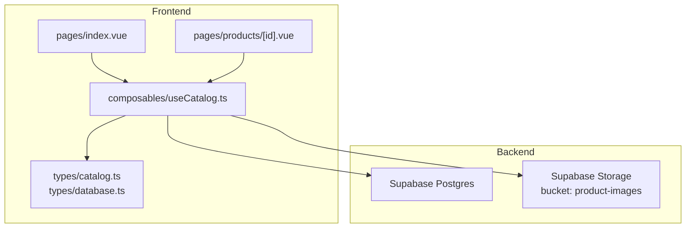
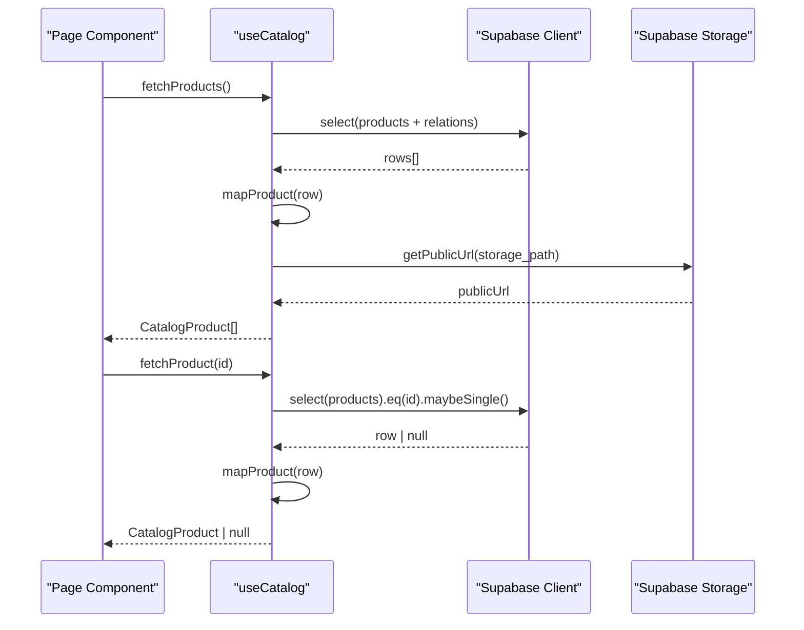
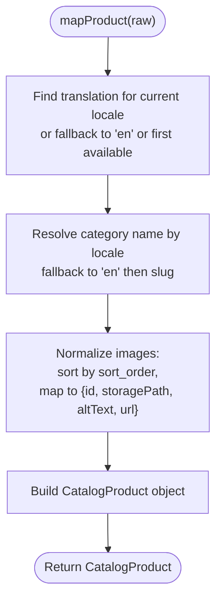
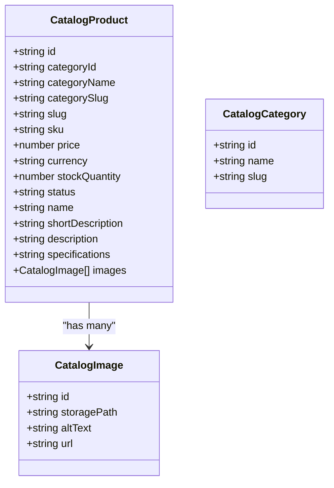
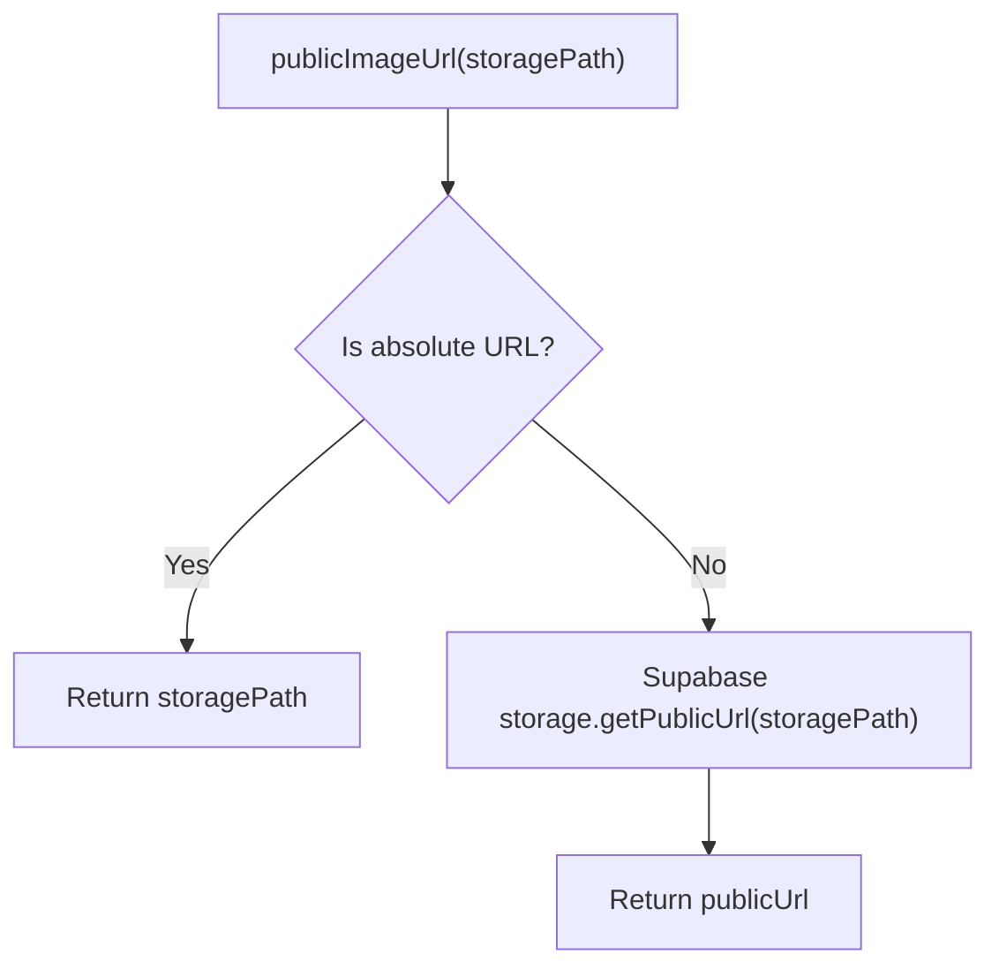
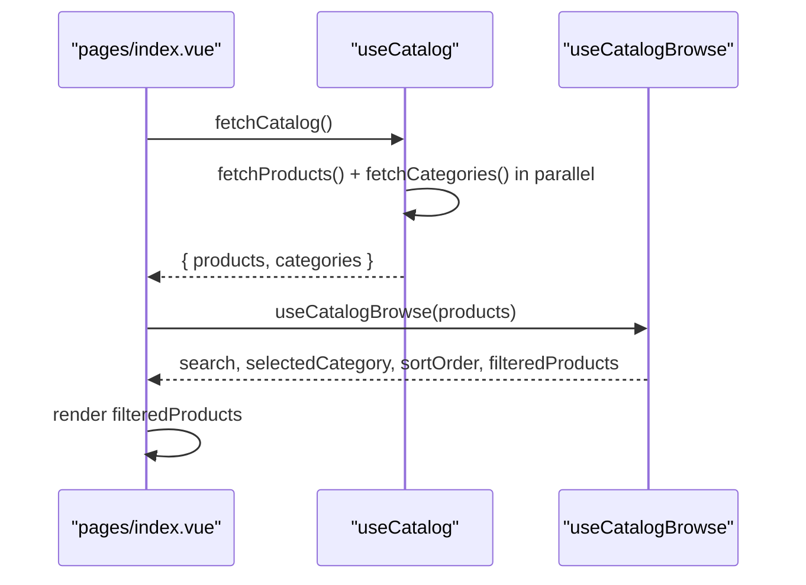
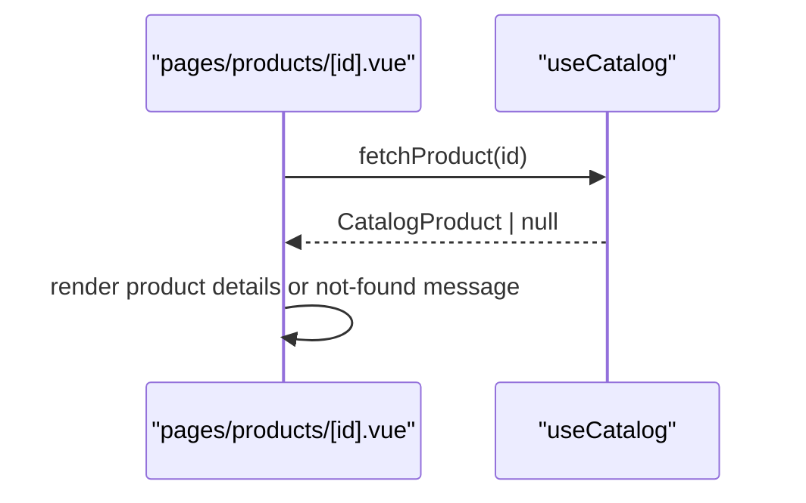
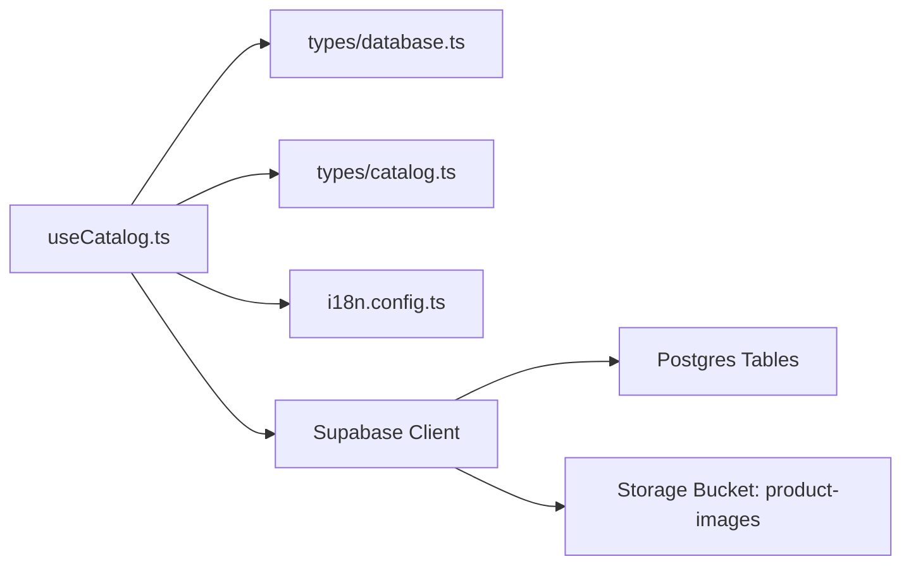

# Catalog Composable

<cite>
**Referenced Files in This Document**
- [useCatalog.ts](file://app/composables/useCatalog.ts)
- [catalog.ts](file://app/types/catalog.ts)
- [database.ts](file://app/types/database.ts)
- [i18n.config.ts](file://i18n.config.ts)
- [20260922000002_storage_and_rls.sql](file://supabase/migrations/20260922000002_storage_and_rls.sql)
- [index.vue](file://app/pages/index.vue)
- [products/[id].vue](file://app/pages/products/[id].vue)
</cite>

## Table of Contents
1. [Introduction](#introduction)
2. [Project Structure](#project-structure)
3. [Core Components](#core-components)
4. [Architecture Overview](#architecture-overview)
5. [Detailed Component Analysis](#detailed-component-analysis)
6. [Dependency Analysis](#dependency-analysis)
7. [Performance Considerations](#performance-considerations)
8. [Troubleshooting Guide](#troubleshooting-guide)
9. [Conclusion](#conclusion)

## Introduction
This document explains the useCatalog composable that centralizes all product and category data operations for the catalog feature. It covers architecture, data fetching, mapping and transformation logic, internationalization support, image URL generation via Supabase storage, usage examples in components, error handling patterns, and performance considerations including query optimization and caching strategies.

## Project Structure
The catalog feature is implemented as a Nuxt composable with strongly typed interfaces and Supabase integration:
- Composable: app/composables/useCatalog.ts
- Types: app/types/catalog.ts (domain types), app/types/database.ts (Supabase schema types)
- Internationalization: i18n.config.ts
- Storage policies: supabase/migrations/20260922000002_storage_and_rls.sql
- Usage examples: app/pages/index.vue (list view, via `fetchCatalog()`), app/pages/products/[id].vue (detail view, via `fetchProduct()`). Both pages read catalog data through this composable only — neither issues its own `products`/`categories` query.

**Diagram sources**
- [useCatalog.ts:1-115](file://app/composables/useCatalog.ts#L1-L115)
- [catalog.ts:1-31](file://app/types/catalog.ts#L1-L31)
- [database.ts:77-163](file://app/types/database.ts#L77-L163)
- [20260922000002_storage_and_rls.sql:162-205](file://supabase/migrations/20260922000002_storage_and_rls.sql#L162-L205)

**Section sources**
- [useCatalog.ts:1-115](file://app/composables/useCatalog.ts#L1-L115)
- [catalog.ts:1-31](file://app/types/catalog.ts#L1-L31)
- [database.ts:77-163](file://app/types/database.ts#L77-L163)
- [i18n.config.ts:1-14](file://i18n.config.ts#L1-L14)
- [20260922000002_storage_and_rls.sql:162-205](file://supabase/migrations/20260922000002_storage_and_rls.sql#L162-L205)

## Core Components
- useCatalog composable exposes:
  - fetchCatalog(): loads published products and active categories concurrently, returning `{ products, categories }` — the entry point used by the home page
  - fetchProducts(): returns an array of CatalogProduct
  - fetchProduct(id): returns a single CatalogProduct or null
  - fetchCategories(): returns an array of CatalogCategory
  - parseSpecifications(text): editor input (JSON, or `label: value` per line) into the stored jsonb shape
  - formatSpecifications(value): the stored jsonb shape back into editor text
- Internal helpers:
  - mapProduct(row) / mapCategory(row): transform raw Supabase rows into CatalogProduct / CatalogCategory
  - pickTranslation(rows): the one locale resolution used everywhere — current locale → `en` → first available
  - publicImageUrl(storagePath): resolves public URLs for images

Browsing state (search query, sort order, selected category and the derived `filteredProducts`) is **not** part of `useCatalog`. It lives in `useCatalogBrowse`, which takes the loaded list and returns the subset to render. Data access and view state stay separate.

Typing rule: the Supabase client is used as `useSupabaseClient<Database>()` with no `as any`, and the row types passed to the mappers are **derived from the queries themselves** (`ProductRow`, `CategoryRow`). Dropping a column from a select string therefore breaks the mapper at compile time rather than handing the view an `undefined`.

Key responsibilities:
- Query products and categories from Supabase with selective fields
- Apply internationalization to product and category names
- Normalize and sort product images
- Generate public image URLs using Supabase storage

**Section sources**
- [useCatalog.ts:12-114](file://app/composables/useCatalog.ts#L12-L114)
- [catalog.ts:1-31](file://app/types/catalog.ts#L1-L31)

## Architecture Overview
The composable encapsulates data access and transformation behind a simple API. Consumers call fetch methods; errors are thrown for database failures; mapping ensures consistent domain models.

**Diagram sources**
- [useCatalog.ts:90-100](file://app/composables/useCatalog.ts#L90-L100)
- [useCatalog.ts:25-29](file://app/composables/useCatalog.ts#L25-L29)

## Detailed Component Analysis

### useCatalog Composable
Responsibilities:
- Initialize Supabase client and i18n locale
- Provide fetchCatalog, fetchProducts, fetchProduct, fetchCategories
- Provide the specification parse/format pair used by the admin editor
- Map raw rows to CatalogProduct with locale-aware names and sorted images
- Resolve public image URLs

Data flow highlights:
- Selects only necessary columns to reduce payload size
- Filters published products and orders by newest
- Maps translations based on current locale with fallback to English
- Sorts images by sort_order and attaches public URLs

Error handling:
- Database errors are thrown to callers
- Single-product fetch returns null when not found

Internationalization:
- Uses current locale to resolve product name, short description, full description, and category name
- Falls back to English if the current locale translation is missing

Image URL generation:
- If storage path is already an absolute URL, it is returned as-is
- Otherwise, uses Supabase storage bucket product-images to generate a public URL

**Diagram sources**
- [useCatalog.ts:42-63](file://app/composables/useCatalog.ts#L42-L63)

**Section sources**
- [useCatalog.ts:12-114](file://app/composables/useCatalog.ts#L12-L114)
- [catalog.ts:1-31](file://app/types/catalog.ts#L1-L31)
- [i18n.config.ts:1-14](file://i18n.config.ts#L1-L14)

### Data Models
- CatalogProduct: normalized product model used across the UI
- CatalogCategory: normalized category model used for navigation
- Database types define Supabase table schemas for type safety

**Diagram sources**
- [catalog.ts:1-31](file://app/types/catalog.ts#L1-L31)

**Section sources**
- [catalog.ts:1-31](file://app/types/catalog.ts#L1-L31)
- [database.ts:77-163](file://app/types/database.ts#L77-L163)

### API Methods

#### fetchProducts
- Purpose: Retrieve all published products with related translations, images, and categories
- Parameters: none
- Return type: Promise<CatalogProduct[]>
- Error handling: throws on database errors
- Notes: Orders by created_at descending; selects minimal fields

Usage example:
- Reached through `fetchCatalog()` from the home page loader

**Section sources**
- [useCatalog.ts:90-94](file://app/composables/useCatalog.ts#L90-L94)
- [index.vue:46-56](file://app/pages/index.vue#L46-L56)

#### fetchProduct
- Purpose: Retrieve a single published product by id
- Parameters: id (string)
- Return type: Promise<CatalogProduct | null>
- Error handling: throws on database errors; returns null if not found
- Notes: Uses maybeSingle to handle zero-or-one result

Usage example:
- See detail page load flow

**Section sources**
- [useCatalog.ts:96-100](file://app/composables/useCatalog.ts#L96-L100)
- [products/[id].vue:10-20](file://app/pages/products/[id].vue#L10-L20)

#### fetchCategories
- Purpose: Retrieve active categories with localized names
- Parameters: none
- Return type: Promise<CatalogCategory[]>
- Error handling: throws on database errors
- Notes: Orders by sort_order; resolves category name by locale with fallback

Usage example:
- Reached through `fetchCatalog()` from the home page loader

**Section sources**
- [useCatalog.ts:102-107](file://app/composables/useCatalog.ts#L102-L107)
- [index.vue:46-56](file://app/pages/index.vue#L46-L56)

#### fetchCatalog
- Purpose: Load everything the catalog landing page needs in one call
- Parameters: none
- Return type: Promise<{ products: CatalogProduct[]; categories: CatalogCategory[] }>
- Error handling: propagates the first rejection from either query; the page turns it into `loadError`
- Notes: Runs `fetchProducts()` and `fetchCategories()` concurrently via `Promise.all`. This is the only catalog entry point the home page uses — the page keeps no query or row mapper of its own

**Section sources**
- [useCatalog.ts:109-112](file://app/composables/useCatalog.ts#L109-L112)
- [index.vue:46-56](file://app/pages/index.vue#L46-L56)

### Image URL Generation System
- Bucket: product-images
- Behavior:
  - If storage path is already an absolute URL, return it unchanged
  - Otherwise, request a public URL from Supabase storage
- Policies:
  - Public read access allowed for the product-images bucket
  - Admin-only write/update/delete policies enforced

**Diagram sources**
- [useCatalog.ts:25-29](file://app/composables/useCatalog.ts#L25-L29)
- [20260922000002_storage_and_rls.sql:162-205](file://supabase/migrations/20260922000002_storage_and_rls.sql#L162-L205)

**Section sources**
- [useCatalog.ts:25-29](file://app/composables/useCatalog.ts#L25-L29)
- [20260922000002_storage_and_rls.sql:162-205](file://supabase/migrations/20260922000002_storage_and_rls.sql#L162-L205)

### Internationalization Support
- Product translations:
  - Name, short description, full description resolved by current locale
  - Fallback chain: current locale → English → first available translation
- Category names:
  - Resolved by current locale with fallback to English, then slug
- Configuration:
  - Default locale and messages defined in i18n config

**Section sources**
- [useCatalog.ts:32-68](file://app/composables/useCatalog.ts#L32-L68)
- [i18n.config.ts:1-14](file://i18n.config.ts#L1-L14)

### Usage Examples

#### In List Page
- Call `fetchCatalog()` once, which loads categories and products concurrently
- Assign the returned `products` / `categories` to page state
- Display loading states and errors
- Hand the loaded list to `useCatalogBrowse` for search, sort and category filtering

The page does not query Supabase for catalog rows and does not map rows itself; both live behind `useCatalog`.

**Diagram sources**
- [index.vue:46-56](file://app/pages/index.vue#L46-L56)
- [useCatalog.ts:109-112](file://app/composables/useCatalog.ts#L109-L112)
- [useCatalogBrowse.ts:13-38](file://app/composables/useCatalogBrowse.ts#L13-L38)

**Section sources**
- [index.vue:46-56](file://app/pages/index.vue#L46-L56)
- [useCatalogBrowse.ts:1-39](file://app/composables/useCatalogBrowse.ts#L1-L39)

#### In Detail Page
- Fetch a single product by id
- Handle not-found state and errors
- Render gallery and specs

**Diagram sources**
- [products/[id].vue:10-20](file://app/pages/products/[id].vue#L10-L20)
- [useCatalog.ts:96-100](file://app/composables/useCatalog.ts#L96-L100)

**Section sources**
- [products/[id].vue:10-20](file://app/pages/products/[id].vue#L10-L20)

## Dependency Analysis
- useCatalog depends on:
  - Supabase client for queries and storage
  - i18n for locale resolution
  - Domain types for strong typing
- External integrations:
  - Supabase Postgres tables: products, product_translations, product_images, categories, category_translations
  - Supabase Storage bucket: product-images

**Diagram sources**
- [useCatalog.ts:1-115](file://app/composables/useCatalog.ts#L1-L115)
- [database.ts:77-163](file://app/types/database.ts#L77-L163)
- [catalog.ts:1-31](file://app/types/catalog.ts#L1-L31)
- [i18n.config.ts:1-14](file://i18n.config.ts#L1-L14)

**Section sources**
- [useCatalog.ts:1-115](file://app/composables/useCatalog.ts#L1-L115)
- [database.ts:77-163](file://app/types/database.ts#L77-L163)
- [catalog.ts:1-31](file://app/types/catalog.ts#L1-L31)
- [i18n.config.ts:1-14](file://i18n.config.ts#L1-L14)

## Performance Considerations
- Query optimization:
  - Use explicit field selection to minimize payload size
  - Filter at the database level (status = published, is_active = true)
  - Order results server-side (created_at desc, sort_order asc)
- Caching strategies:
  - Cache fetched lists and single items in component state or a global store
  - Invalidate cache on mutations (add/edit/delete)
  - Consider Nuxt’s built-in data fetching utilities or third-party caches for SSR/CSR scenarios
- Image handling:
  - Avoid redundant getPublicUrl calls by caching generated URLs per storage path
  - Prefer absolute URLs when possible to bypass storage calls
- Concurrency:
  - Fetch categories and products in parallel where appropriate
- Memory and rendering:
  - Limit number of images loaded initially; lazy-load thumbnails
  - Defer heavy computations (e.g., spec parsing) until needed

[No sources needed since this section provides general guidance]

## Troubleshooting Guide
Common issues and resolutions:
- Missing Supabase configuration:
  - Ensure environment variables for Supabase URL and service role key are set
- Storage policy errors:
  - Verify product-images bucket policies allow public reads and admin writes
- Locale fallback:
  - If translations are missing for the current locale, ensure English fallback exists
- Not found product:
  - fetchProduct returns null; display a friendly not-found message
- Network errors:
  - Catch thrown errors and show user-friendly messages

**Section sources**
- [useCatalog.ts:90-112](file://app/composables/useCatalog.ts#L90-L112)
- [20260922000002_storage_and_rls.sql:162-205](file://supabase/migrations/20260922000002_storage_and_rls.sql#L162-L205)

## Conclusion
The useCatalog composable provides a clean, typed, and internationalized interface for catalog data. It centralizes querying, mapping, and image URL resolution while keeping consumers simple. By following the recommended query optimizations, caching strategies, and error handling patterns, applications can deliver fast, reliable catalog experiences.