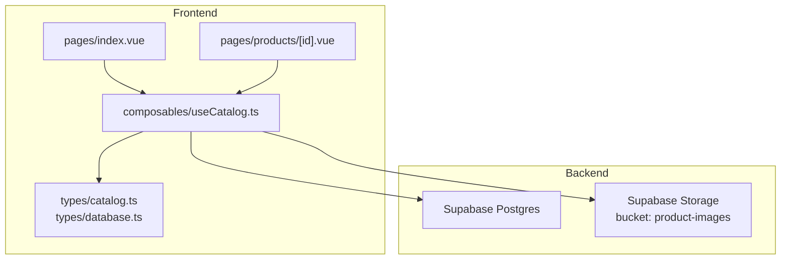
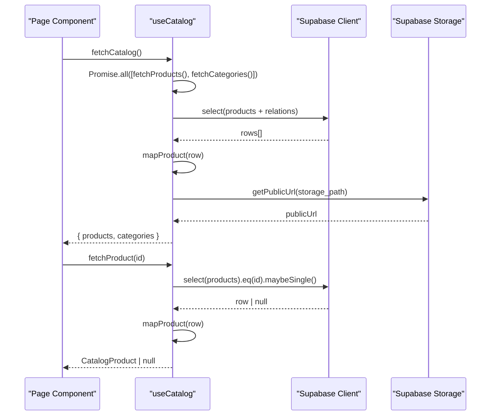
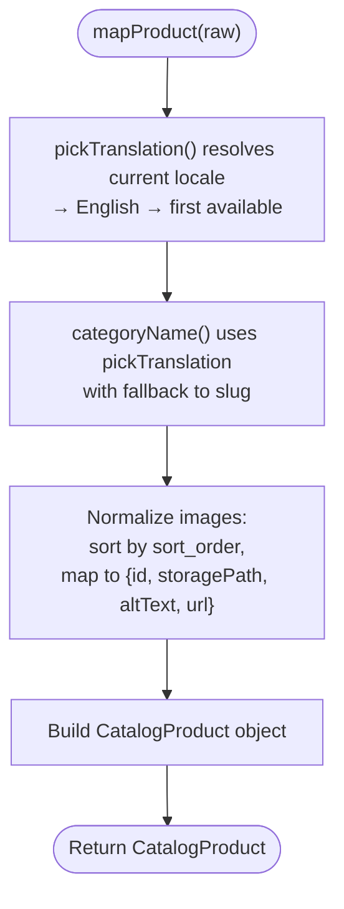
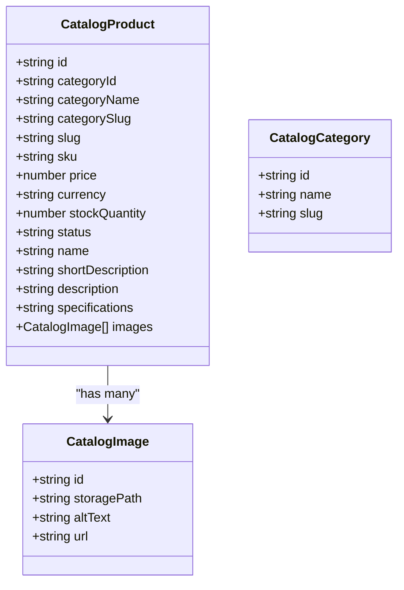
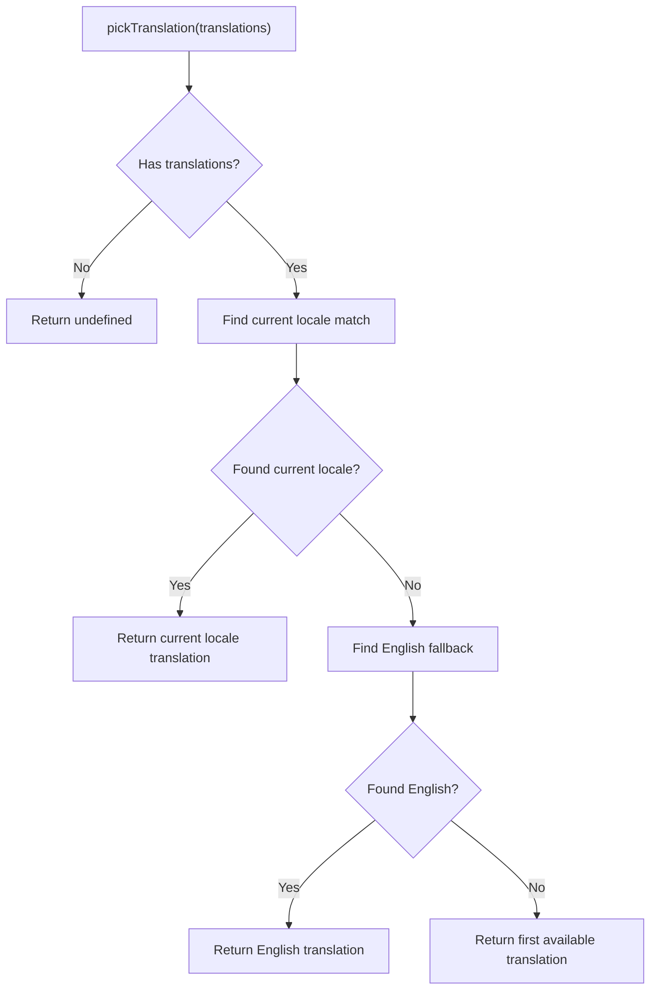
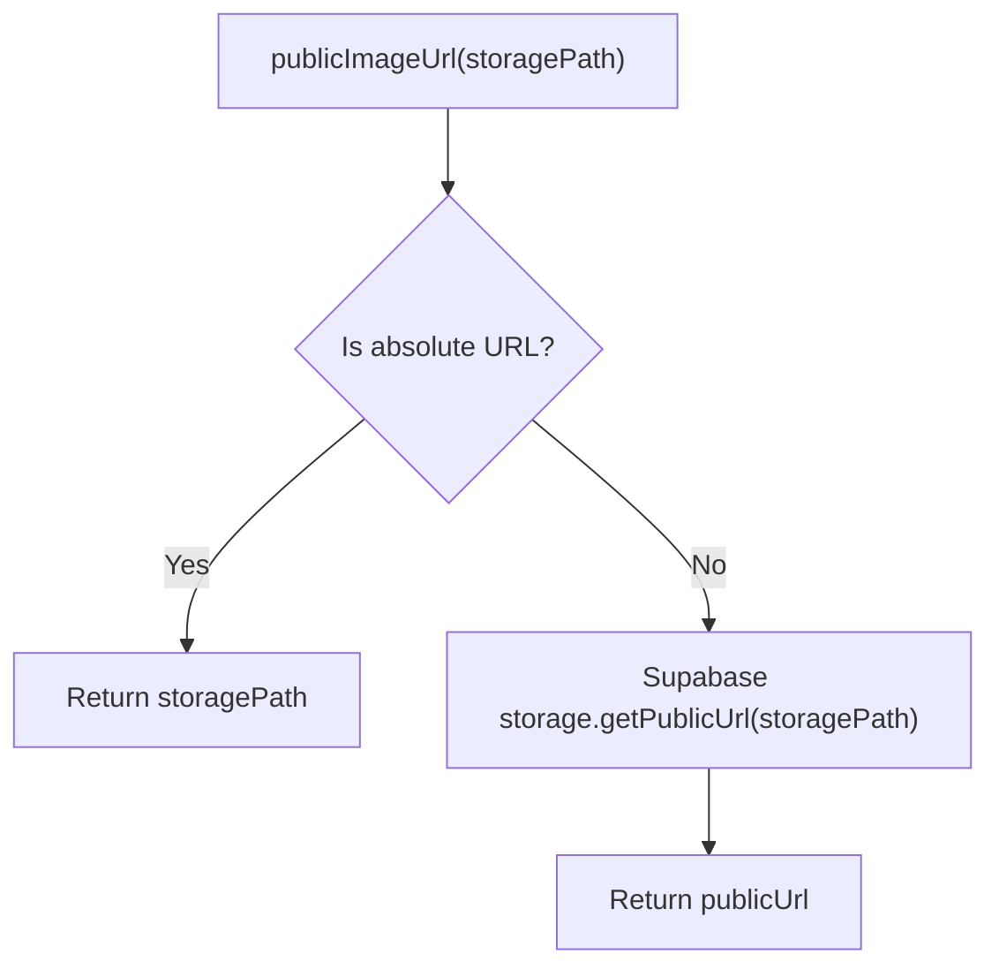
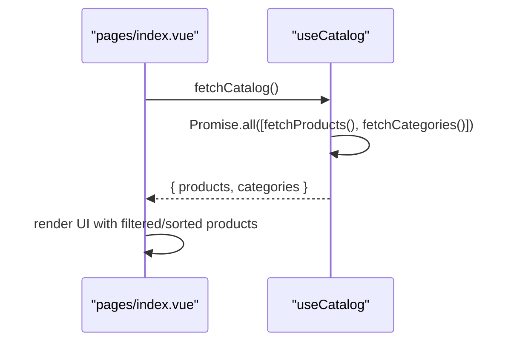
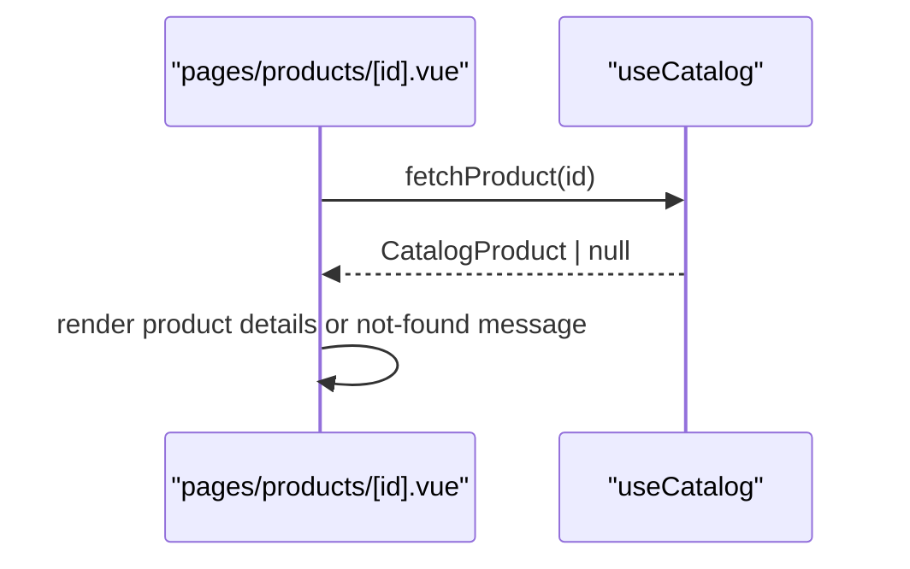
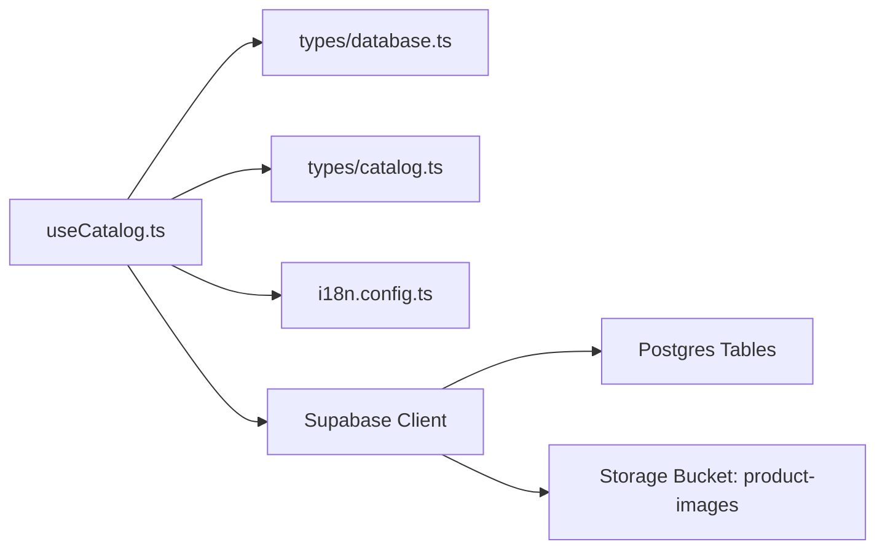

# Catalog Composable

<cite>
**Referenced Files in This Document**
- [useCatalog.ts](file://app/composables/useCatalog.ts)
- [catalog.ts](file://app/types/catalog.ts)
- [database.ts](file://app/types/database.ts)
- [i18n.config.ts](file://i18n.config.ts)
- [index.vue](file://app/pages/index.vue)
- [products/[id].vue](file://app/pages/products/[id].vue)
</cite>

## Update Summary
**Changes Made**
- Added unified `fetchCatalog()` method for consolidated product and category fetching
- Enhanced type safety with improved TypeScript inference for query results
- Introduced shared `pickTranslation` helper for consistent locale fallback handling
- Updated usage examples to demonstrate the new unified API

## Table of Contents
1. [Introduction](#introduction)
2. [Project Structure](#project-structure)
3. [Core Components](#core-components)
4. [Architecture Overview](#architecture-overview)
5. [Detailed Component Analysis](#detailed-component-analysis)
6. [Dependency Analysis](#dependency-analysis)
7. [Performance Considerations](#performance-considerations)
8. [Troubleshooting Guide](#troubleshooting-guide)
9. [Conclusion](#conclusion)

## Introduction
This document explains the useCatalog composable that centralizes all product and category data operations for the catalog feature. It covers architecture, data fetching, mapping and transformation logic, internationalization support, image URL generation via Supabase storage, usage examples in components, error handling patterns, and performance considerations including query optimization and caching strategies.

**Updated** Enhanced with unified fetchCatalog() method that consolidates product and category fetching, improved type safety with proper TypeScript inference, and added shared translation resolution helper (pickTranslation) for consistent locale fallback handling.

## Project Structure
The catalog feature is implemented as a Nuxt composable with strongly typed interfaces and Supabase integration:
- Composable: app/composables/useCatalog.ts
- Types: app/types/catalog.ts (domain types), app/types/database.ts (Supabase schema types)
- Internationalization: i18n.config.ts
- Usage examples: app/pages/index.vue (list view), app/pages/products/[id].vue (detail view)

**Diagram sources**
- [useCatalog.ts:1-116](file://app/composables/useCatalog.ts#L1-L116)
- [catalog.ts:1-31](file://app/types/catalog.ts#L1-L31)
- [database.ts:81-164](file://app/types/database.ts#L81-L164)

**Section sources**
- [useCatalog.ts:1-116](file://app/composables/useCatalog.ts#L1-L116)
- [catalog.ts:1-31](file://app/types/catalog.ts#L1-L31)
- [database.ts:81-164](file://app/types/database.ts#L81-L164)
- [i18n.config.ts:1-14](file://i18n.config.ts#L1-L14)

## Core Components
- useCatalog composable exposes:
  - fetchCatalog(): returns both products and categories in a single call
  - fetchProducts(): returns an array of CatalogProduct
  - fetchProduct(id): returns a single CatalogProduct or null
  - fetchCategories(): returns an array of CatalogCategory
  - parseSpecifications(value): converts editor input to database format
  - formatSpecifications(value): converts database format to editor display
- Internal helpers:
  - pickTranslation(translations): resolves translations with consistent locale fallback
  - mapProduct(raw): transforms raw Supabase rows into CatalogProduct
  - publicImageUrl(storagePath): resolves public URLs for images

Key responsibilities:
- Query products and categories from Supabase with selective fields
- Apply internationalization to product and category names using shared translation resolution
- Normalize and sort product images
- Generate public image URLs using Supabase storage
- Provide unified data access through fetchCatalog()

**Updated** Added unified fetchCatalog() method and shared pickTranslation helper for consistent locale handling.

**Section sources**
- [useCatalog.ts:12-115](file://app/composables/useCatalog.ts#L12-L115)
- [catalog.ts:1-31](file://app/types/catalog.ts#L1-L31)

## Architecture Overview
The composable encapsulates data access and transformation behind a simple API. Consumers call fetch methods; errors are thrown for database failures; mapping ensures consistent domain models. The new unified fetchCatalog() method provides a convenient way to load both products and categories simultaneously.

**Diagram sources**
- [useCatalog.ts:109-112](file://app/composables/useCatalog.ts#L109-L112)
- [useCatalog.ts:90-106](file://app/composables/useCatalog.ts#L90-L106)

## Detailed Component Analysis

### useCatalog Composable
Responsibilities:
- Initialize Supabase client and i18n locale
- Provide unified fetchCatalog and individual fetch methods
- Map raw rows to CatalogProduct with i18n-aware names and sorted images
- Resolve public image URLs
- Handle specification parsing and formatting

Data flow highlights:
- Selects only necessary columns to reduce payload size
- Filters published products and orders by newest
- Uses shared pickTranslation helper for consistent locale resolution
- Sorts images by sort_order and attaches public URLs
- Provides unified data loading through fetchCatalog()

Error handling:
- Database errors are thrown to callers
- Single-product fetch returns null when not found

Internationalization:
- Uses current locale to resolve product name, short description, full description, and category name
- Falls back to English if the current locale translation is missing
- Shared pickTranslation helper ensures consistent locale fallback behavior

Image URL generation:
- If storage path is already an absolute URL, it is returned as-is
- Otherwise, uses Supabase storage bucket product-images to generate a public URL

**Updated** Enhanced with shared pickTranslation helper for consistent locale resolution across products and categories.

**Diagram sources**
- [useCatalog.ts:32-35](file://app/composables/useCatalog.ts#L32-L35)
- [useCatalog.ts:42-63](file://app/composables/useCatalog.ts#L42-L63)

**Section sources**
- [useCatalog.ts:12-115](file://app/composables/useCatalog.ts#L12-L115)
- [catalog.ts:1-31](file://app/types/catalog.ts#L1-L31)
- [i18n.config.ts:1-14](file://i18n.config.ts#L1-L14)

### Data Models
- CatalogProduct: normalized product model used across the UI
- CatalogCategory: normalized category model used for navigation
- Database types define Supabase table schemas for type safety

**Diagram sources**
- [catalog.ts:1-31](file://app/types/catalog.ts#L1-L31)

**Section sources**
- [catalog.ts:1-31](file://app/types/catalog.ts#L1-L31)
- [database.ts:81-164](file://app/types/database.ts#L81-L164)

### API Methods

#### fetchCatalog
- Purpose: Retrieve both products and categories in a single call for optimal performance
- Parameters: none
- Return type: Promise<{ products: CatalogProduct[], categories: CatalogCategory[] }>
- Error handling: throws on database errors
- Notes: Uses Promise.all to fetch both datasets concurrently

Usage example:
- See list page unified loading pattern

**Updated** New unified method that consolidates product and category fetching for better performance and simpler API usage.

**Section sources**
- [useCatalog.ts:109-112](file://app/composables/useCatalog.ts#L109-L112)
- [index.vue:46-56](file://app/pages/index.vue#L46-L56)

#### fetchProducts
- Purpose: Retrieve all published products with related translations, images, and categories
- Parameters: none
- Return type: Promise<CatalogProduct[]>
- Error handling: throws on database errors
- Notes: Orders by created_at descending; selects minimal fields

Usage example:
- See list page loading and mapping logic

**Section sources**
- [useCatalog.ts:90-94](file://app/composables/useCatalog.ts#L90-L94)
- [index.vue:46-56](file://app/pages/index.vue#L46-L56)

#### fetchProduct
- Purpose: Retrieve a single published product by id
- Parameters: id (string)
- Return type: Promise<CatalogProduct | null>
- Error handling: throws on database errors; returns null if not found
- Notes: Uses maybeSingle to handle zero-or-one result

Usage example:
- See detail page load flow

**Section sources**
- [useCatalog.ts:96-100](file://app/composables/useCatalog.ts#L96-L100)
- [products/[id].vue:10-20](file://app/pages/products/[id].vue#L10-L20)

#### fetchCategories
- Purpose: Retrieve active categories with localized names
- Parameters: none
- Return type: Promise<CatalogCategory[]>
- Error handling: throws on database errors
- Notes: Orders by sort_order; resolves category name by locale with fallback

Usage example:
- See list page category loading

**Section sources**
- [useCatalog.ts:102-106](file://app/composables/useCatalog.ts#L102-L106)
- [index.vue:105-115](file://app/pages/index.vue#L105-L115)

### Translation Resolution Helper
The shared `pickTranslation` helper provides consistent locale fallback handling across the application:

- Priority order: current locale → English ('en') → first available translation
- Used by both product and category translation resolution
- Ensures consistent behavior throughout the application
- Generic type support for different translation structures

**Updated** New shared helper that ensures consistent locale fallback behavior across products and categories.

**Diagram sources**
- [useCatalog.ts:32-35](file://app/composables/useCatalog.ts#L32-L35)

**Section sources**
- [useCatalog.ts:32-35](file://app/composables/useCatalog.ts#L32-L35)

### Image URL Generation System
- Bucket: product-images
- Behavior:
  - If storage path is already an absolute URL, return it unchanged
  - Otherwise, request a public URL from Supabase storage
- Policies:
  - Public read access allowed for the product-images bucket
  - Admin-only write/update/delete policies enforced

**Diagram sources**
- [useCatalog.ts:25-28](file://app/composables/useCatalog.ts#L25-L28)

**Section sources**
- [useCatalog.ts:25-28](file://app/composables/useCatalog.ts#L25-L28)

### Internationalization Support
- Product translations:
  - Name, short description, full description resolved by current locale
  - Fallback chain: current locale → English → first available translation
- Category names:
  - Resolved by current locale with fallback to English, then slug
- Configuration:
  - Default locale and messages defined in i18n config
- Shared translation resolution:
  - Consistent locale fallback behavior across all entities

**Updated** Enhanced with shared pickTranslation helper for consistent locale handling.

**Section sources**
- [useCatalog.ts:32-35](file://app/composables/useCatalog.ts#L32-L35)
- [useCatalog.ts:42-63](file://app/composables/useCatalog.ts#L42-L63)
- [i18n.config.ts:1-14](file://i18n.config.ts#L1-L14)

### Usage Examples

#### Unified Catalog Loading
- Load both categories and products concurrently using fetchCatalog()
- Simplified error handling and state management
- Optimal performance through parallel data fetching

**Updated** Demonstrates the new unified fetchCatalog() method for simplified data loading.

**Diagram sources**
- [index.vue:46-56](file://app/pages/index.vue#L46-L56)
- [useCatalog.ts:109-112](file://app/composables/useCatalog.ts#L109-L112)

**Section sources**
- [index.vue:46-56](file://app/pages/index.vue#L46-L56)

#### In Detail Page
- Fetch a single product by id
- Handle not-found state and errors
- Render gallery and specs

**Diagram sources**
- [products/[id].vue:10-20](file://app/pages/products/[id].vue#L10-L20)
- [useCatalog.ts:96-100](file://app/composables/useCatalog.ts#L96-L100)

**Section sources**
- [products/[id].vue:10-20](file://app/pages/products/[id].vue#L10-L20)

## Dependency Analysis
- useCatalog depends on:
  - Supabase client for queries and storage
  - i18n for locale resolution
  - Domain types for strong typing
- External integrations:
  - Supabase Postgres tables: products, product_translations, product_images, categories, category_translations
  - Supabase Storage bucket: product-images

**Diagram sources**
- [useCatalog.ts:1-116](file://app/composables/useCatalog.ts#L1-L116)
- [database.ts:81-164](file://app/types/database.ts#L81-L164)
- [catalog.ts:1-31](file://app/types/catalog.ts#L1-L31)
- [i18n.config.ts:1-14](file://i18n.config.ts#L1-L14)

**Section sources**
- [useCatalog.ts:1-116](file://app/composables/useCatalog.ts#L1-L116)
- [database.ts:81-164](file://app/types/database.ts#L81-L164)
- [catalog.ts:1-31](file://app/types/catalog.ts#L1-L31)
- [i18n.config.ts:1-14](file://i18n.config.ts#L1-L14)

## Performance Considerations
- Query optimization:
  - Use explicit field selection to minimize payload size
  - Filter at the database level (status = published, is_active = true)
  - Order results server-side (created_at desc, sort_order asc)
- Caching strategies:
  - Cache fetched lists and single items in component state or a global store
  - Invalidate cache on mutations (add/edit/delete)
  - Consider Nuxt's built-in data fetching utilities or third-party caches for SSR/CSR scenarios
- Image handling:
  - Avoid redundant getPublicUrl calls by caching generated URLs per storage path
  - Prefer absolute URLs when possible to bypass storage calls
- Concurrency:
  - Use fetchCatalog() to fetch categories and products in parallel where appropriate
  - Leverage Promise.all for optimal performance
- Memory and rendering:
  - Limit number of images loaded initially; lazy-load thumbnails
  - Defer heavy computations (e.g., spec parsing) until needed

**Updated** Added guidance for using the new unified fetchCatalog() method for optimal performance.

[No sources needed since this section provides general guidance]

## Troubleshooting Guide
Common issues and resolutions:
- Missing Supabase configuration:
  - Ensure environment variables for Supabase URL and service role key are set
- Storage policy errors:
  - Verify product-images bucket policies allow public reads and admin writes
- Locale fallback:
  - If translations are missing for the current locale, ensure English fallback exists
  - The shared pickTranslation helper ensures consistent fallback behavior
- Not found product:
  - fetchProduct returns null; display a friendly not-found message
- Network errors:
  - Catch thrown errors and show user-friendly messages
- Type inference issues:
  - The enhanced type system should provide compile-time feedback for missing columns

**Updated** Added guidance for the shared pickTranslation helper and enhanced type inference.

**Section sources**
- [useCatalog.ts:90-112](file://app/composables/useCatalog.ts#L90-L112)
- [useCatalog.ts:32-35](file://app/composables/useCatalog.ts#L32-L35)

## Conclusion
The useCatalog composable provides a clean, typed, and internationalized interface for catalog data. With the new unified fetchCatalog() method, developers can easily load both products and categories in a single call, while the shared pickTranslation helper ensures consistent locale fallback behavior. The enhanced type system provides better compile-time safety, and the existing mapping and image URL resolution capabilities remain robust. By following the recommended query optimizations, caching strategies, and error handling patterns, applications can deliver fast, reliable catalog experiences.

**Updated** Enhanced with unified data loading, consistent translation resolution, and improved type safety for better developer experience and application performance.