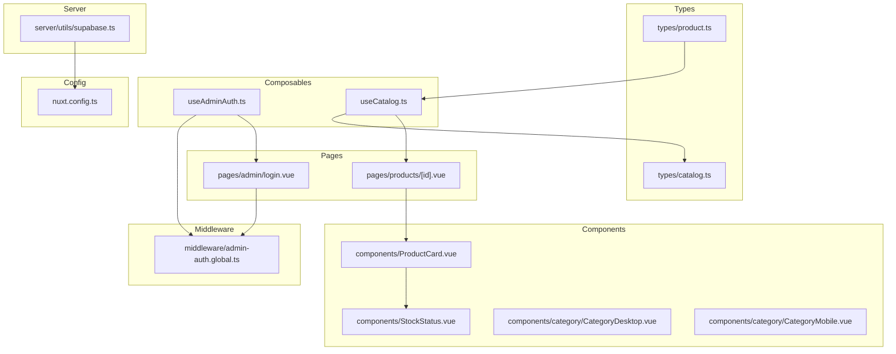
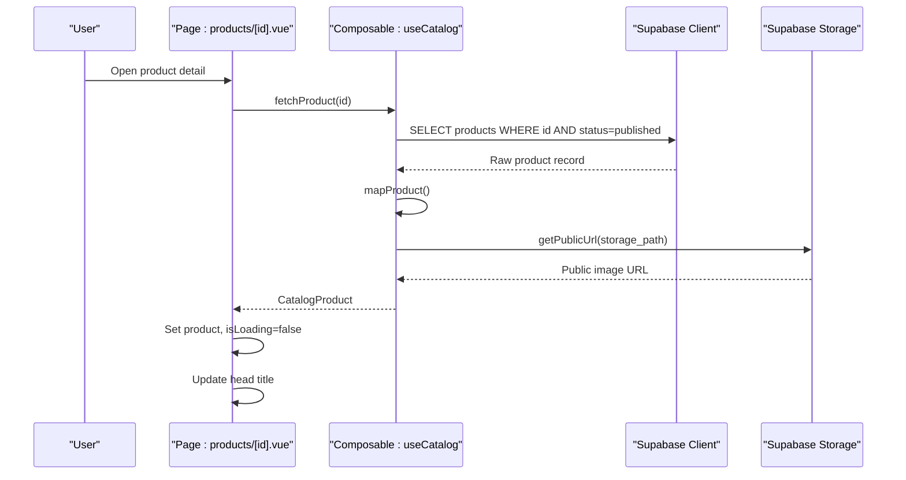
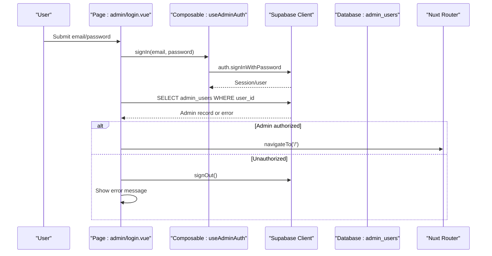
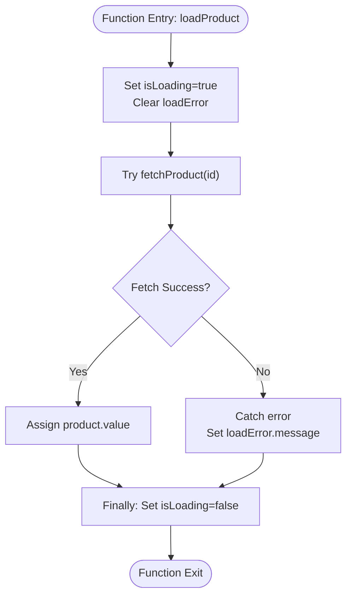
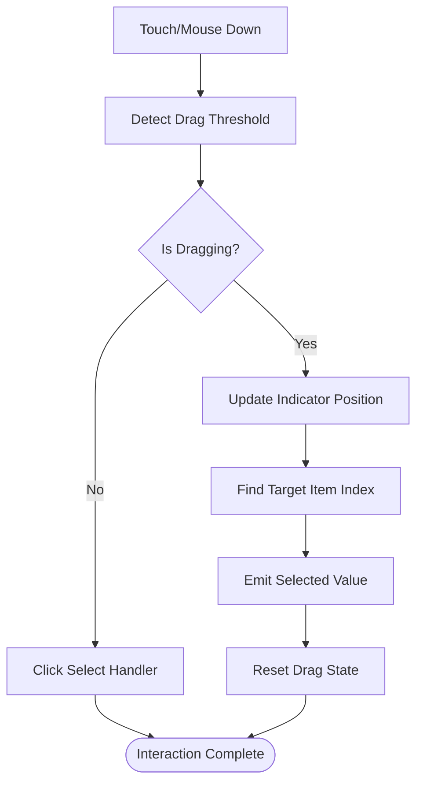
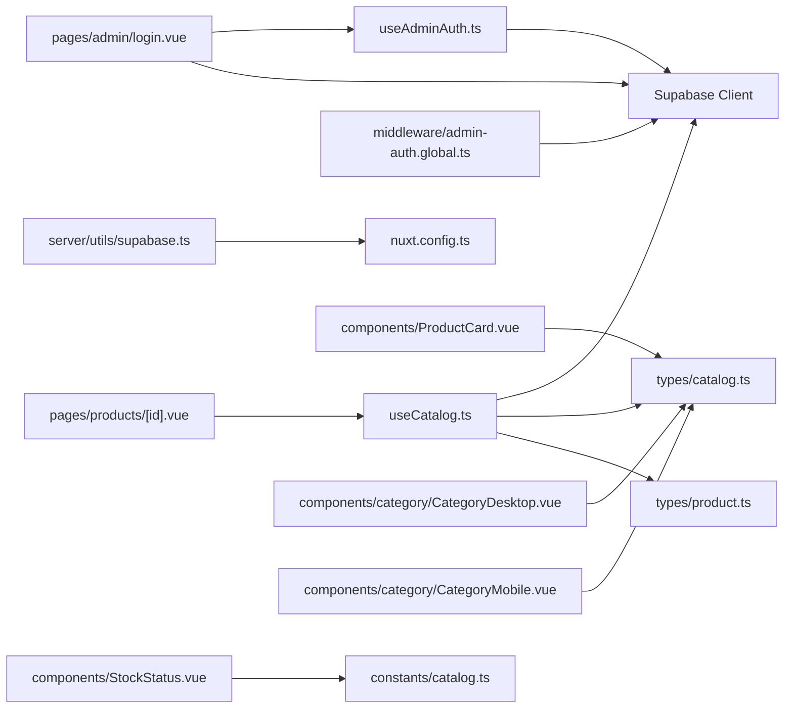

# State Management Patterns

<cite>
**Referenced Files in This Document**   
- [useAdminAuth.ts](file://app/composables/useAdminAuth.ts)
- [useCatalog.ts](file://app/composables/useCatalog.ts)
- [products/[id].vue](file://app/pages/products/[id].vue)
- [admin/login.vue](file://app/pages/admin/login.vue)
- [ProductCard.vue](file://app/components/ProductCard.vue)
- [StockStatus.vue](file://app/components/StockStatus.vue)
- [CategoryDesktop.vue](file://app/components/category/CategoryDesktop.vue)
- [CategoryMobile.vue](file://app/components/category/CategoryMobile.vue)
- [catalog.ts](file://app/types/catalog.ts)
- [product.ts](file://app/types/product.ts)
- [supabase.ts](file://server/utils/supabase.ts)
- [admin-auth.global.ts](file://app/middleware/admin-auth.global.ts)
- [nuxt.config.ts](file://nuxt.config.ts)
</cite>

## Table of Contents
1. [Introduction](#introduction)
2. [Project Structure](#project-structure)
3. [Core Components](#core-components)
4. [Architecture Overview](#architecture-overview)
5. [Detailed Component Analysis](#detailed-component-analysis)
6. [Dependency Analysis](#dependency-analysis)
7. [Performance Considerations](#performance-considerations)
8. [Troubleshooting Guide](#troubleshooting-guide)
9. [Conclusion](#conclusion)
10. [Appendices](#appendices)

## Introduction
This document explains how state is managed across the application using Vue 3 composables and Nuxt’s reactive system. It focuses on:
- Local component state patterns with refs, computed values, and watchers
- Asynchronous data fetching and error handling inside composables and pages
- Data consistency between Supabase-backed catalog data and UI state
- Caching strategies for product data and authentication state persistence
- Shared state between components through props, emits, and route-level navigation
- Error states and loading states
- Performance considerations such as debouncing, throttling, requestAnimationFrame, and efficient reactivity
- Guidelines for creating custom composables that follow established patterns

The application uses:
- Vue 3 Composition API for local state
- Nuxt composables for routing, head management, and internationalization
- Supabase client for authentication and data access
- TypeScript interfaces for consistent data shapes

## Project Structure
State-related code is organized into:
- Composables for reusable logic (authentication and catalog data)
- Pages for orchestration and user-facing state
- Components for presentation and local interaction state
- Types for shared data contracts
- Server utilities for secure client configuration
- Middleware for route-level authorization
- Configuration for runtime settings and Supabase integration

**Diagram sources**
- [useAdminAuth.ts:1-79](file://app/composables/useAdminAuth.ts#L1-L79)
- [useCatalog.ts:1-61](file://app/composables/useCatalog.ts#L1-L61)
- [products/[id].vue:1-177](file://app/pages/products/[id].vue#L1-L177)
- [admin/login.vue:1-121](file://app/pages/admin/login.vue#L1-L121)
- [ProductCard.vue:1-68](file://app/components/ProductCard.vue#L1-L68)
- [StockStatus.vue:1-20](file://app/components/StockStatus.vue#L1-L20)
- [CategoryDesktop.vue:1-611](file://app/components/category/CategoryDesktop.vue#L1-L611)
- [CategoryMobile.vue:1-577](file://app/components/category/CategoryMobile.vue#L1-L577)
- [catalog.ts:1-31](file://app/types/catalog.ts#L1-L31)
- [product.ts:1-40](file://app/types/product.ts#L1-L40)
- [supabase.ts:1-20](file://server/utils/supabase.ts#L1-L20)
- [admin-auth.global.ts:1-28](file://app/middleware/admin-auth.global.ts#L1-L28)
- [nuxt.config.ts:1-52](file://nuxt.config.ts#L1-L52)

**Section sources**
- [useAdminAuth.ts:1-79](file://app/composables/useAdminAuth.ts#L1-L79)
- [useCatalog.ts:1-61](file://app/composables/useCatalog.ts#L1-L61)
- [products/[id].vue:1-177](file://app/pages/products/[id].vue#L1-L177)
- [admin/login.vue:1-121](file://app/pages/admin/login.vue#L1-L121)
- [ProductCard.vue:1-68](file://app/components/ProductCard.vue#L1-L68)
- [StockStatus.vue:1-20](file://app/components/StockStatus.vue#L1-L20)
- [CategoryDesktop.vue:1-611](file://app/components/category/CategoryDesktop.vue#L1-L611)
- [CategoryMobile.vue:1-577](file://app/components/category/CategoryMobile.vue#L1-L577)
- [catalog.ts:1-31](file://app/types/catalog.ts#L1-L31)
- [product.ts:1-40](file://app/types/product.ts#L1-L40)
- [supabase.ts:1-20](file://server/utils/supabase.ts#L1-L20)
- [admin-auth.global.ts:1-28](file://app/middleware/admin-auth.global.ts#L1-L28)
- [nuxt.config.ts:1-52](file://nuxt.config.ts#L1-L52)

## Core Components
This section analyzes the core stateful modules and their responsibilities.

### Authentication Composable: useAdminAuth
Responsibilities:
- Access current user via Supabase
- Check admin and super-admin roles by querying admin_users
- Provide signIn and signOut functions
- Expose a reactive user reference from the Supabase plugin

Key behaviors:
- getCurrentUser returns either the authenticated user or null
- isAdmin and isSuperAdmin query admin_users and return boolean flags
- signIn throws errors to callers; signOut throws on failure
- The composable exposes user, isAdmin, isSuperAdmin, signIn, signOut

Error handling:
- Errors from role checks are logged and treated as unauthorized
- signIn and signOut propagate errors to calling code

Reactive state:
- user is provided by the Supabase plugin and is reactive
- Role checks are asynchronous and do not maintain local cached flags

**Section sources**
- [useAdminAuth.ts:1-79](file://app/composables/useAdminAuth.ts#L1-L79)

### Catalog Composable: useCatalog
Responsibilities:
- Fetch published products and categories from Supabase
- Map raw database records into typed catalog models
- Resolve public image URLs for product images
- Respect i18n locale when selecting translations

Key behaviors:
- fetchProducts returns an array of CatalogProduct
- fetchProduct returns a single CatalogProduct or null
- fetchCategories returns an array of CatalogCategory
- mapProduct normalizes fields, sorts images by sort_order, and resolves public URLs
- select defines a precise column projection to reduce payload size

Caching strategy:
- No explicit in-memory cache is implemented
- Each call performs a fresh network request
- Image URL resolution depends on storage path and may be optimized later

Data consistency:
- All returned objects conform to CatalogProduct and CatalogCategory types
- Translations are selected based on current locale with fallbacks

**Section sources**
- [useCatalog.ts:1-61](file://app/composables/useCatalog.ts#L1-L61)
- [catalog.ts:1-31](file://app/types/catalog.ts#L1-L31)

### Product Detail Page: products/[id].vue
Responsibilities:
- Load a single product by id
- Manage loading and error states
- Parse specifications into structured display items
- Update page title reactively

Local state:
- product holds the fetched CatalogProduct
- isLoading indicates pending data
- loadError captures error messages
- selectedImageIndex tracks active gallery image

Asynchronous flow:
- loadProduct sets isLoading true, attempts fetchProduct, catches errors, and ensures isLoading false in finally
- Head title updates reactively based on product presence

Computed state:
- parsedSpecs converts string-based specifications into structured arrays or falls back to line parsing

UI states:
- Loading skeleton while isLoading
- Error alert when loadError is set
- Not found state when product is null after load
- Full product view with gallery and specs when product exists

**Section sources**
- [products/[id].vue:1-177](file://app/pages/products/[id].vue#L1-L177)

### Admin Login Page: admin/login.vue
Responsibilities:
- Handle email/password login
- Validate required fields
- Call signIn composable
- Verify admin role by checking admin_users table
- Redirect to catalog on success
- Display error messages and manage submitting state

Local state:
- email, password inputs bound to refs
- isSubmitting prevents duplicate submissions
- errorMessage displays validation or auth errors

Flow:
- handleSubmit validates inputs, calls signIn, verifies admin record, redirects on success, and shows errors otherwise
- Head title is reactive based on i18n

**Section sources**
- [admin/login.vue:1-121](file://app/pages/admin/login.vue#L1-L121)

### Product Card Component: ProductCard.vue
Responsibilities:
- Display product summary including image, name, short description, price
- Navigate to product detail
- Optionally show edit button for admin users
- Delegate stock status rendering to StockStatus

Shared state pattern:
- Receives product via props
- Emits edit event with product object for parent handling

**Section sources**
- [ProductCard.vue:1-68](file://app/components/ProductCard.vue#L1-L68)

### Stock Status Component: StockStatus.vue
Responsibilities:
- Compute stock label and styling based on quantity
- Use LOW_STOCK_THRESHOLD constant for low-stock detection

Reactive behavior:
- status computed value reacts to quantity prop changes

**Section sources**
- [StockStatus.vue:1-20](file://app/components/StockStatus.vue#L1-L20)

### Category Navigation Components: CategoryDesktop.vue and CategoryMobile.vue
Responsibilities:
- Render category selection UI for desktop and mobile
- Support drag-to-select interactions
- Emit selected category value to parent via v-model pattern
- Maintain visual indicators and animations

Local state:
- Active index and item references for indicator positioning
- Dragging state, velocity, and highlight index
- Visibility and scroll direction for mobile nav

Reactive patterns:
- computedItems derives display items from props and i18n
- activeIndex computed from modelValue
- Watchers update indicator positions on changes

Performance techniques:
- requestAnimationFrame for smooth drag updates
- ResizeObserver for layout recalculations
- Passive event listeners where appropriate
- nextTick to defer DOM measurements

**Section sources**
- [CategoryDesktop.vue:1-611](file://app/components/category/CategoryDesktop.vue#L1-L611)
- [CategoryMobile.vue:1-577](file://app/components/category/CategoryMobile.vue#L1-L577)

## Architecture Overview
The application follows a layered approach:
- Composables encapsulate business logic and data access
- Pages orchestrate data fetching and present state
- Components focus on presentation and local interaction
- Middleware enforces route-level authorization
- Server utilities provide secure client configuration
- Configuration centralizes runtime settings and module options

**Diagram sources**
- [products/[id].vue:1-177](file://app/pages/products/[id].vue#L1-L177)
- [useCatalog.ts:1-61](file://app/composables/useCatalog.ts#L1-L61)

## Detailed Component Analysis

### Authentication Flow
The authentication flow combines composable methods, middleware guards, and page-level verification.

**Diagram sources**
- [admin/login.vue:1-121](file://app/pages/admin/login.vue#L1-L121)
- [useAdminAuth.ts:1-79](file://app/composables/useAdminAuth.ts#L1-L79)

### Product Detail Loading Flow
The product detail page manages loading, error, and data states while parsing specifications.

**Diagram sources**
- [products/[id].vue:1-177](file://app/pages/products/[id].vue#L1-L177)

### Category Selection Interaction
Both desktop and mobile category components implement drag-to-select with visual feedback.

**Diagram sources**
- [CategoryDesktop.vue:1-611](file://app/components/category/CategoryDesktop.vue#L1-L611)
- [CategoryMobile.vue:1-577](file://app/components/category/CategoryMobile.vue#L1-L577)

## Dependency Analysis
The following diagram maps key dependencies between composables, pages, components, types, server utilities, middleware, and configuration.

**Diagram sources**
- [useAdminAuth.ts:1-79](file://app/composables/useAdminAuth.ts#L1-L79)
- [useCatalog.ts:1-61](file://app/composables/useCatalog.ts#L1-L61)
- [products/[id].vue:1-177](file://app/pages/products/[id].vue#L1-L177)
- [admin/login.vue:1-121](file://app/pages/admin/login.vue#L1-L121)
- [admin-auth.global.ts:1-28](file://app/middleware/admin-auth.global.ts#L1-L28)
- [supabase.ts:1-20](file://server/utils/supabase.ts#L1-L20)
- [nuxt.config.ts:1-52](file://nuxt.config.ts#L1-L52)
- [ProductCard.vue:1-68](file://app/components/ProductCard.vue#L1-L68)
- [StockStatus.vue:1-20](file://app/components/StockStatus.vue#L1-L20)
- [CategoryDesktop.vue:1-611](file://app/components/category/CategoryDesktop.vue#L1-L611)
- [CategoryMobile.vue:1-577](file://app/components/category/CategoryMobile.vue#L1-L577)
- [catalog.ts:1-31](file://app/types/catalog.ts#L1-L31)
- [product.ts:1-40](file://app/types/product.ts#L1-L40)

**Section sources**
- [useAdminAuth.ts:1-79](file://app/composables/useAdminAuth.ts#L1-L79)
- [useCatalog.ts:1-61](file://app/composables/useCatalog.ts#L1-L61)
- [products/[id].vue:1-177](file://app/pages/products/[id].vue#L1-L177)
- [admin/login.vue:1-121](file://app/pages/admin/login.vue#L1-L121)
- [admin-auth.global.ts:1-28](file://app/middleware/admin-auth.global.ts#L1-L28)
- [supabase.ts:1-20](file://server/utils/supabase.ts#L1-L20)
- [nuxt.config.ts:1-52](file://nuxt.config.ts#L1-L52)
- [ProductCard.vue:1-68](file://app/components/ProductCard.vue#L1-L68)
- [StockStatus.vue:1-20](file://app/components/StockStatus.vue#L1-L20)
- [CategoryDesktop.vue:1-611](file://app/components/category/CategoryDesktop.vue#L1-L611)
- [CategoryMobile.vue:1-577](file://app/components/category/CategoryMobile.vue#L1-L577)
- [catalog.ts:1-31](file://app/types/catalog.ts#L1-L31)
- [product.ts:1-40](file://app/types/product.ts#L1-L40)

## Performance Considerations
- Debouncing and Throttling
  - Category components use requestAnimationFrame to throttle drag updates and avoid excessive re-renders during rapid pointer movement.
  - Scroll direction detection in mobile category uses a tick flag to prevent redundant computations within a frame.
- Efficient Reactivity
  - Computed values derive UI state from props and refs, minimizing unnecessary recomputation.
  - Watchers trigger DOM measurements only when necessary, often deferred with nextTick.
- Network Efficiency
  - Catalog queries use explicit column projections to reduce payload size.
  - Image URLs are resolved per image; consider caching public URLs if repeated lookups occur.
- Memory and Lifecycle
  - Event listeners and observers are attached in lifecycle hooks and removed in cleanup to prevent leaks.
  - Drag state variables are reset after interactions to keep memory footprint small.
- Rendering Optimization
  - Images use lazy loading where applicable.
  - Visual indicators use transform and willChange hints for smoother animations.

[No sources needed since this section provides general guidance]

## Troubleshooting Guide
Common issues and resolutions:
- Authentication failures
  - If signIn throws, ensure credentials are correct and check network connectivity.
  - If admin_users lookup fails, verify RLS policies and service role permissions.
  - Middleware redirects unauthenticated users to /admin/login; confirm session state and cookie configuration.
- Product loading errors
  - If fetchProduct throws, inspect network errors and ensure product id exists and is published.
  - If loadError is set, display user-friendly messages and allow retry.
- Image URL resolution
  - If publicImageUrl fails, verify storage bucket permissions and storage paths.
- Category interaction glitches
  - If indicator position is incorrect, ensure ResizeObserver and font readiness callbacks run before measurement.
  - If drag selection does not emit, verify drag threshold and target item index calculation.

**Section sources**
- [useAdminAuth.ts:1-79](file://app/composables/useAdminAuth.ts#L1-L79)
- [products/[id].vue:1-177](file://app/pages/products/[id].vue#L1-L177)
- [admin-auth.global.ts:1-28](file://app/middleware/admin-auth.global.ts#L1-L28)
- [CategoryDesktop.vue:1-611](file://app/components/category/CategoryDesktop.vue#L1-L611)
- [CategoryMobile.vue:1-577](file://app/components/category/CategoryMobile.vue#L1-L577)

## Conclusion
The application leverages Vue 3 composables and Nuxt’s reactive system to manage state effectively:
- Composables encapsulate data fetching and business rules, exposing clean APIs to pages and components
- Pages coordinate async operations and maintain local UI state for loading, error, and data
- Components handle presentation and local interaction state with efficient reactivity
- Middleware enforces route-level authorization, complementing composable-based checks
- Configuration centralizes runtime settings and module options for consistent behavior

For future improvements:
- Introduce in-memory caching for catalog data to reduce network requests
- Implement debounced search and throttled input handlers for performance
- Centralize error handling with a global error state manager
- Add optimistic updates for mutations where appropriate

[No sources needed since this section summarizes without analyzing specific files]

## Appendices

### Guidelines for Creating Custom Composables
- Keep composables focused on a single responsibility
- Return plain functions and reactive references; avoid leaking internal state unless intended
- Handle errors explicitly and throw meaningful exceptions
- Use typed interfaces for inputs and outputs
- Prefer computed values for derived state
- Defer expensive operations with nextTick or requestAnimationFrame
- Clean up side effects in lifecycle hooks
- Document expected props, returns, and error conditions

[No sources needed since this section provides general guidance]