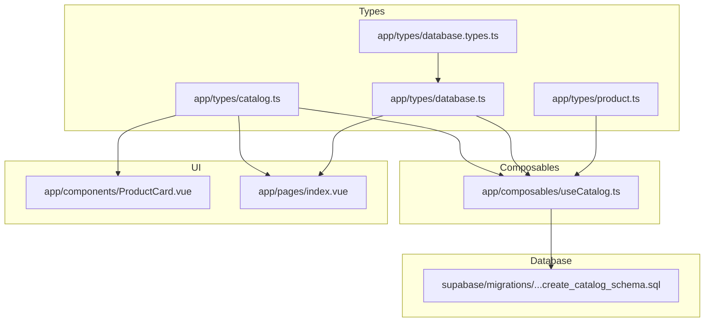
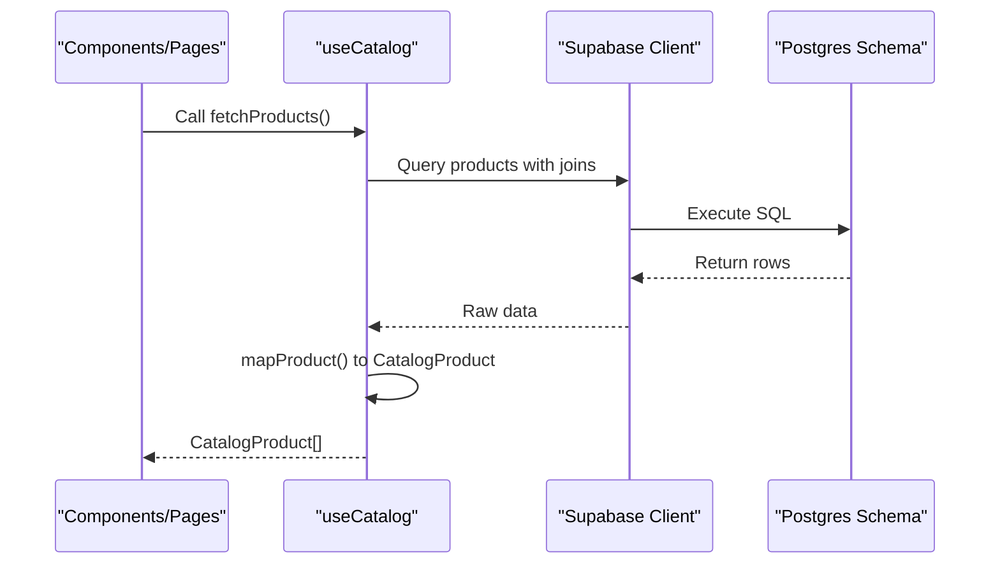
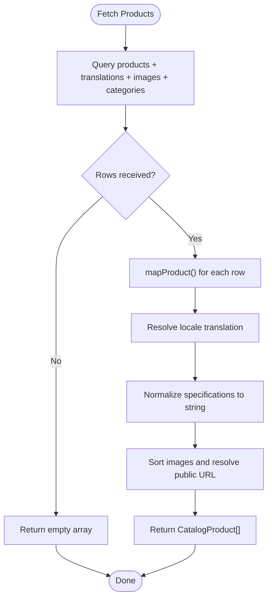
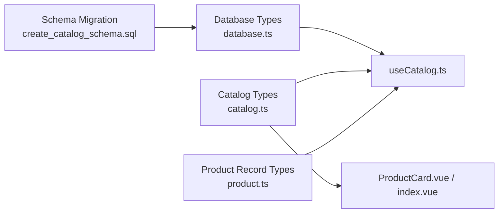

# TypeScript Type Definitions

<cite>
**Referenced Files in This Document**
- [catalog.ts](file://app/types/catalog.ts)
- [database.ts](file://app/types/database.ts)
- [product.ts](file://app/types/product.ts)
- [database.types.ts](file://app/types/database.types.ts)
- [useCatalog.ts](file://app/composables/useCatalog.ts)
- [ProductCard.vue](file://app/components/ProductCard.vue)
- [index.vue](file://app/pages/index.vue)
- [20260922_000001_create_catalog_schema.sql](file://supabase/migrations/20260922_000001_create_catalog_schema.sql)
</cite>

## Table of Contents
1. [Introduction](#introduction)
2. [Project Structure](#project-structure)
3. [Core Components](#core-components)
4. [Architecture Overview](#architecture-overview)
5. [Detailed Component Analysis](#detailed-component-analysis)
6. [Dependency Analysis](#dependency-analysis)
7. [Performance Considerations](#performance-considerations)
8. [Troubleshooting Guide](#troubleshooting-guide)
9. [Conclusion](#conclusion)

## Introduction
This document explains the TypeScript type definitions that provide end-to-end type safety for the catalog domain. It covers:
- The application-facing types used by components and composables (CatalogProduct, CatalogCategory, CatalogImage).
- The database-mirroring types that reflect the Supabase schema (Database, Row types, Insert/Update shapes).
- Domain-specific product record types used to model translations and images.
- How these types are consumed in composables and UI components.
- Type inference patterns, validation strategies, and migration guidance when the database schema evolves.

## Project Structure
The type system is organized into three layers:
- Application-facing types: Used by UI and composables.
- Database-mirroring types: Mirror the Supabase schema for strongly-typed queries.
- Domain record types: Represent normalized data structures for products and translations.

**Diagram sources**
- [catalog.ts:1-31](file://app/types/catalog.ts#L1-L31)
- [database.ts:1-123](file://app/types/database.ts#L1-L123)
- [product.ts:1-40](file://app/types/product.ts#L1-L40)
- [database.types.ts:1-2](file://app/types/database.types.ts#L1-L2)
- [useCatalog.ts:1-61](file://app/composables/useCatalog.ts#L1-L61)
- [ProductCard.vue:1-68](file://app/components/ProductCard.vue#L1-L68)
- [index.vue:1-120](file://app/pages/index.vue#L1-L120)
- [20260922_000001_create_catalog_schema.sql:1-113](file://supabase/migrations/20260922_000001_create_catalog_schema.sql#L1-L113)

**Section sources**
- [catalog.ts:1-31](file://app/types/catalog.ts#L1-L31)
- [database.ts:1-123](file://app/types/database.ts#L1-L123)
- [product.ts:1-40](file://app/types/product.ts#L1-L40)
- [database.types.ts:1-2](file://app/types/database.types.ts#L1-L2)
- [useCatalog.ts:1-61](file://app/composables/useCatalog.ts#L1-L61)
- [ProductCard.vue:1-68](file://app/components/ProductCard.vue#L1-L68)
- [index.vue:1-120](file://app/pages/index.vue#L1-L120)
- [20260922_000001_create_catalog_schema.sql:1-113](file://supabase/migrations/20260922_000001_create_catalog_schema.sql#L1-L113)

## Core Components
This section documents the primary type definitions and their roles.

### Application-facing Types (catalog.ts)
- CatalogImage: Represents a single image asset with id, storagePath, altText, and url.
- CatalogProduct: A presentation-ready product shape including identifiers, pricing, stock, status, localized text fields, serialized specifications, and an array of images.
- CatalogCategory: A lightweight category representation with id, name, and optional slug.

Key properties of CatalogProduct:
- Identifiers and routing: id, slug, sku, categoryId, categoryName, categorySlug.
- Pricing and inventory: price, currency, stockQuantity.
- Status: draft | published | archived.
- Content: name, shortDescription, description, specifications (stringified JSON).
- Media: images array of CatalogImage.

Relationships:
- Products belong to categories via categoryId; categoryName and categorySlug are denormalized for display.
- Images are nested within each product.

**Section sources**
- [catalog.ts:1-31](file://app/types/catalog.ts#L1-L31)

### Database-mirroring Types (database.ts)
These types mirror the Supabase schema and enable strongly-typed queries.

- Json: Generic flexible JSON type used for specification fields.
- ProductCategory: Enumerated product categories.
- ProductStatus: Enumerated product statuses.
- AdminRole: Enumerated admin roles.
- CategoryRow, CategoryTranslationRow, ProductRow, ProductTranslationRow, ProductImageRow, AdminUserRow: Row types matching table columns.
- Database: Top-level type describing public schema tables with Row, Insert, Update, and Relationships per table.

Highlights:
- Row types align with SQL column names and types.
- Insert/Update types derive from Row using Partial and Pick to enforce required fields on writes.
- Database.Public.Tables exposes all tables with consistent shape for query builders.

**Section sources**
- [database.ts:1-123](file://app/types/database.ts#L1-L123)

### Domain Record Types (product.ts)
These types represent normalized records for product data and translations.

- ProductSpecification: Key-value pair for product specs.
- ProductRecord: Base product metadata aligned with database but with camelCase naming for application use.
- ProductTranslationRecord: Localized content and structured specifications.
- ProductImageRecord: Image metadata with sort order and primary flag.

Usage:
- Useful for internal normalization or when composing complex objects before mapping to CatalogProduct.

**Section sources**
- [product.ts:1-40](file://app/types/product.ts#L1-L40)

### Re-exported Database Type (database.types.ts)
- Exposes Database as a convenient re-export for consumers who prefer importing from this file.

**Section sources**
- [database.types.ts:1-2](file://app/types/database.types.ts#L1-L2)

## Architecture Overview
The type system bridges three layers:
- Database layer: Supabase schema defined in migrations.
- Data access layer: Composables querying Supabase with typed clients.
- Presentation layer: Components consuming application-facing types.

**Diagram sources**
- [useCatalog.ts:13-41](file://app/composables/useCatalog.ts#L13-L41)
- [index.vue:79-116](file://app/pages/index.vue#L79-L116)
- [20260922_000001_create_catalog_schema.sql:22-59](file://supabase/migrations/20260922_000001_create_catalog_schema.sql#L22-L59)

## Detailed Component Analysis

### CatalogProduct Interface
Purpose:
- Provide a stable, presentation-oriented contract for product data across the app.

Properties overview:
- Identification: id, slug, sku, categoryId.
- Category context: categoryName, categorySlug.
- Pricing: price, currency.
- Inventory: stockQuantity.
- Lifecycle: status.
- Content: name, shortDescription, description, specifications (stringified JSON).
- Media: images array of CatalogImage.

Complexity:
- O(1) property access; images array iteration is O(n) where n is number of images.

Validation considerations:
- Ensure price is non-negative and currency is valid at ingestion time.
- Normalize specifications to string before rendering.

Best practices:
- Keep CatalogProduct free of database column names to avoid leaking implementation details.
- Use derived fields like categoryName to simplify templates.

**Section sources**
- [catalog.ts:8-24](file://app/types/catalog.ts#L8-L24)

### CatalogCategory Interface
Purpose:
- Lightweight category representation for navigation and filtering.

Relationship to products:
- Products reference categories via categoryId; category display fields are denormalized into CatalogProduct for performance and simplicity.

**Section sources**
- [catalog.ts:26-30](file://app/types/catalog.ts#L26-L30)

### Database Type Definition
Purpose:
- Mirror Supabase schema to ensure compile-time safety for queries and mutations.

Structure:
- Tables include categories, category_translations, products, product_translations, product_images, admin_users.
- Each table defines Row, Insert, Update, and Relationships.

Migration alignment:
- Column names and constraints in Row types match the SQL schema.
- Insert/Update types restrict mutable fields and enforce required keys.

**Section sources**
- [database.ts:14-123](file://app/types/database.ts#L14-L123)
- [20260922_000001_create_catalog_schema.sql:3-67](file://supabase/migrations/20260922_000001_create_catalog_schema.sql#L3-L67)

### Composable Usage: useCatalog
Responsibilities:
- Fetch products and categories from Supabase.
- Map raw database rows to application-facing types.
- Resolve public image URLs.

Type usage:
- Uses Database to type the Supabase client.
- Returns CatalogProduct[] and CatalogCategory[].

Mapping logic:
- Selects locale-aware translation for product and category names.
- Serializes specifications to string for CatalogProduct.
- Sorts images by sort_order and attaches public URL.

Error handling:
- Throws errors returned by Supabase to be handled upstream.

**Diagram sources**
- [useCatalog.ts:13-41](file://app/composables/useCatalog.ts#L13-L41)

**Section sources**
- [useCatalog.ts:1-61](file://app/composables/useCatalog.ts#L1-L61)

### Component Usage: ProductCard.vue
Responsibilities:
- Display a product card using CatalogProduct.
- Access product.images[0] safely and render fallback when missing.
- Show price formatted with currency and stock status.

Type inference:
- Props typed as CatalogProduct ensures template accesses are type-safe.
- Emits edit events with CatalogProduct payload.

**Section sources**
- [ProductCard.vue:1-68](file://app/components/ProductCard.vue#L1-L68)

### Page Usage: index.vue
Responsibilities:
- Manages state for products and categories using CatalogProduct[] and CatalogCategory[].
- Implements local mapping similar to useCatalog for demonstration.
- Provides editor form shape aligned with CatalogProduct fields.

Type inference:
- Uses Database and Json for typed Supabase interactions.
- Ensures consistency between UI state and catalog types.

**Section sources**
- [index.vue:1-120](file://app/pages/index.vue#L1-L120)

## Dependency Analysis
The following diagram shows how types flow through the application.

**Diagram sources**
- [20260922_000001_create_catalog_schema.sql:1-113](file://supabase/migrations/20260922_000001_create_catalog_schema.sql#L1-L113)
- [database.ts:1-123](file://app/types/database.ts#L1-L123)
- [catalog.ts:1-31](file://app/types/catalog.ts#L1-L31)
- [product.ts:1-40](file://app/types/product.ts#L1-L40)
- [useCatalog.ts:1-61](file://app/composables/useCatalog.ts#L1-L61)
- [ProductCard.vue:1-68](file://app/components/ProductCard.vue#L1-L68)
- [index.vue:1-120](file://app/pages/index.vue#L1-L120)

Coupling and cohesion:
- High cohesion within each type file (application vs database vs domain).
- Low coupling between UI and database types via composables and mapping functions.

Potential circular dependencies:
- None observed; imports are directional from UI to composables to types.

External dependencies:
- Supabase client typed with Database.
- i18n integration for locale resolution.

**Section sources**
- [useCatalog.ts:1-61](file://app/composables/useCatalog.ts#L1-L61)
- [database.ts:1-123](file://app/types/database.ts#L1-L123)
- [catalog.ts:1-31](file://app/types/catalog.ts#L1-L31)
- [product.ts:1-40](file://app/types/product.ts#L1-L40)

## Performance Considerations
- Image URL resolution: Avoid repeated network calls by caching public URLs if needed.
- Sorting images: Sorting by sort_order is O(n log n); keep image arrays small.
- Denormalization: categoryName and categorySlug reduce join costs in templates.
- Specification serialization: Serialize once during mapping to avoid repeated JSON.stringify in templates.

[No sources needed since this section provides general guidance]

## Troubleshooting Guide
Common issues and resolutions:

- Mismatch between database columns and Row types:
  - Ensure database.ts Row types match the migration schema exactly.
  - If a column changes, update both the migration and corresponding Row type.

- Missing translations:
  - Mapping logic falls back to English or first available translation; verify locale values and availability.

- Null or undefined images:
  - Ensure product_images exist; handle empty arrays gracefully in templates.

- Price formatting errors:
  - Validate price is numeric before calling toFixed; guard against null/undefined.

- Status enum mismatches:
  - Align ProductStatus with database check constraints; update types and UI filters together.

- Error propagation:
  - Composables throw errors from Supabase; ensure pages catch and display meaningful messages.

**Section sources**
- [useCatalog.ts:37-57](file://app/composables/useCatalog.ts#L37-L57)
- [index.vue:101-120](file://app/pages/index.vue#L101-L120)

## Conclusion
The type system cleanly separates concerns:
- Database-mirroring types guarantee safe queries against Supabase.
- Application-facing types provide a stable contract for UI and composables.
- Domain record types support internal normalization and composition.

By maintaining strict alignment between migrations, database types, and application types—and by centralizing mapping logic in composables—the application achieves strong type safety, predictable behavior, and easier maintenance during schema evolution.

[No sources needed since this section summarizes without analyzing specific files]