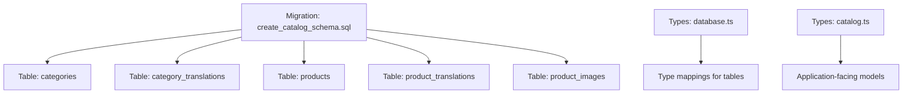
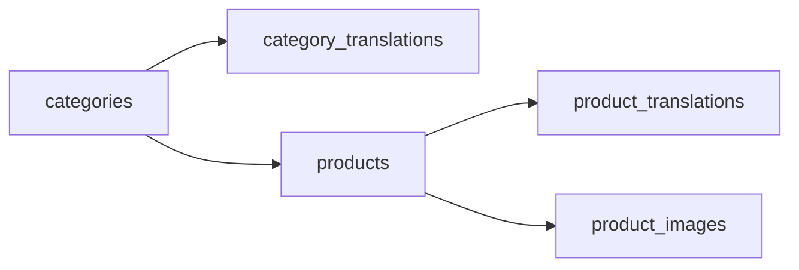

# Core Tables & Relationships

<cite>
**Referenced Files in This Document**
- [20260922_000001_create_catalog_schema.sql](file://supabase/migrations/20260922_000001_create_catalog_schema.sql)
- [database.ts](file://app/types/database.ts)
- [catalog.ts](file://app/types/catalog.ts)
</cite>

## Table of Contents
1. [Introduction](#introduction)
2. [Project Structure](#project-structure)
3. [Core Components](#core-components)
4. [Architecture Overview](#architecture-overview)
5. [Detailed Component Analysis](#detailed-component-analysis)
6. [Dependency Analysis](#dependency-analysis)
7. [Performance Considerations](#performance-considerations)
8. [Troubleshooting Guide](#troubleshooting-guide)
9. [Conclusion](#conclusion)

## Introduction
This document describes the core database schema for products, categories, and their relationships. It details table structures, fields, data types, constraints, validation rules, primary and foreign keys, unique constraints, default values, indexes, cascade behaviors, and referential integrity. It also provides entity relationship diagrams to visualize how tables connect through foreign keys and highlights performance-oriented indexing strategies.

## Project Structure
The catalog schema is defined in a single migration file that creates all relevant tables, constraints, triggers, and indexes. TypeScript type definitions mirror the database structure to ensure type safety on the client side.



**Diagram sources**
- [20260922_000001_create_catalog_schema.sql:3-59](file://supabase/migrations/20260922_000001_create_catalog_schema.sql#L3-L59)
- [database.ts:14-75](file://app/types/database.ts#L14-L75)
- [catalog.ts:8-30](file://app/types/catalog.ts#L8-L30)

**Section sources**
- [20260922_000001_create_catalog_schema.sql:3-75](file://supabase/migrations/20260922_000001_create_catalog_schema.sql#L3-L75)
- [database.ts:14-75](file://app/types/database.ts#L14-L75)
- [catalog.ts:8-30](file://app/types/catalog.ts#L8-L30)

## Core Components
- categories: Defines product categories with slug uniqueness and active flag.
- category_translations: Localized names per category, one row per locale.
- products: Product master records with pricing, stock, status, and SKU/slug uniqueness.
- product_translations: Localized product metadata including name, descriptions, and specifications as JSON.
- product_images: Media assets per product with ordering and primary image flag.

Key characteristics:
- All tables use UUID primary keys generated at insert time.
- Timestamps are managed via triggers to update updated_at automatically.
- Foreign keys enforce referential integrity between parent and child tables.
- Check constraints validate business rules (e.g., non-negative price/stock, allowed statuses).
- Unique constraints prevent duplicates (e.g., per locale translations, per product images).

**Section sources**
- [20260922_000001_create_catalog_schema.sql:3-59](file://supabase/migrations/20260922_000001_create_catalog_schema.sql#L3-L59)
- [20260922_000001_create_catalog_schema.sql:76-112](file://supabase/migrations/20260922_000001_create_catalog_schema.sql#L76-L112)
- [database.ts:14-75](file://app/types/database.ts#L14-L75)

## Architecture Overview
The catalog schema centers around categories and products, with translation and media tables providing localized content and images. Products belong to categories; translations and images reference products.

```mermaid
erDiagram
CATEGORIES {
uuid id PK
text slug UK
integer sort_order
boolean is_active
timestamptz created_at
timestamptz updated_at
}
CATEGORY_TRANSLATIONS {
uuid id PK
uuid category_id FK
text locale
text name
timestamptz created_at
timestamptz updated_at
}
PRODUCTS {
uuid id PK
uuid category_id FK
text slug UK
text sku UK
numeric(10,2) price
text currency
integer stock_quantity
text status
boolean is_featured
timestamptz created_at
timestamptz updated_at
}
PRODUCT_TRANSLATIONS {
uuid id PK
uuid product_id FK
text locale
text name
text short_description
text description
jsonb specifications
timestamptz created_at
timestamptz updated_at
}
PRODUCT_IMAGES {
uuid id PK
uuid product_id FK
text storage_path
text alt_text
integer sort_order
boolean is_primary
timestamptz created_at
timestamptz updated_at
}
CATEGORIES ||--o{ CATEGORY_TRANSLATIONS : "1..*"
CATEGORIES ||--o{ PRODUCTS : "1..*"
PRODUCTS ||--o{ PRODUCT_TRANSLATIONS : "1..*"
PRODUCTS ||--o{ PRODUCT_IMAGES : "1..*"
```

**Diagram sources**
- [20260922_000001_create_catalog_schema.sql:3-59](file://supabase/migrations/20260922_000001_create_catalog_schema.sql#L3-L59)

## Detailed Component Analysis

### Table: categories
- Purpose: Master list of product categories.
- Primary key: id (UUID, auto-generated).
- Constraints:
  - slug: not null, unique.
  - sort_order: integer, not null, default 0.
  - is_active: boolean, not null, default true.
  - created_at, updated_at: timestamps, not null, default now().
- Indexes:
  - idx_categories_slug on slug.
- Triggers:
  - set_updated_at_categories updates updated_at before each row update.

Validation and behavior:
- Slug uniqueness ensures stable URLs.
- Active flag controls visibility.
- Automatic timestamping maintains auditability.

**Section sources**
- [20260922_000001_create_catalog_schema.sql:3-10](file://supabase/migrations/20260922_000001_create_catalog_schema.sql#L3-L10)
- [20260922_000001_create_catalog_schema.sql:74](file://supabase/migrations/20260922_000001_create_catalog_schema.sql#L74)
- [20260922_000001_create_catalog_schema.sql:84-87](file://supabase/migrations/20260922_000001_create_catalog_schema.sql#L84-L87)
- [database.ts:14-21](file://app/types/database.ts#L14-L21)

### Table: category_translations
- Purpose: Localized category names.
- Primary key: id (UUID, auto-generated).
- Foreign key: category_id references categories(id) on delete cascade.
- Constraints:
  - locale: not null.
  - name: not null.
  - unique(category_id, locale): one translation per category per language.
  - created_at, updated_at: timestamps, not null, default now().
- Indexes:
  - idx_product_translations_locale on locale (shared index used for both product and category translations).
- Triggers:
  - set_updated_at_category_translations updates updated_at before each row update.

Validation and behavior:
- Cascade delete removes translations when a category is deleted.
- Composite unique prevents duplicate locales per category.

**Section sources**
- [20260922_000001_create_catalog_schema.sql:12-20](file://supabase/migrations/20260922_000001_create_catalog_schema.sql#L12-L20)
- [20260922_000001_create_catalog_schema.sql:72](file://supabase/migrations/20260922_000001_create_catalog_schema.sql#L72)
- [20260922_000001_create_catalog_schema.sql:89-92](file://supabase/migrations/20260922_000001_create_catalog_schema.sql#L89-L92)
- [database.ts:23-30](file://app/types/database.ts#L23-L30)

### Table: products
- Purpose: Core product records with pricing, inventory, and status.
- Primary key: id (UUID, auto-generated).
- Foreign key: category_id references categories(id) on delete restrict.
- Constraints:
  - slug: not null, unique.
  - sku: not null, unique.
  - price: numeric(10,2), not null, check >= 0.
  - currency: text, not null, default 'USD'.
  - stock_quantity: integer, not null, default 0, check >= 0.
  - status: text, not null, default 'draft', check in ('draft','published','archived').
  - is_featured: boolean, not null, default false.
  - created_at, updated_at: timestamps, not null, default now().
- Indexes:
  - idx_products_category_id on category_id.
  - idx_products_status on status.
  - idx_products_featured on is_featured.
- Triggers:
  - set_updated_at_products updates updated_at before each row update.

Validation and behavior:
- Restrict delete on category_id prevents accidental deletion of categories with products.
- Check constraints enforce non-negative price and stock, and valid status enum.
- Defaults simplify inserts and reduce client-side logic.

**Section sources**
- [20260922_000001_create_catalog_schema.sql:22-34](file://supabase/migrations/20260922_000001_create_catalog_schema.sql#L22-L34)
- [20260922_000001_create_catalog_schema.sql:69-71](file://supabase/migrations/20260922_000001_create_catalog_schema.sql#L69-L71)
- [20260922_000001_create_catalog_schema.sql:94-97](file://supabase/migrations/20260922_000001_create_catalog_schema.sql#L94-L97)
- [database.ts:32-44](file://app/types/database.ts#L32-L44)

### Table: product_translations
- Purpose: Localized product metadata including name, descriptions, and specifications.
- Primary key: id (UUID, auto-generated).
- Foreign key: product_id references products(id) on delete cascade.
- Constraints:
  - locale: not null.
  - name, short_description, description: not null.
  - specifications: jsonb, not null, default empty array.
  - unique(product_id, locale): one translation per product per language.
  - created_at, updated_at: timestamps, not null, default now().
- Indexes:
  - idx_product_translations_locale on locale.
- Triggers:
  - set_updated_at_product_translations updates updated_at before each row update.

Validation and behavior:
- Cascade delete removes translations when a product is deleted.
- Composite unique enforces one translation per locale per product.
- JSONB specifications allow flexible attribute storage while maintaining schema-level defaults.

**Section sources**
- [20260922_000001_create_catalog_schema.sql:36-47](file://supabase/migrations/20260922_000001_create_catalog_schema.sql#L36-L47)
- [20260922_000001_create_catalog_schema.sql:72](file://supabase/migrations/20260922_000001_create_catalog_schema.sql#L72)
- [20260922_000001_create_catalog_schema.sql:99-102](file://supabase/migrations/20260922_000001_create_catalog_schema.sql#L99-L102)
- [database.ts:46-56](file://app/types/database.ts#L46-L56)

### Table: product_images
- Purpose: Media assets associated with products.
- Primary key: id (UUID, auto-generated).
- Foreign key: product_id references products(id) on delete cascade.
- Constraints:
  - storage_path: not null.
  - alt_text: nullable text.
  - sort_order: integer, not null, default 0.
  - is_primary: boolean, not null, default false.
  - unique(product_id, storage_path): prevents duplicate paths per product.
  - created_at, updated_at: timestamps, not null, default now().
- Indexes:
  - idx_product_images_product_id on product_id.
- Triggers:
  - set_updated_at_product_images updates updated_at before each row update.

Validation and behavior:
- Cascade delete removes images when a product is deleted.
- Composite unique ensures no duplicate storage paths per product.
- Sorting and primary flags support presentation logic.

**Section sources**
- [20260922_000001_create_catalog_schema.sql:49-59](file://supabase/migrations/20260922_000001_create_catalog_schema.sql#L49-L59)
- [20260922_000001_create_catalog_schema.sql:73](file://supabase/migrations/20260922_000001_create_catalog_schema.sql#L73)
- [20260922_000001_create_catalog_schema.sql:104-107](file://supabase/migrations/20260922_000001_create_catalog_schema.sql#L104-L107)
- [database.ts:58-67](file://app/types/database.ts#L58-L67)

## Dependency Analysis
Foreign key relationships define strict referential integrity:
- category_translations.category_id -> categories.id (cascade delete).
- products.category_id -> categories.id (restrict delete).
- product_translations.product_id -> products.id (cascade delete).
- product_images.product_id -> products.id (cascade delete).



**Diagram sources**
- [20260922_000001_create_catalog_schema.sql:12-20](file://supabase/migrations/20260922_000001_create_catalog_schema.sql#L12-L20)
- [20260922_000001_create_catalog_schema.sql:22-34](file://supabase/migrations/20260922_000001_create_catalog_schema.sql#L22-L34)
- [20260922_000001_create_catalog_schema.sql:36-47](file://supabase/migrations/20260922_000001_create_catalog_schema.sql#L36-L47)
- [20260922_000001_create_catalog_schema.sql:49-59](file://supabase/migrations/20260922_000001_create_catalog_schema.sql#L49-L59)

**Section sources**
- [20260922_000001_create_catalog_schema.sql:12-59](file://supabase/migrations/20260922_000001_create_catalog_schema.sql#L12-L59)

## Performance Considerations
Indexes established for efficient querying:
- Single-column indexes:
  - categories.slug (idx_categories_slug).
  - products.status (idx_products_status).
  - products.is_featured (idx_products_featured).
  - product_translations.locale (idx_product_translations_locale).
  - product_images.product_id (idx_product_images_product_id).
- Foreign key indexes:
  - products.category_id (idx_products_category_id).

Recommendations:
- Use composite indexes for frequent multi-column filters if needed (e.g., status + category_id).
- Keep indexes aligned with query patterns to avoid overhead.
- Leverage JSONB indexing for specifications if queries filter by attributes.

[No sources needed since this section provides general guidance]

## Troubleshooting Guide
Common issues and resolutions:
- Category deletion blocked due to products referencing it:
  - Cause: products.category_id uses ON DELETE RESTRICT.
  - Resolution: Delete or reassign related products before deleting the category.
- Duplicate translation errors:
  - Cause: unique(category_id, locale) or unique(product_id, locale).
  - Resolution: Ensure one translation per locale per entity; update existing rows instead of inserting duplicates.
- Invalid status or negative price/stock:
  - Cause: check constraints on status enum and numeric ranges.
  - Resolution: Use allowed status values and ensure non-negative price and stock.
- Timestamps not updating:
  - Cause: missing trigger execution.
  - Resolution: Verify triggers set_updated_at_* exist and fire on updates.

**Section sources**
- [20260922_000001_create_catalog_schema.sql:22-34](file://supabase/migrations/20260922_000001_create_catalog_schema.sql#L22-L34)
- [20260922_000001_create_catalog_schema.sql:12-20](file://supabase/migrations/20260922_000001_create_catalog_schema.sql#L12-L20)
- [20260922_000001_create_catalog_schema.sql:36-47](file://supabase/migrations/20260922_000001_create_catalog_schema.sql#L36-L47)
- [20260922_000001_create_catalog_schema.sql:76-112](file://supabase/migrations/20260922_000001_create_catalog_schema.sql#L76-L112)

## Conclusion
The catalog schema provides a robust foundation for managing categories, products, localized content, and images. It enforces strong referential integrity, validates critical business rules via constraints, and includes targeted indexes for performance. The combination of cascade and restrict behaviors ensures data consistency across entities. TypeScript types align with the database schema to maintain end-to-end type safety.