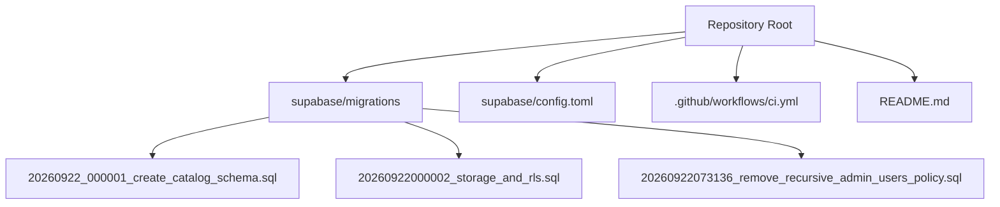
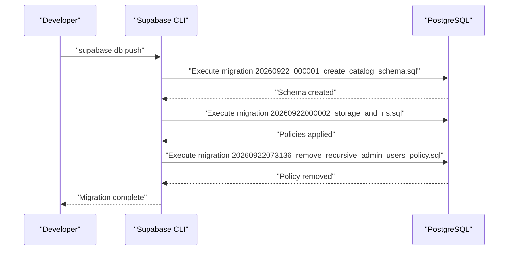
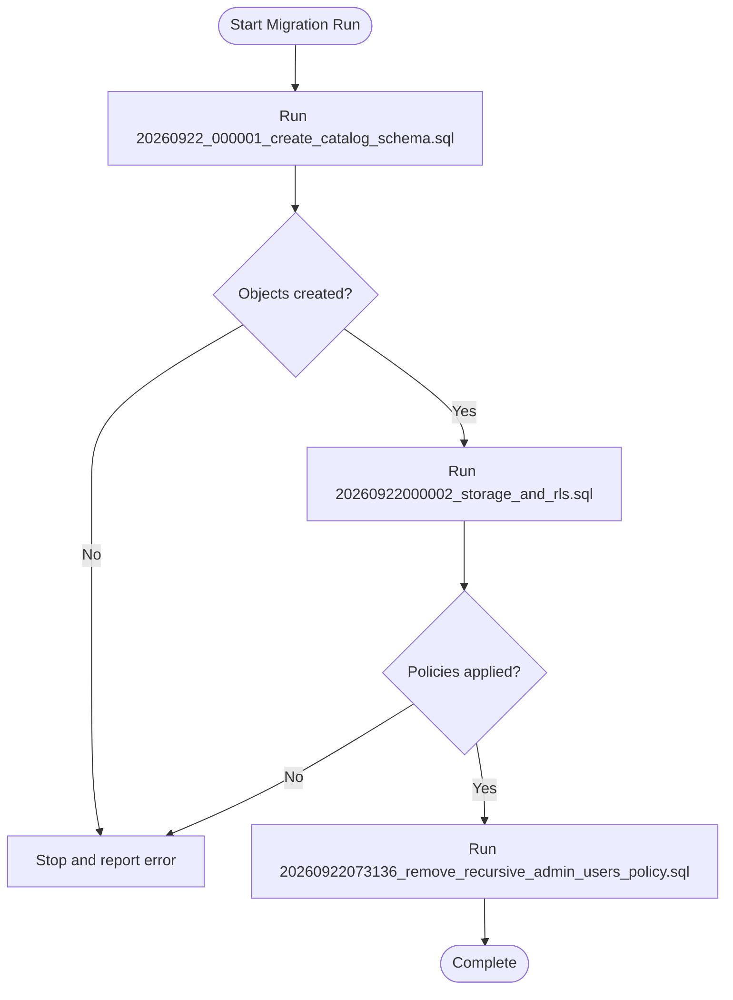
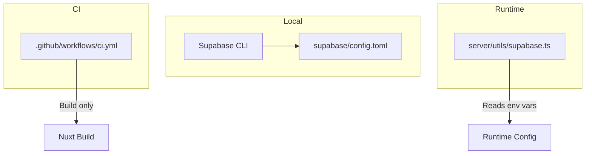
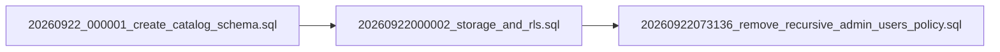

# Database Migrations & Versioning

<cite>
**Referenced Files in This Document**
- [README.md](file://README.md)
- [ci.yml](file://.github/workflows/ci.yml)
- [config.toml](file://supabase/config.toml)
- [20260922_000001_create_catalog_schema.sql](file://supabase/migrations/20260922_000001_create_catalog_schema.sql)
- [20260922000002_storage_and_rls.sql](file://supabase/migrations/20260922000002_storage_and_rls.sql)
- [20260922073136_remove_recursive_admin_users_policy.sql](file://supabase/migrations/20260922073136_remove_recursive_admin_users_policy.sql)
- [SKILL.md](file://.agents/skills/supabase/SKILL.md)
- [schema-constraints.md](file://.agents/skills/supabase-postgres-best-practices/references/schema-constraints.md)
- [supabase.ts](file://server/utils/supabase.ts)
</cite>

## Table of Contents
1. [Introduction](#introduction)
2. [Project Structure](#project-structure)
3. [Core Components](#core-components)
4. [Architecture Overview](#architecture-overview)
5. [Detailed Component Analysis](#detailed-component-analysis)
6. [Dependency Analysis](#dependency-analysis)
7. [Performance Considerations](#performance-considerations)
8. [Troubleshooting Guide](#troubleshooting-guide)
9. [Conclusion](#conclusion)
10. [Appendices](#appendices)

## Introduction
This document defines the database migration strategy and version management for schema evolution and deployment. It explains how migrations are named, ordered, executed, and rolled back; how to manage environment-specific configurations; how to test migrations in development and staging; how to resolve conflicts when multiple developers change schemas; and how to perform disaster recovery with backups and data preservation during updates.

The project uses Supabase migrations under supabase/migrations and a local Supabase configuration in supabase/config.toml. The repository also includes a GitHub Actions workflow that builds the application but does not currently run database migrations as part of CI.

## Project Structure
Key locations relevant to migrations and deployment:
- supabase/migrations: Contains SQL migration files that evolve the database schema and security policies.
- supabase/config.toml: Local Supabase configuration including Postgres major version and enabled schemas.
- .github/workflows/ci.yml: CI pipeline that installs dependencies and builds the app (no DB migration step).
- README.md: Basic setup and build instructions for the Nuxt app.

**Diagram sources**
- [config.toml:1-32](file://supabase/config.toml#L1-L32)
- [ci.yml:1-26](file://.github/workflows/ci.yml#L1-L26)
- [20260922_000001_create_catalog_schema.sql:1-113](file://supabase/migrations/20260922_000001_create_catalog_schema.sql#L1-L113)
- [20260922000002_storage_and_rls.sql:1-205](file://supabase/migrations/20260922000002_storage_and_rls.sql#L1-L205)
- [20260922073136_remove_recursive_admin_users_policy.sql:1-2](file://supabase/migrations/20260922073136_remove_recursive_admin_users_policy.sql#L1-L2)

**Section sources**
- [README.md:1-36](file://README.md#L1-L36)
- [config.toml:1-32](file://supabase/config.toml#L1-L32)
- [ci.yml:1-26](file://.github/workflows/ci.yml#L1-L26)

## Core Components
- Migration files: Each file is an idempotent or forward-only SQL script that changes the schema or policies.
- Local Supabase config: Defines the Postgres major version and enabled schemas used by local tooling.
- CI pipeline: Builds the frontend; database migrations are not executed in this workflow.
- Supabase skill guidance: Provides recommended workflows for creating and generating migrations safely.

**Section sources**
- [20260922_000001_create_catalog_schema.sql:1-113](file://supabase/migrations/20260922_000001_create_catalog_schema.sql#L1-L113)
- [20260922000002_storage_and_rls.sql:1-205](file://supabase/migrations/20260922000002_storage_and_rls.sql#L1-L205)
- [20260922073136_remove_recursive_admin_users_policy.sql:1-2](file://supabase/migrations/20260922073136_remove_recursive_admin_users_policy.sql#L1-L2)
- [config.toml:1-32](file://supabase/config.toml#L1-L32)
- [SKILL.md:119-142](file://.agents/skills/supabase/SKILL.md#L119-L142)

## Architecture Overview
The migration architecture centers on sequential execution of SQL files under supabase/migrations. The first migration creates core tables, functions, triggers, and indexes. Subsequent migrations add Row Level Security (RLS) policies and storage policies, and later migrations adjust or remove policies as needed.

**Diagram sources**
- [20260922_000001_create_catalog_schema.sql:1-113](file://supabase/migrations/20260922_000001_create_catalog_schema.sql#L1-L113)
- [20260922000002_storage_and_rls.sql:1-205](file://supabase/migrations/20260922000002_storage_and_rls.sql#L1-L205)
- [20260922073136_remove_recursive_admin_users_policy.sql:1-2](file://supabase/migrations/20260922073136_remove_recursive_admin_users_policy.sql#L1-L2)

## Detailed Component Analysis

### Migration Naming Convention
- Timestamp-based naming ensures deterministic ordering across environments.
- Two observed patterns:
  - YYYYMMDD_HHMMSS_<description>.sql (e.g., 20260922_000001_create_catalog_schema.sql)
  - YYYYMMDDHHMMSS_<description>.sql (e.g., 20260922000002_storage_and_rls.sql)
- Sequential numbering within the same day helps distinguish multiple migrations on the same date.

Recommendation:
- Use a consistent pattern across all new migrations to avoid ambiguity.
- Keep filenames descriptive so reviewers can understand intent without opening the file.

**Section sources**
- [20260922_000001_create_catalog_schema.sql:1-113](file://supabase/migrations/20260922_000001_create_catalog_schema.sql#L1-L113)
- [20260922000002_storage_and_rls.sql:1-205](file://supabase/migrations/20260922000002_storage_and_rls.sql#L1-L205)
- [20260922073136_remove_recursive_admin_users_policy.sql:1-2](file://supabase/migrations/20260922073136_remove_recursive_admin_users_policy.sql#L1-L2)

### Migration Execution Order and Dependencies
- Migrations execute in lexicographic order based on filename.
- Dependency management:
  - Create foundational objects first (tables, extensions, functions, triggers, indexes).
  - Apply RLS policies after tables exist.
  - Adjust or remove policies in later migrations if requirements change.
- Current order:
  1) Create catalog schema (tables, functions, triggers, indexes).
  2) Add RLS and storage policies.
  3) Remove a recursive admin policy.

**Diagram sources**
- [20260922_000001_create_catalog_schema.sql:1-113](file://supabase/migrations/20260922_000001_create_catalog_schema.sql#L1-L113)
- [20260922000002_storage_and_rls.sql:1-205](file://supabase/migrations/20260922000002_storage_and_rls.sql#L1-L205)
- [20260922073136_remove_recursive_admin_users_policy.sql:1-2](file://supabase/migrations/20260922073136_remove_recursive_admin_users_policy.sql#L1-L2)

**Section sources**
- [20260922_000001_create_catalog_schema.sql:1-113](file://supabase/migrations/20260922_000001_create_catalog_schema.sql#L1-L113)
- [20260922000002_storage_and_rls.sql:1-205](file://supabase/migrations/20260922000002_storage_and_rls.sql#L1-L205)
- [20260922073136_remove_recursive_admin_users_policy.sql:1-2](file://supabase/migrations/20260922073136_remove_recursive_admin_users_policy.sql#L1-L2)

### Rollback Procedures
- Strategy:
  - Prefer additive, reversible migrations where possible.
  - For destructive changes, create a dedicated rollback migration that undoes the previous migration’s effects.
  - Use safe constructs such as “drop if exists” and conditional checks to make migrations idempotent.
- Example rollback pattern:
  - If a policy was added in one migration, a subsequent migration can drop it by name.
  - If a table or column must be removed, ensure dependent objects (indexes, triggers, policies) are dropped first.
- Caution:
  - Avoid dropping data unless absolutely necessary.
  - Test rollbacks in non-production environments before applying to production.

**Section sources**
- [20260922073136_remove_recursive_admin_users_policy.sql:1-2](file://supabase/migrations/20260922073136_remove_recursive_admin_users_policy.sql#L1-L2)
- [schema-constraints.md:1-81](file://.agents/skills/supabase-postgres-best-practices/references/schema-constraints.md#L1-L81)

### Backup and Restore Strategies for Production
- Before any production migration:
  - Take a full logical backup of the database using your managed service’s backup tools or pg_dump-compatible utilities.
  - Verify backup integrity and retention according to your SLA.
- During migration:
  - Execute migrations in a maintenance window with reduced traffic.
  - Monitor long-running operations and lock contention.
- After migration:
  - Validate schema and critical queries.
  - Keep the last known-good backup available for quick restore if issues arise.
- Disaster recovery:
  - Define RTO/RPO targets and test restores periodically.
  - Ensure you have access to point-in-time recovery if supported by your provider.

[No sources needed since this section provides general guidance]

### Environment-Specific Configurations and Deployment Workflows
- Local development:
  - supabase/config.toml sets Postgres major version and enabled schemas for local tooling.
  - Use Supabase CLI to push migrations locally and verify behavior.
- CI/CD:
  - The current CI workflow builds the application but does not run database migrations.
  - To include migrations in CI, add steps to install Supabase CLI, connect to the target environment, and run migrations with appropriate secrets.
- Secrets and credentials:
  - Service role keys and URLs should be provided via environment variables at runtime.
  - The server utility demonstrates reading runtime configuration for Supabase client creation.

**Diagram sources**
- [config.toml:1-32](file://supabase/config.toml#L1-L32)
- [ci.yml:1-26](file://.github/workflows/ci.yml#L1-L26)
- [supabase.ts:1-19](file://server/utils/supabase.ts#L1-L19)

**Section sources**
- [config.toml:1-32](file://supabase/config.toml#L1-L32)
- [ci.yml:1-26](file://.github/workflows/ci.yml#L1-L26)
- [supabase.ts:1-19](file://server/utils/supabase.ts#L1-L19)

### Testing Procedures for Migrations
- Development:
  - Iterate schema changes directly against the local database using Supabase CLI or MCP tools, then generate a clean migration file.
  - Run advisors to catch potential issues before committing.
  - Verify migration list and apply migrations locally to confirm order and success.
- Staging:
  - Apply migrations to a staging database that mirrors production schema and data volume.
  - Run integration tests that exercise affected endpoints and queries.
  - Validate RLS policies and storage permissions.
- Pre-commit checks:
  - Consider adding linting or advisory checks to catch common issues early.

**Section sources**
- [SKILL.md:119-142](file://.agents/skills/supabase/SKILL.md#L119-L142)

### Conflict Resolution Strategies
- When multiple developers modify schemas simultaneously:
  - Coordinate via feature branches and pull requests.
  - Rebase or merge frequently to detect conflicts early.
  - If conflicts arise between migrations:
    - Consolidate changes into a single migration that resolves both modifications.
    - Ensure idempotency and correct dependency order.
- Best practices:
  - Keep migrations small and focused.
  - Use descriptive filenames and clear commit messages.
  - Review each other’s migrations before merging.

[No sources needed since this section provides general guidance]

### Disaster Recovery and Data Preservation Techniques
- Data preservation:
  - Always back up before destructive changes.
  - Use transactions for multi-step migrations to maintain consistency.
  - Prefer additive changes (new columns, tables) over deletions when feasible.
- Recovery procedures:
  - Maintain tested restore processes.
  - Document rollback steps and keep them in version control alongside forward migrations.
  - Validate restored data integrity post-recovery.

[No sources needed since this section provides general guidance]

## Dependency Analysis
Migrations exhibit clear dependencies:
- Tables and functions must exist before policies referencing them are created.
- Policies depend on roles and auth context being available.
- Later migrations may remove or adjust earlier policies.

**Diagram sources**
- [20260922_000001_create_catalog_schema.sql:1-113](file://supabase/migrations/20260922_000001_create_catalog_schema.sql#L1-L113)
- [20260922000002_storage_and_rls.sql:1-205](file://supabase/migrations/20260922000002_storage_and_rls.sql#L1-L205)
- [20260922073136_remove_recursive_admin_users_policy.sql:1-2](file://supabase/migrations/20260922073136_remove_recursive_admin_users_policy.sql#L1-L2)

**Section sources**
- [20260922_000001_create_catalog_schema.sql:1-113](file://supabase/migrations/20260922_000001_create_catalog_schema.sql#L1-L113)
- [20260922000002_storage_and_rls.sql:1-205](file://supabase/migrations/20260922000002_storage_and_rls.sql#L1-L205)
- [20260922073136_remove_recursive_admin_users_policy.sql:1-2](file://supabase/migrations/20260922073136_remove_recursive_admin_users_policy.sql#L1-L2)

## Performance Considerations
- Indexes:
  - Ensure indexes support frequent queries and joins.
  - Avoid excessive indexing that slows writes.
- Constraints:
  - Use constraints to enforce data integrity efficiently.
  - Follow best practices for safe constraint addition to prevent failures.
- Locking:
  - Minimize long-running DDL operations during peak hours.
  - Consider partitioning or batched operations for large data changes.

**Section sources**
- [20260922_000001_create_catalog_schema.sql:69-75](file://supabase/migrations/20260922_000001_create_catalog_schema.sql#L69-L75)
- [schema-constraints.md:1-81](file://.agents/skills/supabase-postgres-best-practices/references/schema-constraints.md#L1-L81)

## Troubleshooting Guide
- Common issues:
  - Migration order errors due to missing dependencies.
  - Policy conflicts or duplicate names.
  - Missing environment variables for runtime clients.
- Debugging steps:
  - List local migrations to verify order and state.
  - Run advisors to identify schema issues.
  - Check logs for policy enforcement failures or permission errors.
- Client configuration:
  - Ensure runtime configuration provides required Supabase URL and service role key.

**Section sources**
- [SKILL.md:119-142](file://.agents/skills/supabase/SKILL.md#L119-L142)
- [supabase.ts:1-19](file://server/utils/supabase.ts#L1-L19)

## Conclusion
This project uses timestamp-based migration files to evolve the database schema and security policies in a controlled, auditable manner. The first migration establishes core structures, followed by RLS and storage policies, and subsequent adjustments. While CI currently focuses on building the application, integrating migration execution into CI would strengthen safety and repeatability. Following the outlined rollback, backup, testing, and conflict resolution strategies will help maintain data integrity and reduce risk during deployments.

[No sources needed since this section summarizes without analyzing specific files]

## Appendices

### Appendix A: Migration File Inventory
- 20260922_000001_create_catalog_schema.sql: Creates core tables, functions, triggers, and indexes.
- 20260922000002_storage_and_rls.sql: Adds RLS policies and storage policies for product images.
- 20260922073136_remove_recursive_admin_users_policy.sql: Removes a previously defined admin policy.

**Section sources**
- [20260922_000001_create_catalog_schema.sql:1-113](file://supabase/migrations/20260922_000001_create_catalog_schema.sql#L1-L113)
- [20260922000002_storage_and_rls.sql:1-205](file://supabase/migrations/20260922000002_storage_and_rls.sql#L1-L205)
- [20260922073136_remove_recursive_admin_users_policy.sql:1-2](file://supabase/migrations/20260922073136_remove_recursive_admin_users_policy.sql#L1-L2)

### Appendix B: Local Configuration Highlights
- Postgres major version set for local tooling.
- Schemas enabled for API and Studio.
- Storage size limit configured.

**Section sources**
- [config.toml:1-32](file://supabase/config.toml#L1-L32)

### Appendix C: CI Workflow Notes
- Current CI installs dependencies and builds the app.
- No database migration step is present; consider adding Supabase CLI steps to push migrations to target environments.

**Section sources**
- [ci.yml:1-26](file://.github/workflows/ci.yml#L1-L26)