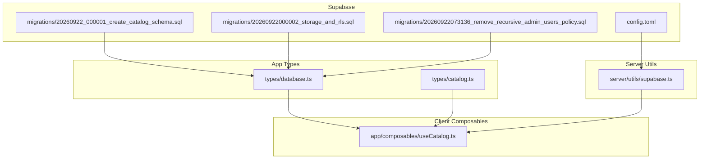
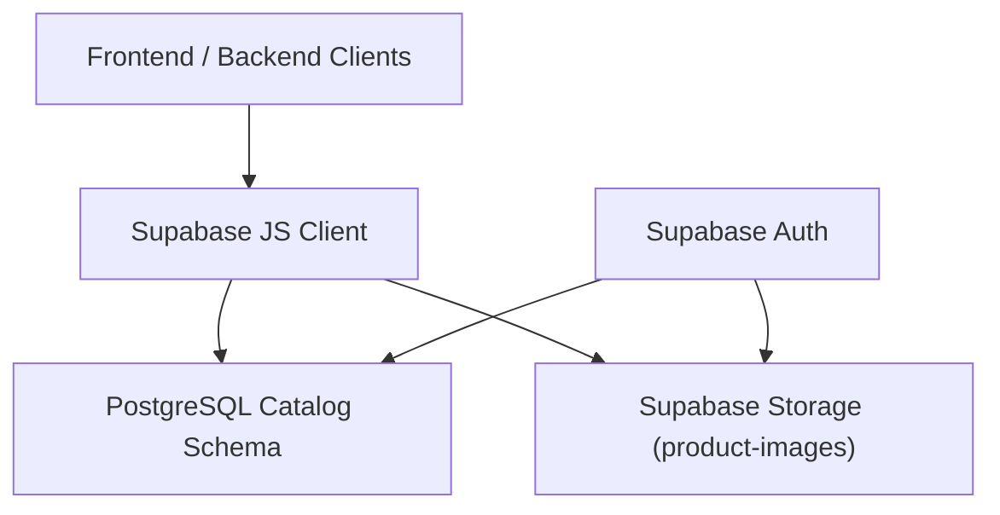
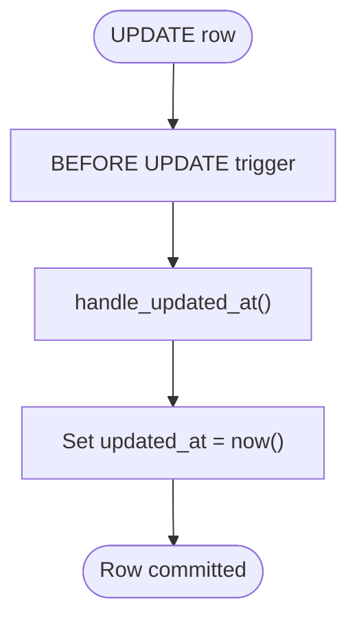
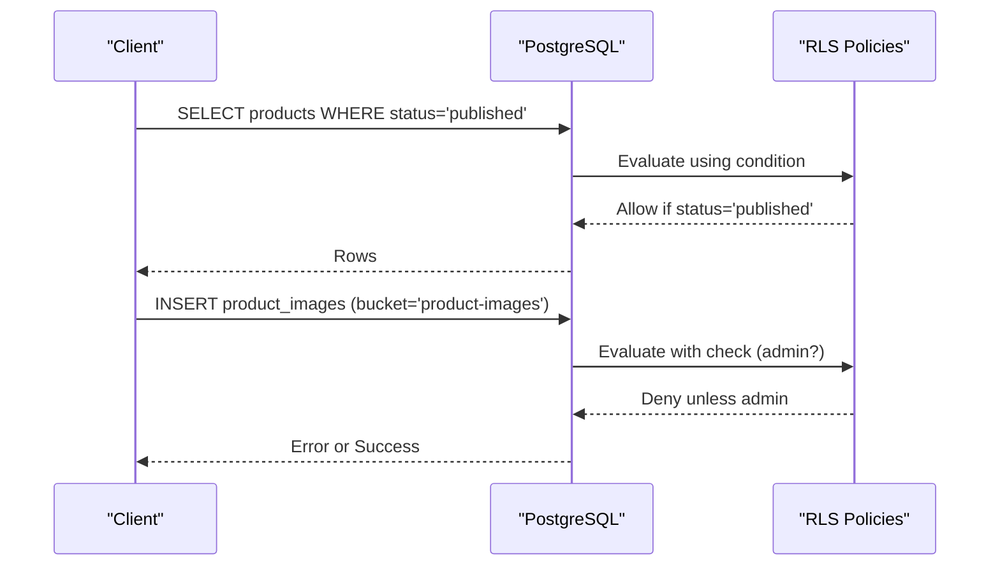
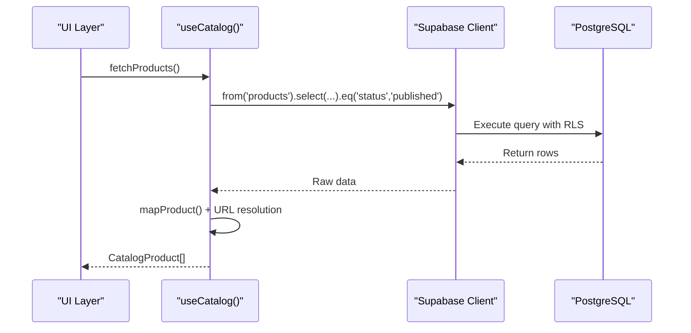
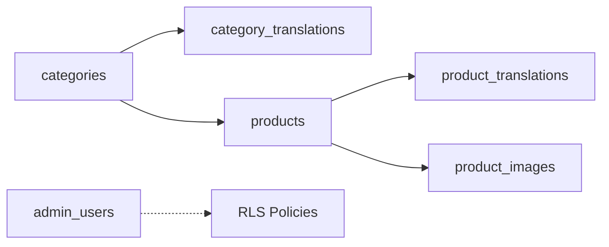

# Database Schema & Migrations

<cite>
**Referenced Files in This Document**
- [20260922_000001_create_catalog_schema.sql](file://supabase/migrations/20260922_000001_create_catalog_schema.sql)
- [20260922000002_storage_and_rls.sql](file://supabase/migrations/20260922000002_storage_and_rls.sql)
- [20260922073136_remove_recursive_admin_users_policy.sql](file://supabase/migrations/20260922073136_remove_recursive_admin_users_policy.sql)
- [config.toml](file://supabase/config.toml)
- [database.ts](file://app/types/database.ts)
- [catalog.ts](file://app/types/catalog.ts)
- [supabase.ts](file://server/utils/supabase.ts)
- [useCatalog.ts](file://app/composables/useCatalog.ts)
</cite>

## Table of Contents
1. [Introduction](#introduction)
2. [Project Structure](#project-structure)
3. [Core Components](#core-components)
4. [Architecture Overview](#architecture-overview)
5. [Detailed Component Analysis](#detailed-component-analysis)
6. [Dependency Analysis](#dependency-analysis)
7. [Performance Considerations](#performance-considerations)
8. [Troubleshooting Guide](#troubleshooting-guide)
9. [Conclusion](#conclusion)
10. [Appendices](#appendices)

## Introduction
This document provides comprehensive data model documentation for the PostgreSQL catalog schema used by the application. It covers entity relationships (products, categories, images, users), primary and foreign keys, indexes, constraints, Row Level Security (RLS) policies, triggers, stored functions, migration strategy, data access patterns via Supabase client, query optimization techniques, performance considerations, data lifecycle management, backup and disaster recovery procedures, and security measures including encryption, access controls, and audit trails.

## Project Structure
The database schema is defined in SQL migrations under the Supabase directory. TypeScript types define the runtime contract between the frontend/backend and the database. The Supabase configuration defines server ports, schemas, storage limits, and authentication settings.



**Diagram sources**
- [20260922_000001_create_catalog_schema.sql:1-113](file://supabase/migrations/20260922_000001_create_catalog_schema.sql#L1-L113)
- [20260922000002_storage_and_rls.sql:1-205](file://supabase/migrations/20260922000002_storage_and_rls.sql#L1-L205)
- [20260922073136_remove_recursive_admin_users_policy.sql:1-2](file://supabase/migrations/20260922073136_remove_recursive_admin_users_policy.sql#L1-L2)
- [config.toml:1-32](file://supabase/config.toml#L1-L32)
- [database.ts:1-123](file://app/types/database.ts#L1-L123)
- [catalog.ts:1-31](file://app/types/catalog.ts#L1-L31)
- [supabase.ts:1-20](file://server/utils/supabase.ts#L1-L20)
- [useCatalog.ts:1-61](file://app/composables/useCatalog.ts#L1-L61)

**Section sources**
- [20260922_000001_create_catalog_schema.sql:1-113](file://supabase/migrations/20260922_000001_create_catalog_schema.sql#L1-L113)
- [20260922000002_storage_and_rls.sql:1-205](file://supabase/migrations/20260922000002_storage_and_rls.sql#L1-L205)
- [20260922073136_remove_recursive_admin_users_policy.sql:1-2](file://supabase/migrations/20260922073136_remove_recursive_admin_users_policy.sql#L1-L2)
- [config.toml:1-32](file://supabase/config.toml#L1-L32)
- [database.ts:1-123](file://app/types/database.ts#L1-L123)
- [catalog.ts:1-31](file://app/types/catalog.ts#L1-L31)
- [supabase.ts:1-20](file://server/utils/supabase.ts#L1-L20)
- [useCatalog.ts:1-61](file://app/composables/useCatalog.ts#L1-L61)

## Core Components
The catalog system centers around six core tables:
- categories: product taxonomy with slug-based routing and active flags
- category_translations: localized names per locale
- products: catalog items with SKU, pricing, stock, status, and featured flag
- product_translations: localized product details and JSONB specifications
- product_images: media assets linked to products with ordering and primary image flag
- admin_users: authorization mapping from auth user IDs to roles

Key characteristics:
- UUIDs as primary keys generated at insert time
- ISO timestamps with timezone for created_at and updated_at
- Check constraints for business rules (e.g., non-negative price/stock, enumerated statuses)
- Unique constraints on slugs, SKUs, and translation uniqueness per locale
- Foreign key relationships enforcing referential integrity
- Indexes on frequently filtered columns (category_id, status, is_featured, locale, product_id, slug)
- Triggers to auto-update updated_at on row changes
- RLS policies controlling read/write access based on role and product status
- Storage policies for public read and admin-only write operations on product images

**Section sources**
- [20260922_000001_create_catalog_schema.sql:3-74](file://supabase/migrations/20260922_000001_create_catalog_schema.sql#L3-L74)
- [20260922000002_storage_and_rls.sql:1-160](file://supabase/migrations/20260922000002_storage_and_rls.sql#L1-L160)

## Architecture Overview
The architecture integrates a Postgres-backed catalog with Supabase Auth and Storage. Public clients can read published products and categories; admins can manage content and images. RLS enforces policy checks at the database level, while storage policies restrict uploads/updates/deletes to authenticated admins.



**Diagram sources**
- [20260922000002_storage_and_rls.sql:1-205](file://supabase/migrations/20260922000002_storage_and_rls.sql#L1-L205)
- [supabase.ts:1-20](file://server/utils/supabase.ts#L1-L20)
- [useCatalog.ts:1-61](file://app/composables/useCatalog.ts#L1-L61)

## Detailed Component Analysis

### Entity Relationship Model
The following diagram shows the main entities and their relationships:

```mermaid
erDiagram
CATEGORIES {
uuid id PK
text slug UK
integer sort_order
boolean is_active
timestamptz created_at
timestamptz updated_at
}
CATEGORY_TRANSLATIONS {
uuid id PK
uuid category_id FK
text locale
text name
timestamptz created_at
timestamptz updated_at
}
PRODUCTS {
uuid id PK
uuid category_id FK
text slug UK
text sku UK
numeric(10,2) price
text currency
integer stock_quantity
text status
boolean is_featured
timestamptz created_at
timestamptz updated_at
}
PRODUCT_TRANSLATIONS {
uuid id PK
uuid product_id FK
text locale
text name
text short_description
text description
jsonb specifications
timestamptz created_at
timestamptz updated_at
}
PRODUCT_IMAGES {
uuid id PK
uuid product_id FK
text storage_path
text alt_text
integer sort_order
boolean is_primary
timestamptz created_at
timestamptz updated_at
}
ADMIN_USERS {
uuid id PK
uuid user_id UK
text role
timestamptz created_at
timestamptz updated_at
}
CATEGORIES ||--o{ CATEGORY_TRANSLATIONS : "has many"
CATEGORIES ||--o{ PRODUCTS : "contains"
PRODUCTS ||--o{ PRODUCT_TRANSLATIONS : "has many"
PRODUCTS ||--o{ PRODUCT_IMAGES : "has many"
ADMIN_USERS ||--|| AUTH_USERS : "maps to"
```

**Diagram sources**
- [20260922_000001_create_catalog_schema.sql:3-67](file://supabase/migrations/20260922_000001_create_catalog_schema.sql#L3-L67)

### Table Definitions and Constraints

#### categories
- Primary Key: id (uuid, default gen_random_uuid())
- Unique: slug
- Fields: sort_order (integer, default 0), is_active (boolean, default true), created_at, updated_at
- Validation: None beyond NOT NULL defaults
- Indexes: idx_categories_slug(slug)
- RLS: Select allowed when is_active = true; Admins have full CRUD

**Section sources**
- [20260922_000001_create_catalog_schema.sql:3-10](file://supabase/migrations/20260922_000001_create_catalog_schema.sql#L3-L10)
- [20260922_000001_create_catalog_schema.sql:74](file://supabase/migrations/20260922_000001_create_catalog_schema.sql#L74)
- [20260922000002_storage_and_rls.sql:1-11](file://supabase/migrations/20260922000002_storage_and_rls.sql#L1-L11)
- [20260922000002_storage_and_rls.sql:45-61](file://supabase/migrations/20260922000002_storage_and_rls.sql#L45-L61)

#### category_translations
- Primary Key: id (uuid)
- Foreign Key: category_id references categories(id) on delete cascade
- Unique: (category_id, locale)
- Fields: locale, name, created_at, updated_at
- Indexes: idx_category_translations_locale(locale)
- RLS: Select allowed for everyone; Admins have full CRUD

**Section sources**
- [20260922_000001_create_catalog_schema.sql:12-20](file://supabase/migrations/20260922_000001_create_catalog_schema.sql#L12-L20)
- [20260922_000001_create_catalog_schema.sql:72](file://supabase/migrations/20260922_000001_create_catalog_schema.sql#L72)
- [20260922000002_storage_and_rls.sql:6-9](file://supabase/migrations/20260922000002_storage_and_rls.sql#L6-L9)
- [20260922000002_storage_and_rls.sql:63-79](file://supabase/migrations/20260922000002_storage_and_rls.sql#L63-L79)

#### products
- Primary Key: id (uuid)
- Foreign Key: category_id references categories(id) on delete restrict
- Unique: slug, sku
- Check Constraints: price >= 0; stock_quantity >= 0; status in ('draft', 'published', 'archived')
- Fields: currency (default 'USD'), is_featured (default false), created_at, updated_at
- Indexes: idx_products_category_id(category_id), idx_products_status(status), idx_products_featured(is_featured)
- RLS: Select allowed when status = 'published'; Admins have full CRUD

**Section sources**
- [20260922_000001_create_catalog_schema.sql:22-34](file://supabase/migrations/20260922_000001_create_catalog_schema.sql#L22-L34)
- [20260922_000001_create_catalog_schema.sql:69-71](file://supabase/migrations/20260922_000001_create_catalog_schema.sql#L69-L71)
- [20260922000002_storage_and_rls.sql:11-14](file://supabase/migrations/20260922000002_storage_and_rls.sql#L11-L14)
- [20260922000002_storage_and_rls.sql:81-97](file://supabase/migrations/20260922000002_storage_and_rls.sql#L81-L97)

#### product_translations
- Primary Key: id (uuid)
- Foreign Key: product_id references products(id) on delete cascade
- Unique: (product_id, locale)
- Fields: locale, name, short_description, description, specifications (jsonb, default [])
- Indexes: idx_product_translations_locale(locale)
- RLS: Select allowed when parent product status = 'published'; Admins have full CRUD

**Section sources**
- [20260922_000001_create_catalog_schema.sql:36-47](file://supabase/migrations/20260922_000001_create_catalog_schema.sql#L36-L47)
- [20260922_000001_create_catalog_schema.sql:72](file://supabase/migrations/20260922_000001_create_catalog_schema.sql#L72)
- [20260922000002_storage_and_rls.sql:16-26](file://supabase/migrations/20260922000002_storage_and_rls.sql#L16-L26)
- [20260922000002_storage_and_rls.sql:99-115](file://supabase/migrations/20260922000002_storage_and_rls.sql#L99-L115)

#### product_images
- Primary Key: id (uuid)
- Foreign Key: product_id references products(id) on delete cascade
- Unique: (product_id, storage_path)
- Fields: storage_path (not null), alt_text (nullable), sort_order (default 0), is_primary (default false), created_at, updated_at
- Indexes: idx_product_images_product_id(product_id)
- RLS: Select allowed when parent product status = 'published'; Admins have full CRUD

**Section sources**
- [20260922_000001_create_catalog_schema.sql:49-59](file://supabase/migrations/20260922_000001_create_catalog_schema.sql#L49-L59)
- [20260922_000001_create_catalog_schema.sql:73](file://supabase/migrations/20260922_000001_create_catalog_schema.sql#L73)
- [20260922000002_storage_and_rls.sql:28-38](file://supabase/migrations/20260922000002_storage_and_rls.sql#L28-L38)
- [20260922000002_storage_and_rls.sql:117-133](file://supabase/migrations/20260922000002_storage_and_rls.sql#L117-L133)

#### admin_users
- Primary Key: id (uuid)
- Unique: user_id
- Check Constraint: role in ('admin', 'super_admin')
- Fields: created_at, updated_at
- RLS: Users can select own record; Super admins can manage all admin_users records

**Section sources**
- [20260922_000001_create_catalog_schema.sql:61-67](file://supabase/migrations/20260922_000001_create_catalog_schema.sql#L61-L67)
- [20260922000002_storage_and_rls.sql:40-43](file://supabase/migrations/20260922000002_storage_and_rls.sql#L40-L43)
- [20260922000002_storage_and_rls.sql:135-153](file://supabase/migrations/20260922000002_storage_and_rls.sql#L135-L153)

### Triggers and Stored Functions
- Function handle_updated_at(): sets updated_at to now() before update
- Triggers: set_updated_at_<table> on each table to invoke handle_updated_at()
- Purpose: ensure consistent timestamp updates without application logic



**Diagram sources**
- [20260922_000001_create_catalog_schema.sql:76-112](file://supabase/migrations/20260922_000001_create_catalog_schema.sql#L76-L112)

**Section sources**
- [20260922_000001_create_catalog_schema.sql:76-112](file://supabase/migrations/20260922_000001_create_catalog_schema.sql#L76-L112)

### Row Level Security (RLS) Policies
- Categories: public select when is_active = true; admin CRUD
- Category translations: public select; admin CRUD
- Products: public select when status = 'published'; admin CRUD
- Product translations: public select when parent product status = 'published'; admin CRUD
- Product images: public select when parent product status = 'published'; admin CRUD
- Admin users: users can select own record; super_admins can manage all admin_users records
- Storage objects: public select for bucket 'product-images'; admin insert/update/delete for bucket 'product-images'



**Diagram sources**
- [20260922000002_storage_and_rls.sql:1-160](file://supabase/migrations/20260922000002_storage_and_rls.sql#L1-L160)
- [20260922000002_storage_and_rls.sql:162-205](file://supabase/migrations/20260922000002_storage_and_rls.sql#L162-L205)

**Section sources**
- [20260922000002_storage_and_rls.sql:1-160](file://supabase/migrations/20260922000002_storage_and_rls.sql#L1-L160)
- [20260922000002_storage_and_rls.sql:162-205](file://supabase/migrations/20260922000002_storage_and_rls.sql#L162-L205)

### Data Access Patterns via Supabase Client
- Server-side admin client uses service role key to bypass RLS where necessary
- Frontend composable useCatalog constructs typed queries and maps results to domain models
- Queries filter by status and locale, join related tables, and map storage paths to public URLs



**Diagram sources**
- [useCatalog.ts:1-61](file://app/composables/useCatalog.ts#L1-L61)
- [supabase.ts:1-20](file://server/utils/supabase.ts#L1-L20)

**Section sources**
- [useCatalog.ts:1-61](file://app/composables/useCatalog.ts#L1-L61)
- [supabase.ts:1-20](file://server/utils/supabase.ts#L1-L20)

## Dependency Analysis
The schema dependencies are enforced through foreign keys and unique constraints. Indexes support common query patterns. RLS policies depend on auth context and admin_roles.



**Diagram sources**
- [20260922_000001_create_catalog_schema.sql:3-67](file://supabase/migrations/20260922_000001_create_catalog_schema.sql#L3-L67)
- [20260922000002_storage_and_rls.sql:1-160](file://supabase/migrations/20260922000002_storage_and_rls.sql#L1-L160)

**Section sources**
- [20260922_000001_create_catalog_schema.sql:3-74](file://supabase/migrations/20260922_000001_create_catalog_schema.sql#L3-L74)
- [20260922000002_storage_and_rls.sql:1-160](file://supabase/migrations/20260922000002_storage_and_rls.sql#L1-L160)

## Performance Considerations
- Index usage:
  - idx_products_category_id supports filtering by category
  - idx_products_status supports filtering by status
  - idx_products_featured supports featured product queries
  - idx_product_translations_locale supports localization lookups
  - idx_product_images_product_id supports image retrieval per product
  - idx_categories_slug supports slug-based navigation
- Query patterns:
  - Use selective joins and projections to reduce payload size
  - Prefer status filters to leverage indexes
  - Avoid N+1 queries by selecting related data in one request
- Storage:
  - Enforce file_size_limit in config to prevent oversized uploads
- Monitoring:
  - Use EXPLAIN ANALYZE to validate plans for critical queries
  - Monitor pg_stat_statements for slow queries

[No sources needed since this section provides general guidance]

## Troubleshooting Guide
Common issues and resolutions:
- RLS denies access:
  - Ensure the user has appropriate admin role in admin_users
  - Verify product status is 'published' for public reads
  - Confirm storage bucket is 'product-images' for image operations
- Migration failures:
  - Ensure idempotent constraint additions using DO blocks
  - Validate that policies exist before dropping them
- Timestamp inconsistencies:
  - Confirm triggers are enabled and function exists
- Type mismatches:
  - Align TypeScript interfaces with database schema definitions

**Section sources**
- [20260922000002_storage_and_rls.sql:1-160](file://supabase/migrations/20260922000002_storage_and_rls.sql#L1-L160)
- [20260922073136_remove_recursive_admin_users_policy.sql:1-2](file://supabase/migrations/20260922073136_remove_recursive_admin_users_policy.sql#L1-L2)
- [20260922_000001_create_catalog_schema.sql:76-112](file://supabase/migrations/20260922_000001_create_catalog_schema.sql#L76-L112)

## Conclusion
The catalog schema implements a robust, secure, and performant foundation for product and category management. It leverages strong constraints, targeted indexes, and granular RLS policies to enforce business rules and access controls. The migration strategy ensures versioned schema evolution, while TypeScript types provide type safety across the stack. Operational best practices such as monitoring, backups, and disaster recovery should be applied to maintain data integrity and availability.

[No sources needed since this section summarizes without analyzing specific files]

## Appendices

### Migration Strategy and Version Management
- Migrations are ordered by timestamp prefixes to ensure deterministic execution
- Changes include schema creation, RLS policies, and policy adjustments
- Rollback procedure:
  - Maintain reverse migrations or use point-in-time recovery from backups
  - For policy removals, drop policies explicitly as shown in the third migration
- Versioning:
  - Each migration file represents a discrete change set
  - Apply migrations sequentially in CI/CD pipelines

**Section sources**
- [20260922_000001_create_catalog_schema.sql:1-113](file://supabase/migrations/20260922_000001_create_catalog_schema.sql#L1-L113)
- [20260922000002_storage_and_rls.sql:1-205](file://supabase/migrations/20260922000002_storage_and_rls.sql#L1-L205)
- [20260922073136_remove_recursive_admin_users_policy.sql:1-2](file://supabase/migrations/20260922073136_remove_recursive_admin_users_policy.sql#L1-L2)

### Data Lifecycle Management
- Creation:
  - Categories and products created with defaults and constraints
  - Translations added per locale with uniqueness enforcement
- Updates:
  - updated_at automatically maintained by triggers
- Deletion:
  - Cascade deletes remove dependent translations and images
  - Restrict delete prevents accidental category deletion when products exist
- Archival:
  - Status field allows archiving products without deleting data

**Section sources**
- [20260922_000001_create_catalog_schema.sql:22-34](file://supabase/migrations/20260922_000001_create_catalog_schema.sql#L22-L34)
- [20260922_000001_create_catalog_schema.sql:36-47](file://supabase/migrations/20260922_000001_create_catalog_schema.sql#L36-L47)
- [20260922_000001_create_catalog_schema.sql:49-59](file://supabase/migrations/20260922_000001_create_catalog_schema.sql#L49-L59)

### Backup Strategies and Disaster Recovery
- Backups:
  - Use pg_dump for logical backups of the public schema
  - Schedule regular backups and store securely offsite
- Restore:
  - Use pg_restore to restore logical backups
  - Validate schema and data integrity post-restore
- DR Procedures:
  - Define RTO/RPO targets
  - Test failover and recovery processes regularly

[No sources needed since this section provides general guidance]

### Security Measures
- Encryption:
  - TLS for client connections to Supabase
  - pgcrypto extension available for cryptographic functions
- Access Controls:
  - RLS policies restrict data visibility and mutations
  - Storage policies limit object operations to admins
- Audit Trails:
  - Updated_at fields capture modification times
  - Consider adding explicit audit tables for sensitive operations

**Section sources**
- [20260922_000001_create_catalog_schema.sql:1](file://supabase/migrations/20260922_000001_create_catalog_schema.sql#L1)
- [20260922000002_storage_and_rls.sql:1-160](file://supabase/migrations/20260922000002_storage_and_rls.sql#L1-L160)
- [20260922000002_storage_and_rls.sql:162-205](file://supabase/migrations/20260922000002_storage_and_rls.sql#L162-L205)