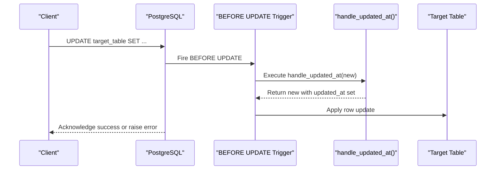
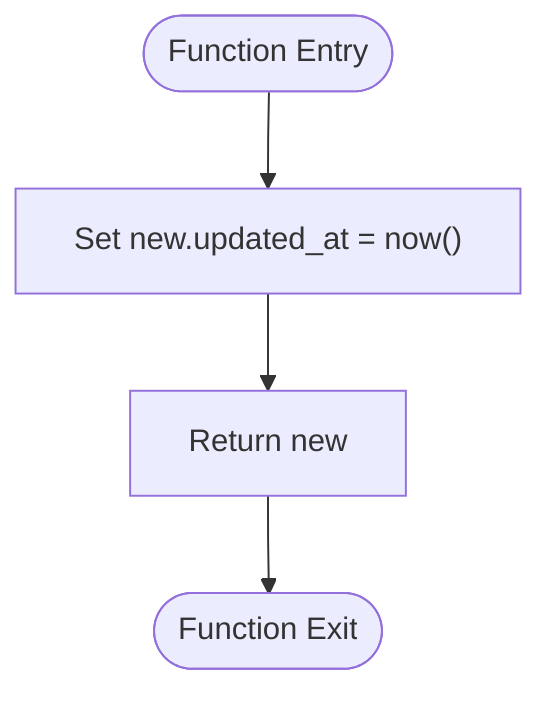
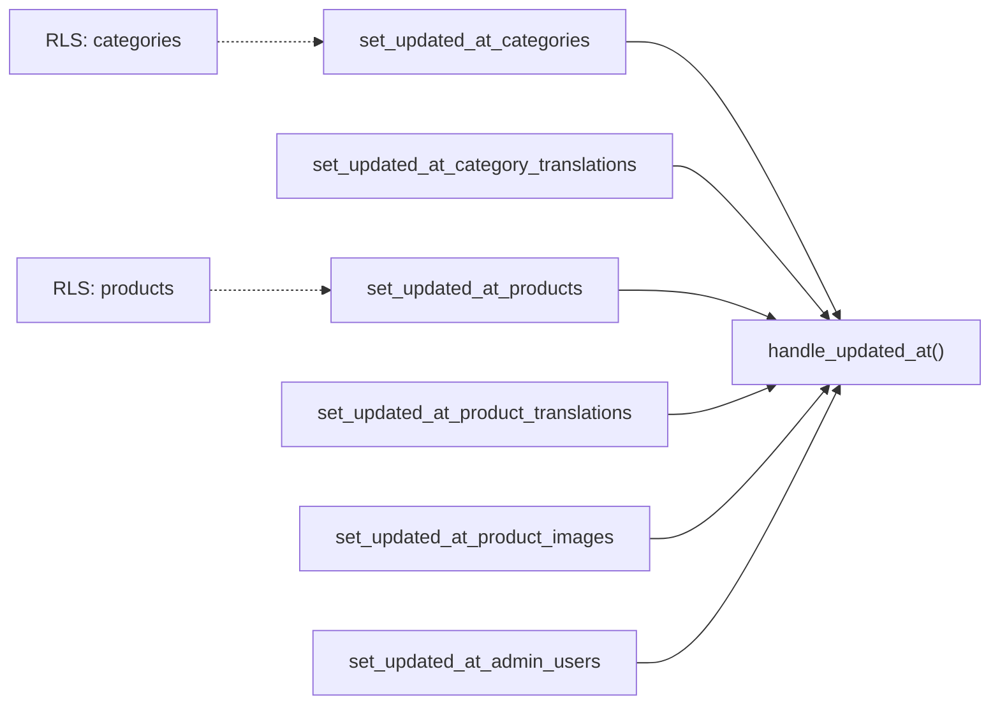

# Database Triggers & Functions

<cite>
**Referenced Files in This Document**
- [20260922_000001_create_catalog_schema.sql](file://supabase/migrations/20260922_000001_create_catalog_schema.sql)
- [20260922000002_storage_and_rls.sql](file://supabase/migrations/20260922000002_storage_and_rls.sql)
</cite>

## Table of Contents
1. [Introduction](#introduction)
2. [Project Structure](#project-structure)
3. [Core Components](#core-components)
4. [Architecture Overview](#architecture-overview)
5. [Detailed Component Analysis](#detailed-component-analysis)
6. [Dependency Analysis](#dependency-analysis)
7. [Performance Considerations](#performance-considerations)
8. [Troubleshooting Guide](#troubleshooting-guide)
9. [Conclusion](#conclusion)
10. [Appendices](#appendices)

## Introduction
This document explains the database triggers and stored functions that automate data management and enforce business rules within the catalog schema. It focuses on:
- The handle_updated_at function that automatically maintains updated_at timestamps across tables.
- Trigger implementations for categories, products, translations, product images, and admin users.
- PL/pgSQL function structure and error handling mechanisms.
- Performance considerations, debugging techniques, transaction boundaries, extension patterns, and monitoring/logging strategies.

## Project Structure
The database logic is defined in SQL migrations under the supabase/migrations directory. The primary migration defines the catalog schema, indexes, the handle_updated_at function, and row-level update triggers. A second migration adds Row Level Security (RLS) policies and storage policies.

```mermaid
graph TB
subgraph "Database Migrations"
M1["create_catalog_schema.sql"]
M2["storage_and_rls.sql"]
end
subgraph "Schema Objects"
T_CAT["categories"]
T_CAT_TR["category_translations"]
T_PROD["products"]
T_PROD_TR["product_translations"]
T_IMG["product_images"]
T_ADMIN["admin_users"]
FN_UPD["handle_updated_at()"]
TRG_CAT["set_updated_at_categories"]
TRG_CAT_TR["set_updated_at_category_translations"]
TRG_PROD["set_updated_at_products"]
TRG_PROD_TR["set_updated_at_product_translations"]
TRG_IMG["set_updated_at_product_images"]
TRG_ADMIN["set_updated_at_admin_users"]
end
M1 --> T_CAT
M1 --> T_CAT_TR
M1 --> T_PROD
M1 --> T_PROD_TR
M1 --> T_IMG
M1 --> T_ADMIN
M1 --> FN_UPD
M1 --> TRG_CAT
M1 --> TRG_CAT_TR
M1 --> TRG_PROD
M1 --> TRG_PROD_TR
M1 --> TRG_IMG
M1 --> TRG_ADMIN
M2 --> T_CAT
M2 --> T_CAT_TR
M2 --> T_PROD
M2 --> T_PROD_TR
M2 --> T_IMG
M2 --> T_ADMIN
```

**Diagram sources**
- [20260922_000001_create_catalog_schema.sql:3-67](file://supabase/migrations/20260922_000001_create_catalog_schema.sql#L3-L67)
- [20260922_000001_create_catalog_schema.sql:76-112](file://supabase/migrations/20260922_000001_create_catalog_schema.sql#L76-L112)
- [20260922000002_storage_and_rls.sql:1-160](file://supabase/migrations/20260922000002_storage_and_rls.sql#L1-L160)

**Section sources**
- [20260922_000001_create_catalog_schema.sql:1-113](file://supabase/migrations/20260922_000001_create_catalog_schema.sql#L1-L113)
- [20260922000002_storage_and_rls.sql:1-205](file://supabase/migrations/20260922000002_storage_and_rls.sql#L1-L205)

## Core Components
- handle_updated_at(): A PL/pgSQL function that sets new.updated_at to the current timestamp before an UPDATE.
- Update triggers: One per table that invokes handle_updated_at on each row update.
- RLS policies: Enforce read/write access based on user roles and entity status.

Key responsibilities:
- Timestamp maintenance: Ensures consistent auditability via updated_at.
- Business rule enforcement: Combined with RLS policies to restrict operations by role and visibility.
- Data integrity: Supported by constraints and indexes defined in the schema.

**Section sources**
- [20260922_000001_create_catalog_schema.sql:76-112](file://supabase/migrations/20260922_000001_create_catalog_schema.sql#L76-L112)
- [20260922000002_storage_and_rls.sql:1-160](file://supabase/migrations/20260922000002_storage_and_rls.sql#L1-L160)

## Architecture Overview
The trigger architecture is simple and uniform:
- Each table has a BEFORE UPDATE trigger.
- All triggers call the same handle_updated_at function.
- The function updates only the updated_at column; no other side effects occur.

**Diagram sources**
- [20260922_000001_create_catalog_schema.sql:76-112](file://supabase/migrations/20260922_000001_create_catalog_schema.sql#L76-L112)

## Detailed Component Analysis

### Function: handle_updated_at
Purpose:
- Automatically set updated_at to the current timestamp on every row update.

Behavior:
- Modifies the incoming NEW row’s updated_at field.
- Returns the modified NEW row so the UPDATE proceeds.

Error handling:
- No explicit exception handling; errors propagate to the caller.
- If any constraint or policy fails during the UPDATE, the entire operation rolls back.

Complexity:
- O(1) per row; negligible overhead.

Extension points:
- Add additional fields (e.g., updated_by) if auditing requires it.
- Introduce conditional logic to skip updates when specific columns are unchanged.

**Diagram sources**
- [20260922_000001_create_catalog_schema.sql:76-82](file://supabase/migrations/20260922_000001_create_catalog_schema.sql#L76-L82)

**Section sources**
- [20260922_000001_create_catalog_schema.sql:76-82](file://supabase/migrations/20260922_000001_create_catalog_schema.sql#L76-L82)

### Trigger: set_updated_at_categories
- Fires BEFORE UPDATE on public.categories.
- Calls handle_updated_at to refresh updated_at.

Use cases:
- Maintaining last-modified time for category metadata.

**Section sources**
- [20260922_000001_create_catalog_schema.sql:84-87](file://supabase/migrations/20260922_000001_create_catalog_schema.sql#L84-L87)

### Trigger: set_updated_at_category_translations
- Fires BEFORE UPDATE on public.category_translations.
- Keeps translation records’ updated_at current.

**Section sources**
- [20260922_000001_create_catalog_schema.sql:89-92](file://supabase/migrations/20260922_000001_create_catalog_schema.sql#L89-L92)

### Trigger: set_updated_at_products
- Fires BEFORE UPDATE on public.products.
- Ensures product rows reflect their latest modification time.

**Section sources**
- [20260922_000001_create_catalog_schema.sql:94-97](file://supabase/migrations/20260922_000001_create_catalog_schema.sql#L94-L97)

### Trigger: set_updated_at_product_translations
- Fires BEFORE UPDATE on public.product_translations.
- Tracks changes to localized content.

**Section sources**
- [20260922_000001_create_catalog_schema.sql:99-102](file://supabase/migrations/20260922_000001_create_catalog_schema.sql#L99-L102)

### Trigger: set_updated_at_product_images
- Fires BEFORE UPDATE on public.product_images.
- Maintains image metadata freshness.

**Section sources**
- [20260922_000001_create_catalog_schema.sql:104-107](file://supabase/migrations/20260922_000001_create_catalog_schema.sql#L104-L107)

### Trigger: set_updated_at_admin_users
- Fires BEFORE UPDATE on public.admin_users.
- Keeps admin account metadata up to date.

**Section sources**
- [20260922_000001_create_catalog_schema.sql:109-112](file://supabase/migrations/20260922_000001_create_catalog_schema.sql#L109-L112)

### Schema Tables and Indexes
Tables involved:
- categories, category_translations
- products, product_translations, product_images
- admin_users

Indexes:
- Optimizes lookups by category_id, status, featured flag, locale, product_id, and slug.

Constraints:
- Primary keys, unique constraints, check constraints (e.g., price >= 0, status enum).

**Section sources**
- [20260922_000001_create_catalog_schema.sql:3-75](file://supabase/migrations/20260922_000001_create_catalog_schema.sql#L3-L75)

### Row-Level Security Policies
Public visibility:
- Categories visible when active.
- Products and related translations/images visible when product status is published.

Admin-only write access:
- Admins can manage categories, translations, products, images, and admin users.
- Only super_admins can manage admin_users.

Storage policies:
- Public read access to product-images bucket.
- Admin-only upload/update/delete for product-images.

**Section sources**
- [20260922000002_storage_and_rls.sql:1-205](file://supabase/migrations/20260922000002_storage_and_rls.sql#L1-L205)

## Dependency Analysis
Triggers depend on:
- The handle_updated_at function.
- Target tables’ schemas and constraints.
- RLS policies evaluated at query execution time.

**Diagram sources**
- [20260922_000001_create_catalog_schema.sql:76-112](file://supabase/migrations/20260922_000001_create_catalog_schema.sql#L76-L112)
- [20260922000002_storage_and_rls.sql:1-160](file://supabase/migrations/20260922000002_storage_and_rls.sql#L1-L160)

**Section sources**
- [20260922_000001_create_catalog_schema.sql:76-112](file://supabase/migrations/20260922_000001_create_catalog_schema.sql#L76-L112)
- [20260922000002_storage_and_rls.sql:1-160](file://supabase/migrations/20260922000002_storage_and_rls.sql#L1-L160)

## Performance Considerations
- Trigger overhead: Minimal per-row assignment; negligible CPU cost.
- Transaction scope: Triggers execute within the same transaction as the triggering statement; failures roll back the entire operation.
- Index usage: Ensure queries leverage existing indexes to avoid full scans.
- Bulk updates: Large UPDATE statements will invoke triggers per row; consider batching to reduce lock contention and WAL pressure.
- Avoid unnecessary updates: Clients should only update changed columns to minimize trigger invocations.

[No sources needed since this section provides general guidance]

## Troubleshooting Guide

Common issues and resolutions:
- Updated_at not changing:
  - Verify the correct BEFORE UPDATE trigger exists on the table.
  - Confirm the UPDATE actually modifies a column; some clients may bypass triggers if no values change.
- Permission denied:
  - Check RLS policies for the table and ensure the authenticated user has appropriate privileges.
- Constraint violations:
  - Validate input against CHECK constraints (e.g., non-negative price, valid status).
- Performance regressions:
  - Use EXPLAIN ANALYZE to inspect query plans.
  - Ensure indexes exist for frequently filtered columns.

Debugging techniques:
- Inspect trigger definitions and function source using system catalogs.
- Temporarily disable triggers in development to isolate behavior.
- Log function calls by adding logging to handle_updated_at (see Monitoring below).

Transaction boundaries and atomicity:
- Triggers run inside the client’s transaction; all-or-nothing semantics apply.
- Errors raised in triggers abort the transaction unless caught by higher-level error handling.

**Section sources**
- [20260922_000001_create_catalog_schema.sql:76-112](file://supabase/migrations/20260922_000001_create_catalog_schema.sql#L76-L112)
- [20260922000002_storage_and_rls.sql:1-160](file://supabase/migrations/20260922000002_storage_and_rls.sql#L1-L160)

## Conclusion
The catalog schema uses a uniform trigger pattern to maintain updated_at timestamps consistently across all relevant tables. The handle_updated_at function centralizes timestamp logic, while RLS policies enforce secure access. This design keeps business logic close to the data, ensuring consistency and auditability. For future enhancements, extend the function or add targeted triggers to implement additional business rules, and adopt monitoring and logging practices to keep trigger behavior observable.

[No sources needed since this section summarizes without analyzing specific files]

## Appendices

### How to Extend Existing Triggers or Create New Ones
- To add more metadata (e.g., updated_by), modify handle_updated_at to include additional assignments.
- To create a new trigger for another table:
  - Define a BEFORE UPDATE trigger that executes handle_updated_at.
  - Optionally add table-specific logic in a dedicated function and chain calls from the trigger.
- To enforce additional business rules:
  - Create a separate function for validation or transformation.
  - Attach a BEFORE INSERT/UPDATE trigger to call the function and raise errors on violations.

[No sources needed since this section provides general guidance]

### Monitoring and Logging Strategies
- Enable pg_stat_statements to track slow queries involving these tables.
- Add controlled logging inside handle_updated_at (e.g., log level, event type) to capture trigger executions and errors.
- Use database logs and external observability tools to correlate trigger activity with application requests.
- Periodically review trigger performance with EXPLAIN ANALYZE and monitor lock waits during bulk operations.

[No sources needed since this section provides general guidance]