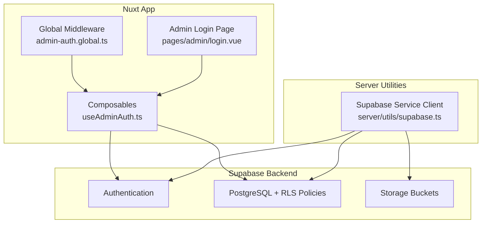
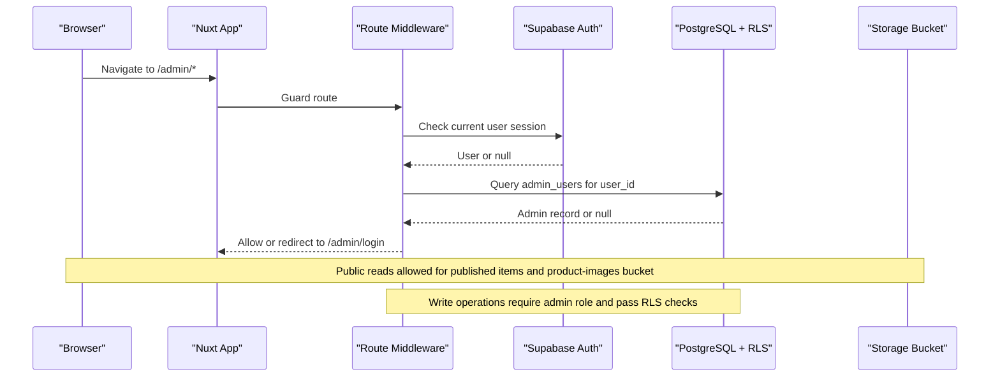
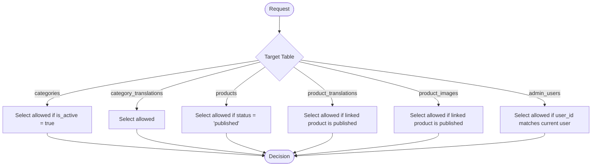
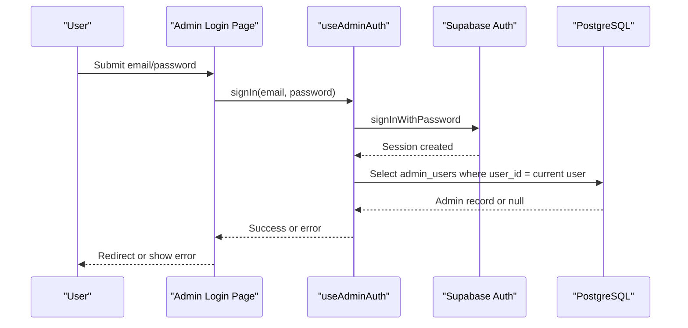
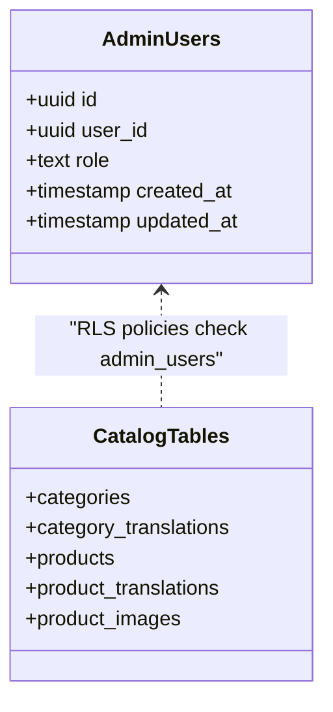
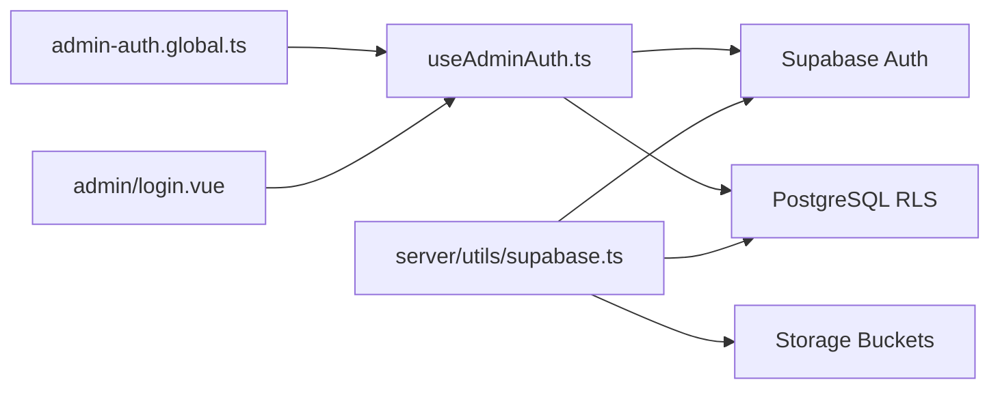

# Row Level Security & Access Control

<cite>
**Referenced Files in This Document**
- [README.md](file://README.md)
- [nuxt.config.ts](file://nuxt.config.ts)
- [app/middleware/admin-auth.global.ts](file://app/middleware/admin-auth.global.ts)
- [app/composables/useAdminAuth.ts](file://app/composables/useAdminAuth.ts)
- [app/pages/admin/login.vue](file://app/pages/admin/login.vue)
- [server/utils/supabase.ts](file://server/utils/supabase.ts)
- [supabase/config.toml](file://supabase/config.toml)
- [supabase/migrations/20260922_000001_create_catalog_schema.sql](file://supabase/migrations/20260922_000001_create_catalog_schema.sql)
- [supabase/migrations/20260922000002_storage_and_rls.sql](file://supabase/migrations/20260922000002_storage_and_rls.sql)
- [supabase/migrations/20260922073136_remove_recursive_admin_users_policy.sql](file://supabase/migrations/20260922073136_remove_recursive_admin_users_policy.sql)
</cite>

## Table of Contents
1. [Introduction](#introduction)
2. [Project Structure](#project-structure)
3. [Core Components](#core-components)
4. [Architecture Overview](#architecture-overview)
5. [Detailed Component Analysis](#detailed-component-analysis)
6. [Dependency Analysis](#dependency-analysis)
7. [Performance Considerations](#performance-considerations)
8. [Troubleshooting Guide](#troubleshooting-guide)
9. [Conclusion](#conclusion)
10. [Appendices](#appendices)

## Introduction
This document explains the Row Level Security (RLS) policies and access control mechanisms used to protect data and enforce user permissions. It covers:
- RLS policies for products, categories, product translations, product images, and admin users
- Authentication middleware and role-based authorization patterns
- Storage bucket policies for image uploads and access controls
- Admin user management with roles (admin vs super_admin) and permission inheritance
- Session management, token validation, and secure API endpoints
- Audit logging capabilities and access monitoring features

The system uses Supabase for authentication, database RLS, and storage policies, combined with a Nuxt application that enforces route-level guards and composable-based role checks.

## Project Structure
At a high level:
- Database schema and RLS policies are defined in SQL migrations under supabase/migrations
- The Nuxt app provides:
  - Global route middleware to guard admin routes
  - Composables for admin authentication and role checks
  - An admin login page
- A server utility creates a service-role client for privileged operations
- Supabase configuration defines API, storage, auth, and local development settings

**Diagram sources**
- [app/middleware/admin-auth.global.ts:1-28](file://app/middleware/admin-auth.global.ts#L1-L28)
- [app/composables/useAdminAuth.ts:1-79](file://app/composables/useAdminAuth.ts#L1-L79)
- [app/pages/admin/login.vue:1-121](file://app/pages/admin/login.vue#L1-L121)
- [server/utils/supabase.ts:1-20](file://server/utils/supabase.ts#L1-L20)
- [supabase/migrations/20260922000002_storage_and_rls.sql:1-205](file://supabase/migrations/20260922000002_storage_and_rls.sql#L1-L205)

**Section sources**
- [README.md:1-36](file://README.md#L1-L36)
- [nuxt.config.ts:22-22](file://nuxt.config.ts#L22-L22)

## Core Components
- Database schema and indexes define catalog entities and audit timestamps
- RLS policies enforce read/write restrictions based on user roles and record state
- Storage policies restrict upload/update/delete to authenticated admins while allowing public reads
- Route middleware protects admin pages and validates admin membership
- Composables provide reusable functions for sign-in, sign-out, and role checks
- Server-side service client enables privileged operations bypassing RLS when necessary

Key responsibilities:
- Data security via RLS at the database layer
- Authorization at the application layer (middleware and composables)
- Secure storage access via bucket policies
- Admin workflow through login and protected routes

**Section sources**
- [supabase/migrations/20260922_000001_create_catalog_schema.sql:1-113](file://supabase/migrations/20260922_000001_create_catalog_schema.sql#L1-L113)
- [supabase/migrations/20260922000002_storage_and_rls.sql:1-205](file://supabase/migrations/20260922000002_storage_and_rls.sql#L1-L205)
- [app/middleware/admin-auth.global.ts:1-28](file://app/middleware/admin-auth.global.ts#L1-L28)
- [app/composables/useAdminAuth.ts:1-79](file://app/composables/useAdminAuth.ts#L1-L79)
- [server/utils/supabase.ts:1-20](file://server/utils/supabase.ts#L1-L20)

## Architecture Overview
The access control architecture combines multiple layers:
- Authentication is handled by Supabase Auth
- Authorization is enforced by:
  - Application-level guards (route middleware)
  - Role checks (composables)
  - Database-level RLS policies
- Storage access is governed by bucket policies tied to admin roles
- Privileged backend operations can use a service-role client

**Diagram sources**
- [app/middleware/admin-auth.global.ts:1-28](file://app/middleware/admin-auth.global.ts#L1-L28)
- [supabase/migrations/20260922000002_storage_and_rls.sql:1-205](file://supabase/migrations/20260922000002_storage_and_rls.sql#L1-L205)

## Detailed Component Analysis

### Database Schema and Audit Timestamps
- Tables include categories, category_translations, products, product_translations, product_images, and admin_users
- Indexes optimize queries by category_id, status, featured flag, locale, product_id, and slug
- Triggers update updated_at automatically across tables using a shared function

Security implications:
- Enforced constraints and unique keys reduce data integrity risks
- Updated-at triggers support auditing and change tracking

**Section sources**
- [supabase/migrations/20260922_000001_create_catalog_schema.sql:1-113](file://supabase/migrations/20260922_000001_create_catalog_schema.sql#L1-L113)

### Row Level Security Policies
Public read access:
- Categories: selectable when active
- Category translations: selectable by everyone
- Products: selectable when status is published
- Product translations: selectable only when linked product is published
- Product images: selectable only when linked product is published

Admin write access:
- Categories, category_translations, products, product_translations, product_images: all operations allowed if the current user has an admin_users record
- Admin users: managed only by super_admin role

Storage bucket policies:
- product-images bucket: public select; insert/update/delete restricted to admins

Policy enablement:
- RLS enabled for all relevant tables

**Diagram sources**
- [supabase/migrations/20260922000002_storage_and_rls.sql:1-160](file://supabase/migrations/20260922000002_storage_and_rls.sql#L1-L160)

**Section sources**
- [supabase/migrations/20260922000002_storage_and_rls.sql:1-160](file://supabase/migrations/20260922000002_storage_and_rls.sql#L1-L160)

### Storage Bucket Policies for Images
- Public read access to the product-images bucket
- Admin-only insert, update, and delete operations on the product-images bucket
- Policies validate both bucket identity and admin presence via admin_users

Operational guidance:
- Ensure uploaded files are associated with published products to be visible publicly
- Restrict administrative file operations to authenticated admin users

**Section sources**
- [supabase/migrations/20260922000002_storage_and_rls.sql:162-205](file://supabase/migrations/20260922000002_storage_and_rls.sql#L162-L205)

### Authentication Middleware and Role-Based Authorization
Route middleware:
- Guards /admin/* routes except /admin/login
- Redirects unauthenticated users to /admin/login
- Validates that the current user has an admin_users record before allowing access

Composables:
- getCurrentUser retrieves the authenticated user from Supabase Auth or reactive store
- isAdmin checks whether the current user has an admin_users record
- isSuperAdmin checks whether the current user’s role is super_admin
- signIn and signOut wrap Supabase Auth methods

Login page:
- Handles email/password sign-in
- Verifies admin membership after successful authentication
- Displays errors and redirects appropriately

**Diagram sources**
- [app/pages/admin/login.vue:1-121](file://app/pages/admin/login.vue#L1-L121)
- [app/composables/useAdminAuth.ts:1-79](file://app/composables/useAdminAuth.ts#L1-L79)

**Section sources**
- [app/middleware/admin-auth.global.ts:1-28](file://app/middleware/admin-auth.global.ts#L1-L28)
- [app/composables/useAdminAuth.ts:1-79](file://app/composables/useAdminAuth.ts#L1-L79)
- [app/pages/admin/login.vue:1-121](file://app/pages/admin/login.vue#L1-L121)

### Admin User Management and Permission Inheritance
- admin_users table stores user_id and role with values admin or super_admin
- RLS allows:
  - Users to read their own admin record
  - Admins to manage catalog data (categories, products, translations, images)
  - Super admins to manage admin_users records
- A migration removes a recursive policy on admin_users to avoid self-referential loops

Permission model:
- admin: read own admin record; manage catalog data
- super_admin: inherits admin capabilities plus ability to manage admin_users

**Diagram sources**
- [supabase/migrations/20260922_000001_create_catalog_schema.sql:61-67](file://supabase/migrations/20260922_000001_create_catalog_schema.sql#L61-L67)
- [supabase/migrations/20260922000002_storage_and_rls.sql:40-153](file://supabase/migrations/20260922000002_storage_and_rls.sql#L40-L153)
- [supabase/migrations/20260922073136_remove_recursive_admin_users_policy.sql:1-2](file://supabase/migrations/20260922073136_remove_recursive_admin_users_policy.sql#L1-L2)

**Section sources**
- [supabase/migrations/20260922_000001_create_catalog_schema.sql:61-67](file://supabase/migrations/20260922_000001_create_catalog_schema.sql#L61-L67)
- [supabase/migrations/20260922000002_storage_and_rls.sql:40-153](file://supabase/migrations/20260922000002_storage_and_rls.sql#L40-L153)
- [supabase/migrations/20260922073136_remove_recursive_admin_users_policy.sql:1-2](file://supabase/migrations/20260922073136_remove_recursive_admin_users_policy.sql#L1-L2)

### Session Management and Token Validation
- Authentication relies on Supabase Auth sessions
- The service-role client disables session persistence and auto-refresh, suitable for server-side privileged operations
- Route middleware checks the current user session and validates admin membership

Best practices:
- Use service-role client only on the server side
- Avoid persisting tokens in client-side storage for privileged operations
- Validate user identity and roles at each sensitive operation

**Section sources**
- [server/utils/supabase.ts:1-20](file://server/utils/supabase.ts#L1-L20)
- [app/middleware/admin-auth.global.ts:1-28](file://app/middleware/admin-auth.global.ts#L1-L28)
- [app/composables/useAdminAuth.ts:7-14](file://app/composables/useAdminAuth.ts#L7-L14)

### Secure API Endpoints and Privileged Operations
- The service-role client is configured with URL and service role key from runtime config
- Missing configuration throws an error to prevent unsafe initialization
- Use this client for backend tasks requiring elevated privileges, ensuring RLS is intentionally bypassed

Recommendations:
- Keep service role keys secret and never expose them to the client
- Limit usage of service-role client to trusted server code
- Apply additional application-level authorization checks even when using service-role client

**Section sources**
- [server/utils/supabase.ts:1-20](file://server/utils/supabase.ts#L1-L20)

### Audit Logging and Access Monitoring
- Updated-at triggers maintain timestamps for changes across tables
- While explicit audit logs are not defined in the provided files, updated_at fields support basic change tracking
- For comprehensive audit logging, consider adding dedicated audit tables and triggers that log user actions, timestamps, and affected rows

Monitoring suggestions:
- Enable database query logging and analytics as needed
- Track failed authentication attempts and authorization denials at the application layer
- Use Supabase logs and external observability tools to monitor access patterns

**Section sources**
- [supabase/migrations/20260922_000001_create_catalog_schema.sql:76-113](file://supabase/migrations/20260922_000001_create_catalog_schema.sql#L76-L113)

## Dependency Analysis
The following diagram shows how components depend on each other:

**Diagram sources**
- [app/middleware/admin-auth.global.ts:1-28](file://app/middleware/admin-auth.global.ts#L1-L28)
- [app/composables/useAdminAuth.ts:1-79](file://app/composables/useAdminAuth.ts#L1-L79)
- [app/pages/admin/login.vue:1-121](file://app/pages/admin/login.vue#L1-L121)
- [server/utils/supabase.ts:1-20](file://server/utils/supabase.ts#L1-L20)

**Section sources**
- [app/middleware/admin-auth.global.ts:1-28](file://app/middleware/admin-auth.global.ts#L1-L28)
- [app/composables/useAdminAuth.ts:1-79](file://app/composables/useAdminAuth.ts#L1-L79)
- [app/pages/admin/login.vue:1-121](file://app/pages/admin/login.vue#L1-L121)
- [server/utils/supabase.ts:1-20](file://server/utils/supabase.ts#L1-L20)

## Performance Considerations
- RLS policies rely on existence checks against admin_users; ensure appropriate indexes exist on user_id columns to minimize lookup costs
- Published-product checks involve joins between product_translations/product_images and products; indexing product_id and status improves performance
- Storage bucket policies add overhead per operation; keep file sizes within limits and avoid unnecessary updates
- Minimize client-side role checks by relying on RLS for authoritative enforcement

[No sources needed since this section provides general guidance]

## Troubleshooting Guide
Common issues and resolutions:
- Unauthorized access to admin routes:
  - Verify the user is authenticated and has an admin_users record
  - Check middleware redirection logic and error handling
- Admin login failures:
  - Confirm credentials and admin membership verification flow
  - Inspect error messages and ensure proper sign-out on unauthorized attempts
- Storage upload denied:
  - Ensure the user is authenticated and has admin role
  - Verify bucket name and policy conditions
- Service-role client misconfiguration:
  - Validate runtime configuration includes Supabase URL and service role key
  - Avoid exposing service role keys to the client

**Section sources**
- [app/middleware/admin-auth.global.ts:12-27](file://app/middleware/admin-auth.global.ts#L12-L27)
- [app/pages/admin/login.vue:25-54](file://app/pages/admin/login.vue#L25-L54)
- [server/utils/supabase.ts:4-11](file://server/utils/supabase.ts#L4-L11)

## Conclusion
This system implements robust access control through layered defenses:
- Database RLS ensures data is only readable/writable according to strict rules
- Application middleware and composables enforce route protection and role checks
- Storage policies secure image assets while enabling public reads for published content
- Admin workflows are gated by authentication and role verification
- Service-role client supports privileged backend operations securely

Adhering to these patterns helps protect sensitive data, prevent unauthorized access, and maintain clear separation between public and administrative functionality.

[No sources needed since this section summarizes without analyzing specific files]

## Appendices

### Configuration Notes
- Local Supabase configuration includes API ports, schemas, storage limits, and auth settings
- Site URLs and redirect URLs are configured for local development

**Section sources**
- [supabase/config.toml:1-32](file://supabase/config.toml#L1-L32)