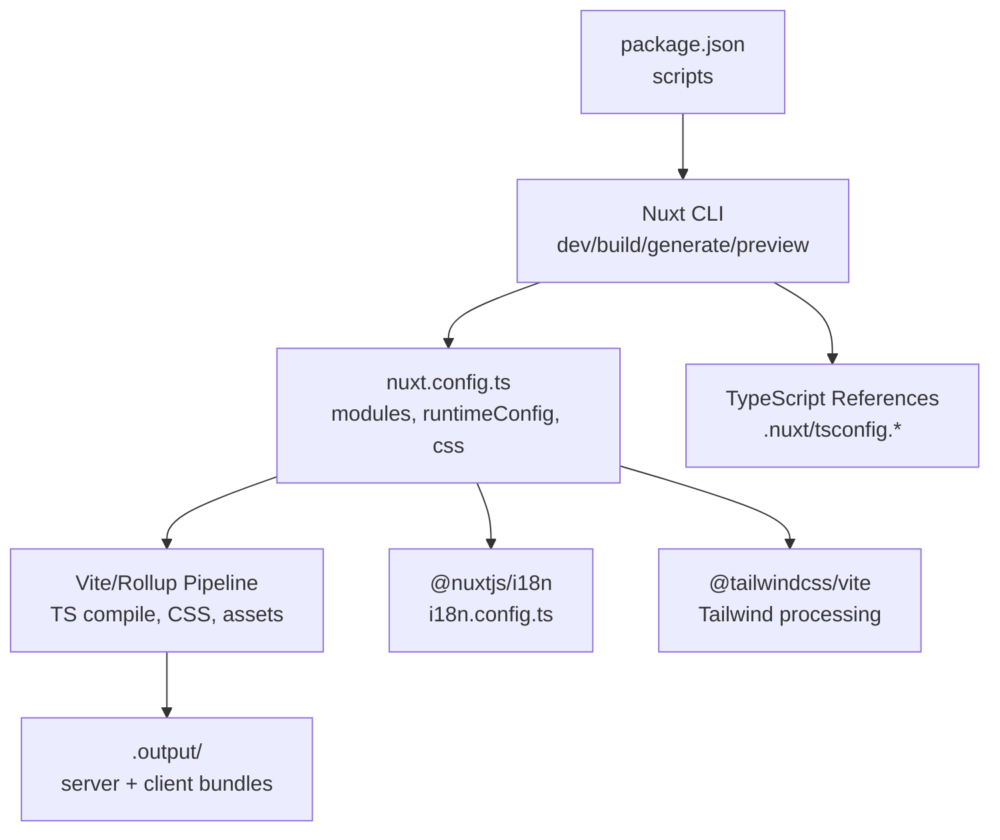
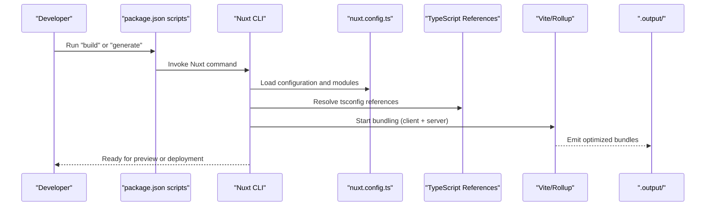
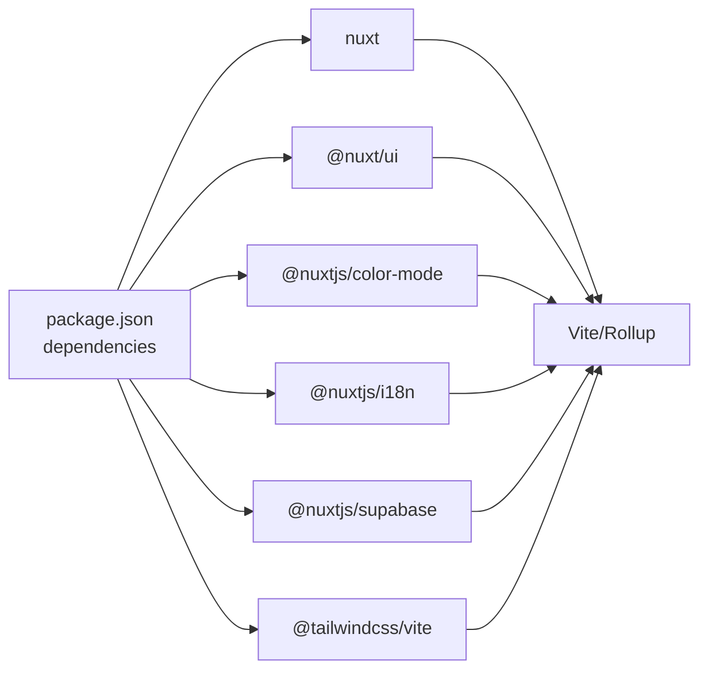

# Build Process

<cite>
**Referenced Files in This Document**
- [package.json](file://package.json)
- [nuxt.config.ts](file://nuxt.config.ts)
- [tsconfig.json](file://tsconfig.json)
- [i18n.config.ts](file://i18n.config.ts)
- [app/app.config.ts](file://app/app.config.ts)
- [.gitignore](file://.gitignore)
- [README.md](file://README.md)
</cite>

## Table of Contents
1. [Introduction](#introduction)
2. [Project Structure](#project-structure)
3. [Core Components](#core-components)
4. [Architecture Overview](#architecture-overview)
5. [Detailed Component Analysis](#detailed-component-analysis)
6. [Dependency Analysis](#dependency-analysis)
7. [Performance Considerations](#performance-considerations)
8. [Troubleshooting Guide](#troubleshooting-guide)
9. [Conclusion](#conclusion)
10. [Appendices](#appendices)

## Introduction
This document explains the build process for this Nuxt.js application with a focus on compilation and optimization. It covers the scripts defined in package.json, how Nuxt configures the build, TypeScript compilation via project references, asset processing through CSS modules, and static generation. It also provides guidance on customizing the build, optimizing bundle size, configuring plugins, handling environment-specific builds, code splitting strategies, and performance optimizations during compilation.

## Project Structure
The project is a standard Nuxt 3 application using modern tooling:
- Scripts are defined in package.json to run development, production builds, static generation, and preview.
- Nuxt configuration lives in nuxt.config.ts and enables modules, runtime configuration, and UI/color mode settings.
- TypeScript uses project references that point to generated configs under .nuxt/.
- Asset pipeline includes global CSS and Tailwind integration via a Vite plugin.
- Static assets reside under public/; generated outputs are ignored by version control.

**Diagram sources**
- [package.json:5-10](file://package.json#L5-L10)
- [nuxt.config.ts:1-51](file://nuxt.config.ts#L1-L51)
- [tsconfig.json:1-18](file://tsconfig.json#L1-L18)
- [.gitignore:1-7](file://.gitignore#L1-L7)

**Section sources**
- [package.json:5-10](file://package.json#L5-L10)
- [nuxt.config.ts:1-51](file://nuxt.config.ts#L1-L51)
- [tsconfig.json:1-18](file://tsconfig.json#L1-L18)
- [.gitignore:1-7](file://.gitignore#L1-L7)

## Core Components
- Build scripts:
  - Development server: runs the Nuxt dev server with hot module replacement.
  - Production build: compiles the app into an optimized server and client bundle.
  - Static generation: prerenders routes to static files (SSG).
  - Preview: serves the production build locally for verification.
- Nuxt configuration:
  - Modules enable UI components, color mode, i18n, and Supabase integration.
  - Runtime configuration exposes environment variables to server and client contexts.
  - Global CSS is registered for consistent styling across pages.
- TypeScript compilation:
  - Uses project references to separate app/server/shared/node types generated by Nuxt.
- Asset processing:
  - Global CSS file included via Nuxt config.
  - Tailwind processed via @tailwindcss/vite plugin integrated with Vite.

**Section sources**
- [package.json:5-10](file://package.json#L5-L10)
- [nuxt.config.ts:1-51](file://nuxt.config.ts#L1-L51)
- [tsconfig.json:1-18](file://tsconfig.json#L1-L18)
- [i18n.config.ts:1-14](file://i18n.config.ts#L1-L14)
- [app/app.config.ts:1-20](file://app/app.config.ts#L1-L20)

## Architecture Overview
The build pipeline integrates Nuxt’s default Vite-based bundling with TypeScript project references and modules. The flow from script execution to final artifacts is as follows:

**Diagram sources**
- [package.json:5-10](file://package.json#L5-L10)
- [nuxt.config.ts:1-51](file://nuxt.config.ts#L1-L51)
- [tsconfig.json:1-18](file://tsconfig.json#L1-L18)

## Detailed Component Analysis

### Build Scripts and Workflows
- Development:
  - Starts the Nuxt dev server with fast refresh and incremental compilation.
- Production build:
  - Compiles TypeScript, processes CSS, optimizes assets, and emits server/client bundles into .output/.
- Static generation:
  - Prerenders routes based on Nuxt routing and generates static assets under .output/.
- Preview:
  - Serves the built output locally to validate production behavior.

Environment-specific builds:
- Use environment variables loaded at build time via runtimeConfig.public for client-side values and runtimeConfig for server-only secrets.
- For different environments (e.g., staging vs production), supply distinct environment variables when invoking the build commands.

**Section sources**
- [package.json:5-10](file://package.json#L5-L10)
- [nuxt.config.ts:9-15](file://nuxt.config.ts#L9-L15)
- [README.md:21-33](file://README.md#L21-L33)

### Nuxt Configuration and Modules
- Modules:
  - UI framework, color mode, internationalization, and Supabase integration are enabled via modules array.
- Runtime configuration:
  - Public keys exposed to the client; service role key kept server-side.
- CSS:
  - Global stylesheet registration ensures consistent base styles.
- App-level configuration:
  - UI theme overrides and design tokens are centralized in app/app.config.ts.

Customizing the build:
- Add or configure modules to extend the build pipeline (e.g., analytics, SEO, or additional CSS preprocessors).
- Adjust runtimeConfig to inject environment-specific values without changing code.

**Section sources**
- [nuxt.config.ts:1-51](file://nuxt.config.ts#L1-L51)
- [app/app.config.ts:1-20](file://app/app.config.ts#L1-L20)

### TypeScript Compilation Settings
- Project references:
  - tsconfig.json delegates to generated configs under .nuxt for app, server, shared, and node targets.
- Benefits:
  - Separates type-checking and compilation contexts for client and server, improving build performance and correctness.
- Customization:
  - Extend or override settings via Nuxt’s typed configuration if needed; keep references intact to preserve generated structure.

**Section sources**
- [tsconfig.json:1-18](file://tsconfig.json#L1-L18)

### Asset Processing Pipeline
- CSS:
  - Global CSS file is included via Nuxt config, enabling consistent theming and base styles.
- Tailwind:
  - Integrated via @tailwindcss/vite plugin, which processes utility classes efficiently during Vite’s build.
- Static assets:
  - Files under public/ are served as-is and can be referenced directly in templates and images.

Optimizations:
- Ensure only necessary CSS utilities are used to minimize Tailwind output.
- Prefer lazy-loading heavy components and images to reduce initial bundle size.

**Section sources**
- [nuxt.config.ts:4-8](file://nuxt.config.ts#L4-L8)
- [package.json:18-21](file://package.json#L18-L21)

### Internationalization Build Integration
- i18n module:
  - Configured with locales, default locale, detection strategy, and external i18n config file.
- Messages:
  - Centralized messages in i18n.config.ts ensure consistent translations across the app.
- Build impact:
  - i18n messages are bundled per locale; consider lazy loading non-default locales to reduce initial payload.

**Section sources**
- [nuxt.config.ts:37-50](file://nuxt.config.ts#L37-L50)
- [i18n.config.ts:1-14](file://i18n.config.ts#L1-L14)

### Environment-Specific Builds
- Client-safe values:
  - Exposed via runtimeConfig.public to avoid leaking secrets into the browser bundle.
- Server-only values:
  - Kept in runtimeConfig for server-side use only.
- Best practices:
  - Provide environment variables at build time for each target environment (development, staging, production).
  - Validate required variables before building to catch misconfiguration early.

**Section sources**
- [nuxt.config.ts:9-15](file://nuxt.config.ts#L9-L15)

### Code Splitting Strategies
- Route-based splitting:
  - Nuxt automatically splits code per route; leverage page boundaries to keep payloads small.
- Component-level splitting:
  - Dynamically import heavy components where appropriate to defer loading until needed.
- Third-party libraries:
  - Avoid importing large libraries eagerly; prefer tree-shaking and dynamic imports.

[No sources needed since this section provides general guidance]

### Performance Optimizations During Compilation
- Enable production optimizations:
  - Use the production build command to benefit from minification, dead code elimination, and asset optimization.
- Reduce CSS footprint:
  - Use Tailwind utilities judiciously and remove unused styles.
- Minimize dependencies:
  - Audit dependencies to remove unused packages and prefer lightweight alternatives.
- Leverage caching:
  - Rely on Nuxt/Vite caching to speed up rebuilds during development.

[No sources needed since this section provides general guidance]

## Dependency Analysis
The build depends on Nuxt and its ecosystem modules, which integrate with Vite for bundling and TypeScript for type safety.

**Diagram sources**
- [package.json:12-23](file://package.json#L12-L23)

**Section sources**
- [package.json:12-23](file://package.json#L12-L23)

## Performance Considerations
- Prefer static generation for content-heavy pages to improve load times and reduce server work.
- Use environment variables to toggle features like debug logging or analytics in production builds.
- Monitor bundle sizes and identify large dependencies for lazy loading or replacement.
- Keep CSS minimal and rely on utility-first approaches to avoid bloated stylesheets.

[No sources needed since this section provides general guidance]

## Troubleshooting Guide
Common issues and resolutions:
- Missing environment variables:
  - Ensure required variables are set before running build or generate commands; runtimeConfig will fail if expected values are absent.
- Build outputs not committed:
  - Generated directories (.nuxt, .output, dist) are ignored by version control; do not commit these artifacts.
- Unexpected runtime behavior:
  - Verify that public keys and URLs match the target environment; adjust runtimeConfig.public accordingly.

**Section sources**
- [nuxt.config.ts:9-15](file://nuxt.config.ts#L9-L15)
- [.gitignore:1-7](file://.gitignore#L1-L7)

## Conclusion
This Nuxt.js application leverages a streamlined build process driven by package.json scripts and a focused nuxt.config.ts configuration. TypeScript compilation is managed via project references, while assets are processed through global CSS and Tailwind integration. By understanding the build scripts, environment configuration, and module integrations, you can customize the build, optimize bundle size, and implement robust performance strategies tailored to your deployment targets.

## Appendices

### Quick Reference: Build Commands
- Development: start the dev server with hot reload.
- Production: build optimized server and client bundles.
- Static generation: prerender routes to static files.
- Preview: serve the production build locally.

**Section sources**
- [package.json:5-10](file://package.json#L5-L10)
- [README.md:21-33](file://README.md#L21-L33)