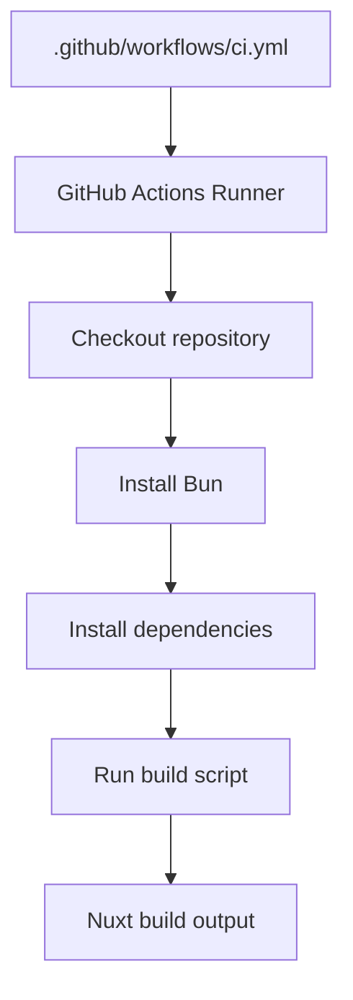
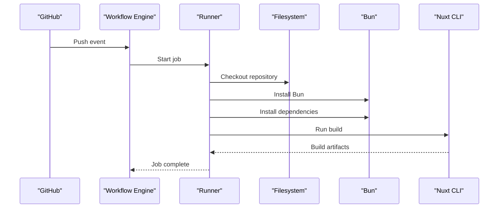
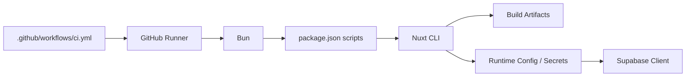

# CI/CD Pipeline

<cite>
**Referenced Files in This Document**
- [ci.yml](file://.github/workflows/ci.yml)
- [package.json](file://package.json)
- [README.md](file://README.md)
- [supabase.ts](file://server/utils/supabase.ts)
</cite>

## Table of Contents
1. [Introduction](#introduction)
2. [Project Structure](#project-structure)
3. [Core Components](#core-components)
4. [Architecture Overview](#architecture-overview)
5. [Detailed Component Analysis](#detailed-component-analysis)
6. [Dependency Analysis](#dependency-analysis)
7. [Performance Considerations](#performance-considerations)
8. [Troubleshooting Guide](#troubleshooting-guide)
9. [Conclusion](#conclusion)
10. [Appendices](#appendices)

## Introduction
This document explains the CI/CD pipeline for this Nuxt application using GitHub Actions. It covers how continuous integration is configured, what steps run on each push, and how to extend the workflow with testing, code quality checks, environment-specific deployments, and rollback procedures. It also includes guidance on optimizing build performance through caching and monitoring.

## Project Structure
The repository uses a standard Nuxt project layout with:
- A GitHub Actions workflow under .github/workflows that defines the CI job.
- A package manifest defining scripts used by the CI (build, dev, preview).
- Server utilities that consume runtime configuration for Supabase.

**Diagram sources**
- [ci.yml:1-26](file://.github/workflows/ci.yml#L1-L26)
- [package.json:5-11](file://package.json#L5-L11)

**Section sources**
- [ci.yml:1-26](file://.github/workflows/ci.yml#L1-L26)
- [package.json:1-26](file://package.json#L1-L26)
- [README.md:5-35](file://README.md#L5-L35)

## Core Components
- CI Workflow: Defines a single job that runs on every push, installs dependencies with Bun, and executes the production build.
- Build Script: The build step invokes the Nuxt build via the script defined in the package manifest.
- Runtime Configuration: Server utilities rely on runtime config values for Supabase, which must be provided at runtime or build time depending on deployment target.

Key responsibilities:
- ci.yml: Orchestrates checkout, toolchain setup, dependency installation, and build execution.
- package.json: Declares scripts that CI consumes (build, dev, preview).
- server/utils/supabase.ts: Demonstrates runtime configuration usage for external services.

**Section sources**
- [ci.yml:1-26](file://.github/workflows/ci.yml#L1-L26)
- [package.json:5-11](file://package.json#L5-L11)
- [supabase.ts:1-19](file://server/utils/supabase.ts#L1-L19)

## Architecture Overview
The CI pipeline is a linear sequence executed on GitHub-hosted runners. On each push, it checks out the code, sets up Bun, installs dependencies, and builds the application.

**Diagram sources**
- [ci.yml:1-26](file://.github/workflows/ci.yml#L1-L26)
- [package.json:5-11](file://package.json#L5-L11)

## Detailed Component Analysis

### CI Workflow (.github/workflows/ci.yml)
- Trigger: Runs on every push to any branch.
- Environment: Uses ubuntu-latest runner via matrix strategy.
- Steps:
  - Checkout source code.
  - Set up Bun runtime.
  - Install dependencies with frozen lockfile for reproducibility.
  - Execute the build script.

Recommendations to enhance:
- Add caching for node_modules and Nuxt build cache directories to speed up subsequent runs.
- Introduce separate jobs for linting, unit tests, and integration tests.
- Add artifact upload for build outputs if needed by downstream jobs.
- Restrict triggers (e.g., only main branch or tags) for production-oriented workflows.

**Section sources**
- [ci.yml:1-26](file://.github/workflows/ci.yml#L1-L26)

### Build Scripts (package.json)
- build: Executes Nuxt’s production build.
- dev: Starts development server.
- generate: Static site generation mode (if applicable).
- preview: Serves the built output locally for verification.

These scripts are the bridge between CI and the Nuxt toolchain. Ensure environment variables required by the app are set before running build if they are baked into the build.

**Section sources**
- [package.json:5-11](file://package.json#L5-L11)

### Runtime Configuration and Secrets (server/utils/supabase.ts)
- The server utility reads runtime configuration for Supabase URL and service role key.
- Missing configuration throws an error at runtime, indicating that these values must be provided in the deployment environment.
- For CI, ensure secrets are injected via GitHub Environments or workflow-level secrets when building or deploying.

Best practices:
- Use GitHub Environments per target (staging, production) to scope secrets.
- Avoid baking secrets into images; prefer runtime injection.
- Validate required configuration early in startup to fail fast.

**Section sources**
- [supabase.ts:1-19](file://server/utils/supabase.ts#L1-L19)

### Testing Strategy
Current state:
- No test scripts or test framework files are present in the repository.
- CI currently only performs a build.

Suggested additions:
- Add a test script in package.json (for example, using a framework like Vitest or Jest).
- Create unit tests for composables, components, and server utilities.
- Add integration tests that validate API endpoints or database interactions against a test database.
- Extend CI to run tests after dependency installation and before build.

Example flow to add tests:
- Install dependencies.
- Run linting (optional).
- Run unit tests.
- Run integration tests (with test DB).
- Proceed to build.

[No sources needed since this section proposes enhancements not yet implemented]

### Code Quality Checks
Current state:
- No linter configuration is invoked in CI.
- An ESLint configuration file exists but is not part of the workflow.

Recommended steps:
- Add a lint step to CI to enforce coding standards.
- Fail the pipeline on lint errors to maintain code quality.
- Optionally integrate formatting checks (for example, Prettier) and fix-on-commit hooks.

[No sources needed since this section provides general guidance]

### Deployment Triggers and Environments
Current state:
- The workflow runs on all pushes.
- There is no deployment step in the current workflow.

Recommended approach:
- Split workflows: one for CI (lint/test/build), another for CD (deploy).
- Use GitHub Environments to gate deployments to staging and production.
- Configure environment-specific secrets and variables.
- Use branch protection rules and required reviews for production deployments.

Deployment trigger examples:
- Deploy to staging on pushes to develop.
- Deploy to production on tags or merges to main.

Rollback procedures:
- Maintain versioned artifacts (for example, build outputs or container images).
- Use immutable releases and promote artifacts across environments.
- Implement a rollback job that redeploys the previous known-good artifact.

[No sources needed since this section provides general guidance]

### Optimization and Caching
Current state:
- Dependencies are installed from a frozen lockfile, ensuring deterministic installs.
- No explicit caching is configured.

Optimization recommendations:
- Cache Bun’s global cache and node_modules to reduce install times.
- Cache Nuxt build artifacts (for example, .nuxt directory) to speed up rebuilds.
- Use matrix strategies for parallel jobs (for example, lint vs test vs build).
- Pin runner versions and tool versions for consistency.

[No sources needed since this section provides general guidance]

## Dependency Analysis
The CI workflow depends on:
- GitHub Actions runner environment (ubuntu-latest).
- Bun runtime for dependency management and execution.
- Nuxt CLI invoked via the build script.

Runtime dependencies:
- Supabase client library requires runtime configuration (URL and service role key).

**Diagram sources**
- [ci.yml:1-26](file://.github/workflows/ci.yml#L1-L26)
- [package.json:5-11](file://package.json#L5-L11)
- [supabase.ts:1-19](file://server/utils/supabase.ts#L1-L19)

**Section sources**
- [ci.yml:1-26](file://.github/workflows/ci.yml#L1-L26)
- [package.json:5-11](file://package.json#L5-L11)
- [supabase.ts:1-19](file://server/utils/supabase.ts#L1-L19)

## Performance Considerations
- Use dependency caching to avoid repeated installs.
- Parallelize independent jobs (lint, test, build).
- Leverage incremental builds where supported by the framework.
- Monitor job durations and optimize slow steps first.
- Keep runner images minimal and pinned to specific versions.

[No sources needed since this section provides general guidance]

## Troubleshooting Guide
Common issues and resolutions:
- Missing runtime configuration: If Supabase URL or service role key is not provided, the server will throw an error at runtime. Ensure secrets are configured in the deployment environment and exposed to the build/runtime context as required.
- Build failures: Verify that the build script runs successfully locally and that all required environment variables are set in CI.
- Slow installs: Enable dependency caching for Bun and Nuxt build caches.
- Lint/test failures: Add dedicated steps to fail fast on issues and provide actionable logs.

Operational tips:
- Use GitHub Actions logs to pinpoint failing steps.
- Add descriptive step names and intermediate outputs for easier debugging.
- Consider adding retry logic for flaky network operations.

**Section sources**
- [supabase.ts:1-19](file://server/utils/supabase.ts#L1-L19)

## Conclusion
The current CI workflow performs a basic build on every push using Bun and Nuxt. To mature the pipeline, add linting, unit and integration tests, caching, and environment-scoped deployments with rollback capabilities. Ensure runtime configuration and secrets are managed securely and consistently across environments. These enhancements will improve reliability, speed, and safety of your delivery process.

[No sources needed since this section summarizes without analyzing specific files]

## Appendices

### Example Enhancements Checklist
- Add caching for dependencies and build artifacts.
- Introduce lint and test jobs.
- Separate CI and CD workflows.
- Define GitHub Environments for staging and production.
- Configure secrets per environment.
- Add artifact uploads and promotion.
- Implement rollback procedures using versioned artifacts.

[No sources needed since this section provides general guidance]