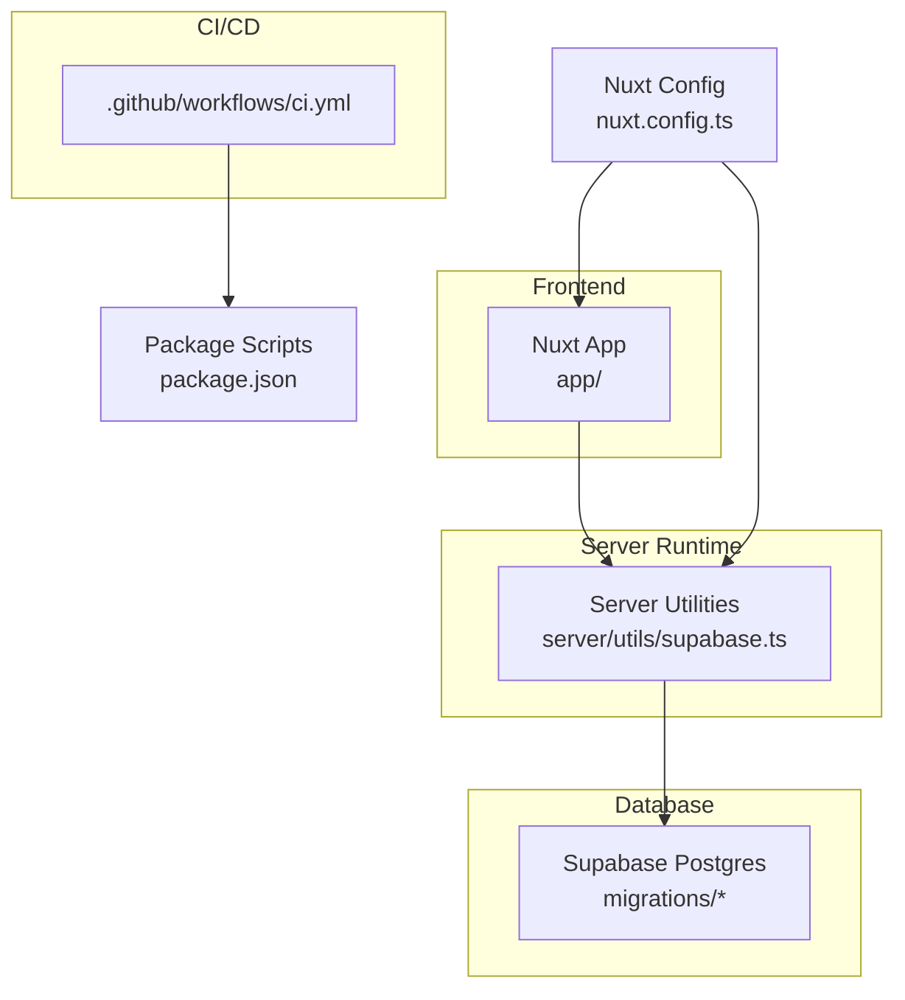
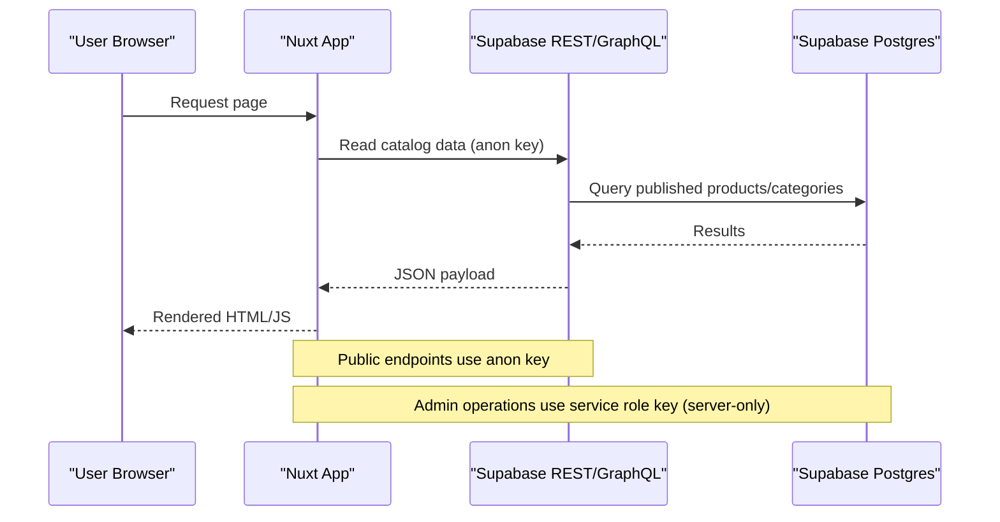
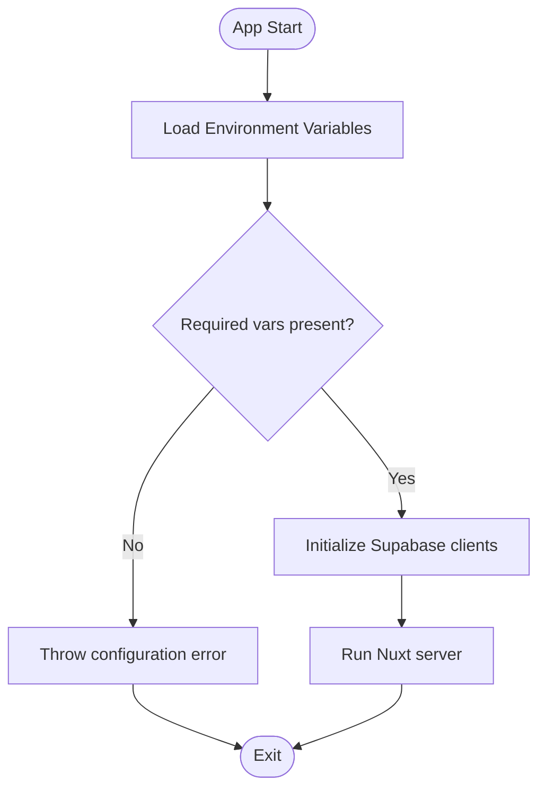
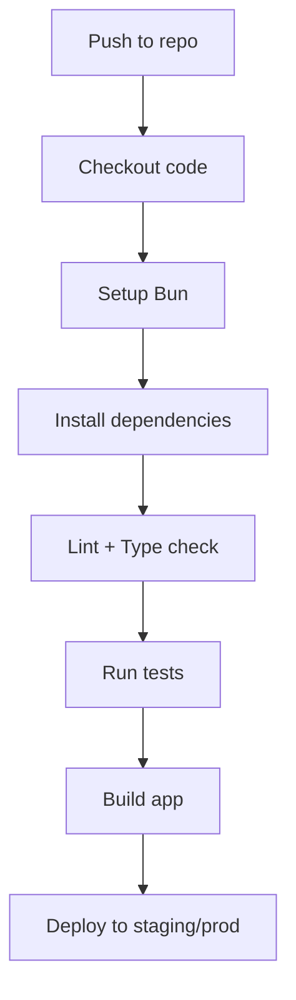
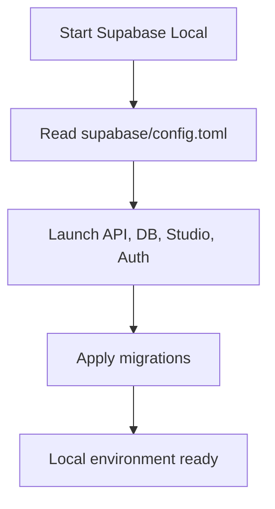
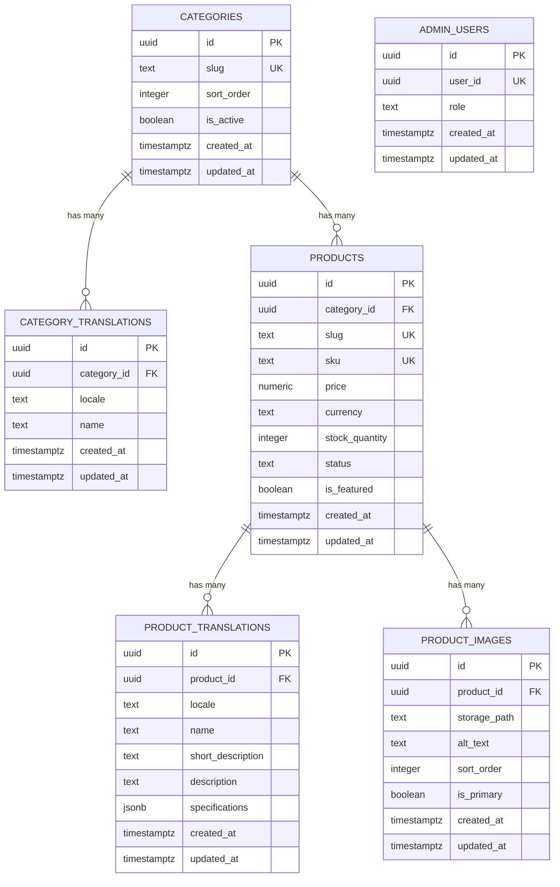
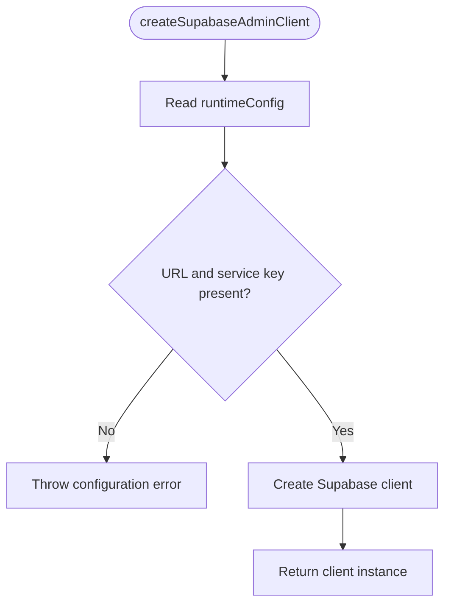
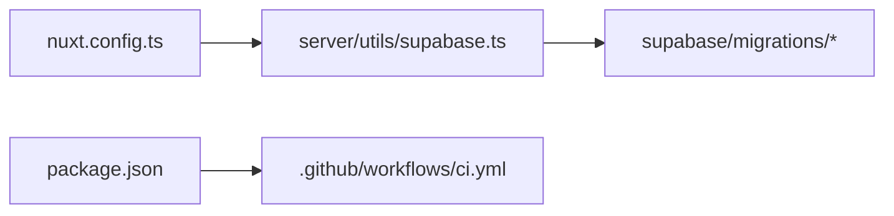

# Deployment & DevOps

<cite>
**Referenced Files in This Document**
- [README.md](file://README.md)
- [package.json](file://package.json)
- [nuxt.config.ts](file://nuxt.config.ts)
- [.github/workflows/ci.yml](file://.github/workflows/ci.yml)
- [supabase/config.toml](file://supabase/config.toml)
- [server/utils/supabase.ts](file://server/utils/supabase.ts)
- [supabase/migrations/20260922_000001_create_catalog_schema.sql](file://supabase/migrations/20260922_000001_create_catalog_schema.sql)
- [supabase/migrations/20260922000002_storage_and_rls.sql](file://supabase/migrations/20260922000002_storage_and_rls.sql)
- [supabase/migrations/20260922073136_remove_recursive_admin_users_policy.sql](file://supabase/migrations/20260922073136_remove_recursive_admin_users_policy.sql)
- [.gitignore](file://.gitignore)
</cite>

## Table of Contents
1. [Introduction](#introduction)
2. [Project Structure](#project-structure)
3. [Core Components](#core-components)
4. [Architecture Overview](#architecture-overview)
5. [Detailed Component Analysis](#detailed-component-analysis)
6. [Dependency Analysis](#dependency-analysis)
7. [Performance Considerations](#performance-considerations)
8. [Troubleshooting Guide](#troubleshooting-guide)
9. [Conclusion](#conclusion)
10. [Appendices](#appendices)

## Introduction
This document provides production-ready deployment and DevOps guidance for a Nuxt.js application integrated with Supabase. It covers the build process, environment configuration, CI/CD setup, hosting options, database migrations, secret management, monitoring, error tracking, performance tuning, scaling, load balancing, and operational maintenance procedures. The goal is to help teams ship safely, operate reliably, and scale confidently.

## Project Structure
The repository follows a standard Nuxt 3 project layout with server utilities, Supabase migrations, and GitHub Actions for continuous integration:
- Application code under app/
- Server-side utilities under server/utils/
- Supabase configuration and migrations under supabase/
- CI workflow under .github/workflows/
- Build scripts and dependencies under package.json
- Nuxt runtime configuration under nuxt.config.ts

**Diagram sources**
- [nuxt.config.ts:1-52](file://nuxt.config.ts#L1-L52)
- [server/utils/supabase.ts:1-20](file://server/utils/supabase.ts#L1-L20)
- [.github/workflows/ci.yml:1-26](file://.github/workflows/ci.yml#L1-L26)
- [package.json:1-26](file://package.json#L1-L26)

**Section sources**
- [README.md:1-36](file://README.md#L1-L36)
- [package.json:1-26](file://package.json#L1-L26)
- [nuxt.config.ts:1-52](file://nuxt.config.ts#L1-L52)
- [.github/workflows/ci.yml:1-26](file://.github/workflows/ci.yml#L1-L26)

## Core Components
- Build and preview commands are defined in package.json and documented in README.md.
- Nuxt runtime configuration defines modules, i18n, color mode, UI theme, and Supabase client settings.
- Server utility creates a Supabase admin client using runtime config values.
- CI pipeline installs dependencies and builds the app on push.

Key responsibilities:
- package.json: build, dev, generate, preview, postinstall hooks
- nuxt.config.ts: runtimeConfig (public and service role key), Supabase module configuration
- server/utils/supabase.ts: secure server-side Supabase client creation
- .github/workflows/ci.yml: checkout, Bun setup, dependency install, build

**Section sources**
- [README.md:21-33](file://README.md#L21-L33)
- [package.json:5-11](file://package.json#L5-L11)
- [nuxt.config.ts:9-26](file://nuxt.config.ts#L9-L26)
- [server/utils/supabase.ts:3-19](file://server/utils/supabase.ts#L3-L19)
- [.github/workflows/ci.yml:12-25](file://.github/workflows/ci.yml#L12-L25)

## Architecture Overview
The production architecture consists of:
- Nuxt application serving SSR/SSG content
- Supabase as backend (PostgreSQL, Auth, Storage)
- CI/CD pipeline building and validating the app
- Environment variables controlling public and private Supabase endpoints and keys

**Diagram sources**
- [nuxt.config.ts:9-26](file://nuxt.config.ts#L9-L26)
- [server/utils/supabase.ts:3-19](file://server/utils/supabase.ts#L3-L19)

## Detailed Component Analysis

### Build Process and Production Preview
- Development: run dev server locally.
- Production build: compile assets and server bundle.
- Local preview: serve the production build locally to validate before deployment.

Operational notes:
- Use frozen lockfiles in CI to ensure reproducible builds.
- Ensure environment variables are set during build and runtime.

**Section sources**
- [README.md:21-33](file://README.md#L21-L33)
- [package.json:5-11](file://package.json#L5-L11)
- [.github/workflows/ci.yml:21-25](file://.github/workflows/ci.yml#L21-L25)

### Environment Configuration and Secrets Management
Runtime configuration:
- Public Supabase URL and anon key are exposed to the client via runtimeConfig.public.
- Service role key is server-only and must never be exposed to the browser.

Environment variables:
- NUXT_PUBLIC_SUPABASE_URL
- NUXT_PUBLIC_SUPABASE_ANON_KEY
- SUPABASE_SERVICE_ROLE_KEY

Security guidelines:
- Store secrets in your hosting provider’s secret manager or CI/CD vaults.
- Never commit .env files; they are ignored by default.
- Validate presence of required variables at runtime and fail fast if missing.

**Diagram sources**
- [nuxt.config.ts:9-26](file://nuxt.config.ts#L9-L26)
- [server/utils/supabase.ts:3-19](file://server/utils/supabase.ts#L3-L19)

**Section sources**
- [nuxt.config.ts:9-26](file://nuxt.config.ts#L9-L26)
- [server/utils/supabase.ts:3-19](file://server/utils/supabase.ts#L3-L19)
- [.gitignore:21-24](file://.gitignore#L21-L24)

### CI/CD Pipeline Setup
Current CI job:
- Checks out code
- Installs Bun
- Installs dependencies with frozen lockfile
- Runs the build step

Recommended enhancements:
- Add linting and type checking steps
- Add unit/integration tests
- Add Supabase migration validation or dry-run
- Publish artifacts or deploy to target environments
- Gate deployments by branch rules and approvals

**Diagram sources**
- [.github/workflows/ci.yml:12-25](file://.github/workflows/ci.yml#L12-L25)

**Section sources**
- [.github/workflows/ci.yml:1-26](file://.github/workflows/ci.yml#L1-26)

### Hosting Options for Nuxt.js Applications
Common production targets:
- Vercel: optimized for Nuxt, automatic builds, edge caching, environment variables
- Netlify: static hosting with serverless functions, environment variables
- Cloudflare Pages: global CDN, edge runtime, environment variables
- AWS: ECS/Fargate, Lambda@Edge, S3+CloudFront for static assets
- Docker-based platforms: Fly.io, Railway, Render, DigitalOcean App Platform

Selection criteria:
- SSR vs SSG needs
- Edge runtime requirements
- Integration with Supabase
- Cost and scaling expectations

[No sources needed since this section provides general guidance]

### Supabase Deployment Configuration
Local development:
- supabase/config.toml configures local ports, schemas, storage limits, auth redirect URLs, and email provider.

Production considerations:
- Configure Supabase project settings for production domains and CORS
- Set up environment variables in Supabase dashboard (URL and anon key)
- Manage service role key securely in your server/runtime environment
- Apply migrations via CI/CD or Supabase CLI

**Diagram sources**
- [supabase/config.toml:1-32](file://supabase/config.toml#L1-L32)

**Section sources**
- [supabase/config.toml:1-32](file://supabase/config.toml#L1-L32)

### Database Schema and Migrations
Schema highlights:
- Categories, product translations, products, product images, admin users
- Indexes for performance-critical queries
- Triggers to maintain updated_at timestamps
- Row-level security policies for public read access and admin write access
- Storage policies for product images bucket

Migration strategy:
- Versioned SQL migrations under supabase/migrations
- Apply migrations in CI/CD or via Supabase CLI before deployment
- Validate schema changes in staging before production rollout

**Diagram sources**
- [supabase/migrations/20260922_000001_create_catalog_schema.sql:3-67](file://supabase/migrations/20260922_000001_create_catalog_schema.sql#L3-L67)
- [supabase/migrations/20260922_000001_create_catalog_schema.sql:69-75](file://supabase/migrations/20260922_000001_create_catalog_schema.sql#L69-L75)
- [supabase/migrations/20260922_000001_create_catalog_schema.sql:76-113](file://supabase/migrations/20260922_000001_create_catalog_schema.sql#L76-L113)

**Section sources**
- [supabase/migrations/20260922_000001_create_catalog_schema.sql:1-113](file://supabase/migrations/20260922_000001_create_catalog_schema.sql#L1-L113)
- [supabase/migrations/20260922000002_storage_and_rls.sql:1-205](file://supabase/migrations/20260922000002_storage_and_rls.sql#L1-L205)
- [supabase/migrations/20260922073136_remove_recursive_admin_users_policy.sql:1-2](file://supabase/migrations/20260922073136_remove_recursive_admin_users_policy.sql#L1-L2)

### Server-Side Supabase Client Initialization
The server utility creates a Supabase client configured with:
- URL from runtimeConfig.public.supabaseUrl
- Service role key from runtimeConfig.supabaseServiceRoleKey
- Session persistence disabled for server-side requests

Validation:
- Throws an error if required configuration is missing, ensuring early failure in misconfigured environments.

**Diagram sources**
- [server/utils/supabase.ts:3-19](file://server/utils/supabase.ts#L3-L19)

**Section sources**
- [server/utils/supabase.ts:1-20](file://server/utils/supabase.ts#L1-L20)

### Monitoring, Logging, Error Tracking, and Performance
Recommendations:
- Application logs: centralize server logs and request traces
- Error tracking: integrate an error reporting tool (e.g., Sentry) for unhandled exceptions and frontend errors
- Performance monitoring: track TTFB, Time to Interactive, and API latency
- Database monitoring: query performance, connection usage, slow queries
- Uptime and synthetic checks: monitor availability and critical flows

Implementation ideas:
- Wrap server routes with logging middleware
- Emit structured logs with correlation IDs
- Report errors to external services with context
- Instrument Supabase calls with timing metrics

[No sources needed since this section provides general guidance]

### Scaling, Load Balancing, and Database Optimization
Scaling strategies:
- Horizontal scaling of Nuxt instances behind a load balancer
- CDN for static assets and cached pages
- Auto-scaling groups based on CPU/memory or request metrics

Load balancing:
- Use platform-native load balancers (Vercel, Cloudflare, AWS ALB/NLB)
- Sticky sessions only if necessary; prefer stateless design

Database optimization:
- Connection pooling (e.g., PgBouncer) to reduce per-request overhead
- Proper indexing for frequent queries
- Partitioning large tables when appropriate
- Tune vacuum and analyze schedules
- Monitor pg_stat_statements for slow queries

**Section sources**
- [supabase/migrations/20260922_000001_create_catalog_schema.sql:69-75](file://supabase/migrations/20260922_000001_create_catalog_schema.sql#L69-L75)

### Managing Environments and Security Hardening
Environments:
- Development: local Supabase stack, minimal restrictions
- Staging: mirrors production with test data
- Production: hardened configuration, strict RLS policies, least privilege

Secret management:
- Use hosting provider secret managers or CI/CD vaults
- Rotate keys regularly and audit access

Security hardening:
- Restrict CORS origins
- Enforce HTTPS everywhere
- Validate and sanitize inputs
- Limit file upload sizes and types
- Review RLS policies and storage policies regularly

**Section sources**
- [supabase/migrations/20260922000002_storage_and_rls.sql:1-205](file://supabase/migrations/20260922000002_storage_and_rls.sql#L1-L205)

## Dependency Analysis
High-level relationships:
- Nuxt config wires modules and runtime configuration
- Server utilities depend on runtime configuration to initialize Supabase clients
- CI depends on package scripts to build the app
- Migrations define the database schema and security policies

**Diagram sources**
- [nuxt.config.ts:1-52](file://nuxt.config.ts#L1-L52)
- [server/utils/supabase.ts:1-20](file://server/utils/supabase.ts#L1-L20)
- [package.json:1-26](file://package.json#L1-L26)
- [.github/workflows/ci.yml:1-26](file://.github/workflows/ci.yml#L1-L26)

**Section sources**
- [nuxt.config.ts:1-52](file://nuxt.config.ts#L1-L52)
- [server/utils/supabase.ts:1-20](file://server/utils/supabase.ts#L1-L20)
- [package.json:1-26](file://package.json#L1-L26)
- [.github/workflows/ci.yml:1-26](file://.github/workflows/ci.yml#L1-L26)

## Performance Considerations
- Prefer SSG where possible for static pages to reduce server load
- Cache API responses at the edge or CDN
- Minimize server-side rendering for heavy pages
- Optimize images and assets
- Monitor and tune database queries and indexes
- Use connection pooling to handle high concurrency efficiently

[No sources needed since this section provides general guidance]

## Troubleshooting Guide
Common issues and resolutions:
- Missing environment variables:
  - Symptom: runtime throws configuration errors
  - Resolution: ensure NUXT_PUBLIC_SUPABASE_URL, NUXT_PUBLIC_SUPABASE_ANON_KEY, and SUPABASE_SERVICE_ROLE_KEY are set in the runtime environment
- Build failures in CI:
  - Symptom: npm/bun install or build fails
  - Resolution: verify Node/Bun version, frozen lockfile, and correct working directory
- Supabase connectivity errors:
  - Symptom: network or authentication errors
  - Resolution: verify URLs and keys, check CORS and redirect URLs in Supabase settings
- Migration conflicts:
  - Symptom: schema mismatch between environments
  - Resolution: apply migrations consistently across environments and validate in staging first

Operational maintenance:
- Regularly rotate secrets and review access permissions
- Monitor database health and query performance
- Keep dependencies updated via automated tools (e.g., Renovate)

**Section sources**
- [server/utils/supabase.ts:9-11](file://server/utils/supabase.ts#L9-L11)
- [.github/workflows/ci.yml:21-25](file://.github/workflows/ci.yml#L21-L25)

## Conclusion
By following the outlined build, configuration, CI/CD, and operational practices, teams can deploy Nuxt applications with Supabase securely and reliably. Emphasizing environment separation, secret management, robust testing, and observability ensures production readiness and long-term operational excellence.

## Appendices

### Quick Reference: Environment Variables
- NUXT_PUBLIC_SUPABASE_URL: Supabase project URL
- NUXT_PUBLIC_SUPABASE_ANON_KEY: Public anon key for client access
- SUPABASE_SERVICE_ROLE_KEY: Server-only key for privileged operations

**Section sources**
- [nuxt.config.ts:9-26](file://nuxt.config.ts#L9-L26)

### Quick Reference: Package Scripts
- dev: start development server
- build: create production build
- generate: generate static site
- preview: preview production build locally
- postinstall: prepare Nuxt after install

**Section sources**
- [package.json:5-11](file://package.json#L5-L11)