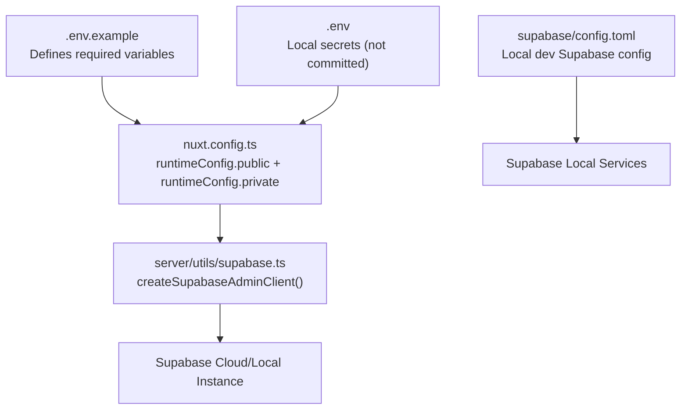
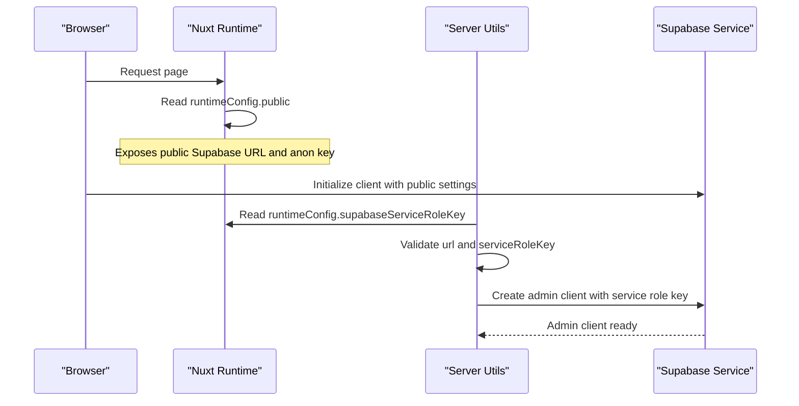
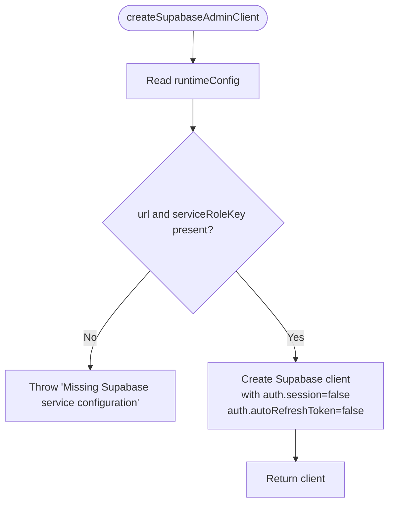
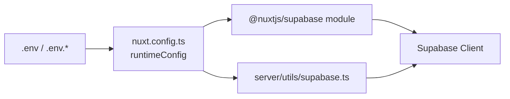

# Environment Configuration

<cite>
**Referenced Files in This Document**   
- [README.md](file://README.md)
- [nuxt.config.ts](file://nuxt.config.ts)
- [server/utils/supabase.ts](file://server/utils/supabase.ts)
- [supabase/config.toml](file://supabase/config.toml)
- [.env.example](file://.env.example)
- [.env](file://.env)
- [.gitignore](file://.gitignore)
</cite>

## Table of Contents
1. [Introduction](#introduction)
2. [Project Structure](#project-structure)
3. [Core Components](#core-components)
4. [Architecture Overview](#architecture-overview)
5. [Detailed Component Analysis](#detailed-component-analysis)
6. [Dependency Analysis](#dependency-analysis)
7. [Performance Considerations](#performance-considerations)
8. [Troubleshooting Guide](#troubleshooting-guide)
9. [Conclusion](#conclusion)

## Introduction
This document explains how environment configuration and secret management are implemented in the project, with a focus on multi-environment setup (development, staging, production), Supabase client configuration, API key handling, and secure secret practices. It also provides guidance for configuring environment-specific database connections, storage buckets, and authentication providers.

The application uses Nuxt runtime configuration to expose public settings to the client and server, while sensitive keys are kept out of the client bundle. The Supabase local development configuration is defined in a TOML file, and environment variables are managed via .env files that are excluded from version control.

## Project Structure
Environment-related configuration spans several areas:
- Nuxt runtime configuration defines both public and private runtime values.
- Server-side utilities create a privileged Supabase client using service role credentials.
- Supabase CLI configuration defines local development behavior for API, database, Studio, storage, and auth.
- Environment variable templates and examples define required secrets.
- Git ignore rules ensure secrets are not committed.

**Diagram sources**
- [.env.example:1-4](file://.env.example#L1-L4)
- [nuxt.config.ts:9-20](file://nuxt.config.ts#L9-L20)
- [server/utils/supabase.ts:3-19](file://server/utils/supabase.ts#L3-L19)
- [supabase/config.toml:1-32](file://supabase/config.toml#L1-L32)

**Section sources**
- [README.md:5-35](file://README.md#L5-L35)
- [nuxt.config.ts:9-20](file://nuxt.config.ts#L9-L20)
- [server/utils/supabase.ts:3-19](file://server/utils/supabase.ts#L3-L19)
- [supabase/config.toml:1-32](file://supabase/config.toml#L1-L32)
- [.env.example:1-4](file://.env.example#L1-L4)
- [.env:1-3](file://.env#L1-L3)
- [.gitignore:21-24](file://.gitignore#L21-L24)

## Core Components
- Runtime configuration in Nuxt exposes:
  - Public settings for the client (e.g., Supabase URL and anon key).
  - Private settings for the server (e.g., service role key).
- Server-side Supabase admin client creation validates required configuration and returns a configured client without session persistence or token refresh.
- Supabase local development configuration controls ports, schemas, storage limits, and auth redirect URLs.
- Environment variables template documents required keys; local secrets are stored in .env and ignored by git.

Key responsibilities:
- nuxt.config.ts: Defines runtimeConfig and Supabase module options.
- server/utils/supabase.ts: Creates a server-only Supabase client with strict validation.
- supabase/config.toml: Configures local Supabase services.
- .env.example: Documents required environment variables.
- .env: Holds actual secrets for local development.
- .gitignore: Prevents committing secrets.

**Section sources**
- [nuxt.config.ts:9-20](file://nuxt.config.ts#L9-L20)
- [server/utils/supabase.ts:3-19](file://server/utils/supabase.ts#L3-L19)
- [supabase/config.toml:1-32](file://supabase/config.toml#L1-L32)
- [.env.example:1-4](file://.env.example#L1-L4)
- [.env:1-3](file://.env#L1-L3)
- [.gitignore:21-24](file://.gitignore#L21-L24)

## Architecture Overview
The environment configuration architecture separates public and private configuration:
- Public configuration is safe for the browser and includes the Supabase URL and anon key.
- Private configuration is only available on the server and includes the service role key.
- The server creates a privileged Supabase client using the service role key and validates that all required values are present at runtime.

**Diagram sources**
- [nuxt.config.ts:9-20](file://nuxt.config.ts#L9-L20)
- [server/utils/supabase.ts:3-19](file://server/utils/supabase.ts#L3-L19)

## Detailed Component Analysis

### Nuxt Runtime Configuration
- Public settings:
  - supabaseUrl: Loaded from NUXT_PUBLIC_SUPABASE_URL with a fallback value.
  - supabaseKey: Loaded from NUXT_PUBLIC_SUPABASE_ANON_KEY with a fallback value.
- Private settings:
  - supabaseServiceRoleKey: Loaded from SUPABASE_SERVICE_ROLE_KEY.
- Supabase module options:
  - url and key mirror public settings for the Supabase plugin.
  - serviceKey mirrors the private service role key.
  - Cookie options configure admin auth cookie name, lifetime, and SameSite policy.

Best practices reflected:
- Sensitive keys are not exposed to the client.
- Public keys have safe defaults for demo purposes but should be overridden in real environments.

**Section sources**
- [nuxt.config.ts:9-20](file://nuxt.config.ts#L9-L20)

### Server-Side Supabase Admin Client
- Reads runtime configuration values for URL and service role key.
- Validates presence of both values and throws an error if missing.
- Creates a Supabase client with session persistence disabled and token refresh disabled, suitable for server-side operations.

Operational implications:
- Missing environment variables will cause startup/runtime errors, making misconfiguration immediately visible.
- Disabling session features reduces overhead and avoids unnecessary state on the server.

**Diagram sources**
- [server/utils/supabase.ts:3-19](file://server/utils/supabase.ts#L3-L19)

**Section sources**
- [server/utils/supabase.ts:3-19](file://server/utils/supabase.ts#L3-L19)

### Supabase Local Development Configuration
- API, database, and Studio ports are explicitly set for local development.
- Storage size limit is configured.
- Auth site URL and additional redirect URLs are set for local development.
- Email provider is enabled.

Usage notes:
- These settings apply when running Supabase locally via the CLI.
- For cloud deployments, these values are managed through the Supabase dashboard rather than this file.

**Section sources**
- [supabase/config.toml:1-32](file://supabase/config.toml#L1-L32)

### Environment Variables and Secrets Management
- Required variables:
  - NUXT_PUBLIC_SUPABASE_URL
  - NUXT_PUBLIC_SUPABASE_ANON_KEY
  - SUPABASE_SERVICE_ROLE_KEY
- Template file (.env.example) documents required variables.
- Local secrets are stored in .env and excluded from version control via .gitignore.

Security recommendations:
- Never commit .env files containing secrets.
- Use per-environment files (e.g., .env.development, .env.staging, .env.production) where supported by your deployment platform.
- Rotate keys regularly and restrict access to service role keys.

**Section sources**
- [.env.example:1-4](file://.env.example#L1-L4)
- [.env:1-3](file://.env#L1-L3)
- [.gitignore:21-24](file://.gitignore#L21-L24)

## Dependency Analysis
Runtime configuration flows from environment variables into Nuxt runtimeConfig, which is consumed by both the Supabase module and server utilities.

**Diagram sources**
- [nuxt.config.ts:9-20](file://nuxt.config.ts#L9-L20)
- [server/utils/supabase.ts:3-19](file://server/utils/supabase.ts#L3-L19)

**Section sources**
- [nuxt.config.ts:9-20](file://nuxt.config.ts#L9-L20)
- [server/utils/supabase.ts:3-19](file://server/utils/supabase.ts#L3-L19)

## Performance Considerations
- Avoid exposing service role keys to the client to prevent accidental leakage and reduce attack surface.
- Disable session persistence and token refresh on server-side clients to minimize memory usage and network overhead.
- Keep public configuration minimal and avoid embedding large or unnecessary values in runtimeConfig.

[No sources needed since this section provides general guidance]

## Troubleshooting Guide
Common issues and resolutions:
- Missing Supabase configuration:
  - Symptom: Error indicating missing Supabase service configuration.
  - Cause: Environment variables for URL or service role key are not set.
  - Resolution: Ensure NUXT_PUBLIC_SUPABASE_URL and SUPABASE_SERVICE_ROLE_KEY are present in the environment.
- Incorrect public vs private keys:
  - Symptom: Client cannot connect or unauthorized errors.
  - Cause: Using service role key in client code or wrong anon key.
  - Resolution: Use NUXT_PUBLIC_SUPABASE_ANON_KEY for client and SUPABASE_SERVICE_ROLE_KEY only on the server.
- Local Supabase services not reachable:
  - Symptom: Connection failures to local API or database.
  - Cause: Ports or URLs mismatched with supabase/config.toml.
  - Resolution: Verify ports and site_url in supabase/config.toml match your local setup.

Validation and safety checks:
- The server-side client enforces presence of required configuration and fails fast if missing.
- .gitignore prevents committing secrets, reducing risk of accidental exposure.

**Section sources**
- [server/utils/supabase.ts:9-11](file://server/utils/supabase.ts#L9-L11)
- [supabase/config.toml:1-32](file://supabase/config.toml#L1-L32)
- [.gitignore:21-24](file://.gitignore#L21-L24)

## Conclusion
This project implements a clear separation between public and private configuration, ensuring sensitive keys remain server-only. Environment variables are documented via a template and protected by gitignore rules. The server-side Supabase client validates configuration and disables unnecessary client-side features for efficiency. For multi-environment setups, follow the same pattern: define environment-specific variables, keep secrets out of version control, and validate configuration at runtime.

[No sources needed since this section summarizes without analyzing specific files]