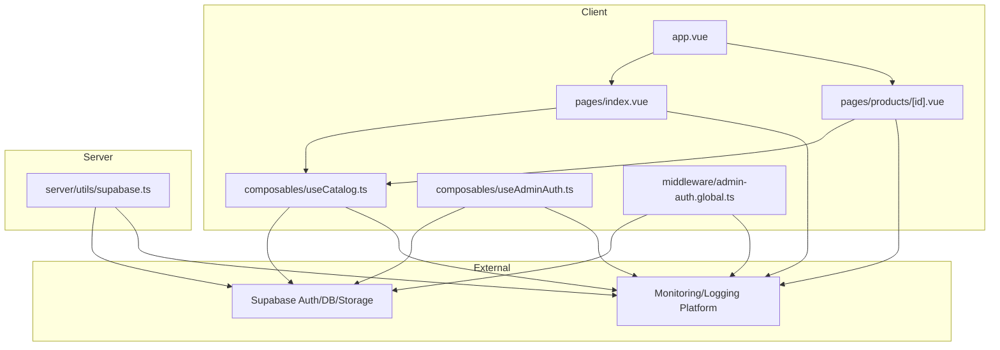
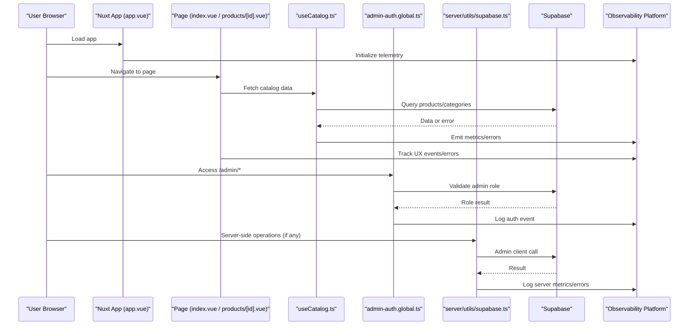
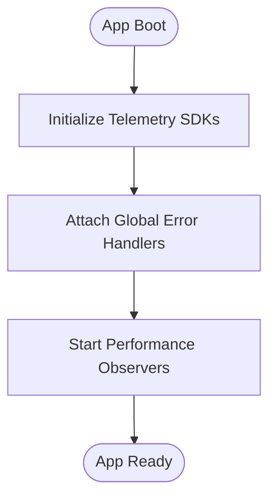
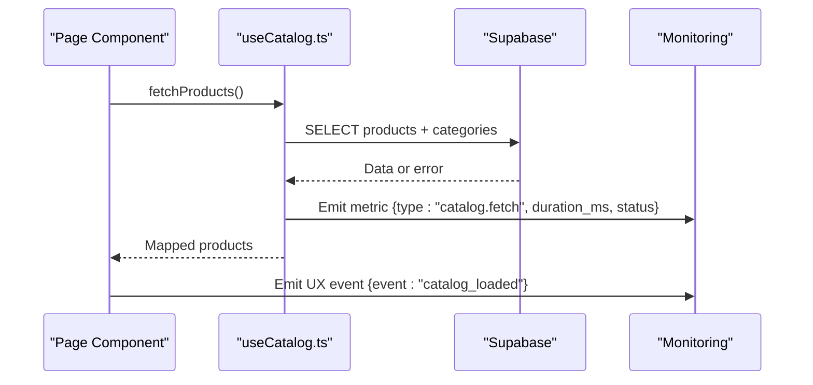
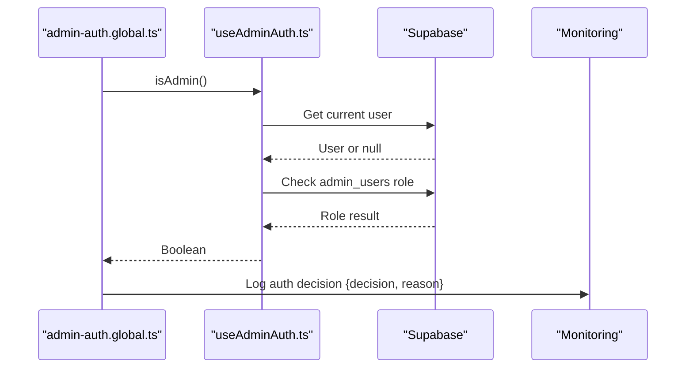
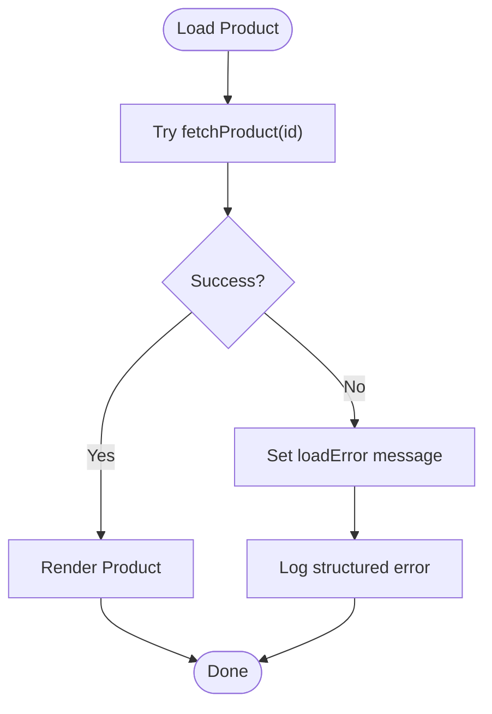
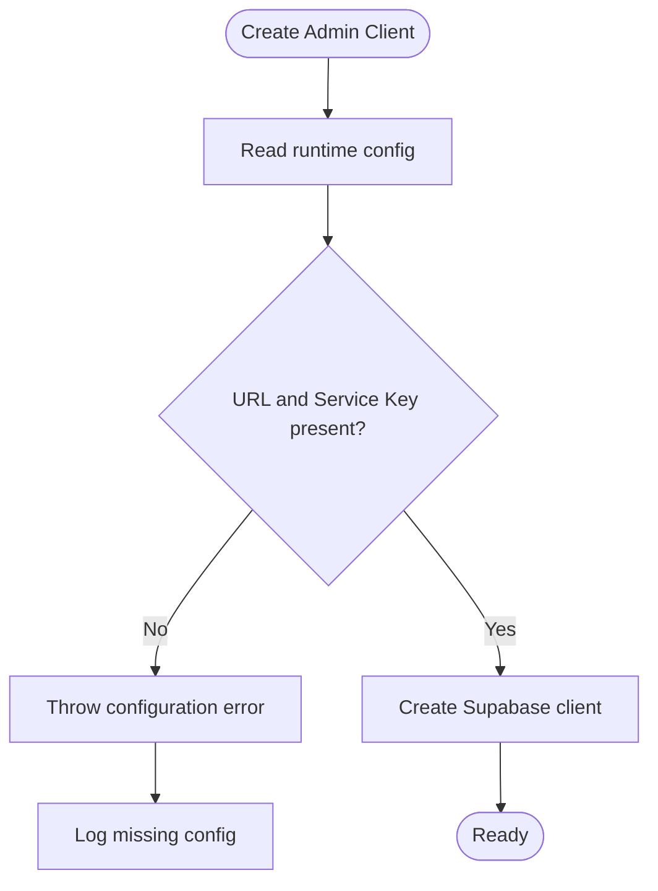

# Monitoring & Logging

<cite>
**Referenced Files in This Document**
- [package.json](file://package.json)
- [nuxt.config.ts](file://nuxt.config.ts)
- [app.vue](file://app/app.vue)
- [server/utils/supabase.ts](file://server/utils/supabase.ts)
- [app/composables/useAdminAuth.ts](file://app/composables/useAdminAuth.ts)
- [app/middleware/admin-auth.global.ts](file://app/middleware/admin-auth.global.ts)
- [app/pages/index.vue](file://app/pages/index.vue)
- [app/pages/products/[id].vue](file://app/pages/products/[id].vue)
- [app/composables/useCatalog.ts](file://app/composables/useCatalog.ts)
- [.github/workflows/ci.yml](file://.github/workflows/ci.yml)
</cite>

## Table of Contents
1. [Introduction](#introduction)
2. [Project Structure](#project-structure)
3. [Core Components](#core-components)
4. [Architecture Overview](#architecture-overview)
5. [Detailed Component Analysis](#detailed-component-analysis)
6. [Dependency Analysis](#dependency-analysis)
7. [Performance Considerations](#performance-considerations)
8. [Troubleshooting Guide](#troubleshooting-guide)
9. [Conclusion](#conclusion)
10. [Appendices](#appendices)

## Introduction
This document defines a production-ready monitoring and logging strategy for the Nuxt.js application. It focuses on:
- Application health checks
- Performance metrics collection (frontend and backend)
- Error logging and alerting
- Integration with external observability tools
- Debugging strategies, log analysis techniques, and operational dashboards

The goal is to make the system observable end-to-end while keeping implementation practical and incremental.

## Project Structure
The application is a Nuxt 4 app using Supabase for data and authentication. Observability should be layered across:
- Client-side: page interactions, network requests, errors, and user experience metrics
- Server-side: runtime configuration validation, API calls, and error handling
- Infrastructure: CI build verification and environment configuration



**Diagram sources**
- [app.vue:1-4](file://app/app.vue#L1-L4)
- [app/pages/index.vue:1-465](file://app/pages/index.vue#L1-L465)
- [app/pages/products/[id].vue:1-177](file://app/pages/products/[id].vue#L1-L177)
- [app/composables/useCatalog.ts:1-61](file://app/composables/useCatalog.ts#L1-L61)
- [app/composables/useAdminAuth.ts:1-79](file://app/composables/useAdminAuth.ts#L1-L79)
- [app/middleware/admin-auth.global.ts:1-28](file://app/middleware/admin-auth.global.ts#L1-L28)
- [server/utils/supabase.ts:1-20](file://server/utils/supabase.ts#L1-L20)

**Section sources**
- [package.json:1-26](file://package.json#L1-L26)
- [nuxt.config.ts:1-52](file://nuxt.config.ts#L1-L52)

## Core Components
Key areas where observability should be implemented or enhanced:
- Global app shell for injecting telemetry initialization
- Data composable for request timing and error tracking
- Admin auth flow for security-related events and failures
- Route middleware for access control and authorization metrics
- Server utility for validating runtime configuration and logging misconfiguration
- Pages for capturing user-facing errors and UX signals

Implementation priorities:
- Add a global error boundary and performance hooks at the app root
- Centralize Supabase client usage with timing and error instrumentation
- Instrument admin auth checks and route guards
- Standardize error logging with structured payloads
- Expose a health check endpoint for liveness/readiness probes

**Section sources**
- [app.vue:1-4](file://app/app.vue#L1-L4)
- [app/composables/useCatalog.ts:1-61](file://app/composables/useCatalog.ts#L1-L61)
- [app/composables/useAdminAuth.ts:1-79](file://app/composables/useAdminAuth.ts#L1-L79)
- [app/middleware/admin-auth.global.ts:1-28](file://app/middleware/admin-auth.global.ts#L1-L28)
- [server/utils/supabase.ts:1-20](file://server/utils/supabase.ts#L1-L20)

## Architecture Overview
End-to-end observability architecture integrating frontend, server, and external services:



**Diagram sources**
- [app.vue:1-4](file://app/app.vue#L1-L4)
- [app/pages/index.vue:1-465](file://app/pages/index.vue#L1-L465)
- [app/pages/products/[id].vue:1-177](file://app/pages/products/[id].vue#L1-L177)
- [app/composables/useCatalog.ts:1-61](file://app/composables/useCatalog.ts#L1-L61)
- [app/middleware/admin-auth.global.ts:1-28](file://app/middleware/admin-auth.global.ts#L1-L28)
- [server/utils/supabase.ts:1-20](file://server/utils/supabase.ts#L1-L20)

## Detailed Component Analysis

### Global App Shell and Telemetry Initialization
- Purpose: Provide a single place to initialize monitoring libraries, set up global error handlers, and attach performance observers.
- Recommendations:
  - Initialize browser-based RUM (Real User Monitoring) and error reporting in the app root.
  - Attach global unhandled promise rejection and error listeners to capture client-side exceptions.
  - Start performance observers for navigation timing and resource loading.



[No sources needed since this diagram shows conceptual workflow, not actual code structure]

**Section sources**
- [app.vue:1-4](file://app/app.vue#L1-L4)

### Catalog Data Flow and Metrics
- Purpose: Capture fetch durations, success/failure rates, and payload sizes for product and category queries.
- Recommendations:
  - Wrap Supabase calls in a timing wrapper that emits metrics like duration, status, and error type.
  - Normalize errors into structured logs with context (page, locale, query).
  - Track image URL resolution and storage access patterns.



**Diagram sources**
- [app/pages/index.vue:101-120](file://app/pages/index.vue#L101-L120)
- [app/composables/useCatalog.ts:37-47](file://app/composables/useCatalog.ts#L37-L47)

**Section sources**
- [app/composables/useCatalog.ts:1-61](file://app/composables/useCatalog.ts#L1-L61)
- [app/pages/index.vue:101-120](file://app/pages/index.vue#L101-L120)

### Admin Authentication and Authorization
- Purpose: Monitor auth flows, detect failed checks, and track authorization decisions.
- Recommendations:
  - Emit structured logs for signIn/signOut outcomes and role checks.
  - Record failure reasons (network, permission denied, invalid credentials).
  - Add metrics for auth latency and error rates.



**Diagram sources**
- [app/middleware/admin-auth.global.ts:1-28](file://app/middleware/admin-auth.global.ts#L1-L28)
- [app/composables/useAdminAuth.ts:16-54](file://app/composables/useAdminAuth.ts#L16-L54)

**Section sources**
- [app/composables/useAdminAuth.ts:1-79](file://app/composables/useAdminAuth.ts#L1-L79)
- [app/middleware/admin-auth.global.ts:1-28](file://app/middleware/admin-auth.global.ts#L1-L28)

### Product Detail Page Error Handling
- Purpose: Capture load failures and present user-friendly messages while logging actionable details.
- Recommendations:
  - Standardize error payloads with message, stack trace (sanitized), and context (product id, locale).
  - Track retry attempts and fallback behavior.
  - Emit UX metrics for perceived load time and error visibility.



**Diagram sources**
- [app/pages/products/[id].vue:10-20](file://app/pages/products/[id].vue#L10-L20)

**Section sources**
- [app/pages/products/[id].vue:1-177](file://app/pages/products/[id].vue#L1-L177)

### Server-Side Configuration Validation
- Purpose: Ensure critical environment variables are present before starting server-side operations.
- Recommendations:
  - Validate runtime config early and emit structured warnings/errors.
  - Integrate with monitoring platform to alert on missing configuration.
  - Avoid leaking sensitive values in logs.



**Diagram sources**
- [server/utils/supabase.ts:3-19](file://server/utils/supabase.ts#L3-L19)

**Section sources**
- [server/utils/supabase.ts:1-20](file://server/utils/supabase.ts#L1-L20)

## Dependency Analysis
Current dependencies relevant to observability:
- Nuxt framework and modules
- Supabase client integration
- UI and i18n modules

Observability additions should be introduced via new packages (e.g., RUM, error tracking, metrics) without disrupting existing dependencies.

```mermaid
graph LR
PKG["package.json"]
NUXT["nuxt"]
SUPABASE["@supabase/supabase-js"]
MODULES["@nuxtjs/supabase", "@nuxtjs/i18n", "@nuxtjs/color-mode"]
OBSERVABILITY["Observability SDKs (to add)"]
PKG --> NUXT
PKG --> SUPABASE
PKG --> MODULES
PKG --> OBSERVABILITY
```

**Diagram sources**
- [package.json:12-23](file://package.json#L12-L23)

**Section sources**
- [package.json:1-26](file://package.json#L1-L26)

## Performance Considerations
- Frontend:
  - Use Resource Timing and Navigation Timing APIs to measure TTFB, DOMContentLoaded, and First Contentful Paint.
  - Debounce high-frequency events (search input, scroll) before emitting metrics.
  - Batch metrics and flush periodically to reduce overhead.
- Backend:
  - Measure database query durations and error rates; surface slow queries.
  - Avoid synchronous blocking operations in request paths.
- Storage:
  - Track image upload and retrieval latencies; cache public URLs when appropriate.
- CI:
  - Ensure builds pass consistently; consider adding performance budget checks.

[No sources needed since this section provides general guidance]

## Troubleshooting Guide
Common issues and how to address them:
- Missing environment variables:
  - Validate runtime config early and alert on absence.
  - Reference configuration keys from nuxt.config.ts.
- Supabase errors:
  - Capture error codes and messages; correlate with Supabase Monitoring and Debugging documentation.
  - Enable pg_stat_statements to identify slow queries.
- Admin auth failures:
  - Log authorization decisions and reasons; ensure middleware redirects appropriately.
- Client-side errors:
  - Centralize error handling and send structured logs to your observability platform.

Operational tips:
- Define SLOs for key pages (home, product detail) and monitor error budgets.
- Create dashboards for:
  - Request latency percentiles
  - Error rates by route and component
  - Auth success/failure rates
  - Database query performance
- Set alerts for:
  - Error rate spikes
  - Latency p95 exceeding thresholds
  - Missing configuration or service degradation

**Section sources**
- [nuxt.config.ts:9-20](file://nuxt.config.ts#L9-L20)
- [server/utils/supabase.ts:3-19](file://server/utils/supabase.ts#L3-L19)
- [app/middleware/admin-auth.global.ts:1-28](file://app/middleware/admin-auth.global.ts#L1-L28)
- [app/composables/useAdminAuth.ts:16-54](file://app/composables/useAdminAuth.ts#L16-L54)

## Conclusion
By implementing centralized telemetry initialization, instrumenting data flows, standardizing error logging, and integrating with external monitoring platforms, the application becomes fully observable in production. The proposed strategy balances immediate value with incremental improvements, enabling robust debugging, proactive alerting, and data-driven performance optimization.

[No sources needed since this section summarizes without analyzing specific files]

## Appendices

### Health Checks
- Liveness probe:
  - Simple endpoint returning 200 OK if the process is running.
- Readiness probe:
  - Verify connectivity to Supabase and validate runtime configuration.

[No sources needed since this section provides general guidance]

### CI Integration
- Current CI builds the app; extend it to run linting and tests, and optionally performance checks.

**Section sources**
- [.github/workflows/ci.yml:1-26](file://.github/workflows/ci.yml#L1-L26)