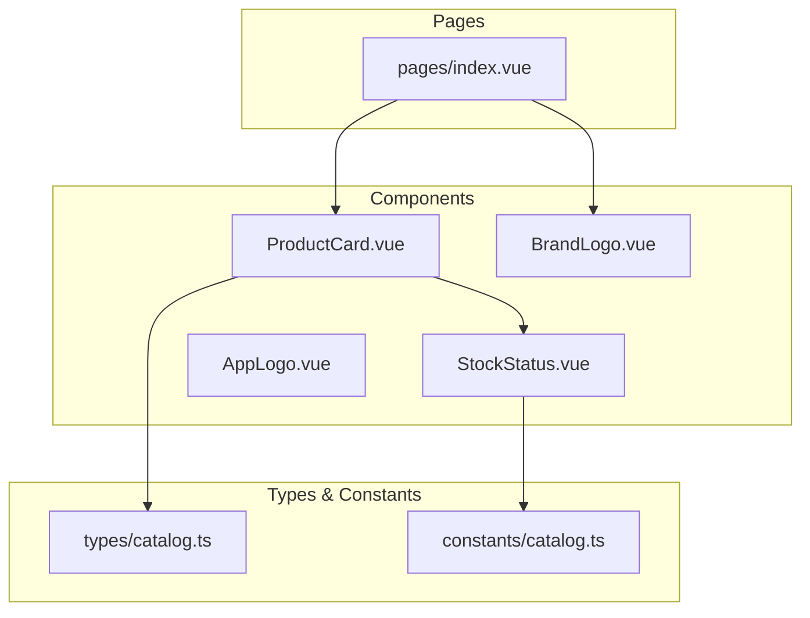
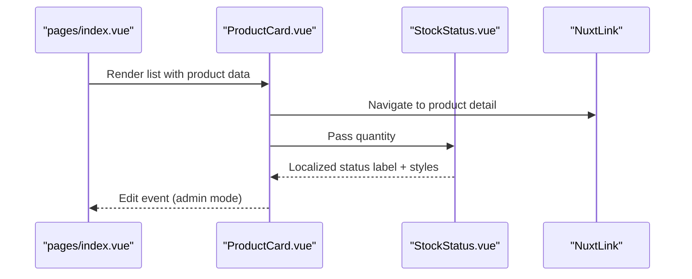
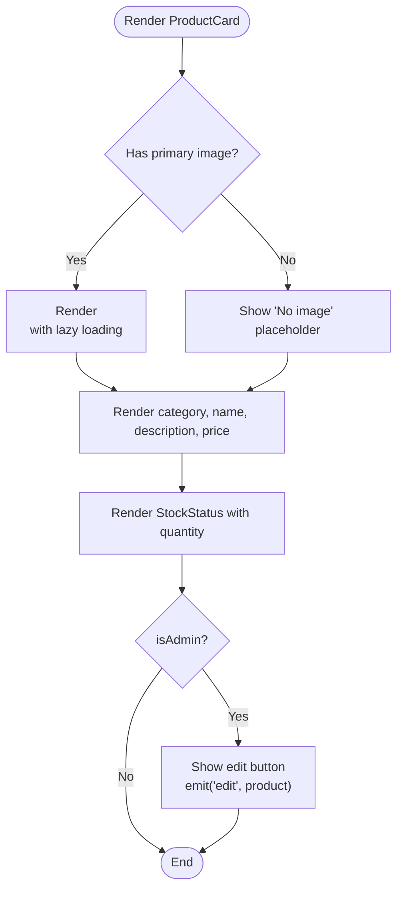
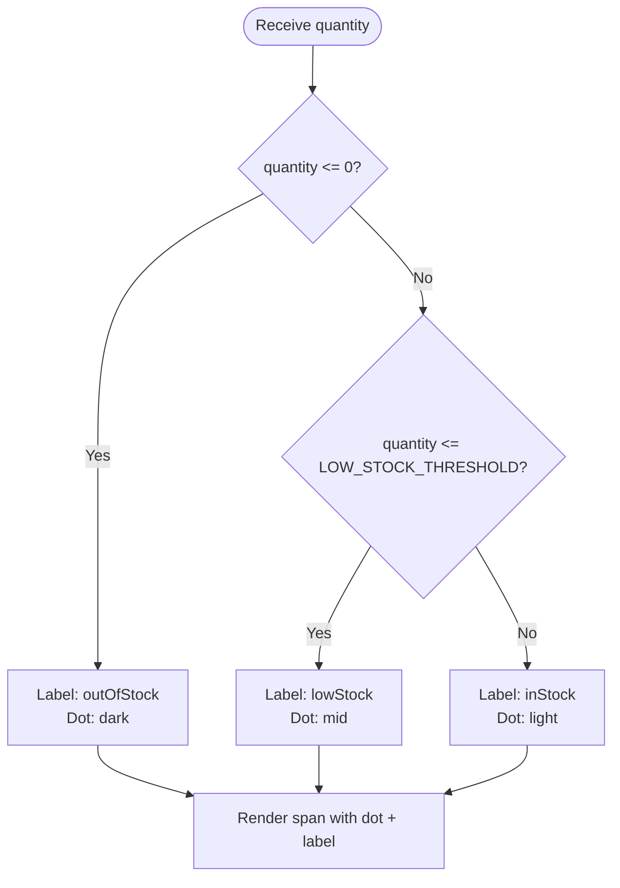
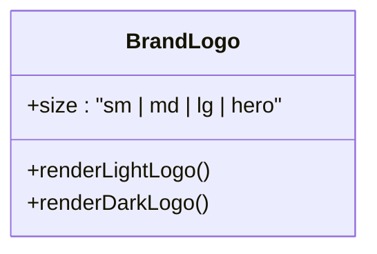
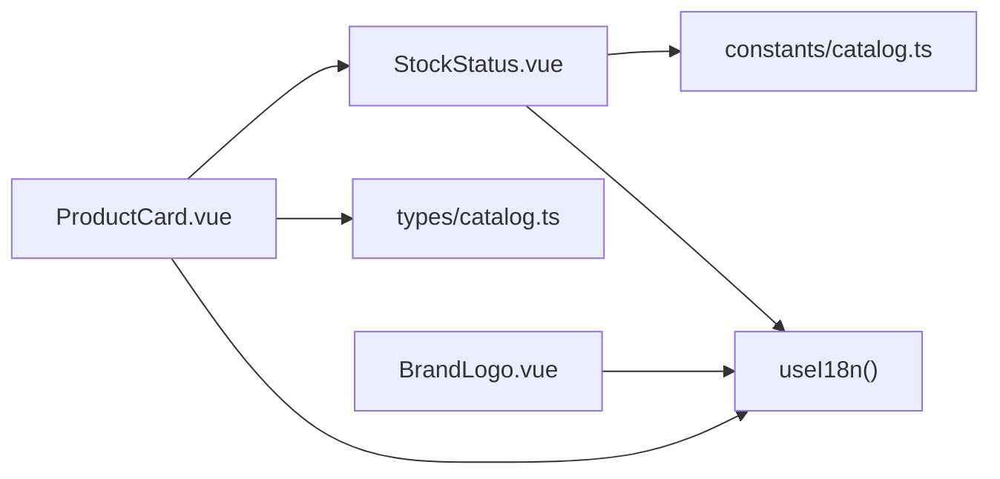

# Core UI Components

<cite>
**Referenced Files in This Document**
- [ProductCard.vue](file://app/components/ProductCard.vue)
- [StockStatus.vue](file://app/components/StockStatus.vue)
- [AppLogo.vue](file://app/components/AppLogo.vue)
- [BrandLogo.vue](file://app/components/BrandLogo.vue)
- [catalog.ts](file://app/types/catalog.ts)
- [catalog.ts](file://app/constants/catalog.ts)
- [index.vue](file://app/pages/index.vue)
- [i18n.config.ts](file://i18n.config.ts)
</cite>

## Table of Contents
1. [Introduction](#introduction)
2. [Project Structure](#project-structure)
3. [Core Components](#core-components)
4. [Architecture Overview](#architecture-overview)
5. [Detailed Component Analysis](#detailed-component-analysis)
6. [Dependency Analysis](#dependency-analysis)
7. [Performance Considerations](#performance-considerations)
8. [Troubleshooting Guide](#troubleshooting-guide)
9. [Conclusion](#conclusion)

## Introduction
This document provides comprehensive documentation for the core UI components that form the foundation of the application’s visual interface: ProductCard, StockStatus, AppLogo, and BrandLogo. It covers their responsibilities, prop interfaces, event handling patterns, customization options, accessibility features, internationalization support, and performance considerations. Usage examples are included to demonstrate proper implementation, styling approaches, and responsive design strategies.

## Project Structure
The components live under app/components and integrate with shared types and constants:
- ProductCard.vue: Displays product information including image, name, category, price, short description, stock status, and an optional admin edit action.
- StockStatus.vue: Renders a color-coded inventory indicator based on quantity thresholds.
- AppLogo.vue: Provides a static SVG logo component.
- BrandLogo.vue: Renders brand logos with size variants and dark/light mode support.
- Types and constants: CatalogProduct and related types define the data contract; LOW_STOCK_THRESHOLD defines inventory thresholds.

**Diagram sources**
- [ProductCard.vue:1-68](file://app/components/ProductCard.vue#L1-L68)
- [StockStatus.vue:1-20](file://app/components/StockStatus.vue#L1-L20)
- [AppLogo.vue:1-41](file://app/components/AppLogo.vue#L1-L41)
- [BrandLogo.vue:1-33](file://app/components/BrandLogo.vue#L1-L33)
- [catalog.ts](file://app/types/catalog.ts)
- [catalog.ts](file://app/constants/catalog.ts)
- [index.vue:319-327](file://app/pages/index.vue#L319-L327)

**Section sources**
- [ProductCard.vue:1-68](file://app/components/ProductCard.vue#L1-L68)
- [StockStatus.vue:1-20](file://app/components/StockStatus.vue#L1-L20)
- [AppLogo.vue:1-41](file://app/components/AppLogo.vue#L1-L41)
- [BrandLogo.vue:1-33](file://app/components/BrandLogo.vue#L1-L33)
- [catalog.ts](file://app/types/catalog.ts)
- [catalog.ts](file://app/constants/catalog.ts)
- [index.vue:319-327](file://app/pages/index.vue#L319-L327)

## Core Components
- ProductCard: A presentation component for catalog items. It renders product images (with fallback), category label, title, short description, formatted price, and integrates StockStatus. It supports an optional admin-only edit button and emits an edit event.
- StockStatus: A small status badge showing inventory state using color-coded indicators and localized labels.
- AppLogo: A static SVG logo component used for branding.
- BrandLogo: A responsive logo component supporting multiple sizes and light/dark mode assets.

Key integration points:
- Data model: CatalogProduct from types/catalog.ts.
- Inventory threshold: LOW_STOCK_THRESHOLD from constants/catalog.ts.
- Internationalization: useI18n() for localized strings.
- Routing: NuxtLink navigates to product detail pages.

**Section sources**
- [ProductCard.vue:1-68](file://app/components/ProductCard.vue#L1-L68)
- [StockStatus.vue:1-20](file://app/components/StockStatus.vue#L1-L20)
- [AppLogo.vue:1-41](file://app/components/AppLogo.vue#L1-L41)
- [BrandLogo.vue:1-33](file://app/components/BrandLogo.vue#L1-L33)
- [catalog.ts](file://app/types/catalog.ts)
- [catalog.ts](file://app/constants/catalog.ts)
- [i18n.config.ts:1-14](file://i18n.config.ts#L1-L14)

## Architecture Overview
The components follow a simple composition pattern:
- Pages render lists of products using ProductCard.
- ProductCard composes StockStatus to visualize inventory.
- Branding is provided by AppLogo and BrandLogo across the application.

**Diagram sources**
- [index.vue:319-327](file://app/pages/index.vue#L319-L327)
- [ProductCard.vue:13-33](file://app/components/ProductCard.vue#L13-L33)
- [ProductCard.vue:56-65](file://app/components/ProductCard.vue#L56-L65)
- [StockStatus.vue:7-18](file://app/components/StockStatus.vue#L7-L18)

## Detailed Component Analysis

### ProductCard
Responsibilities:
- Display product image with lazy loading and graceful fallback when no image exists.
- Show category label, product name, short description, and formatted price.
- Integrate StockStatus to reflect inventory levels.
- Provide an optional admin-only edit button that emits an edit event with the product object.
- Use i18n for localized text such as “Details” and “No image”.

Prop interface:
- product: CatalogProduct (required)
- isAdmin?: boolean (optional)

Events:
- edit(product: CatalogProduct): Emitted when the admin edit button is clicked.

Accessibility:
- Image alt text uses product.images[0].altText or falls back to product.name.
- Edit button has aria-label and aria-hidden on decorative SVGs.
- Links use semantic NuxtLink elements.

Internationalization:
- Uses useI18n() to localize “noImage” and “details”.

Styling and responsiveness:
- Responsive typography and spacing via Tailwind utilities.
- Hover effects and transitions for interactive states.
- Aspect-ratio container ensures consistent image sizing.

Usage example (from page):
- The index page maps over filteredProducts and passes product and isAdminMode to ProductCard, listening to the edit event to open an editor.

**Diagram sources**
- [ProductCard.vue:14-24](file://app/components/ProductCard.vue#L14-L24)
- [ProductCard.vue:36-53](file://app/components/ProductCard.vue#L36-L53)
- [ProductCard.vue:56-65](file://app/components/ProductCard.vue#L56-L65)

**Section sources**
- [ProductCard.vue:1-68](file://app/components/ProductCard.vue#L1-L68)
- [catalog.ts:8-24](file://app/types/catalog.ts#L8-L24)
- [index.vue:319-327](file://app/pages/index.vue#L319-L327)

### StockStatus
Responsibilities:
- Compute inventory status based on quantity and LOW_STOCK_THRESHOLD.
- Return localized labels and corresponding color classes for text and dot indicator.

Props:
- quantity: number (required)

Computed behavior:
- Out of stock: quantity <= 0
- Low stock: 0 < quantity <= LOW_STOCK_THRESHOLD
- In stock: quantity > LOW_STOCK_THRESHOLD

Internationalization:
- Uses useI18n() to localize “outOfStock”, “lowStock”, and “inStock”.

Styling:
- Inline-flex layout with a colored dot and label.
- Dark mode color variants applied via Tailwind classes.

**Diagram sources**
- [StockStatus.vue:7-11](file://app/components/StockStatus.vue#L7-L11)
- [catalog.ts:1](file://app/constants/catalog.ts#L1)

**Section sources**
- [StockStatus.vue:1-20](file://app/components/StockStatus.vue#L1-L20)
- [catalog.ts:1](file://app/constants/catalog.ts#L1)
- [i18n.config.ts:1-14](file://i18n.config.ts#L1-L14)

### AppLogo
Responsibilities:
- Provide a static SVG logo component for branding.
- Uses CSS custom property var(--ui-primary) for accent colors.

Customization:
- No props; styling can be controlled via CSS variables or wrapper containers.

Accessibility:
- Decorative SVG without text; suitable for branding contexts where it is not the sole content.

Usage:
- Can be placed within headers or footers to display the application logo.

**Section sources**
- [AppLogo.vue:1-41](file://app/components/AppLogo.vue#L1-L41)

### BrandLogo
Responsibilities:
- Render brand logos with size variants and automatic switching between light and dark mode assets.
- Support sizes: sm, md, lg, hero.

Props:
- size?: 'sm' | 'md' | 'lg' | 'hero'

Internationalization:
- Alt text uses $t('appName') for accessibility and localization.

Styling and responsiveness:
- Conditional class names apply different heights per size breakpoint.
- Hidden/block toggles ensure only the appropriate asset is shown in light/dark modes.

Usage example (from page):
- The index page renders BrandLogo with size="hero" inside a link to the home route.

**Diagram sources**
- [BrandLogo.vue:2-30](file://app/components/BrandLogo.vue#L2-L30)

**Section sources**
- [BrandLogo.vue:1-33](file://app/components/BrandLogo.vue#L1-L33)
- [index.vue:196-198](file://app/pages/index.vue#L196-L198)
- [i18n.config.ts:1-14](file://i18n.config.ts#L1-L14)

## Dependency Analysis
Component relationships and external dependencies:
- ProductCard depends on:
  - CatalogProduct type for data structure.
  - StockStatus for inventory visualization.
  - NuxtLink for navigation.
  - useI18n for localized strings.
- StockStatus depends on:
  - LOW_STOCK_THRESHOLD constant.
  - useI18n for localized strings.
- BrandLogo depends on:
  - $t for localized alt text.
  - Static assets for light/dark logos.

**Diagram sources**
- [ProductCard.vue:1-6](file://app/components/ProductCard.vue#L1-L6)
- [StockStatus.vue:1-5](file://app/components/StockStatus.vue#L1-L5)
- [BrandLogo.vue:1-4](file://app/components/BrandLogo.vue#L1-L4)
- [catalog.ts](file://app/types/catalog.ts)
- [catalog.ts](file://app/constants/catalog.ts)

**Section sources**
- [ProductCard.vue:1-68](file://app/components/ProductCard.vue#L1-L68)
- [StockStatus.vue:1-20](file://app/components/StockStatus.vue#L1-L20)
- [BrandLogo.vue:1-33](file://app/components/BrandLogo.vue#L1-L33)
- [catalog.ts](file://app/types/catalog.ts)
- [catalog.ts](file://app/constants/catalog.ts)

## Performance Considerations
- Lazy image loading: ProductCard uses loading="lazy" on images to defer offscreen image loading.
- Efficient rendering: StockStatus computes status once per update via computed properties.
- Minimal DOM: Components avoid unnecessary wrappers and rely on utility classes for layout.
- Asset optimization: BrandLogo switches between light/dark assets to reduce runtime logic and improve perceived performance.

Recommendations:
- Ensure images are optimized and appropriately sized.
- Consider adding error boundaries or fallbacks for broken images beyond the current placeholder.
- Keep localized strings minimal and well-structured to reduce translation overhead.

[No sources needed since this section provides general guidance]

## Troubleshooting Guide
Common issues and resolutions:
- Missing product images:
  - Symptom: Placeholder “No image” appears.
  - Resolution: Verify product.images array contains at least one entry with a valid url.
- Incorrect stock status:
  - Symptom: Status shows unexpected label.
  - Resolution: Confirm quantity values and adjust LOW_STOCK_THRESHOLD if business rules change.
- Localization missing:
  - Symptom: Text not translated.
  - Resolution: Ensure keys like “noImage”, “details”, “inStock”, “lowStock”, “outOfStock”, and “appName” exist in i18n messages.
- Admin edit button not visible:
  - Symptom: Edit button does not appear.
  - Resolution: Ensure isAdmin prop is true when rendering ProductCard in admin context.

**Section sources**
- [ProductCard.vue:14-24](file://app/components/ProductCard.vue#L14-L24)
- [ProductCard.vue:25-33](file://app/components/ProductCard.vue#L25-L33)
- [StockStatus.vue:7-11](file://app/components/StockStatus.vue#L7-L11)
- [i18n.config.ts:1-14](file://i18n.config.ts#L1-L14)

## Conclusion
The core UI components—ProductCard, StockStatus, AppLogo, and BrandLogo—provide a cohesive, accessible, and internationalized foundation for the application’s visual interface. They integrate cleanly with shared types and constants, support responsive design, and offer clear extension points for customization. Following the documented prop interfaces, event patterns, and best practices will ensure consistent behavior and maintainability across the application.