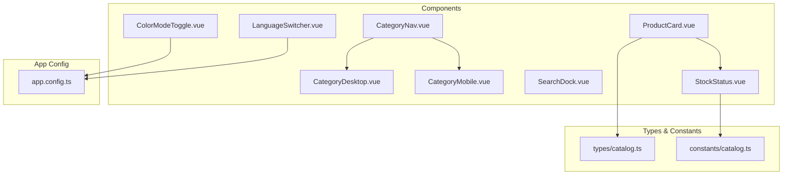
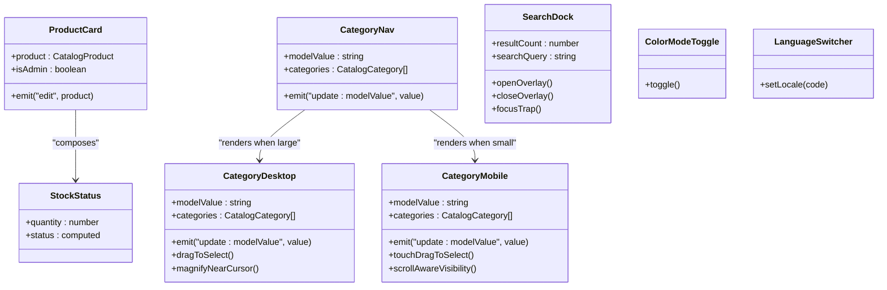
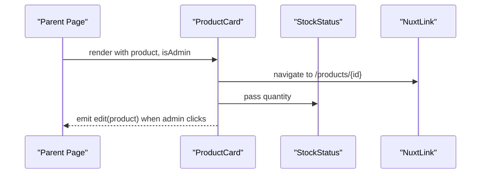
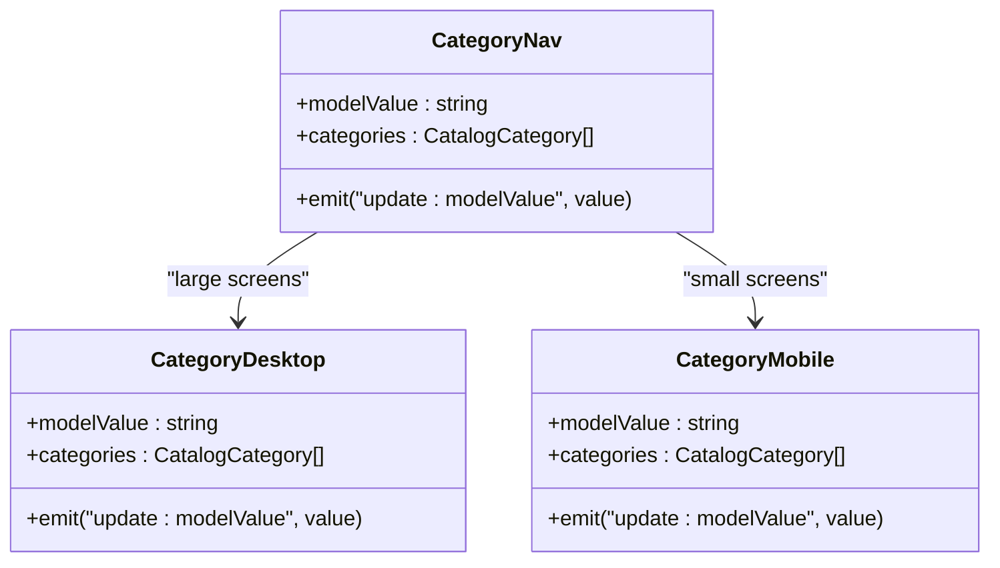
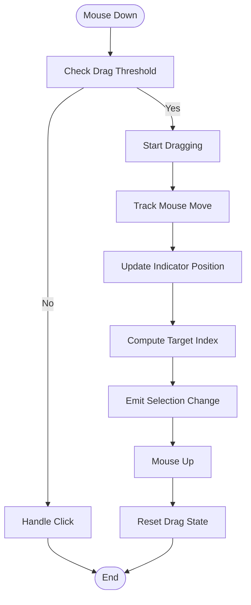
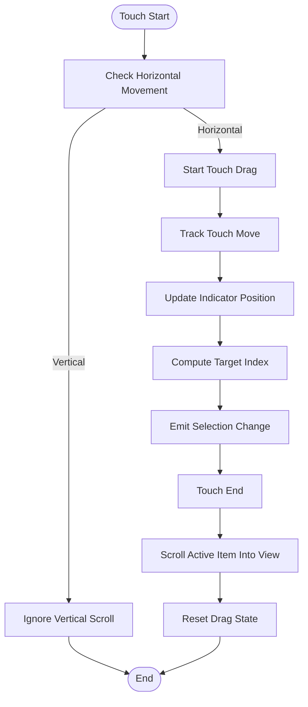
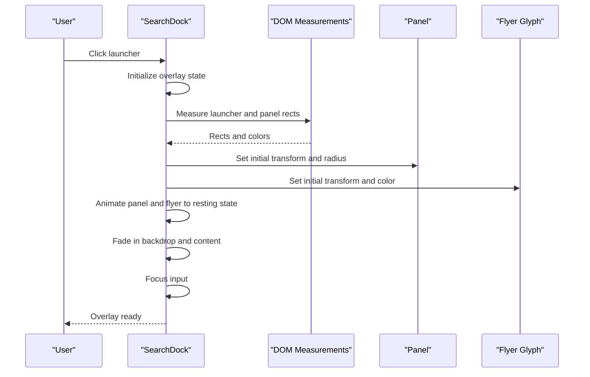
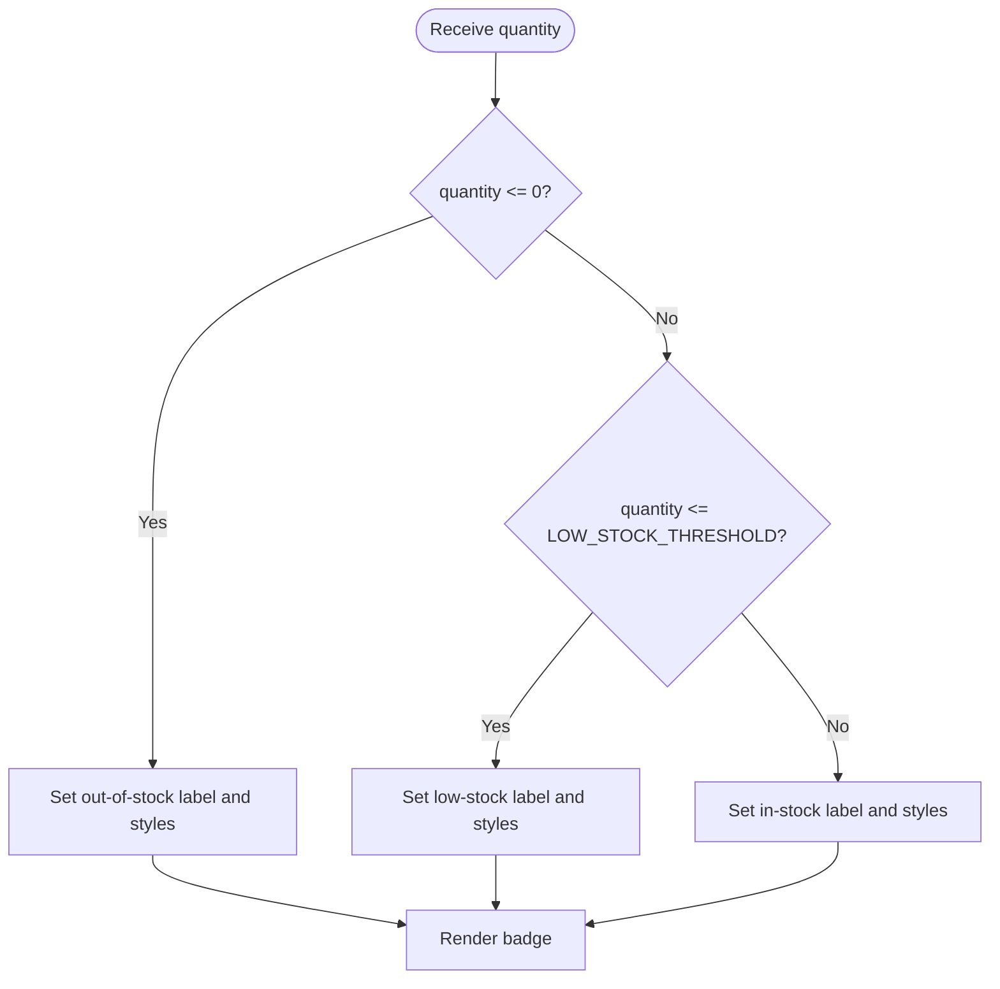
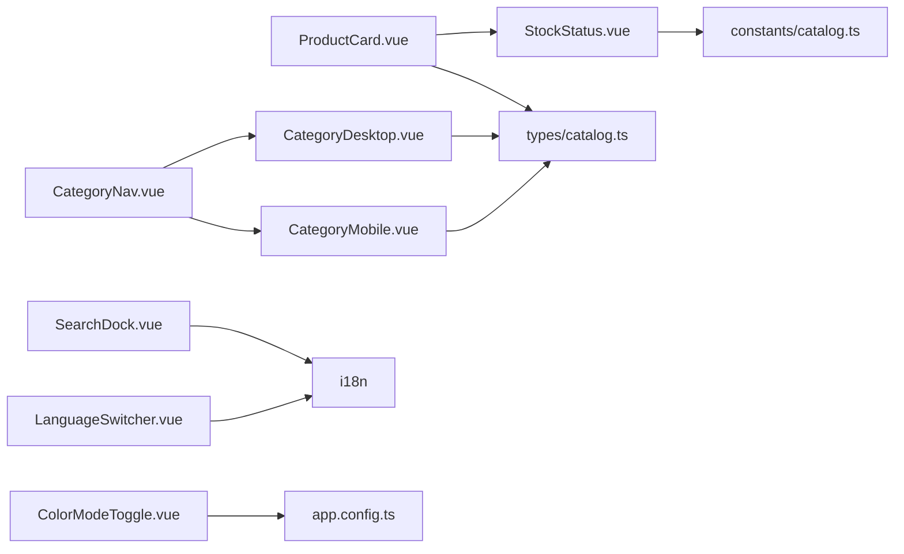

# Frontend Components

<cite>
**Referenced Files in This Document**   
- [ProductCard.vue](file://app/components/ProductCard.vue)
- [CategoryNav.vue](file://app/components/CategoryNav.vue)
- [CategoryDesktop.vue](file://app/components/category/CategoryDesktop.vue)
- [CategoryMobile.vue](file://app/components/category/CategoryMobile.vue)
- [SearchDock.vue](file://app/components/SearchDock.vue)
- [StockStatus.vue](file://app/components/StockStatus.vue)
- [ColorModeToggle.vue](file://app/components/ColorModeToggle.vue)
- [LanguageSwitcher.vue](file://app/components/LanguageSwitcher.vue)
- [catalog.ts](file://app/types/catalog.ts)
- [catalog.ts](file://app/constants/catalog.ts)
- [app.config.ts](file://app/app.config.ts)
</cite>

## Table of Contents
1. [Introduction](#introduction)
2. [Project Structure](#project-structure)
3. [Core Components](#core-components)
4. [Architecture Overview](#architecture-overview)
5. [Detailed Component Analysis](#detailed-component-analysis)
6. [Dependency Analysis](#dependency-analysis)
7. [Performance Considerations](#performance-considerations)
8. [Troubleshooting Guide](#troubleshooting-guide)
9. [Conclusion](#conclusion)
10. [Appendices](#appendices)

## Introduction
This document explains the Vue 3 frontend component architecture for a Nuxt.js storefront. It focuses on reusable UI elements, composition API usage, prop interfaces, event handling patterns, responsive design, accessibility, theming, animations, and performance considerations. The core components covered are:

- ProductCard: product display card with optional admin edit action
- CategoryNav: responsive category navigation that delegates to desktop and mobile variants
- CategoryDesktop: vertical dock with magnification, drag-to-select, and animated selection indicator
- CategoryMobile: horizontal pill bar with touch drag-to-select and scroll-aware visibility
- SearchDock: morphing search overlay with focus management, keyboard navigation, and scroll locking
- StockStatus: inventory status badge using a shared threshold constant
- ColorModeToggle: theme toggle using Nuxt color mode
- LanguageSwitcher: locale switcher using i18n composable

The application uses TypeScript, Tailwind CSS, Vue 3 Composition API, Nuxt routing, and internationalization.

## Project Structure
The frontend is organized by feature and responsibility:

- app/components: reusable UI components
- app/components/category: responsive category navigation implementations
- app/types: shared TypeScript types for catalog data
- app/constants: shared constants such as stock thresholds
- app/app.config.ts: global UI configuration (colors, default shapes)
- Pages and composables exist but are outside this documentation’s scope

**Diagram sources**
- [ProductCard.vue:1-68](file://app/components/ProductCard.vue#L1-L68)
- [CategoryNav.vue:1-37](file://app/components/CategoryNav.vue#L1-L37)
- [CategoryDesktop.vue:1-611](file://app/components/category/CategoryDesktop.vue#L1-L611)
- [CategoryMobile.vue:1-577](file://app/components/category/CategoryMobile.vue#L1-L577)
- [SearchDock.vue:1-628](file://app/components/SearchDock.vue#L1-L628)
- [StockStatus.vue:1-20](file://app/components/StockStatus.vue#L1-L20)
- [ColorModeToggle.vue:1-66](file://app/components/ColorModeToggle.vue#L1-L66)
- [LanguageSwitcher.vue:1-33](file://app/components/LanguageSwitcher.vue#L1-L33)
- [catalog.ts](file://app/types/catalog.ts)
- [catalog.ts](file://app/constants/catalog.ts)
- [app.config.ts:1-20](file://app/app.config.ts#L1-L20)

**Section sources**
- [ProductCard.vue:1-68](file://app/components/ProductCard.vue#L1-L68)
- [CategoryNav.vue:1-37](file://app/components/CategoryNav.vue#L1-L37)
- [CategoryDesktop.vue:1-611](file://app/components/category/CategoryDesktop.vue#L1-L611)
- [CategoryMobile.vue:1-577](file://app/components/category/CategoryMobile.vue#L1-L577)
- [SearchDock.vue:1-628](file://app/components/SearchDock.vue#L1-L628)
- [StockStatus.vue:1-20](file://app/components/StockStatus.vue#L1-L20)
- [ColorModeToggle.vue:1-66](file://app/components/ColorModeToggle.vue#L1-L66)
- [LanguageSwitcher.vue:1-33](file://app/components/LanguageSwitcher.vue#L1-L33)
- [catalog.ts](file://app/types/catalog.ts)
- [catalog.ts](file://app/constants/catalog.ts)
- [app.config.ts:1-20](file://app/app.config.ts#L1-L20)

## Core Components
This section summarizes each core component’s purpose, props, events, state, and integration points.

- ProductCard
  - Purpose: Display a product image, name, category, price, short description, and stock status; optionally show an edit button for admins.
  - Props: product (CatalogProduct), isAdmin (boolean).
  - Events: edit(product: CatalogProduct).
  - State: none beyond template rendering.
  - Integration: Uses StockStatus, NuxtLink, and i18n.

- CategoryNav
  - Purpose: Responsive category selector delegating to desktop or mobile implementation.
  - Props: modelValue (string), categories (CatalogCategory[]).
  - Events: update:modelValue(value: string).
  - State: none; purely presentational delegation.
  - Integration: Renders CategoryDesktop and CategoryMobile.

- CategoryDesktop
  - Purpose: Vertical category dock with mouse-based drag-to-select, magnification near cursor, and animated selection indicator.
  - Props: modelValue (string), categories (CatalogCategory[]).
  - Events: update:modelValue(value: string).
  - State: active index, drag state, indicator position/scale, mouse position, resize observer.
  - Integration: Uses i18n and computed items derived from CATEGORY_ITEMS and database categories.

- CategoryMobile
  - Purpose: Horizontal pill bar with touch drag-to-select, scroll-aware visibility, and animated selection indicator.
  - Props: modelValue (string), categories (CatalogCategory[]).
  - Events: update:modelValue(value: string).
  - State: active index, touch drag state, indicator position/scale, scroll direction detection.
  - Integration: Uses i18n and computed items derived from CATEGORY_ITEMS and database categories.

- SearchDock
  - Purpose: Morphing search overlay launched from icon; manages focus trap, keyboard navigation, backdrop, panel animation, and result count display.
  - Props: resultCount (number).
  - Model: searchQuery (string).
  - State: overlay lifecycle, morphing states, panel/flyer transforms, backdrop/content opacity, scroll lock, focus references.
  - Integration: Uses i18n, Teleport, and DOM measurements for morph transitions.

- StockStatus
  - Purpose: Show inventory status label and dot based on quantity and threshold.
  - Props: quantity (number).
  - State: computed status object with label and classes.
  - Integration: Uses LOW_STOCK_THRESHOLD and i18n.

- ColorModeToggle
  - Purpose: Toggle between light and dark themes using Nuxt color mode.
  - Props: none.
  - Events: none.
  - State: isDark computed from color mode.
  - Integration: Uses useColorMode and ClientOnly.

- LanguageSwitcher
  - Purpose: Switch locale between supported languages.
  - Props: none.
  - Events: none.
  - State: current locale from i18n.
  - Integration: Uses useI18n.

**Section sources**
- [ProductCard.vue:1-68](file://app/components/ProductCard.vue#L1-L68)
- [CategoryNav.vue:1-37](file://app/components/CategoryNav.vue#L1-L37)
- [CategoryDesktop.vue:1-611](file://app/components/category/CategoryDesktop.vue#L1-L611)
- [CategoryMobile.vue:1-577](file://app/components/category/CategoryMobile.vue#L1-L577)
- [SearchDock.vue:1-628](file://app/components/SearchDock.vue#L1-L628)
- [StockStatus.vue:1-20](file://app/components/StockStatus.vue#L1-L20)
- [ColorModeToggle.vue:1-66](file://app/components/ColorModeToggle.vue#L1-L66)
- [LanguageSwitcher.vue:1-33](file://app/components/LanguageSwitcher.vue#L1-L33)

## Architecture Overview
The component system follows a clear hierarchy:

- CategoryNav orchestrates responsive behavior by rendering either CategoryDesktop or CategoryMobile.
- ProductCard composes StockStatus and navigates via NuxtLink.
- SearchDock provides a full-screen overlay with morphing transitions and robust focus management.
- Theme and language utilities are independent, reusable components.

**Diagram sources**
- [ProductCard.vue:1-68](file://app/components/ProductCard.vue#L1-L68)
- [CategoryNav.vue:1-37](file://app/components/CategoryNav.vue#L1-L37)
- [CategoryDesktop.vue:1-611](file://app/components/category/CategoryDesktop.vue#L1-L611)
- [CategoryMobile.vue:1-577](file://app/components/category/CategoryMobile.vue#L1-L577)
- [SearchDock.vue:1-628](file://app/components/SearchDock.vue#L1-L628)
- [StockStatus.vue:1-20](file://app/components/StockStatus.vue#L1-L20)
- [ColorModeToggle.vue:1-66](file://app/components/ColorModeToggle.vue#L1-L66)
- [LanguageSwitcher.vue:1-33](file://app/components/LanguageSwitcher.vue#L1-L33)

## Detailed Component Analysis

### ProductCard
- Prop interface:
  - product: CatalogProduct
  - isAdmin?: boolean
- Event:
  - edit(product: CatalogProduct)
- Behavior:
  - Displays first image if available; otherwise shows localized placeholder text.
  - Shows category name, product name, short description, and formatted price.
  - Composes StockStatus with product.stockQuantity.
  - Provides an edit button visible only when isAdmin is true; emits edit event with the product.
- Accessibility:
  - Image alt text falls back to product.name when missing.
  - Edit button has aria-label and aria-hidden on decorative SVGs.
- Styling:
  - Pill-like rounded container with hover effects and smooth scale transition on image.
  - Admin edit button fades in on hover with subtle scale.

Usage example (conceptual):
- Bind a CatalogProduct to the product prop.
- Pass isAdmin where appropriate.
- Listen to the edit event to open an editor or modal.

Styling approach:
- Use Tailwind utility classes for layout, typography, colors, and transitions.
- Dark mode is handled via dark: variants.

**Section sources**
- [ProductCard.vue:1-68](file://app/components/ProductCard.vue#L1-L68)
- [catalog.ts:8-24](file://app/types/catalog.ts#L8-L24)

#### ProductCard Sequence Diagram

**Diagram sources**
- [ProductCard.vue:13-33](file://app/components/ProductCard.vue#L13-L33)
- [ProductCard.vue:56-65](file://app/components/ProductCard.vue#L56-L65)

### CategoryNav
- Prop interface:
  - modelValue: string
  - categories?: CatalogCategory[]
- Event:
  - update:modelValue(value: string)
- Behavior:
  - Delegates to CategoryDesktop on large screens and CategoryMobile on smaller screens.
  - Forwards v-model binding and emits updates from child components.
- Accessibility:
  - Children provide role="tab" and aria-selected attributes.
- Styling:
  - Uses Tailwind breakpoints to conditionally render desktop/mobile variants.

Usage example (conceptual):
- Bind a selected category id or slug to modelValue.
- Provide categories array for richer labels and values.

**Section sources**
- [CategoryNav.vue:1-37](file://app/components/CategoryNav.vue#L1-L37)
- [catalog.ts:26-30](file://app/types/catalog.ts#L26-L30)

#### CategoryNav Class Diagram

**Diagram sources**
- [CategoryNav.vue:1-37](file://app/components/CategoryNav.vue#L1-L37)
- [CategoryDesktop.vue:1-611](file://app/components/category/CategoryDesktop.vue#L1-L611)
- [CategoryMobile.vue:1-577](file://app/components/category/CategoryMobile.vue#L1-L577)

### CategoryDesktop
- Prop interface:
  - modelValue: string
  - categories?: CatalogCategory[]
- Event:
  - update:modelValue(value: string)
- Behavior:
  - Computes item list from predefined keys and matches against database categories.
  - Determines active item and emits selection changes.
  - Implements drag-to-select with velocity-based stretch and magnification near cursor.
  - Maintains an animated selection indicator synchronized with active item.
  - Observes resize and font readiness to keep indicator accurate.
- Accessibility:
  - Buttons have role="tab" and aria-selected.
  - Decorative icons use aria-hidden.
- Styling:
  - Pill-shaped background indicator with transform and border-radius transitions.
  - Scale effect increases near cursor; z-index boosts for proximity.

Usage example (conceptual):
- Bind selected category id or slug to modelValue.
- Provide categories to enrich names and values.

**Section sources**
- [CategoryDesktop.vue:1-611](file://app/components/category/CategoryDesktop.vue#L1-L611)

#### CategoryDesktop Flowchart (Drag-to-Select)

**Diagram sources**
- [CategoryDesktop.vue:178-266](file://app/components/category/CategoryDesktop.vue#L178-L266)
- [CategoryDesktop.vue:151-176](file://app/components/category/CategoryDesktop.vue#L151-L176)

### CategoryMobile
- Prop interface:
  - modelValue: string
  - categories?: CatalogCategory[]
- Event:
  - update:modelValue(value: string)
- Behavior:
  - Computes item list similarly to desktop variant.
  - Implements touch drag-to-select with velocity-based stretch.
  - Scrolls active item into view after selection.
  - Detects scroll direction to hide/show the bottom bar.
  - Observes resize and font readiness to keep indicator accurate.
- Accessibility:
  - Buttons have role="tab" and aria-selected.
  - Decorative icons use aria-hidden.
- Styling:
  - Fixed bottom bar with backdrop blur and pill-shaped selection indicator.
  - Smooth scroll and transform transitions.

Usage example (conceptual):
- Bind selected category id or slug to modelValue.
- Provide categories to enrich names and values.

**Section sources**
- [CategoryMobile.vue:1-577](file://app/components/category/CategoryMobile.vue#L1-L577)

#### CategoryMobile Flowchart (Touch Drag-to-Select)

**Diagram sources**
- [CategoryMobile.vue:175-248](file://app/components/category/CategoryMobile.vue#L175-L248)
- [CategoryMobile.vue:147-173](file://app/components/category/CategoryMobile.vue#L147-L173)

### SearchDock
- Props:
  - resultCount?: number
- Model:
  - searchQuery: string
- Behavior:
  - Launches overlay from launcher icon; performs morph animation from launcher to panel.
  - Locks scroll while overlay is active; restores scroll position.
  - Focus trap ensures Tab/Shift+Tab cycles between input and close button.
  - Escape key closes overlay; outside click also closes.
  - Manages backdrop and content opacity transitions with staggered timing.
  - Measures DOM rects to compute flyer glyph transform during morph.
- Accessibility:
  - Dialog role, aria-modal, aria-expanded on launcher, aria-labels.
  - Keyboard support for Escape and Tab navigation.
- Styling:
  - Full-screen overlay with backdrop blur and pill-shaped panel.
  - Flyer glyph animates from launcher icon to panel icon.

Usage example (conceptual):
- Bind searchQuery to local search state.
- Pass resultCount to display results summary.

**Section sources**
- [SearchDock.vue:1-628](file://app/components/SearchDock.vue#L1-L628)

#### SearchDock Sequence Diagram (Open Overlay)

**Diagram sources**
- [SearchDock.vue:288-351](file://app/components/SearchDock.vue#L288-L351)
- [SearchDock.vue:161-190](file://app/components/SearchDock.vue#L161-L190)

### StockStatus
- Props:
  - quantity: number
- Behavior:
  - Computes status label and classes based on quantity and LOW_STOCK_THRESHOLD.
  - Out of stock: prominent label and dot.
  - Low stock: muted label and dot.
  - In stock: subtle label and dot.
- Integration:
  - Uses i18n for labels and shared threshold constant.

Usage example (conceptual):
- Pass product.stockQuantity to display inventory status.

**Section sources**
- [StockStatus.vue:1-20](file://app/components/StockStatus.vue#L1-L20)
- [catalog.ts:1](file://app/constants/catalog.ts#L1-L1)

#### StockStatus Flowchart

**Diagram sources**
- [StockStatus.vue:7-11](file://app/components/StockStatus.vue#L7-L11)

### ColorModeToggle
- Props: none
- Behavior:
  - Reads current color mode and toggles preference between light and dark.
  - Uses ClientOnly to avoid SSR mismatch.
- Styling:
  - Pill-shaped button with hover and focus-visible ring.
  - Icons rotate subtly on hover.

Usage example (conceptual):
- Place anywhere in the header or settings menu.

**Section sources**
- [ColorModeToggle.vue:1-66](file://app/components/ColorModeToggle.vue#L1-L66)

### LanguageSwitcher
- Props: none
- Behavior:
  - Lists supported locales and switches current locale via i18n.
- Styling:
  - Pill-shaped segmented control with active state styling.

Usage example (conceptual):
- Place in header alongside theme toggle.

**Section sources**
- [LanguageSwitcher.vue:1-33](file://app/components/LanguageSwitcher.vue#L1-L33)

## Dependency Analysis
Component dependencies and relationships:

- ProductCard depends on StockStatus and NuxtLink; uses CatalogProduct type.
- CategoryNav composes CategoryDesktop and CategoryMobile; uses CatalogCategory type.
- CategoryDesktop and CategoryMobile both depend on i18n and computed items derived from predefined keys and database categories.
- SearchDock is self-contained but relies on DOM APIs and i18n.
- StockStatus depends on LOW_STOCK_THRESHOLD constant and i18n.
- ColorModeToggle depends on Nuxt color mode.
- LanguageSwitcher depends on i18n.

**Diagram sources**
- [ProductCard.vue:1-68](file://app/components/ProductCard.vue#L1-L68)
- [CategoryNav.vue:1-37](file://app/components/CategoryNav.vue#L1-L37)
- [CategoryDesktop.vue:1-611](file://app/components/category/CategoryDesktop.vue#L1-L611)
- [CategoryMobile.vue:1-577](file://app/components/category/CategoryMobile.vue#L1-L577)
- [SearchDock.vue:1-628](file://app/components/SearchDock.vue#L1-L628)
- [StockStatus.vue:1-20](file://app/components/StockStatus.vue#L1-L20)
- [ColorModeToggle.vue:1-66](file://app/components/ColorModeToggle.vue#L1-L66)
- [LanguageSwitcher.vue:1-33](file://app/components/LanguageSwitcher.vue#L1-L33)
- [catalog.ts](file://app/types/catalog.ts)
- [catalog.ts](file://app/constants/catalog.ts)
- [app.config.ts:1-20](file://app/app.config.ts#L1-L20)

**Section sources**
- [ProductCard.vue:1-68](file://app/components/ProductCard.vue#L1-L68)
- [CategoryNav.vue:1-37](file://app/components/CategoryNav.vue#L1-L37)
- [CategoryDesktop.vue:1-611](file://app/components/category/CategoryDesktop.vue#L1-L611)
- [CategoryMobile.vue:1-577](file://app/components/category/CategoryMobile.vue#L1-L577)
- [SearchDock.vue:1-628](file://app/components/SearchDock.vue#L1-L628)
- [StockStatus.vue:1-20](file://app/components/StockStatus.vue#L1-L20)
- [ColorModeToggle.vue:1-66](file://app/components/ColorModeToggle.vue#L1-L66)
- [LanguageSwitcher.vue:1-33](file://app/components/LanguageSwitcher.vue#L1-L33)
- [catalog.ts](file://app/types/catalog.ts)
- [catalog.ts](file://app/constants/catalog.ts)
- [app.config.ts:1-20](file://app/app.config.ts#L1-L20)

## Performance Considerations
- Avoid unnecessary re-renders:
  - Keep prop interfaces minimal and typed to reduce churn.
  - Use computed properties for derived state (e.g., computedItems, status).
- Optimize animations:
  - Prefer transform and opacity for GPU-accelerated transitions.
  - Use willChange sparingly and only on animated elements.
- Debounce or throttle expensive operations:
  - SearchDock uses requestAnimationFrame for scroll handling and morph calculations.
  - CategoryDesktop and CategoryMobile use RAF for drag updates.
- Reduce DOM queries:
  - Cache element references and measure once per interaction phase.
- Lazy loading:
  - Images use lazy loading to improve initial paint.
- Memory management:
  - Remove event listeners and observers in onUnmounted.
  - Clear timers and cancel RAFs to prevent leaks.

[No sources needed since this section provides general guidance]

## Troubleshooting Guide
- SearchDock overlay not closing:
  - Verify Escape key handler and outside click listener are attached.
  - Ensure overlayMounted and overlayClosing flags are reset properly.
- Focus trap not working:
  - Confirm overlayInputRef and closeButtonRef are available before focusing.
  - Check that Tab and Shift+Tab logic routes between focusable elements.
- Scroll lock persists:
  - Ensure unlockScroll removes wheel/touchmove/scroll listeners.
  - Validate that finishClose resets scrollLocked and restores position.
- Category indicators misaligned:
  - Watch for ResizeObserver and font readiness updates.
  - Recompute indicator positions on window resize and item changes.
- Theme toggle SSR mismatch:
  - Wrap theme-dependent UI in ClientOnly to avoid hydration differences.

**Section sources**
- [SearchDock.vue:258-286](file://app/components/SearchDock.vue#L258-L286)
- [SearchDock.vue:429-445](file://app/components/SearchDock.vue#L429-L445)
- [CategoryDesktop.vue:379-412](file://app/components/category/CategoryDesktop.vue#L379-L412)
- [CategoryMobile.vue:343-391](file://app/components/category/CategoryMobile.vue#L343-L391)
- [ColorModeToggle.vue:12-64](file://app/components/ColorModeToggle.vue#L12-L64)

## Conclusion
The component system emphasizes clarity, composition, and responsiveness. Each component exposes a minimal, well-typed interface and communicates via props and events. Animations are carefully orchestrated with transforms and opacities, and accessibility is integrated throughout. Theming and localization are handled by dedicated components and composables. Following the guidelines here will help maintain consistency, performance, and usability across the application.

[No sources needed since this section summarizes without analyzing specific files]

## Appendices

### Prop Interfaces Summary
- ProductCard
  - product: CatalogProduct
  - isAdmin?: boolean
- CategoryNav
  - modelValue: string
  - categories?: CatalogCategory[]
- CategoryDesktop
  - modelValue: string
  - categories?: CatalogCategory[]
- CategoryMobile
  - modelValue: string
  - categories?: CatalogCategory[]
- SearchDock
  - resultCount?: number
  - searchQuery: string (v-model)
- StockStatus
  - quantity: number

**Section sources**
- [ProductCard.vue:4-5](file://app/components/ProductCard.vue#L4-L5)
- [CategoryNav.vue:4-16](file://app/components/CategoryNav.vue#L4-L16)
- [CategoryDesktop.vue:20-32](file://app/components/category/CategoryDesktop.vue#L20-L32)
- [CategoryMobile.vue:20-32](file://app/components/category/CategoryMobile.vue#L20-L32)
- [SearchDock.vue:2-4](file://app/components/SearchDock.vue#L2-L4)
- [StockStatus.vue:4](file://app/components/StockStatus.vue#L4)

### Event Handling Patterns
- Child-to-parent communication via defineEmits.
- Two-way binding via v-model (modelValue and searchQuery).
- Keyboard interactions: Escape to close, Tab to navigate within overlays.
- Pointer interactions: mousedown/mouseup for desktop drag; touchstart/touchmove/touchend for mobile drag.

**Section sources**
- [ProductCard.vue:5](file://app/components/ProductCard.vue#L5)
- [CategoryNav.vue:14-16](file://app/components/CategoryNav.vue#L14-L16)
- [SearchDock.vue:258-286](file://app/components/SearchDock.vue#L258-L286)
- [CategoryDesktop.vue:178-266](file://app/components/category/CategoryDesktop.vue#L178-L266)
- [CategoryMobile.vue:175-248](file://app/components/category/CategoryMobile.vue#L175-L248)

### Responsive Design Guidelines
- Use Tailwind breakpoints to switch between desktop and mobile layouts.
- CategoryNav renders CategoryDesktop at lg and above; CategoryMobile below.
- Mobile navigation is fixed at the bottom with safe-area padding.
- SearchDock uses Teleport to body and adapts launcher placement per breakpoint.

**Section sources**
- [CategoryNav.vue:21-34](file://app/components/CategoryNav.vue#L21-L34)
- [CategoryMobile.vue:406-417](file://app/components/category/CategoryMobile.vue#L406-L417)
- [SearchDock.vue:449-505](file://app/components/SearchDock.vue#L449-L505)

### Accessibility Compliance
- Semantic roles: dialog, tab.
- ARIA attributes: aria-modal, aria-expanded, aria-selected, aria-label.
- Keyboard support: Escape, Tab, Shift+Tab.
- Decorative icons marked aria-hidden.
- Focus management: explicit focus on overlay input and close button.

**Section sources**
- [SearchDock.vue:509-516](file://app/components/SearchDock.vue#L509-L516)
- [CategoryDesktop.vue:455-462](file://app/components/category/CategoryDesktop.vue#L455-L462)
- [CategoryMobile.vue:436-443](file://app/components/category/CategoryMobile.vue#L436-L443)
- [ProductCard.vue:28-32](file://app/components/ProductCard.vue#L28-L32)

### Theming and Styling
- Global UI config sets primary color and pill shapes for buttons, inputs, and selects.
- Dark mode is supported via Tailwind dark: variants.
- ColorModeToggle integrates with Nuxt color mode.

**Section sources**
- [app.config.ts:1-20](file://app/app.config.ts#L1-L20)
- [ColorModeToggle.vue:1-66](file://app/components/ColorModeToggle.vue#L1-L66)

### Best Practices for New Components
- Define strict TypeScript prop interfaces.
- Use defineProps and defineEmits for type safety.
- Prefer composition functions for shared logic.
- Keep components focused and composable.
- Add accessibility attributes and keyboard support.
- Use Tailwind for consistent styling and dark mode.
- Manage side effects with lifecycle hooks and cleanup.

[No sources needed since this section provides general guidance]