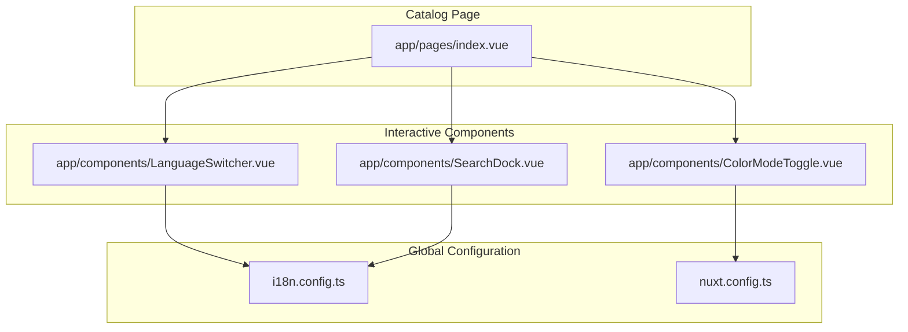
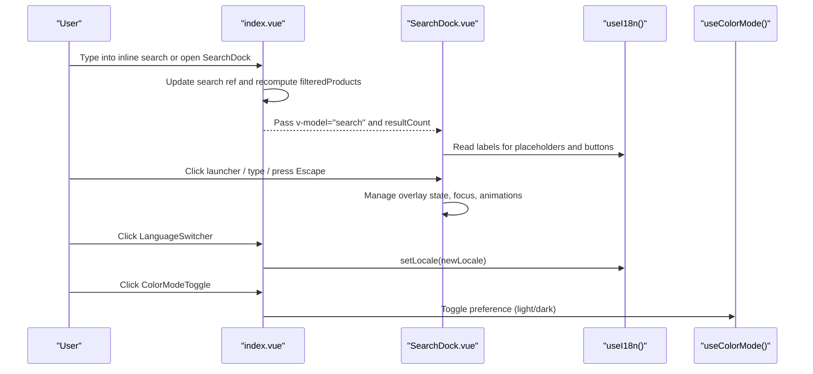
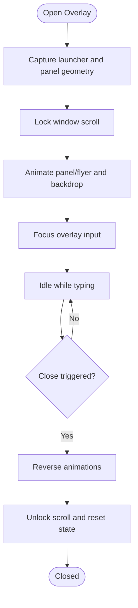
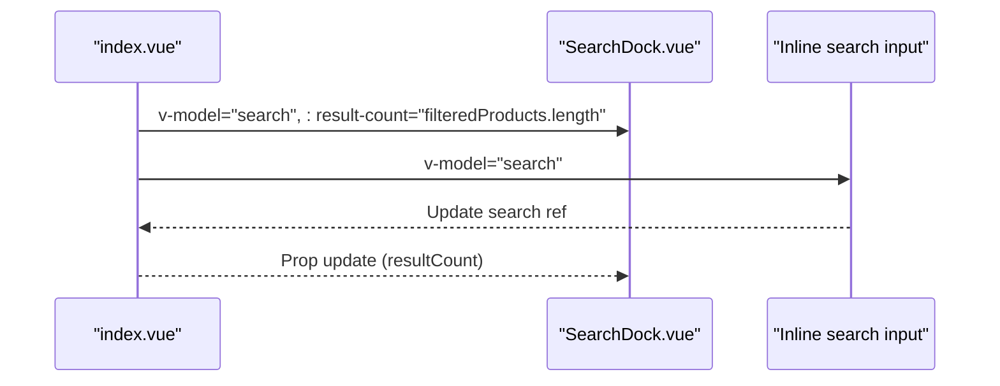
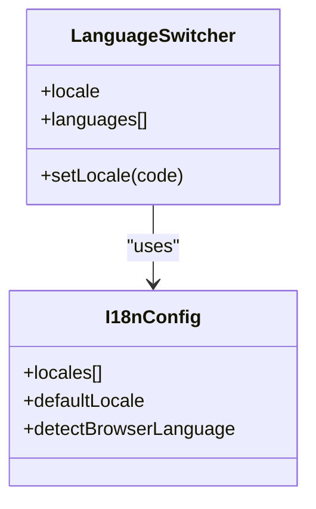
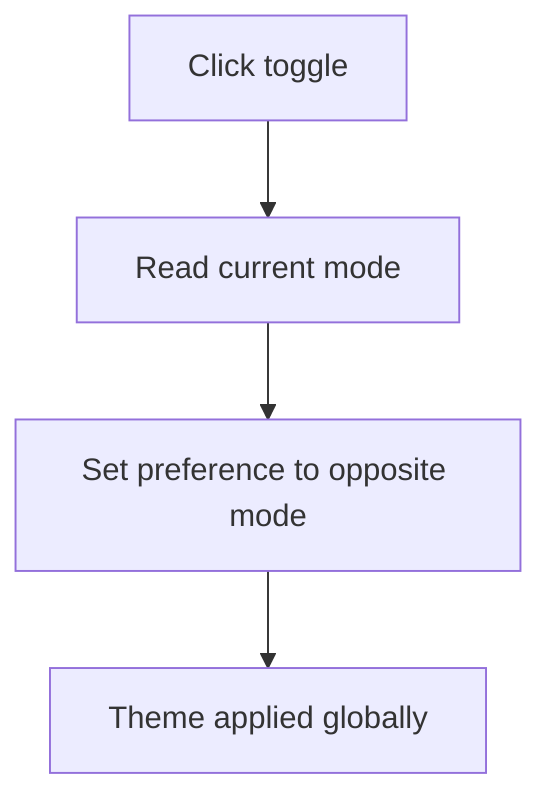
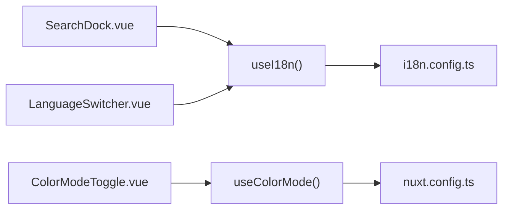

# Interactive Components

<cite>
**Referenced Files in This Document**
- [SearchDock.vue](file://app/components/SearchDock.vue)
- [LanguageSwitcher.vue](file://app/components/LanguageSwitcher.vue)
- [ColorModeToggle.vue](file://app/components/ColorModeToggle.vue)
- [index.vue](file://app/pages/index.vue)
- [i18n.config.ts](file://i18n.config.ts)
- [nuxt.config.ts](file://nuxt.config.ts)
</cite>

## Table of Contents
1. [Introduction](#introduction)
2. [Project Structure](#project-structure)
3. [Core Components](#core-components)
4. [Architecture Overview](#architecture-overview)
5. [Detailed Component Analysis](#detailed-component-analysis)
6. [Dependency Analysis](#dependency-analysis)
7. [Performance Considerations](#performance-considerations)
8. [Troubleshooting Guide](#troubleshooting-guide)
9. [Conclusion](#conclusion)

## Introduction
This document explains the interactive components that power product search, internationalization, and theme switching: SearchDock, LanguageSwitcher, and ColorModeToggle. It covers their reactive state, event handling, accessibility, integration with global application state, and performance techniques such as debouncing, lazy rendering, and efficient re-rendering strategies.

## Project Structure
The three interactive components live under `app/components`. They are used by the catalog page to provide a rich search experience, language switching, and dark/light mode toggling. Internationalization configuration is centralized, while Nuxt modules configure runtime behavior for color mode and i18n.

**Diagram sources**
- [index.vue:200-202](file://app/pages/index.vue#L200-L202)
- [index.vue:254-257](file://app/pages/index.vue#L254-L257)
- [i18n.config.ts:1-14](file://i18n.config.ts#L1-L14)
- [nuxt.config.ts:32-50](file://nuxt.config.ts#L32-L50)

**Section sources**
- [index.vue:200-202](file://app/pages/index.vue#L200-L202)
- [index.vue:254-257](file://app/pages/index.vue#L254-L257)
- [i18n.config.ts:1-14](file://i18n.config.ts#L1-L14)
- [nuxt.config.ts:32-50](file://nuxt.config.ts#L32-L50)

## Core Components
- SearchDock: A floating, animated search overlay with scroll-aware launcher visibility, keyboard navigation, focus management, and two-way bound query input.
- LanguageSwitcher: A compact toggle exposing available locales and updating the active locale through the i18n composable.
- ColorModeToggle: A client-only button that switches between light and dark themes using the color-mode module.

Key responsibilities:
- Reactive UI updates driven by refs and computed values.
- Event handling for clicks, keydown, scroll, resize, and transitions.
- Accessibility attributes (aria-label, aria-expanded, role, tabindex).
- Integration with global state: i18n locale and color mode preference.

**Section sources**
- [SearchDock.vue:1-446](file://app/components/SearchDock.vue#L1-L446)
- [LanguageSwitcher.vue:1-33](file://app/components/LanguageSwitcher.vue#L1-L33)
- [ColorModeToggle.vue:1-66](file://app/components/ColorModeToggle.vue#L1-L66)

## Architecture Overview
The catalog page owns the product list and search state. SearchDock binds to this state via v-model and displays a count of filtered results. LanguageSwitcher and ColorModeToggle interact with global Nuxt modules to change locale and theme respectively.

**Diagram sources**
- [index.vue:46-63](file://app/pages/index.vue#L46-L63)
- [index.vue:254-257](file://app/pages/index.vue#L254-L257)
- [SearchDock.vue:288-420](file://app/components/SearchDock.vue#L288-L420)
- [LanguageSwitcher.vue:1-33](file://app/components/LanguageSwitcher.vue#L1-L33)
- [ColorModeToggle.vue:1-66](file://app/components/ColorModeToggle.vue#L1-L66)

## Detailed Component Analysis

### SearchDock
SearchDock provides an animated, accessible search interface that morphs from a launcher icon into a full-width input panel. It integrates with the parent page’s search state and exposes a result count.

Key behaviors:
- Two-way binding for the search query via v-model.
- Scroll-aware launcher collapse and dock visibility.
- Overlay lifecycle with backdrop, content fade-in/out, and panel morph animation.
- Keyboard support: Escape to close, Tab trapping between input and close button, scroll keys blocked when overlay is open.
- Focus management: auto-focus on open, restore focus after close.
- Accessibility: dialog role, aria-modal, aria-expanded, aria-labels.

State model:
- Overlay state: mounted, active, closing, morphing.
- Visual state: backdrop opacity, content opacity, panel transform/radius/color, flyer transform/color.
- Interaction flags: launcher taken, suppress motion, scroll lock.

Event flow:
- Open: capture scene geometry, lock scroll, animate panel and flyer, focus input.
- Close: reverse animations, unlock scroll, reset state.
- Resize: recapture geometry to keep alignment correct.

**Diagram sources**
- [SearchDock.vue:288-420](file://app/components/SearchDock.vue#L288-L420)

Integration with catalog page:
- The page holds `search` and computes `filteredProducts`, passing both to SearchDock.
- The page also renders an inline search field bound to the same `search` ref, providing a fallback anchor for the morph animation.

**Diagram sources**
- [index.vue:254-257](file://app/pages/index.vue#L254-L257)
- [index.vue:263-292](file://app/pages/index.vue#L263-L292)

Accessibility highlights:
- Dialog semantics and modal behavior.
- Keyboard trap within overlay.
- Screen-reader-friendly labels and titles.

Performance considerations:
- Uses requestAnimationFrame and transitionend events to coordinate animations without layout thrashing.
- Avoids unnecessary DOM reads by caching geometry during morphs.
- Prevents scroll jank by blocking wheel/touchmove and restoring position.

Extension points:
- Add custom actions on Enter key inside the overlay.
- Integrate with a backend search API using a debounced watcher over the bound query.
- Customize animation timings and easing constants at the top of the script.

**Section sources**
- [SearchDock.vue:1-446](file://app/components/SearchDock.vue#L1-L446)
- [index.vue:254-257](file://app/pages/index.vue#L254-L257)
- [index.vue:263-292](file://app/pages/index.vue#L263-L292)

### LanguageSwitcher
LanguageSwitcher renders a pill-shaped control listing supported locales and updates the active locale through the i18n composable.

Responsibilities:
- Expose locale options defined locally.
- Reflect the current locale visually.
- Trigger locale changes via setLocale.

Configuration:
- Locales are configured in Nuxt config and messages in i18n.config.ts.
- Browser language detection is enabled with cookie persistence.

**Diagram sources**
- [LanguageSwitcher.vue:1-33](file://app/components/LanguageSwitcher.vue#L1-L33)
- [i18n.config.ts:1-14](file://i18n.config.ts#L1-L14)
- [nuxt.config.ts:37-50](file://nuxt.config.ts#L37-L50)

Persistence and detection:
- Nuxt i18n detects browser language and stores it in a cookie.
- The component itself does not persist preferences; the module handles storage and redirection.

Customization:
- Extend the languages array to add new locales.
- Style the pill container and buttons using Tailwind classes.

**Section sources**
- [LanguageSwitcher.vue:1-33](file://app/components/LanguageSwitcher.vue#L1-L33)
- [i18n.config.ts:1-14](file://i18n.config.ts#L1-L14)
- [nuxt.config.ts:37-50](file://nuxt.config.ts#L37-L50)

### ColorModeToggle
ColorModeToggle is a client-only button that toggles between light and dark themes using the color-mode module.

Responsibilities:
- Compute whether the current mode is dark.
- Toggle the preference to switch modes.
- Provide accessible labels and icons for sun/moon.

Behavior:
- Uses ClientOnly to avoid SSR mismatch.
- Relies on Nuxt color-mode module for system preference detection and persistence.

**Diagram sources**
- [ColorModeToggle.vue:1-66](file://app/components/ColorModeToggle.vue#L1-L66)
- [nuxt.config.ts:32-36](file://nuxt.config.ts#L32-L36)

Persistence and detection:
- Preference is stored by the color-mode module according to its configuration.
- System preference detection is enabled by default; fallback is configured.

Customization:
- Adjust colors, sizes, and hover effects via Tailwind classes.
- Replace icons with custom SVGs if needed.

**Section sources**
- [ColorModeToggle.vue:1-66](file://app/components/ColorModeToggle.vue#L1-L66)
- [nuxt.config.ts:32-36](file://nuxt.config.ts#L32-L36)

## Dependency Analysis
The components depend on Nuxt composables and modules:
- useI18n() for translations and locale management.
- useColorMode() for theme state.
- Global configuration in nuxt.config.ts and i18n.config.ts.

**Diagram sources**
- [SearchDock.vue:6](file://app/components/SearchDock.vue#L6)
- [LanguageSwitcher.vue:2](file://app/components/LanguageSwitcher.vue#L2)
- [ColorModeToggle.vue:2](file://app/components/ColorModeToggle.vue#L2)
- [i18n.config.ts:1-14](file://i18n.config.ts#L1-L14)
- [nuxt.config.ts:32-50](file://nuxt.config.ts#L32-L50)

**Section sources**
- [SearchDock.vue:6](file://app/components/SearchDock.vue#L6)
- [LanguageSwitcher.vue:2](file://app/components/LanguageSwitcher.vue#L2)
- [ColorModeToggle.vue:2](file://app/components/ColorModeToggle.vue#L2)
- [i18n.config.ts:1-14](file://i18n.config.ts#L1-L14)
- [nuxt.config.ts:32-50](file://nuxt.config.ts#L32-L50)

## Performance Considerations
- Debouncing search queries:
  - The catalog page filters products reactively in memory. For large datasets or remote search, wrap the search handler with a debounce utility to limit network requests and heavy computations.
  - Example approach: watch the bound search value and trigger a delayed function that calls your search API.
- Lazy loading:
  - Use ClientOnly for ColorModeToggle to prevent hydration mismatches and reduce initial bundle work.
  - Defer heavy operations until the overlay is opened (already done in SearchDock).
- Efficient re-rendering:
  - Keep derived data in computed properties (e.g., filteredProducts) to minimize recomputation.
  - Use CSS transforms and opacity for animations to leverage GPU acceleration and avoid layout thrashing.
- Scroll and event optimization:
  - SearchDock uses passive scroll listeners where appropriate and throttles logic with requestAnimationFrame.
  - Block scroll events only while the overlay is active to avoid jank.

[No sources needed since this section provides general guidance]

## Troubleshooting Guide
- SearchDock overlay does not close:
  - Ensure Escape key handling is active and no other listener prevents default behavior.
  - Verify that overlayMounted and overlayClosing states are properly reset after animations.
- Launcher misalignment during morph:
  - Confirm that the inline search element has the expected data-search-anchor attribute and is present in the DOM before opening.
  - Recapture geometry on resize to maintain alignment.
- Locale not changing:
  - Verify that setLocale is called and that the locale exists in the configured locales.
  - Check browser cookie settings if language detection/persistence is involved.
- Theme toggle not applying:
  - Ensure the component is rendered on the client (ClientOnly).
  - Validate color-mode configuration in Nuxt config and that the preference is being updated.

**Section sources**
- [SearchDock.vue:258-286](file://app/components/SearchDock.vue#L258-L286)
- [SearchDock.vue:429-445](file://app/components/SearchDock.vue#L429-L445)
- [LanguageSwitcher.vue:17-30](file://app/components/LanguageSwitcher.vue#L17-L30)
- [ColorModeToggle.vue:12-64](file://app/components/ColorModeToggle.vue#L12-L64)

## Conclusion
SearchDock, LanguageSwitcher, and ColorModeToggle form a cohesive set of interactive primitives that enhance user experience through responsive search, internationalization, and theme switching. Their implementation emphasizes accessibility, smooth animations, and efficient state management. By extending these patterns—adding debounced search handlers, integrating with global stores, and customizing styles—you can scale the application’s interactivity while maintaining performance and usability.