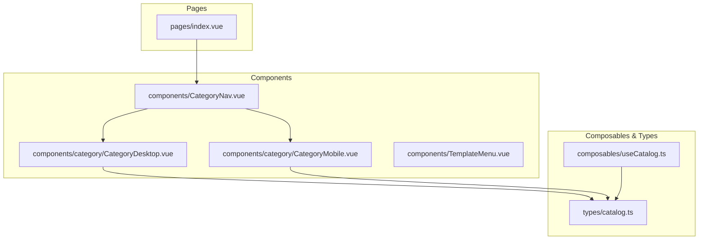
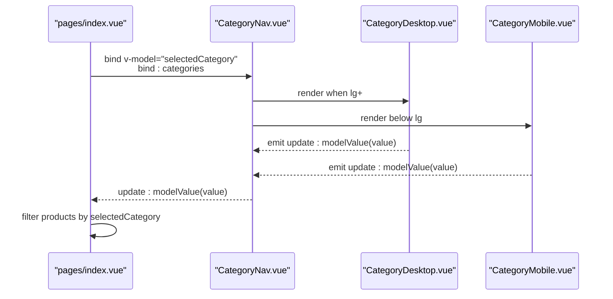
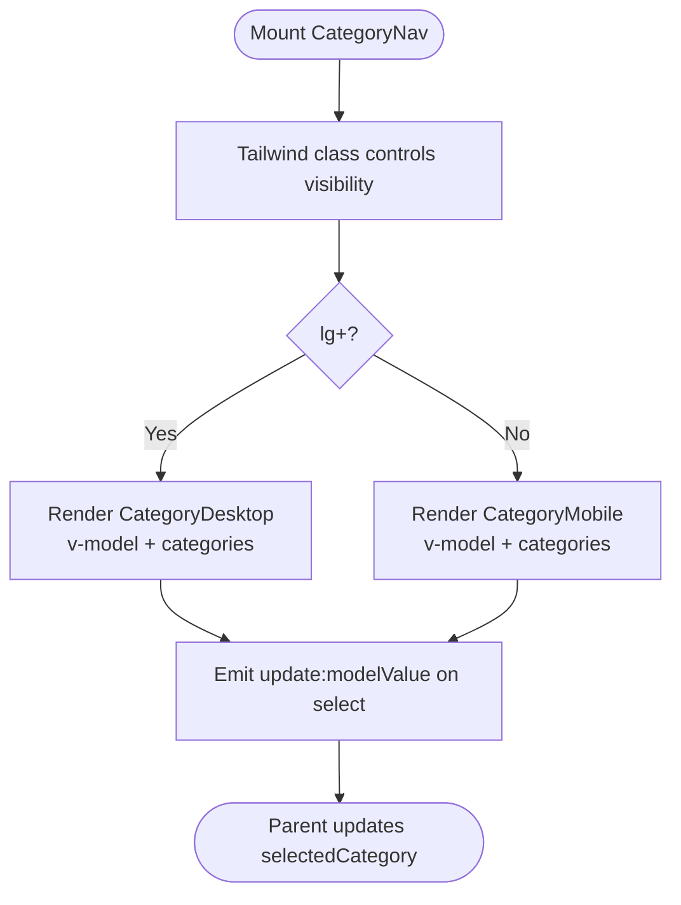
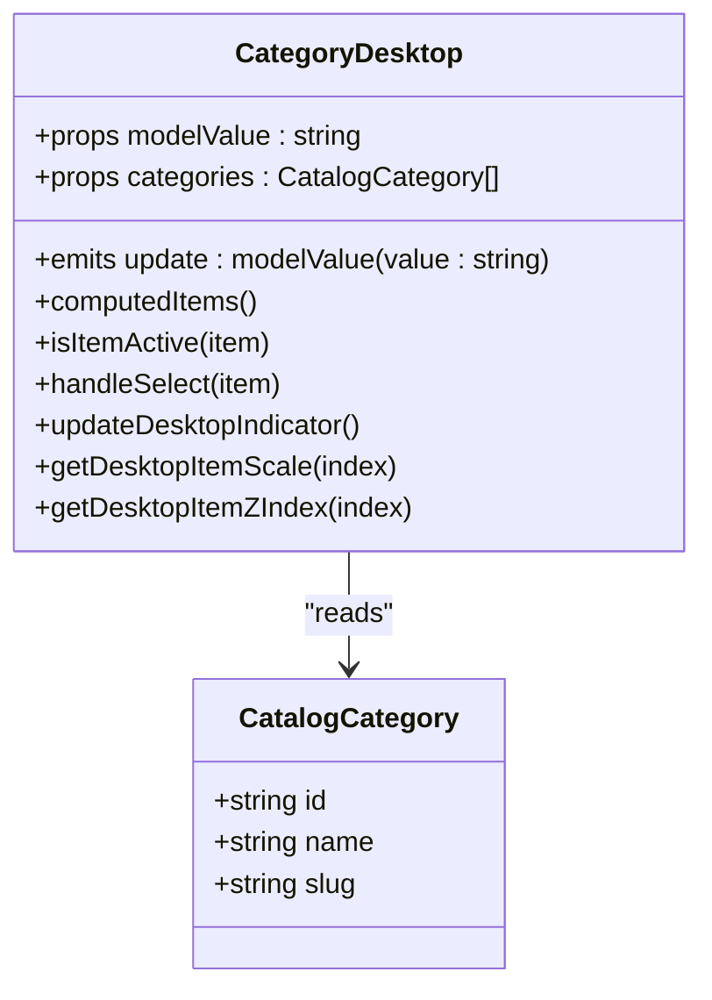
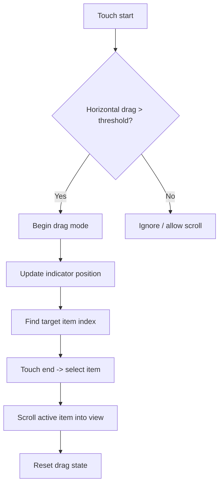
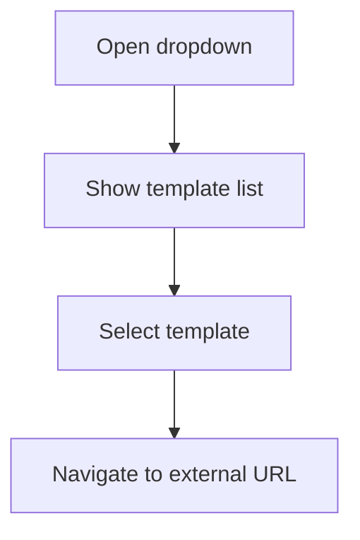
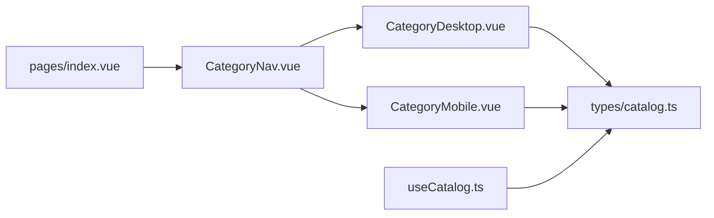

# Navigation Components

<cite>
**Referenced Files in This Document**
- [CategoryNav.vue](file://app/components/CategoryNav.vue)
- [CategoryDesktop.vue](file://app/components/category/CategoryDesktop.vue)
- [CategoryMobile.vue](file://app/components/category/CategoryMobile.vue)
- [TemplateMenu.vue](file://app/components/TemplateMenu.vue)
- [useCatalog.ts](file://app/composables/useCatalog.ts)
- [catalog.ts](file://app/types/catalog.ts)
- [index.vue](file://app/pages/index.vue)
</cite>

## Table of Contents
1. [Introduction](#introduction)
2. [Project Structure](#project-structure)
3. [Core Components](#core-components)
4. [Architecture Overview](#architecture-overview)
5. [Detailed Component Analysis](#detailed-component-analysis)
6. [Dependency Analysis](#dependency-analysis)
7. [Performance Considerations](#performance-considerations)
8. [Troubleshooting Guide](#troubleshooting-guide)
9. [Conclusion](#conclusion)

## Introduction
This document explains the navigation-related components that power category browsing and template selection: CategoryNav for responsive category navigation, CategoryDesktop and CategoryMobile for device-specific layouts, and TemplateMenu for selecting external templates. It covers component architecture, responsive design patterns, filtering logic, state management, accessibility, routing integration, performance considerations for large hierarchies, and caching strategies.

## Project Structure
The navigation system is composed of a small set of focused Vue components and composables:
- CategoryNav orchestrates responsive rendering by delegating to CategoryDesktop or CategoryMobile based on screen size.
- CategoryDesktop provides a vertical dock with magnification and drag-to-select interactions.
- CategoryMobile provides a horizontal bottom bar with touch-drag selection and scroll-aware visibility.
- TemplateMenu renders a dropdown menu for choosing external templates.
- useCatalog composes data fetching and mapping for categories and products.
- index.vue integrates CategoryNav into the product catalog page and manages selected category state.

**Diagram sources**
- [index.vue:244-257](file://app/pages/index.vue#L244-L257)
- [CategoryNav.vue:1-37](file://app/components/CategoryNav.vue#L1-L37)
- [CategoryDesktop.vue:1-611](file://app/components/category/CategoryDesktop.vue#L1-L611)
- [CategoryMobile.vue:1-577](file://app/components/category/CategoryMobile.vue#L1-L577)
- [TemplateMenu.vue:1-56](file://app/components/TemplateMenu.vue#L1-L56)
- [useCatalog.ts:1-61](file://app/composables/useCatalog.ts#L1-L61)
- [catalog.ts:1-31](file://app/types/catalog.ts#L1-L31)

**Section sources**
- [CategoryNav.vue:1-37](file://app/components/CategoryNav.vue#L1-L37)
- [CategoryDesktop.vue:1-611](file://app/components/category/CategoryDesktop.vue#L1-L611)
- [CategoryMobile.vue:1-577](file://app/components/category/CategoryMobile.vue#L1-L577)
- [TemplateMenu.vue:1-56](file://app/components/TemplateMenu.vue#L1-L56)
- [useCatalog.ts:1-61](file://app/composables/useCatalog.ts#L1-L61)
- [catalog.ts:1-31](file://app/types/catalog.ts#L1-L31)
- [index.vue:244-257](file://app/pages/index.vue#L244-L257)

## Core Components
- CategoryNav: A thin responsive wrapper that renders CategoryDesktop on large screens and CategoryMobile on smaller screens. It emits an update:modelValue event to propagate the selected category up to the parent.
- CategoryDesktop: Renders a vertical list of category buttons with mouse-driven magnification and drag-to-select behavior. It computes active items from props.modelValue and supports both slug and database id values.
- CategoryMobile: Renders a horizontally scrollable bottom bar with touch-drag selection, auto-scrolling to the active item, and scroll direction detection to hide/show the bar.
- TemplateMenu: Wraps a dropdown menu component to present a list of external template links.

Key responsibilities:
- State binding via v-model (modelValue) for selected category.
- Computed mapping between UI keys and backend category identifiers.
- Accessibility attributes (aria-label, role="tab", aria-selected).
- Responsive presentation without duplicating business logic.

**Section sources**
- [CategoryNav.vue:1-37](file://app/components/CategoryNav.vue#L1-L37)
- [CategoryDesktop.vue:1-611](file://app/components/category/CategoryDesktop.vue#L1-L611)
- [CategoryMobile.vue:1-577](file://app/components/category/CategoryMobile.vue#L1-L577)
- [TemplateMenu.vue:1-56](file://app/components/TemplateMenu.vue#L1-L56)

## Architecture Overview
The navigation architecture follows a unidirectional data flow:
- The parent page holds the selected category state (selectedCategory).
- CategoryNav receives modelValue and categories as props and forwards updates upward via update:modelValue.
- CategoryDesktop and CategoryMobile compute their visible items from the shared categories prop and emit selections back to the parent.
- The parent filters products based on selectedCategory and displays results.

**Diagram sources**
- [index.vue:244-257](file://app/pages/index.vue#L244-L257)
- [CategoryNav.vue:19-35](file://app/components/CategoryNav.vue#L19-L35)
- [CategoryDesktop.vue:80-91](file://app/components/category/CategoryDesktop.vue#L80-L91)
- [CategoryMobile.vue:80-91](file://app/components/category/CategoryMobile.vue#L80-L91)

## Detailed Component Analysis

### CategoryNav
Responsibilities:
- Delegates rendering to CategoryDesktop or CategoryMobile using Tailwind breakpoint classes.
- Forwards v-model bindings and emits update:modelValue events.

Responsive pattern:
- Uses hidden lg:flex to show desktop nav at lg and above.
- Mobile nav remains always mounted but visually controlled internally.

State contract:
- Props: modelValue (string), categories (CatalogCategory[]).
- Emits: update:modelValue(string).

Accessibility:
- Delegates accessible roles and labels to child components.

**Diagram sources**
- [CategoryNav.vue:19-35](file://app/components/CategoryNav.vue#L19-L35)

**Section sources**
- [CategoryNav.vue:1-37](file://app/components/CategoryNav.vue#L1-L37)

### CategoryDesktop
Responsibilities:
- Computes display items from CATEGORY_ITEMS and the categories prop.
- Determines active item based on modelValue (supports 'all', slug, or db id).
- Provides interactive features:
  - Mouse hover magnification effect.
  - Drag-to-select with velocity-based stretch.
  - Sliding selection indicator synchronized with active item.

Data mapping:
- Matches UI keys to database categories by slug or name; falls back to default names and slugs.
- Normalizes value to either database id or slug.

Interaction details:
- Click toggles to 'all' if already active; otherwise selects the clicked category.
- Dragging uses requestAnimationFrame for smooth updates and bounds clamping within the nav container.

Accessibility:
- aria-label on nav element.
- role="tab" and aria-selected on each button.
- Keyboard focus styles via focus-visible ring.

**Diagram sources**
- [CategoryDesktop.vue:1-611](file://app/components/category/CategoryDesktop.vue#L1-L611)
- [catalog.ts:26-30](file://app/types/catalog.ts#L26-L30)

**Section sources**
- [CategoryDesktop.vue:1-611](file://app/components/category/CategoryDesktop.vue#L1-L611)

### CategoryMobile
Responsibilities:
- Mirrors CategoryDesktop’s computed items and selection logic for mobile UX.
- Implements touch-drag selection with horizontal scrolling.
- Auto-scrolls the active item into view after selection.
- Hides/shows the bottom bar based on scroll direction near the top of the page.

Interaction details:
- Touch start/move/end handlers detect horizontal drag vs vertical scroll.
- Prevents default on touchmove while dragging to avoid page scroll interference.
- Uses ResizeObserver and window resize listeners to keep the indicator aligned.

Accessibility:
- aria-label on nav element.
- role="tab" and aria-selected on each button.
- Teleported to body for fixed positioning at the bottom.

**Diagram sources**
- [CategoryMobile.vue:175-248](file://app/components/category/CategoryMobile.vue#L175-L248)
- [CategoryMobile.vue:300-307](file://app/components/category/CategoryMobile.vue#L300-L307)

**Section sources**
- [CategoryMobile.vue:1-577](file://app/components/category/CategoryMobile.vue#L1-L577)

### TemplateMenu
Responsibilities:
- Presents a dropdown menu with predefined template options.
- Each option contains label, link, and optional checked state.

Behavior:
- Uses a dropdown component to manage open/close state and keyboard navigation.
- Links navigate externally to template sites.

Accessibility:
- Relies on underlying dropdown component for accessible behaviors.

**Diagram sources**
- [TemplateMenu.vue:1-56](file://app/components/TemplateMenu.vue#L1-L56)

**Section sources**
- [TemplateMenu.vue:1-56](file://app/components/TemplateMenu.vue#L1-L56)

## Dependency Analysis
- CategoryNav depends on CategoryDesktop and CategoryMobile for rendering.
- Both CategoryDesktop and CategoryMobile depend on CatalogCategory type and i18n for labels.
- useCatalog provides fetchCategories which returns CatalogCategory[], used by pages and potentially consumed by navigation components through props.
- index.vue binds selectedCategory to CategoryNav and filters products accordingly.

**Diagram sources**
- [index.vue:244-257](file://app/pages/index.vue#L244-L257)
- [CategoryNav.vue:1-37](file://app/components/CategoryNav.vue#L1-L37)
- [CategoryDesktop.vue:1-611](file://app/components/category/CategoryDesktop.vue#L1-L611)
- [CategoryMobile.vue:1-577](file://app/components/category/CategoryMobile.vue#L1-L577)
- [useCatalog.ts:1-61](file://app/composables/useCatalog.ts#L1-L61)
- [catalog.ts:1-31](file://app/types/catalog.ts#L1-L31)

**Section sources**
- [index.vue:244-257](file://app/pages/index.vue#L244-L257)
- [CategoryNav.vue:1-37](file://app/components/CategoryNav.vue#L1-L37)
- [CategoryDesktop.vue:1-611](file://app/components/category/CategoryDesktop.vue#L1-L611)
- [CategoryMobile.vue:1-577](file://app/components/category/CategoryMobile.vue#L1-L577)
- [useCatalog.ts:1-61](file://app/composables/useCatalog.ts#L1-L61)
- [catalog.ts:1-31](file://app/types/catalog.ts#L1-L31)

## Performance Considerations
- Rendering strategy:
  - CategoryNav conditionally shows only one layout at a time (desktop or mobile) using CSS classes, minimizing DOM overhead.
  - CategoryMobile uses Teleport to render once at the document root, avoiding nested layout reflows.
- Interaction performance:
  - Desktop magnification and drag use requestAnimationFrame to batch visual updates.
  - Velocity-based stretch reduces heavy computations during fast drags.
- Layout stability:
  - ResizeObserver and font loading hooks ensure the sliding indicator recalculates positions after content changes.
- Filtering efficiency:
  - Parent page filters products in memory using computed properties; consider pagination or virtualization for very large catalogs.
- Caching strategies:
  - Cache categories and products in the parent page state to avoid repeated network calls.
  - Optionally cache fetched data in a store or use Nuxt’s built-in caching mechanisms for API responses.
- Memory management:
  - Ensure event listeners and observers are removed on component unmount to prevent leaks.

[No sources needed since this section provides general guidance]

## Troubleshooting Guide
Common issues and resolutions:
- Selected category not updating:
  - Verify that CategoryNav emits update:modelValue and the parent listens via v-model.
  - Confirm that the parent’s selectedCategory is reactive and bound correctly.
- Indicator misalignment:
  - Ensure ResizeObserver and window resize listeners are attached and updated after fonts load.
  - Check that refs for items are populated before computing indicator positions.
- Touch drag conflicts:
  - If vertical scrolling interferes with horizontal drag, verify that touchmove is prevented only during drag mode.
- Accessibility concerns:
  - Ensure aria-label, role="tab", and aria-selected are present on navigation elements.
  - Test keyboard navigation and focus rings.

**Section sources**
- [CategoryDesktop.vue:379-422](file://app/components/category/CategoryDesktop.vue#L379-L422)
- [CategoryMobile.vue:343-402](file://app/components/category/CategoryMobile.vue#L343-L402)
- [CategoryNav.vue:19-35](file://app/components/CategoryNav.vue#L19-L35)

## Conclusion
The navigation system cleanly separates responsive concerns while sharing core logic across desktop and mobile implementations. CategoryNav acts as a responsive facade, CategoryDesktop and CategoryMobile provide platform-appropriate interactions, and TemplateMenu offers a simple way to navigate to external templates. The architecture leverages reactive state, computed mappings, and accessibility attributes to deliver a robust user experience. For large catalogs, consider pagination, virtualization, and caching to maintain performance.

[No sources needed since this section summarizes without analyzing specific files]