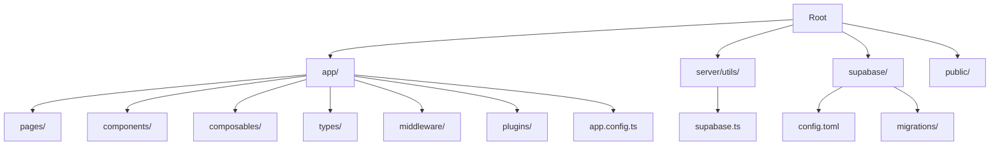
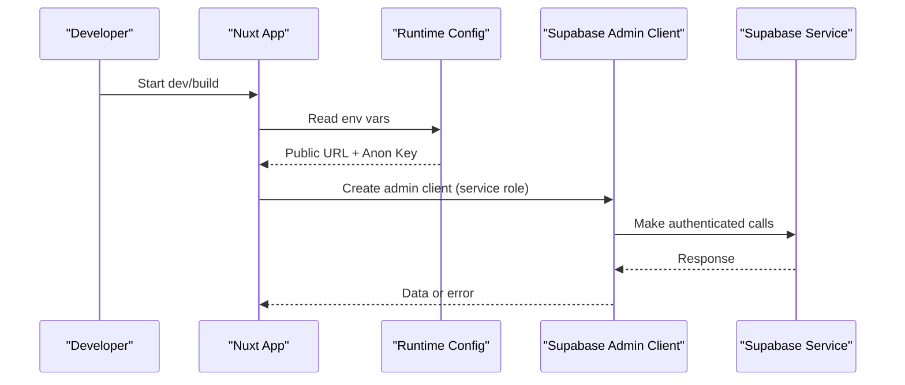
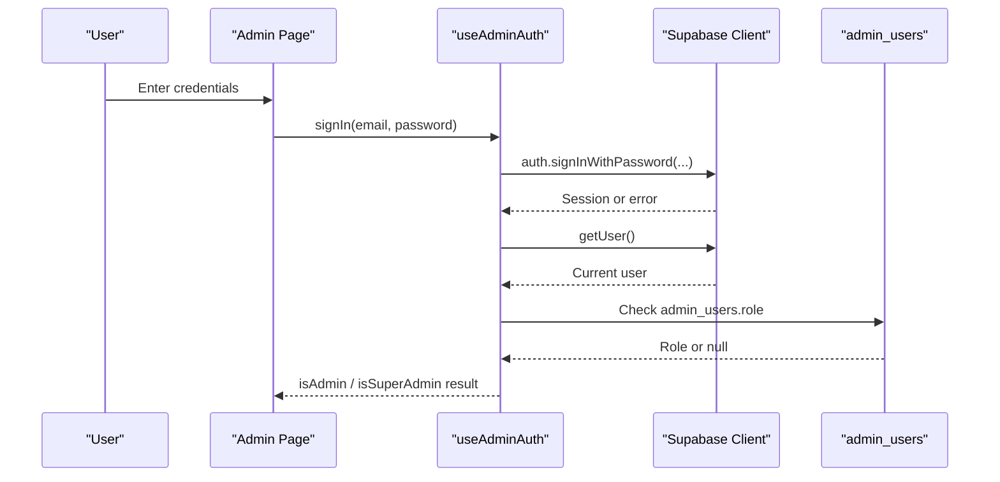
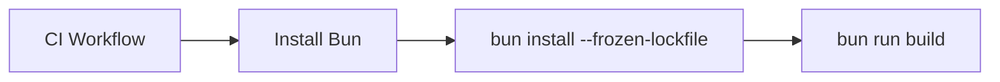

# Getting Started

<cite>
**Referenced Files in This Document**
- [README.md](file://README.md)
- [package.json](file://package.json)
- [nuxt.config.ts](file://nuxt.config.ts)
- [i18n.config.ts](file://i18n.config.ts)
- [app/app.config.ts](file://app/app.config.ts)
- [server/utils/supabase.ts](file://server/utils/supabase.ts)
- [supabase/config.toml](file://supabase/config.toml)
- [supabase/migrations/20260922_000001_create_catalog_schema.sql](file://supabase/migrations/20260922_000001_create_catalog_schema.sql)
- [app/composables/useAdminAuth.ts](file://app/composables/useAdminAuth.ts)
- [.github/workflows/ci.yml](file://.github/workflows/ci.yml)
</cite>

## Table of Contents
1. [Introduction](#introduction)
2. [Project Structure](#project-structure)
3. [Core Components](#core-components)
4. [Architecture Overview](#architecture-overview)
5. [Detailed Component Analysis](#detailed-component-analysis)
6. [Dependency Analysis](#dependency-analysis)
7. [Performance Considerations](#performance-considerations)
8. [Troubleshooting Guide](#troubleshooting-guide)
9. [Conclusion](#conclusion)
10. [Appendices](#appendices)

## Introduction
This guide helps you set up and run the Raccoon-Gear-Bin application quickly using Bun. You will install dependencies, configure environment variables for Supabase, start the development server, build for production, and preview the build locally. It also explains the high-level project structure so you can find your way around the codebase with confidence.

## Project Structure
At a glance:
- app/: Nuxt application source (pages, components, composables, types, middleware, plugins, configuration)
- server/utils/: Server-side utilities (Supabase admin client)
- supabase/: Local Supabase configuration and migrations
- public/: Static assets
- Configuration files at the root define modules, runtime config, i18n, and UI settings

[No sources needed since this diagram shows conceptual structure]

## Core Components
- Package scripts: Development, build, generate, and preview commands are defined in package.json.
- Nuxt configuration: Modules, runtime config, UI theme, color mode, and i18n are configured in nuxt.config.ts.
- Internationalization: Locale messages and defaults are defined in i18n.config.ts.
- UI configuration: Button/input/select styling is set in app/app.config.ts.
- Supabase integration: Runtime config exposes public and service keys; server utility creates an admin client.

Key points for setup:
- Use Bun to install dependencies and run scripts.
- Provide environment variables for Supabase URLs and keys.
- The dev server runs on localhost:3000 by default.

**Section sources**
- [package.json:5-10](file://package.json#L5-L10)
- [nuxt.config.ts:9-26](file://nuxt.config.ts#L9-L26)
- [i18n.config.ts:1-14](file://i18n.config.ts#L1-L14)
- [app/app.config.ts:1-20](file://app/app.config.ts#L1-L20)
- [server/utils/supabase.ts:3-19](file://server/utils/supabase.ts#L3-L19)

## Architecture Overview
The application uses Nuxt with Supabase for authentication and data. Environment-driven configuration controls both client-facing and server-side access to Supabase.

```mermaid
graph TB
subgraph "Client"
UI["Nuxt Pages & Components"]
I18N["i18n Config"]
end
subgraph "Server"
API["Runtime Config"]
Admin["Supabase Admin Client"]
end
subgraph "Backend"
Auth["Supabase Auth"]
DB["PostgreSQL"]
end
UI --> API
UI --> I18N
API --> Admin
Admin --> Auth
Admin --> DB
```

**Diagram sources**
- [nuxt.config.ts:9-26](file://nuxt.config.ts#L9-L26)
- [server/utils/supabase.ts:3-19](file://server/utils/supabase.ts#L3-L19)

## Detailed Component Analysis

### Environment Setup and Supabase Integration
- Required environment variables:
  - NUXT_PUBLIC_SUPABASE_URL: Public Supabase URL used by the client.
  - NUXT_PUBLIC_SUPABASE_ANON_KEY: Anonymous key for client-side requests.
  - SUPABASE_SERVICE_ROLE_KEY: Service role key for server-side privileged operations.
- Where they are consumed:
  - nuxt.config.ts reads these values into runtimeConfig and Supabase module options.
  - server/utils/supabase.ts builds an admin client using the service role key and URL.
- Local Supabase:
  - supabase/config.toml defines local ports for API, database, and Studio.
  - Migrations under supabase/migrations create the catalog schema and tables.

**Diagram sources**
- [nuxt.config.ts:9-26](file://nuxt.config.ts#L9-L26)
- [server/utils/supabase.ts:3-19](file://server/utils/supabase.ts#L3-L19)

**Section sources**
- [nuxt.config.ts:9-26](file://nuxt.config.ts#L9-L26)
- [server/utils/supabase.ts:3-19](file://server/utils/supabase.ts#L3-L19)
- [supabase/config.toml:1-32](file://supabase/config.toml#L1-L32)
- [supabase/migrations/20260922_000001_create_catalog_schema.sql:1-113](file://supabase/migrations/20260922_000001_create_catalog_schema.sql#L1-L113)

### Authentication Flow (Admin)
- The admin auth composable provides sign-in, sign-out, and role checks against the admin_users table.
- It uses the Supabase client provided by the Nuxt module and validates roles server-side via the admin client when necessary.

**Diagram sources**
- [app/composables/useAdminAuth.ts:16-64](file://app/composables/useAdminAuth.ts#L16-L64)

**Section sources**
- [app/composables/useAdminAuth.ts:1-79](file://app/composables/useAdminAuth.ts#L1-L79)

### Internationalization and UI
- i18n is configured with English and Khmer locales, defaulting to English.
- UI theme colors and component styles are customized via app/app.config.ts.

**Section sources**
- [i18n.config.ts:1-14](file://i18n.config.ts#L1-L14)
- [app/app.config.ts:1-20](file://app/app.config.ts#L1-L20)

## Dependency Analysis
- Build tooling and scripts rely on Nuxt and Bun.
- CI installs Bun, then runs bun install and bun run build.

**Diagram sources**
- [.github/workflows/ci.yml:16-25](file://.github/workflows/ci.yml#L16-L25)

**Section sources**
- [.github/workflows/ci.yml:1-26](file://.github/workflows/ci.yml#L1-L26)
- [package.json:5-10](file://package.json#L5-L10)

## Performance Considerations
- Keep environment variables minimal and secure; avoid committing secrets.
- Use the Supabase admin client only where server-side privileges are required.
- Prefer static generation or pre-rendering where possible to reduce runtime overhead.

[No sources needed since this section provides general guidance]

## Troubleshooting Guide
Common issues and resolutions:
- Missing environment variables:
  - Symptom: Errors indicating missing Supabase configuration during build or runtime.
  - Resolution: Ensure NUXT_PUBLIC_SUPABASE_URL, NUXT_PUBLIC_SUPABASE_ANON_KEY, and SUPABASE_SERVICE_ROLE_KEY are set before running dev or build.
- Port conflicts:
  - Symptom: Dev server fails to start or Supabase services cannot bind.
  - Resolution: Verify that ports 3000 (dev), 54321 (API), 54322 (DB), and 54323 (Studio) are free or adjust supabase/config.toml accordingly.
- Database schema not applied:
  - Symptom: Tables like categories, products, product_translations, product_images, or admin_users are missing.
  - Resolution: Apply migrations from supabase/migrations to your Supabase project or local instance.
- Admin login fails:
  - Symptom: Sign-in errors or unauthorized responses.
  - Resolution: Confirm Supabase Auth is enabled and that the user exists in admin_users with a valid role.

Verification steps:
- Install dependencies:
  - Command: bun install
  - Expected: Dependencies installed without errors.
- Start development server:
  - Command: bun run dev
  - Expected: Server starts and serves http://localhost:3000.
- Build for production:
  - Command: bun run build
  - Expected: Build completes successfully.
- Preview production build:
  - Command: bun run preview
  - Expected: Preview server starts serving the built app.

**Section sources**
- [README.md:5-33](file://README.md#L5-L33)
- [package.json:5-10](file://package.json#L5-L10)
- [supabase/config.toml:1-32](file://supabase/config.toml#L1-L32)
- [supabase/migrations/20260922_000001_create_catalog_schema.sql:1-113](file://supabase/migrations/20260922_000001_create_catalog_schema.sql#L1-L113)
- [server/utils/supabase.ts:3-19](file://server/utils/supabase.ts#L3-L19)

## Conclusion
You now have the essentials to set up, run, and verify Raccoon-Gear-Bin using Bun. Configure Supabase environment variables, start the dev server, build for production, and preview locally. Use the troubleshooting tips if you encounter common setup issues, and refer to the architecture overview to understand how client, server, and Supabase interact.

## Appendices

### Quick Commands Reference
- Install dependencies: bun install
- Start development server: bun run dev
- Build for production: bun run build
- Preview production build: bun run preview

**Section sources**
- [README.md:5-33](file://README.md#L5-L33)
- [package.json:5-10](file://package.json#L5-L10)