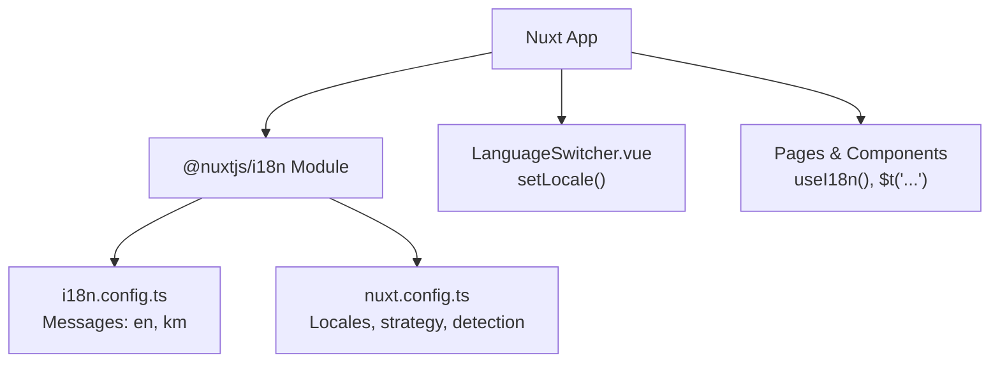
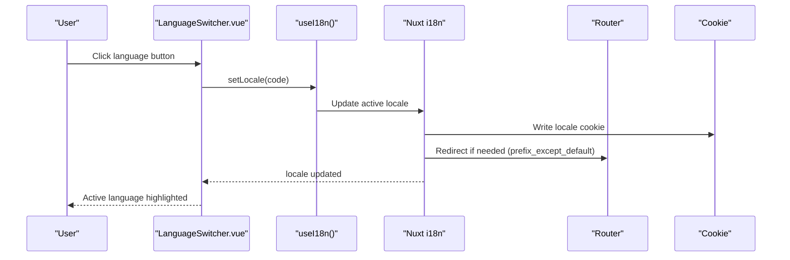
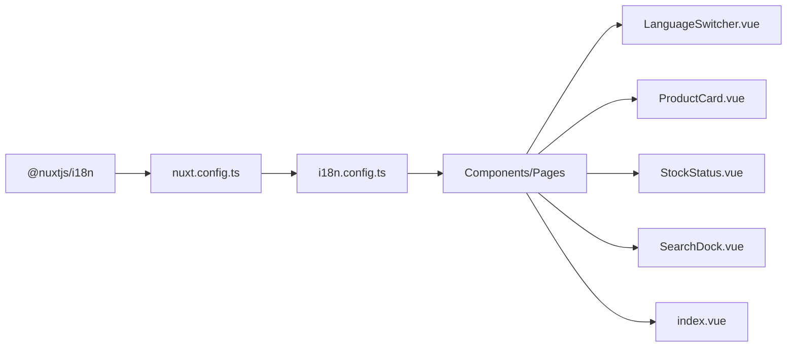

# Internationalization (i18n)

<cite>
**Referenced Files in This Document**
- [nuxt.config.ts](file://nuxt.config.ts)
- [i18n.config.ts](file://i18n.config.ts)
- [LanguageSwitcher.vue](file://app/components/LanguageSwitcher.vue)
- [index.vue](file://app/pages/index.vue)
- [ProductCard.vue](file://app/components/ProductCard.vue)
- [StockStatus.vue](file://app/components/StockStatus.vue)
- [SearchDock.vue](file://app/components/SearchDock.vue)
- [package.json](file://package.json)
</cite>

## Table of Contents
1. Introduction
2. Project Structure
3. Core Components
4. Architecture Overview
5. Detailed Component Analysis
6. Dependency Analysis
7. Performance Considerations
8. Troubleshooting Guide
9. Conclusion
10. Appendices

## Introduction
This document explains the internationalization (i18n) system for multi-language support in the application. It covers configuration for English and Khmer, locale detection, dynamic language switching, translation key management, message formatting, pluralization rules, date/time and number formatting considerations, RTL support guidance, maintenance practices, performance optimization, and testing strategies.

## Project Structure
The i18n setup is centered around Nuxt’s i18n module with a dedicated configuration file that holds messages for each supported locale. The UI integrates translations via the $t function and provides a LanguageSwitcher component to change the active locale at runtime.

**Diagram sources**
- [nuxt.config.ts:37-50](file://nuxt.config.ts#L37-L50)
- [i18n.config.ts:1-13](file://i18n.config.ts#L1-L13)
- [LanguageSwitcher.vue:1-32](file://app/components/LanguageSwitcher.vue#L1-L32)
- [index.vue:24-24](file://app/pages/index.vue#L24-L24)

**Section sources**
- [nuxt.config.ts:37-50](file://nuxt.config.ts#L37-L50)
- [i18n.config.ts:1-13](file://i18n.config.ts#L1-L13)

## Core Components
- i18n configuration: Defines default/fallback locales and per-locale messages for English and Khmer.
- Locale detection: Browser language detection with cookie persistence and root redirect strategy.
- Dynamic switching: LanguageSwitcher uses useI18n to read and set the current locale.
- Translation usage: Pages and components call useI18n or $t to render localized strings.

Key behaviors:
- Default locale is English; fallback is also English.
- Strategy prefix_except_default ensures URLs reflect the non-default locale.
- detectBrowserLanguage reads the browser language, stores it in a cookie, and redirects on root navigation.

**Section sources**
- [i18n.config.ts:1-13](file://i18n.config.ts#L1-L13)
- [nuxt.config.ts:37-50](file://nuxt.config.ts#L37-L50)
- [LanguageSwitcher.vue:1-32](file://app/components/LanguageSwitcher.vue#L1-L32)

## Architecture Overview
The i18n architecture combines Nuxt’s module configuration with a centralized message store and reactive locale state across components.

**Diagram sources**
- [LanguageSwitcher.vue:1-32](file://app/components/LanguageSwitcher.vue#L1-L32)
- [nuxt.config.ts:37-50](file://nuxt.config.ts#L37-L50)

## Detailed Component Analysis

### i18n Configuration and Messages
- Default and fallback locales are set to English.
- Messages include UI labels, catalog terms, admin actions, and error messages for both English and Khmer.
- Keys are flat and consistent across locales to ensure parity.

Practical implications:
- Any missing key will fall back to English.
- Adding a new locale requires adding a matching object under messages with all keys.

**Section sources**
- [i18n.config.ts:1-13](file://i18n.config.ts#L1-L13)

### Locale Detection and Routing
- Browser language detection enabled with cookie storage and root redirect.
- Strategy prefix_except_default prefixes non-default locales in URLs while keeping the default locale unprefixed.

Operational notes:
- On first visit, the app detects the browser language and sets it accordingly.
- Subsequent visits use the stored cookie to restore the preferred locale.

**Section sources**
- [nuxt.config.ts:37-50](file://nuxt.config.ts#L37-L50)

### LanguageSwitcher Component
- Reads current locale and exposes setLocale to switch languages.
- Renders buttons for English and Khmer; highlights the active language.
- Uses $t for accessible label text.

Integration points:
- Reactive updates propagate to all components using useI18n.
- Changes persist via cookie and can trigger routing adjustments based on strategy.

**Section sources**
- [LanguageSwitcher.vue:1-32](file://app/components/LanguageSwitcher.vue#L1-L32)

### Translation Usage Across the App
- Pages and components import/use useI18n to access t() and locale.
- Examples include product cards, stock status, search dock, and main index page.
- Data-driven content (product/category names) selects translations by current locale with fallbacks.

Patterns observed:
- UI strings are translated via $t or t().
- Content from the database is mapped to the current locale, falling back to English when necessary.

**Section sources**
- [ProductCard.vue:1-68](file://app/components/ProductCard.vue#L1-L68)
- [StockStatus.vue:1-20](file://app/components/StockStatus.vue#L1-L20)
- [SearchDock.vue:1-628](file://app/components/SearchDock.vue#L1-L628)
- [index.vue:79-99](file://app/pages/index.vue#L79-L99)
- [index.vue:101-120](file://app/pages/index.vue#L101-L120)

### Message Formatting and Pluralization
- Message formatting supports parameter interpolation (e.g., placeholders in confirmation prompts).
- Pluralization is handled inline in templates where counts differ between singular and plural forms.

Guidance:
- Use interpolation for dynamic values within messages.
- Keep plural logic simple in templates; for complex cases, consider computed properties or helper functions.

**Section sources**
- [index.vue:447-452](file://app/pages/index.vue#L447-L452)
- [SearchDock.vue:588-594](file://app/components/SearchDock.vue#L588-L594)

### Date/Time and Number Formatting
- No explicit date/time formatters are used in the analyzed files.
- Numbers such as prices are formatted directly in templates using standard JavaScript methods.

Recommendations:
- For locale-aware number/date formatting, integrate Intl APIs or a library like @internationalized/number.
- Ensure currency symbols and decimal separators match the active locale.

[No sources needed since this section provides general guidance]

### RTL Support Considerations
- The current UI does not implement explicit RTL toggling.
- When adding RTL-capable languages, ensure CSS supports bidirectional layout and test alignment, icons, and spacing.

Best practices:
- Use logical properties (start/end) instead of left/right where possible.
- Provide mirrored assets for icons and graphics when necessary.

[No sources needed since this section provides general guidance]

## Dependency Analysis
The i18n stack depends on Nuxt’s i18n module and Vue’s reactivity model. Components consume translations through composables and template helpers.

**Diagram sources**
- [package.json:12-24](file://package.json#L12-L24)
- [nuxt.config.ts:37-50](file://nuxt.config.ts#L37-L50)
- [i18n.config.ts:1-13](file://i18n.config.ts#L1-L13)
- [LanguageSwitcher.vue:1-32](file://app/components/LanguageSwitcher.vue#L1-L32)
- [ProductCard.vue:1-68](file://app/components/ProductCard.vue#L1-L68)
- [StockStatus.vue:1-20](file://app/components/StockStatus.vue#L1-L20)
- [SearchDock.vue:1-628](file://app/components/SearchDock.vue#L1-L628)
- [index.vue:79-99](file://app/pages/index.vue#L79-L99)

**Section sources**
- [package.json:12-24](file://package.json#L12-L24)
- [nuxt.config.ts:37-50](file://nuxt.config.ts#L37-L50)

## Performance Considerations
- Centralized messages: All translations are loaded into a single configuration file. For very large catalogs, consider splitting messages by feature or lazy-loading modules to reduce initial bundle size.
- Avoid heavy computations in templates: Precompute localized strings or derived data in composables or computed properties.
- Minimize re-renders: Keep locale changes scoped; avoid unnecessary watchers on locale unless required.
- Database-driven content: Select only the needed locale fields and fall back efficiently to reduce payload size.

[No sources needed since this section provides general guidance]

## Troubleshooting Guide
Common issues and resolutions:
- Missing translation keys: Ensure every key exists in all locales; otherwise, the fallback locale will be used.
- Incorrect locale selection: Verify detectBrowserLanguage settings and cookie name; confirm strategy matches URL expectations.
- UI not updating after switch: Confirm components use useI18n or $t and that setLocale is called correctly.
- Data not localized: Check mapping logic to select the correct locale from database responses and provide fallbacks.

Verification steps:
- Open browser dev tools and inspect cookies for the locale key.
- Change language via LanguageSwitcher and verify URL reflects the strategy.
- Inspect rendered text to ensure correct locale is applied.

**Section sources**
- [nuxt.config.ts:37-50](file://nuxt.config.ts#L37-L50)
- [LanguageSwitcher.vue:1-32](file://app/components/LanguageSwitcher.vue#L1-L32)
- [index.vue:79-99](file://app/pages/index.vue#L79-L99)

## Conclusion
The application implements a robust i18n system using Nuxt’s i18n module with English and Khmer support. Locale detection persists user preferences, and dynamic switching is provided via a compact LanguageSwitcher component. Translations are centralized and consumed consistently across components. Future enhancements can include advanced number/date formatting, RTL support, and modular message loading for scalability.

[No sources needed since this section summarizes without analyzing specific files]

## Appendices

### How to Add a New Language
Steps:
- Add the new locale code and display name to the locales array in the Nuxt configuration.
- Add a new messages object for the locale in the i18n configuration with all required keys.
- Update any hardcoded language lists (e.g., in LanguageSwitcher) to include the new language.
- Test locale detection, switching, and rendering across pages and components.

**Section sources**
- [nuxt.config.ts:37-50](file://nuxt.config.ts#L37-L50)
- [i18n.config.ts:1-13](file://i18n.config.ts#L1-L13)
- [LanguageSwitcher.vue:1-32](file://app/components/LanguageSwitcher.vue#L1-L32)

### Guidelines for Maintaining Translation Files
- Maintain key parity across locales to prevent fallback surprises.
- Use descriptive, stable keys grouped by feature or domain.
- Avoid embedding dynamic values in keys; use interpolation instead.
- Review and update translations regularly, especially for error messages and user-facing copy.

[No sources needed since this section provides general guidance]

### Testing Approaches for Internationalized Components
- Unit tests: Assert that components render expected keys and handle missing keys gracefully.
- Integration tests: Simulate locale changes and verify UI updates and URL behavior according to strategy.
- Visual regression: Compare screenshots across locales to catch layout shifts, especially for longer text or different scripts.
- Accessibility checks: Validate aria-labels and titles are localized.

[No sources needed since this section provides general guidance]