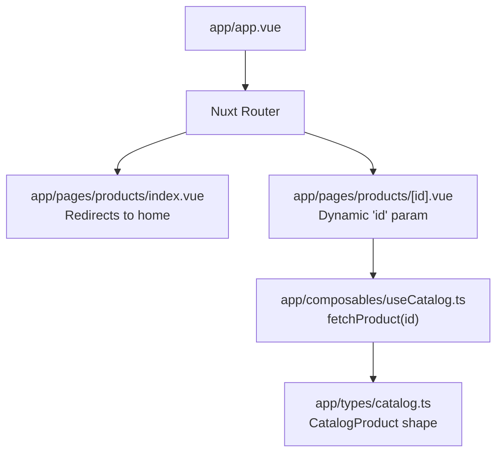
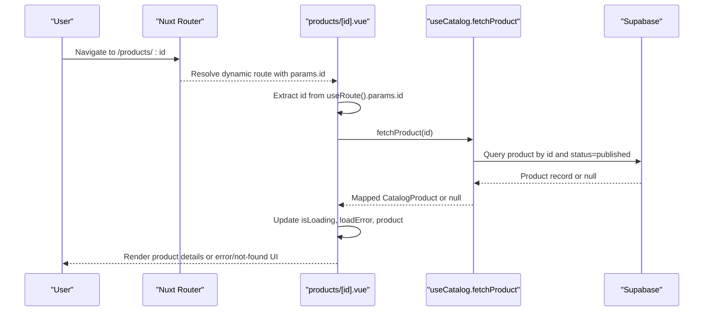
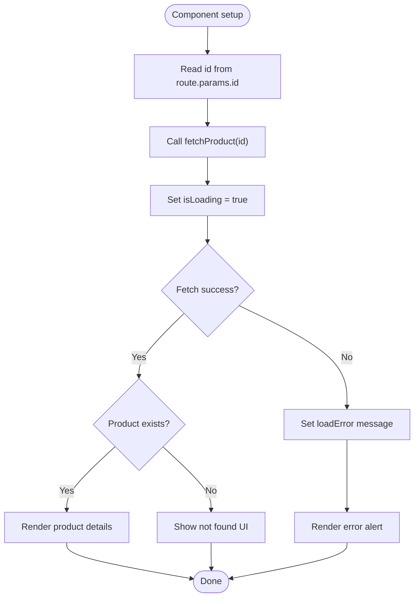
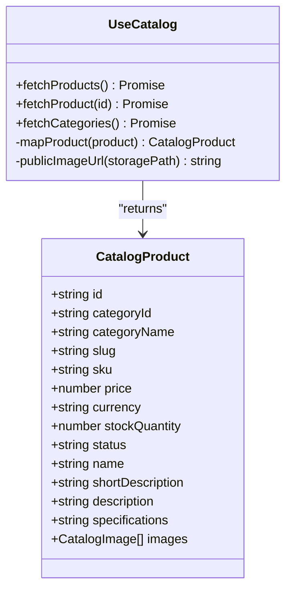
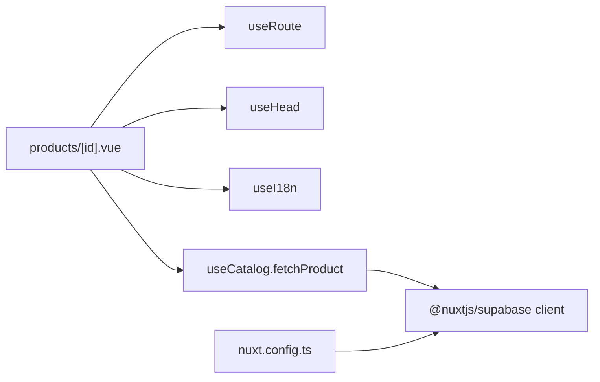

# Dynamic Routing & Parameters

<cite>
**Referenced Files in This Document**
- [products/[id].vue](file://app/pages/products/[id].vue)
- [products/index.vue](file://app/pages/products/index.vue)
- [useCatalog.ts](file://app/composables/useCatalog.ts)
- [catalog.ts](file://app/types/catalog.ts)
- [product.ts](file://app/types/product.ts)
- [nuxt.config.ts](file://nuxt.config.ts)
- [app.vue](file://app/app.vue)
</cite>

## Table of Contents
1. [Introduction](#introduction)
2. [Project Structure](#project-structure)
3. [Core Components](#core-components)
4. [Architecture Overview](#architecture-overview)
5. [Detailed Component Analysis](#detailed-component-analysis)
6. [Dependency Analysis](#dependency-analysis)
7. [Performance Considerations](#performance-considerations)
8. [Troubleshooting Guide](#troubleshooting-guide)
9. [Conclusion](#conclusion)

## Introduction
This document explains how dynamic routing and parameter handling are implemented for product detail pages, focusing on the products/[id].vue route. It covers:
- How the page extracts and validates the dynamic id parameter
- How data is fetched and displayed with loading and error states
- How to navigate programmatically using Nuxt’s composables
- Best practices for URL structure, SEO-friendly slugs, and consistent routing patterns
- Strategies for loading states, error boundaries, and caching frequently accessed product details

## Project Structure
The routing surface relevant to this topic includes:
- A dynamic route file for product details: app/pages/products/[id].vue
- A redirect entry for the products index: app/pages/products/index.vue
- The root layout that mounts pages: app/app.vue
- Configuration for page transitions and modules: nuxt.config.ts

**Diagram sources**
- [app.vue:1-3](file://app/app.vue#L1-L3)
- [products/index.vue:1-8](file://app/pages/products/index.vue#L1-L8)
- [products/[id].vue:1-47](file://app/pages/products/[id].vue#L1-L47)
- [useCatalog.ts:43-47](file://app/composables/useCatalog.ts#L43-L47)
- [catalog.ts:8-24](file://app/types/catalog.ts#L8-L24)

**Section sources**
- [app.vue:1-3](file://app/app.vue#L1-L3)
- [products/index.vue:1-8](file://app/pages/products/index.vue#L1-L8)
- [products/[id].vue:1-47](file://app/pages/products/[id].vue#L1-L47)
- [nuxt.config.ts:1-52](file://nuxt.config.ts#L1-L52)

## Core Components
- Dynamic product detail page: reads the id from the route, fetches product data, manages loading and error states, and renders product content.
- Catalog composable: provides fetchProduct(id) which queries the backend and maps raw records into a typed CatalogProduct.
- Type definitions: define the shape of catalog data used across components.

Key responsibilities:
- Route parameter extraction and validation
- Data fetching and mapping
- UI state management (loading, error, not found)
- SEO metadata updates based on product data

**Section sources**
- [products/[id].vue:1-47](file://app/pages/products/[id].vue#L1-L47)
- [useCatalog.ts:43-47](file://app/composables/useCatalog.ts#L43-L47)
- [catalog.ts:8-24](file://app/types/catalog.ts#L8-L24)

## Architecture Overview
The product detail flow uses Nuxt’s runtime router composables and a composable for data access.

**Diagram sources**
- [products/[id].vue:2-20](file://app/pages/products/[id].vue#L2-L20)
- [useCatalog.ts:43-47](file://app/composables/useCatalog.ts#L43-L47)

## Detailed Component Analysis

### Dynamic Product Detail Page: products/[id].vue
Responsibilities:
- Extract the dynamic id parameter via useRoute()
- Fetch product data using useCatalog().fetchProduct
- Manage loading and error states
- Parse and render specifications
- Set page title dynamically via useHead

Parameter handling and validation:
- The id is read from route.params.id and converted to a string before calling fetchProduct.
- If no product is returned, the page shows a “not found” section.
- If an error occurs during fetching, a user-facing error message is shown.

Loading and error UX:
- While loading, skeleton placeholders are shown.
- On error, an alert displays the error message.
- When no product exists, a dedicated not-found view is rendered.

SEO:
- The page title is set based on the product name when available; otherwise it falls back to a generic label.

**Diagram sources**
- [products/[id].vue:10-20](file://app/pages/products/[id].vue#L10-L20)
- [products/[id].vue:45-47](file://app/pages/products/[id].vue#L45-L47)

Best practices demonstrated:
- Centralize data fetching in a composable
- Keep UI state explicit (isLoading, loadError, product)
- Provide clear fallbacks for missing data and errors
- Update SEO metadata reactively

**Section sources**
- [products/[id].vue:1-47](file://app/pages/products/[id].vue#L1-L47)
- [products/[id].vue:49-177](file://app/pages/products/[id].vue#L49-L177)

### Catalog Composable: useCatalog.ts
Responsibilities:
- Provide fetchProducts, fetchProduct, and fetchCategories
- Map backend records to a typed CatalogProduct
- Build public image URLs

Data fetching for a single product:
- Queries by id and filters by status=published
- Returns a mapped product or null if not found
- Throws on network or query errors

Mapping logic:
- Selects localized translations based on current locale, with fallbacks
- Normalizes images and sorts them by sort_order
- Serializes specifications to a string for rendering

**Diagram sources**
- [useCatalog.ts:4-60](file://app/composables/useCatalog.ts#L4-L60)
- [catalog.ts:8-24](file://app/types/catalog.ts#L8-L24)

**Section sources**
- [useCatalog.ts:1-61](file://app/composables/useCatalog.ts#L1-L61)
- [catalog.ts:1-31](file://app/types/catalog.ts#L1-L31)

### Redirect Entry: products/index.vue
Behavior:
- Immediately redirects to the home page using navigateTo with replace mode.

Use case:
- Ensures /products resolves to a canonical location without displaying a separate listing page.

**Section sources**
- [products/index.vue:1-8](file://app/pages/products/index.vue#L1-L8)

### Type Definitions
- CatalogProduct defines the normalized product shape consumed by the UI.
- ProductRecord and related types provide additional domain models used elsewhere.

These types ensure type safety between the composable and the page component.

**Section sources**
- [catalog.ts:1-31](file://app/types/catalog.ts#L1-L31)
- [product.ts:1-40](file://app/types/product.ts#L1-L40)

## Dependency Analysis
Coupling and cohesion:
- The product detail page depends only on useRoute for parameter inspection and useCatalog for data access.
- The composable encapsulates all Supabase interactions and data mapping, keeping the page focused on presentation and state.

External dependencies:
- Nuxt composables: useRoute, navigateTo, useHead
- i18n composable: useI18n for localized labels
- Supabase client via @nuxtjs/supabase module configured in nuxt.config.ts

**Diagram sources**
- [products/[id].vue:2-5](file://app/pages/products/[id].vue#L2-L5)
- [useCatalog.ts:1-6](file://app/composables/useCatalog.ts#L1-L6)
- [nuxt.config.ts:1-52](file://nuxt.config.ts#L1-L52)

**Section sources**
- [products/[id].vue:1-47](file://app/pages/products/[id].vue#L1-L47)
- [useCatalog.ts:1-61](file://app/composables/useCatalog.ts#L1-L61)
- [nuxt.config.ts:1-52](file://nuxt.config.ts#L1-L52)

## Performance Considerations
- Loading states: The page sets isLoading while fetching to prevent partial renders and improve perceived performance.
- Error boundaries: Errors are caught and surfaced to the user through a controlled alert rather than crashing the page.
- Caching strategies:
  - Client-side caching: Consider wrapping fetchProduct with a lightweight cache keyed by product id to avoid repeated requests for the same product within a session.
  - In-memory cache: Maintain a map of id to CatalogProduct in a shared store or plugin to serve subsequent navigations instantly.
  - Stale-while-revalidate: Serve cached product data immediately and refresh in the background when navigating again.
- Image optimization: Ensure images are served with appropriate sizes and formats; consider lazy-loading thumbnails.
- SSR/SSG considerations: For static generation, pre-render popular products and invalidate caches on updates.

[No sources needed since this section provides general guidance]

## Troubleshooting Guide
Common issues and resolutions:
- Missing or invalid id:
  - Symptom: Not found UI appears because fetchProduct returns null.
  - Resolution: Validate id format at the route level or redirect to a 404 page for non-existent ids.
- Network or query errors:
  - Symptom: Error alert displayed.
  - Resolution: Log the underlying error, retry once with exponential backoff, and allow users to retry manually.
- Empty or malformed specifications:
  - Symptom: Specs section shows raw text instead of structured items.
  - Resolution: Normalize input to JSON or key-value pairs; fall back gracefully to plain text.
- SEO title not updating:
  - Symptom: Title remains generic.
  - Resolution: Ensure useHead runs after product loads and handles null cases.

Operational tips:
- Add a global error boundary to catch unhandled route-level errors.
- Instrument analytics on navigation events and failed fetches.
- Monitor Supabase error responses to distinguish between “not found” and server errors.

**Section sources**
- [products/[id].vue:10-20](file://app/pages/products/[id].vue#L10-L20)
- [products/[id].vue:45-47](file://app/pages/products/[id].vue#L45-L47)

## Conclusion
The products/[id].vue page demonstrates a clean approach to dynamic routing:
- It extracts the id from the route, fetches data through a composable, and presents robust loading and error states.
- Using Nuxt’s composables keeps navigation and metadata updates straightforward.
- Following the best practices outlined here—clear URL structures, SEO-friendly slugs, consistent routing patterns, and thoughtful caching—will improve usability, performance, and maintainability across the application.

[No sources needed since this section summarizes without analyzing specific files]