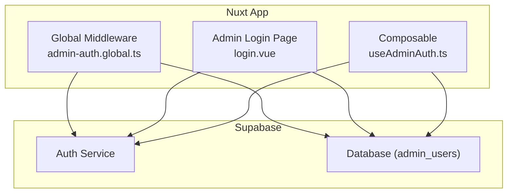
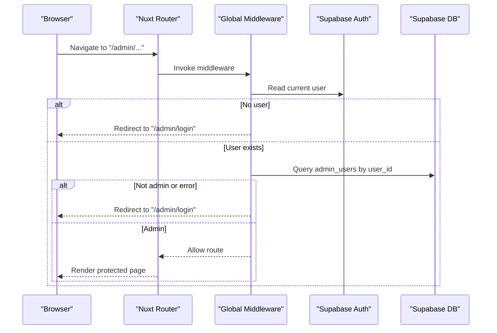
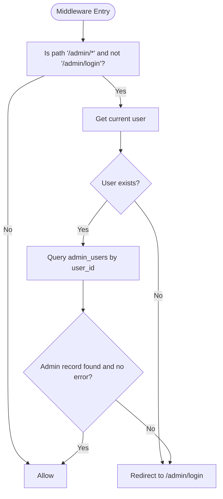
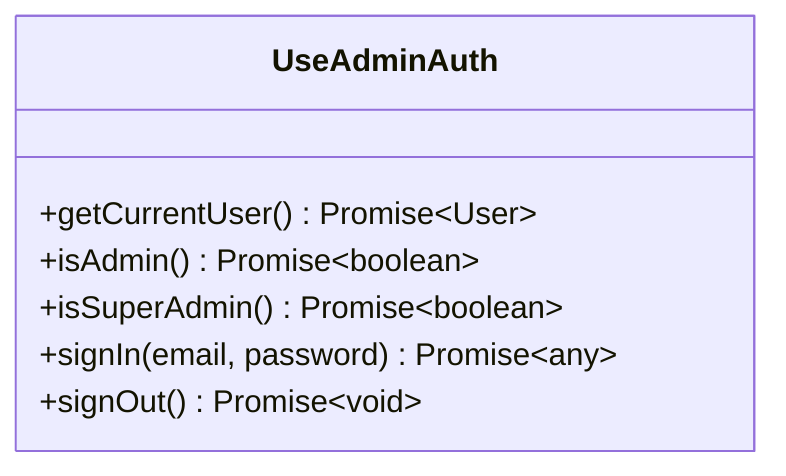
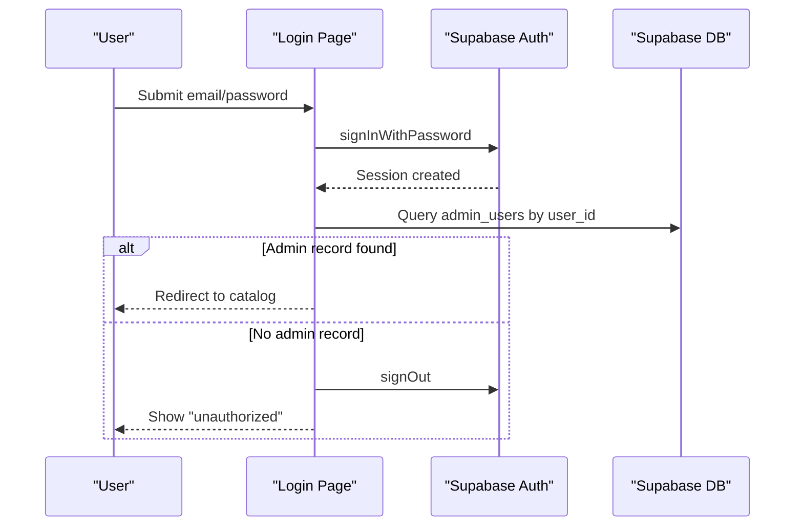
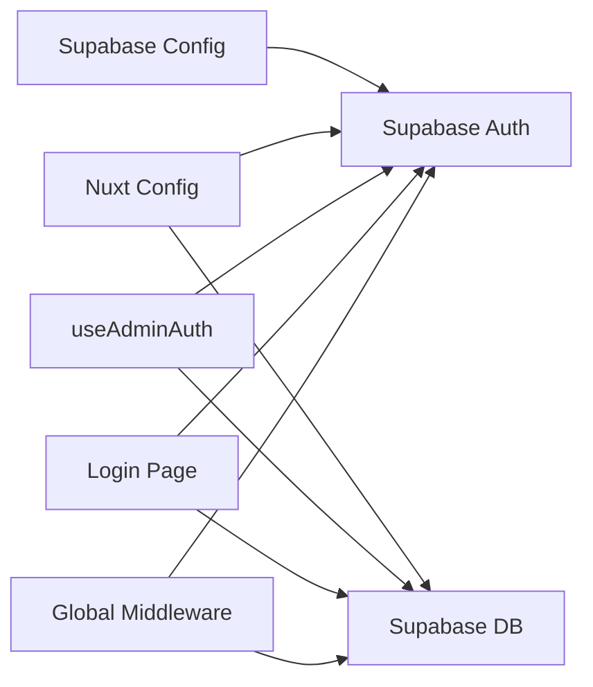

# Middleware & Route Protection

<cite>
**Referenced Files in This Document**
- [admin-auth.global.ts](file://app/middleware/admin-auth.global.ts)
- [useAdminAuth.ts](file://app/composables/useAdminAuth.ts)
- [login.vue](file://app/pages/admin/login.vue)
- [supabase.ts](file://server/utils/supabase.ts)
- [config.toml](file://supabase/config.toml)
- [nuxt.config.ts](file://nuxt.config.ts)
</cite>

## Table of Contents
1. [Introduction](#introduction)
2. [Project Structure](#project-structure)
3. [Core Components](#core-components)
4. [Architecture Overview](#architecture-overview)
5. [Detailed Component Analysis](#detailed-component-analysis)
6. [Dependency Analysis](#dependency-analysis)
7. [Performance Considerations](#performance-considerations)
8. [Troubleshooting Guide](#troubleshooting-guide)
9. [Conclusion](#conclusion)
10. [Appendices](#appendices)

## Introduction
This document explains how the application protects administrative routes using a global middleware and integrates with Supabase authentication. It covers:
- How the global admin middleware guards /admin/* routes, checks authentication state, verifies admin roles, and redirects unauthorized users.
- How the admin login flow authenticates users via Supabase, validates admin privileges, and manages sessions.
- How to implement custom middleware for different protection levels, handle errors gracefully, and redirect based on roles.
- Security considerations including token validation, session management, and protecting sensitive routes.

## Project Structure
The middleware and auth-related code is organized as follows:
- Global route guard for admin routes lives in the middleware directory.
- Admin authentication helpers are exposed via a composable.
- The admin login page implements sign-in and role verification before granting access.
- Server-side utilities provide an admin client using the service role key.
- Nuxt configuration wires up Supabase integration and runtime config.
- Supabase local configuration defines auth behavior and redirect URLs.

**Diagram sources**
- [admin-auth.global.ts:1-28](file://app/middleware/admin-auth.global.ts#L1-L28)
- [useAdminAuth.ts:1-79](file://app/composables/useAdminAuth.ts#L1-L79)
- [login.vue:1-121](file://app/pages/admin/login.vue#L1-L121)

**Section sources**
- [admin-auth.global.ts:1-28](file://app/middleware/admin-auth.global.ts#L1-L28)
- [useAdminAuth.ts:1-79](file://app/composables/useAdminAuth.ts#L1-L79)
- [login.vue:1-121](file://app/pages/admin/login.vue#L1-L121)
- [nuxt.config.ts:1-52](file://nuxt.config.ts#L1-L52)
- [config.toml:1-32](file://supabase/config.toml#L1-L32)

## Core Components
- Global admin middleware: Guards all /admin/* routes except the login page. Checks if a user is authenticated and present in the admin_users table; otherwise redirects to login.
- Admin auth composable: Provides getCurrentUser, isAdmin, isSuperAdmin, signIn, and signOut methods that interact with Supabase Auth and the admin_users table.
- Admin login page: Handles email/password sign-in, validates admin privileges, shows errors, and navigates away after successful login.
- Server-side admin client: Creates a Supabase client with the service role key for privileged server operations.

**Section sources**
- [admin-auth.global.ts:1-28](file://app/middleware/admin-auth.global.ts#L1-L28)
- [useAdminAuth.ts:1-79](file://app/composables/useAdminAuth.ts#L1-L79)
- [login.vue:1-121](file://app/pages/admin/login.vue#L1-L121)
- [supabase.ts:1-20](file://server/utils/supabase.ts#L1-L20)

## Architecture Overview
The system uses Nuxt’s global middleware to enforce access control at the route level. On each request to /admin/*, the middleware:
- Skips the check for non-admin paths and the login page.
- Reads the current user from Supabase.
- If no user is found, redirects to the login page.
- Queries the admin_users table to verify admin status.
- Redirects to login if not authorized or if any error occurs.

**Diagram sources**
- [admin-auth.global.ts:1-28](file://app/middleware/admin-auth.global.ts#L1-L28)

**Section sources**
- [admin-auth.global.ts:1-28](file://app/middleware/admin-auth.global.ts#L1-L28)

## Detailed Component Analysis

### Global Admin Middleware (admin-auth.global.ts)
Responsibilities:
- Scope: Protects only /admin/* routes and excludes /admin/login.
- Authentication: Uses the Supabase user store to detect logged-in state.
- Authorization: Queries admin_users to confirm the user has admin privileges.
- Redirection: Redirects unauthenticated or unauthorized users to /admin/login.
- Error handling: Logs errors and treats them as unauthorized, redirecting to login.

Key behaviors:
- Early return for non-admin paths and the login page.
- Redirect with replace to avoid history stack issues.
- Safe fallback on database errors to prevent exposing internal details.

**Diagram sources**
- [admin-auth.global.ts:1-28](file://app/middleware/admin-auth.global.ts#L1-L28)

**Section sources**
- [admin-auth.global.ts:1-28](file://app/middleware/admin-auth.global.ts#L1-L28)

### Admin Auth Composable (useAdminAuth.ts)
Provides reusable functions for authentication and authorization:
- getCurrentUser: Retrieves the latest user from Supabase Auth or falls back to the reactive user store.
- isAdmin: Checks if the current user exists in admin_users.
- isSuperAdmin: Checks if the current user’s role equals super_admin.
- signIn: Authenticates using email/password.
- signOut: Signs out the current user.

Error handling:
- Errors from database queries are logged and treated as false for permission checks.
- Sign-in/sign-out propagate errors to callers for UI feedback.

**Diagram sources**
- [useAdminAuth.ts:1-79](file://app/composables/useAdminAuth.ts#L1-L79)

**Section sources**
- [useAdminAuth.ts:1-79](file://app/composables/useAdminAuth.ts#L1-L79)

### Admin Login Flow (login.vue)
Flow:
- Validates inputs and prevents submission when empty.
- Calls signIn to authenticate via Supabase.
- Verifies admin presence in admin_users.
- If not an admin, signs out and displays an unauthorized message.
- On success, navigates to the catalog home page.

Error handling:
- Displays localized error messages.
- Ensures sign-out on invalid admin credentials.

**Diagram sources**
- [login.vue:1-121](file://app/pages/admin/login.vue#L1-L121)

**Section sources**
- [login.vue:1-121](file://app/pages/admin/login.vue#L1-L121)

### Server-Side Admin Client (supabase.ts)
Purpose:
- Creates a Supabase client using the service role key for server-side privileged operations.
- Disables session persistence and auto-refresh since it runs on the server.

Configuration:
- Requires both public URL and service role key; throws if missing.

Use cases:
- Backend-only tasks such as seeding admin records or performing admin actions without relying on client tokens.

**Section sources**
- [supabase.ts:1-20](file://server/utils/supabase.ts#L1-L20)

## Dependency Analysis
- Middleware depends on Supabase user store and database to validate admin status.
- Login page depends on the auth composable and Supabase client for sign-in and admin verification.
- Composable depends on Supabase Auth and admin_users table for role checks.
- Nuxt configuration provides Supabase module settings and runtime config keys.
- Supabase local config sets auth site URL and allowed redirect URLs.

**Diagram sources**
- [admin-auth.global.ts:1-28](file://app/middleware/admin-auth.global.ts#L1-L28)
- [useAdminAuth.ts:1-79](file://app/composables/useAdminAuth.ts#L1-L79)
- [login.vue:1-121](file://app/pages/admin/login.vue#L1-L121)
- [nuxt.config.ts:1-52](file://nuxt.config.ts#L1-L52)
- [config.toml:1-32](file://supabase/config.toml#L1-L32)

**Section sources**
- [nuxt.config.ts:1-52](file://nuxt.config.ts#L1-L52)
- [config.toml:1-32](file://supabase/config.toml#L1-L32)

## Performance Considerations
- Middleware performs one database query per protected route visit. Consider caching admin status in the session or client state if frequent checks occur.
- Avoid redundant calls to getCurrentUser by reusing the reactive user store where possible.
- Keep error logging concise to reduce overhead while retaining diagnostic value.
- Ensure Supabase RLS policies are configured to minimize unnecessary data exposure and speed up queries.

[No sources needed since this section provides general guidance]

## Troubleshooting Guide
Common issues and resolutions:
- Redirect loop to login: Occurs when admin_users lookup fails or returns no record. Verify the user exists in admin_users and that the middleware handles errors by redirecting to login.
- Unauthorized after login: Indicates the user lacks an admin record. Ensure admin record creation and correct user_id mapping.
- Missing environment variables: Server-side admin client requires SUPABASE_SERVICE_ROLE_KEY and NUXT_PUBLIC_SUPABASE_URL. Validate runtime config values.
- Redirect URL mismatches: Ensure Supabase auth site_url and additional_redirect_urls include your app’s base URL.

Actionable checks:
- Confirm middleware logs and redirects to /admin/login on errors.
- Validate admin_users contains a row for the authenticated user.
- Inspect runtime config and Supabase module configuration for correct keys and URLs.

**Section sources**
- [admin-auth.global.ts:1-28](file://app/middleware/admin-auth.global.ts#L1-L28)
- [login.vue:1-121](file://app/pages/admin/login.vue#L1-L121)
- [supabase.ts:1-20](file://server/utils/supabase.ts#L1-L20)
- [nuxt.config.ts:1-52](file://nuxt.config.ts#L1-L52)
- [config.toml:1-32](file://supabase/config.toml#L1-L32)

## Conclusion
The application enforces strict access control for administrative routes through a global middleware that validates both authentication and admin privileges via Supabase. The admin login flow ensures only authorized users can proceed, while the composable provides reusable tools for role checks and session management. Proper configuration of environment variables and Supabase settings is essential for secure and reliable operation.

[No sources needed since this section summarizes without analyzing specific files]

## Appendices

### Implementing Custom Middleware for Different Protection Levels
- Create a new middleware file under the middleware directory.
- Define a route guard that checks the current user and their roles using the admin auth composable.
- Redirect unauthorized users to appropriate pages (e.g., login or home).
- Handle errors by logging and treating them as unauthorized.

Example pattern:
- Guard specific routes like /admin/settings by checking isSuperAdmin.
- For read-only admin areas, check isAdmin.
- For public sections, skip checks entirely.

**Section sources**
- [useAdminAuth.ts:1-79](file://app/composables/useAdminAuth.ts#L1-L79)
- [admin-auth.global.ts:1-28](file://app/middleware/admin-auth.global.ts#L1-L28)

### Managing User Redirects Based on Roles
- After sign-in, use isAdmin/isSuperAdmin to determine destination:
  - Super admin: navigate to admin dashboard.
  - Admin: navigate to admin area.
  - Regular user: navigate to catalog or home.
- In middleware, always redirect to login if not authenticated or not authorized.

**Section sources**
- [login.vue:1-121](file://app/pages/admin/login.vue#L1-L121)
- [useAdminAuth.ts:1-79](file://app/composables/useAdminAuth.ts#L1-L79)

### Security Considerations
- Token validation: Always rely on Supabase Auth to manage tokens; do not trust client-side role flags alone.
- Server-side operations: Use the service role client only on the server for privileged actions.
- Database policies: Configure Row Level Security to restrict access to admin_users and other sensitive tables.
- Redirect safety: Whitelist redirect targets to prevent open redirect vulnerabilities.
- Error handling: Avoid leaking internal errors to clients; log server-side and show generic messages to users.

**Section sources**
- [supabase.ts:1-20](file://server/utils/supabase.ts#L1-L20)
- [nuxt.config.ts:1-52](file://nuxt.config.ts#L1-L52)
- [config.toml:1-32](file://supabase/config.toml#L1-L32)