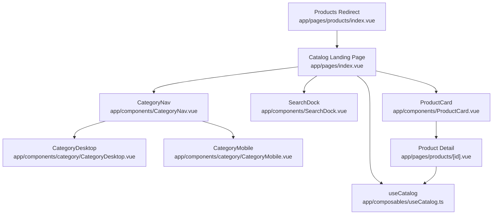
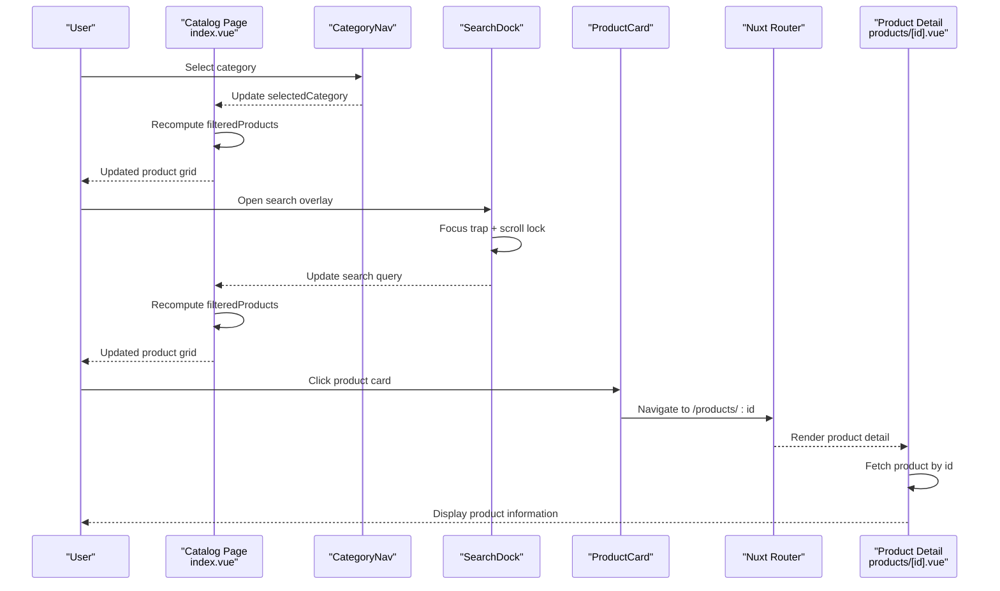
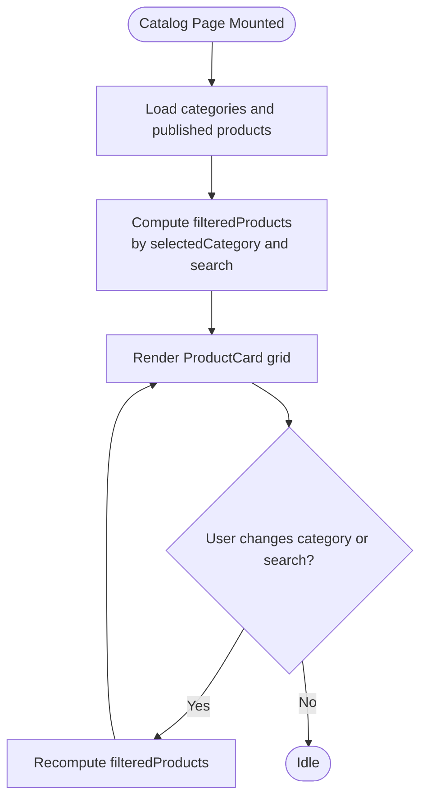
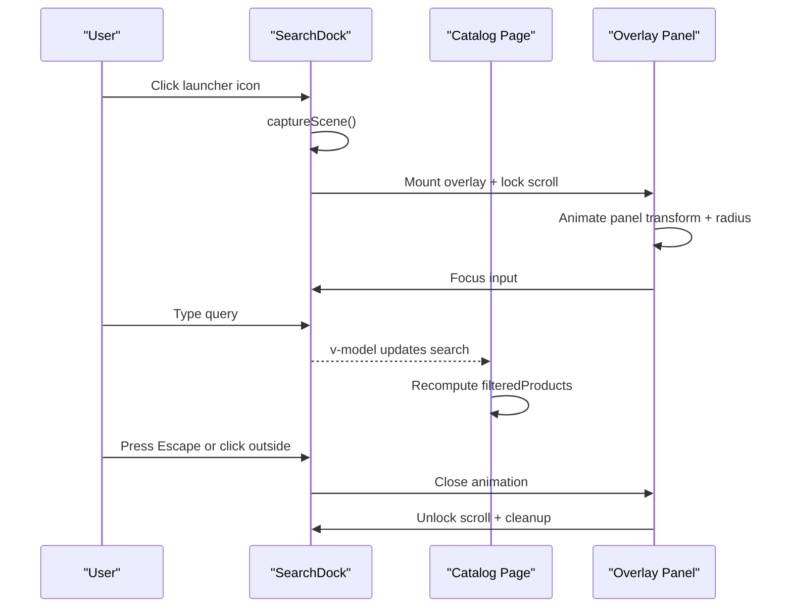
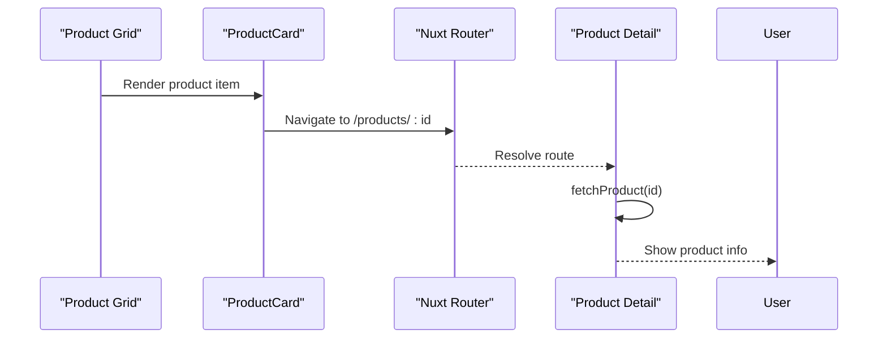
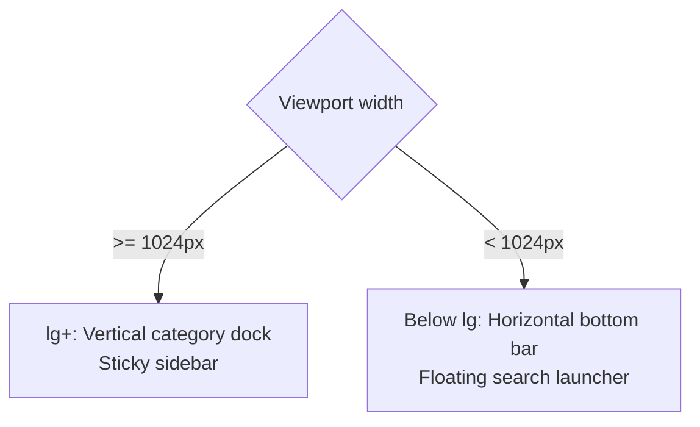
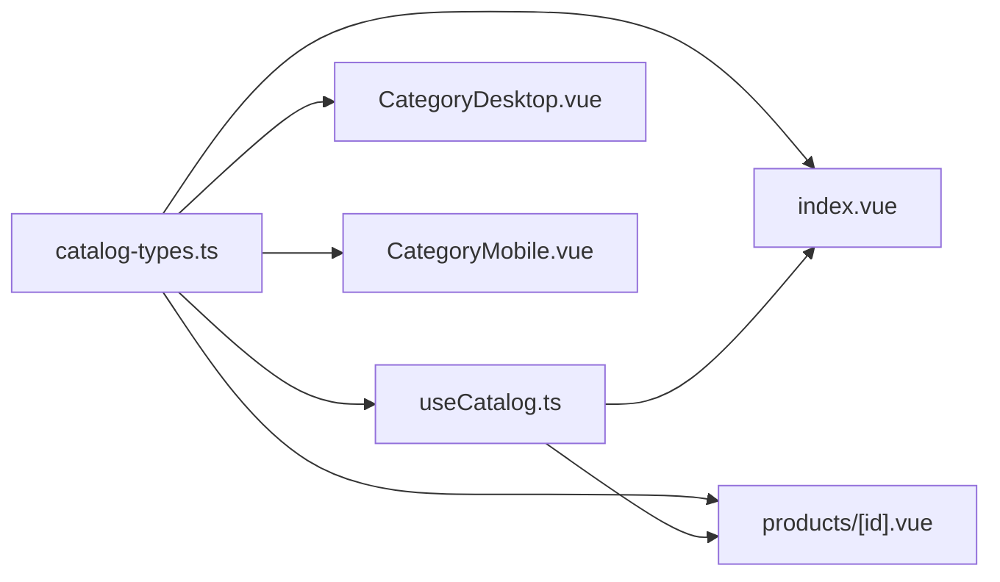

# Navigation & User Flow

<cite>
**Referenced Files in This Document**
- [index.vue](file://app/pages/index.vue)
- [CategoryNav.vue](file://app/components/CategoryNav.vue)
- [CategoryDesktop.vue](file://app/components/category/CategoryDesktop.vue)
- [CategoryMobile.vue](file://app/components/category/CategoryMobile.vue)
- [SearchDock.vue](file://app/components/SearchDock.vue)
- [ProductCard.vue](file://app/components/ProductCard.vue)
- [products-index.vue](file://app/pages/products/index.vue)
- [products-id.vue](file://app/pages/products/[id].vue)
- [useCatalog.ts](file://app/composables/useCatalog.ts)
- [catalog-types.ts](file://app/types/catalog.ts)
- [nuxt-config.ts](file://nuxt.config.ts)
</cite>

## Table of Contents
1. [Introduction](#introduction)
2. [Project Structure](#project-structure)
3. [Core Components](#core-components)
4. [Architecture Overview](#architecture-overview)
5. [Detailed Component Analysis](#detailed-component-analysis)
6. [Dependency Analysis](#dependency-analysis)
7. [Performance Considerations](#performance-considerations)
8. [Troubleshooting Guide](#troubleshooting-guide)
9. [Conclusion](#conclusion)

## Introduction
This document explains the navigation patterns and user flow for the catalog application. It covers:
- The main entry point from the catalog landing page.
- Category filtering through `CategoryNav` and its desktop/mobile variants.
- Real-time product filtering through `SearchDock`.
- Product detail navigation via Nuxt routing.
- Programmatic navigation, guards, and state management.
- Responsive behavior, mobile menu patterns, and accessibility considerations.
- Performance strategies for large catalogs, lazy loading, and prefetching.

The implementation is centered around a single-page catalog layout that composes category selection, search input, sorting, and product cards into one cohesive browsing experience.

## Project Structure
The navigation-related code lives primarily under `app/pages`, `app/components`, and `app/composables`:
- Pages define routes and orchestrate data fetching.
- Components implement UI interactions such as category selection and search overlay.
- Composables encapsulate shared Supabase queries and data mapping.



**Diagram sources**
- [index.vue:243-328](file://app/pages/index.vue#L243-L328)
- [CategoryNav.vue:19-35](file://app/components/CategoryNav.vue#L19-L35)
- [CategoryDesktop.vue:425-608](file://app/components/category/CategoryDesktop.vue#L425-L608)
- [CategoryMobile.vue:405-576](file://app/components/category/CategoryMobile.vue#L405-L576)
- [SearchDock.vue:448-627](file://app/components/SearchDock.vue#L448-L627)
- [ProductCard.vue:9-67](file://app/components/ProductCard.vue#L9-L67)
- [products-index.vue:1-8](file://app/pages/products/index.vue#L1-L8)
- [products-id.vue:1-47](file://app/pages/products/[id].vue#L1-L47)
- [useCatalog.ts:37-59](file://app/composables/useCatalog.ts#L37-L59)

**Section sources**
- [index.vue:1-189](file://app/pages/index.vue#L1-L189)
- [nuxt-config.ts:1-52](file://nuxt.config.ts#L1-L52)

## Core Components
- Catalog landing page (`index.vue`) loads categories and products, computes filtered and sorted results, and renders the sidebar with `CategoryNav` and `SearchDock`.
- `CategoryNav` delegates to responsive subcomponents:
  - `CategoryDesktop` provides a vertical dock with magnification and drag-to-select.
  - `CategoryMobile` provides a horizontal bottom bar with touch-drag selection.
- `SearchDock` provides an animated full-screen search overlay with focus trapping, scroll locking, and keyboard navigation.
- `ProductCard` links to product details using Nuxt’s `<NuxtLink>`.
- `products/[id].vue` fetches a single product and displays gallery, price, stock status, description, and specifications.

Key responsibilities:
- State ownership: `selectedCategory`, `search`, and `sortOrder` live on the catalog page.
- Filtering logic: computed filtering by category and text query.
- Data layer: `useCatalog` centralizes Supabase queries and product mapping.

**Section sources**
- [index.vue:26-63](file://app/pages/index.vue#L26-L63)
- [index.vue:101-120](file://app/pages/index.vue#L101-L120)
- [CategoryNav.vue:1-37](file://app/components/CategoryNav.vue#L1-L37)
- [SearchDock.vue:1-446](file://app/components/SearchDock.vue#L1-L446)
- [ProductCard.vue:1-68](file://app/components/ProductCard.vue#L1-L68)
- [products-id.vue:1-47](file://app/pages/products/[id].vue#L1-L47)
- [useCatalog.ts:1-61](file://app/composables/useCatalog.ts#L1-L61)

## Architecture Overview
The navigation architecture follows a unidirectional data flow:
- User interactions update local reactive state on the catalog page.
- Reactive computed values filter and sort the product list.
- Components render based on this state without direct cross-component communication beyond props and events.
- Routing is declarative via Nuxt’s file-based routing and `<NuxtLink>`.



**Diagram sources**
- [index.vue:46-63](file://app/pages/index.vue#L46-L63)
- [index.vue:243-328](file://app/pages/index.vue#L243-L328)
- [CategoryNav.vue:19-35](file://app/components/CategoryNav.vue#L19-L35)
- [SearchDock.vue:288-352](file://app/components/SearchDock.vue#L288-L352)
- [ProductCard.vue:13-24](file://app/components/ProductCard.vue#L13-L24)
- [products-id.vue:10-20](file://app/pages/products/[id].vue#L10-L20)

## Detailed Component Analysis

### Catalog Landing Page Navigation Flow
The catalog page owns the primary navigation state:
- `selectedCategory` drives category filtering.
- `search` drives real-time text filtering.
- `sortOrder` controls result ordering.
- `filteredProducts` combines both filters and sorts before rendering.



**Diagram sources**
- [index.vue:101-120](file://app/pages/index.vue#L101-L120)
- [index.vue:46-63](file://app/pages/index.vue#L46-L63)
- [index.vue:319-327](file://app/pages/index.vue#L319-L327)

**Section sources**
- [index.vue:26-63](file://app/pages/index.vue#L26-L63)
- [index.vue:101-120](file://app/pages/index.vue#L101-L120)
- [index.vue:243-328](file://app/pages/index.vue#L243-L328)

### CategoryNav Component
`CategoryNav` is a thin wrapper that selects between desktop and mobile implementations:
- Desktop: vertical dock with magnification, hover effects, and drag-to-select.
- Mobile: fixed bottom bar with horizontal scrolling and touch-drag selection.
- Both emit `update:modelValue` to synchronize the parent’s `selectedCategory`.

```mermaid
classDiagram
class CategoryNav {
+string modelValue
+CatalogCategory[] categories
+emit("update : modelValue", value)
}
class CategoryDesktop {
+string modelValue
+CatalogCategory[] categories
+handleSelect(item)
+drag-to-select()
+magnification-hover()
}
class CategoryMobile {
+string modelValue
+CatalogCategory[] categories
+handleSelect(item)
+touch-drag-select()
+scroll-active-item()
}
CategoryNav --> CategoryDesktop : "renders when lg+"
CategoryNav --> CategoryMobile : "renders below lg"
CategoryDesktop --> CategoryNav : "emits update : modelValue"
CategoryMobile --> CategoryNav : "emits update : modelValue"
```

**Diagram sources**
- [CategoryNav.vue:1-37](file://app/components/CategoryNav.vue#L1-L37)
- [CategoryDesktop.vue:20-91](file://app/components/category/CategoryDesktop.vue#L20-L91)
- [CategoryMobile.vue:20-91](file://app/components/category/CategoryMobile.vue#L20-L91)

Accessibility highlights:
- Category buttons use `role="tab"` and `aria-selected`.
- Nav elements expose `aria-label` for screen readers.
- Keyboard focus rings are provided via Tailwind utilities.

**Section sources**
- [CategoryNav.vue:1-37](file://app/components/CategoryNav.vue#L1-L37)
- [CategoryDesktop.vue:425-608](file://app/components/category/CategoryDesktop.vue#L425-L608)
- [CategoryMobile.vue:405-576](file://app/components/category/CategoryMobile.vue#L405-L576)

### SearchDock Component
`SearchDock` implements a sophisticated search overlay:
- Animated morph from launcher icon to a pill-shaped input field.
- Scroll locking while open to keep sticky elements stable.
- Focus trap cycling between input and close button.
- Escape key closes the overlay; outside clicks dismiss it.
- Debounced scroll detection collapses/expands the launcher and toggles visibility.



**Diagram sources**
- [SearchDock.vue:288-352](file://app/components/SearchDock.vue#L288-L352)
- [SearchDock.vue:371-420](file://app/components/SearchDock.vue#L371-L420)
- [SearchDock.vue:258-286](file://app/components/SearchDock.vue#L258-L286)
- [SearchDock.vue:204-221](file://app/components/SearchDock.vue#L204-L221)

Accessibility highlights:
- Dialog role and `aria-modal` attributes.
- `aria-expanded` on launcher buttons.
- Focus management ensures keyboard users can navigate within the overlay.

**Section sources**
- [SearchDock.vue:1-446](file://app/components/SearchDock.vue#L1-L446)
- [SearchDock.vue:448-627](file://app/components/SearchDock.vue#L448-L627)

### Product Card and Detail View
Product cards link to product detail pages:
- Each card uses `<NuxtLink>` to `/products/${product.id}`.
- Images are lazily loaded via HTML `loading="lazy"`.
- Admin mode reveals edit actions per card.

Product detail view:
- Fetches a single product by ID using `useCatalog.fetchProduct`.
- Displays gallery, price, stock status, description, and structured specs.
- Provides back navigation to the catalog.



**Diagram sources**
- [ProductCard.vue:13-24](file://app/components/ProductCard.vue#L13-L24)
- [ProductCard.vue:58-64](file://app/components/ProductCard.vue#L58-L64)
- [products-id.vue:10-20](file://app/pages/products/[id].vue#L10-L20)

**Section sources**
- [ProductCard.vue:1-68](file://app/components/ProductCard.vue#L1-L68)
- [products-id.vue:1-177](file://app/pages/products/[id].vue#L1-L177)

### Programmatic Navigation and Guards
- Redirects: `/products` redirects to the catalog root using `navigateTo('/', { replace: true })`.
- Programmatic navigation examples:
  - From a component event handler: `navigateTo('/products/' + productId)`
  - With options: `navigateTo({ path: '/products', query: { category: 'controllers' } }, { replace: false })`
- Navigation guards:
  - Global middleware can enforce authentication or admin access.
  - Route-level guards can protect admin-only pages.
- Maintaining navigation state:
  - Keep `selectedCategory`, `search`, and `sortOrder` in the catalog page.
  - Optionally persist to URL query parameters for shareable states.

**Section sources**
- [products-index.vue:1-8](file://app/pages/products/index.vue#L1-L8)
- [nuxt-config.ts:1-52](file://nuxt.config.ts#L1-L52)

### Responsive Navigation Patterns
- Desktop:
  - Sticky left sidebar with `CategoryNav` and `SearchDock` launcher.
  - Magnification and drag-to-select enhance interaction precision.
- Mobile:
  - Fixed bottom category bar with horizontal scrolling.
  - Floating search launcher positioned above the safe area.
  - Touch-drag selection and auto-scroll to active item.



**Diagram sources**
- [CategoryNav.vue:21-34](file://app/components/CategoryNav.vue#L21-L34)
- [CategoryDesktop.vue:425-608](file://app/components/category/CategoryDesktop.vue#L425-L608)
- [CategoryMobile.vue:405-576](file://app/components/category/CategoryMobile.vue#L405-L576)
- [SearchDock.vue:448-505](file://app/components/SearchDock.vue#L448-L505)

**Section sources**
- [CategoryNav.vue:1-37](file://app/components/CategoryNav.vue#L1-L37)
- [CategoryDesktop.vue:93-423](file://app/components/category/CategoryDesktop.vue#L93-L423)
- [CategoryMobile.vue:93-403](file://app/components/category/CategoryMobile.vue#L93-L403)
- [SearchDock.vue:448-505](file://app/components/SearchDock.vue#L448-L505)

### Accessibility Considerations
- Keyboard navigation:
  - Focus trap inside `SearchDock` overlay.
  - Escape key closes overlay.
  - Tab cycling between input and close button.
- Screen reader support:
  - `role="dialog"` and `aria-modal` for overlays.
  - `aria-expanded` on launcher buttons.
  - Descriptive `aria-label` attributes on nav and inputs.
- Visual feedback:
  - Focus-visible ring styles.
  - Active state indicators for selected categories.

**Section sources**
- [SearchDock.vue:258-286](file://app/components/SearchDock.vue#L258-L286)
- [SearchDock.vue:507-527](file://app/components/SearchDock.vue#L507-L527)
- [CategoryDesktop.vue:454-470](file://app/components/category/CategoryDesktop.vue#L454-L470)
- [CategoryMobile.vue:435-450](file://app/components/category/CategoryMobile.vue#L435-L450)

## Dependency Analysis
The navigation components depend on shared types and composables:
- `CatalogProduct` and `CatalogCategory` define the shape of data used across components.
- `useCatalog` centralizes data fetching and mapping, reducing duplication between catalog and product detail pages.



**Diagram sources**
- [catalog-types.ts:1-31](file://app/types/catalog.ts#L1-L31)
- [useCatalog.ts:1-61](file://app/composables/useCatalog.ts#L1-L61)
- [index.vue:1-4](file://app/pages/index.vue#L1-L4)
- [products-id.vue:1-5](file://app/pages/products/[id].vue#L1-L5)
- [CategoryDesktop.vue:1-3](file://app/components/category/CategoryDesktop.vue#L1-L3)
- [CategoryMobile.vue:1-3](file://app/components/category/CategoryMobile.vue#L1-L3)

**Section sources**
- [catalog-types.ts:1-31](file://app/types/catalog.ts#L1-L31)
- [useCatalog.ts:1-61](file://app/composables/useCatalog.ts#L1-L61)

## Performance Considerations
- Large catalogs:
  - Prefer server-side pagination or infinite scrolling if the product set grows significantly.
  - Avoid client-side filtering over thousands of items; consider debouncing search input and limiting initial load size.
- Lazy loading:
  - Product images already use `loading="lazy"` in `ProductCard`.
  - Consider lazy-loading heavy components like `SearchDock`’s overlay only when needed (already implemented).
- Efficient data prefetching:
  - Preload product detail data when hovering or focusing a product card using Nuxt’s `useAsyncData` or `preloadRouteComponents`.
  - Prefetch categories and top products on app startup to reduce perceived latency.
- Rendering optimization:
  - Memoize computed filtering where possible.
  - Use virtualized lists for very long product grids.
- Network efficiency:
  - Batch requests for categories and products as currently done with `Promise.all`.
  - Cache responses at the browser level or via service workers for repeat visits.

[No sources needed since this section provides general guidance]

## Troubleshooting Guide
Common issues and resolutions:
- Search overlay does not close:
  - Ensure `Escape` key handling is present and focus trap is correctly initialized.
  - Verify event listeners are removed on unmount.
- Category selection not updating:
  - Confirm `v-model` binding on `CategoryNav` and emitted `update:modelValue`.
  - Check that `selectedCategory` is reactive and used in computed filtering.
- Product detail not loading:
  - Validate `fetchProduct` returns data for the given ID.
  - Handle error states and display user-friendly messages.
- Mobile menu not visible:
  - Check breakpoint conditions and Teleport usage for mobile components.
  - Ensure scroll direction detection is not hiding the bar unintentionally.

**Section sources**
- [SearchDock.vue:258-286](file://app/components/SearchDock.vue#L258-L286)
- [SearchDock.vue:429-445](file://app/components/SearchDock.vue#L429-L445)
- [CategoryNav.vue:19-35](file://app/components/CategoryNav.vue#L19-L35)
- [index.vue:46-63](file://app/pages/index.vue#L46-L63)
- [products-id.vue:10-20](file://app/pages/products/[id].vue#L10-L20)

## Conclusion
The navigation system centers on a clean separation of concerns:
- The catalog page owns global navigation state and filtering logic.
- `CategoryNav` provides rich, responsive category selection.
- `SearchDock` offers an accessible, animated search experience.
- Product cards and detail views integrate seamlessly with Nuxt routing.
- Shared types and composables ensure consistency and maintainability.

For future enhancements, consider:
- Persisting navigation state in URL query parameters.
- Implementing server-side search and pagination.
- Adding prefetching strategies for anticipated user actions.
- Expanding accessibility testing across devices and assistive technologies.

[No sources needed since this section summarizes without analyzing specific files]