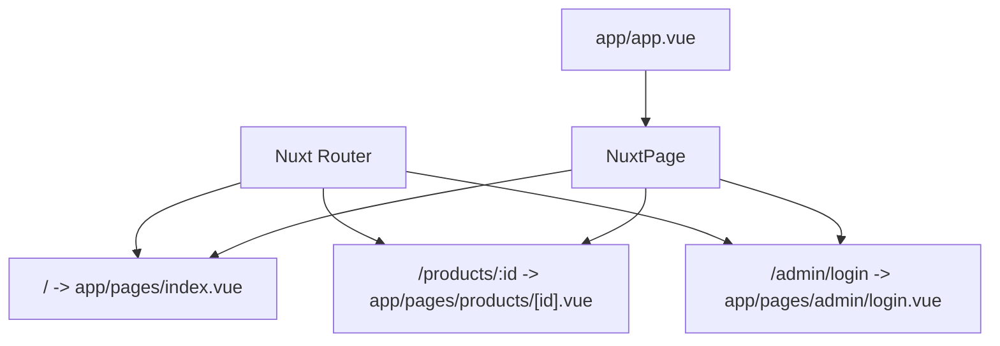
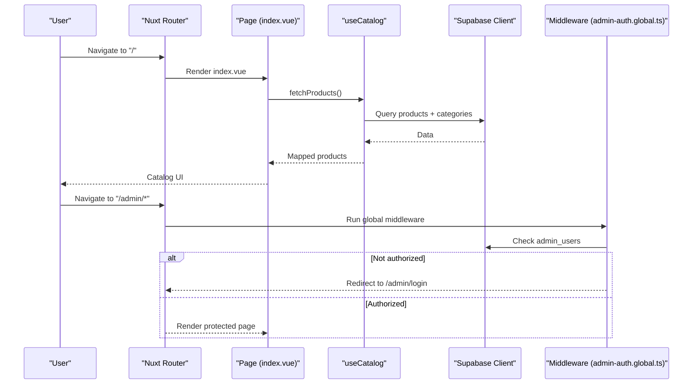
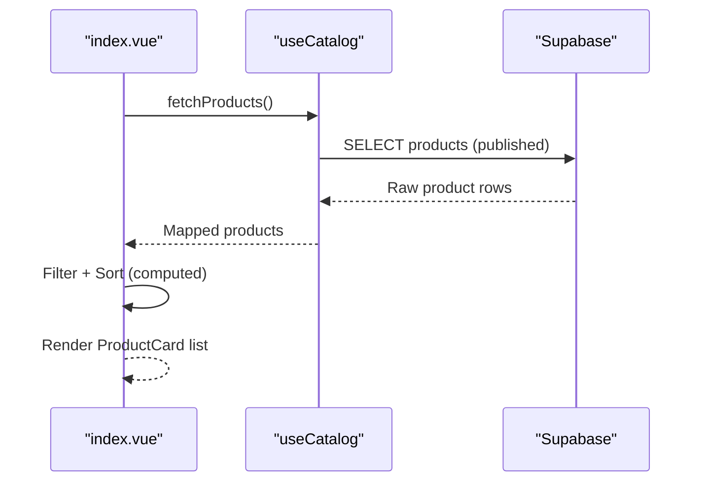
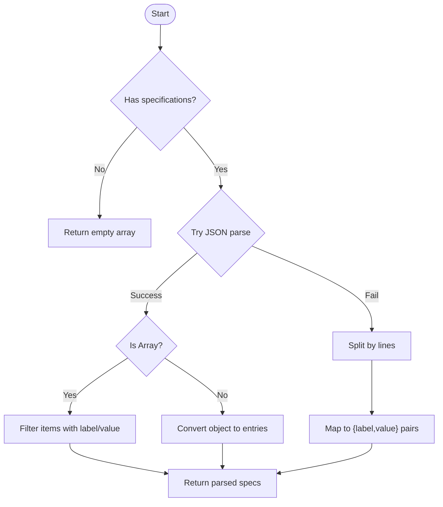
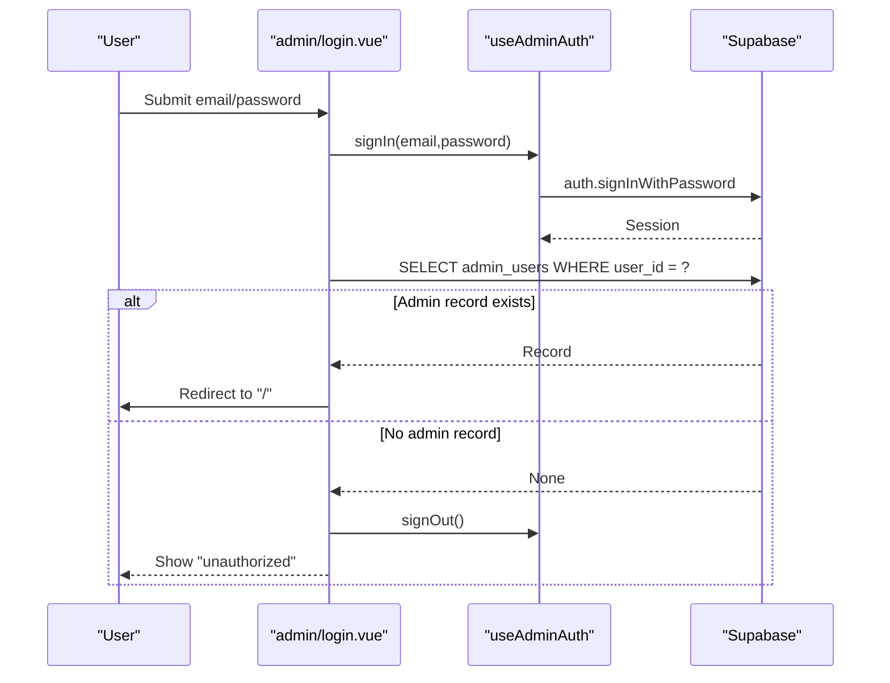
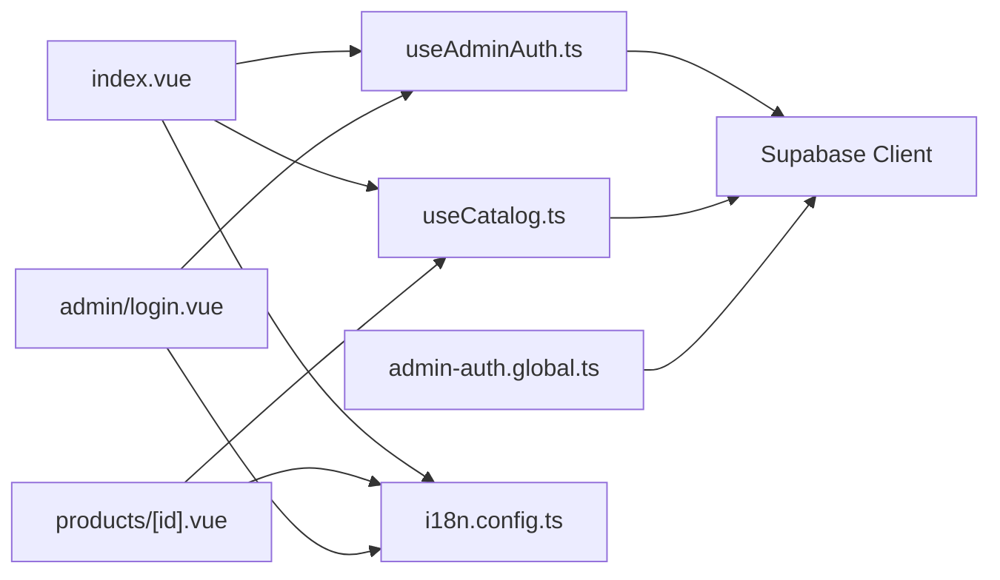

# Page Structure & Organization

<cite>
**Referenced Files in This Document**
- [index.vue](file://app/pages/index.vue)
- [products/[id].vue](file://app/pages/products/[id].vue)
- [admin/login.vue](file://app/pages/admin/login.vue)
- [app.vue](file://app/app.vue)
- [nuxt.config.ts](file://nuxt.config.ts)
- [useCatalog.ts](file://app/composables/useCatalog.ts)
- [useAdminAuth.ts](file://app/composables/useAdminAuth.ts)
- [admin-auth.global.ts](file://app/middleware/admin-auth.global.ts)
- [i18n.config.ts](file://i18n.config.ts)
</cite>

## Table of Contents
1. Introduction
2. Project Structure
3. Core Components
4. Architecture Overview
5. Detailed Component Analysis
6. Dependency Analysis
7. Performance Considerations
8. Troubleshooting Guide
9. Conclusion

## Introduction
This document explains the Nuxt.js page structure and organization patterns used in the project. It covers file-based routing, directory conventions, and how pages map to routes. It focuses on:
- The main catalog landing page (index.vue) for browsing products
- The dynamic product detail page (products/[id].vue) for individual product views
- The admin login page (admin/login.vue) for administrative access
It also describes script setup patterns, template organization, styling approaches, integration with data fetching and state management, SEO considerations, and performance strategies.

## Project Structure
The application uses Nuxt’s file-based routing under app/pages. Each Vue SFC maps directly to a route path:
- app/pages/index.vue → /
- app/pages/products/[id].vue → /products/:id
- app/pages/admin/login.vue → /admin/login

Global layout is minimal; app.vue renders NuxtPage, delegating rendering to matched pages. Routing configuration and modules are declared in nuxt.config.ts.

**Diagram sources**
- [app.vue:1-4](file://app/app.vue#L1-L4)
- [nuxt.config.ts:1-52](file://nuxt.config.ts#L1-L52)

**Section sources**
- [app.vue:1-4](file://app/app.vue#L1-L4)
- [nuxt.config.ts:1-52](file://nuxt.config.ts#L1-L52)

## Core Components
- Pages:
  - index.vue: Catalog landing with search, category filtering, sorting, and admin CRUD modal
  - products/[id].vue: Dynamic product detail with image gallery, specs, and stock status
  - admin/login.vue: Admin authentication form with validation and error handling
- Composables:
  - useCatalog.ts: Data fetching for products, categories, and mapping to typed models
  - useAdminAuth.ts: Authentication helpers for sign-in/sign-out and role checks
- Middleware:
  - admin-auth.global.ts: Guards /admin/* routes, redirects unauthenticated users to /admin/login
- Internationalization:
  - i18n.config.ts: Locale definitions and messages used across pages

Key responsibilities:
- Routing and navigation via Nuxt’s file system
- Data fetching through Supabase client within composables or pages
- UI composition using shared components (e.g., ProductCard, CategoryNav, SearchDock, StockStatus)
- Global behavior via middleware and config

**Section sources**
- [index.vue:1-465](file://app/pages/index.vue#L1-L465)
- [products/[id].vue:1-177](file://app/pages/products/[id].vue#L1-L177)
- [admin/login.vue:1-121](file://app/pages/admin/login.vue#L1-L121)
- [useCatalog.ts:1-61](file://app/composables/useCatalog.ts#L1-L61)
- [useAdminAuth.ts:1-79](file://app/composables/useAdminAuth.ts#L1-L79)
- [admin-auth.global.ts:1-28](file://app/middleware/admin-auth.global.ts#L1-L28)
- [i18n.config.ts:1-14](file://i18n.config.ts#L1-L14)

## Architecture Overview
Pages integrate with Supabase via composables and utilities. Authentication is handled by Supabase Auth and enforced by middleware. Internationalization is provided by i18n. Styling uses Tailwind classes and global CSS.

**Diagram sources**
- [index.vue:101-120](file://app/pages/index.vue#L101-L120)
- [useCatalog.ts:37-57](file://app/composables/useCatalog.ts#L37-L57)
- [admin-auth.global.ts:1-28](file://app/middleware/admin-auth.global.ts#L1-L28)

## Detailed Component Analysis

### Landing Page: app/pages/index.vue
Responsibilities:
- Loads categories and published products concurrently
- Filters by category slug/name, searches by name/sku/description
- Sorts by newest, price low/high, name A-Z
- Renders product grid using ProductCard
- Provides admin mode: add/edit/delete products, manage images, and logout
- Sets page title via useHead

Data flow:
- On mount, load catalog data from Supabase
- Map raw records into typed models with translations based on current locale
- Compute filtered and sorted lists reactively
- Persist changes via Supabase and refresh catalog

SEO:
- Title set dynamically with useHead

Performance:
- Parallel queries for categories and products
- Local computed filtering/sorting avoids extra network calls
- Loading skeletons improve perceived performance

Styling:
- Tailwind utility classes for responsive layout and dark mode support

**Section sources**
- [index.vue:1-465](file://app/pages/index.vue#L1-L465)

#### Sequence: Load Catalog and Render Products

**Diagram sources**
- [index.vue:101-120](file://app/pages/index.vue#L101-L120)
- [useCatalog.ts:37-41](file://app/composables/useCatalog.ts#L37-L41)

### Dynamic Product Detail: app/pages/products/[id].vue
Responsibilities:
- Reads route param id
- Fetches single product via useCatalog.fetchProduct
- Parses specifications into structured label/value pairs
- Displays image gallery with thumbnails and selected image
- Shows stock status, price, description, and specs
- Sets dynamic page title

Error states:
- Loading skeleton while fetching
- Alert on load errors
- “Product not found” view when missing

SEO:
- Title includes product name and app name

Performance:
- Single targeted query for product by id
- Lightweight parsing for specs

**Section sources**
- [products/[id].vue:1-177](file://app/pages/products/[id].vue#L1-L177)

#### Flowchart: Parse Specifications

**Diagram sources**
- [products/[id].vue:22-43](file://app/pages/products/[id].vue#L22-L43)

### Admin Login: app/pages/admin/login.vue
Responsibilities:
- Validates email/password inputs
- Signs in user via useAdminAuth.signIn
- Verifies admin role by querying admin_users
- Redirects to catalog on success
- Displays localized error messages
- Sets page title

Security:
- Uses Supabase Auth
- Role verification prevents unauthorized access even if auth succeeds

UX:
- Loading state during submission
- Clear error alerts

**Section sources**
- [admin/login.vue:1-121](file://app/pages/admin/login.vue#L1-L121)

#### Sequence: Admin Sign-In Flow

**Diagram sources**
- [admin/login.vue:15-54](file://app/pages/admin/login.vue#L15-L54)
- [useAdminAuth.ts:56-69](file://app/composables/useAdminAuth.ts#L56-L69)

### Middleware: app/middleware/admin-auth.global.ts
Behavior:
- Guards all /admin/* routes except /admin/login
- Checks authenticated user via Supabase
- Verifies admin role in admin_users table
- Redirects to /admin/login if not authorized

Integration:
- Works globally with Nuxt’s middleware pipeline
- Ensures consistent protection across admin features

**Section sources**
- [admin-auth.global.ts:1-28](file://app/middleware/admin-auth.global.ts#L1-L28)

### Composables: Data and Auth
- useCatalog.ts
  - Provides fetchProducts, fetchProduct, fetchCategories
  - Maps raw Supabase results to typed models with localization-aware names
  - Builds public URLs for product images
- useAdminAuth.ts
  - Exposes getCurrentUser, isAdmin, isSuperAdmin, signIn, signOut
  - Queries admin_users to determine roles

These composables centralize logic and reduce duplication across pages.

**Section sources**
- [useCatalog.ts:1-61](file://app/composables/useCatalog.ts#L1-L61)
- [useAdminAuth.ts:1-79](file://app/composables/useAdminAuth.ts#L1-L79)

## Dependency Analysis
Pages depend on:
- Supabase client for data and auth
- i18n for localized strings
- Shared UI components for layout and interactions
- Middleware for route guards

**Diagram sources**
- [index.vue:1-465](file://app/pages/index.vue#L1-L465)
- [products/[id].vue:1-177](file://app/pages/products/[id].vue#L1-L177)
- [admin/login.vue:1-121](file://app/pages/admin/login.vue#L1-L121)
- [useCatalog.ts:1-61](file://app/composables/useCatalog.ts#L1-L61)
- [useAdminAuth.ts:1-79](file://app/composables/useAdminAuth.ts#L1-L79)
- [admin-auth.global.ts:1-28](file://app/middleware/admin-auth.global.ts#L1-L28)
- [i18n.config.ts:1-14](file://i18n.config.ts#L1-L14)

**Section sources**
- [index.vue:1-465](file://app/pages/index.vue#L1-L465)
- [products/[id].vue:1-177](file://app/pages/products/[id].vue#L1-L177)
- [admin/login.vue:1-121](file://app/pages/admin/login.vue#L1-L121)
- [useCatalog.ts:1-61](file://app/composables/useCatalog.ts#L1-L61)
- [useAdminAuth.ts:1-79](file://app/composables/useAdminAuth.ts#L1-L79)
- [admin-auth.global.ts:1-28](file://app/middleware/admin-auth.global.ts#L1-L28)
- [i18n.config.ts:1-14](file://i18n.config.ts#L1-L14)

## Performance Considerations
- Parallel data loading: The landing page loads categories and products concurrently to minimize total load time.
- Client-side filtering and sorting: Reduces server round-trips by computing derived lists reactively.
- Skeleton loaders: Provide immediate feedback during async operations.
- Image handling: Public URLs are generated per storage path; consider caching strategies at CDN level.
- Route-level concerns:
  - Use head meta tags for SEO titles per page
  - Keep payloads lean by selecting only needed fields
- Middleware efficiency: Minimal checks and early redirects prevent unnecessary work.

[No sources needed since this section provides general guidance]

## Troubleshooting Guide
Common issues and where to inspect:
- Catalog load failures:
  - Check error state and message in the landing page; verify Supabase connectivity and permissions
  - See error handling paths in the catalog loader
- Product detail not found:
  - Ensure product exists and is published; review fetch logic and error display
- Admin login errors:
  - Validate credentials and check admin role presence in admin_users
  - Review sign-in flow and redirection logic
- Middleware redirects:
  - If stuck on /admin/login, confirm user session and admin role lookup

Relevant locations:
- Catalog load error handling and retry
- Product detail error and not-found states
- Admin login validation and error messaging
- Middleware authorization checks

**Section sources**
- [index.vue:101-120](file://app/pages/index.vue#L101-L120)
- [products/[id].vue:10-20](file://app/pages/products/[id].vue#L10-L20)
- [admin/login.vue:15-54](file://app/pages/admin/login.vue#L15-L54)
- [admin-auth.global.ts:1-28](file://app/middleware/admin-auth.global.ts#L1-L28)

## Conclusion
The project follows Nuxt’s file-based routing with clear separation of concerns:
- Pages handle presentation and orchestration
- Composables encapsulate data fetching and business logic
- Middleware enforces security for admin areas
- Internationalization and styling are consistently applied
This structure supports scalable feature growth, maintainable code, and strong UX with robust error handling and performance optimizations.